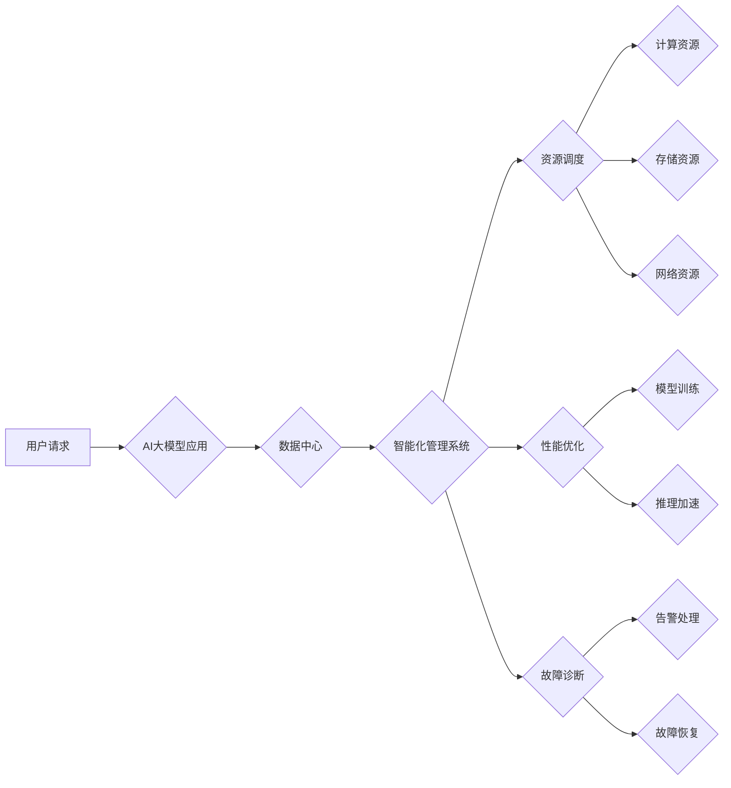

> AI大模型、数据中心、智能化管理、资源调度、性能优化、自动化运维、机器学习

## 1. 背景介绍

随着人工智能技术的飞速发展，大规模人工智能模型（AI大模型）的应用日益广泛，涵盖了自然语言处理、计算机视觉、语音识别等多个领域。这些模型通常需要海量数据进行训练和推理，对计算资源和存储资源的需求量巨大。传统的基于人工操作的数据中心管理模式已难以满足AI大模型应用的快速发展和高性能需求。因此，智能化管理成为AI大模型应用数据中心的必然趋势。

## 2. 核心概念与联系

**2.1 AI大模型应用数据中心**

AI大模型应用数据中心是指专门为训练和部署AI大模型而构建的计算资源密集型数据中心。其特点包括：

* **高性能计算能力:** 拥有大量GPU、TPU等加速器，以满足AI大模型的训练和推理需求。
* **海量存储资源:** 提供充足的存储空间，用于存储训练数据、模型参数和推理结果。
* **高效网络架构:** 建立高速、低延迟的网络，保证数据传输的效率。
* **智能化管理系统:** 利用机器学习等技术，实现对资源的自动调度、性能优化和故障诊断。

**2.2 智能化管理**

智能化管理是指利用人工智能技术，对数据中心资源进行自动化控制和优化，提高资源利用率、降低运营成本和提升服务质量。

**2.3 核心概念联系**

AI大模型应用数据中心需要智能化管理来应对其独特的挑战。智能化管理系统可以根据AI大模型的训练和推理需求，动态调度计算资源、存储资源和网络资源，以实现资源的最佳利用。同时，智能化管理系统还可以通过监控和分析数据中心运行状态，及时发现和解决潜在问题，保障数据中心的稳定运行。

**2.4  架构图**



## 3. 核心算法原理 & 具体操作步骤

**3.1 算法原理概述**

智能化管理系统通常采用机器学习算法来实现资源调度、性能优化和故障诊断等功能。常见的机器学习算法包括：

* **线性回归:** 用于预测连续值，例如资源利用率。
* **逻辑回归:** 用于分类问题，例如故障类型。
* **决策树:** 用于分类和回归问题，可以处理非线性关系。
* **支持向量机:** 用于分类问题，可以处理高维数据。
* **神经网络:** 用于复杂模式识别，例如图像识别和自然语言处理。

**3.2 算法步骤详解**

1. **数据收集:** 收集数据中心运行状态的数据，例如CPU利用率、内存利用率、网络流量等。
2. **数据预处理:** 对收集到的数据进行清洗、转换和特征工程，以提高算法的精度。
3. **模型训练:** 选择合适的机器学习算法，并使用预处理后的数据进行模型训练。
4. **模型评估:** 使用测试数据评估模型的性能，并进行模型调优。
5. **模型部署:** 将训练好的模型部署到数据中心管理系统中。
6. **实时预测:** 系统根据实时数据进行预测，并根据预测结果进行资源调度、性能优化和故障诊断。

**3.3 算法优缺点**

* **优点:**

    * 自动化程度高，可以减少人工干预。
    * 能够根据实时数据进行动态调整，提高资源利用率和服务质量。
    * 可以识别和解决潜在问题，降低故障率。

* **缺点:**

    * 需要大量的训练数据，数据质量对算法性能有重要影响。
    * 模型训练和部署需要一定的技术门槛。
    * 算法的解释性和可解释性较差，难以理解模型的决策过程。

**3.4 算法应用领域**

* **资源调度:** 根据模型训练和推理需求，动态分配计算资源、存储资源和网络资源。
* **性能优化:** 通过调整模型参数、训练策略和硬件配置，提高模型训练和推理速度。
* **故障诊断:** 识别和定位数据中心运行中的故障，并提供故障修复建议。
* **安全防护:** 检测和防御网络攻击，保护数据中心安全。

## 4. 数学模型和公式 & 详细讲解 & 举例说明

**4.1 数学模型构建**

智能化管理系统通常使用数学模型来描述数据中心运行状态和资源分配情况。例如，可以构建一个线性规划模型来优化资源分配，或者构建一个神经网络模型来预测资源需求。

**4.2 公式推导过程**

假设我们想要构建一个线性规划模型来优化计算资源分配。

* **目标函数:** 
    * 最大化资源利用率，即最大化所有计算资源的总使用时间。
* **约束条件:** 
    * 每个任务的计算资源需求必须满足。
    * 计算资源的总容量不能超过限制。

目标函数和约束条件可以表示为以下线性规划模型：

```
max ∑_{i=1}^{n} x_i
subject to:
∑_{j=1}^{m} a_{ij} x_j ≤ b_i, i = 1, 2, ..., k
x_i ≥ 0, i = 1, 2, ..., n
```

其中：

* $x_i$ 表示第 $i$ 个任务的计算资源分配量。
* $a_{ij}$ 表示第 $i$ 个任务对第 $j$ 个计算资源的需求量。
* $b_i$ 表示第 $i$ 个计算资源的总容量。
* $n$ 表示任务总数。
* $m$ 表示计算资源总数。
* $k$ 表示约束条件总数。

**4.3 案例分析与讲解**

假设我们有一个数据中心，拥有 10 个计算节点，每个节点的计算能力为 100 GFLOPS。我们有 5 个任务需要在数据中心上运行，每个任务的计算能力需求分别为 50 GFLOPS、70 GFLOPS、30 GFLOPS、90 GFLOPS 和 60 GFLOPS。

我们可以使用上述线性规划模型来优化计算资源分配。通过求解线性规划模型，我们可以得到每个任务分配到每个计算节点的资源量，以最大化资源利用率。

## 5. 项目实践：代码实例和详细解释说明

**5.1 开发环境搭建**

* 操作系统: Ubuntu 20.04
* 编程语言: Python 3.8
* 库依赖: TensorFlow, PyTorch, scikit-learn, Flask

**5.2 源代码详细实现**

```python
# 资源调度模块
def schedule_resources(tasks, resources):
    # 使用线性规划模型或其他算法进行资源调度
    # 返回每个任务分配到的资源
    pass

# 性能优化模块
def optimize_performance(model, data):
    # 使用模型调优、训练策略调整等方法优化模型性能
    # 返回优化后的模型
    pass

# 故障诊断模块
def diagnose_faults(logs):
    # 使用机器学习模型或规则引擎进行故障诊断
    # 返回故障类型和建议
    pass

# 智能化管理系统
app = Flask(__name__)

@app.route('/schedule', methods=['POST'])
def schedule():
    # 获取任务和资源信息
    tasks = request.json['tasks']
    resources = request.json['resources']
    # 调用资源调度模块进行调度
    allocated_resources = schedule_resources(tasks, resources)
    # 返回分配结果
    return jsonify(allocated_resources)

# ... 其他 API 路由

if __name__ == '__main__':
    app.run(debug=True)
```

**5.3 代码解读与分析**

* 代码示例展示了AI大模型应用数据中心的智能化管理系统的基本架构。
* 系统包含资源调度、性能优化和故障诊断三个核心模块。
* 每个模块使用不同的算法和技术实现其功能。
* 系统通过API接口提供服务，可以接收用户请求并返回相应的处理结果。

**5.4 运行结果展示**

* 系统运行后，可以接收用户提交的任务和资源信息。
* 系统会根据用户请求调用相应的模块进行处理。
* 处理结果会以JSON格式返回给用户。

## 6. 实际应用场景

**6.1 模型训练加速**

智能化管理系统可以根据模型训练需求，动态分配计算资源，并优化训练策略，从而加速模型训练速度。

**6.2 资源利用率优化**

智能化管理系统可以根据实时数据进行资源调度，提高资源利用率，降低运营成本。

**6.3 故障预测与预防**

智能化管理系统可以利用机器学习算法，预测和预防数据中心故障，提高数据中心稳定性。

**6.4 未来应用展望**

* **更智能的资源调度:** 利用更先进的机器学习算法，实现更智能、更精准的资源调度。
* **个性化服务:** 根据用户的不同需求，提供个性化的服务，例如定制化的模型训练方案。
* **自动化运维:** 实现对数据中心的自动化运维，减少人工干预，提高运维效率。

## 7. 工具和资源推荐

**7.1 学习资源推荐**

* **书籍:**
    * 《深度学习》
    * 《机器学习》
    * 《云计算架构》
* **在线课程:**
    * Coursera: 深度学习
    * edX: 机器学习
    * Udacity: 云计算

**7.2 开发工具推荐**

* **云平台:** AWS, Azure, GCP
* **容器化平台:** Docker, Kubernetes
* **机器学习框架:** TensorFlow, PyTorch, scikit-learn

**7.3 相关论文推荐**

* **资源调度:**
    * "Resource Allocation in Cloud Computing: A Survey"
    * "Dynamic Resource Allocation in Cloud Computing Environments"
* **性能优化:**
    * "Model Compression and Optimization Techniques for Deep Learning"
    * "Efficient Training of Deep Neural Networks with Limited Memory"
* **故障诊断:**
    * "Fault Diagnosis in Cloud Computing Systems: A Survey"
    * "Anomaly Detection in Cloud Computing Environments"

## 8. 总结：未来发展趋势与挑战

**8.1 研究成果总结**

智能化管理系统为AI大模型应用数据中心的建设和运营提供了重要的技术支撑。通过机器学习算法和自动化技术，智能化管理系统可以提高资源利用率、优化性能、降低运营成本和提升服务质量。

**8.2 未来发展趋势**

* **更智能的算法:** 开发更智能、更精准的机器学习算法，实现更有效的资源调度、性能优化和故障诊断。
* **更强大的计算能力:** 随着AI模型规模的不断增长，需要开发更强大的计算能力，以满足模型训练和推理需求。
* **更安全的系统:** 加强数据安全和系统安全防护，保障数据中心安全稳定运行。

**8.3 面临的挑战**

* **数据质量:** 智能化管理系统依赖于高质量的数据，数据质量问题会影响算法性能。
* **算法解释性:** 许多机器学习算法的决策过程难以解释，这会影响用户的信任和接受度。
* **系统复杂性:** 智能化管理系统涉及多个模块和技术，系统复杂性较高，需要不断优化和改进。

**8.4 研究展望**

未来，智能化管理系统将朝着更智能、更安全、更可靠的方向发展。研究者将继续探索更先进的算法和技术，以解决智能化管理系统面临的挑战，推动AI大模型应用数据中心的健康发展。

## 9. 附录：常见问题与解答

**9.1 如何评估智能化管理系统的性能？**

智能化管理系统的性能可以评估指标包括：

* 资源利用率