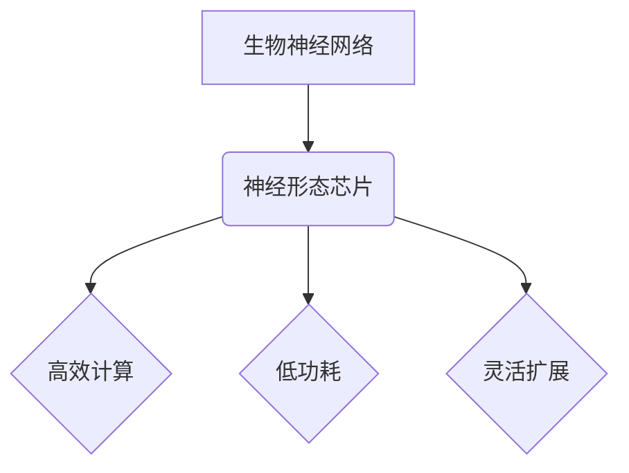

> 神经形态芯片，神经网络，生物神经网络，计算艺术，深度学习，人工智能

## 1. 背景介绍

人工智能（AI）的蓬勃发展，特别是深度学习技术的突破，为我们带来了前所未有的机遇和挑战。然而，传统的基于von Neumann架构的计算机体系结构在处理海量数据和模拟复杂神经网络时，存在着效率低下、功耗高、难以扩展等问题。为了突破这些瓶颈，构建更接近生物神经网络的计算系统成为一个重要的研究方向。

神经形态芯片，作为一种新型的计算硬件，旨在模仿生物神经网络的结构和功能，以实现更高效、更低功耗、更灵活的计算能力。它将神经元和突触的连接方式映射到物理芯片上，并利用脉冲信号进行信息传递，从而实现更接近生物神经网络的计算模式。

## 2. 核心概念与联系

### 2.1 生物神经网络

生物神经网络由大量的神经元组成，这些神经元通过突触连接相互传递信息。每个神经元接收来自其他神经元的输入信号，并根据这些信号进行处理，最终产生输出信号。生物神经网络的学习能力来自于突触连接强度的调整，即突触可塑性。

### 2.2 神经形态芯片

神经形态芯片是一种模仿生物神经网络结构和功能的计算硬件。它由大量的可编程神经元和突触组成，这些神经元和突触之间通过模拟生物神经网络的连接方式进行信息传递。

**核心概念联系：**



### 2.3 计算艺术

计算艺术是指利用计算方法创作艺术作品，它融合了艺术和技术的元素，探索了计算在艺术表达中的可能性。神经形态芯片的出现为计算艺术提供了新的工具和平台，可以利用其独特的计算能力，创造出更具表现力和交互性的艺术作品。

## 3. 核心算法原理 & 具体操作步骤

### 3.1 算法原理概述

神经形态芯片的计算主要基于以下核心算法：

* **脉冲神经网络 (Spiking Neural Networks, SNNs)**：SNNs是一种模仿生物神经网络的计算模型，神经元之间通过脉冲信号进行信息传递。
* **突触可塑性 (Synaptic Plasticity)**：突触可塑性是指突触连接强度随时间而变化的能力，它是生物神经网络学习和记忆的关键机制。
* **池化 (Pooling)**：池化是一种常用的神经网络层，用于降低数据维度，提取特征。

### 3.2 算法步骤详解

1. **数据预处理**: 将输入数据转换为神经形态芯片可处理的脉冲信号。
2. **前馈传播**: 将脉冲信号从输入层传递到输出层，每个神经元根据接收到的输入信号进行处理，并产生输出脉冲。
3. **反向传播**: 根据输出误差，调整神经元之间的突触连接强度，以最小化误差。
4. **学习**: 通过反复的前馈传播和反向传播，神经形态芯片学习数据模式，并提高预测精度。

### 3.3 算法优缺点

**优点**:

* **高效计算**: 脉冲神经网络的计算效率更高，功耗更低。
* **低功耗**: 脉冲信号的传输和处理消耗的能量更少。
* **灵活扩展**: 神经形态芯片可以灵活地扩展，以适应不同的应用场景。

**缺点**:

* **算法复杂**: 脉冲神经网络的算法相对复杂，需要更深入的理解和研究。
* **训练难度**: 训练脉冲神经网络需要更长的训练时间和更大的数据集。
* **硬件限制**: 目前的硬件技术还无法完全模拟生物神经网络的复杂性。

### 3.4 算法应用领域

* **图像识别**: 神经形态芯片可以用于识别物体、人脸、场景等。
* **语音识别**: 神经形态芯片可以用于识别语音、翻译语言等。
* **自然语言处理**: 神经形态芯片可以用于理解和生成自然语言。
* **机器人控制**: 神经形态芯片可以用于控制机器人的运动和行为。
* **医疗诊断**: 神经形态芯片可以用于辅助医生进行疾病诊断。

## 4. 数学模型和公式 & 详细讲解 & 举例说明

### 4.1 数学模型构建

神经形态芯片的计算模型可以抽象为一个图论模型，其中节点代表神经元，边代表突触连接。每个神经元接收来自其他神经元的输入信号，并根据这些信号进行处理，产生输出信号。

### 4.2 公式推导过程

**突触可塑性公式**:

$$
\Delta w_{ij} = \eta \cdot \delta_{j} \cdot x_{i}
$$

其中：

* $\Delta w_{ij}$：突触连接强度变化量
* $\eta$：学习率
* $\delta_{j}$：神经元 $j$ 的误差信号
* $x_{i}$：神经元 $i$ 的激活信号

**脉冲神经网络激活函数**:

$$
y_{i} = f( \sum_{j} w_{ij} x_{j})
$$

其中：

* $y_{i}$：神经元 $i$ 的输出脉冲
* $f$：激活函数
* $w_{ij}$：神经元 $i$ 和 $j$ 之间的突触连接强度
* $x_{j}$：神经元 $j$ 的输入脉冲

### 4.3 案例分析与讲解

**举例说明**:

假设我们有一个简单的神经形态芯片，包含两个神经元和一个突触连接。第一个神经元接收输入信号 $x_1$，第二个神经元接收来自第一个神经元的输出信号 $y_1$。

当 $x_1$ 为 1 时，第一个神经元会产生一个脉冲信号 $y_1$。如果 $y_1$ 误差信号为 0.1，学习率为 0.01，则突触连接强度 $w_{12}$ 会增加 0.001。

## 5. 项目实践：代码实例和详细解释说明

### 5.1 开发环境搭建

* 操作系统：Linux
* 编程语言：Python
* 深度学习框架：TensorFlow

### 5.2 源代码详细实现

```python
import tensorflow as tf

# 定义神经元模型
class Neuron(tf.keras.layers.Layer):
    def __init__(self, units):
        super(Neuron, self).__init__()
        self.units = units
        self.weights = tf.Variable(tf.random.normal([units]))
        self.bias = tf.Variable(tf.zeros([1]))

    def call(self, inputs):
        return tf.sigmoid(tf.matmul(inputs, self.weights) + self.bias)

# 定义神经形态芯片模型
class SpikingNeuralNetwork(tf.keras.Model):
    def __init__(self, input_size, hidden_size, output_size):
        super(SpikingNeuralNetwork, self).__init__()
        self.input_layer = tf.keras.layers.Input(shape=(input_size,))
        self.hidden_layer = Neuron(hidden_size)
        self.output_layer = Neuron(output_size)

    def call(self, inputs):
        hidden_output = self.hidden_layer(inputs)
        output = self.output_layer(hidden_output)
        return output

# 实例化模型
model = SpikingNeuralNetwork(input_size=10, hidden_size=5, output_size=1)

# 训练模型
model.compile(optimizer='adam', loss='mse')
model.fit(x_train, y_train, epochs=10)

```

### 5.3 代码解读与分析

* **Neuron类**: 定义了一个神经元模型，包含权重、偏置和激活函数。
* **SpikingNeuralNetwork类**: 定义了一个神经形态芯片模型，包含输入层、隐藏层和输出层。
* **模型实例化和训练**: 实例化模型，并使用Adam优化器和均方误差损失函数进行训练。

### 5.4 运行结果展示

训练完成后，可以将模型应用于新的数据进行预测。

## 6. 实际应用场景

### 6.1 图像识别

神经形态芯片可以用于识别物体、人脸、场景等。由于其低功耗和高效计算的特点，非常适合部署在移动设备上，例如智能手机、无人机等。

### 6.2 语音识别

神经形态芯片可以用于识别语音、翻译语言等。其脉冲神经网络的结构更接近生物神经网络，可以更好地模拟语音信号的复杂性。

### 6.3 自然语言处理

神经形态芯片可以用于理解和生成自然语言。例如，可以用于机器翻译、文本摘要、对话系统等。

### 6.4 机器人控制

神经形态芯片可以用于控制机器人的运动和行为。其灵活的结构和高效的计算能力，可以使机器人更好地适应复杂的环境。

### 6.5 医疗诊断

神经形态芯片可以用于辅助医生进行疾病诊断。例如，可以用于分析医学图像、识别病理特征等。

## 7. 工具和资源推荐

### 7.1 学习资源推荐

* **书籍**:
    * 《神经形态计算》
    * 《深度学习》
* **在线课程**:
    * Coursera: 深度学习
    * edX: 神经形态计算

### 7.2 开发工具推荐

* **TensorFlow**: 深度学习框架
* **PyTorch**: 深度学习框架
* **Neuromorphic Computing Platform**: 神经形态计算平台

### 7.3 相关论文推荐

* **论文**:
    * 《A Survey of Neuromorphic Computing》
    * 《Spiking Neural Networks: A Comprehensive Review》

## 8. 总结：未来发展趋势与挑战

### 8.1 研究成果总结

神经形态芯片技术取得了显著的进展，在图像识别、语音识别、自然语言处理等领域展现出巨大的潜力。

### 8.2 未来发展趋势

* **芯片性能提升**: 提高芯片的计算速度、存储容量和连接密度。
* **算法创新**: 开发更先进的脉冲神经网络算法，提高模型的精度和效率。
* **应用拓展**: 将神经形态芯片应用于更多领域，例如机器人控制、医疗诊断等。

### 8.3 面临的挑战

* **硬件限制**: 目前的硬件技术还无法完全模拟生物神经网络的复杂性。
* **算法复杂**: 脉冲神经网络的算法相对复杂，需要更深入的理解和研究。
* **应用场景**: 需要更多针对性应用场景的开发和研究。

### 8.4 研究展望

未来，神经形态芯片技术将继续发展，并与人工智能、机器学习等领域深度融合，为我们带来更多创新和突破。

## 9. 附录：常见问题与解答

### 9.1 什么是神经形态芯片？

神经形态芯片是一种模仿生物神经网络结构和功能的计算硬件。

### 9.2 神经形态芯片有什么优势？

神经形态芯片具有高效计算、低功耗、灵活扩展等优势。

### 9.3 神经形态芯片有哪些应用场景？

神经形态芯片可以应用于图像识别、语音识别、自然语言处理、机器人控制、医疗诊断等领域。

### 9.4 神经形态芯片的未来发展趋势是什么？

未来，神经形态芯片技术将继续发展，并与人工智能、机器学习等领域深度融合，为我们带来更多创新和突破。

作者：禅与计算机程序设计艺术 / Zen and the Art of Computer Programming


<end_of_turn>