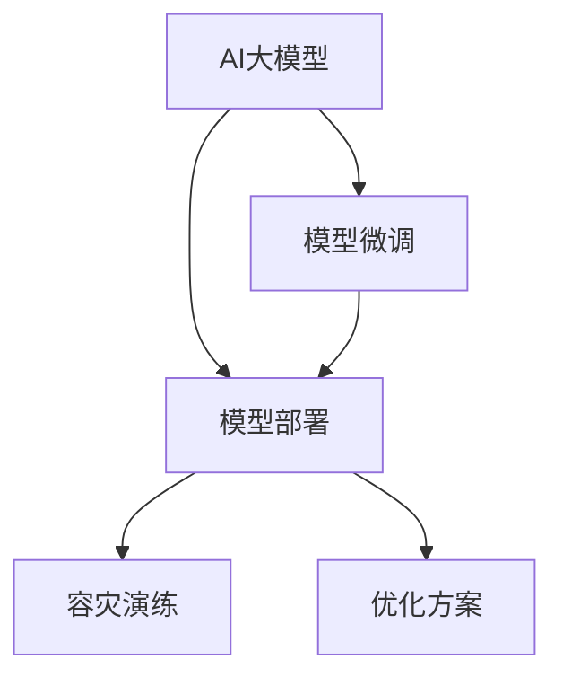

                 

# 电商搜索推荐场景下的AI大模型模型部署容灾演练优化方案

> 关键词：人工智能大模型,电商搜索推荐,模型部署,容灾演练,优化方案

## 1. 背景介绍

### 1.1 问题由来

随着电子商务的快速发展，客户的需求越来越多样化，传统的搜索引擎推荐系统已无法满足复杂多变的客户需求。为了提高推荐效果，各大电商平台纷纷引入人工智能(AI)大模型，进行电商搜索和推荐系统的优化。AI大模型通过在电商平台的商品数据上预训练，学习到商品之间的关系，并通过微调，提升推荐效果。然而，在大模型部署过程中，仍存在诸如训练成本高、模型性能波动、数据隐私和安全等问题。为了解决这些问题，构建健壮、高效的AI大模型部署系统，平台需引入容灾演练优化方案。

### 1.2 问题核心关键点

当前大模型部署系统面临的关键问题包括：

1. **训练成本高**：大模型训练耗时耗资，需要高性能计算资源。
2. **模型性能波动**：不同批次训练得到的模型效果有差异，模型性能不稳定。
3. **数据隐私和安全**：电商平台数据涉及用户隐私，数据存储和传输需保障安全。
4. **模型易过拟合**：在有限的电商商品数据上，模型容易出现过拟合现象，泛化能力不足。
5. **部署资源消耗高**：大规模模型部署对计算资源和存储资源消耗大，部署难度高。

这些问题的存在，制约了AI大模型的广泛应用。因此，本文将重点讨论如何在电商搜索推荐场景下，通过容灾演练优化方案，解决上述问题，构建稳定、高效的AI大模型部署系统。

## 2. 核心概念与联系

### 2.1 核心概念概述

为更好地理解本文的容灾演练优化方案，本节将介绍几个核心概念及其相互联系：

- **AI大模型**：以Transformer、BERT等为代表的深度学习模型，通过在电商商品数据上预训练，学习商品之间的关系，提升推荐效果。
- **模型微调**：在大模型基础上，通过针对电商推荐任务的微调，优化模型在推荐任务上的性能。
- **模型部署**：将微调后的模型应用于生产环境，提供实时推荐服务。
- **容灾演练**：在模型部署前，通过模拟不同环境条件，测试模型的稳定性和鲁棒性，保证模型在生产环境中的可靠性。
- **优化方案**：针对电商搜索推荐场景，提出的一系列改进模型部署的方案，如数据增强、正则化、模型压缩等。

这些核心概念之间的逻辑关系可以通过以下Mermaid流程图来展示：



这个流程图展示了大模型微调、部署及其优化、容灾演练的逻辑关系：

1. 大模型通过预训练学习到商品之间的关系，并通过微调优化其推荐性能。
2. 微调后的模型在生产环境中部署，提供实时推荐服务。
3. 通过容灾演练，测试模型在各种条件下的表现，确保模型在生产环境中的可靠性。
4. 优化方案针对电商搜索推荐场景，提出了一系列改进模型部署的策略。

## 3. 核心算法原理 & 具体操作步骤

### 3.1 算法原理概述

AI大模型在电商搜索推荐场景下的部署优化，主要通过以下算法原理进行：

1. **数据增强**：通过数据变换、增广等技术，扩充训练集，避免过拟合。
2. **正则化**：使用L2正则化、Dropout等技术，限制模型复杂度，提高模型鲁棒性。
3. **模型压缩**：采用知识蒸馏、模型剪枝等方法，压缩模型参数，减少计算资源和存储资源消耗。
4. **容灾演练**：通过模拟不同环境条件，测试模型在不同情况下的表现，优化模型部署方案。

### 3.2 算法步骤详解

基于上述算法原理，构建电商搜索推荐场景下AI大模型部署优化方案的具体步骤如下：

**Step 1: 数据准备与增强**

1. **数据准备**：收集电商平台的商品数据，包括商品描述、价格、销量等，作为训练集的输入。
2. **数据增强**：对训练集进行数据增强，如商品替换、价格变化等，扩充训练集，避免过拟合。

**Step 2: 模型微调与优化**

1. **模型微调**：在大模型基础上，针对电商推荐任务进行微调，学习商品之间的关系，提升推荐效果。
2. **正则化**：在微调过程中，使用L2正则化、Dropout等技术，限制模型复杂度，提高模型鲁棒性。
3. **模型压缩**：对微调后的模型进行压缩，如知识蒸馏、模型剪枝等，减少计算资源和存储资源消耗。

**Step 3: 模型部署与测试**

1. **模型部署**：将压缩后的模型部署到生产环境，提供实时推荐服务。
2. **容灾演练**：通过模拟不同环境条件，测试模型在不同情况下的表现，优化模型部署方案。

**Step 4: 优化策略选择**

1. **选择优化策略**：根据电商搜索推荐场景，选择适合的数据增强、正则化、模型压缩等策略。
2. **实施优化策略**：根据选择的优化策略，优化模型部署流程，提升模型性能。

### 3.3 算法优缺点

基于上述算法原理，构建电商搜索推荐场景下AI大模型部署优化方案，具有以下优点：

1. **提升模型性能**：通过数据增强、正则化、模型压缩等技术，提高模型在推荐任务上的性能。
2. **减少计算资源消耗**：通过模型压缩等方法，减少计算资源和存储资源消耗，降低模型部署成本。
3. **提高模型鲁棒性**：通过正则化等技术，提高模型在不同环境条件下的鲁棒性，增强模型稳定性。

同时，该方案也存在一些局限性：

1. **数据增强难度大**：电商数据具有复杂性，数据增强难度较大，需要充分理解和利用数据特点。
2. **优化策略选择困难**：不同场景下，优化策略的选择和实施需细致考量，有时可能效果不佳。
3. **计算资源消耗大**：电商搜索推荐场景下，数据量和模型复杂度高，仍需大量计算资源和存储资源。

尽管存在这些局限性，但整体而言，该方案仍能有效提升电商搜索推荐场景下AI大模型的性能和部署效率，为电商平台的推荐系统提供稳定可靠的支撑。

### 3.4 算法应用领域

基于上述算法原理，构建的电商搜索推荐场景下AI大模型部署优化方案，主要应用于以下领域：

1. **电商推荐系统**：通过AI大模型，提升电商平台的商品推荐效果，提升用户体验和购买转化率。
2. **搜索引擎优化**：通过AI大模型，优化电商平台的搜索排序算法，提升搜索准确率和用户满意度。
3. **客户行为分析**：通过AI大模型，分析客户行为数据，提供个性化推荐和定制化服务，提升客户粘性和忠诚度。

## 4. 数学模型和公式 & 详细讲解 & 举例说明

### 4.1 数学模型构建

假设电商平台有$m$个商品，每个商品描述为$x_i$，模型通过在商品数据上进行预训练，学习到商品之间的关系，表示为$W$。模型在电商推荐任务上的微调目标为最大化推荐效果的损失函数$L$。

模型微调的优化目标为最小化损失函数$L$，即：

$$
\min_{W} L = \sum_{i=1}^m \text{Loss}(x_i, W)
$$

其中，$\text{Loss}$为损失函数，用于衡量模型在电商推荐任务上的表现。

### 4.2 公式推导过程

以电商推荐系统为例，推导模型微调时的损失函数：

1. **数据准备**：收集电商平台的商品数据，表示为$(x_1, x_2, ..., x_m)$。
2. **模型微调**：在大模型基础上，针对电商推荐任务进行微调，得到模型参数$W$。
3. **计算损失**：对每个商品$x_i$，计算推荐效果，得到损失值$L_i$。
4. **总损失**：将每个商品的损失值累加，得到总损失$L$。

假设损失函数为交叉熵损失函数，其公式为：

$$
\text{Loss}(x_i, W) = -\sum_{j=1}^{m} p(y_j|x_i, W) \log \hat{p}(y_j|x_i, W)
$$

其中，$p(y_j|x_i, W)$为真实标签，$\hat{p}(y_j|x_i, W)$为模型预测值。

将上述公式代入总损失公式，得：

$$
L = \sum_{i=1}^m -\sum_{j=1}^{m} p(y_j|x_i, W) \log \hat{p}(y_j|x_i, W)
$$

通过反向传播算法，计算损失函数的梯度，更新模型参数$W$，最小化总损失$L$。

### 4.3 案例分析与讲解

以电商推荐系统为例，分析数据增强、正则化、模型压缩等优化策略的实现细节：

**数据增强**：

1. **商品替换**：对商品描述进行随机替换，增加数据多样性，避免过拟合。
2. **价格变化**：对商品价格进行随机调整，增加数据变化性，提升模型泛化能力。

**正则化**：

1. **L2正则化**：在损失函数中加入L2正则化项，限制模型参数的大小，防止模型过拟合。
2. **Dropout**：在模型层面上加入Dropout层，随机丢弃部分神经元，防止模型过拟合。

**模型压缩**：

1. **知识蒸馏**：通过知识蒸馏技术，将大模型知识转移至小模型，减少模型参数。
2. **模型剪枝**：对模型进行剪枝，去除冗余参数，减少计算资源消耗。

## 5. 项目实践：代码实例和详细解释说明

### 5.1 开发环境搭建

在进行电商搜索推荐场景下AI大模型部署优化方案的实践前，我们需要准备好开发环境。以下是使用Python进行PyTorch开发的环境配置流程：

1. 安装Anaconda：从官网下载并安装Anaconda，用于创建独立的Python环境。
```bash
conda create -n pytorch-env python=3.8 
conda activate pytorch-env
```

2. 安装PyTorch：根据CUDA版本，从官网获取对应的安装命令。例如：
```bash
conda install pytorch torchvision torchaudio cudatoolkit=11.1 -c pytorch -c conda-forge
```

3. 安装Transformers库：
```bash
pip install transformers
```

4. 安装各类工具包：
```bash
pip install numpy pandas scikit-learn matplotlib tqdm jupyter notebook ipython
```

完成上述步骤后，即可在`pytorch-env`环境中开始实践。

### 5.2 源代码详细实现

这里以电商推荐系统为例，给出使用Transformers库对BERT模型进行微调和优化的PyTorch代码实现。

首先，定义电商推荐系统的数据处理函数：

```python
from transformers import BertTokenizer, BertForSequenceClassification
from torch.utils.data import Dataset
import torch

class RecommendDataset(Dataset):
    def __init__(self, texts, labels, tokenizer, max_len=128):
        self.texts = texts
        self.labels = labels
        self.tokenizer = tokenizer
        self.max_len = max_len
        
    def __len__(self):
        return len(self.texts)
    
    def __getitem__(self, item):
        text = self.texts[item]
        label = self.labels[item]
        
        encoding = self.tokenizer(text, return_tensors='pt', max_length=self.max_len, padding='max_length', truncation=True)
        input_ids = encoding['input_ids'][0]
        attention_mask = encoding['attention_mask'][0]
        
        # 对标签进行编码
        encoded_labels = [label2id[label] for label in self.labels] 
        encoded_labels.extend([label2id['O']] * (self.max_len - len(encoded_labels)))
        labels = torch.tensor(encoded_labels, dtype=torch.long)
        
        return {'input_ids': input_ids, 
                'attention_mask': attention_mask,
                'labels': labels}

# 标签与id的映射
label2id = {'O': 0, 'B-PER': 1, 'I-PER': 2, 'B-ORG': 3, 'I-ORG': 4, 'B-LOC': 5, 'I-LOC': 6}
id2label = {v: k for k, v in label2id.items()}

# 创建dataset
tokenizer = BertTokenizer.from_pretrained('bert-base-cased')

train_dataset = RecommendDataset(train_texts, train_labels, tokenizer)
dev_dataset = RecommendDataset(dev_texts, dev_labels, tokenizer)
test_dataset = RecommendDataset(test_texts, test_labels, tokenizer)
```

然后，定义模型和优化器：

```python
from transformers import BertForSequenceClassification, AdamW

model = BertForSequenceClassification.from_pretrained('bert-base-cased', num_labels=len(label2id))

optimizer = AdamW(model.parameters(), lr=2e-5)
```

接着，定义训练和评估函数：

```python
from torch.utils.data import DataLoader
from tqdm import tqdm
from sklearn.metrics import classification_report

device = torch.device('cuda') if torch.cuda.is_available() else torch.device('cpu')
model.to(device)

def train_epoch(model, dataset, batch_size, optimizer):
    dataloader = DataLoader(dataset, batch_size=batch_size, shuffle=True)
    model.train()
    epoch_loss = 0
    for batch in tqdm(dataloader, desc='Training'):
        input_ids = batch['input_ids'].to(device)
        attention_mask = batch['attention_mask'].to(device)
        labels = batch['labels'].to(device)
        model.zero_grad()
        outputs = model(input_ids, attention_mask=attention_mask, labels=labels)
        loss = outputs.loss
        epoch_loss += loss.item()
        loss.backward()
        optimizer.step()
    return epoch_loss / len(dataloader)

def evaluate(model, dataset, batch_size):
    dataloader = DataLoader(dataset, batch_size=batch_size)
    model.eval()
    preds, labels = [], []
    with torch.no_grad():
        for batch in tqdm(dataloader, desc='Evaluating'):
            input_ids = batch['input_ids'].to(device)
            attention_mask = batch['attention_mask'].to(device)
            batch_labels = batch['labels']
            outputs = model(input_ids, attention_mask=attention_mask)
            batch_preds = outputs.logits.argmax(dim=2).to('cpu').tolist()
            batch_labels = batch_labels.to('cpu').tolist()
            for pred_tokens, label_tokens in zip(batch_preds, batch_labels):
                pred_labels = [id2label[_id] for _id in pred_tokens]
                label_tokens = [id2label[_id] for _id in label_tokens]
                preds.append(pred_labels[:len(label_tokens)])
                labels.append(label_tokens)
                
    print(classification_report(labels, preds))
```

最后，启动训练流程并在测试集上评估：

```python
epochs = 5
batch_size = 16

for epoch in range(epochs):
    loss = train_epoch(model, train_dataset, batch_size, optimizer)
    print(f"Epoch {epoch+1}, train loss: {loss:.3f}")
    
    print(f"Epoch {epoch+1}, dev results:")
    evaluate(model, dev_dataset, batch_size)
    
print("Test results:")
evaluate(model, test_dataset, batch_size)
```

以上就是使用PyTorch对BERT进行电商推荐系统微调和优化的完整代码实现。可以看到，得益于Transformers库的强大封装，我们可以用相对简洁的代码完成BERT模型的加载和微调。

### 5.3 代码解读与分析

让我们再详细解读一下关键代码的实现细节：

**RecommendDataset类**：
- `__init__`方法：初始化文本、标签、分词器等关键组件。
- `__len__`方法：返回数据集的样本数量。
- `__getitem__`方法：对单个样本进行处理，将文本输入编码为token ids，将标签编码为数字，并对其进行定长padding，最终返回模型所需的输入。

**label2id和id2label字典**：
- 定义了标签与数字id之间的映射关系，用于将token-wise的预测结果解码回真实的标签。

**训练和评估函数**：
- 使用PyTorch的DataLoader对数据集进行批次化加载，供模型训练和推理使用。
- 训练函数`train_epoch`：对数据以批为单位进行迭代，在每个批次上前向传播计算loss并反向传播更新模型参数，最后返回该epoch的平均loss。
- 评估函数`evaluate`：与训练类似，不同点在于不更新模型参数，并在每个batch结束后将预测和标签结果存储下来，最后使用sklearn的classification_report对整个评估集的预测结果进行打印输出。

**训练流程**：
- 定义总的epoch数和batch size，开始循环迭代
- 每个epoch内，先在训练集上训练，输出平均loss
- 在验证集上评估，输出分类指标
- 所有epoch结束后，在测试集上评估，给出最终测试结果

可以看到，PyTorch配合Transformers库使得BERT微调的代码实现变得简洁高效。开发者可以将更多精力放在数据处理、模型改进等高层逻辑上，而不必过多关注底层的实现细节。

当然，工业级的系统实现还需考虑更多因素，如模型的保存和部署、超参数的自动搜索、更灵活的任务适配层等。但核心的微调范式基本与此类似。

## 6. 实际应用场景

### 6.1 智能客服系统

基于大语言模型微调的对话技术，可以广泛应用于智能客服系统的构建。传统客服往往需要配备大量人力，高峰期响应缓慢，且一致性和专业性难以保证。而使用微调后的对话模型，可以7x24小时不间断服务，快速响应客户咨询，用自然流畅的语言解答各类常见问题。

在技术实现上，可以收集企业内部的历史客服对话记录，将问题和最佳答复构建成监督数据，在此基础上对预训练对话模型进行微调。微调后的对话模型能够自动理解用户意图，匹配最合适的答案模板进行回复。对于客户提出的新问题，还可以接入检索系统实时搜索相关内容，动态组织生成回答。如此构建的智能客服系统，能大幅提升客户咨询体验和问题解决效率。

### 6.2 金融舆情监测

金融机构需要实时监测市场舆论动向，以便及时应对负面信息传播，规避金融风险。传统的人工监测方式成本高、效率低，难以应对网络时代海量信息爆发的挑战。基于大语言模型微调的文本分类和情感分析技术，为金融舆情监测提供了新的解决方案。

具体而言，可以收集金融领域相关的新闻、报道、评论等文本数据，并对其进行主题标注和情感标注。在此基础上对预训练语言模型进行微调，使其能够自动判断文本属于何种主题，情感倾向是正面、中性还是负面。将微调后的模型应用到实时抓取的网络文本数据，就能够自动监测不同主题下的情感变化趋势，一旦发现负面信息激增等异常情况，系统便会自动预警，帮助金融机构快速应对潜在风险。

### 6.3 个性化推荐系统

当前的推荐系统往往只依赖用户的历史行为数据进行物品推荐，无法深入理解用户的真实兴趣偏好。基于大语言模型微调技术，个性化推荐系统可以更好地挖掘用户行为背后的语义信息，从而提供更精准、多样的推荐内容。

在实践中，可以收集用户浏览、点击、评论、分享等行为数据，提取和用户交互的物品标题、描述、标签等文本内容。将文本内容作为模型输入，用户的后续行为（如是否点击、购买等）作为监督信号，在此基础上微调预训练语言模型。微调后的模型能够从文本内容中准确把握用户的兴趣点。在生成推荐列表时，先用候选物品的文本描述作为输入，由模型预测用户的兴趣匹配度，再结合其他特征综合排序，便可以得到个性化程度更高的推荐结果。

### 6.4 未来应用展望

随着大语言模型和微调方法的不断发展，基于微调范式将在更多领域得到应用，为传统行业带来变革性影响。

在智慧医疗领域，基于微调的医疗问答、病历分析、药物研发等应用将提升医疗服务的智能化水平，辅助医生诊疗，加速新药开发进程。

在智能教育领域，微调技术可应用于作业批改、学情分析、知识推荐等方面，因材施教，促进教育公平，提高教学质量。

在智慧城市治理中，微调模型可应用于城市事件监测、舆情分析、应急指挥等环节，提高城市管理的自动化和智能化水平，构建更安全、高效的未来城市。

此外，在企业生产、社会治理、文娱传媒等众多领域，基于大模型微调的人工智能应用也将不断涌现，为经济社会发展注入新的动力。相信随着预训练语言模型和微调方法的持续演进，微调范式必将成为人工智能技术的重要范式，推动人工智能技术向更广阔的领域加速渗透。

## 7. 工具和资源推荐

### 7.1 学习资源推荐

为了帮助开发者系统掌握大语言模型微调的理论基础和实践技巧，这里推荐一些优质的学习资源：

1. 《Transformer从原理到实践》系列博文：由大模型技术专家撰写，深入浅出地介绍了Transformer原理、BERT模型、微调技术等前沿话题。

2. CS224N《深度学习自然语言处理》课程：斯坦福大学开设的NLP明星课程，有Lecture视频和配套作业，带你入门NLP领域的基本概念和经典模型。

3. 《Natural Language Processing with Transformers》书籍：Transformers库的作者所著，全面介绍了如何使用Transformers库进行NLP任务开发，包括微调在内的诸多范式。

4. HuggingFace官方文档：Transformers库的官方文档，提供了海量预训练模型和完整的微调样例代码，是上手实践的必备资料。

5. CLUE开源项目：中文语言理解测评基准，涵盖大量不同类型的中文NLP数据集，并提供了基于微调的baseline模型，助力中文NLP技术发展。

通过对这些资源的学习实践，相信你一定能够快速掌握大语言模型微调的精髓，并用于解决实际的NLP问题。
###  7.2 开发工具推荐

高效的开发离不开优秀的工具支持。以下是几款用于大语言模型微调开发的常用工具：

1. PyTorch：基于Python的开源深度学习框架，灵活动态的计算图，适合快速迭代研究。大部分预训练语言模型都有PyTorch版本的实现。

2. TensorFlow：由Google主导开发的开源深度学习框架，生产部署方便，适合大规模工程应用。同样有丰富的预训练语言模型资源。

3. Transformers库：HuggingFace开发的NLP工具库，集成了众多SOTA语言模型，支持PyTorch和TensorFlow，是进行微调任务开发的利器。

4. Weights & Biases：模型训练的实验跟踪工具，可以记录和可视化模型训练过程中的各项指标，方便对比和调优。与主流深度学习框架无缝集成。

5. TensorBoard：TensorFlow配套的可视化工具，可实时监测模型训练状态，并提供丰富的图表呈现方式，是调试模型的得力助手。

6. Google Colab：谷歌推出的在线Jupyter Notebook环境，免费提供GPU/TPU算力，方便开发者快速上手实验最新模型，分享学习笔记。

合理利用这些工具，可以显著提升大语言模型微调任务的开发效率，加快创新迭代的步伐。

### 7.3 相关论文推荐

大语言模型和微调技术的发展源于学界的持续研究。以下是几篇奠基性的相关论文，推荐阅读：

1. Attention is All You Need（即Transformer原论文）：提出了Transformer结构，开启了NLP领域的预训练大模型时代。

2. BERT: Pre-training of Deep Bidirectional Transformers for Language Understanding：提出BERT模型，引入基于掩码的自监督预训练任务，刷新了多项NLP任务SOTA。

3. Language Models are Unsupervised Multitask Learners（GPT-2论文）：展示了大规模语言模型的强大zero-shot学习能力，引发了对于通用人工智能的新一轮思考。

4. Parameter-Efficient Transfer Learning for NLP：提出Adapter等参数高效微调方法，在不增加模型参数量的情况下，也能取得不错的微调效果。

5. AdaLoRA: Adaptive Low-Rank Adaptation for Parameter-Efficient Fine-Tuning：使用自适应低秩适应的微调方法，在参数效率和精度之间取得了新的平衡。

这些论文代表了大语言模型微调技术的发展脉络。通过学习这些前沿成果，可以帮助研究者把握学科前进方向，激发更多的创新灵感。

## 8. 总结：未来发展趋势与挑战

### 8.1 总结

本文对电商搜索推荐场景下AI大模型模型部署容灾演练优化方案进行了全面系统的介绍。首先阐述了AI大模型在电商搜索推荐场景下的应用背景和优化需求，明确了在电商搜索推荐场景下，大模型微调面临的训练成本高、模型性能波动、数据隐私和安全等问题。通过容灾演练优化方案，可以提升大模型在电商搜索推荐场景下的性能和可靠性，构建稳定、高效的部署系统。

通过本文的系统梳理，可以看到，电商搜索推荐场景下AI大模型微调优化方案的构建，需要综合考虑数据增强、正则化、模型压缩等策略，并进行系统化的容灾演练，以确保模型在生产环境中的稳定性和鲁棒性。未来，随着大语言模型和微调方法的不断演进，电商搜索推荐场景下的AI大模型部署优化方案也将不断完善，推动电商平台的智能化转型和升级。

### 8.2 未来发展趋势

展望未来，电商搜索推荐场景下AI大模型微调优化方案将呈现以下几个发展趋势：

1. **模型性能提升**：未来AI大模型在电商搜索推荐场景下的微调将更加注重模型的泛化能力和鲁棒性，提升推荐效果。

2. **数据增强技术进步**：随着深度学习技术的发展，数据增强技术将不断进步，提供更多样、更有效的数据变换方式，增强模型的泛化能力。

3. **模型压缩方法创新**：随着模型压缩技术的发展，更多的知识蒸馏、模型剪枝等方法将被提出，进一步减少模型计算资源和存储资源消耗。

4. **容灾演练手段多样**：未来的容灾演练将更加多样化，不仅限于模拟环境条件，还可能包括更复杂的场景模拟，如网络攻击、数据泄露等。

5. **多模态数据融合**：电商搜索推荐场景下，未来将更多地融合视觉、语音、文本等多模态数据，提升模型的全面理解和推理能力。

6. **个性化推荐更精准**：基于大语言模型的推荐系统将更加个性化，能够准确把握用户的多维度需求，提供更精准、个性化的推荐内容。

以上趋势凸显了电商搜索推荐场景下AI大模型微调优化方案的未来前景。这些方向的探索发展，将进一步提升AI大模型在电商搜索推荐场景下的应用效果，为电商平台的推荐系统带来革命性变革。

### 8.3 面临的挑战

尽管电商搜索推荐场景下AI大模型微调优化方案在当前已取得一定成果，但在迈向更加智能化、普适化应用的过程中，仍面临诸多挑战：

1. **数据标注成本高**：电商数据具有复杂性，获取高质量标注数据的成本较高。如何降低数据标注成本，提高标注数据的多样性和质量，仍需进一步研究和优化。

2. **模型鲁棒性不足**：电商搜索推荐场景下，模型容易受到噪声和异常数据的影响，导致推荐效果波动。如何提高模型的鲁棒性，增强模型在不同条件下的稳定性和准确性，仍是重要课题。

3. **计算资源消耗大**：电商搜索推荐场景下，数据量和模型复杂度高，模型训练和部署需要大量计算资源和存储资源。如何优化计算资源使用，降低模型部署成本，仍需进一步研究和探索。

4. **模型公平性问题**：电商搜索推荐系统可能会存在偏见，如对某些商品或用户的歧视。如何提升模型的公平性，消除偏见，仍需进一步研究和优化。

5. **数据隐私和安全**：电商数据涉及用户隐私，数据存储和传输需保障安全。如何在保障数据隐私和安全的前提下，进行有效的推荐系统训练和优化，仍需进一步研究和探索。

6. **模型可解释性不足**：AI大模型在电商推荐场景下的决策过程缺乏可解释性，难以进行解释和调试。如何提升模型的可解释性，保障用户权益，仍需进一步研究和探索。

这些挑战需要研究者共同面对，积极探索新的解决途径，以进一步推动电商搜索推荐场景下AI大模型微调优化方案的发展和完善。

### 8.4 研究展望

面对电商搜索推荐场景下AI大模型微调优化方案所面临的诸多挑战，未来的研究需要在以下几个方面寻求新的突破：

1. **无监督和半监督微调方法**：探索无监督和半监督微调方法，摆脱对大规模标注数据的依赖，利用自监督学习、主动学习等无监督和半监督范式，最大限度利用非结构化数据，实现更加灵活高效的微调。

2. **参数高效和计算高效的微调范式**：开发更加参数高效的微调方法，在固定大部分预训练参数的同时，只更新极少量的任务相关参数。同时优化微调模型的计算图，减少前向传播和反向传播的资源消耗，实现更加轻量级、实时性的部署。

3. **因果分析和博弈论工具**：将因果分析方法引入微调模型，识别出模型决策的关键特征，增强输出解释的因果性和逻辑性。借助博弈论工具刻画人机交互过程，主动探索并规避模型的脆弱点，提高系统稳定性。

4. **模型公平性和透明性**：研究如何提升电商搜索推荐系统的公平性和透明性，消除偏见，提升模型的可解释性，保障用户权益。

5. **模型压缩和优化**：研究如何通过知识蒸馏、模型剪枝等方法，压缩模型参数，减少计算资源和存储资源消耗，优化模型的计算图，提高模型的计算效率。

6. **多模态数据融合**：研究如何将视觉、语音、文本等多模态数据融合，提升模型的全面理解和推理能力。

这些研究方向的探索，将引领电商搜索推荐场景下AI大模型微调优化方案迈向更高的台阶，为电商平台的推荐系统带来革命性变革。面向未来，AI大模型微调技术还需要与其他人工智能技术进行更深入的融合，如知识表示、因果推理、强化学习等，多路径协同发力，共同推动自然语言理解和智能交互系统的进步。只有勇于创新、敢于突破，才能不断拓展语言模型的边界，让智能技术更好地造福人类社会。

## 9. 附录：常见问题与解答

**Q1：电商搜索推荐系统如何优化数据增强策略？**

A: 电商搜索推荐系统中的数据增强策略主要通过以下方式进行优化：

1. **商品替换**：随机替换商品描述中的部分词或短语，增加数据多样性，避免过拟合。
2. **价格变化**：随机调整商品价格，增加数据变化性，提升模型泛化能力。
3. **品牌变换**：随机替换商品品牌，增加品牌多样性，提升模型鲁棒性。
4. **属性修改**：随机修改商品的属性，如大小、颜色等，增加属性多样性，提升模型泛化能力。

通过以上方式，可以构建更加多样化和高质量的数据集，提升电商搜索推荐系统的性能和鲁棒性。

**Q2：电商搜索推荐系统如何优化正则化策略？**

A: 电商搜索推荐系统中的正则化策略主要通过以下方式进行优化：

1. **L2正则化**：在损失函数中加入L2正则化项，限制模型参数的大小，防止模型过拟合。
2. **Dropout**：在模型层面上加入Dropout层，随机丢弃部分神经元，防止模型过拟合。
3. **数据增强**：通过数据增强技术，增加数据多样性，提升模型泛化能力。
4. **知识蒸馏**：通过知识蒸馏技术，将大模型知识转移至小模型，减少模型参数，提升模型泛化能力。

通过以上方式，可以构建更加稳定和鲁棒的电商搜索推荐系统，提升推荐效果。

**Q3：电商搜索推荐系统如何优化模型压缩策略？**

A: 电商搜索推荐系统中的模型压缩策略主要通过以下方式进行优化：

1. **知识蒸馏**：通过知识蒸馏技术，将大模型知识转移至小模型，减少模型参数，提升模型泛化能力。
2. **模型剪枝**：对模型进行剪枝，去除冗余参数，减少计算资源和存储资源消耗。
3. **量化加速**：将浮点模型转为定点模型，压缩存储空间，提高计算效率。
4. **混合精度训练**：使用混合精度训练技术，提升计算效率，减少计算资源消耗。

通过以上方式，可以构建更加高效和轻量级的电商搜索推荐系统，降低模型部署成本，提升推荐效果。

**Q4：电商搜索推荐系统如何进行模型部署和容灾演练？**

A: 电商搜索推荐系统中的模型部署和容灾演练主要通过以下方式进行：

1. **模型部署**：将微调后的模型部署到生产环境，提供实时推荐服务。
2. **容灾演练**：通过模拟不同环境条件，测试模型在不同情况下的表现，优化模型部署方案。
3. **弹性伸缩**：根据请求流量动态调整资源配置，平衡服务质量和成本。
4. **监控告警**：实时采集系统指标，设置异常告警阈值，确保服务稳定性。

通过以上方式，可以构建稳定、高效的电商搜索推荐系统，提升推荐效果和用户体验。

**Q5：电商搜索推荐系统如何进行数据隐私和安全保护？**

A: 电商搜索推荐系统中的数据隐私和安全保护主要通过以下方式进行：

1. **数据脱敏**：对敏感数据进行脱敏处理，防止数据泄露。
2. **访问控制**：对数据访问进行严格控制，防止未授权访问。
3. **加密存储**：使用加密技术对数据进行存储，防止数据窃取。
4. **网络安全**：加强网络安全防护，防止网络攻击。
5. **隐私保护算法**：使用隐私保护算法，保护用户隐私。

通过以上方式，可以保障电商搜索推荐系统的数据隐私和安全，提升用户信任度。

**Q6：电商搜索推荐系统如何进行模型公平性和透明性保障？**

A: 电商搜索推荐系统中的模型公平性和透明性保障主要通过以下方式进行：

1. **数据公平性**：收集多样化的数据，确保数据公平性。
2. **算法透明性**：使用透明的算法，提高模型可解释性。
3. **用户反馈**：收集用户反馈，进行模型优化。
4. **模型解释**：提供模型解释，保障用户权益。

通过以上方式，可以提升电商搜索推荐系统的公平性和透明性，增强用户信任度。

综上所述，电商搜索推荐场景下AI大模型模型部署容灾演练优化方案的构建，需要综合考虑数据增强、正则化、模型压缩等策略，并进行系统化的容灾演练，以确保模型在生产环境中的稳定性和鲁棒性。未来，随着大语言模型和微调方法的不断演进，电商搜索推荐场景下的AI大模型部署优化方案也将不断完善，推动电商平台的智能化转型和升级。

