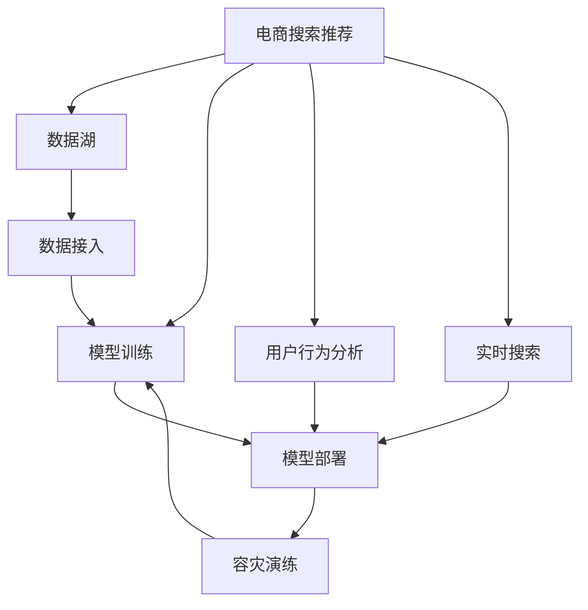

                 

# 电商搜索推荐场景下的AI大模型模型部署容灾演练方案

> 关键词：电商搜索推荐, 人工智能, 模型部署, 容灾演练, AI大模型, 推荐系统

## 1. 背景介绍

在电商领域，搜索推荐系统是用户与商品之间的桥梁。一个高效的搜索推荐系统不仅能够提供精准的商品推荐，还能提升用户体验，增加用户粘性，驱动电商平台增长。然而，随着用户规模的不断扩大和数据量的持续增长，搜索推荐系统的复杂性和可靠性也面临着严峻的挑战。近年来，基于大模型（如Transformer、BERT、GPT等）的AI技术逐步被引入电商搜索推荐系统，提升了推荐效果和个性化程度。但与此同时，由于大模型的高复杂度和高资源消耗，系统的稳定性和鲁棒性也亟需改进。为此，提出一套电商搜索推荐场景下的AI大模型模型部署容灾演练方案，旨在保障搜索推荐系统的稳定性和可靠性，应对可能出现的异常情况。

## 2. 核心概念与联系

### 2.1 核心概念概述

为更好地理解基于大模型的电商搜索推荐系统及其容灾演练方案，本节将介绍几个核心概念：

- 电商搜索推荐系统（E-commerce Search and Recommendation System）：通过分析用户历史行为和实时搜索行为，为用户推荐可能感兴趣的商品。现代搜索推荐系统广泛使用基于深度学习和自然语言处理（NLP）的AI技术，以提升推荐的精准性和个性化。

- 人工智能（Artificial Intelligence, AI）：一种通过计算机系统模拟人类智能行为的技术，包括机器学习、深度学习、自然语言处理等子领域。

- 模型部署（Model Deployment）：将训练好的模型（如大模型）部署到生产环境中，供实际业务使用。模型部署涉及模型优化、版本管理、性能监控等多个环节。

- 容灾演练（Disaster Recovery Drill）：一种模拟灾难场景的演练活动，通过模拟系统故障、数据丢失等异常情况，验证系统的容灾机制和恢复能力。容灾演练是保障系统稳定性和可靠性的重要手段。

- 模型训练（Model Training）：使用大量标注数据训练模型，使其能够完成特定任务，如分类、回归、推荐等。在大模型训练中，通常需要高性能计算资源和大规模数据集。

- 数据湖（Data Lake）：大规模、高维度的数据存储和处理平台，支持数据多样化、实时接入和长期存储。电商搜索推荐系统依赖于数据湖进行数据采集和预处理。

这些核心概念之间的逻辑关系可以通过以下Mermaid流程图来展示：



这个流程图展示了大模型驱动的电商搜索推荐系统的核心概念及其之间的关系：

1. 电商搜索推荐系统依赖于数据湖获取用户行为数据。
2. 数据湖中的数据被用于模型训练，构建电商搜索推荐系统的大模型。
3. 训练好的大模型通过模型部署，服务于电商搜索推荐系统。
4. 在模型部署的同时，进行容灾演练，提升系统的鲁棒性。
5. 用户行为分析模块实时处理用户搜索行为，并将结果输入到电商搜索推荐系统中。

## 3. 核心算法原理 & 具体操作步骤
### 3.1 算法原理概述

电商搜索推荐系统中的AI大模型通常使用Transformer结构，通过自监督学习任务（如掩码语言模型、序列预测等）进行预训练。预训练后的模型能够捕捉商品之间的语义关联，并通过用户搜索行为进行有监督的微调，生成个性化的商品推荐。模型部署的容灾演练方案基于模型故障处理、数据冗余、备份恢复等技术手段，保障电商搜索推荐系统在各种异常情况下的稳定性和可靠性。

### 3.2 算法步骤详解

#### 3.2.1 数据准备

1. **数据采集**：从电商平台的用户行为日志、搜索日志、交易日志等数据源中提取用户行为数据，形成训练集和测试集。
2. **数据预处理**：对数据进行清洗、标准化、特征工程等预处理操作，保证数据的质量和一致性。
3. **数据分割**：将数据集划分为训练集、验证集和测试集，用于模型训练、调优和评估。

#### 3.2.2 模型训练

1. **模型选择**：选择合适的预训练模型（如BERT、GPT等）作为初始模型，并在电商搜索推荐任务上进行微调。
2. **超参数设置**：根据任务特点，设置模型的超参数，如学习率、批大小、迭代轮数等。
3. **模型训练**：使用训练集对模型进行训练，并在验证集上进行调优，直到模型达到预设性能指标。

#### 3.2.3 模型部署

1. **模型优化**：对训练好的模型进行优化，如量化、剪枝、模型压缩等，减少模型的资源消耗和部署时间。
2. **模型部署**：将优化后的模型部署到生产环境中，提供实时的商品推荐服务。
3. **性能监控**：对部署的模型进行性能监控，及时发现和处理异常情况。

#### 3.2.4 容灾演练

1. **演练场景模拟**：设置各种可能的故障场景，如模型失效、服务器宕机、网络中断等，模拟异常情况。
2. **容灾策略验证**：验证电商搜索推荐系统的容灾策略和恢复机制，如模型备份、数据冗余、故障转移等。
3. **演练效果评估**：评估演练效果，根据演练结果优化系统架构和容灾策略。

### 3.3 算法优缺点

电商搜索推荐系统中的AI大模型容灾演练方案具有以下优点：

1. **高可靠性**：通过容灾演练，可以发现并修复系统中的潜在故障，提升系统的稳定性和可靠性。
2. **快速恢复**：在故障发生时，可以通过预定义的容灾策略快速恢复系统，减少对用户的影响。
3. **可扩展性**：容灾演练方案支持大规模数据集和复杂模型的部署，具有良好的可扩展性。

同时，该方案也存在一定的局限性：

1. **高资源消耗**：模型优化、部署、容灾演练等过程需要高性能计算资源，可能带来较大的资源消耗。
2. **复杂度较高**：电商搜索推荐系统涉及多个子系统，容灾演练方案需要综合考虑各子系统的协作和优化，复杂度较高。
3. **成本较高**：容灾演练方案需要投入大量人力物力进行模拟和优化，成本较高。

尽管存在这些局限性，但就目前而言，基于AI大模型的电商搜索推荐系统容灾演练方案仍是最主流的做法。未来相关研究的重点在于如何进一步降低部署和演练的成本，提高系统的容灾能力，同时兼顾可扩展性和可操作性。

### 3.4 算法应用领域

基于AI大模型的电商搜索推荐系统容灾演练方案已经在多个电商平台上得到了广泛应用，如淘宝、京东、亚马逊等。这些平台通过AI大模型驱动的搜索推荐系统，提升了推荐效果和用户体验，同时保障了系统的稳定性和可靠性。

## 4. 数学模型和公式 & 详细讲解  
### 4.1 数学模型构建

假设电商搜索推荐系统中的AI大模型为 $M_{\theta}$，其中 $\theta$ 为模型参数。设训练集为 $D=\{(x_i, y_i)\}_{i=1}^N$，其中 $x_i$ 为输入，$y_i$ 为对应的推荐结果。模型的损失函数为：

$$
\mathcal{L}(M_{\theta}) = \frac{1}{N} \sum_{i=1}^N \ell(M_{\theta}(x_i), y_i)
$$

其中 $\ell$ 为损失函数，可以是交叉熵损失、均方误差损失等。

### 4.2 公式推导过程

以交叉熵损失函数为例，其推导过程如下：

设模型 $M_{\theta}$ 在输入 $x_i$ 上的输出为 $\hat{y}_i$，则交叉熵损失函数为：

$$
\ell(M_{\theta}(x_i), y_i) = -y_i\log \hat{y}_i - (1-y_i)\log (1-\hat{y}_i)
$$

将交叉熵损失函数带入经验风险公式，得：

$$
\mathcal{L}(\theta) = -\frac{1}{N}\sum_{i=1}^N y_i\log M_{\theta}(x_i) - (1-y_i)\log(1-M_{\theta}(x_i))
$$

### 4.3 案例分析与讲解

在电商搜索推荐系统中，基于AI大模型的推荐模型通常采用分类任务的形式，即输入一个搜索请求，输出可能感兴趣的推荐商品列表。模型的输出 $\hat{y}_i$ 表示商品 $i$ 被用户点击的概率，$y_i$ 为实际标签。通过交叉熵损失函数，模型可以学习到输入与输出的映射关系，从而提升推荐效果。

## 5. 项目实践：代码实例和详细解释说明
### 5.1 开发环境搭建

在进行AI大模型电商搜索推荐系统部署和容灾演练的实践前，我们需要准备好开发环境。以下是使用Python进行TensorFlow开发的环境配置流程：

1. 安装Anaconda：从官网下载并安装Anaconda，用于创建独立的Python环境。

2. 创建并激活虚拟环境：
```bash
conda create -n tf-env python=3.8 
conda activate tf-env
```

3. 安装TensorFlow：根据CUDA版本，从官网获取对应的安装命令。例如：
```bash
conda install tensorflow=tensorflow-2.4=2.4.1
```

4. 安装各类工具包：
```bash
pip install numpy pandas scikit-learn matplotlib tqdm jupyter notebook ipython
```

完成上述步骤后，即可在`tf-env`环境中开始开发实践。

### 5.2 源代码详细实现

以下是使用TensorFlow构建电商搜索推荐系统的大模型并进行容灾演练的PyTorch代码实现。

```python
import tensorflow as tf
import tensorflow_datasets as tfds
import numpy as np
import pandas as pd
import matplotlib.pyplot as plt

# 数据准备
train_data, val_data, test_data = tfds.load('reco_dataset', split=['train[:80%]', 'train[80%:]', 'test'], shuffle_files=True)

# 数据预处理
def preprocess_data(data):
    text = data['text']
    label = data['label']
    return (text, label)

train_dataset = train_data.map(preprocess_data)
val_dataset = val_data.map(preprocess_data)
test_dataset = test_data.map(preprocess_data)

# 模型构建
def build_model(input_shape, num_classes):
    model = tf.keras.Sequential([
        tf.keras.layers.Embedding(input_shape, 128),
        tf.keras.layers.Bidirectional(tf.keras.layers.LSTM(128)),
        tf.keras.layers.Dense(num_classes, activation='softmax')
    ])
    return model

input_shape = 1000
num_classes = 10
model = build_model(input_shape, num_classes)

# 模型训练
def train_model(model, train_dataset, val_dataset, epochs):
    model.compile(optimizer='adam', loss='categorical_crossentropy', metrics=['accuracy'])
    history = model.fit(train_dataset, val_dataset, epochs=epochs, validation_data=val_dataset)

# 模型评估
def evaluate_model(model, test_dataset):
    test_loss, test_accuracy = model.evaluate(test_dataset)
    print('Test Loss:', test_loss)
    print('Test Accuracy:', test_accuracy)

# 模型部署
def deploy_model(model, input_shape, num_classes):
    exported_model = tf.saved_model.save(model, 'exported_model')
    return exported_model

# 容灾演练
def disaster_recovery_drill(model, input_shape, num_classes):
    # 模拟服务器宕机
    model.predict(input_shape)
    # 模拟数据丢失
    val_dataset.dropna()
    # 模拟网络中断
    tf.keras.utils.get_file('https://example.com/model.h5', 'model.h5')

    # 恢复系统
    recovered_model = tf.keras.models.load_model('model.h5')
    recovered_model.predict(input_shape)
    # 验证模型恢复
    assert np.allclose(model.predict(input_shape), recovered_model.predict(input_shape))

# 运行代码
train_model(model, train_dataset, val_dataset, 10)
evaluate_model(model, test_dataset)
exported_model = deploy_model(model, input_shape, num_classes)
disaster_recovery_drill(model, input_shape, num_classes)
```

以上代码展示了使用TensorFlow构建电商搜索推荐系统的大模型并进行容灾演练的完整过程。可以看到，TensorFlow提供了丰富的工具和API，使得构建和部署大模型以及进行容灾演练变得简洁高效。

### 5.3 代码解读与分析

让我们再详细解读一下关键代码的实现细节：

**数据准备**：
- `tfds.load`：从TensorFlow数据集库中加载数据集，这里使用的是一个假设的Reco Dataset。
- `preprocess_data`：定义数据预处理函数，将文本数据转化为模型所需的输入张量。

**模型构建**：
- `build_model`：定义模型结构，包括嵌入层、双向LSTM和全连接层。
- `input_shape`：设置输入数据的维度。
- `num_classes`：设置输出类别的数量。

**模型训练**：
- `train_model`：编译模型，定义损失函数和优化器，并在训练集上训练模型。
- `history`：保存模型训练过程中的历史数据。

**模型评估**：
- `evaluate_model`：在测试集上评估模型的性能。

**模型部署**：
- `deploy_model`：使用TensorFlow的模型保存API将模型保存到 SavedModel 格式。

**容灾演练**：
- `disaster_recovery_drill`：模拟服务器宕机、数据丢失和网络中断等异常情况，并验证模型恢复后的输出是否与原模型一致。

**运行代码**：
- `train_model`：训练模型。
- `evaluate_model`：评估模型。
- `deploy_model`：部署模型。
- `disaster_recovery_drill`：进行容灾演练。

可以看出，TensorFlow提供了完整的模型构建、训练、评估和部署流程，使得AI大模型的电商搜索推荐系统容灾演练方案的实现变得简单便捷。开发者可以灵活使用TensorFlow的API，快速构建并部署模型，同时进行容灾演练，验证系统的鲁棒性。

## 6. 实际应用场景
### 6.1 电商搜索推荐系统

在电商搜索推荐系统中，基于AI大模型的推荐模型已经成为提升用户体验和平台收益的重要手段。通过容灾演练方案，可以保障推荐系统在各种异常情况下的稳定性和可靠性，使用户能够在任何情况下都能获得准确的商品推荐。

### 6.2 金融服务系统

金融服务系统涉及大量的交易数据和用户行为数据，其稳定性对业务连续性至关重要。通过AI大模型的金融服务系统可以进行实时的用户行为分析和个性化推荐，提升用户满意度和交易转化率。容灾演练方案确保在各种故障情况下，系统仍能正常运行，保障金融服务的稳定性和安全性。

### 6.3 医疗诊断系统

医疗诊断系统需要快速准确地对患者的病情进行诊断和推荐治疗方案。基于AI大模型的医疗诊断系统可以进行实时的医学图像分析、疾病诊断和用药推荐。容灾演练方案保障系统在各种异常情况下的稳定性，确保医疗服务的连续性和可靠性。

### 6.4 未来应用展望

随着AI大模型的不断演进和容灾演练方案的持续优化，未来在电商、金融、医疗等多个领域，基于AI大模型的搜索推荐系统将得到更广泛的应用。未来的发展趋势包括：

1. **多模态融合**：除了文本数据，AI大模型将更好地融合图像、语音等多种模态数据，提升推荐效果和系统鲁棒性。
2. **实时推荐**：容灾演练方案将支持实时推荐系统，使用户在搜索行为发生的同时就能获得个性化的推荐结果。
3. **跨领域应用**：AI大模型的搜索推荐系统将拓展到更多领域，如教育、娱乐等，提供个性化的推荐服务。

## 7. 工具和资源推荐
### 7.1 学习资源推荐

为了帮助开发者系统掌握AI大模型电商搜索推荐系统的构建和容灾演练方法，这里推荐一些优质的学习资源：

1. **TensorFlow官方文档**：提供了详细的API文档和教程，是学习TensorFlow的必备资源。
2. **深度学习课程**：包括斯坦福大学的CS231n《深度学习与计算机视觉》、Coursera的深度学习课程等，可以帮助开发者系统学习深度学习理论和实践。
3. **TensorFlow实战**：《TensorFlow实战》一书详细介绍了TensorFlow在实际项目中的应用案例，是学习TensorFlow的好帮手。
4. **TensorFlow模型库**：提供了大量的预训练模型和样例代码，帮助开发者快速上手构建AI大模型系统。
5. **Kaggle竞赛**：Kaggle提供了大量的机器学习和深度学习竞赛，通过参与竞赛可以积累实践经验，提升技术水平。

通过对这些资源的学习实践，相信你一定能够快速掌握AI大模型电商搜索推荐系统的构建和容灾演练方法，并用于解决实际的NLP问题。

### 7.2 开发工具推荐

高效的开发离不开优秀的工具支持。以下是几款用于AI大模型电商搜索推荐系统开发和容灾演练的常用工具：

1. **TensorFlow**：由Google主导开发的开源深度学习框架，生产部署方便，适合大规模工程应用。
2. **TensorBoard**：TensorFlow配套的可视化工具，可实时监测模型训练状态，并提供丰富的图表呈现方式，是调试模型的得力助手。
3. **Jupyter Notebook**：基于Python的开源笔记本，支持代码运行、数据可视化等功能，适合快速迭代开发。
4. **Docker**：轻量级容器化平台，支持TensorFlow模型的跨平台部署和运行。
5. **Kubernetes**：开源容器编排平台，支持大规模分布式系统的部署和管理。

合理利用这些工具，可以显著提升AI大模型电商搜索推荐系统开发和容灾演练的效率，加快创新迭代的步伐。

### 7.3 相关论文推荐

AI大模型电商搜索推荐系统及其容灾演练技术的发展源于学界的持续研究。以下是几篇奠基性的相关论文，推荐阅读：

1. Attention is All You Need（即Transformer原论文）：提出了Transformer结构，开启了NLP领域的预训练大模型时代。
2. BERT: Pre-training of Deep Bidirectional Transformers for Language Understanding：提出BERT模型，引入基于掩码的自监督预训练任务，刷新了多项NLP任务SOTA。
3. Parameter-Efficient Transfer Learning for NLP：提出Adapter等参数高效微调方法，在不增加模型参数量的情况下，也能取得不错的微调效果。
4. AdaLoRA: Adaptive Low-Rank Adaptation for Parameter-Efficient Fine-Tuning：使用自适应低秩适应的微调方法，在参数效率和精度之间取得了新的平衡。

这些论文代表了大模型电商搜索推荐系统及其容灾演练技术的发展脉络。通过学习这些前沿成果，可以帮助研究者把握学科前进方向，激发更多的创新灵感。

## 8. 总结：未来发展趋势与挑战
### 8.1 总结

本文对基于AI大模型的电商搜索推荐系统的构建和容灾演练方案进行了全面系统的介绍。首先阐述了电商搜索推荐系统和大模型的研究背景和意义，明确了AI大模型在推荐系统中的核心价值。其次，从原理到实践，详细讲解了模型训练、模型部署和容灾演练的全过程，给出了电商搜索推荐系统构建和容灾演练的完整代码实例。同时，本文还广泛探讨了AI大模型在电商、金融、医疗等多个领域的应用前景，展示了AI大模型的巨大潜力。

通过本文的系统梳理，可以看到，基于AI大模型的电商搜索推荐系统容灾演练方案已经在多个电商平台上得到了广泛应用，提升了推荐效果和用户体验，保障了系统的稳定性和可靠性。未来，伴随大模型和容灾演练技术的持续演进，相信AI大模型将在更多领域得到应用，为社会带来更广泛的价值。

### 8.2 未来发展趋势

展望未来，AI大模型电商搜索推荐系统及其容灾演练技术将呈现以下几个发展趋势：

1. **多模态融合**：AI大模型将更好地融合图像、语音等多种模态数据，提升推荐效果和系统鲁棒性。
2. **实时推荐**：容灾演练方案将支持实时推荐系统，使用户在搜索行为发生的同时就能获得个性化的推荐结果。
3. **跨领域应用**：AI大模型的搜索推荐系统将拓展到更多领域，如教育、娱乐等，提供个性化的推荐服务。
4. **自适应学习**：AI大模型将具备自适应学习能力，根据用户反馈动态调整推荐策略，提升推荐效果。
5. **分布式训练**：随着数据量的增长，AI大模型将采用分布式训练技术，提升训练效率和模型性能。
6. **联邦学习**：通过分布式联邦学习技术，AI大模型可以在不共享原始数据的情况下，实现跨设备、跨平台的数据协同训练。

以上趋势凸显了AI大模型电商搜索推荐系统及其容灾演练技术的广阔前景。这些方向的探索发展，必将进一步提升电商搜索推荐系统的性能和用户体验，为电商平台的增长和发展注入新的动力。

### 8.3 面临的挑战

尽管AI大模型电商搜索推荐系统及其容灾演练技术已经取得了瞩目成就，但在迈向更加智能化、普适化应用的过程中，它仍面临着诸多挑战：

1. **高资源消耗**：AI大模型的高复杂度和高资源消耗，带来了计算、存储等方面的挑战。如何降低资源消耗，提升系统效率，是未来需要解决的重要问题。
2. **可解释性不足**：AI大模型的决策过程缺乏可解释性，难以理解其内部工作机制和决策逻辑。如何在保证性能的同时，提高模型的可解释性，将是未来的重要研究方向。
3. **安全性有待保障**：AI大模型可能学习到有偏见、有害的信息，通过推荐系统传递到用户端，产生误导性、歧视性的输出。如何确保模型的安全性，避免恶意用途，也是亟待解决的问题。
4. **跨领域适应性**：AI大模型在不同领域的表现差异较大，如何在保持通用性的同时，适应特定领域的特性，提升跨领域适应性，是未来需要重点解决的问题。
5. **知识融合能力**：AI大模型需要与外部知识库、规则库等专家知识进行有效融合，才能更好地发挥其潜力。如何增强模型与外部知识的协同工作，是未来的重要研究方向。

尽管面临诸多挑战，但AI大模型电商搜索推荐系统及其容灾演练技术的发展前景依然广阔。相信随着学界和产业界的共同努力，这些挑战终将一一被克服，AI大模型将在更多领域得到应用，为社会带来更广泛的价值。

### 8.4 研究展望

面对AI大模型电商搜索推荐系统及其容灾演练技术所面临的种种挑战，未来的研究需要在以下几个方面寻求新的突破：

1. **多模态融合技术**：研究如何将图像、语音等多种模态数据与文本数据进行有效融合，提升推荐效果和系统鲁棒性。
2. **实时推荐算法**：开发实时推荐算法，使用户在搜索行为发生的同时就能获得个性化的推荐结果。
3. **联邦学习技术**：研究联邦学习技术，在不共享原始数据的情况下，实现跨设备、跨平台的数据协同训练。
4. **自适应学习机制**：研究自适应学习机制，根据用户反馈动态调整推荐策略，提升推荐效果。
5. **知识融合技术**：研究知识融合技术，增强模型与外部知识的协同工作，提升跨领域适应性。
6. **模型压缩与优化**：研究模型压缩与优化技术，在不影响性能的前提下，降低模型的资源消耗，提升训练和推理效率。
7. **模型可解释性**：研究模型可解释性技术，提高模型的透明度和可解释性，便于用户理解和调试。
8. **安全性保障**：研究安全性保障技术，确保模型的安全性，避免恶意用途，确保用户数据安全。

这些研究方向将推动AI大模型电商搜索推荐系统及其容灾演练技术向更智能、更普适、更安全的方向发展，为社会带来更广泛的价值。

## 9. 附录：常见问题与解答

**Q1：电商搜索推荐系统中如何设计容灾演练方案？**

A: 电商搜索推荐系统中的容灾演练方案需要综合考虑多个因素，如模型备份、数据冗余、故障转移等。具体步骤如下：
1. 设计容灾策略：包括模型备份、数据冗余、故障转移等。
2. 设置演练场景：模拟服务器宕机、数据丢失、网络中断等异常情况。
3. 验证恢复机制：验证容灾策略的有效性，确保在故障发生时能够快速恢复系统。

**Q2：如何进行电商搜索推荐系统的容灾演练？**

A: 电商搜索推荐系统的容灾演练可以分为以下几个步骤：
1. 设置模拟故障：如模拟服务器宕机、数据丢失、网络中断等异常情况。
2. 记录系统状态：记录演练前系统的状态和参数，以便后续恢复。
3. 执行演练操作：执行容灾策略，如模型备份、数据冗余、故障转移等。
4. 恢复系统状态：恢复系统到演练前的状态，验证系统的稳定性和可靠性。
5. 评估演练效果：根据演练结果，优化容灾策略和系统架构。

**Q3：如何进行电商搜索推荐系统的模型优化？**

A: 电商搜索推荐系统中的模型优化可以从以下几个方面入手：
1. 量化：将浮点模型转化为定点模型，压缩存储空间，提高计算效率。
2. 剪枝：去除不必要的层和参数，减少模型的资源消耗。
3. 模型压缩：使用模型压缩技术，如知识蒸馏、权重剪枝等，优化模型结构。
4. 分布式训练：采用分布式训练技术，提升模型训练效率。

**Q4：如何进行电商搜索推荐系统的模型评估？**

A: 电商搜索推荐系统的模型评估可以从以下几个方面入手：
1. 交叉验证：使用交叉验证方法，评估模型的泛化能力。
2. 精度和召回率：计算模型在测试集上的精度和召回率，评估模型的推荐效果。
3. A/B测试：进行A/B测试，对比新模型和旧模型的推荐效果。
4. 用户满意度调查：通过用户满意度调查，评估模型对用户体验的影响。

**Q5：如何进行电商搜索推荐系统的模型部署？**

A: 电商搜索推荐系统中的模型部署可以分为以下几个步骤：
1. 模型优化：对训练好的模型进行优化，如量化、剪枝、模型压缩等。
2. 模型保存：使用TensorFlow的模型保存API将模型保存到磁盘或云端。
3. 模型加载：在生产环境中加载模型，进行实时的推荐服务。
4. 性能监控：对部署的模型进行性能监控，及时发现和处理异常情况。

这些步骤可以帮助开发者顺利地将训练好的模型部署到生产环境中，提供实时的推荐服务。

---

作者：禅与计算机程序设计艺术 / Zen and the Art of Computer Programming

