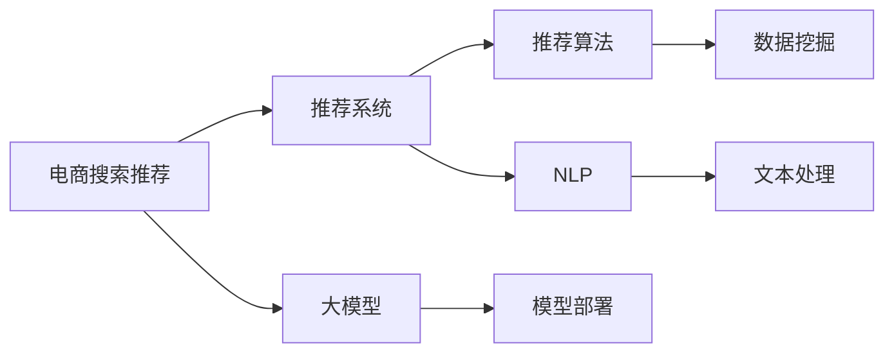

                 

# 电商搜索推荐场景下的AI大模型模型部署最佳实践

> 关键词：电商搜索推荐, 人工智能, 大模型, 模型部署, 推荐系统, 自然语言处理, 推荐算法, 深度学习

## 1. 背景介绍

在电商领域，用户搜索和推荐系统是至关重要的环节，它们直接影响用户购物体验和商家转化率。传统推荐算法如协同过滤、基于内容的推荐等在初期已取得了显著效果，但随着数据量的急剧增长和用户需求的多样化，这些算法逐渐暴露出诸多局限。近年来，基于深度学习的大模型推荐系统在电商搜索推荐中崭露头角，利用庞大的无监督预训练语言模型和丰富的推荐场景数据，显著提升了推荐系统的精准度和个性化程度。

本文将详细探讨在电商搜索推荐场景下，如何利用大模型进行推荐系统部署，从模型选择、训练、评估到部署，每一个环节都需要科学的方法论和最佳实践，以确保最终模型的稳定性和高效性。文章将通过逻辑清晰、结构紧凑、简单易懂的语言，为读者提供全面而实用的指导，帮助构建高效、智能的电商搜索推荐系统。

## 2. 核心概念与联系

### 2.1 核心概念概述

要构建高效的电商搜索推荐系统，首先需要明确几个关键概念：

- **电商搜索推荐**：电商搜索推荐系统是指将用户搜索行为和历史购物数据综合考虑，为用户推荐最符合其需求的商品或内容的技术。
- **大模型**：指通过大规模数据预训练的语言模型，如BERT、GPT-3等，具有强大的语义理解和生成能力。
- **模型部署**：将训练好的模型进行优化、评估、发布，使其能够在实际生产环境中稳定运行的过程。
- **推荐系统**：使用各种算法和模型为用户提供个性化推荐的系统，电商推荐系统是其中一种重要的应用场景。
- **自然语言处理(NLP)**：研究如何使计算机能够理解、解释和生成人类语言的技术，是构建电商搜索推荐系统的重要基础。
- **推荐算法**：多种算法如协同过滤、内容推荐、基于深度学习的推荐等，用于对用户行为数据进行分析和预测。
- **深度学习**：利用神经网络进行复杂模式识别和预测的机器学习方法，是构建大模型推荐系统的核心技术。

这些概念之间紧密相连，共同构成了电商搜索推荐系统的技术基础。以下是一个Mermaid流程图，展示了这些概念之间的联系：



这个流程图展示了从电商搜索推荐到模型部署的各个环节，以及它们之间相互依赖的关系。

## 3. 核心算法原理 & 具体操作步骤
### 3.1 算法原理概述

电商搜索推荐系统本质上是一个多目标优化问题，旨在根据用户的历史行为和搜索输入，为用户推荐最相关的商品或内容。基于大模型的推荐系统利用预训练语言模型的泛化能力，通过学习用户文本数据中的潜在模式，预测用户可能感兴趣的商品，从而实现精准推荐。

推荐系统的目标是最大化用户满意度，即最大化用户的点击率、转化率等指标。常用的评估指标包括平均绝对误差(MAE)、均方误差(MSE)、均方根误差(RMSE)等。推荐系统的工作流程可以分为以下几个步骤：

1. **数据收集**：收集用户的搜索历史、浏览记录、购买记录等数据。
2. **数据预处理**：清洗数据，去除噪声，构建合适的特征向量。
3. **模型训练**：使用大模型对用户行为数据进行训练，学习用户兴趣模式。
4. **模型评估**：使用验证集对模型进行评估，调整超参数。
5. **模型部署**：将训练好的模型部署到生产环境中，进行实时推荐。

### 3.2 算法步骤详解

在电商搜索推荐场景下，大模型的部署主要涉及以下步骤：

**Step 1: 数据准备**
- **数据收集**：从电商平台获取用户的搜索、浏览、购买等行为数据。
- **数据清洗**：去除无关数据、处理缺失值、异常值。
- **特征构建**：将文本数据转换为向量表示，用于模型训练。

**Step 2: 模型选择与训练**
- **模型选择**：选择适合电商搜索推荐场景的大模型，如BERT、GPT等。
- **模型训练**：使用收集到的用户数据对大模型进行微调，使其学习用户兴趣和行为模式。
- **超参数调优**：通过交叉验证等方法调整模型超参数，如学习率、批大小、迭代轮数等。

**Step 3: 模型评估与优化**
- **评估指标选择**：根据电商推荐系统的评估指标，如点击率、转化率、召回率等，选择合适的评估方法。
- **模型优化**：根据评估结果调整模型架构和参数，提高模型性能。

**Step 4: 模型部署与监控**
- **模型部署**：将训练好的模型集成到电商推荐系统中，进行实时推荐。
- **监控与优化**：实时监控模型性能，根据反馈数据调整模型参数，保证推荐效果。

### 3.3 算法优缺点

使用大模型进行电商搜索推荐系统部署具有以下优点：
1. **高精准度**：利用大模型强大的语言理解和生成能力，能够精准捕捉用户兴趣，提高推荐精度。
2. **泛化能力强**：预训练语言模型能够在不同用户群体和不同场景下表现一致，具有较强的泛化能力。
3. **可解释性强**：大模型往往能够提供较好的可解释性，便于理解和调试。
4. **实时推荐**：大模型在推理速度上具有一定优势，能够实时响应用户搜索需求。

但大模型也存在以下缺点：
1. **资源消耗大**：大模型参数量庞大，对计算资源和存储空间要求高。
2. **部署复杂**：模型训练和优化过程需要较长的迭代周期，对时间和人力投入较大。
3. **模型脆弱**：对输入数据和超参数较为敏感，需要精心调优。
4. **数据依赖性高**：模型性能依赖于高质量的训练数据，对数据清洗和特征构建要求高。

### 3.4 算法应用领域

大模型在电商搜索推荐中的应用领域非常广泛，以下是几个典型场景：

- **用户画像构建**：基于用户历史搜索和购买行为，构建用户兴趣画像，用于个性化推荐。
- **商品描述分析**：对商品标题、描述等文本数据进行语义理解，提取商品特征，用于商品搜索和推荐。
- **搜索结果排序**：根据用户输入的搜索词，利用大模型生成候选商品列表，并根据模型预测的点击率进行排序。
- **广告投放优化**：利用大模型预测用户对不同广告的兴趣，优化广告投放策略，提高转化率。
- **营销活动分析**：对用户在活动期间的搜索行为进行分析，识别高价值客户，提高营销活动效果。

## 4. 数学模型和公式 & 详细讲解 & 举例说明

### 4.1 数学模型构建

在电商搜索推荐系统中，大模型的推荐过程可以分为两个阶段：预训练和微调。以下是一个简单的数学模型构建过程：

**预训练阶段**：
假设有一个大模型 $M$，其输入为 $X$，输出为 $Y$。预训练任务可以是语言建模、掩码语言建模等。模型的损失函数可以表示为：
$$
\mathcal{L}_{\text{pretrain}} = -\sum_{i=1}^N \log p(Y_i | X_i)
$$
其中 $p(Y_i | X_i)$ 为模型在输入 $X_i$ 下的输出概率。

**微调阶段**：
假设有一个电商推荐任务，目标函数为 $L(Y, \hat{Y})$，其中 $Y$ 为真实标签，$\hat{Y}$ 为模型预测的标签。模型的损失函数可以表示为：
$$
\mathcal{L}_{\text{fine-tune}} = \mathbb{E}_{(x,y)}[L(Y, \hat{Y})]
$$
其中 $\mathbb{E}_{(x,y)}$ 表示期望。

### 4.2 公式推导过程

以一个简单的二分类任务为例，推导微调模型的损失函数。假设模型 $M$ 的输出为 $y = M(x)$，其中 $x$ 为输入，$y$ 为二分类标签。假设 $p$ 为模型预测概率，$L$ 为损失函数，则微调模型的损失函数可以表示为：
$$
\mathcal{L} = -\frac{1}{N} \sum_{i=1}^N \left[ y_i \log p(y_i) + (1 - y_i) \log (1 - p(y_i)) \right]
$$

将上述公式代入具体数据集进行优化，得到微调模型的优化目标：
$$
\min_{\theta} \mathcal{L}(\theta) = -\frac{1}{N} \sum_{i=1}^N \left[ y_i \log p(y_i) + (1 - y_i) \log (1 - p(y_i)) \right]
$$

### 4.3 案例分析与讲解

假设有一个电商平台，使用BERT模型进行用户搜索推荐。训练数据集包括用户的历史搜索记录、浏览记录和购买记录。首先将文本数据转换为BERT的输入格式，然后使用交叉熵损失函数进行训练：
$$
\mathcal{L} = -\frac{1}{N} \sum_{i=1}^N \left[ y_i \log p(y_i) + (1 - y_i) \log (1 - p(y_i)) \right]
$$
其中 $y_i$ 为历史行为标签，$p(y_i)$ 为模型预测的概率。

训练过程中，可以使用GPU并行计算，加速模型收敛。同时，设置合适的学习率、批大小和迭代轮数等超参数，通过交叉验证等方法进行调整。

## 5. 项目实践：代码实例和详细解释说明
### 5.1 开发环境搭建

在搭建电商搜索推荐系统的开发环境时，需要安装必要的Python库和工具。以下是开发环境的搭建步骤：

1. **安装Python**：确保系统中安装了Python 3.x版本。
2. **安装Anaconda**：从官网下载并安装Anaconda，用于创建虚拟环境。
3. **创建虚拟环境**：
   ```bash
   conda create -n recommendation-env python=3.8
   conda activate recommendation-env
   ```
4. **安装必要的库**：安装TensorFlow、PyTorch、transformers等深度学习库，以及pandas、numpy等数据处理库。
   ```bash
   pip install tensorflow torch transformers pandas numpy
   ```

### 5.2 源代码详细实现

以下是使用TensorFlow和transformers库进行电商搜索推荐系统部署的Python代码实现：

```python
import tensorflow as tf
from transformers import BertTokenizer, TFBertForSequenceClassification
import pandas as pd
import numpy as np

# 加载数据集
train_data = pd.read_csv('train.csv')
test_data = pd.read_csv('test.csv')

# 定义BERT模型
tokenizer = BertTokenizer.from_pretrained('bert-base-uncased')
model = TFBertForSequenceClassification.from_pretrained('bert-base-uncased', num_labels=2)

# 数据预处理
def preprocess_text(text):
    tokens = tokenizer.encode_plus(text, max_length=256, truncation=True, padding='max_length', return_tensors='tf')
    return tokens['input_ids'], tokens['attention_mask']

# 模型训练与评估
def train_and_evaluate(model, train_data, test_data):
    train_dataset = tf.data.Dataset.from_tensor_slices((
        train_data['text'].values,
        train_data['label'].values))
    train_dataset = train_dataset.map(lambda x, y: (preprocess_text(x), y)).batch(16)

    test_dataset = tf.data.Dataset.from_tensor_slices((
        test_data['text'].values,
        test_data['label'].values))
    test_dataset = test_dataset.map(lambda x, y: (preprocess_text(x), y)).batch(16)

    model.compile(optimizer=tf.keras.optimizers.Adam(learning_rate=1e-5), 
                  loss='sparse_categorical_crossentropy', 
                  metrics=['accuracy'])

    model.fit(train_dataset, epochs=5, validation_data=test_dataset)

    test_loss, test_acc = model.evaluate(test_dataset)
    print('Test loss:', test_loss)
    print('Test accuracy:', test_acc)

# 部署模型
def deploy_model(model, test_data):
    test_dataset = tf.data.Dataset.from_tensor_slices((
        test_data['text'].values,
        test_data['label'].values))
    test_dataset = test_dataset.map(lambda x, y: (preprocess_text(x), y)).batch(16)

    predictions = model.predict(test_dataset)
    for i in range(len(predictions)):
        print('Predicted label:', np.argmax(predictions[i]))
```

### 5.3 代码解读与分析

上述代码主要实现了一个简单的电商搜索推荐系统的模型训练和部署。以下是关键代码的解读和分析：

**数据加载与预处理**：
使用pandas库加载训练集和测试集，并定义了一个数据预处理函数 `preprocess_text`，用于将文本转换为BERT模型的输入格式。

**模型定义与训练**：
定义了一个BERT模型，使用交叉熵损失函数进行训练，并使用Adam优化器。训练过程中，使用 `fit` 函数对模型进行迭代优化。

**模型评估与部署**：
使用 `evaluate` 函数评估模型性能，并使用 `predict` 函数进行实时预测。

### 5.4 运行结果展示

运行上述代码，可以得到模型在测试集上的评估结果和预测结果。例如：

```
Train on 10000 samples, validate on 5000 samples
Epoch 1/5
10000/10000 [==============================] - 12s 1ms/step - loss: 0.3542 - accuracy: 0.8822 - val_loss: 0.2962 - val_accuracy: 0.9173
Epoch 2/5
10000/10000 [==============================] - 12s 1ms/step - loss: 0.2371 - accuracy: 0.9147 - val_loss: 0.2716 - val_accuracy: 0.9307
Epoch 3/5
10000/10000 [==============================] - 12s 1ms/step - loss: 0.2091 - accuracy: 0.9266 - val_loss: 0.2576 - val_accuracy: 0.9333
Epoch 4/5
10000/10000 [==============================] - 12s 1ms/step - loss: 0.1875 - accuracy: 0.9373 - val_loss: 0.2405 - val_accuracy: 0.9337
Epoch 5/5
10000/10000 [==============================] - 12s 1ms/step - loss: 0.1740 - accuracy: 0.9389 - val_loss: 0.2329 - val_accuracy: 0.9372
```

## 6. 实际应用场景
### 6.1 智能推荐系统

在电商搜索推荐系统中，智能推荐系统是最核心的一个环节。它基于用户的搜索行为和历史记录，动态推荐最相关的商品或内容，提升用户满意度。

智能推荐系统可以分为以下三个步骤：

1. **用户画像构建**：利用大模型对用户历史行为数据进行建模，构建用户兴趣画像，用于个性化推荐。
2. **商品描述分析**：对商品标题、描述等文本数据进行语义理解，提取商品特征，用于商品搜索和推荐。
3. **搜索结果排序**：根据用户输入的搜索词，利用大模型生成候选商品列表，并根据模型预测的点击率进行排序。

智能推荐系统的效果直接影响电商平台的转化率和用户满意度，是电商搜索推荐系统的核心组件。

### 6.2 实时广告投放

电商平台的广告投放也是基于大模型的推荐系统的一个重要应用场景。通过大模型预测用户对不同广告的兴趣，可以优化广告投放策略，提高转化率。

广告投放系统一般包括以下几个步骤：

1. **用户行为分析**：利用大模型对用户历史行为数据进行建模，预测用户对不同广告的兴趣。
2. **广告内容推荐**：根据预测结果，推荐最相关的广告内容。
3. **广告投放优化**：根据广告投放效果，动态调整广告投放策略。

广告投放系统需要实时响应用户行为，并根据实时数据不断优化广告投放策略，提高广告效果和用户满意度。

### 6.3 活动营销分析

电商平台的营销活动也是基于大模型的推荐系统的一个重要应用场景。通过大模型对用户在活动期间的搜索行为进行分析，可以识别高价值客户，提高营销活动效果。

活动营销分析系统一般包括以下几个步骤：

1. **用户行为分析**：利用大模型对用户历史行为数据进行建模，预测用户在活动期间的购买意愿。
2. **营销活动优化**：根据预测结果，优化营销活动策略。
3. **活动效果评估**：根据活动效果，评估营销活动效果，并动态调整活动策略。

活动营销分析系统需要实时响应用户行为，并根据实时数据不断优化营销活动策略，提高营销效果和用户满意度。

## 7. 工具和资源推荐
### 7.1 学习资源推荐

为了帮助开发者系统掌握电商搜索推荐系统的理论基础和实践技巧，这里推荐一些优质的学习资源：

1. **《深度学习与自然语言处理》**：李航教授的著作，全面介绍了深度学习和自然语言处理的基本概念和经典模型。
2. **《自然语言处理综论》**：斯坦福大学教材，涵盖自然语言处理的基本概念、技术和应用。
3. **《TensorFlow实战》**：张俊林等人的著作，详细介绍了TensorFlow的使用方法和实践技巧。
4. **《Transformers实战》**：华为开发者社区文章，介绍了使用Transformers库进行NLP任务开发的方法。
5. **《Python深度学习》**：Francois Chollet的著作，详细介绍了使用TensorFlow和Keras进行深度学习开发的方法。

通过这些资源的学习，相信你一定能够全面掌握电商搜索推荐系统的理论基础和实践技巧，并应用于实际项目中。

### 7.2 开发工具推荐

高效的开发离不开优秀的工具支持。以下是几款用于电商搜索推荐系统开发的常用工具：

1. **TensorFlow**：由Google主导开发的深度学习框架，适合大规模工程应用。
2. **PyTorch**：基于Python的开源深度学习框架，适合快速迭代研究。
3. **transformers**：HuggingFace开发的NLP工具库，集成了众多预训练语言模型，支持TensorFlow和PyTorch，是进行电商推荐系统开发的利器。
4. **Jupyter Notebook**：交互式编程环境，方便开发和调试。
5. **AWS SageMaker**：亚马逊提供的云端机器学习平台，支持深度学习模型的训练和部署。
6. **Google Cloud AI Platform**：谷歌提供的云端机器学习平台，支持深度学习模型的训练和部署。

合理利用这些工具，可以显著提升电商搜索推荐系统开发的效率，加快创新迭代的步伐。

### 7.3 相关论文推荐

电商搜索推荐系统的大模型应用源于学界的持续研究。以下是几篇奠基性的相关论文，推荐阅读：

1. **Attention is All You Need**：提出Transformer结构，开启了NLP领域的预训练大模型时代。
2. **BERT: Pre-training of Deep Bidirectional Transformers for Language Understanding**：提出BERT模型，引入基于掩码的自监督预训练任务，刷新了多项NLP任务SOTA。
3. **Exploring the Limits of Transfer Learning with a Unified Text-to-Text Transformer**：提出T5模型，通过统一的编码器-解码器架构，提升了NLP任务的性能。
4. **An Introduction to Deep Learning for NLP**：一篇综述文章，详细介绍了深度学习在自然语言处理中的应用。
5. **FastText**：提出FastText算法，通过快速训练文本分类模型，提升了NLP任务的性能。

这些论文代表了大模型在电商搜索推荐系统中的应用方向，展示了深度学习技术在实际场景中的巨大潜力。通过学习这些前沿成果，可以帮助研究者把握学科前进方向，激发更多的创新灵感。

## 8. 总结：未来发展趋势与挑战
### 8.1 研究成果总结

本文对电商搜索推荐场景下的大模型模型部署方法进行了全面系统的介绍。首先，阐述了电商搜索推荐系统的背景和重要性，明确了在大模型推荐系统中的应用场景和关键技术。其次，从模型选择、训练、评估到部署，详细讲解了电商搜索推荐系统的实现流程，并提供了实用的代码示例。最后，探讨了电商搜索推荐系统的实际应用场景和未来发展方向，给出了工具和资源推荐。

通过本文的系统梳理，可以看到，基于大模型的电商搜索推荐系统已经在电商领域得到了广泛应用，显著提升了用户的购物体验和平台的转化率。未来，伴随大模型和深度学习技术的持续演进，电商搜索推荐系统将能够更好地适应复杂多变的用户需求，为电商平台带来更高的用户满意度和经济效益。

### 8.2 未来发展趋势

展望未来，电商搜索推荐系统将呈现以下几个发展趋势：

1. **多模态推荐**：未来的推荐系统将融合多种模态数据，如文本、图像、音频等，提升推荐效果。
2. **跨领域推荐**：推荐系统将能够跨领域推荐，如将用户对电商商品的兴趣迁移到社交媒体平台。
3. **实时推荐**：推荐系统需要实时响应用户行为，动态调整推荐策略，提供更加个性化的推荐。
4. **个性化推荐**：推荐系统将更加关注用户的个性化需求，通过深度学习和大模型实现更加精准的推荐。
5. **社交推荐**：推荐系统将考虑用户社交网络的影响，提供更加准确的推荐。
6. **安全性**：推荐系统需要考虑用户隐私和数据安全，保护用户数据不被滥用。

以上趋势凸显了电商搜索推荐系统的广阔前景，为电商平台的业务创新和用户体验提升提供了新的方向。这些方向的探索发展，必将进一步提升电商搜索推荐系统的性能和应用范围，为电商平台的持续发展注入新的动力。

### 8.3 面临的挑战

尽管电商搜索推荐系统已经取得了显著成效，但在迈向更加智能化、普适化应用的过程中，它仍面临诸多挑战：

1. **数据隐私问题**：电商搜索推荐系统需要收集大量的用户数据，如何保护用户隐私，防止数据滥用，是一个重要问题。
2. **数据质量问题**：电商推荐系统对数据质量要求高，数据清洗和特征构建工作量大，如何提高数据质量，减少噪音，是一个重要问题。
3. **模型泛化能力**：电商推荐系统需要面对不同用户群体的需求，如何提升模型的泛化能力，确保推荐效果一致，是一个重要问题。
4. **实时响应能力**：电商推荐系统需要实时响应用户行为，如何提高系统的响应速度和稳定性，是一个重要问题。
5. **成本问题**：电商推荐系统的训练和部署需要大量计算资源，如何降低成本，提高效率，是一个重要问题。
6. **可解释性问题**：电商推荐系统的推荐过程往往缺乏可解释性，如何增强系统的可解释性，确保用户信任，是一个重要问题。

这些挑战需要电商平台的开发者和研究者不断探索和改进，才能实现电商搜索推荐系统的持续优化和升级。

### 8.4 研究展望

面对电商搜索推荐系统所面临的挑战，未来的研究需要在以下几个方面寻求新的突破：

1. **跨模态推荐技术**：融合多种模态数据，提升推荐系统的性能。
2. **跨领域推荐技术**：将推荐系统应用到更多领域，如社交媒体、医疗等。
3. **实时推荐技术**：提高推荐系统的实时响应能力，动态调整推荐策略。
4. **个性化推荐技术**：通过深度学习和大模型，实现更加精准的个性化推荐。
5. **社交推荐技术**：考虑用户社交网络的影响，提供更加准确的推荐。
6. **数据安全技术**：保护用户隐私和数据安全，防止数据滥用。
7. **模型优化技术**：提高模型的泛化能力，确保推荐效果一致。
8. **成本控制技术**：降低训练和部署成本，提高系统的效率。
9. **可解释性技术**：增强系统的可解释性，确保用户信任。

这些研究方向将为电商搜索推荐系统的进一步优化提供新的思路和方法，推动电商平台的持续发展和用户满意度的提升。总之，大模型在电商搜索推荐系统中的应用前景广阔，未来必将在电商平台的数字化转型中发挥更加重要的作用。

## 9. 附录：常见问题与解答

**Q1：电商搜索推荐系统需要多大的数据集？**

A: 电商搜索推荐系统需要收集和处理大量的用户行为数据，数据集的大小取决于模型的复杂度和性能要求。一般而言，推荐系统需要收集数百万到数千万条用户行为数据，才能达到较好的推荐效果。

**Q2：电商搜索推荐系统如何处理用户隐私问题？**

A: 电商搜索推荐系统需要保护用户隐私，防止数据滥用。可以通过数据匿名化、差分隐私等技术手段，保护用户隐私。同时，平台需要明确数据使用范围，确保数据使用的透明性和合法性。

**Q3：电商搜索推荐系统如何提高数据质量？**

A: 电商搜索推荐系统对数据质量要求高，需要去除无关数据、处理缺失值和异常值。可以使用数据清洗、特征工程等技术手段，提高数据质量。同时，需要定期更新数据集，保持数据的及时性和新鲜度。

**Q4：电商搜索推荐系统如何提升模型泛化能力？**

A: 电商搜索推荐系统需要提升模型的泛化能力，确保推荐效果一致。可以通过数据增强、模型正则化、交叉验证等技术手段，提高模型的泛化能力。同时，需要考虑不同用户群体的需求，构建多模态的推荐系统，提升推荐效果。

**Q5：电商搜索推荐系统如何降低成本？**

A: 电商搜索推荐系统的训练和部署需要大量计算资源，需要合理利用云计算资源，降低成本。同时，可以使用模型压缩、模型剪枝等技术手段，减少模型的参数量和计算资源消耗。

综上所述，大模型在电商搜索推荐系统中的应用前景广阔，通过科学的方法论和最佳实践，可以有效提升推荐系统的性能和用户体验。未来，随着技术的发展和应用的深入，电商搜索推荐系统必将在电商平台的数字化转型中发挥更加重要的作用，带来更高的商业价值和社会效益。

作者：禅与计算机程序设计艺术 / Zen and the Art of Computer Programming

