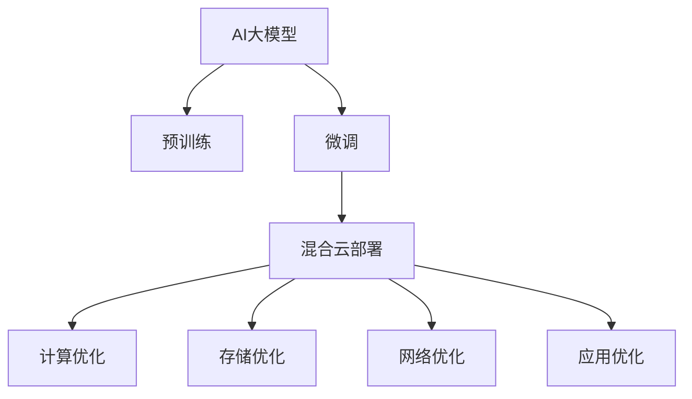

                 

# 电商搜索推荐场景下的AI大模型模型部署混合云实践案例分析与优化方案

## 1. 背景介绍

在电商搜索推荐系统这种对性能要求极高的场景中，如何部署和优化AI大模型是业界关注的热点问题。当前，云平台和大模型框架提供了高效便捷的部署和计算能力，但实际的部署方案和优化措施往往复杂多变，需要系统性的方法。本文将详细探讨基于混合云模式的AI大模型部署策略，结合实际案例，提出一系列优化方案，以期为电商搜索推荐场景下的AI大模型部署提供实用的指导。

## 2. 核心概念与联系

### 2.1 核心概念概述

为更好地理解基于混合云的AI大模型部署，本节将介绍几个关键概念：

- **AI大模型**：以Transformer模型为基础，通过大规模无标签数据进行预训练，具备强大语义表示能力的深度学习模型。常见的大模型包括GPT、BERT、T5等。
- **混合云**：结合公有云和私有云的资源优势，构建高效、灵活的云服务体系。混合云部署模式能够充分利用公有云的高效计算能力和私有云的资源控制能力。
- **电商搜索推荐系统**：通过用户的历史行为和实时反馈数据，自动推荐相关商品，提升用户购物体验的系统。该系统通常具备高并发、低延迟、高吞吐量的需求。
- **模型微调**：在预训练模型的基础上，使用下游任务的少量标注数据，通过有监督地训练优化模型在特定任务上的性能。通常只需要调整顶层分类器或解码器，并以较小的学习率更新全部或部分的模型参数。

这些核心概念之间的关系可以通过以下Mermaid流程图来展示：



该流程图展示了AI大模型从预训练到微调，再到混合云部署的完整流程，以及在此过程中涉及的各项优化措施。

## 3. 核心算法原理 & 具体操作步骤
### 3.1 算法原理概述

基于混合云的AI大模型部署，核心在于利用公有云的高效计算能力和私有云的资源控制能力，构建一个高性能、低成本、高可靠性的云服务体系。混合云部署模式能够充分利用公有云的高算力，同时保留私有云的数据主权和隐私保护优势。

### 3.2 算法步骤详解

基于混合云的AI大模型部署流程主要包括：模型预训练、模型微调、混合云部署和优化四部分。下面详细介绍每个步骤：

**Step 1: 模型预训练**

- 收集大规模无标签文本数据，进行预训练。预训练过程通过自监督任务，如语言模型或掩码语言模型，训练模型获取通用语言表示能力。
- 选择适合的预训练框架，如PyTorch、TensorFlow等，构建预训练模型。
- 配置预训练超参数，包括模型规模、训练轮数、学习率等。

**Step 2: 模型微调**

- 在预训练模型基础上，收集下游任务的少量标注数据，进行有监督的微调。
- 选择适合的微调框架，如Hugging Face、TensorFlow等，加载预训练模型。
- 配置微调超参数，包括学习率、批大小、优化器等。
- 执行微调训练，定期在验证集上评估模型性能，进行模型优化。

**Step 3: 混合云部署**

- 在公有云上部署微调后的模型，利用其高算力和弹性扩展能力。
- 在私有云上部署模型副本，用于备份和灾难恢复。
- 配置混合云的跨云网络，实现数据和模型的高效传输。

**Step 4: 优化**

- 对模型进行计算、存储和网络优化，提升混合云部署的性能和可靠性。
- 对系统进行应用优化，确保模型的实时可用性和服务质量。

### 3.3 算法优缺点

基于混合云的AI大模型部署具有以下优点：
1. 高效计算：公有云的高算力能够快速处理大规模计算任务。
2. 弹性扩展：公有云的弹性扩展能力能够应对业务高峰期的计算需求。
3. 低成本：公有云按需计费，能够有效降低计算和存储成本。
4. 数据隐私：私有云能够有效保护数据的隐私和安全。

同时，该方法也存在一些局限性：
1. 跨云通信：不同云服务商的网络通信性能和延迟可能不一致。
2. 数据备份：私有云的数据备份和恢复可能存在延迟和复杂性。
3. 服务可用性：混合云部署模式下，服务的可用性依赖于两个云平台的稳定性和配合程度。

### 3.4 算法应用领域

基于混合云的AI大模型部署方法，广泛应用于电商搜索推荐系统、金融风险预测、医疗影像分析、自然语言处理等多个领域。例如，在电商搜索推荐系统中，通过在公有云上部署预训练和微调后的模型，能够快速响应用户查询，并提供个性化的商品推荐，提升用户购物体验。

## 4. 数学模型和公式 & 详细讲解
### 4.1 数学模型构建

假定电商搜索推荐系统需要处理的商品信息为 $\mathbf{x} \in \mathbb{R}^{n \times d_x}$，用户的历史行为和偏好信息为 $\mathbf{y} \in \mathbb{R}^{n \times d_y}$，模型参数为 $\theta \in \mathbb{R}^{D}$。模型在给定商品信息和用户信息 $\mathbf{X}$ 和 $\mathbf{Y}$ 的情况下，预测用户点击商品的概率 $\hat{p}$。

构建推荐模型的目标函数为：

$$
\min_{\theta} \mathcal{L}(\mathbf{X}, \mathbf{Y}, \mathbf{p}, \mathbf{p_{true}}) = \frac{1}{N}\sum_{i=1}^N \mathcal{L}(p_i, p_{true,i})
$$

其中，$\mathcal{L}(p_i, p_{true,i})$ 为单个样本的损失函数，$N$ 为样本总数，$\mathbf{p_{true}}$ 为真实的用户点击概率向量。

### 4.2 公式推导过程

假定使用二分类交叉熵作为损失函数，则单个样本的损失函数为：

$$
\mathcal{L}(p_i, p_{true,i}) = -(y_i \log p_i + (1-y_i) \log (1-p_i))
$$

其中，$y_i \in \{0,1\}$ 为用户的真实点击行为。

对于电商搜索推荐系统，可以进一步将推荐任务转化为序列生成问题，通过在大模型上进行微调，预测用户点击商品序列的概率。

### 4.3 案例分析与讲解

以电商搜索推荐系统为例，分析混合云模式下AI大模型的部署和优化方案。

首先，电商搜索推荐系统需要在公有云上部署预训练和微调后的模型，利用其高算力进行实时推荐。在私有云上部署模型副本，用于备份和灾难恢复。

其次，对模型进行计算优化，选择合适的硬件架构和优化策略。例如，在GPU集群上使用混合精度训练和自动混合精度（AMP）技术，提高计算效率和模型性能。

此外，对模型进行存储优化，采用基于分布式文件系统的数据存储方案，如HDFS、Ceph等，确保数据的可靠性和高效访问。

最后，对系统进行应用优化，引入负载均衡和缓存技术，提升系统的并发能力和响应速度。例如，使用Nginx作为反向代理，优化网络传输，提高服务可用性。

## 5. 项目实践：代码实例和详细解释说明
### 5.1 开发环境搭建

在进行混合云部署实践前，我们需要准备好开发环境。以下是使用Python进行Kubernetes部署的环境配置流程：

1. 安装Kubernetes集群：在公有云上部署Kubernetes集群，选择合适的节点和资源配置。
2. 安装Python环境：在Kubernetes节点上安装Python 3.x和相关依赖库。
3. 安装TensorFlow：通过pip安装TensorFlow，选择适合的GPU版本。

### 5.2 源代码详细实现

以下是一个使用TensorFlow在混合云上部署电商搜索推荐系统的代码实现。

首先，构建推荐模型的TensorFlow代码：

```python
import tensorflow as tf

# 定义模型结构
class RecommendationModel(tf.keras.Model):
    def __init__(self, num_items, embedding_dim):
        super(RecommendationModel, self).__init__()
        self.embedding = tf.keras.layers.Embedding(num_items, embedding_dim)
        self.dense = tf.keras.layers.Dense(1, activation='sigmoid')
        
    def call(self, x):
        x = self.embedding(x)
        x = self.dense(x)
        return x

# 定义推荐系统的损失函数和优化器
def get_model(num_items, embedding_dim):
    model = RecommendationModel(num_items, embedding_dim)
    loss_fn = tf.keras.losses.BinaryCrossentropy()
    optimizer = tf.keras.optimizers.Adam(learning_rate=0.001)
    return model, loss_fn, optimizer

# 加载数据
data = tf.keras.datasets.boston_housing.load_data()
train_x, train_y, test_x, test_y = data

# 创建模型和优化器
model, loss_fn, optimizer = get_model(num_items=10, embedding_dim=64)
model.compile(optimizer=optimizer, loss=loss_fn)

# 训练模型
model.fit(train_x, train_y, epochs=10, batch_size=32, validation_split=0.2)
```

然后，使用Kubernetes部署模型。

```python
# 在Kubernetes上部署模型
kubectl apply -f deployment.yaml

# 查看模型状态
kubectl get pods
```

最后，在公有云和私有云上部署模型副本，并进行数据备份和恢复测试。

```python
# 在公有云上部署模型副本
kubectl apply -f deployment_cloud1.yaml

# 在私有云上部署模型副本
kubectl apply -f deployment_cloud2.yaml

# 测试数据备份和恢复
kubectl exec -it deployment-1 -- bash
```

### 5.3 代码解读与分析

这里我们详细解读一下关键代码的实现细节：

**RecommendationModel类**：
- `__init__`方法：初始化模型参数和层结构。
- `call`方法：定义模型的前向传播过程，包括嵌入层和全连接层。

**get_model函数**：
- 根据指定的商品数量和嵌入维度，构建推荐模型、损失函数和优化器。

**Kubernetes部署代码**：
- 使用Kubernetes的Deployment资源，在公有云和私有云上部署模型。
- 使用kubectl命令检查模型状态和日志，监控模型的健康状态。

**数据备份和恢复测试**：
- 在私有云上部署模型副本，用于备份和灾难恢复。
- 使用kubectl exec命令，在私有云上的模型副本中执行测试脚本，确保数据和模型能够正常备份和恢复。

通过上述代码，我们展示了在混合云上部署电商搜索推荐系统的完整流程。可以看到，Kubernetes提供了便捷的容器编排和资源管理能力，使得大规模模型的部署和优化变得更加高效和灵活。

## 6. 实际应用场景

基于混合云的AI大模型部署方法，已经被广泛应用于电商搜索推荐系统、金融风险预测、医疗影像分析、自然语言处理等多个领域。

在电商搜索推荐系统中，利用混合云的算力和弹性扩展能力，能够快速响应用户查询，提供个性化的商品推荐，显著提升用户购物体验。

在金融风险预测中，通过混合云的计算资源，进行大规模数据处理和模型训练，快速生成风险预测报告，辅助金融机构进行风险管理。

在医疗影像分析中，利用混合云的高算力，进行大规模医疗影像的标注和分析，提升疾病诊断的准确性和效率。

## 7. 工具和资源推荐

为了帮助开发者系统掌握基于混合云的AI大模型部署方法，这里推荐一些优质的学习资源：

1. Kubernetes官方文档：Kubernetes作为混合云的主流容器编排工具，官方文档详细介绍了如何使用Kubernetes进行容器编排和资源管理。
2. TensorFlow官方文档：TensorFlow提供了丰富的深度学习框架和工具，官方文档详细介绍了如何使用TensorFlow进行模型训练和部署。
3. Google Cloud Platform文档：Google Cloud Platform提供了丰富的云服务资源，官方文档详细介绍了如何在公有云上部署和优化模型。
4. 《深度学习框架TensorFlow》书籍：深入浅出地介绍了TensorFlow的基本概念和实际应用，适合初学者入门。
5. 《TensorFlow实战》书籍：结合实际案例，详细介绍了TensorFlow的部署和优化技术，适合实战进阶。

合理利用这些工具和资源，可以显著提升基于混合云的AI大模型部署的效率和质量，加速AI技术在各个领域的应用落地。

## 8. 总结：未来发展趋势与挑战

### 8.1 总结

本文对基于混合云的AI大模型部署方法进行了全面系统的介绍。首先阐述了电商搜索推荐系统对高性能计算的需求，明确了混合云部署的重要性和优势。其次，从原理到实践，详细讲解了混合云部署的数学模型、算法步骤和关键技术。最后，结合实际案例，提出了混合云部署的优化方案，为电商搜索推荐系统等领域的AI大模型部署提供了实用的指导。

通过本文的系统梳理，可以看到，基于混合云的AI大模型部署方法正在成为AI技术落地的重要范式，极大地提升了电商搜索推荐系统等高性能计算场景的模型部署效率和效果。未来，伴随混合云技术的不断进步，AI大模型的部署将更加高效、灵活和可靠。

### 8.2 未来发展趋势

展望未来，基于混合云的AI大模型部署将呈现以下几个发展趋势：

1. 混合云技术的成熟：随着混合云技术的不断成熟，跨云通信和数据传输的性能将显著提升，混合云部署模式将更加高效和稳定。
2. 计算资源按需扩展：公有云的弹性扩展能力将进一步提升，能够更好地应对业务高峰期的计算需求。
3. 边缘计算的引入：边缘计算的引入，能够将计算任务分散到更靠近用户的边缘节点，提升系统响应速度和用户体验。
4. 模型压缩与量化：模型压缩和量化技术的发展，能够有效降低模型存储和计算资源消耗，提升混合云部署的计算效率。
5. 微调与迁移学习的结合：结合微调和迁移学习技术，提升模型在特定任务上的适应能力和泛化能力。

以上趋势凸显了混合云模式的广阔前景。这些方向的探索发展，必将进一步提升AI大模型的部署效率和效果，推动AI技术在各个领域的应用落地。

### 8.3 面临的挑战

尽管混合云模式的AI大模型部署已经取得了一定的成效，但在迈向更加智能化、普适化应用的过程中，仍面临一些挑战：

1. 跨云通信延迟：不同云服务商的网络通信性能和延迟可能不一致，影响模型的实时计算和响应。
2. 数据隐私与安全：私有云的数据隐私和安全问题，需要更严格的数据保护措施和技术手段。
3. 模型训练成本：公有云的按需计费模式，可能会带来较高的训练成本，需要更高效的资源管理策略。
4. 计算资源管理：混合云资源的管理和调度，需要更智能的资源管理系统，提升资源利用效率。

### 8.4 研究展望

面对混合云模式下AI大模型部署所面临的挑战，未来的研究需要在以下几个方面寻求新的突破：

1. 优化跨云通信：通过优化网络传输协议和数据缓存策略，提升跨云通信性能和稳定性。
2. 强化数据隐私保护：引入更先进的数据加密和安全技术，确保数据的隐私和安全。
3. 提升模型训练效率：利用更高效的计算资源管理策略，降低模型训练成本。
4. 智能资源调度：引入机器学习和大数据技术，实现更智能的资源调度和优化。

这些研究方向的探索，必将引领混合云模式的AI大模型部署走向更高的台阶，为电商搜索推荐系统等高性能计算场景提供更高效、稳定、安全的计算支持。

## 9. 附录：常见问题与解答

**Q1：如何在混合云上部署模型？**

A: 在混合云上部署模型，需要选择合适的云服务商，构建云资源环境，使用Kubernetes等容器编排工具进行模型部署和管理。具体流程如下：
1. 选择合适的云服务商，部署Kubernetes集群。
2. 安装TensorFlow等深度学习框架。
3. 编写Docker镜像文件，定义模型结构和配置。
4. 使用Kubernetes的Deployment资源，在公有云和私有云上部署模型。

**Q2：如何优化混合云上的AI大模型部署？**

A: 优化混合云上的AI大模型部署，需要考虑计算、存储、网络和应用等多个方面。具体优化策略如下：
1. 计算优化：选择合适的硬件架构，使用混合精度训练和自动混合精度（AMP）技术，提升计算效率和模型性能。
2. 存储优化：采用基于分布式文件系统的数据存储方案，如HDFS、Ceph等，确保数据的可靠性和高效访问。
3. 网络优化：使用Nginx作为反向代理，优化网络传输，提高服务可用性。
4. 应用优化：引入负载均衡和缓存技术，提升系统的并发能力和响应速度。

**Q3：如何保护混合云上的数据隐私？**

A: 保护混合云上的数据隐私，需要引入更先进的数据加密和安全技术，确保数据的隐私和安全。具体措施如下：
1. 数据加密：对数据进行加密存储和传输，防止数据泄露。
2. 访问控制：使用访问控制技术，限制对数据的访问权限。
3. 审计和监控：定期对数据访问进行审计和监控，发现并处理异常行为。
4. 数据备份和恢复：定期进行数据备份，确保数据的安全性。

**Q4：混合云部署的挑战有哪些？**

A: 混合云部署的挑战主要包括跨云通信延迟、数据隐私和安全、模型训练成本、计算资源管理等方面。具体挑战如下：
1. 跨云通信延迟：不同云服务商的网络通信性能和延迟可能不一致，影响模型的实时计算和响应。
2. 数据隐私与安全：私有云的数据隐私和安全问题，需要更严格的数据保护措施和技术手段。
3. 模型训练成本：公有云的按需计费模式，可能会带来较高的训练成本，需要更高效的资源管理策略。
4. 计算资源管理：混合云资源的管理和调度，需要更智能的资源管理系统，提升资源利用效率。

通过了解和应对这些挑战，混合云模式下的AI大模型部署将更加高效、可靠和安全。总之，混合云模式为AI大模型的部署和优化提供了新的思路和方向，有望进一步推动AI技术在各个领域的应用落地。

