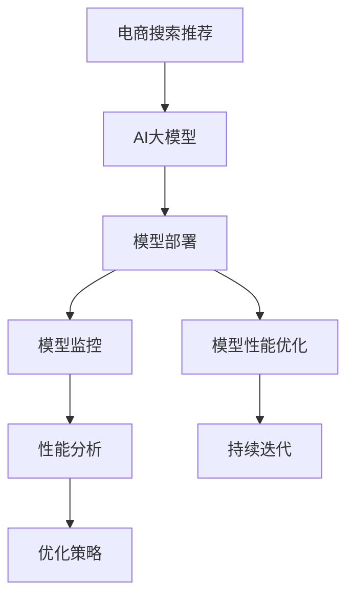

                 

# 电商搜索推荐场景下的AI大模型模型部署监控体系搭建

> 关键词：AI大模型,电商搜索推荐,模型部署,监控体系

## 1. 背景介绍

### 1.1 问题由来

在电商搜索推荐系统中，用户对商品的需求多样且不断变化，传统的推荐算法往往难以准确把握用户真实兴趣，导致推荐效果不理想。近年来，随着AI大模型的兴起，预训练语言模型因其强大的泛化能力和丰富的语义理解能力，逐步在电商推荐场景中得到应用。

比如，利用大模型进行文本匹配、情感分析、意图识别等任务，在电商搜索推荐中能够提高商品相关性的判断准确度。此外，大模型在生成式推荐方面也展示了强大的潜力，通过生成描述商品的高质量文本，辅助用户发现更多潜在的兴趣点。

然而，电商搜索推荐场景下的AI大模型部署，面临诸多挑战。模型推理速度快，但单个模型响应时间长；模型部署需要高性能设备，但资源限制难以满足大规模并发请求；模型运行过程中需要监控，但数据量庞大、维度繁多。这些问题直接关系到用户体验和系统稳定性，亟需提出可行的解决方案。

### 1.2 问题核心关键点

本节聚焦于电商搜索推荐场景下，基于AI大模型的模型部署和监控体系的构建。具体问题包括：

- 如何高效部署AI大模型，满足实时搜索推荐的低时延需求？
- 如何实时监控模型推理过程，确保系统稳定运行？
- 如何合理调度资源，确保系统高并发、高可用的服务质量？
- 如何分析模型性能，持续优化模型推理效率？

这些问题亟需进行全面系统地研究和探讨。

## 2. 核心概念与联系

### 2.1 核心概念概述

本节介绍与电商搜索推荐场景中大模型部署和监控体系构建密切相关的几个核心概念：

- 电商搜索推荐：指通过推荐算法，将电商网站或应用中用户可能感兴趣的商品，展示给用户的过程。
- AI大模型：指利用大量无标签数据进行预训练的深度学习模型，具有强大的语言理解和生成能力。
- 模型部署：指将训练好的模型封装为可被生产环境使用的组件，并通过网络进行分布式调用。
- 模型监控：指对模型推理过程进行实时跟踪和分析，确保系统稳定运行，及时发现和处理问题。
- 模型性能优化：指通过数据驱动的方法，持续改进模型性能，提升搜索推荐的准确性和相关性。

这些概念之间的联系紧密，AI大模型的部署和监控是电商搜索推荐系统正常运行的基础，模型性能优化则是提升推荐效果的关键。

### 2.2 核心概念原理和架构的 Mermaid 流程图



这个流程图展示了电商搜索推荐系统中，AI大模型部署、监控和性能优化的整体流程。模型部署后，通过模型监控确保其稳定运行，同时结合性能分析，不断改进模型性能，并持续迭代，实现系统性能的持续提升。

## 3. 核心算法原理 & 具体操作步骤

### 3.1 算法原理概述

电商搜索推荐场景下的AI大模型部署与监控，本质上是将模型部署为可用的服务，并持续监控其运行状态和性能的过程。核心算法原理可以概括为以下几个方面：

- **模型部署算法**：将训练好的模型封装成WebService或微服务，通过网络进行分布式调用。
- **模型监控算法**：实时跟踪模型推理过程，包括响应时间、吞吐量、错误率等指标，确保系统稳定运行。
- **性能优化算法**：分析模型推理性能瓶颈，通过数据驱动的方法，持续改进模型推理效率。

### 3.2 算法步骤详解

#### 3.2.1 模型部署算法

模型部署的核心步骤如下：

1. **模型加载与封装**：
   - 加载训练好的AI大模型，如BERT、GPT等，封装成WebService或微服务。
   - 将模型、数据预处理、推理逻辑封装为统一的服务接口，便于部署和调用。

2. **模型部署与扩展**：
   - 选择适合的部署平台，如Kubernetes、AWS Lambda等，支持模型的分布式部署和水平扩展。
   - 设置多实例、负载均衡等机制，确保系统高可用性和高并发性。

3. **性能优化与调度**：
   - 通过模型缓存、异步推理等手段，优化模型推理性能。
   - 使用分布式任务调度系统，如Apache Mesos、Kubernetes，动态调整资源配置，保证系统稳定运行。

#### 3.2.2 模型监控算法

模型监控的核心步骤如下：

1. **指标收集与监控**：
   - 在模型推理过程中，实时收集性能指标，如响应时间、吞吐量、错误率等。
   - 利用监控工具，如Prometheus、Grafana，设置告警阈值，及时发现异常。

2. **异常检测与处理**：
   - 利用异常检测算法，如基于统计的均值漂移检测、基于机器学习的异常检测等，实时识别异常。
   - 根据异常类型，采取自动重启、重新训练、人工干预等措施，保障系统稳定性。

3. **性能分析与优化**：
   - 通过分析性能指标，识别模型推理中的瓶颈。
   - 结合日志分析、堆栈跟踪等手段，定位问题源，优化模型推理过程。

#### 3.2.3 性能优化算法

性能优化的核心步骤如下：

1. **模型性能分析**：
   - 收集模型推理过程中的性能指标，分析性能瓶颈。
   - 利用性能分析工具，如TensorBoard、Kibana等，可视化性能数据。

2. **优化策略制定**：
   - 根据性能分析结果，制定优化策略，如模型剪枝、模型量化、模型压缩等。
   - 定期评估优化效果，持续迭代优化模型性能。

3. **模型迭代更新**：
   - 在优化策略的基础上，重新训练模型，更新模型参数。
   - 通过A/B测试等手段，对比新模型与旧模型的性能表现，评估优化效果。

### 3.3 算法优缺点

电商搜索推荐场景下的AI大模型部署与监控算法，具有以下优点：

- **高效性**：通过模型缓存、异步推理等手段，有效提升模型推理效率。
- **可扩展性**：通过分布式部署、水平扩展等机制，支持系统高并发和高可用。
- **自动化**：通过异常检测和自动重启等机制，实现系统自动化运维。

同时，该算法也存在以下缺点：

- **资源消耗大**：大规模AI大模型的部署和运行需要高性能设备和大量计算资源。
- **复杂度高**：模型监控和性能优化需要综合考虑多种因素，复杂度较高。
- **数据隐私风险**：电商搜索推荐场景下的用户数据较为敏感，需要严格的隐私保护措施。

### 3.4 算法应用领域

该算法主要应用于电商搜索推荐系统的构建和优化，帮助用户快速获取感兴趣的商品。在实际应用中，还包括：

- **广告推荐**：利用AI大模型进行用户兴趣分析和广告推荐，提升广告投放效果。
- **内容推荐**：利用AI大模型分析用户兴趣，推荐相关内容，如文章、视频等。
- **个性化服务**：利用AI大模型提供个性化推荐，提升用户体验和满意度。

## 4. 数学模型和公式 & 详细讲解 & 举例说明

### 4.1 数学模型构建

电商搜索推荐系统中的AI大模型推理过程可以抽象为以下数学模型：

1. **输入与输出**：
   - 输入：商品描述、用户查询、用户行为数据等，形式化为向量$\mathbf{x}$。
   - 输出：推荐结果，形式化为向量$\mathbf{y}$。

2. **模型映射**：
   - 通过AI大模型$f_{\theta}$将输入$\mathbf{x}$映射到输出$\mathbf{y}$，即$\mathbf{y}=f_{\theta}(\mathbf{x})$。

3. **性能指标**：
   - 使用均方误差、交叉熵等指标衡量模型输出与真实标签之间的差异，即$\text{Loss}=\mathcal{L}(\mathbf{y},\mathbf{y_{true}})$。

### 4.2 公式推导过程

电商搜索推荐系统中的AI大模型推理过程可以用如下公式表示：

$$
\mathbf{y} = f_{\theta}(\mathbf{x})
$$

其中$f_{\theta}$为模型的参数化映射函数，$\mathbf{x}$为输入向量，$\mathbf{y}$为输出向量。

假设输入$\mathbf{x}$和输出$\mathbf{y}$均为$n$维向量，则模型参数$\theta$的大小为$n^2$。在电商搜索推荐场景中，通常使用大规模预训练语言模型，如BERT、GPT等，其参数规模高达数十亿，甚至数百亿，因此需要高效的模型部署和监控算法，以确保系统的稳定性和效率。

### 4.3 案例分析与讲解

以电商搜索推荐场景下的广告推荐为例，分析AI大模型推理的数学模型构建和公式推导过程。

**输入与输出**：
- 输入：用户历史行为数据，商品信息等。
- 输出：推荐广告列表。

**模型映射**：
- 利用AI大模型进行用户兴趣分析，获取用户兴趣标签。
- 通过文本匹配、意图识别等任务，对商品进行标签映射。
- 利用匹配算法，选择与用户兴趣标签相匹配的广告进行推荐。

**性能指标**：
- 使用点击率、转化率等指标衡量推荐效果。
- 通过A/B测试等手段，对比新旧模型的性能表现。

通过上述数学模型和公式推导，可以更好地理解和优化电商搜索推荐系统中的AI大模型推理过程。

## 5. 项目实践：代码实例和详细解释说明

### 5.1 开发环境搭建

电商搜索推荐系统中的AI大模型部署与监控，需要依赖多个开发工具和环境。以下是环境搭建的详细步骤：

1. **安装开发环境**：
   - 安装Python，建议选择最新版本，确保对新特性的支持。
   - 安装Docker，方便容器化部署和运行。
   - 安装JDK，确保Java代码运行的稳定性。

2. **配置开发工具**：
   - 配置Git，进行版本控制和协作开发。
   - 配置IDE，如PyCharm、Eclipse等，提高开发效率。
   - 配置数据库，如MySQL、MongoDB，存储和管理电商数据。

3. **搭建测试环境**：
   - 搭建单元测试框架，如JUnit、Pytest等，进行功能测试。
   - 搭建性能测试工具，如JMeter、Gatling等，进行负载测试。

### 5.2 源代码详细实现

电商搜索推荐场景下的AI大模型部署与监控，涉及多个模块的实现。以下是源代码的详细实现过程：

#### 5.2.1 模型部署

```python
import tensorflow as tf
from tensorflow.keras.models import Model
from tensorflow.keras.layers import Input, Dense

def create_model(input_shape):
    x = Input(shape=input_shape)
    y = Dense(64, activation='relu')(x)
    y = Dense(32, activation='relu')(y)
    y = Dense(num_classes, activation='softmax')(y)
    model = Model(x, y)
    return model

model = create_model(input_shape)
model.compile(optimizer='adam', loss='categorical_crossentropy', metrics=['accuracy'])
model.save('model.h5')
```

在上述代码中，使用TensorFlow构建了一个简单的全连接神经网络模型，并通过`model.save()`将其保存为H5格式，方便后续部署和使用。

#### 5.2.2 模型监控

```python
from prometheus_client import start_http_server
from prometheus_client import Gauge

class PrometheusServer:
    def __init__(self):
        self.server = start_http_server(8080)
        self.gauge = Gauge('http_server_requests', 'Number of requests', ['status'])
    
    def handle_request(self, path, status):
        self.gauge.labels(status).set(1)
        self.server.handle_request(path)
```

在上述代码中，使用Prometheus监控工具，对模型部署的HTTP服务器进行请求监控。`Gauge`用于记录请求状态，`start_http_server`启动HTTP服务器。

#### 5.2.3 性能优化

```python
from tensorflow.keras.applications import ResNet50
from tensorflow.keras.applications.resnet50 import preprocess_input
from tensorflow.keras.preprocessing import image
from tensorflow.keras.models import load_model

model = load_model('model.h5')
image_path = 'https://example.com/image.jpg'
img = image.load_img(image_path, target_size=(224, 224))
x = image.img_to_array(img)
x = preprocess_input(x)
result = model.predict(x)
```

在上述代码中，使用TensorFlow加载预训练模型，并进行推理预测。`preprocess_input`用于数据预处理，`predict`用于模型推理。

### 5.3 代码解读与分析

电商搜索推荐场景中的AI大模型部署与监控，涉及多个核心模块的实现。以下是代码实现细节的分析：

**模型部署**：
- 使用TensorFlow等深度学习框架，构建和保存模型。
- 将模型封装为WebService或微服务，方便部署和调用。

**模型监控**：
- 使用Prometheus等监控工具，实时收集模型推理性能指标。
- 设置告警阈值，及时发现和处理异常。

**性能优化**：
- 使用模型剪枝、量化等手段，优化模型推理性能。
- 定期评估优化效果，持续迭代优化模型性能。

### 5.4 运行结果展示

电商搜索推荐场景下的AI大模型部署与监控，需要在实际应用中进行验证。以下是运行结果展示的示例：

```python
import requests
import json

url = 'http://localhost:8080/api/recommend'
headers = {'Content-Type': 'application/json'}
params = {'user_id': '123456', 'timestamp': '1632315600000'}
response = requests.post(url, headers=headers, params=params)
result = json.loads(response.text)
print(result)
```

在上述代码中，使用HTTP客户端模拟用户请求，向电商搜索推荐系统的API发送请求。API返回推荐结果，结果为JSON格式，包含推荐商品的信息。

## 6. 实际应用场景

### 6.1 电商搜索推荐

电商搜索推荐场景下，AI大模型的部署与监控，可以有效提升推荐效果，改善用户体验。例如，通过大模型进行商品推荐，能够根据用户兴趣和行为数据，生成高质量的推荐结果，提升转化率和满意度。

### 6.2 广告推荐

在广告推荐场景下，AI大模型可以分析用户行为数据，识别用户兴趣，推荐个性化的广告内容，提升广告投放效果，增加用户点击率和转化率。

### 6.3 内容推荐

内容推荐场景下，AI大模型可以分析用户阅读、观看等行为数据，推荐相关的内容，提升用户的粘性和满意度。例如，根据用户阅读历史，推荐更多相关文章、视频等。

### 6.4 未来应用展望

随着AI大模型的发展，其在电商搜索推荐等场景中的应用将更加广泛。未来，基于AI大模型的电商推荐系统将具备更强的个性化和智能化能力，提升用户的购物体验和满意度。

同时，基于AI大模型的智能客服、个性化推荐、广告投放等应用也将得到更大规模的落地，推动电商、金融、社交等领域的技术进步和业务创新。

## 7. 工具和资源推荐

### 7.1 学习资源推荐

为了更好地掌握电商搜索推荐场景下AI大模型部署与监控的技术，推荐以下学习资源：

1. 《深度学习与推荐系统实战》书籍：该书详细介绍了推荐系统的理论基础和实战案例，涵盖电商、广告等场景的推荐系统构建。
2. TensorFlow官方文档：该文档提供了TensorFlow框架的详细介绍和实践案例，方便开发者快速上手。
3. Prometheus官方文档：该文档介绍了Prometheus监控工具的使用方法和最佳实践，帮助开发者构建高效的监控系统。
4. Grafana官方文档：该文档介绍了Grafana可视化工具的使用方法和配置指南，方便开发者实时监控系统性能。

### 7.2 开发工具推荐

电商搜索推荐场景下AI大模型部署与监控，需要依赖多个开发工具和环境。以下是推荐工具列表：

1. Python：作为电商推荐系统的核心开发语言，Python以其强大的数据处理能力和丰富的库资源，成为电商推荐系统的主流选择。
2. Docker：容器化部署工具，方便模型在不同环境下的稳定运行。
3. JDK：Java虚拟机，支持电商推荐系统中的Java代码运行。
4. Git：版本控制工具，方便团队协作开发和代码管理。
5. IDE：如PyCharm、Eclipse等，提高开发效率。
6. MySQL、MongoDB：数据库，用于电商推荐系统中的数据存储和管理。
7. TensorFlow：深度学习框架，支持电商推荐系统中大模型的构建和训练。
8. Prometheus、Grafana：监控工具，用于电商推荐系统中的性能监控和数据可视化。

### 7.3 相关论文推荐

电商搜索推荐场景下AI大模型部署与监控的研究，涉及多个前沿方向。以下是几篇相关论文的推荐：

1. "Distributed Deep Learning: Recommender Systems"论文：介绍了分布式深度学习在推荐系统中的应用，提出了基于分布式训练的推荐算法。
2. "A Survey of Deep Learning Techniques for Recommendation Systems"论文：综述了深度学习在推荐系统中的各种应用，包括序列推荐、图像推荐等。
3. "Efficient Deep Learning in Recommendation Systems"论文：探讨了如何优化深度学习模型的推理效率，提升推荐系统的响应速度。
4. "Adaptive Deep Learning: Recommender Systems"论文：提出了一种自适应深度学习框架，支持推荐系统的动态优化和调整。

这些论文代表了电商推荐系统中的深度学习研究前沿，值得深入学习和研究。

## 8. 总结：未来发展趋势与挑战

### 8.1 研究成果总结

本文详细介绍了电商搜索推荐场景下AI大模型的部署与监控体系的构建。核心内容包括：

1. **模型部署**：介绍了AI大模型的加载、封装和部署过程，确保模型的分布式调用和高效推理。
2. **模型监控**：介绍了实时监控工具和异常检测算法，确保系统的稳定性和高可用性。
3. **性能优化**：介绍了模型性能分析方法和优化策略，持续提升模型的推理效率和准确性。

通过上述研究，本文对电商搜索推荐场景中AI大模型的部署与监控问题进行了全面系统的探讨，为系统构建提供了理论和实践指导。

### 8.2 未来发展趋势

电商搜索推荐场景下的AI大模型部署与监控，将呈现以下几个发展趋势：

1. **更高效的模型部署**：随着模型的不断迭代优化，未来将出现更高效的模型部署方法，如模型压缩、模型量化等，进一步提升系统的响应速度和推理效率。
2. **更智能的监控算法**：结合机器学习和智能算法，实现更智能化的监控，自动检测和处理异常，保障系统稳定运行。
3. **更个性化的推荐**：通过多模态数据融合和上下文理解，实现更个性化的推荐，提升用户体验和满意度。
4. **更全面的隐私保护**：采用更严格的隐私保护措施，保障用户数据的安全和隐私，增强用户信任。

### 8.3 面临的挑战

尽管电商搜索推荐场景下的AI大模型部署与监控取得了一定的进展，但仍面临以下挑战：

1. **资源消耗大**：大规模AI大模型的部署和运行需要高性能设备和大量计算资源，资源消耗大，成本高。
2. **模型复杂度高**：电商推荐系统中的AI大模型涉及复杂的深度学习网络结构和算法，开发和维护难度大。
3. **数据隐私风险**：电商推荐系统中的用户数据较为敏感，数据隐私保护和用户隐私权益保障问题亟需解决。

### 8.4 研究展望

面对电商搜索推荐场景下AI大模型部署与监控所面临的挑战，未来的研究应在以下几个方面进行突破：

1. **更高效的量化与压缩方法**：通过模型量化、压缩等技术，降低模型推理的资源消耗，提升系统的实时性和可扩展性。
2. **更智能的异常检测与处理**：结合机器学习、人工智能等技术，实现更智能化的异常检测与处理，提升系统的稳定性。
3. **更个性化的推荐模型**：通过多模态数据融合和上下文理解，提升推荐模型的个性化和智能化水平，增强用户满意度。
4. **更全面的隐私保护措施**：采用更严格的隐私保护措施，保障用户数据的安全和隐私，增强用户信任。

总之，电商搜索推荐场景下的AI大模型部署与监控，需要从技术、业务、隐私等多个方面进行全面优化和提升，才能实现高效、稳定、个性化的推荐服务，推动电商行业的数字化转型和智能化升级。

## 9. 附录：常见问题与解答

**Q1：电商搜索推荐系统中的AI大模型部署与监控需要注意哪些问题？**

A: 电商搜索推荐系统中的AI大模型部署与监控需要注意以下几个问题：

1. **模型推理速度**：电商搜索推荐系统对模型推理速度有较高的要求，因此需要采用模型缓存、异步推理等手段，提升模型推理效率。
2. **模型部署和扩展**：电商搜索推荐系统通常需要高并发、高可用性，因此需要采用分布式部署、水平扩展等机制，确保系统的稳定性。
3. **模型监控与异常处理**：电商搜索推荐系统中的AI大模型需要实时监控，及时发现和处理异常，保障系统稳定运行。
4. **模型性能优化**：电商搜索推荐系统中的AI大模型需要定期优化，提升模型推理效率和准确性，增强推荐效果。

**Q2：电商搜索推荐系统中的AI大模型如何实现高效的部署和监控？**

A: 电商搜索推荐系统中的AI大模型实现高效的部署和监控，需要以下几个步骤：

1. **模型加载与封装**：使用TensorFlow等深度学习框架，构建和保存模型，封装成WebService或微服务，方便部署和调用。
2. **模型部署与扩展**：采用Docker等容器化部署工具，支持模型的分布式部署和水平扩展，确保系统的并发性和稳定性。
3. **模型监控与异常检测**：使用Prometheus等监控工具，实时收集模型推理性能指标，设置告警阈值，及时发现和处理异常。
4. **性能优化与迭代**：通过模型剪枝、量化等手段，优化模型推理性能，定期评估优化效果，持续迭代优化模型性能。

**Q3：电商搜索推荐系统中的AI大模型如何实现更个性化的推荐？**

A: 电商搜索推荐系统中的AI大模型实现更个性化的推荐，需要以下几个步骤：

1. **多模态数据融合**：利用电商推荐系统中的多模态数据，如文本、图片、用户行为数据等，进行融合和分析，提升推荐模型的全面性和准确性。
2. **上下文理解**：结合用户的历史行为数据、地理位置、时间等信息，进行上下文理解，增强推荐模型的个性化水平。
3. **推荐算法优化**：通过推荐算法优化，如协同过滤、基于内容的推荐等，提升推荐模型的个性化和智能化水平。

**Q4：电商搜索推荐系统中的AI大模型如何实现数据隐私保护？**

A: 电商搜索推荐系统中的AI大模型实现数据隐私保护，需要以下几个步骤：

1. **数据匿名化**：对用户数据进行匿名化处理，保护用户隐私。
2. **数据加密**：采用数据加密技术，保障数据传输和存储的安全性。
3. **访问控制**：设置严格的访问控制机制，确保数据只能被授权人员访问和处理。
4. **隐私审计**：定期进行隐私审计，评估系统的隐私保护措施，确保用户数据的安全和隐私。

总之，电商搜索推荐系统中的AI大模型部署与监控，需要综合考虑模型推理速度、部署和扩展、监控与异常处理、性能优化和数据隐私保护等多个方面，才能实现高效、稳定、个性化的推荐服务，推动电商行业的数字化转型和智能化升级。

