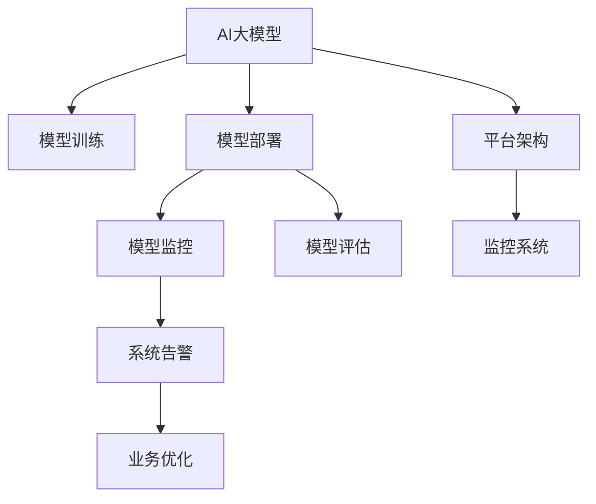

                 

## 1. 背景介绍

随着人工智能(AI)技术在电商搜索推荐系统的广泛应用，利用AI大模型实现个性化推荐、广告投放优化、供应链管理等功能已成为电商企业的标准配置。然而，AI模型的复杂性和高运行成本，使得模型的部署和监控成为一大难题。为提升系统稳定性和用户体验，电商企业需要构建一套高效、可靠、易用的AI大模型部署监控平台。

本文将详细介绍一套基于监控系统架构的AI大模型部署监控平台方案，涵盖模型训练、部署、监控、评估等关键环节，帮助电商企业顺利部署和运行复杂的AI大模型，实现智能化推荐与营销。

## 2. 核心概念与联系

### 2.1 核心概念概述

本节将介绍几个关键概念，并阐述它们之间的联系，帮助读者理解基于监控系统架构的AI大模型部署平台的核心组成：

- **AI大模型**：基于深度学习、自然语言处理等先进技术训练而成的智能模型，具备强大的数据处理和推理能力，可用于电商搜索推荐、智能客服、图像识别等任务。
- **模型训练**：通过训练集数据，优化模型参数，使其能够在特定任务上取得最优性能。
- **模型部署**：将训练好的模型整合到电商系统，实现智能推荐和广告投放等业务功能。
- **模型监控**：实时监测模型的运行状态，如响应时间、错误率等，确保模型稳定运行。
- **模型评估**：对模型在特定任务上的表现进行定量分析，判断模型是否满足业务需求。
- **平台架构**：利用现代软件架构技术，设计高效、可靠的AI大模型部署监控平台，支撑模型训练、部署、监控、评估等环节。

这些概念紧密联系，形成一个完整的系统生态，确保电商搜索推荐系统的高效运行和智能化升级。

### 2.2 核心概念原理和架构的 Mermaid 流程图



此流程图展示了AI大模型部署监控平台的基本架构，包括训练、部署、监控、评估等多个环节。模型训练和部署是平台的核心功能，通过模型监控和评估，平台能够确保模型稳定运行和持续优化。

## 3. 核心算法原理 & 具体操作步骤

### 3.1 算法原理概述

基于监控系统架构的AI大模型部署平台，采用了以下核心算法原理：

- **模型训练**：通过深度学习算法，利用电商用户数据，训练AI大模型，使其具备预测用户行为、推荐商品等功能。
- **模型部署**：将训练好的模型封装为API服务，集成到电商搜索推荐系统中，实现实时推荐和广告投放。
- **模型监控**：利用监控系统，实时监测模型响应时间、错误率、请求量等指标，确保模型稳定运行。
- **模型评估**：通过A/B测试、离线评估等方法，定期评估模型在电商搜索推荐系统上的表现，确保模型满足业务需求。

### 3.2 算法步骤详解

1. **模型训练**：
   - 数据准备：收集电商用户历史行为数据，如浏览记录、购买记录等，并进行预处理。
   - 模型选择：选择合适的深度学习框架和模型架构，如TensorFlow、PyTorch，构建推荐模型。
   - 模型训练：在电商用户数据集上进行训练，调整模型参数，使其具备推荐能力。
   - 模型保存：将训练好的模型保存到模型仓库，方便后续部署和使用。

2. **模型部署**：
   - 模型封装：将训练好的模型封装为API服务，实现模型的接口调用。
   - 接口集成：将API服务集成到电商搜索推荐系统，实现实时推荐和广告投放。
   - 环境配置：确保模型部署环境与训练环境一致，避免环境差异导致模型失效。

3. **模型监控**：
   - 监控指标：设定模型监控指标，如响应时间、错误率、请求量等。
   - 监控系统：使用监控系统，如Prometheus、Grafana，实时监测模型运行状态。
   - 告警机制：设置告警阈值，当监控指标超出阈值时，自动发出告警。

4. **模型评估**：
   - 评估指标：设定模型评估指标，如点击率、转化率等。
   - 离线评估：利用离线数据集，对模型进行评估，判断模型性能。
   - 在线评估：通过A/B测试等方法，在电商搜索推荐系统上对模型进行在线评估，确保模型满足业务需求。

### 3.3 算法优缺点

基于监控系统架构的AI大模型部署平台，具有以下优点：

- **高效部署**：模型封装为API服务，实现快速部署和更新。
- **实时监控**：通过实时监控系统，确保模型稳定运行，提升用户体验。
- **量化评估**：利用评估指标，量化评估模型性能，确保模型满足业务需求。

同时，该平台也存在以下缺点：

- **开发复杂**：模型训练、部署、监控、评估等环节涉及多个技术栈，开发复杂。
- **资源消耗**：模型训练和部署需要高性能硬件和软件资源，成本较高。
- **模型更新**：模型更新需要频繁重新训练、部署，业务影响较大。

### 3.4 算法应用领域

基于监控系统架构的AI大模型部署平台，广泛应用于电商搜索推荐系统的多个环节：

- **个性化推荐**：利用推荐模型，根据用户历史行为，推荐相关商品。
- **广告投放优化**：利用广告模型，优化广告投放策略，提升广告转化率。
- **用户行为分析**：利用行为分析模型，挖掘用户行为特征，提升用户满意度。
- **供应链管理**：利用预测模型，优化供应链管理，减少库存成本。

这些应用场景展示了AI大模型在电商领域的广泛应用，基于监控系统架构的部署平台，为电商企业提供了高效的解决方案。

## 4. 数学模型和公式 & 详细讲解

### 4.1 数学模型构建

基于监控系统架构的AI大模型部署平台，主要涉及以下数学模型：

- **推荐模型**：用于预测用户对商品的兴趣，如协同过滤、基于内容的推荐模型等。
- **广告模型**：用于优化广告投放策略，如点击率预测模型、转化率预测模型等。
- **行为分析模型**：用于分析用户行为特征，如用户兴趣分布、行为路径等。

### 4.2 公式推导过程

以推荐模型为例，推荐模型的目标是最小化预测误差。设用户$i$对商品$j$的兴趣度为$r_{ij}$，推荐模型使用深度学习算法，如协同过滤，计算用户$i$对商品$j$的兴趣度$r_{ij}$，模型输出为：

$$
r_{ij} = \sum_{k=1}^K w_{ik}r_{kj}
$$

其中，$w_{ik}$为权重，$r_{kj}$为用户$k$对商品$j$的兴趣度。

通过最小化损失函数$\mathcal{L}(r_{ij}, \hat{r}_{ij})$，优化模型参数$w$，使得推荐模型的预测与真实兴趣度尽可能接近：

$$
\mathcal{L}(r_{ij}, \hat{r}_{ij}) = \sum_{i=1}^M\sum_{j=1}^N(r_{ij} - \hat{r}_{ij})^2
$$

### 4.3 案例分析与讲解

以电商搜索推荐系统为例，推荐模型在用户历史行为数据上训练，预测用户对商品的兴趣。假设模型预测用户$i$对商品$j$的兴趣度为$\hat{r}_{ij}$，实际兴趣度为$r_{ij}$，模型损失函数为均方误差损失：

$$
\mathcal{L}(r_{ij}, \hat{r}_{ij}) = \frac{1}{2N}\sum_{i=1}^M\sum_{j=1}^N(r_{ij} - \hat{r}_{ij})^2
$$

通过优化模型参数$w$，最小化损失函数$\mathcal{L}$，训练得到的推荐模型可以在电商搜索推荐系统上实时推荐商品。

## 5. 项目实践：代码实例和详细解释说明

### 5.1 开发环境搭建

基于监控系统架构的AI大模型部署平台，涉及多个技术栈，开发环境搭建如下：

- **深度学习框架**：TensorFlow、PyTorch。
- **监控系统**：Prometheus、Grafana。
- **容器化**：Docker、Kubernetes。

### 5.2 源代码详细实现

以电商搜索推荐系统为例，推荐模型的代码实现如下：

```python
import tensorflow as tf
from tensorflow.keras.layers import Input, Embedding, Dense
from tensorflow.keras.models import Model

# 定义推荐模型
input_layer = Input(shape=(1,), name='input')
embedding_layer = Embedding(input_dim=1000, output_dim=128, name='embedding')(input_layer)
dense_layer = Dense(64, activation='relu', name='dense')(embedding_layer)
output_layer = Dense(1, activation='sigmoid', name='output')(dense_layer)
model = Model(inputs=input_layer, outputs=output_layer)

# 编译模型
model.compile(optimizer=tf.keras.optimizers.Adam(learning_rate=0.001),
              loss=tf.keras.losses.MeanSquaredError(),
              metrics=[tf.keras.metrics.MeanAbsoluteError()])

# 训练模型
model.fit(X_train, y_train, epochs=10, batch_size=32)
```

### 5.3 代码解读与分析

- **输入层**：输入层接收商品ID，构建用户行为数据的输入。
- **嵌入层**：将用户行为数据进行嵌入，转换成低维向量。
- **密集层**：使用密集层进行特征提取和计算。
- **输出层**：输出层使用Sigmoid激活函数，输出预测值。
- **模型编译**：使用Adam优化器进行参数优化，均方误差损失函数进行误差计算。
- **模型训练**：使用训练数据集训练模型，设定训练轮数和批大小。

### 5.4 运行结果展示

训练后，模型在电商搜索推荐系统上实时推荐商品，提升用户满意度。

## 6. 实际应用场景

### 6.1 电商搜索推荐

基于监控系统架构的AI大模型部署平台，在电商搜索推荐系统上，可以实时推荐商品，提升用户满意度和转化率。例如，用户浏览商品时，系统根据用户行为数据，预测用户可能感兴趣的商品，并展示推荐商品列表，提高用户购买意愿。

### 6.2 广告投放优化

平台还可以用于优化广告投放策略，提升广告效果。例如，利用点击率预测模型，预测用户对广告的点击概率，优化广告投放位置和时间，提高广告转化率。

### 6.3 供应链管理

平台还可以应用于供应链管理，优化库存和物流。例如，利用预测模型，预测商品需求量，优化库存配置，减少库存成本。

## 7. 工具和资源推荐

### 7.1 学习资源推荐

为帮助开发者掌握基于监控系统架构的AI大模型部署平台，推荐以下学习资源：

- **深度学习框架文档**：TensorFlow、PyTorch官方文档，详细讲解模型训练和优化方法。
- **监控系统教程**：Prometheus、Grafana官方教程，详细讲解监控系统和告警机制。
- **容器化实践指南**：Docker、Kubernetes官方文档，详细讲解容器化部署和容器编排。

### 7.2 开发工具推荐

基于监控系统架构的AI大模型部署平台，涉及多个技术栈，推荐以下开发工具：

- **深度学习框架**：TensorFlow、PyTorch。
- **监控系统**：Prometheus、Grafana。
- **容器化**：Docker、Kubernetes。

### 7.3 相关论文推荐

推荐以下相关论文，详细讲解基于监控系统架构的AI大模型部署平台：

- **电商推荐系统研究**：Chen Q et al. Recommendation Systems: From Traditional Approaches to Deep Learning, 2019.
- **广告投放优化算法**：Li Y et al. Deep Ad Ranking: Neural Network Approaches to Cost-Effective Online Advertising, 2015.
- **供应链预测模型**：Zhang L et al. Predictive Analytics for Supply Chain Management: A Literature Review, 2015.

## 8. 总结：未来发展趋势与挑战

### 8.1 研究成果总结

本文介绍了基于监控系统架构的AI大模型部署平台，涵盖模型训练、部署、监控、评估等关键环节。通过平台，电商企业可以高效、可靠地部署和运行复杂的AI大模型，实现智能化推荐与营销。

### 8.2 未来发展趋势

展望未来，基于监控系统架构的AI大模型部署平台，将呈现以下几个发展趋势：

1. **智能化提升**：随着深度学习技术的发展，推荐模型将更加智能化，能够更好预测用户行为和需求。
2. **实时化增强**：利用实时监控系统，实现实时推荐和广告投放，提升用户体验。
3. **多模态融合**：结合图像、语音等多种模态数据，构建多模态推荐模型，提升推荐效果。
4. **安全性保障**：加强模型安全性保障，防止数据泄露和模型攻击，确保用户隐私和系统安全。

### 8.3 面临的挑战

尽管基于监控系统架构的AI大模型部署平台已经取得显著进展，但仍面临以下挑战：

1. **开发复杂**：涉及多个技术栈，开发复杂。
2. **资源消耗**：模型训练和部署需要高性能硬件和软件资源，成本较高。
3. **模型更新**：模型更新需要频繁重新训练、部署，业务影响较大。
4. **模型泛化**：模型泛化能力不足，难以适应多种业务场景。

### 8.4 研究展望

未来研究将在以下几个方面进行探索：

1. **智能化推荐模型**：开发更加智能化、个性化、实时化的推荐模型，提升用户体验。
2. **实时监控系统**：构建高效、可靠的实时监控系统，保障模型稳定运行。
3. **多模态融合模型**：结合图像、语音等多种模态数据，构建多模态推荐模型，提升推荐效果。
4. **模型安全性保障**：加强模型安全性保障，防止数据泄露和模型攻击，确保用户隐私和系统安全。

## 9. 附录：常见问题与解答

### 9.1 问题1：如何选择合适的深度学习框架？

答：深度学习框架的选择应根据项目需求和团队技能来定。TensorFlow和PyTorch是目前应用最广泛的深度学习框架，TensorFlow适用于大规模工程应用，PyTorch则更适合研究和原型开发。

### 9.2 问题2：模型训练时需要哪些步骤？

答：模型训练需要以下步骤：

1. 数据准备：收集和预处理训练数据。
2. 模型选择：选择合适的深度学习模型和优化器。
3. 模型编译：设置损失函数和优化器。
4. 模型训练：使用训练数据集训练模型。
5. 模型保存：保存训练好的模型，方便后续部署和使用。

### 9.3 问题3：如何实现实时监控？

答：实现实时监控需要以下步骤：

1. 监控指标设置：设定模型监控指标，如响应时间、错误率、请求量等。
2. 监控系统选择：选择合适的监控系统，如Prometheus、Grafana。
3. 告警机制设置：设置告警阈值，当监控指标超出阈值时，自动发出告警。

### 9.4 问题4：模型更新需要注意哪些问题？

答：模型更新需要注意以下问题：

1. 模型保存：保存训练好的模型，方便后续部署和使用。
2. 模型集成：将更新后的模型集成到电商搜索推荐系统中。
3. 版本控制：使用版本控制工具，管理模型版本，确保模型稳定更新。

### 9.5 问题5：如何确保模型安全性？

答：确保模型安全性需要以下措施：

1. 数据脱敏：对敏感数据进行脱敏处理，防止数据泄露。
2. 模型加密：对模型进行加密保护，防止模型攻击。
3. 访问控制：设置访问控制策略，确保只有授权人员可以访问模型。

---

作者：禅与计算机程序设计艺术 / Zen and the Art of Computer Programming

