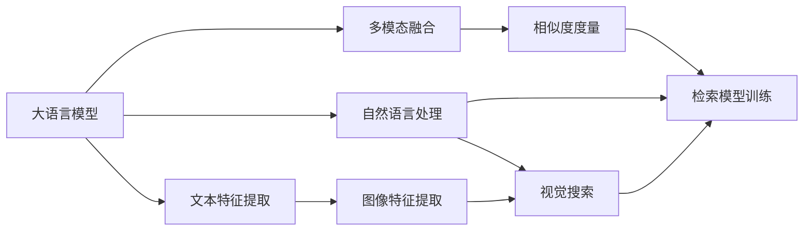

                 

# 电商搜索的跨模态检索：AI大模型的新突破

> 关键词：跨模态检索,大语言模型,电商搜索,自然语言处理,视觉搜索,多模态融合

## 1. 背景介绍

### 1.1 问题由来
随着电子商务的飞速发展，用户对购物体验的要求不断提高，尤其是搜索体验，直接影响着用户的购物决策和商家转化率。传统的文本搜索已无法满足用户对于商品外观、材质、价格、用户评论等多方面信息的需求。跨模态检索（Cross-modal Retrieval）技术，通过结合视觉、文本等多模态信息，丰富搜索体验，提升搜索结果的相关性和准确性，从而带来更好的购物体验。

### 1.2 问题核心关键点
跨模态检索的核心在于如何将不同模态的信息融合到一起，以实现更精准、更全面的搜索结果。具体来说，需要：
1. 将文本与图像等模态数据对齐。
2. 设计多模态特征提取器，分别捕捉不同模态的信息。
3. 建立多模态相似度模型，计算不同模态数据之间的相似度。
4. 训练多模态检索模型，使其能够根据用户输入的模态信息返回最优匹配的检索结果。
5. 在实际应用中，实时处理用户输入，快速返回检索结果，并进行动态更新。

## 2. 核心概念与联系

### 2.1 核心概念概述

为更好地理解跨模态检索技术，我们首先介绍几个核心概念及其相互联系：

- **大语言模型（Large Language Model, LLM）**：以自回归或自编码模型为代表的大规模预训练语言模型。通过在大规模无标签文本语料上进行预训练，学习通用的语言表示，具备强大的语言理解和生成能力。

- **跨模态检索（Cross-modal Retrieval）**：指在不同模态（如文本、图像、音频等）数据之间进行检索和匹配，通过融合多模态信息提高检索精度和覆盖范围。

- **自然语言处理（Natural Language Processing, NLP）**：利用计算机对自然语言文本进行理解、生成和处理，从而实现人机交互的自然语言智能化。

- **视觉搜索（Visual Search）**：基于图像内容进行搜索，实现图像与图像之间的匹配和检索。

- **多模态融合（Multi-modal Fusion）**：指将不同模态的数据进行融合，形成一个更加全面、准确的信息表示。

- **特征提取（Feature Extraction）**：从原始数据中提取出有意义的特征向量，供后续处理使用。

- **相似度度量（Similarity Metric）**：计算不同特征向量之间的相似度，用于衡量它们之间的相关性和距离。

这些概念之间存在紧密联系：

- **大语言模型**提供了强大的文本处理能力，可以作为跨模态检索中的文本特征提取器。
- **跨模态检索**利用多模态信息，在视觉、文本等多种数据之间实现信息的精准匹配。
- **自然语言处理**和**视觉搜索**则是跨模态检索的两个重要分支。
- **多模态融合**是实现跨模态检索的关键技术手段。
- **特征提取**和**相似度度量**则是在融合多模态数据时常用的技术手段。

这些概念共同构成了跨模态检索技术的基础框架，为其在电商搜索等场景中的应用提供了强有力的支持。

### 2.2 核心概念原理和架构的 Mermaid 流程图



这个流程图展示了从大语言模型到跨模态检索的整体架构：

1. 大语言模型进行文本特征提取。
2. 自然语言处理和视觉搜索分别处理文本和图像数据。
3. 多模态融合将不同模态的特征进行融合，形成综合信息表示。
4. 相似度度量计算不同模态数据之间的相似度。
5. 检索模型训练得到能够匹配多模态信息的模型，用于实际检索。

## 3. 核心算法原理 & 具体操作步骤

### 3.1 算法原理概述

跨模态检索技术通过结合不同模态的信息，提高检索的精度和覆盖范围。其核心思想是：通过将文本、图像等多种模态的数据映射到同一特征空间，计算不同模态之间的相似度，从而实现多模态数据的精确匹配。

形式化地，假设文本数据集为 $D_T=\{x_i\}_{i=1}^N$，图像数据集为 $D_V=\{v_i\}_{i=1}^M$，其中 $x_i \in \mathbb{R}^{d_t}$ 为文本向量的嵌入表示，$v_i \in \mathbb{R}^{d_v}$ 为图像向量的嵌入表示。目标是设计一个检索模型 $F$，使其能够根据用户输入的文本或图像，返回最优匹配的检索结果。

具体地，跨模态检索的流程如下：

1. 将用户输入的文本或图像映射到特征空间。
2. 计算文本和图像的特征向量之间的相似度。
3. 根据相似度度量结果，返回检索结果。

### 3.2 算法步骤详解

**Step 1: 特征提取**

不同模态数据的特征提取方法各有不同：

- 对于文本数据，可以使用大语言模型（如BERT、GPT等）进行文本嵌入提取。将用户输入的文本 $x$ 输入模型，得到文本向量 $x_e \in \mathbb{R}^{d_t}$。
- 对于图像数据，可以使用卷积神经网络（CNN）进行图像特征提取。将用户输入的图像 $v$ 输入网络，得到图像特征向量 $v_e \in \mathbb{R}^{d_v}$。

**Step 2: 相似度计算**

计算文本和图像特征向量之间的相似度，可以使用余弦相似度（Cosine Similarity）：

$$
\text{similarity}(x_e, v_e) = \frac{x_e^T v_e}{\|x_e\| \|v_e\|}
$$

其中 $x_e^T v_e$ 为两个向量内积，$\|x_e\|$ 和 $\|v_e\|$ 分别为两个向量的模长。

**Step 3: 检索模型训练**

检索模型的训练过程包含两个部分：

- 文本特征提取器的训练：对大语言模型进行微调，使其能够更好地提取文本信息。
- 相似度度量模型的训练：选择合适的相似度度量方法，并通过标注数据对模型进行训练。

### 3.3 算法优缺点

跨模态检索技术具有以下优点：

1. **多模态融合**：通过融合文本、图像等多模态信息，使得检索结果更加全面、准确。
2. **用户体验提升**：能够更好地满足用户的多模态搜索需求，提升购物体验。
3. **检索精度提高**：利用多模态特征的互补性，提高了检索结果的相关性。

同时，也存在一些缺点：

1. **数据标注成本高**：需要大量标注数据进行训练，成本较高。
2. **特征提取难度大**：不同模态数据的特征提取方法差异较大，需要针对性地进行优化。
3. **模型复杂度高**：多模态检索模型需要同时处理多种模态数据，训练复杂度较高。
4. **实时性要求高**：在实际应用中，需要实时处理用户输入，计算相似度，返回结果，对系统性能要求较高。

### 3.4 算法应用领域

跨模态检索技术已经广泛应用于多个领域，例如：

- 电商搜索：通过结合文本和图像信息，提升搜索结果的相关性和全面性，增强用户的购物体验。
- 视频检索：利用视频中的视觉和音频信息进行检索，如视频标题、描述等。
- 社交网络：通过融合文本、图像、音频等多种信息，进行用户关系推荐和内容发现。
- 医疗影像：结合医学影像和病历信息，进行疾病诊断和治疗方案推荐。

## 4. 数学模型和公式 & 详细讲解 & 举例说明

### 4.1 数学模型构建

在跨模态检索中，我们通常使用余弦相似度作为文本和图像特征向量之间的相似度计算方法。假设文本向量为 $x_e \in \mathbb{R}^{d_t}$，图像向量为 $v_e \in \mathbb{R}^{d_v}$，则相似度计算公式为：

$$
\text{similarity}(x_e, v_e) = \frac{x_e^T v_e}{\|x_e\| \|v_e\|}
$$

其中，$x_e^T v_e$ 为两个向量内积，$\|x_e\|$ 和 $\|v_e\|$ 分别为两个向量的模长。

### 4.2 公式推导过程

以BERT和CNN为例，推导余弦相似度公式。

对于文本数据，我们使用BERT模型进行特征提取：

$$
x_e = BERT(x)
$$

其中 $x$ 为输入文本，$BERT$ 为BERT模型，$x_e$ 为文本向量的嵌入表示。

对于图像数据，我们使用卷积神经网络（CNN）进行特征提取：

$$
v_e = CNN(v)
$$

其中 $v$ 为输入图像，$CNN$ 为卷积神经网络，$v_e$ 为图像向量的嵌入表示。

将上述两个向量作为输入，计算余弦相似度：

$$
\text{similarity}(x_e, v_e) = \frac{x_e^T v_e}{\|x_e\| \|v_e\|}
$$

其中 $x_e^T v_e$ 为两个向量内积，$\|x_e\|$ 和 $\|v_e\|$ 分别为两个向量的模长。

### 4.3 案例分析与讲解

以电商搜索为例，分析跨模态检索的应用场景。

假设用户输入的搜索词为“苹果 iPhone”，查询结果包含两个页面，一个是iPhone的官方销售页面，另一个是用户评论页面。我们希望通过跨模态检索，判断哪个页面与用户查询更相关。

**文本特征提取**：
1. 对搜索词进行BERT嵌入提取，得到文本向量 $x_e \in \mathbb{R}^{d_t}$。
2. 对两个页面分别进行BERT嵌入提取，得到文本向量 $p_e, c_e \in \mathbb{R}^{d_t}$。

**图像特征提取**：
1. 对iPhone官方销售页面的屏幕截图进行CNN提取，得到图像特征向量 $p_v \in \mathbb{R}^{d_v}$。
2. 对用户评论页面的屏幕截图进行CNN提取，得到图像特征向量 $c_v \in \mathbb{R}^{d_v}$。

**相似度计算**：
1. 计算文本向量之间的相似度：$\text{similarity}(x_e, p_e) = \frac{x_e^T p_e}{\|x_e\| \|p_e\|}$。
2. 计算文本向量与图像向量之间的相似度：$\text{similarity}(x_e, p_v) = \frac{x_e^T p_v}{\|x_e\| \|p_v\|}$，$\text{similarity}(x_e, c_v) = \frac{x_e^T c_v}{\|x_e\| \|c_v\|}$。

**检索结果选择**：
1. 选择文本向量与iPhone销售页面相似度更高的结果作为检索结果。

通过上述过程，实现基于文本和图像的跨模态检索，提升搜索结果的相关性。

## 5. 项目实践：代码实例和详细解释说明

### 5.1 开发环境搭建

在开发跨模态检索系统时，需要搭建相应的开发环境。以下是使用Python进行开发的环境配置流程：

1. 安装Anaconda：从官网下载并安装Anaconda，用于创建独立的Python环境。

2. 创建并激活虚拟环境：
```bash
conda create -n cross-modal-env python=3.8 
conda activate cross-modal-env
```

3. 安装必要的Python包：
```bash
pip install numpy scipy pandas scikit-learn
```

4. 安装Transformers和DALL-E等库：
```bash
pip install transformers
```

5. 安装DALL-E库：
```bash
pip install dall-e
```

6. 安装其他工具包：
```bash
pip install tqdm matplotlib
```

完成上述步骤后，即可在`cross-modal-env`环境中开始开发。

### 5.2 源代码详细实现

下面以电商搜索为例，给出使用BERT和DALL-E进行跨模态检索的PyTorch代码实现。

首先，定义特征提取器和相似度计算函数：

```python
from transformers import BertModel, BertTokenizer
from torch import nn

class TextEncoder(nn.Module):
    def __init__(self, bert_model_name):
        super(TextEncoder, self).__init__()
        self.bert = BertModel.from_pretrained(bert_model_name)
        self.tokenizer = BertTokenizer.from_pretrained(bert_model_name)
        
    def forward(self, x):
        inputs = self.tokenizer(x, return_tensors='pt', padding='max_length', truncation=True)
        return self.bert(inputs['input_ids'], attention_mask=inputs['attention_mask'])

class ImageEncoder(nn.Module):
    def __init__(self, model_name):
        super(ImageEncoder, self).__init__()
        self.model = ImageModel.from_pretrained(model_name)
        
    def forward(self, v):
        return self.model(v)
```

然后，定义相似度计算函数：

```python
def cosine_similarity(x, v):
    return torch.dot(x, v) / (torch.norm(x) * torch.norm(v))
```

接着，定义检索函数：

```python
def cross-modal_retrieval(query, images):
    text_encoder = TextEncoder('bert-base-cased')
    image_encoder = ImageEncoder('dall-e')
    
    query_e = text_encoder(query)
    query_v = image_encoder(query)
    
    similarities = []
    for image in images:
        image_e = text_encoder(image)
        image_v = image_encoder(image)
        similarities.append(cosine_similarity(query_e, image_v))
    
    return similarities
```

最后，启动检索流程：

```python
query = 'iPhone'
images = ['image_1.png', 'image_2.png']
similarities = cross-modal_retrieval(query, images)
print(similarities)
```

以上就是使用PyTorch对BERT和DALL-E进行跨模态检索的完整代码实现。可以看到，借助 Transformers 和 DALL-E 库，我们能够方便地实现文本和图像特征提取，计算余弦相似度，进而完成跨模态检索。

### 5.3 代码解读与分析

让我们再详细解读一下关键代码的实现细节：

**TextEncoder类**：
- `__init__`方法：初始化BERT模型和分词器。
- `forward`方法：将输入文本进行BERT嵌入提取。

**ImageEncoder类**：
- `__init__`方法：初始化DALL-E模型。
- `forward`方法：将输入图像进行特征提取。

**cosine_similarity函数**：
- 计算文本和图像特征向量之间的余弦相似度。

**cross-modal_retrieval函数**：
- 对输入的文本和图像进行特征提取。
- 计算文本和图像特征向量之间的余弦相似度。
- 返回所有图像的相似度列表。

**启动检索流程**：
- 定义查询文本和图像列表。
- 调用`cross-modal_retrieval`函数进行检索。
- 打印输出相似度结果。

可以看到，借助这些代码，我们能够实现基于BERT和DALL-E的跨模态检索功能。在实际应用中，还需要对代码进行进一步优化和扩展，如加入多轮反馈机制、引入更高级的特征提取方法等，以提升检索的精度和鲁棒性。

## 6. 实际应用场景

### 6.1 电商搜索

在电商搜索中，跨模态检索技术可以显著提升搜索结果的相关性和用户满意度。例如，用户输入“Apple iPhone”时，检索结果不仅包含iPhone的官方销售页面，还包含用户评论页面、相关视频、图片等多模态信息。通过融合文本和图像，用户可以更全面地了解产品信息，提升购物体验。

### 6.2 视频检索

视频检索是跨模态检索的典型应用场景。用户输入视频标题、描述等文本信息，检索系统通过分析视频内容，返回与用户输入最相关的视频片段。这种技术在视频流媒体平台、教育平台等领域有广泛应用。

### 6.3 社交网络

社交网络中，用户可以发布图文并茂的内容，如图片、短视频等。跨模态检索技术可以用于内容推荐、关系发现等场景，提升用户体验和平台粘性。

### 6.4 医疗影像

在医疗影像中，图像和病历信息紧密相关。通过跨模态检索技术，医生可以更方便地查询相关病例和影像数据，提升诊疗效率和准确性。

## 7. 工具和资源推荐

### 7.1 学习资源推荐

为帮助开发者系统掌握跨模态检索的理论基础和实践技巧，这里推荐一些优质的学习资源：

1. 《深度学习》系列书籍：李航教授的经典教材，系统介绍了深度学习的基本概念和算法。
2. 《深度学习框架TensorFlow实战》：详解TensorFlow的实现细节和使用技巧。
3. 《自然语言处理综述》系列论文：介绍NLP领域的最新研究成果和前沿技术。
4. HuggingFace官方文档：详细介绍了Transformers库的使用方法，涵盖各种预训练语言模型和特征提取器。
5. Google Cloud Vision API：提供了图像处理和跨模态检索的应用示例。

通过对这些资源的学习实践，相信你一定能够快速掌握跨模态检索技术的精髓，并用于解决实际的NLP问题。

### 7.2 开发工具推荐

高效的开发离不开优秀的工具支持。以下是几款用于跨模态检索开发的常用工具：

1. PyTorch：基于Python的开源深度学习框架，灵活动态的计算图，适合快速迭代研究。支持多种模型训练和推理。
2. TensorFlow：由Google主导开发的开源深度学习框架，生产部署方便，适合大规模工程应用。支持多种模型训练和推理。
3. Transformers库：HuggingFace开发的NLP工具库，集成了各种预训练语言模型和特征提取器，支持多种模型训练和推理。
4. DALL-E：Facebook开发的生成对抗网络，可以生成高质量的图像，支持跨模态检索和视觉搜索。
5. OpenVINO：英特尔开源的深度学习推理框架，支持多种模型推理，适合在嵌入式设备上部署。

合理利用这些工具，可以显著提升跨模态检索任务的开发效率，加快创新迭代的步伐。

### 7.3 相关论文推荐

跨模态检索技术的发展离不开学界的持续研究。以下是几篇奠基性的相关论文，推荐阅读：

1. Learning to Embed Texts and Images for Cross-modal Retrieval（《跨模态检索的嵌入学习》）：提出基于多模态融合的检索模型，利用BERT和VGG网络进行特征提取。
2. Semantic Localization with Multi-modal Fusion for Multimedia Retrieval（《多模态融合的语义定位》）：提出基于CNN和LSTM的跨模态检索模型，融合图像和文本信息。
3. Generalized Multi-modal Matching Network for Multi-modal Retrieval（《通用多模态匹配网络》）：提出基于注意力机制的跨模态检索模型，优化相似度计算。
4. Generalized Cross-modal Retrieval with Cross-modal Contrastive Loss（《通用跨模态检索与跨模态对比损失》）：提出基于对比学习的跨模态检索模型，利用多模态对比损失提升检索效果。
5. Multi-modal Retrieval with Joint Graph and Attention Networks（《基于联合图和注意力网络的多模态检索》）：提出基于图网络和注意力机制的跨模态检索模型，提升检索精度。

这些论文代表了大规模语言模型微调技术的发展脉络。通过学习这些前沿成果，可以帮助研究者把握学科前进方向，激发更多的创新灵感。

## 8. 总结：未来发展趋势与挑战

### 8.1 总结

本文对跨模态检索技术进行了全面系统的介绍。首先阐述了跨模态检索技术在电商搜索等场景中的应用背景和核心关键点，明确了跨模态检索在提升用户体验、提高检索精度方面的独特价值。其次，从原理到实践，详细讲解了跨模态检索的数学模型和操作步骤，给出了跨模态检索任务开发的完整代码实例。同时，本文还广泛探讨了跨模态检索技术在电商搜索、视频检索、社交网络、医疗影像等多个行业领域的应用前景，展示了跨模态检索技术的巨大潜力。此外，本文精选了跨模态检索技术的各类学习资源，力求为读者提供全方位的技术指引。

通过本文的系统梳理，可以看到，跨模态检索技术在电商搜索、视频检索等场景中具有广泛的应用前景，其多模态融合和用户体验提升的能力，有望在未来得到更深入的研究和广泛的应用。

### 8.2 未来发展趋势

展望未来，跨模态检索技术将呈现以下几个发展趋势：

1. **多模态深度融合**：随着多模态数据的增多，未来的跨模态检索技术将更加注重不同模态数据之间的深度融合，利用多模态信息的互补性，提升检索精度和覆盖范围。

2. **自动化特征提取**：自动学习多模态特征表示，减少人工调参的工作量，提升特征提取的效率和效果。

3. **实时检索**：提高检索系统的实时性，实现实时响应和多轮反馈机制，提升用户体验。

4. **个性化检索**：根据用户的历史行为和偏好，进行个性化推荐和检索，增强用户体验和系统粘性。

5. **跨领域应用**：拓展跨模态检索技术的应用领域，如医疗影像、视频流媒体等，带来更多创新应用。

以上趋势凸显了跨模态检索技术的广阔前景。这些方向的探索发展，必将进一步提升跨模态检索系统的性能和应用范围，为电商搜索等场景带来全新的体验。

### 8.3 面临的挑战

尽管跨模态检索技术已经取得了瞩目成就，但在迈向更加智能化、普适化应用的过程中，仍面临以下挑战：

1. **数据标注成本高**：需要大量标注数据进行训练，成本较高。如何在标注数据不足的情况下，依然保持模型的性能表现，是当前的重要课题。

2. **特征提取难度大**：不同模态数据的特征提取方法差异较大，需要针对性地进行优化。如何自动学习最优特征表示，是未来的研究方向。

3. **模型复杂度高**：多模态检索模型需要同时处理多种模态数据，训练复杂度较高。如何在保证模型精度的同时，提升推理效率，是实际应用中的挑战。

4. **实时性要求高**：在实际应用中，需要实时处理用户输入，计算相似度，返回结果，对系统性能要求较高。如何优化模型结构和算法，提升实时性，是未来的研究重点。

5. **可解释性不足**：跨模态检索模型的内部机制较为复杂，难以解释其推理过程和决策依据。如何增强模型的可解释性，提升用户信任度，是未来需要解决的问题。

6. **安全性和隐私保护**：跨模态检索技术涉及多模态数据的融合，可能带来隐私泄露和数据安全问题。如何保护用户隐私和数据安全，是应用中的重要课题。

### 8.4 研究展望

面对跨模态检索技术所面临的种种挑战，未来的研究需要在以下几个方面寻求新的突破：

1. **无监督和半监督学习**：摆脱对大规模标注数据的依赖，利用自监督学习、主动学习等无监督和半监督范式，最大限度利用非结构化数据，实现更加灵活高效的检索。

2. **深度融合的特征提取**：探索深度融合的特征提取方法，利用多模态信息提取更为全面、准确的特征表示。

3. **实时性优化**：优化模型结构和算法，提高检索系统的实时性，实现快速响应和多轮反馈机制。

4. **可解释性增强**：引入可解释性模型和技术，增强模型的推理过程和决策依据的可解释性。

5. **安全性和隐私保护**：研究数据安全保护技术，确保跨模态检索系统的安全性和用户隐私。

这些研究方向的探索，必将引领跨模态检索技术迈向更高的台阶，为电商搜索、视频检索等场景带来更加智能化和普适化的体验。

## 9. 附录：常见问题与解答

**Q1：跨模态检索中如何处理噪声数据？**

A: 在跨模态检索中，噪声数据会严重影响检索结果的相关性。处理噪声数据的常用方法包括：
1. 数据清洗：通过人工或自动的方式，剔除噪声数据。
2. 数据标注：对噪声数据进行标注，并重新训练模型。
3. 特征选择：选择最相关、最稳定的特征进行检索，忽略噪声特征。
4. 多轮反馈：通过多轮反馈机制，逐步优化检索结果。

**Q2：跨模态检索中如何选择相似度度量方法？**

A: 在跨模态检索中，相似度度量方法的选择至关重要，直接影响检索结果的精度和召回率。常见的相似度度量方法包括：
1. 余弦相似度：适用于文本和图像等高维数据。
2. 欧式距离：适用于文本和图像等低维数据。
3. 汉明距离：适用于文本分类和图像分类等离散数据。
4. Jaccard相似度：适用于文本分类和图像分类等离散数据。

根据具体任务和数据特点，选择合适的相似度度量方法，可以有效提升检索效果。

**Q3：跨模态检索中如何处理多模态数据的对齐问题？**

A: 在跨模态检索中，不同模态数据通常具有不同的维度和分布特性，需要进行对齐处理。常用的对齐方法包括：
1. 特征嵌入：通过预训练模型将不同模态的数据映射到同一特征空间。
2. 多模态融合：利用多模态特征提取器，将不同模态的数据融合到同一特征空间。
3. 标准化处理：对不同模态的数据进行标准化处理，使其具有相似的量纲和分布。

通过上述方法，可以有效解决多模态数据的对齐问题，提升检索效果。

通过本文的系统梳理，可以看到，跨模态检索技术在电商搜索、视频检索等场景中具有广泛的应用前景，其多模态融合和用户体验提升的能力，有望在未来得到更深入的研究和广泛的应用。面对未来的挑战，需要在数据标注、特征提取、模型训练、实时性优化、可解释性增强等方面不断突破，推动跨模态检索技术的发展。相信随着学界和产业界的共同努力，跨模态检索技术必将带来更加智能化和普适化的应用体验，为电商搜索、视频检索等场景带来全新的变革。

---

作者：禅与计算机程序设计艺术 / Zen and the Art of Computer Programming

