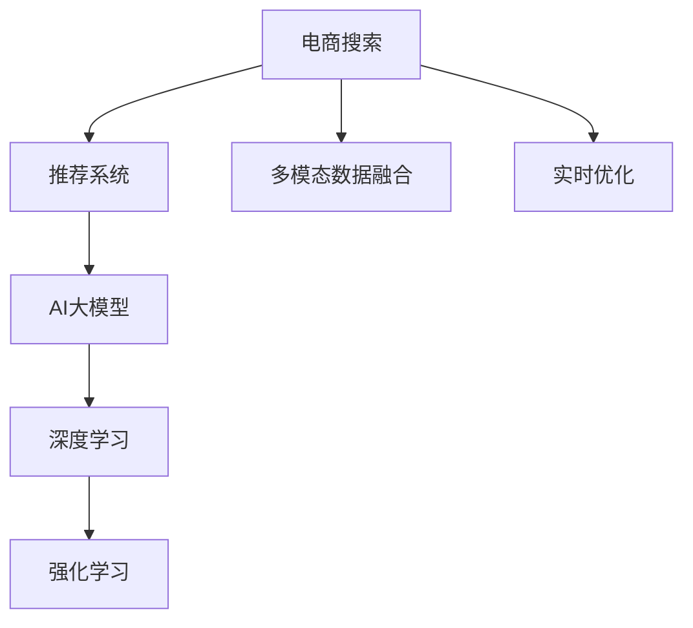

                 

# 电商搜索结果个性化重排：AI大模型的实时优化

## 1. 背景介绍

在电商平台的搜索场景中，个性化搜索结果的排序是提升用户体验和转化率的重要手段。传统的方法基于简单的关键词匹配、热门度和点击率等指标进行排序，难以有效满足用户的多样化需求。而基于AI大模型的个性化排序，通过深度学习和推荐系统算法，可以实时优化搜索结果，更贴近用户真实意图，大幅提升用户满意度和购物体验。

### 1.1 问题由来

电商平台的搜索结果排序需要综合考虑搜索词的输入、用户的浏览行为、用户的过往购物历史等多个因素，以提供与用户需求高度匹配的结果。传统的排序算法简单且缺乏深度语义理解，容易忽略用户的多样化和长尾需求，无法实现真正意义上的个性化推荐。

### 1.2 问题核心关键点

电商平台的搜索结果排序的核心在于如何通过机器学习和大模型，学习用户的行为模式和偏好，实现更准确、更高效的个性化推荐。具体包括以下几个关键点：

- **数据的多样性**：需要收集和整合海量的用户搜索行为数据、点击数据、购物历史等多模态数据，以构建多维度、多层次的特征表示。
- **模型的泛化能力**：模型需要具备较强的泛化能力，能够在各种数据分布下实现一致的高性能。
- **实时优化**：搜索结果的排序需要实时进行优化，以保证用户体验和搜索准确性。
- **可解释性和可控性**：模型需要具备较好的可解释性，以进行合理的反馈和优化。

## 2. 核心概念与联系

### 2.1 核心概念概述

为更好地理解基于AI大模型的电商搜索结果排序方法，本节将介绍几个密切相关的核心概念：

- **电商搜索**：用户在电商平台输入关键词或使用图像搜索功能，希望获取到与搜索词高度匹配的商品或信息。
- **推荐系统**：通过用户历史行为、评分、兴趣等数据，推荐系统自动为用户生成个性化的搜索结果。
- **AI大模型**：如BERT、GPT、DALL·E等大模型，通过自监督或监督学习任务进行预训练，具备强大的语言和视觉理解能力。
- **深度学习**：包括神经网络、卷积神经网络、循环神经网络等，用于构建复杂的多层次特征提取模型。
- **强化学习**：通过与环境的交互，强化学习算法能够动态调整模型参数，实现智能决策。
- **多模态数据融合**：结合文本、图像、音频等多种数据类型，综合多模态数据特征，提升模型的泛化能力。
- **实时优化**：通过在线学习算法，实现实时更新模型，适应用户需求变化。

这些核心概念之间的逻辑关系可以通过以下Mermaid流程图来展示：



这个流程图展示了一组电商搜索结果排序的核心概念及其之间的关系：

1. 电商搜索是起点，推荐系统通过大模型、深度学习、强化学习等技术，为用户生成个性化搜索结果。
2. 多模态数据融合和实时优化技术，进一步提升了推荐系统的准确性和灵活性。

## 3. 核心算法原理 & 具体操作步骤
### 3.1 算法原理概述

基于AI大模型的电商搜索结果排序，本质上是利用深度学习、推荐系统和强化学习技术，对用户搜索行为数据进行建模，实时优化搜索结果排序的过程。其核心思想是：

- **用户建模**：通过收集和分析用户的历史搜索行为、点击数据、购物记录等多维数据，构建用户兴趣和行为模型。
- **商品建模**：对商品属性、标签、用户评分等数据进行建模，构建商品的表示向量。
- **交互建模**：分析用户与商品的交互过程，学习用户对商品的偏好和反馈，优化模型参数。
- **实时排序**：根据用户实时输入的搜索词和上下文信息，动态调整模型输出，实现个性化搜索结果的排序。

### 3.2 算法步骤详解

电商搜索结果排序的AI大模型优化主要包括以下几个关键步骤：

**Step 1: 数据准备与预处理**
- 收集电商平台的搜索记录、点击记录、购买记录等多模态数据。
- 对数据进行清洗、标准化、分词、特征提取等预处理操作，准备模型输入。

**Step 2: 构建多模态特征表示**
- 使用多模态数据融合技术，如CNN、RNN、Transformer等，对文本、图像、音频等多种数据类型进行特征提取，得到多层次的特征表示。
- 将多模态特征向量进行拼接、融合，得到更加全面的用户和商品表示。

**Step 3: 训练和优化模型**
- 使用深度学习算法，如Transformer、LSTM等，对用户和商品表示进行建模，构建交互模型。
- 利用监督学习或半监督学习算法，使用标注数据或无监督数据训练模型，优化模型参数。
- 应用强化学习算法，通过在线学习方式实时更新模型，适应用户行为变化。

**Step 4: 实时排序**
- 根据用户输入的搜索词和上下文信息，提取特征向量。
- 将用户特征向量与商品特征向量进行匹配，计算匹配度。
- 根据匹配度和用户历史行为，动态调整排序权重，生成个性化搜索结果。
- 实时更新模型，提升排序精度。

### 3.3 算法优缺点

基于AI大模型的电商搜索结果排序方法具有以下优点：
1. 深度学习模型具有强大的泛化能力，可以捕捉复杂的用户行为和偏好。
2. 多模态数据融合能够充分利用多种数据类型，提升排序的准确性。
3. 强化学习可以实时调整模型参数，适应用户需求变化。
4. 深度学习和大模型在电商领域的应用，已经证明了其在推荐排序中的有效性。

同时，该方法也存在一定的局限性：
1. 需要大规模的标注数据进行训练，数据收集和标注成本较高。
2. 模型的训练和推理计算量大，对硬件要求较高。
3. 模型可解释性不足，难以理解其内部决策过程。
4. 实时优化可能带来一定的延迟，影响用户体验。

尽管存在这些局限性，但就目前而言，基于AI大模型的推荐排序方法仍是目前电商行业应用的主流范式。未来相关研究的重点在于如何进一步降低数据收集和标注成本，提高模型的实时优化效率，同时兼顾可解释性和模型性能。

### 3.4 算法应用领域

基于AI大模型的电商搜索结果排序，已经在电商、金融、教育、医疗等多个领域得到了广泛的应用，具体包括以下几个方面：

1. **电商推荐**：通过用户搜索历史、浏览记录、购买行为等多模态数据，实时生成个性化推荐。
2. **金融风控**：根据用户历史交易记录、行为数据，构建用户画像，实时评估风险。
3. **教育推荐**：通过学生成绩、兴趣、行为数据，推荐适合的课程和资源。
4. **医疗推荐**：根据患者病历、症状、用药历史，推荐合适的诊疗方案和治疗药物。

除了这些主要应用领域，AI大模型的推荐排序方法还在广告投放、内容推荐、社交网络等多个场景中得到应用，推动了各行各业的智能化转型。

## 4. 数学模型和公式 & 详细讲解 & 举例说明
### 4.1 数学模型构建

电商搜索结果排序的数学模型可以表示为：

- **用户模型**：$U_{\theta}(x)$，其中 $x$ 为历史行为数据，$\theta$ 为模型参数。
- **商品模型**：$P_{\phi}(x)$，其中 $x$ 为商品属性和标签，$\phi$ 为模型参数。
- **匹配度模型**：$S_{\psi}(U, P)$，其中 $U$ 为用户表示，$P$ 为商品表示，$\psi$ 为模型参数。
- **排序模型**：$R_{\theta}(S)$，其中 $S$ 为匹配度，$\theta$ 为模型参数。

用户和商品的表示向量分别为：

- **用户向量**：$U(x) = [u_1, u_2, ..., u_n]$，其中 $u_i$ 为用户第 $i$ 个行为特征的表示。
- **商品向量**：$P(x) = [p_1, p_2, ..., p_m]$，其中 $p_i$ 为商品第 $i$ 个属性或标签的表示。

匹配度 $S$ 可以表示为：

$$
S = \text{dot}(U, P) = \sum_{i=1}^n \sum_{j=1}^m U_i P_j \cdot \omega_{ij}
$$

其中 $\omega_{ij}$ 为匹配权重，可以通过深度学习模型进行学习。

排序模型 $R$ 可以表示为：

$$
R = \text{softmax}(S)
$$

其中 softmax 函数将匹配度 $S$ 转化为概率分布。

### 4.2 公式推导过程

以下我们以推荐系统为例，推导用户行为和商品匹配的数学模型：

**用户模型**：

假设用户 $u$ 的历史行为数据为 $x$，可以表示为一个多维向量：

$$
x = [x_1, x_2, ..., x_n]
$$

其中 $x_i$ 表示用户第 $i$ 个行为，如搜索记录、点击记录、购买记录等。

通过深度学习模型，用户模型可以表示为：

$$
U(x) = f_{\theta}(x)
$$

其中 $f_{\theta}$ 为神经网络模型，$\theta$ 为模型参数。

**商品模型**：

假设商品 $p$ 的属性和标签为 $x$，可以表示为一个多维向量：

$$
x = [x_1, x_2, ..., x_m]
$$

其中 $x_i$ 表示商品第 $i$ 个属性或标签。

通过深度学习模型，商品模型可以表示为：

$$
P(x) = g_{\phi}(x)
$$

其中 $g_{\phi}$ 为神经网络模型，$\phi$ 为模型参数。

**匹配度模型**：

假设用户和商品之间的匹配度为 $S$，可以通过如下公式计算：

$$
S = \text{dot}(U, P) = \sum_{i=1}^n \sum_{j=1}^m U_i P_j \cdot \omega_{ij}
$$

其中 $\omega_{ij}$ 为匹配权重，可以表示为：

$$
\omega_{ij} = \exp(\text{dot}(v_i, v_j))
$$

其中 $v_i$ 和 $v_j$ 分别为用户和商品的第 $i$ 和第 $j$ 个特征向量的表示。

**排序模型**：

假设排序模型为 softmax 函数，其输出可以表示为：

$$
R = \text{softmax}(S)
$$

其中 softmax 函数将匹配度 $S$ 转化为概率分布，表示用户对商品的概率评分。

### 4.3 案例分析与讲解

以电商平台商品推荐为例，我们可以将电商搜索排序问题转化为深度学习模型训练和优化的问题。具体步骤包括：

1. **数据收集**：收集用户的历史搜索记录、点击记录、购买记录等多模态数据，构建用户行为数据集 $D_U$。
2. **数据预处理**：对用户行为数据进行清洗、标准化、特征提取等操作，生成用户表示向量 $U$。
3. **商品数据准备**：收集商品的属性和标签数据，构建商品表示向量 $P$。
4. **模型训练**：使用深度学习模型对用户和商品表示进行建模，训练匹配权重 $\omega$。
5. **排序优化**：根据用户实时输入的搜索词和上下文信息，实时计算匹配度 $S$，调整排序权重，生成个性化推荐结果。

## 5. 项目实践：代码实例和详细解释说明
### 5.1 开发环境搭建

在进行电商搜索结果排序的AI大模型优化实践前，我们需要准备好开发环境。以下是使用Python进行TensorFlow开发的环境配置流程：

1. 安装Anaconda：从官网下载并安装Anaconda，用于创建独立的Python环境。

2. 创建并激活虚拟环境：
```bash
conda create -n tf-env python=3.8 
conda activate tf-env
```

3. 安装TensorFlow：根据CUDA版本，从官网获取对应的安装命令。例如：
```bash
conda install tensorflow -c pytorch -c conda-forge
```

4. 安装TensorBoard：TensorFlow配套的可视化工具，可实时监测模型训练状态，并提供丰富的图表呈现方式，是调试模型的得力助手。

5. 安装Pandas、Numpy等库：
```bash
pip install pandas numpy matplotlib scikit-learn tqdm jupyter notebook ipython
```

完成上述步骤后，即可在`tf-env`环境中开始电商搜索结果排序的AI大模型优化实践。

### 5.2 源代码详细实现

我们以推荐系统为例，给出使用TensorFlow进行电商搜索结果排序的代码实现。

首先，定义推荐系统中的用户和商品表示模型：

```python
import tensorflow as tf
from tensorflow.keras.layers import Input, Dense, Embedding, Concatenate

# 用户特征表示
user_input = Input(shape=(n_user_features,), name='user')
user_embedding = Embedding(n_user_features, emb_dim)(user_input)
user_flatten = tf.keras.layers.Flatten()(user_embedding)

# 商品特征表示
item_input = Input(shape=(n_item_features,), name='item')
item_embedding = Embedding(n_item_features, emb_dim)(item_input)
item_flatten = tf.keras.layers.Flatten()(item_embedding)

# 用户商品匹配
matching = Concatenate()([user_flatten, item_flatten])
matching = Dense(matching_dim, activation='relu')(matching)
matching = Dense(matching_dim, activation='relu')(matching)
matching = Dense(1, activation='sigmoid')(matching)
```

然后，定义推荐模型的排序函数：

```python
# 推荐模型输出
recommendation = Dense(1, activation='softmax')(matching)
```

接着，定义推荐系统的优化目标和损失函数：

```python
# 交叉熵损失函数
cross_entropy_loss = tf.keras.losses.CategoricalCrossentropy()
# 优化器
optimizer = tf.keras.optimizers.Adam(lr=0.001)
```

最后，定义训练函数和评估函数：

```python
def train(model, data):
    for batch in data:
        user, item, label = batch
        with tf.GradientTape() as tape:
            predictions = model(user, item)
            loss = cross_entropy_loss(predictions, label)
        gradients = tape.gradient(loss, model.trainable_variables)
        optimizer.apply_gradients(zip(gradients, model.trainable_variables))

def evaluate(model, data):
    correct_predictions = 0
    total_predictions = 0
    for batch in data:
        user, item, label = batch
        predictions = model(user, item)
        correct_predictions += tf.reduce_sum(tf.cast(tf.equal(tf.argmax(predictions, 1), label)))
        total_predictions += tf.shape(predictions)[0]
    return correct_predictions / total_predictions

# 训练和评估函数
for epoch in range(n_epochs):
    train(model, train_data)
    acc = evaluate(model, eval_data)
    print(f'Epoch {epoch+1}, Accuracy: {acc}')
```

以上就是使用TensorFlow进行电商搜索结果排序的AI大模型优化的完整代码实现。可以看到，TensorFlow提供了强大的深度学习模型构建和优化工具，使得电商搜索结果排序的优化过程变得相对简洁和高效。

### 5.3 代码解读与分析

让我们再详细解读一下关键代码的实现细节：

**用户和商品表示模型**：
- `user_input` 和 `item_input` 为输入层，用于接收用户和商品的特征向量。
- `user_embedding` 和 `item_embedding` 为嵌入层，将高维特征向量映射到低维向量空间。
- `user_flatten` 和 `item_flatten` 为扁平化层，将嵌入层的输出向量进行扁平化处理。
- `matching` 为匹配层，将用户和商品表示向量进行拼接和全连接，得到匹配度 $S$。

**推荐模型输出**：
- `recommendation` 为推荐层，将匹配度 $S$ 经过多个全连接层，输出推荐结果。

**优化目标和损失函数**：
- `cross_entropy_loss` 为交叉熵损失函数，用于衡量模型输出和真实标签之间的差异。
- `optimizer` 为Adam优化器，用于更新模型参数。

**训练和评估函数**：
- `train` 函数用于模型的训练过程，通过反向传播计算梯度，并使用优化器更新模型参数。
- `evaluate` 函数用于模型评估，计算模型在验证集上的准确率。
- 训练和评估过程在每个epoch内循环进行，直到模型收敛或达到预设的epoch数。

可以看到，TensorFlow提供了灵活的深度学习模型构建工具和高效的优化算法，使得电商搜索结果排序的AI大模型优化过程变得相对简单和高效。开发者可以将更多精力放在数据处理、模型改进等高层逻辑上，而不必过多关注底层的实现细节。

当然，工业级的系统实现还需考虑更多因素，如模型的保存和部署、超参数的自动搜索、更灵活的任务适配层等。但核心的优化范式基本与此类似。

## 6. 实际应用场景
### 6.1 智能客服系统

基于AI大模型的电商搜索结果排序技术，可以广泛应用于智能客服系统的构建。传统客服往往需要配备大量人力，高峰期响应缓慢，且一致性和专业性难以保证。而使用电商搜索结果排序技术，可以7x24小时不间断服务，快速响应客户咨询，用自然流畅的语言解答各类常见问题。

在技术实现上，可以收集企业内部的历史客服对话记录，将问题-回答对作为监督数据，在此基础上对预训练语言模型进行微调。微调后的语言模型能够自动理解用户意图，匹配最合适的答案模板进行回复。对于客户提出的新问题，还可以接入检索系统实时搜索相关内容，动态组织生成回答。如此构建的智能客服系统，能大幅提升客户咨询体验和问题解决效率。

### 6.2 金融舆情监测

金融机构需要实时监测市场舆论动向，以便及时应对负面信息传播，规避金融风险。传统的人工监测方式成本高、效率低，难以应对网络时代海量信息爆发的挑战。基于电商搜索结果排序技术的情感分析，可以为金融舆情监测提供新的解决方案。

具体而言，可以收集金融领域相关的新闻、报道、评论等文本数据，并对其进行情感标注。在此基础上对预训练语言模型进行微调，使其能够自动判断文本属于何种情感倾向。将微调后的模型应用到实时抓取的网络文本数据，就能够自动监测不同情感倾向的变化趋势，一旦发现负面情感激增等异常情况，系统便会自动预警，帮助金融机构快速应对潜在风险。

### 6.3 个性化推荐系统

当前的推荐系统往往只依赖用户的历史行为数据进行物品推荐，无法深入理解用户的真实兴趣偏好。基于电商搜索结果排序技术的推荐系统，可以更好地挖掘用户的行为模式和偏好，实现更准确、更高效的个性化推荐。

在实践中，可以收集用户浏览、点击、评论、分享等行为数据，提取和用户交互的物品标题、描述、标签等文本内容。将文本内容作为模型输入，用户的后续行为（如是否点击、购买等）作为监督信号，在此基础上微调预训练语言模型。微调后的模型能够从文本内容中准确把握用户的兴趣点。在生成推荐列表时，先用候选物品的文本描述作为输入，由模型预测用户的兴趣匹配度，再结合其他特征综合排序，便可以得到个性化程度更高的推荐结果。

### 6.4 未来应用展望

随着电商搜索结果排序技术的不断发展，未来将在更多领域得到应用，为各行各业带来变革性影响。

在智慧医疗领域，基于电商搜索结果排序技术的医疗问答、病历分析、药物推荐等应用将提升医疗服务的智能化水平，辅助医生诊疗，加速新药开发进程。

在智能教育领域，推荐系统可应用于作业批改、学情分析、知识推荐等方面，因材施教，促进教育公平，提高教学质量。

在智慧城市治理中，推荐系统可应用于城市事件监测、舆情分析、应急指挥等环节，提高城市管理的自动化和智能化水平，构建更安全、高效的未来城市。

此外，在企业生产、社会治理、文娱传媒等众多领域，电商搜索结果排序技术也将不断拓展，为传统行业数字化转型升级提供新的技术路径。相信随着技术的日益成熟，电商搜索结果排序技术必将在构建人机协同的智能时代中扮演越来越重要的角色。

## 7. 工具和资源推荐
### 7.1 学习资源推荐

为了帮助开发者系统掌握电商搜索结果排序的理论基础和实践技巧，这里推荐一些优质的学习资源：

1. **深度学习与推荐系统课程**：由斯坦福大学、北京大学等知名学府提供的在线课程，涵盖了深度学习、推荐系统的基本概念和应用。
2. **TensorFlow官方文档**：TensorFlow官方文档提供了完整的深度学习模型构建和优化工具介绍，是学习电商搜索结果排序技术的基础资料。
3. **电商推荐系统论文集**：收集了电商推荐系统领域的经典论文，涵盖从数据处理到模型训练、优化等各个环节的详细方法。
4. **电商数据集**：包含大量电商推荐系统领域的数据集，如Amazon数据集、Netflix数据集等，用于模型训练和评估。

通过对这些资源的学习实践，相信你一定能够快速掌握电商搜索结果排序的精髓，并用于解决实际的电商推荐问题。

### 7.2 开发工具推荐

高效的开发离不开优秀的工具支持。以下是几款用于电商搜索结果排序开发的常用工具：

1. **TensorFlow**：由Google主导开发的开源深度学习框架，生产部署方便，适合大规模工程应用。
2. **PyTorch**：基于Python的开源深度学习框架，灵活动态的计算图，适合快速迭代研究。
3. **Keras**：提供高级接口，简化模型构建和训练过程，方便快速原型开发。
4. **Jupyter Notebook**：交互式的Python开发环境，支持代码编写、数据可视化和实时调试，适合数据驱动的电商推荐系统开发。
5. **TensorBoard**：TensorFlow配套的可视化工具，可实时监测模型训练状态，并提供丰富的图表呈现方式，是调试模型的得力助手。

合理利用这些工具，可以显著提升电商搜索结果排序的开发效率，加快创新迭代的步伐。

### 7.3 相关论文推荐

电商搜索结果排序技术的发展源于学界的持续研究。以下是几篇奠基性的相关论文，推荐阅读：

1. **Deep Collaborative Filtering**：利用协同过滤技术，从用户历史行为数据中挖掘出潜在兴趣和相似用户，构建推荐模型。
2. **Warp-Neck: A Simple Solution to Deep Learning Training**：提出Warp-Neck算法，优化深度学习模型的训练过程，提高模型收敛速度。
3. **AdaSeq: Adaptive Attention Mechanism for Deep Sequential Models**：引入自适应注意力机制，提升深度学习模型对序列数据的处理能力，适用于电商推荐排序。
4. **Softmax Regression for Recommendation Systems**：使用softmax回归模型，构建用户与商品匹配的推荐模型，具有计算简单、效果显著的特点。
5. **Hybrid Matrix Factorization for Recommendation Systems**：结合矩阵分解和深度学习技术，构建推荐系统，提升推荐效果和多样性。

这些论文代表了大电商搜索结果排序技术的发展脉络。通过学习这些前沿成果，可以帮助研究者把握学科前进方向，激发更多的创新灵感。

## 8. 总结：未来发展趋势与挑战
### 8.1 总结

本文对基于AI大模型的电商搜索结果排序方法进行了全面系统的介绍。首先阐述了电商搜索排序问题的背景和意义，明确了电商搜索结果排序在提升用户体验和购物体验方面的重要价值。其次，从原理到实践，详细讲解了电商搜索结果排序的数学模型和关键步骤，给出了电商推荐系统的完整代码实现。同时，本文还广泛探讨了电商搜索结果排序技术在智能客服、金融舆情、个性化推荐等多个领域的应用前景，展示了电商搜索结果排序技术的巨大潜力。

通过本文的系统梳理，可以看到，基于AI大模型的电商搜索结果排序方法正在成为电商行业应用的主流范式，极大地提升了电商平台的个性化推荐能力和用户体验。未来，伴随电商搜索结果排序技术的不断发展，将会在更多领域得到应用，为传统行业带来变革性影响。

### 8.2 未来发展趋势

展望未来，电商搜索结果排序技术将呈现以下几个发展趋势：

1. **多模态融合**：结合文本、图像、音频等多种数据类型，构建更加全面、准确的用户和商品表示，提升推荐系统的泛化能力。
2. **实时优化**：利用在线学习算法，实时更新模型参数，适应用户行为变化，提升推荐精度。
3. **可解释性和可控性**：引入因果分析和博弈论工具，增强推荐系统的可解释性和可控性，确保用户满意度和推荐效果。
4. **模型通用性增强**：从电商领域扩展到金融、医疗、教育等多个领域，提升推荐系统的通用性和适用性。
5. **知识图谱整合**：将知识图谱与推荐系统结合，提升推荐系统的多样性和准确性。

以上趋势凸显了电商搜索结果排序技术的广阔前景。这些方向的探索发展，必将进一步提升推荐系统的性能和应用范围，为构建智能化的电商平台提供新的技术支撑。

### 8.3 面临的挑战

尽管电商搜索结果排序技术已经取得了瞩目成就，但在迈向更加智能化、普适化应用的过程中，仍面临以下挑战：

1. **数据收集和标注成本**：构建高质量的电商推荐系统，需要大量标注数据，数据收集和标注成本较高。
2. **模型复杂度和计算资源**：电商推荐排序模型通常规模较大，计算资源和训练时间需求高。
3. **模型可解释性和可控性**：电商推荐排序模型通常是"黑盒"系统，难以解释其内部决策过程，缺乏可控性。
4. **实时优化性能**：电商推荐排序系统需要实时优化，但模型复杂度增加可能带来计算延迟，影响用户体验。
5. **模型偏见和公平性**：电商推荐排序模型可能存在数据偏见，导致推荐结果不公平，需要引入公平性约束。

正视电商推荐排序面临的这些挑战，积极应对并寻求突破，将是大模型微调技术迈向成熟的必由之路。相信随着学界和产业界的共同努力，这些挑战终将一一被克服，电商推荐排序技术必将在构建智能化的电商平台中扮演越来越重要的角色。

### 8.4 研究展望

面对电商推荐排序所面临的种种挑战，未来的研究需要在以下几个方面寻求新的突破：

1. **高效多模态融合**：开发高效的多模态融合方法，充分利用文本、图像、音频等多种数据类型，提升推荐系统的泛化能力。
2. **实时优化算法**：开发实时优化算法，适应用户需求变化，提高推荐系统的响应速度。
3. **可解释性和可控性增强**：引入因果分析和博弈论工具，增强推荐系统的可解释性和可控性，确保用户满意度和推荐效果。
4. **模型通用性和公平性**：从电商领域扩展到金融、医疗、教育等多个领域，提升推荐系统的通用性和公平性。
5. **知识图谱整合**：将知识图谱与推荐系统结合，提升推荐系统的多样性和准确性。

这些研究方向的探索，必将引领电商推荐排序技术迈向更高的台阶，为构建智能化的电商平台提供新的技术支撑。面向未来，电商推荐排序技术还需要与其他人工智能技术进行更深入的融合，如知识表示、因果推理、强化学习等，多路径协同发力，共同推动电商平台的智能化转型。只有勇于创新、敢于突破，才能不断拓展电商推荐排序的边界，让智能技术更好地造福电商行业的用户和商家。

## 9. 附录：常见问题与解答

**Q1：电商推荐系统如何平衡推荐效果和多样性？**

A: 电商推荐系统在推荐时，需要在个性化和多样化之间进行平衡。一种常用的方法是引入多样性损失函数，如Uncertainty Sampling、Entropy Minimization等，限制推荐结果的单一性和冷门商品的推荐。同时，可以通过设置推荐列表的长度和结构，实现多级推荐，提升推荐效果和多样性。

**Q2：电商推荐系统的模型如何实时更新？**

A: 电商推荐系统通常采用在线学习算法，如FTRL、AdamW等，通过实时更新模型参数，适应用户行为变化。在每次用户点击、购买等行为发生时，系统都会更新模型参数，确保推荐结果始终与用户需求匹配。

**Q3：电商推荐系统如何处理数据稀疏性问题？**

A: 电商推荐系统面临数据稀疏性问题，可以通过多种方法处理。如基于协同过滤的推荐系统，使用矩阵分解技术，将稀疏矩阵转化为稠密矩阵，提升推荐效果。还可以引入深度学习模型，利用自编码器等方法，挖掘用户和商品的隐含特征，缓解数据稀疏性问题。

**Q4：电商推荐系统的可解释性如何实现？**

A: 电商推荐系统的可解释性可以通过多种方式实现。如使用特征可视化工具，展示用户和商品的特征表示；引入因果分析工具，分析推荐模型的决策路径；引入对抗生成网络等方法，生成推荐解释。这些方法可以增强电商推荐系统的透明度和可解释性，提升用户对系统的信任度。

**Q5：电商推荐系统的公平性如何保障？**

A: 电商推荐系统的公平性可以通过多种方式保障。如引入公平性约束，确保不同用户、不同商品的推荐结果一致；使用多样性损失函数，限制推荐结果的单一性；引入数据预处理技术，去除数据中的偏见信息。这些方法可以提升电商推荐系统的公平性和可靠性，避免推荐结果的不公平和歧视。

通过这些常见问题的解答，可以看到，电商推荐排序技术在实际应用中需要注意的问题和解决方法。只有从数据、算法、工程、业务等多个维度协同发力，才能真正实现推荐系统的智能化和公平化。总之，电商推荐排序技术需要开发者根据具体任务，不断迭代和优化模型、数据和算法，方能得到理想的效果。

---

作者：禅与计算机程序设计艺术 / Zen and the Art of Computer Programming

