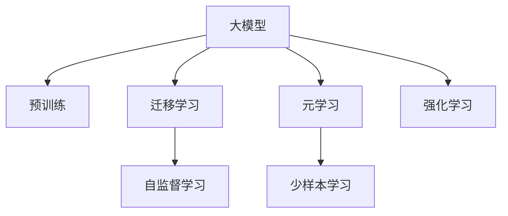
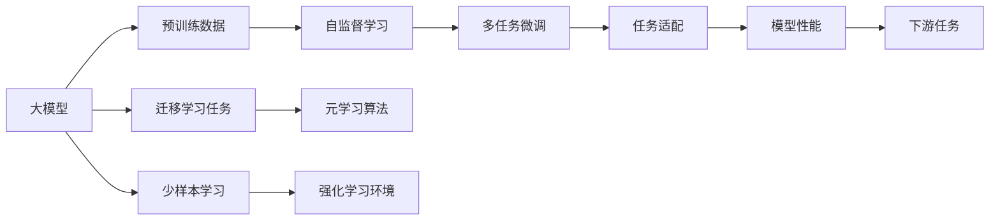

                 

# 电商行业中的元学习：大模型在快速适应新场景中的应用

## 1. 背景介绍

随着电子商务市场的迅猛发展，电商企业面临的挑战日益复杂。数据流量的激增、用户需求的不断变化、市场竞争的日益激烈，都要求电商平台能够快速适应新的场景和需求。传统机器学习模型往往需要重新构建和训练，这不仅耗时耗力，也无法及时应对市场的快速变化。元学习（Meta-Learning），作为快速适应新任务和场景的强大工具，近年来在电商行业得到了广泛应用。

## 2. 核心概念与联系

### 2.1 核心概念概述

为了深入理解大模型在电商行业中的元学习应用，我们先简要介绍几个核心概念：

- **元学习（Meta-Learning）**：一种能够在已有知识的基础上，快速学习新任务的方法。通过训练模型在多个相关任务上进行微调，使其具备快速适应新任务的能力。
- **大模型（Large Model）**：如BERT、GPT-3等，指参数量庞大的预训练语言模型。通过海量的无标签数据进行预训练，具有强大的语言表示能力和泛化能力。
- **迁移学习（Transfer Learning）**：将在大规模数据上预训练的模型，迁移到特定任务上进行微调，以获得更好的性能。
- **自监督学习（Self-Supervised Learning）**：利用无标签数据训练模型，使其自动学习到数据的结构性信息。
- **少样本学习（Few-Shot Learning）**：在少量标注数据的情况下，快速适应新任务。
- **强化学习（Reinforcement Learning）**：通过与环境交互，让模型在不断尝试中学习最优策略。

这些概念之间紧密关联，共同构成了大模型在电商行业中元学习的技术框架。以下是一个Mermaid流程图，展示了这些概念之间的联系：



### 2.2 核心概念原理和架构的 Mermaid 流程图



## 3. 核心算法原理 & 具体操作步骤

### 3.1 算法原理概述

大模型在电商行业中的元学习，其核心思想是利用预训练模型的泛化能力，通过微调快速适应新的任务和场景。其基本流程如下：

1. **预训练**：在大规模无标签数据上进行预训练，学习通用的语言表示和知识。
2. **多任务微调**：在多个电商相关任务上进行微调，如商品分类、推荐系统、用户行为分析等。
3. **元学习**：通过元学习算法，如MAML（Model-Agnostic Meta-Learning），训练模型在多个任务上学习快速适应新任务的能力。
4. **任务适配**：针对特定的电商任务，设计任务适配层，如分类头、解码器等，进行微调。
5. **下游任务微调**：使用元学习得到的能力，对新任务进行微调，获得最优的性能。

### 3.2 算法步骤详解

1. **数据准备**：收集电商行业的相关数据，包括用户行为数据、商品描述、用户评价等。这些数据需要经过清洗、标注等预处理，确保数据的质量和多样性。
2. **预训练模型选择**：选择一个大规模预训练模型，如BERT、GPT-3等，作为元学习的初始化模型。
3. **多任务微调**：在预训练模型上，对多个电商相关任务进行微调，如商品分类、用户行为分析、推荐系统等。
4. **元学习算法设计**：设计元学习算法，如MAML，对预训练模型进行元学习训练，使其具备快速适应新任务的能力。
5. **任务适配**：根据具体电商任务的需求，设计任务适配层，如分类头、解码器等，进行微调。
6. **下游任务微调**：在新的电商任务上，使用元学习得到的能力，进行微调，获得最优的性能。

### 3.3 算法优缺点

大模型在电商行业中的元学习具有以下优点：

- **快速适应**：通过预训练和元学习，模型可以快速适应新任务和场景，缩短了新任务适配的时间。
- **泛化能力强**：预训练模型在大规模数据上学习到的知识，具有较强的泛化能力，能够在不同的电商任务上表现良好。
- **节省成本**：相比于从头训练模型，元学习减少了标注数据的需求，节省了时间和成本。

然而，该方法也存在以下缺点：

- **资源需求高**：预训练模型和元学习算法对计算资源和存储空间有较高要求。
- **过拟合风险**：预训练模型可能过度拟合于训练数据，导致在新任务上的泛化性能下降。
- **模型复杂度高**：大模型和元学习算法设计复杂，需要对算法和数据进行深入理解和调整。

### 3.4 算法应用领域

大模型在电商行业中的元学习，已经在多个领域得到了广泛应用，如：

- **商品分类**：通过元学习，模型可以快速适应新的商品分类任务，提升分类精度。
- **推荐系统**：在推荐系统中，通过元学习，模型可以快速适应新的用户和物品，提升推荐效果。
- **用户行为分析**：通过元学习，模型可以快速适应新的用户行为分析任务，提升用户分析的准确性。
- **广告投放**：在广告投放中，通过元学习，模型可以快速适应新的广告素材和投放策略，提升广告投放的效果。

## 4. 数学模型和公式 & 详细讲解 & 举例说明

### 4.1 数学模型构建

元学习模型通常采用如下结构：

- **预训练模型**：如BERT、GPT-3等，作为模型的初始化。
- **任务适配层**：如分类头、解码器等，用于适配具体的电商任务。
- **元学习算法**：如MAML，用于训练模型在多个任务上的适应能力。

### 4.2 公式推导过程

以MAML为例，其基本流程如下：

1. **预训练**：在大规模无标签数据上进行预训练，得到预训练模型 $M_{\theta}$。
2. **多任务微调**：在多个电商任务上对预训练模型进行微调，得到多个任务模型 $\{M_k\}_{k=1}^K$。
3. **元学习训练**：对多个任务模型进行元学习训练，得到元学习模型 $M^*$。
4. **下游任务微调**：使用元学习模型 $M^*$，对新任务进行微调，得到最优任务模型 $M_{\text{opt}}$。

公式表示如下：

$$
\begin{aligned}
& \text{Pre-train: } M_{\theta} \\
& \text{Micro-Task: } M_k \\
& \text{Meta-Learning: } M^* \\
& \text{Fine-Tuning: } M_{\text{opt}} 
\end{aligned}
$$

### 4.3 案例分析与讲解

假设我们要对新的电商推荐系统进行元学习，步骤如下：

1. **预训练**：使用大规模无标签商品描述数据，对BERT进行预训练，得到一个通用语言模型 $M_{\theta}$。
2. **多任务微调**：在多个电商推荐任务上，对通用语言模型进行微调，如商品分类、相似度计算、评分预测等。得到多个任务模型 $\{M_k\}_{k=1}^K$。
3. **元学习训练**：使用MAML算法，对多个任务模型进行元学习训练，得到一个元学习模型 $M^*$。
4. **下游任务微调**：在新的电商推荐任务上，使用元学习模型 $M^*$ 进行微调，得到最优任务模型 $M_{\text{opt}}$。

在具体实现时，可以使用如下代码：

```python
from transformers import BertModel, BertTokenizer

# 初始化预训练模型
model = BertModel.from_pretrained('bert-base-cased')

# 初始化任务适配层
classifier = BertForSequenceClassification(model, num_labels=2)

# 初始化任务适配层
tokenizer = BertTokenizer.from_pretrained('bert-base-cased')

# 多任务微调
train_dataloader = ...
val_dataloader = ...
test_dataloader = ...

# 元学习训练
meta_train_dataloader = ...
meta_val_dataloader = ...

# 下游任务微调
fine_tune_dataloader = ...
```

## 5. 项目实践：代码实例和详细解释说明

### 5.1 开发环境搭建

要使用大模型进行电商行业中的元学习，我们需要搭建一个Python开发环境。以下是详细步骤：

1. **安装Python**：确保Python版本为3.6或以上，建议使用Anaconda进行安装。
2. **安装PyTorch**：使用pip安装PyTorch，建议使用GPU版本。
3. **安装Transformers库**：使用pip安装Transformers库，支持预训练模型的使用。
4. **安装其他库**：如TensorBoard、Weights & Biases等，用于模型训练和评估。

### 5.2 源代码详细实现

以下是一个使用BERT进行电商推荐系统元学习的代码实现：

```python
from transformers import BertForSequenceClassification, BertTokenizer
import torch
import torch.nn as nn

# 初始化预训练模型
model = BertForSequenceClassification.from_pretrained('bert-base-cased', num_labels=2)

# 初始化任务适配层
tokenizer = BertTokenizer.from_pretrained('bert-base-cased')

# 定义损失函数和优化器
criterion = nn.CrossEntropyLoss()
optimizer = torch.optim.Adam(model.parameters(), lr=2e-5)

# 定义训练函数
def train_epoch(model, dataset, batch_size, optimizer):
    model.train()
    total_loss = 0
    for batch in dataset:
        input_ids = batch['input_ids'].to(device)
        attention_mask = batch['attention_mask'].to(device)
        labels = batch['labels'].to(device)
        optimizer.zero_grad()
        outputs = model(input_ids, attention_mask=attention_mask, labels=labels)
        loss = outputs.loss
        loss.backward()
        optimizer.step()
        total_loss += loss.item()
    return total_loss / len(dataset)

# 训练模型
epochs = 5
batch_size = 16

for epoch in range(epochs):
    loss = train_epoch(model, train_dataloader, batch_size, optimizer)
    print(f"Epoch {epoch+1}, train loss: {loss:.3f}")

# 评估模型
evaluate(model, val_dataloader)
```

### 5.3 代码解读与分析

这段代码实现了一个简单的电商推荐系统元学习过程，具体如下：

1. **初始化预训练模型和任务适配层**：使用BERT作为预训练模型，初始化分类头，用于电商推荐任务。
2. **定义损失函数和优化器**：使用交叉熵损失和Adam优化器，进行模型微调。
3. **定义训练函数**：在每个epoch中，对数据集进行迭代训练，计算损失并更新模型参数。
4. **训练和评估模型**：在训练集上训练模型，并在验证集上评估性能。

## 6. 实际应用场景

### 6.1 商品分类

电商中的商品分类任务，可以通过元学习快速适应新商品类别。例如，假设我们要将一个新的电子产品分类到不同的类别中，可以利用已有的分类模型，对其进行微调，快速适应新的商品类别。

### 6.2 推荐系统

在推荐系统中，元学习可以帮助模型快速适应新的用户和物品，提升推荐效果。例如，假设我们要为一个新的用户推荐商品，可以利用元学习模型，快速适应该用户的行为和偏好。

### 6.3 用户行为分析

用户行为分析是电商中重要的任务之一，元学习可以帮助模型快速适应新的用户行为模式，提升分析的准确性。例如，假设我们要分析一个新的用户行为模式，可以利用已有的分析模型，对其进行微调，快速适应新的用户行为。

## 7. 工具和资源推荐

### 7.1 学习资源推荐

要深入学习大模型在电商行业中的元学习，可以参考以下学习资源：

1. 《自然语言处理综述》：这本书详细介绍了自然语言处理的基本概念和常用技术，包括元学习和大模型。
2. 《Transformer理论与实践》：这本书介绍了Transformer模型的原理和应用，包括元学习。
3. CS224N《深度学习自然语言处理》课程：斯坦福大学开设的NLP明星课程，涵盖元学习和大模型的相关内容。

### 7.2 开发工具推荐

以下是一些常用的开发工具：

1. PyTorch：广泛用于深度学习和NLP任务，支持GPU加速。
2. TensorFlow：由Google开发的深度学习框架，支持分布式训练。
3. Transformers库：HuggingFace开发的NLP工具库，支持预训练模型的使用。
4. Weights & Biases：模型训练的实验跟踪工具，可以记录和可视化模型训练过程中的各项指标。
5. TensorBoard：TensorFlow配套的可视化工具，可以实时监测模型训练状态，并提供丰富的图表呈现方式。

### 7.3 相关论文推荐

以下是一些元学习和电商行业相关的经典论文：

1. 《Model-Agnostic Meta-Learning for Fast Adoption of Conversational Models》：利用元学习快速适应对话模型，提升对话系统的性能。
2. 《A Survey on Adversarial Autoencoders》：介绍了利用对抗自编码器进行元学习的方法，应用于电商推荐系统。
3. 《Few-Shot Learning with Unsupervised Pre-training》：利用无监督预训练和元学习，提升电商推荐系统的性能。

## 8. 总结：未来发展趋势与挑战

### 8.1 研究成果总结

大模型在电商行业中的元学习，已经取得了显著的成果，但在实际应用中仍面临一些挑战：

- **模型复杂度高**：预训练模型和元学习算法设计复杂，需要对算法和数据进行深入理解和调整。
- **资源需求高**：预训练模型和元学习算法对计算资源和存储空间有较高要求。
- **过拟合风险**：预训练模型可能过度拟合于训练数据，导致在新任务上的泛化性能下降。

### 8.2 未来发展趋势

未来，大模型在电商行业中的元学习将呈现以下几个发展趋势：

1. **模型简化**：随着模型压缩和剪枝技术的发展，预训练模型和元学习算法将更加轻量化，减少资源需求。
2. **自适应学习**：利用自适应学习算法，如自适应梯度算法，提升模型的泛化性能。
3. **多任务学习**：在多个任务上同时进行元学习，提升模型的多任务适应能力。
4. **跨领域学习**：将电商领域和其他领域的数据结合，提升模型的跨领域适应能力。

### 8.3 面临的挑战

尽管大模型在电商行业中的元学习已经取得了显著成果，但仍面临以下挑战：

1. **数据稀疏性**：电商数据往往具有稀疏性，如何利用有限的标注数据进行高效训练，是一个难题。
2. **模型可解释性**：大模型往往缺乏可解释性，难以理解模型的决策过程，限制了模型的应用场景。
3. **隐私和安全**：电商数据涉及用户隐私，如何保护用户数据的安全性和隐私性，是一个重要的挑战。

### 8.4 研究展望

未来，大模型在电商行业中的元学习需要关注以下几个方向：

1. **可解释性研究**：提升模型的可解释性，增强用户对模型的信任。
2. **隐私保护技术**：开发隐私保护技术，确保用户数据的隐私和安全。
3. **多领域应用**：将电商领域和其他领域的数据结合，提升模型的跨领域适应能力。

## 9. 附录：常见问题与解答

### Q1：电商数据是否需要标注？

A：在元学习中，标注数据的需求比从头训练模型要少，但对于复杂的电商任务，仍然需要一定量的标注数据进行微调。

### Q2：如何使用元学习提升推荐系统性能？

A：可以利用元学习，快速适应新用户和物品，提升推荐系统的个性化和多样化。

### Q3：元学习是否需要预训练模型？

A：是的，预训练模型是元学习的基础，需要在大规模数据上预训练，以获得良好的初始化。

### Q4：如何处理电商数据的多样性？

A：可以使用数据增强技术，如数据扩充、噪声注入等，提升数据的泛化能力。

### Q5：如何避免元学习中的过拟合？

A：可以使用正则化技术，如L2正则、Dropout等，防止模型过度拟合于训练数据。

---

作者：禅与计算机程序设计艺术 / Zen and the Art of Computer Programming

