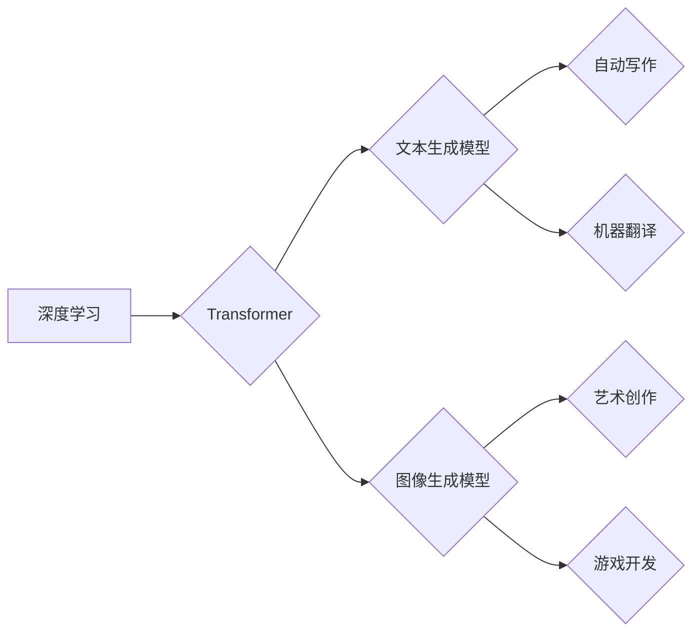

> AIGC, 文本生成, 图像生成, 算法原理, 数学模型, 项目实践, 应用场景, 未来趋势

## 1. 背景介绍

人工智能（AI）技术近年来发展迅速，特别是生成式人工智能（AIGC）的兴起，为人们的生活和工作带来了革命性的改变。AIGC是指能够生成新内容的AI模型，例如文本、图像、音频、视频等。其中，文本生成和图像生成是AIGC领域最具代表性的应用场景。

文本生成模型能够理解和生成人类语言，可以用于各种应用，例如自动写作、机器翻译、聊天机器人等。图像生成模型能够根据文本描述生成图像，可以用于艺术创作、游戏开发、广告设计等。

AIGC技术的发展离不开深度学习算法的进步。深度学习算法能够从海量数据中学习到复杂的模式和规律，从而实现对新内容的生成。

## 2. 核心概念与联系

AIGC的核心概念包括：

* **深度学习:** AIGC模型的底层技术是深度学习，它是一种机器学习的子领域，利用多层神经网络来模拟人类大脑的学习过程。
* **Transformer:** Transformer是一种新型的神经网络架构，它能够有效地处理序列数据，例如文本和音频。Transformer模型在自然语言处理领域取得了突破性的进展，例如BERT、GPT等模型都是基于Transformer架构的。
* **生成对抗网络 (GAN):** GAN是一种由两个神经网络组成的模型，一个是生成器，一个是鉴别器。生成器试图生成逼真的数据，而鉴别器试图区分真实数据和生成数据。GAN模型在图像生成领域取得了显著的成果。

**Mermaid 流程图:**



## 3. 核心算法原理 & 具体操作步骤

### 3.1  算法原理概述

AIGC的核心算法原理是基于深度学习的生成模型，例如Transformer和GAN。这些模型通过学习大量的训练数据，能够捕捉到数据中的模式和规律，从而生成新的内容。

### 3.2  算法步骤详解

**文本生成模型:**

1. **数据预处理:** 将文本数据进行清洗、分词、词向量化等预处理操作。
2. **模型训练:** 使用Transformer模型训练，输入预处理后的文本数据，输出预测的下一个词。
3. **文本生成:** 根据训练好的模型，输入一个文本提示，模型会根据提示生成新的文本内容。

**图像生成模型:**

1. **数据预处理:** 将图像数据进行裁剪、缩放、增强等预处理操作。
2. **模型训练:** 使用GAN模型训练，生成器试图生成逼真的图像，鉴别器试图区分真实图像和生成图像。
3. **图像生成:** 根据训练好的模型，输入一个文本描述，模型会根据描述生成相应的图像。

### 3.3  算法优缺点

**优点:**

* **生成高质量内容:** AIGC模型能够生成逼真、高质量的文本和图像内容。
* **自动化生产:** AIGC可以自动化生产内容，提高效率。
* **个性化定制:** AIGC可以根据用户的需求进行个性化定制。

**缺点:**

* **数据依赖:** AIGC模型需要大量的训练数据，数据质量直接影响模型性能。
* **伦理问题:** AIGC可能被用于生成虚假信息，引发伦理问题。
* **成本高昂:** 训练AIGC模型需要大量的计算资源，成本较高。

### 3.4  算法应用领域

AIGC技术在各个领域都有广泛的应用，例如：

* **内容创作:** 自动写作、生成创意内容、制作视频脚本等。
* **教育培训:** 生成个性化学习内容、辅助教学等。
* **营销推广:** 生成广告文案、设计营销素材等。
* **艺术设计:** 生成艺术作品、设计游戏场景等。

## 4. 数学模型和公式 & 详细讲解 & 举例说明

### 4.1  数学模型构建

AIGC模型通常基于深度学习框架，例如TensorFlow和PyTorch。这些框架提供了一系列的数学模型和算法，可以用于构建AIGC模型。

**Transformer模型:** Transformer模型的核心是注意力机制，它能够捕捉到文本序列中不同词之间的关系。注意力机制的数学公式如下：

$$
Attention(Q, K, V) = softmax(\frac{QK^T}{\sqrt{d_k}})V
$$

其中：

* $Q$：查询矩阵
* $K$：键矩阵
* $V$：值矩阵
* $d_k$：键向量的维度

**GAN模型:**

GAN模型由两个神经网络组成：生成器和鉴别器。生成器的目标是生成逼真的数据，鉴别器的目标是区分真实数据和生成数据。

### 4.2  公式推导过程

Transformer模型的注意力机制公式推导过程比较复杂，涉及到矩阵运算、softmax函数等。

GAN模型的训练过程是一个博弈过程，生成器和鉴别器相互竞争，不断提升自己的性能。

### 4.3  案例分析与讲解

**Transformer模型案例:**

BERT模型是基于Transformer架构的预训练语言模型，它在自然语言理解任务中取得了优异的成绩。BERT模型通过在大量的文本数据上进行预训练，学习到语言的语义和语法知识，从而能够更好地理解和生成文本。

**GAN模型案例:**

StyleGAN模型是一种图像生成模型，它能够生成高质量的图像，并可以控制图像的风格和属性。StyleGAN模型通过训练生成器和鉴别器，学习到图像的生成规律，从而能够生成逼真的图像。

## 5. 项目实践：代码实例和详细解释说明

### 5.1  开发环境搭建

AIGC项目开发需要准备以下开发环境：

* **操作系统:** Linux或macOS
* **编程语言:** Python
* **深度学习框架:** TensorFlow或PyTorch
* **GPU:** 训练AIGC模型需要强大的计算能力，建议使用GPU加速。

### 5.2  源代码详细实现

以下是一个简单的文本生成模型的代码示例，使用PyTorch框架实现：

```python
import torch
import torch.nn as nn

class TextGenerator(nn.Module):
    def __init__(self, vocab_size, embedding_dim, hidden_dim):
        super(TextGenerator, self).__init__()
        self.embedding = nn.Embedding(vocab_size, embedding_dim)
        self.lstm = nn.LSTM(embedding_dim, hidden_dim)
        self.fc = nn.Linear(hidden_dim, vocab_size)

    def forward(self, x):
        embedded = self.embedding(x)
        output, (hidden, cell) = self.lstm(embedded)
        output = self.fc(output[:, -1, :])
        return output

# ... 模型训练和使用代码 ...
```

### 5.3  代码解读与分析

* **embedding层:** 将单词转换为向量表示。
* **lstm层:** 使用长短期记忆网络来处理文本序列。
* **fc层:** 将lstm层的输出转换为预测下一个单词的概率分布。

### 5.4  运行结果展示

训练好的文本生成模型可以根据输入的文本提示，生成新的文本内容。

## 6. 实际应用场景

### 6.1  内容创作

AIGC可以用于自动生成各种类型的文本内容，例如：

* **新闻报道:** 根据事件数据自动生成新闻报道。
* **博客文章:** 根据关键词自动生成博客文章。
* **小说:** 根据情节梗概自动生成小说。

### 6.2  教育培训

AIGC可以用于生成个性化的学习内容，例如：

* **习题:** 根据学生的学习进度自动生成习题。
* **讲解视频:** 根据教材内容自动生成讲解视频。
* **虚拟导师:** 提供个性化的学习指导。

### 6.3  营销推广

AIGC可以用于生成营销素材，例如：

* **广告文案:** 根据产品特点自动生成广告文案。
* **社交媒体内容:** 根据目标用户自动生成社交媒体内容。
* **电子邮件营销:** 根据客户信息自动生成个性化的电子邮件营销内容。

### 6.4  未来应用展望

AIGC技术的发展将带来更多新的应用场景，例如：

* **虚拟助手:** 更智能、更人性化的虚拟助手。
* **个性化娱乐:** 根据用户的喜好生成个性化的娱乐内容。
* **医疗诊断:** 辅助医生进行医疗诊断。

## 7. 工具和资源推荐

### 7.1  学习资源推荐

* **书籍:**
    * 《深度学习》
    * 《自然语言处理》
    * 《生成对抗网络》
* **在线课程:**
    * Coursera
    * edX
    * Udacity

### 7.2  开发工具推荐

* **深度学习框架:** TensorFlow, PyTorch
* **文本处理工具:** NLTK, SpaCy
* **图像处理工具:** OpenCV

### 7.3  相关论文推荐

* **Transformer:** Attention Is All You Need
* **GAN:** Generative Adversarial Networks
* **BERT:** BERT: Pre-training of Deep Bidirectional Transformers for Language Understanding

## 8. 总结：未来发展趋势与挑战

### 8.1  研究成果总结

AIGC技术取得了显著的进展，能够生成高质量的文本和图像内容，并应用于各个领域。

### 8.2  未来发展趋势

* **模型规模和性能提升:** 未来AIGC模型将更加强大，能够处理更复杂的任务。
* **多模态生成:** AIGC模型将能够生成多种类型的媒体内容，例如文本、图像、音频、视频。
* **个性化定制:** AIGC模型将更加个性化，能够根据用户的需求生成定制化的内容。

### 8.3  面临的挑战

* **数据安全和隐私:** AIGC模型需要大量的训练数据，如何保证数据安全和隐私是一个重要挑战。
* **伦理问题:** AIGC可能被用于生成虚假信息，引发伦理问题。
* **可解释性:** AIGC模型的决策过程难以理解，如何提高模型的可解释性是一个重要挑战。

### 8.4  研究展望

未来AIGC研究将更加注重模型的可解释性、安全性、伦理性等方面，并探索更多新的应用场景。

## 9. 附录：常见问题与解答

**常见问题:**

* **AIGC模型需要多少数据才能训练？**

**解答:** AIGC模型需要大量的训练数据，数据量通常在几GB到几TB之间。

* **如何评估AIGC模型的性能？**

**解答:** AIGC模型的性能可以通过各种指标评估，例如准确率、流畅度、多样性等。

* **AIGC模型可以生成任何类型的文本吗？**

**解答:** AIGC模型可以生成多种类型的文本，但其生成能力受限于训练数据和模型架构。

* **AIGC模型会取代人类吗？**

**解答:** AIGC模型可以辅助人类完成一些工作，但不会完全取代人类。

作者：禅与计算机程序设计艺术 / Zen and the Art of Computer Programming


<end_of_turn>