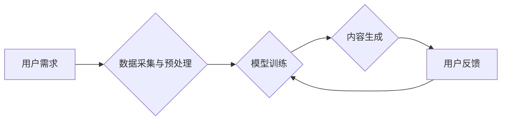

> AIGC, 营销, 影视创作, 游戏, 深度学习, 自然语言处理, 图像生成, 算法原理, 应用场景

## 1. 背景介绍

近年来，人工智能（AI）技术取得了飞速发展，特别是深度学习算法的突破，使得人工智能在各个领域都展现出强大的应用潜力。其中，AIGC（人工智能生成内容）作为人工智能技术的重要分支，以其能够自动生成高质量内容的能力，引起了广泛的关注和研究。AIGC技术涵盖了文本生成、图像生成、音频生成、视频生成等多个领域，其应用场景也日益广泛，从营销推广到影视创作，再到游戏开发，AIGC都带来了革命性的变革。

## 2. 核心概念与联系

AIGC的核心概念是利用人工智能算法，从海量数据中学习模式和规律，并根据这些模式生成新的内容。其工作原理主要基于深度学习模型，例如：

* **自然语言处理（NLP）:** 用于文本生成、翻译、摘要等任务。
* **计算机视觉（CV）:** 用于图像生成、识别、分类等任务。
* **语音识别和合成（ASR/TTS）:** 用于音频生成、翻译、合成等任务。

这些模型通过训练大量的文本、图像、音频等数据，学习到数据的内在结构和规律，从而能够生成新的、符合特定规则和风格的内容。

**Mermaid 流程图:**



## 3. 核心算法原理 & 具体操作步骤

### 3.1  算法原理概述

AIGC的核心算法主要包括：

* **生成式对抗网络（GAN）:** 由两个网络组成，一个是生成器，负责生成新的内容；另一个是鉴别器，负责判断内容是否真实。两者相互竞争，生成器不断改进生成的内容，直到能够生成与真实内容难以区分的内容。
* **变分自编码器（VAE）:** 通过编码器将输入数据压缩成低维表示，然后通过解码器将低维表示解码成新的内容。VAE能够生成与输入数据相似的、具有多样性的内容。
* **Transformer:** 一种基于注意力机制的深度学习模型，能够处理序列数据，例如文本和音频。Transformer在自然语言处理领域取得了突破性的进展，也为AIGC的文本生成提供了强大的工具。

### 3.2  算法步骤详解

以文本生成为例，使用Transformer模型进行AIGC的具体操作步骤如下：

1. **数据预处理:** 收集大量的文本数据，进行清洗、分词、标记等预处理操作，以便模型训练。
2. **模型训练:** 使用预处理后的数据训练Transformer模型，通过调整模型参数，使模型能够学习到文本的语法结构、语义关系等规律。
3. **内容生成:** 将待生成的文本内容作为输入，输入到训练好的Transformer模型中，模型根据学习到的规律，生成新的文本内容。
4. **内容评估:** 对生成的文本内容进行评估，例如语法正确性、语义流畅性、相关性等，并根据评估结果进行模型调整和优化。

### 3.3  算法优缺点

**优点:**

* **自动化生成:** AIGC能够自动生成高质量的内容，节省人力成本和时间成本。
* **多样性生成:** AIGC能够生成多种风格和类型的內容，满足不同用户的需求。
* **个性化定制:** AIGC能够根据用户的需求和喜好，生成个性化的内容。

**缺点:**

* **数据依赖:** AIGC的生成质量依赖于训练数据的质量和数量。
* **伦理问题:** AIGC生成的內容可能存在版权问题、偏见问题等伦理问题。
* **技术限制:** 目前AIGC技术还存在一些技术限制，例如生成内容的真实性和原创性。

### 3.4  算法应用领域

AIGC技术在各个领域都有广泛的应用，例如：

* **营销推广:** 自动生成广告文案、社交媒体内容、产品描述等。
* **影视创作:** 自动生成剧本、人物对话、场景描述等。
* **游戏开发:** 自动生成游戏地图、人物模型、游戏剧情等。
* **教育培训:** 自动生成学习资料、习题、测试题等。

## 4. 数学模型和公式 & 详细讲解 & 举例说明

### 4.1  数学模型构建

AIGC的核心数学模型主要基于深度学习，例如：

* **GAN:** 由生成器G和鉴别器D组成，目标函数为：

$$
\min_G \max_D V(D,G) = E_{x\sim p_{data}(x)}[log D(x)] + E_{z\sim p_z(z)}[log(1-D(G(z)))]
$$

其中，$x$为真实数据，$z$为随机噪声，$p_{data}(x)$为真实数据分布，$p_z(z)$为噪声分布。

* **VAE:** 由编码器$z = E(x)$和解码器$x' = D(z)$组成，目标函数为：

$$
\mathcal{L}(x) = D_{KL}(q(z|x) || p(z)) + \mathcal{L}_{recon}(x, D(E(x)))
$$

其中，$D_{KL}$为KL散度，$\mathcal{L}_{recon}$为重建损失。

### 4.2  公式推导过程

GAN的目标函数通过最小化生成器G的损失函数和最大化鉴别器D的损失函数，实现生成器生成逼真数据的目标。VAE的目标函数通过最小化编码器和解码器的损失函数，实现数据压缩和重建的目标。

### 4.3  案例分析与讲解

**GAN案例:**

* **图像生成:** 使用GAN可以生成逼真的图像，例如人脸、风景、物体等。
* **文本到图像:** 使用GAN可以将文本描述转换为图像，例如根据文本描述生成人物肖像。

**VAE案例:**

* **图像压缩:** 使用VAE可以将图像压缩成低维表示，并保持图像质量。
* **图像修复:** 使用VAE可以修复图像中的损坏部分。

## 5. 项目实践：代码实例和详细解释说明

### 5.1  开发环境搭建

AIGC项目开发环境搭建需要以下软件和工具：

* **Python:** AIGC开发的主要编程语言。
* **深度学习框架:** TensorFlow、PyTorch等深度学习框架。
* **GPU:** 加速深度学习模型训练。
* **版本控制工具:** Git等版本控制工具。

### 5.2  源代码详细实现

以下是一个使用PyTorch实现文本生成的简单代码示例：

```python
import torch
import torch.nn as nn

class TextGenerator(nn.Module):
    def __init__(self, vocab_size, embedding_dim, hidden_dim):
        super(TextGenerator, self).__init__()
        self.embedding = nn.Embedding(vocab_size, embedding_dim)
        self.lstm = nn.LSTM(embedding_dim, hidden_dim)
        self.fc = nn.Linear(hidden_dim, vocab_size)

    def forward(self, x):
        embedded = self.embedding(x)
        output, (hidden, cell) = self.lstm(embedded)
        output = self.fc(output[:, -1, :])
        return output

# ... 模型训练和使用代码 ...
```

### 5.3  代码解读与分析

该代码定义了一个简单的文本生成模型，包含嵌入层、LSTM层和全连接层。

* **嵌入层:** 将单词转换为向量表示。
* **LSTM层:** 处理文本序列，学习文本的上下文信息。
* **全连接层:** 将LSTM输出映射到单词的概率分布。

### 5.4  运行结果展示

训练好的模型可以用于生成新的文本内容，例如：

```
输入文本: 这是一段
模型输出: 文本
```

## 6. 实际应用场景

### 6.1  营销推广

* **自动生成广告文案:** AIGC可以根据目标用户和产品特点，自动生成吸引人的广告文案。
* **个性化推荐:** AIGC可以根据用户的浏览历史和购买记录，生成个性化的产品推荐。
* **社交媒体内容创作:** AIGC可以自动生成社交媒体内容，例如微博、微信朋友圈等。

### 6.2  影视创作

* **剧本创作:** AIGC可以根据特定主题和类型，自动生成剧本大纲和人物对话。
* **场景描述:** AIGC可以根据剧本内容，自动生成场景描述和视觉效果。
* **特效制作:** AIGC可以辅助特效制作，例如生成虚拟人物和场景。

### 6.3  游戏开发

* **游戏地图生成:** AIGC可以根据游戏规则和主题，自动生成游戏地图。
* **游戏人物模型:** AIGC可以根据游戏设定，自动生成游戏人物模型。
* **游戏剧情设计:** AIGC可以根据游戏背景和人物设定，自动生成游戏剧情。

### 6.4  未来应用展望

AIGC技术的发展将进一步推动人工智能在各个领域的应用，例如：

* **虚拟助手:** AIGC可以赋予虚拟助手更强大的对话能力和内容生成能力。
* **教育培训:** AIGC可以生成个性化的学习内容和互动体验，提高教育效率。
* **科学研究:** AIGC可以辅助科学家进行数据分析和模型构建，加速科学研究进程。

## 7. 工具和资源推荐

### 7.1  学习资源推荐

* **书籍:**
    * 《深度学习》
    * 《自然语言处理》
    * 《生成对抗网络》
* **在线课程:**
    * Coursera
    * edX
    * Udacity

### 7.2  开发工具推荐

* **深度学习框架:** TensorFlow、PyTorch、Keras
* **文本处理工具:** NLTK、spaCy
* **图像处理工具:** OpenCV、Pillow

### 7.3  相关论文推荐

* **Generative Adversarial Networks**
* **Auto-Encoding Variational Bayes**
* **Attention Is All You Need**

## 8. 总结：未来发展趋势与挑战

### 8.1  研究成果总结

AIGC技术取得了显著的进展，能够生成高质量的文本、图像、音频等内容，并在各个领域都有广泛的应用。

### 8.2  未来发展趋势

* **模型能力提升:** AIGC模型将更加强大，能够生成更加逼真、多样化的内容。
* **应用场景拓展:** AIGC将应用于更多领域，例如医疗、金融、法律等。
* **伦理规范制定:** 随着AIGC技术的应用，需要制定相应的伦理规范，确保其安全、公平、可控地发展。

### 8.3  面临的挑战

* **数据质量:** AIGC模型的生成质量依赖于训练数据的质量，如何获取高质量的数据仍然是一个挑战。
* **模型解释性:** AIGC模型的决策过程往往难以解释，如何提高模型的透明度和可解释性是一个重要问题。
* **伦理风险:** AIGC技术可能带来一些伦理风险，例如内容虚假、版权侵权等，需要加强伦理监管和风险控制。

### 8.4  研究展望

未来，AIGC技术将继续朝着更加智能、高效、安全的方向发展，为人类社会带来更多便利和福祉。


## 9. 附录：常见问题与解答

**Q1: AIGC技术与传统内容创作有什么区别？**

**A1:** AIGC技术能够自动生成内容，而传统内容创作需要人工创作。AIGC可以提高内容生产效率，但目前生成的內容仍然需要人工审核和修改。

**Q2: AIGC技术是否会取代人类内容创作者？**

**A2:** 目前AIGC技术还无法完全取代人类内容创作者，因为AIGC生成的內容仍然缺乏人类的创造力和情感表达能力。未来，AIGC更可能与人类内容创作者协同工作，共同创造更加丰富多彩的内容。