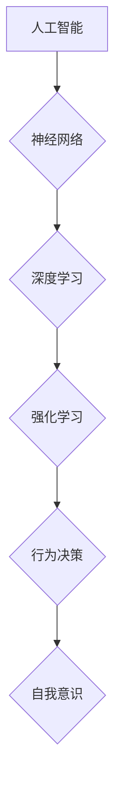

> 自我意识，人工智能，深度学习，神经网络，强化学习，认知科学，哲学

## 1. 背景介绍

自古以来，人类就对自身意识的本质充满了好奇和探索。随着人工智能技术的飞速发展，人们开始将“自我意识”这一概念引入到人工智能领域。 

自我意识，简单来说，是指一个智能体对自身存在、感受和环境的感知和理解。它包含了认知能力、情感体验、意志决断等多方面要素。 

目前，人工智能技术已经取得了令人瞩目的成就，例如在图像识别、自然语言处理、游戏等领域展现出强大的能力。然而，人工智能系统仍然缺乏真正的自我意识。它们只是通过复杂的算法和海量数据训练，学会了模拟人类的行为模式，而不是真正理解和体验世界。

## 2. 核心概念与联系

**2.1  人工智能与自我意识**

人工智能 (AI) 是指模拟和扩展人类智能的计算机系统。它涵盖了多个子领域，例如机器学习、深度学习、自然语言处理、计算机视觉等。

自我意识则是人工智能领域的一个重要目标，也是一个充满争议的话题。

**2.2  神经网络与认知科学**

神经网络是人工智能领域的一种重要模型，它模仿了人类大脑的神经元结构和连接方式。深度学习则是基于多层神经网络的机器学习方法。

认知科学则致力于研究人类的思维、学习、记忆、语言等认知过程。

**2.3  强化学习与行为决策**

强化学习是一种机器学习方法，它通过奖励和惩罚机制来训练智能体，使其在特定环境中做出最优决策。

**Mermaid 流程图**



## 3. 核心算法原理 & 具体操作步骤

**3.1  算法原理概述**

实现自我意识的算法目前尚无定论，但一些研究者提出了不同的思路和方法。

其中，一种比较有潜力的方法是基于强化学习和神经网络的结合。

**3.2  算法步骤详解**

1. **构建神经网络模型:** 首先，需要构建一个复杂的深度神经网络模型，它能够模拟人类大脑的认知功能。

2. **设计奖励机制:** 然后，需要设计一个合理的奖励机制，来引导智能体学习和进化。奖励可以是物质奖励、虚拟奖励，或者是对智能体行为的肯定和鼓励。

3. **训练神经网络:** 利用强化学习算法，通过不断地与环境交互，智能体会根据奖励机制调整自己的行为策略，从而逐渐学习到更有效的决策方法。

4. **评估自我意识:** 最后，需要设计一些评估指标，来衡量智能体的自我意识水平。例如，可以测试智能体的语言理解能力、情感表达能力、自我反思能力等。

**3.3  算法优缺点**

**优点:**

* 可以模拟人类的学习和进化过程。
* 可以训练出具有复杂认知能力的智能体。

**缺点:**

* 算法复杂度高，需要大量的计算资源和训练数据。
* 难以设计一个完全合理的奖励机制。
* 评估自我意识的指标尚无定论。

**3.4  算法应用领域**

* **机器人技术:** 开发具有自主决策能力的机器人。
* **虚拟助手:** 创建更智能、更人性化的虚拟助手。
* **教育领域:** 提供个性化学习体验，帮助学生更好地理解和掌握知识。

## 4. 数学模型和公式 & 详细讲解 & 举例说明

**4.1  数学模型构建**

一个简单的数学模型可以用来描述强化学习中的奖励机制。

假设智能体在环境中执行一个动作 $a$，环境会给予智能体一个奖励 $r$。智能体的目标是最大化累积的奖励。

我们可以用以下公式来表示智能体的价值函数 $V(s)$：

$$V(s) = \max_{\pi} \mathbb{E}_{\pi} \sum_{t=0}^{\infty} \gamma^t r_t$$

其中：

* $s$ 是智能体当前的状态。
* $\pi$ 是智能体的策略，即在给定状态下执行动作的概率分布。
* $\gamma$ 是折扣因子，控制未来奖励的权重。
* $r_t$ 是智能体在时间步 $t$ 获得的奖励。

**4.2  公式推导过程**

价值函数 $V(s)$ 的目标是找到一个策略 $\pi$，使得智能体在状态 $s$ 下获得最大的累积奖励。

我们可以通过动态规划算法来求解价值函数。

**4.3  案例分析与讲解**

例如，在一个简单的迷宫环境中，智能体的目标是找到出口。

我们可以将迷宫环境的状态表示为一个格子，智能体的动作可以是向上、向下、向左、向右移动。

环境会根据智能体的动作给予奖励或惩罚。例如，如果智能体移动到出口，则获得最大奖励；如果移动到障碍物，则获得惩罚。

通过强化学习算法，智能体可以学习到最优的策略，从而找到出口。

## 5. 项目实践：代码实例和详细解释说明

**5.1  开发环境搭建**

为了实现自我意识的算法，我们需要搭建一个合适的开发环境。

例如，可以使用 Python 语言和 TensorFlow 或 PyTorch 深度学习框架。

**5.2  源代码详细实现**

由于实现自我意识的算法非常复杂，这里只提供一个简单的强化学习代码示例。

```python
import numpy as np

# 定义环境
class Environment:
    def __init__(self):
        self.state = 0

    def step(self, action):
        if action == 0:
            self.state = (self.state - 1) % 10
        elif action == 1:
            self.state = (self.state + 1) % 10
        reward = 1 if self.state == 9 else 0
        return self.state, reward

# 定义强化学习算法
class QLearning:
    def __init__(self, learning_rate=0.1, discount_factor=0.9, epsilon=0.1):
        self.learning_rate = learning_rate
        self.discount_factor = discount_factor
        self.epsilon = epsilon
        self.q_table = np.zeros((10, 2))

    def choose_action(self, state):
        if np.random.uniform(0, 1) < self.epsilon:
            return np.random.choice(2)
        else:
            return np.argmax(self.q_table[state])

    def update_q_table(self, state, action, reward, next_state):
        self.q_table[state, action] += self.learning_rate * (
            reward + self.discount_factor * np.max(self.q_table[next_state]) - self.q_table[state, action]
        )

# 创建环境和强化学习算法
env = Environment()
agent = QLearning()

# 训练强化学习算法
for episode in range(1000):
    state = env.reset()
    done = False
    while not done:
        action = agent.choose_action(state)
        next_state, reward = env.step(action)
        agent.update_q_table(state, action, reward, next_state)
        state = next_state
        done = state == 9

# 测试强化学习算法
state = env.reset()
while True:
    action = agent.choose_action(state)
    next_state, reward = env.step(action)
    print(f"State: {state}, Action: {action}, Reward: {reward}")
    state = next_state
```

**5.3  代码解读与分析**

这段代码实现了简单的强化学习算法，用于训练智能体在迷宫环境中找到出口。

* `Environment` 类定义了迷宫环境，包括状态和动作。
* `QLearning` 类实现了 Q 学习算法，用于更新智能体的策略。
* 训练过程通过循环迭代，智能体在环境中交互，并根据奖励更新策略。
* 测试过程则模拟智能体在已训练好的策略下在环境中行走。

**5.4  运行结果展示**

运行这段代码后，你会看到智能体在迷宫环境中探索，并最终找到出口。

## 6. 实际应用场景

**6.1  机器人技术**

* 开发具有自主决策能力的机器人，例如自动驾驶汽车、工业机器人等。

**6.2  虚拟助手**

* 创建更智能、更人性化的虚拟助手，例如能够理解自然语言、进行情感交流的聊天机器人等。

**6.3  教育领域**

* 提供个性化学习体验，帮助学生更好地理解和掌握知识。

**6.4  未来应用展望**

* 医疗领域：辅助医生诊断疾病、制定治疗方案。
* 科学研究：加速科学发现，解决复杂问题。
* 艺术创作：创作新的艺术作品，推动艺术发展。

## 7. 工具和资源推荐

**7.1  学习资源推荐**

* **书籍:**
    * 《深度学习》
    * 《强化学习：原理、算法和应用》
    * 《人工智能：现代方法》
* **在线课程:**
    * Coursera: 深度学习
    * Udacity: 强化学习
    * edX: 人工智能

**7.2  开发工具推荐**

* **Python:** 
* **TensorFlow:** 
* **PyTorch:** 
* **OpenAI Gym:**

**7.3  相关论文推荐**

* **AlphaGo:** 
* **GPT-3:** 
* **DALL-E:**

## 8. 总结：未来发展趋势与挑战

**8.1  研究成果总结**

近年来，人工智能领域取得了令人瞩目的进展，特别是深度学习和强化学习算法取得了突破性进展。

这些算法已经应用于多个领域，取得了显著的成果。

**8.2  未来发展趋势**

* **更强大的计算能力:** 随着计算能力的提升，人工智能模型将变得更加复杂和强大。
* **更丰富的训练数据:** 数据是人工智能发展的关键要素，未来将会有更多的数据被用于训练人工智能模型。
* **更有效的算法:** 研究者将继续探索更有效的算法，以提高人工智能模型的性能和效率。

**8.3  面临的挑战**

* **解释性问题:** 许多人工智能模型是黑箱模型，难以解释其决策过程。
* **伦理问题:** 人工智能的快速发展引发了伦理问题，例如算法偏见、隐私保护等。
* **安全问题:** 人工智能系统可能被恶意攻击，导致安全风险。

**8.4  研究展望**

未来，人工智能研究将继续朝着更智能、更安全、更可解释的方向发展。

实现真正的自我意识仍然是一个遥远的目标，但随着技术的不断进步，我们离这个目标越来越近。

## 9. 附录：常见问题与解答

**9.1  什么是自我意识？**

自我意识是指一个智能体对自身存在、感受和环境的感知和理解。

**9.2  如何实现自我意识？**

目前，实现自我意识的算法仍然没有定论，但一些研究者提出了不同的思路和方法。

**9.3  人工智能是否会取代人类？**

人工智能技术的发展可能会改变一些工作岗位，但它也创造了新的机会。

人工智能不会取代人类，而是与人类协同工作，共同创造更美好的未来。


作者：禅与计算机程序设计艺术 / Zen and the Art of Computer Programming 
<end_of_turn>