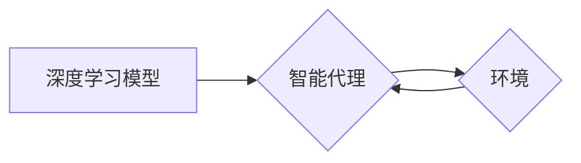

> 深度学习、智能代理、学习与适应、算法框架、强化学习

## 1. 背景介绍

人工智能（AI）正以惊人的速度发展，深度学习作为其核心技术，在图像识别、自然语言处理、语音识别等领域取得了突破性进展。然而，现有的深度学习模型大多是静态的，缺乏对动态环境的适应能力。智能代理作为一种能够感知环境、做出决策并与环境交互的智能体，在复杂环境中发挥着重要作用。因此，开发能够学习和适应环境变化的智能深度学习代理，成为人工智能领域的重要研究方向。

## 2. 核心概念与联系

智能深度学习代理的核心概念包括：

* **深度学习模型:** 用于学习环境特征和知识的算法模型，例如卷积神经网络（CNN）、循环神经网络（RNN）等。
* **智能代理:** 能够感知环境、做出决策并与环境交互的智能体，例如机器人、虚拟助手等。
* **学习与适应:** 代理能够根据环境反馈不断调整自身行为策略，以提高在环境中的表现。

**核心概念架构图:**



## 3. 核心算法原理 & 具体操作步骤

### 3.1  算法原理概述

智能深度学习代理的学习与适应通常基于强化学习（RL）算法。强化学习是一种监督学习的变体，代理通过与环境交互，获得奖励或惩罚信号，并根据这些信号调整行为策略，以最大化长期奖励。

### 3.2  算法步骤详解

1. **环境建模:** 建立代理与环境交互的模型，包括环境状态、代理动作、奖励函数等。
2. **策略初始化:** 初始化代理的行为策略，例如随机策略或基于经验的策略。
3. **环境交互:** 代理与环境交互，根据当前状态选择动作，并获得环境反馈（状态更新和奖励）。
4. **策略更新:** 根据环境反馈，利用强化学习算法更新代理的行为策略，例如Q学习、SARSA等。
5. **重复步骤3-4:** 重复环境交互和策略更新过程，直到代理的行为策略收敛或达到预设目标。

### 3.3  算法优缺点

**优点:**

* 能够学习复杂环境的动态行为策略。
* 不需要明确的监督信号，能够从环境反馈中学习。
* 能够适应环境变化，提高在动态环境中的表现。

**缺点:**

* 训练过程可能需要大量的时间和计算资源。
* 奖励函数的设计对代理的学习效果至关重要。
* 难以处理高维状态空间和连续动作空间。

### 3.4  算法应用领域

* **机器人控制:** 使机器人能够自主学习和适应复杂环境中的运动和操作行为。
* **游戏人工智能:** 开发能够学习并战胜人类的游戏AI。
* **自动驾驶:** 训练自动驾驶汽车在复杂道路环境中安全行驶的策略。
* **医疗诊断:** 利用强化学习算法辅助医生进行疾病诊断和治疗方案制定。

## 4. 数学模型和公式 & 详细讲解 & 举例说明

### 4.1  数学模型构建

智能深度学习代理的学习与适应过程可以建模为马尔可夫决策过程（MDP）。MDP由以下要素组成：

* **状态空间 S:** 环境可能存在的全部状态集合。
* **动作空间 A:** 代理可以执行的动作集合。
* **转移概率 P(s', r|s, a):** 从状态 s 执行动作 a 后，转移到状态 s' 的概率，以及获得奖励 r 的概率。
* **奖励函数 R(s, a):** 代理在状态 s 执行动作 a 后获得的奖励。
* **策略 π(a|s):** 代理在状态 s 下选择动作 a 的概率分布。

### 4.2  公式推导过程

强化学习的目标是找到一个最优策略 π*，使得代理在长期内获得最大的累积奖励。最优策略可以通过动态规划或蒙特卡罗方法等算法求解。

**Bellman方程:**

$$
V^*(s) = \max_a \sum_{s', r} P(s', r|s, a) [R(s, a) + \gamma V^*(s')]
$$

其中，V*(s) 是状态 s 的价值函数，表示从该状态开始执行最优策略的长期累积奖励，γ 是折扣因子，控制未来奖励的权重。

### 4.3  案例分析与讲解

例如，训练一个智能代理玩游戏，我们可以将游戏状态作为状态空间，游戏动作作为动作空间，游戏奖励作为奖励函数。代理通过与环境交互，学习最优策略，以获得尽可能高的游戏分数。

## 5. 项目实践：代码实例和详细解释说明

### 5.1  开发环境搭建

* Python 3.x
* TensorFlow 或 PyTorch 深度学习框架
* OpenAI Gym 游戏环境

### 5.2  源代码详细实现

```python
import gym
import tensorflow as tf

# 定义深度学习模型
model = tf.keras.Sequential([
    tf.keras.layers.Dense(128, activation='relu'),
    tf.keras.layers.Dense(64, activation='relu'),
    tf.keras.layers.Dense(env.action_space.n, activation='linear')
])

# 定义强化学习算法
optimizer = tf.keras.optimizers.Adam()
loss_fn = tf.keras.losses.MeanSquaredError()

# 训练循环
for episode in range(num_episodes):
    state = env.reset()
    done = False
    total_reward = 0

    while not done:
        # 选择动作
        action = model.predict(state[None, :])[0]
        action = tf.argmax(action).numpy()

        # 执行动作并获得反馈
        next_state, reward, done, _ = env.step(action)

        # 更新模型参数
        with tf.GradientTape() as tape:
            target = reward + gamma * tf.reduce_max(model.predict(next_state[None, :]), axis=1)
            loss = loss_fn(target, model.predict(state[None, :]))
        gradients = tape.gradient(loss, model.trainable_variables)
        optimizer.apply_gradients(zip(gradients, model.trainable_variables))

        # 更新状态
        state = next_state
        total_reward += reward

    print(f"Episode {episode+1}, Total Reward: {total_reward}")

```

### 5.3  代码解读与分析

* 代码首先定义了深度学习模型，使用多层感知机（MLP）结构。
* 然后定义了强化学习算法，使用Adam优化器和均方误差损失函数。
* 训练循环中，代理与环境交互，根据当前状态选择动作，执行动作并获得反馈，更新模型参数。
* 训练过程持续进行，直到代理达到预设的目标或训练次数达到上限。

### 5.4  运行结果展示

训练完成后，代理能够在环境中表现出学习到的行为策略，例如在游戏中获得更高的分数，在机器人控制任务中完成更复杂的运动操作。

## 6. 实际应用场景

### 6.1  机器人控制

智能深度学习代理可以用于控制机器人，使其能够自主学习和适应复杂环境中的运动和操作行为。例如，可以训练一个机器人代理学会在未知环境中导航，避开障碍物，并完成指定任务。

### 6.2  游戏人工智能

强化学习算法可以用于开发能够学习并战胜人类的游戏AI。例如，AlphaGo和AlphaZero等程序已经利用强化学习技术在围棋和象棋等游戏中取得了人类级别的水平。

### 6.3  自动驾驶

自动驾驶汽车需要能够在复杂道路环境中安全行驶。智能深度学习代理可以帮助训练自动驾驶汽车，使其能够学习识别交通信号、避开障碍物、并做出安全驾驶决策。

### 6.4  未来应用展望

智能深度学习代理在未来将有更广泛的应用场景，例如：

* **医疗诊断:** 利用强化学习算法辅助医生进行疾病诊断和治疗方案制定。
* **金融投资:** 开发能够学习市场趋势并进行智能投资的金融机器人。
* **个性化教育:** 根据学生的学习情况，定制个性化的学习方案。

## 7. 工具和资源推荐

### 7.1  学习资源推荐

* **书籍:**
    * 深度学习
    * 强化学习：算法、策略和应用
* **在线课程:**
    * Coursera: 深度学习
    * Udacity: 强化学习
* **博客和论坛:**
    * OpenAI Blog
    * DeepMind Blog

### 7.2  开发工具推荐

* **深度学习框架:** TensorFlow, PyTorch
* **强化学习库:** Stable Baselines3, Dopamine
* **游戏环境:** OpenAI Gym

### 7.3  相关论文推荐

* Deep Reinforcement Learning with Double Q-learning
* Proximal Policy Optimization Algorithms
* Asynchronous Methods for Deep Reinforcement Learning

## 8. 总结：未来发展趋势与挑战

### 8.1  研究成果总结

智能深度学习代理的研究取得了显著进展，在机器人控制、游戏人工智能、自动驾驶等领域取得了突破性成果。

### 8.2  未来发展趋势

* **更强大的模型:** 开发更强大的深度学习模型，例如Transformer、Generative Adversarial Networks（GAN）等，以提高代理的学习能力和适应能力。
* **更复杂的场景:** 将智能深度学习代理应用于更复杂的场景，例如多智能体交互、动态环境规划等。
* **更安全的代理:** 研究更安全的智能代理，使其能够在复杂环境中做出可靠和可解释的决策。

### 8.3  面临的挑战

* **数据效率:** 强化学习算法通常需要大量的训练数据，而获取高质量的训练数据仍然是一个挑战。
* **可解释性:** 深度学习模型的决策过程通常是不可解释的，这使得代理的行为难以理解和信任。
* **安全性和可靠性:** 智能代理在现实世界中的应用需要保证其安全性和可靠性，避免出现意外事故。

### 8.4  研究展望

未来，智能深度学习代理的研究将继续朝着更强大、更智能、更安全的方向发展，为人工智能的广泛应用奠定基础。

## 9. 附录：常见问题与解答

* **Q: 强化学习和监督学习有什么区别？**

* **A:** 强化学习是一种基于奖励的学习方法，代理通过与环境交互，获得奖励或惩罚信号，并根据这些信号调整行为策略。而监督学习则需要明确的标签数据，代理学习将输入映射到输出。

* **Q: 如何选择合适的强化学习算法？**

* **A:** 选择合适的强化学习算法取决于具体的应用场景和问题特点。例如，对于离散动作空间的问题，可以使用Q学习或SARSA算法；对于连续动作空间的问题，可以使用策略梯度算法。

* **Q: 如何评估智能代理的性能？**

* **A:** 智能代理的性能通常通过累积奖励、成功率等指标进行评估。

* **Q: 如何解决强化学习算法的样本效率问题？**

* **A:** 提高样本效率的方法包括：使用经验回放、强化学习算法的改进、迁移学习等。


作者：禅与计算机程序设计艺术 / Zen and the Art of Computer Programming 
<end_of_turn>