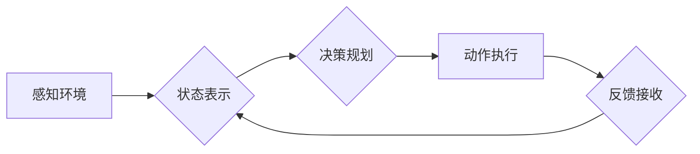

> 深度学习、代理决策、强化学习、神经网络、决策流程优化

## 1. 背景介绍

在当今数据爆炸的时代，人工智能（AI）正以惊人的速度发展，深度学习作为AI的核心技术之一，在图像识别、自然语言处理、语音识别等领域取得了突破性的进展。然而，深度学习在决策领域的应用还处于探索阶段。深度学习代理，即利用深度学习算法训练的智能代理，能够在复杂环境中自主决策，并根据反馈信息不断优化决策策略。

深度学习代理决策流程的优化对于提升AI系统的智能化水平至关重要。传统的决策流程往往依赖于人工设计的规则和模型，难以适应复杂、动态变化的环境。而深度学习代理能够通过学习大量数据，自动发现决策规律，并根据环境变化动态调整决策策略，从而实现更智能、更灵活的决策。

## 2. 核心概念与联系

**2.1 深度学习代理**

深度学习代理是指利用深度学习算法训练的智能代理，能够通过感知环境信息，学习决策策略，并自主做出决策。深度学习代理的核心在于其学习能力，能够从大量数据中学习决策规律，并根据环境变化不断优化决策策略。

**2.2 代理决策流程**

代理决策流程是指智能代理从感知环境信息到做出决策的整个过程。该流程通常包括以下几个步骤：

1. **感知环境:** 代理通过传感器获取环境信息，例如图像、文本、音频等。
2. **状态表示:** 代理将感知到的环境信息转换为可理解的内部状态表示。
3. **决策规划:** 代理根据当前状态和目标，规划出最优决策策略。
4. **动作执行:** 代理执行决策策略，对环境进行操作。
5. **反馈接收:** 代理接收环境反馈信息，并更新状态表示。

**2.3 强化学习**

强化学习是一种机器学习方法，通过奖励机制训练智能代理，使其在环境中学习最优决策策略。强化学习的核心概念包括：

* **状态:** 环境的当前状态。
* **动作:** 代理可以执行的动作。
* **奖励:** 代理根据动作的结果获得的奖励或惩罚。
* **策略:** 代理选择动作的策略。

强化学习的目标是训练出一个能够最大化累积奖励的策略。

**2.4 深度学习与代理决策流程的联系**

深度学习技术可以有效地提升代理决策流程的智能化水平。

* **感知环境:** 深度学习模型，例如卷积神经网络（CNN）和循环神经网络（RNN），能够有效地处理图像、文本、音频等复杂环境信息。
* **状态表示:** 深度学习模型可以学习到环境状态的抽象表示，从而提高决策效率。
* **决策规划:** 深度强化学习算法，例如深度Q网络（DQN）和策略梯度算法，能够训练出能够在复杂环境中学习最优决策策略的代理。

**2.5 Mermaid 流程图**



## 3. 核心算法原理 & 具体操作步骤

### 3.1 算法原理概述

深度强化学习算法的核心是利用深度神经网络学习代理的策略，使其能够在环境中获得最大化的累积奖励。

深度强化学习算法通常包括以下几个关键组件：

* **神经网络:** 用于表示代理的策略和价值函数。
* **强化学习算法:** 用于训练神经网络，例如DQN、策略梯度算法等。
* **环境:** 代理与之交互的虚拟或真实世界。

### 3.2 算法步骤详解

1. **初始化:** 初始化神经网络参数，并设置环境参数，例如奖励函数、终止条件等。
2. **环境交互:** 代理与环境交互，感知环境信息，并根据策略选择动作。
3. **奖励反馈:** 环境根据代理的动作提供奖励或惩罚。
4. **状态更新:** 代理根据环境反馈信息更新状态表示。
5. **策略更新:** 利用强化学习算法更新神经网络参数，使其能够学习到更优的策略。
6. **重复步骤2-5:** 重复以上步骤，直到代理的策略收敛或达到预设的目标。

### 3.3 算法优缺点

**优点:**

* **学习能力强:** 深度强化学习算法能够学习到复杂环境中的决策规律。
* **适应性强:** 深度强化学习算法能够根据环境变化动态调整决策策略。
* **通用性强:** 深度强化学习算法可以应用于各种不同的决策场景。

**缺点:**

* **训练时间长:** 深度强化学习算法的训练过程通常需要大量的时间和计算资源。
* **数据需求大:** 深度强化学习算法需要大量的训练数据。
* **黑盒问题:** 深度神经网络的决策过程难以解释，存在黑盒问题。

### 3.4 算法应用领域

深度强化学习算法在以下领域具有广泛的应用前景:

* **机器人控制:** 训练机器人自主完成复杂任务，例如导航、抓取、组装等。
* **游戏AI:** 训练游戏AI，使其能够在游戏中取得更高的分数和更强的竞争力。
* **金融投资:** 训练金融投资代理，使其能够在市场中做出更优的投资决策。
* **医疗诊断:** 训练医疗诊断代理，使其能够辅助医生进行疾病诊断。

## 4. 数学模型和公式 & 详细讲解 & 举例说明

### 4.1 数学模型构建

深度强化学习算法的核心是构建一个数学模型来描述代理与环境的交互过程。该模型通常包括以下几个关键要素:

* **状态空间:** 环境可能存在的全部状态集合。
* **动作空间:** 代理可以执行的动作集合。
* **奖励函数:** 描述代理在不同状态下执行不同动作获得的奖励或惩罚。
* **价值函数:** 描述代理在特定状态下采取特定策略的长期奖励期望。

### 4.2 公式推导过程

**价值函数:**

$$
V^{\pi}(s) = E_{\pi}[R_{t+1} + \gamma R_{t+2} + \gamma^2 R_{t+3} + ... | S_t = s]
$$

其中:

* $V^{\pi}(s)$ 是代理在状态 $s$ 下采取策略 $\pi$ 的价值函数。
* $R_t$ 是代理在时间步 $t$ 获得的奖励。
* $\gamma$ 是折扣因子，控制未来奖励的权重。

**策略梯度算法:**

$$
\theta_{t+1} = \theta_t + \alpha \nabla_{\theta} J(\theta)
$$

其中:

* $\theta$ 是神经网络的参数。
* $\alpha$ 是学习率。
* $J(\theta)$ 是策略的效用函数。

### 4.3 案例分析与讲解

**案例:** 训练一个深度强化学习代理，使其能够玩游戏“贪吃蛇”。

* **状态空间:** 游戏画面中的蛇的位置和食物的位置。
* **动作空间:** 蛇可以向四个方向移动。
* **奖励函数:** 当蛇吃掉食物时获得奖励，当蛇撞到墙壁或自身时惩罚。
* **价值函数:** 评估蛇在当前状态下采取不同策略的长期奖励期望。

通过训练深度强化学习代理，可以使其学习到玩“贪吃蛇”的最佳策略，例如如何快速移动、如何避开障碍物、如何寻找食物等。

## 5. 项目实践：代码实例和详细解释说明

### 5.1 开发环境搭建

* **操作系统:** Ubuntu 18.04
* **编程语言:** Python 3.6
* **深度学习框架:** TensorFlow 2.0
* **其他依赖:** NumPy, Matplotlib

### 5.2 源代码详细实现

```python
import tensorflow as tf
import numpy as np

# 定义神经网络模型
class DQN(tf.keras.Model):
    def __init__(self, state_size, action_size):
        super(DQN, self).__init__()
        self.dense1 = tf.keras.layers.Dense(64, activation='relu')
        self.dense2 = tf.keras.layers.Dense(32, activation='relu')
        self.output = tf.keras.layers.Dense(action_size)

    def call(self, state):
        x = self.dense1(state)
        x = self.dense2(x)
        return self.output(x)

# 定义强化学习算法
class DQN_Agent:
    def __init__(self, state_size, action_size, learning_rate=0.001, gamma=0.99):
        self.state_size = state_size
        self.action_size = action_size
        self.learning_rate = learning_rate
        self.gamma = gamma
        self.model = DQN(state_size, action_size)
        self.optimizer = tf.keras.optimizers.Adam(learning_rate=self.learning_rate)

    def choose_action(self, state):
        state = tf.expand_dims(state, axis=0)
        q_values = self.model(state)
        return tf.argmax(q_values[0]).numpy()

    def train(self, state, action, reward, next_state, done):
        with tf.GradientTape() as tape:
            target_q_values = reward + self.gamma * tf.reduce_max(self.model(next_state), axis=1) * (1 - done)
            q_values = self.model(state)
            loss = tf.keras.losses.mean_squared_error(target_q_values, q_values[0, action])
        gradients = tape.gradient(loss, self.model.trainable_variables)
        self.optimizer.apply_gradients(zip(gradients, self.model.trainable_variables))

# ... (其他代码)
```

### 5.3 代码解读与分析

* **DQN模型:** 定义了一个深度神经网络模型，用于估计代理在不同状态下采取不同动作的价值。
* **DQN_Agent类:** 定义了一个深度强化学习代理，包含了选择动作、训练模型等方法。
* **choose_action方法:** 根据当前状态选择最优动作。
* **train方法:** 利用强化学习算法更新模型参数。

### 5.4 运行结果展示

通过训练深度强化学习代理，可以观察到代理在游戏中的表现逐渐提升，例如蛇的长度逐渐增加，得分逐渐提高。

## 6. 实际应用场景

### 6.1 游戏AI

深度强化学习算法可以训练出能够玩游戏并取得高分的AI代理。例如，AlphaGo和AlphaZero分别利用深度强化学习算法战胜了围棋世界冠军和国际象棋世界冠军。

### 6.2 机器人控制

深度强化学习算法可以训练机器人自主完成复杂任务，例如导航、抓取、组装等。例如，Google DeepMind训练了一个机器人能够学会自己用工具完成各种任务。

### 6.3 金融投资

深度强化学习算法可以训练金融投资代理，使其能够在市场中做出更优的投资决策。例如，一些研究机构利用深度强化学习算法训练股票交易机器人，取得了不错的收益。

### 6.4 未来应用展望

深度强化学习算法在未来将有更广泛的应用前景，例如：

* **自动驾驶:** 训练自动驾驶汽车，使其能够在复杂道路环境中安全驾驶。
* **医疗诊断:** 训练医疗诊断代理，协助医生进行疾病诊断和治疗方案制定。
* **个性化教育:** 训练个性化教育代理，根据学生的学习情况提供定制化的学习方案。

## 7. 工具和资源推荐

### 7.1 学习资源推荐

* **书籍:**
    * Deep Reinforcement Learning Hands-On by Maxim Lapan
    * Reinforcement Learning: An Introduction by Richard S. Sutton and Andrew G. Barto
* **在线课程:**
    * Deep Reinforcement Learning Specialization by DeepLearning.AI
    * Reinforcement Learning by David Silver (University of DeepMind)

###