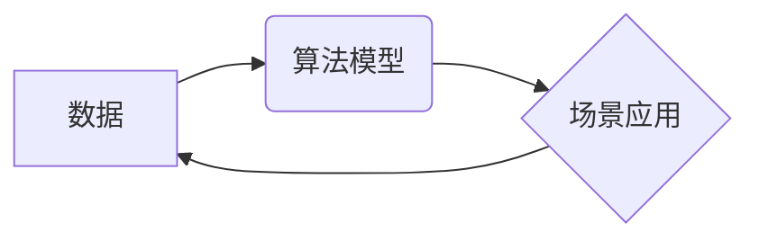

> AI出版，数据驱动，算法模型，场景应用，壁垒突破，技术创新

## 1. 背景介绍

出版业作为文化传播的重要载体，近年来面临着前所未有的挑战。传统出版模式的固有结构和运营模式难以适应数字时代的需求，电子书、音频书、在线阅读等新兴形式的兴起，不断冲击着传统出版业的市场份额。

与此同时，人工智能（AI）技术的发展为出版业带来了新的机遇。AI技术能够帮助出版商提高效率、降低成本、个性化服务读者，并探索新的出版模式。例如，AI可以用于自动生成内容、推荐书籍、分析读者喜好、优化营销策略等方面。

然而，将AI技术应用于出版业并非易事。AI出版业面临着诸多壁垒，包括数据获取、算法模型、场景应用等方面。

## 2. 核心概念与联系

**2.1 数据驱动**

AI出版的核心是数据驱动。AI算法需要大量的数据进行训练和优化，才能准确地理解和生成文本内容。出版商需要收集和整理各种类型的出版数据，例如书籍内容、读者评论、市场趋势等，并将其转化为AI算法可以理解的格式。

**2.2 算法模型**

AI算法模型是实现AI出版的关键技术。目前，常用的AI算法模型包括自然语言处理（NLP）模型、机器学习（ML）模型、深度学习（DL）模型等。这些模型可以用于自动生成文本内容、翻译文本、总结文本、分析文本情感等。

**2.3 场景应用**

AI技术在出版业的应用场景非常广泛，例如：

* **内容创作:** AI可以辅助作家创作小说、诗歌、剧本等文学作品。
* **内容编辑:** AI可以帮助编辑校对文本、检查语法错误、优化文章结构等。
* **内容推荐:** AI可以根据读者的阅读历史、兴趣爱好等信息，推荐合适的书籍。
* **营销推广:** AI可以分析市场趋势，制定精准的营销策略，并自动生成广告文案。

**2.4 协同发展**

数据、算法和场景是AI出版的三大核心要素，它们相互关联、相互促进，共同推动AI出版业的发展。



## 3. 核心算法原理 & 具体操作步骤

### 3.1 算法原理概述

本文将重点介绍自然语言生成（NLG）算法在AI出版中的应用。NLG算法能够根据给定的文本输入，生成新的、符合语法规则和语义逻辑的文本内容。

NLG算法的核心思想是学习语言的结构和规律，并利用这些知识生成新的文本。常见的NLG算法模型包括：

* **基于规则的NLG:** 这种方法依赖于预先定义的语法规则和语义模板，通过规则匹配和替换生成文本。
* **基于统计的NLG:** 这种方法利用统计模型学习语言的概率分布，根据概率最大原则生成文本。
* **基于深度学习的NLG:** 这种方法利用深度神经网络学习语言的复杂结构和语义关系，生成更流畅、更自然的文本。

### 3.2 算法步骤详解

以基于深度学习的NLG算法为例，其具体操作步骤如下：

1. **数据预处理:** 将文本数据进行清洗、分词、词性标注等预处理操作，使其符合算法的输入格式。
2. **模型训练:** 利用训练数据训练深度神经网络模型，学习语言的结构和规律。
3. **文本编码:** 将输入文本编码为数字向量，以便模型理解。
4. **文本生成:** 根据模型的训练结果，利用输入文本的编码信息，生成新的文本内容。
5. **文本解码:** 将生成的数字向量解码为文本格式。

### 3.3 算法优缺点

**优点:**

* 生成文本更加流畅、自然。
* 可以生成不同风格、不同类型的文本内容。
* 能够学习和理解复杂的语言结构和语义关系。

**缺点:**

* 训练数据量大，训练时间长。
* 模型参数复杂，需要强大的计算能力。
* 生成文本可能存在逻辑错误或不准确的地方。

### 3.4 算法应用领域

* **自动写作:** 生成新闻报道、产品描述、广告文案等。
* **内容创作辅助:** 帮助作家克服写作瓶颈，生成故事梗概、人物对话等。
* **机器翻译:** 将文本从一种语言翻译成另一种语言。
* **聊天机器人:** 与用户进行自然语言对话。

## 4. 数学模型和公式 & 详细讲解 & 举例说明

### 4.1 数学模型构建

在基于深度学习的NLG算法中，常用的数学模型是循环神经网络（RNN）。RNN是一种能够处理序列数据的网络结构，其内部包含循环单元，能够记忆之前的信息，从而更好地理解文本的上下文关系。

### 4.2 公式推导过程

RNN的输出结果可以通过以下公式计算：

$$h_t = f(W_{hh}h_{t-1} + W_{xh}x_t + b_h)$$

$$y_t = g(W_{hy}h_t + b_y)$$

其中：

* $h_t$ 是时间步t的隐藏状态。
* $x_t$ 是时间步t的输入数据。
* $W_{hh}$、$W_{xh}$、$W_{hy}$ 是权重矩阵。
* $b_h$、$b_y$ 是偏置项。
* $f$ 和 $g$ 是激活函数。

### 4.3 案例分析与讲解

假设我们想要训练一个RNN模型，用于生成简单的句子，例如“我爱学习”。我们可以将句子中的每个单词作为输入数据，并训练模型生成下一个单词。

在训练过程中，模型会不断调整权重参数，使得输出结果与真实句子更加接近。最终，模型能够根据输入的单词序列，生成符合语法规则和语义逻辑的句子。

## 5. 项目实践：代码实例和详细解释说明

### 5.1 开发环境搭建

本项目使用Python语言进行开发，需要安装以下软件包：

* TensorFlow 或 PyTorch
* NLTK
* Gensim

### 5.2 源代码详细实现

```python
import tensorflow as tf

# 定义RNN模型
model = tf.keras.Sequential([
    tf.keras.layers.Embedding(input_dim=vocab_size, output_dim=embedding_dim),
    tf.keras.layers.LSTM(units=lstm_units),
    tf.keras.layers.Dense(units=vocab_size, activation='softmax')
])

# 编译模型
model.compile(optimizer='adam', loss='sparse_categorical_crossentropy', metrics=['accuracy'])

# 训练模型
model.fit(x_train, y_train, epochs=epochs)

# 生成文本
def generate_text(seed_text, num_words):
    for _ in range(num_words):
        # 将seed_text编码为向量
        encoded_text = model.layers[0].texts_to_sequences([seed_text])
        # 使用模型预测下一个单词
        predicted_index = model.predict(encoded_text)
        # 将预测的索引转换为单词
        predicted_word = index_to_word[predicted_index[0].argmax()]
        # 将预测的单词添加到seed_text中
        seed_text += ' ' + predicted_word
    return seed_text
```

### 5.3 代码解读与分析

* **模型定义:** 代码定义了一个简单的RNN模型，包含嵌入层、LSTM层和全连接层。
* **模型编译:** 代码编译了模型，指定了优化器、损失函数和评价指标。
* **模型训练:** 代码训练了模型，使用训练数据进行迭代训练。
* **文本生成:** 代码定义了一个`generate_text`函数，用于根据给定的种子文本生成新的文本。

### 5.4 运行结果展示

运行代码后，可以生成新的文本内容。例如，如果输入种子文本为“我爱”，模型可能会生成以下文本：

“我爱学习编程”

## 6. 实际应用场景

### 6.1 内容创作辅助

AI可以帮助作家克服写作瓶颈，生成故事梗概、人物对话等，提高写作效率。例如，作家可以使用AI工具生成不同类型的场景描述、人物性格分析等，为创作提供灵感和素材。

### 6.2 内容编辑优化

AI可以帮助编辑校对文本、检查语法错误、优化文章结构等，提高编辑效率。例如，AI可以自动检测文章中的重复句子、语法错误、拼写错误等，并提供修改建议。

### 6.3 内容推荐个性化

AI可以根据读者的阅读历史、兴趣爱好等信息，推荐合适的书籍，提高用户阅读体验。例如，电商平台可以利用AI算法分析用户的购买记录和浏览历史，推荐相关的书籍。

### 6.4 未来应用展望

随着AI技术的不断发展，其在出版业的应用场景将更加广泛。例如，AI可以用于自动生成不同类型的出版物，例如电子书、音频书、漫画等，并根据读者的反馈进行个性化定制。

## 7. 工具和资源推荐

### 7.1 学习资源推荐

* **斯坦福大学CS224N课程:** https://web.stanford.edu/class/cs224n/
* **Hugging Face Transformers库:** https://huggingface.co/docs/transformers/index

### 7.2 开发工具推荐

* **TensorFlow:** https://www.tensorflow.org/
* **PyTorch:** https://pytorch.org/

### 7.3 相关论文推荐

* **Attention Is All You Need:** https://arxiv.org/abs/1706.03762
* **BERT: Pre-training of Deep Bidirectional Transformers for Language Understanding:** https://arxiv.org/abs/1810.04805

## 8. 总结：未来发展趋势与挑战

### 8.1 研究成果总结

AI技术在出版业的应用取得了显著成果，例如自动写作、内容编辑优化、内容推荐个性化等。

### 8.2 未来发展趋势

未来，AI技术在出版业的应用将更加深入和广泛，例如：

* **更智能的AI助手:** AI助手将能够更好地理解用户的需求，并提供更精准、更个性化的服务。
* **更丰富的出版形式:** AI将推动出版业向多媒体、互动式、沉浸式等新方向发展。
* **更个性化的阅读体验:** AI将根据读者的阅读习惯和喜好，提供更个性化的阅读体验。

### 8.3 面临的挑战

AI技术在出版业的应用也面临着一些挑战，例如：

* **数据安全和隐私保护:** AI算法需要大量的数据进行训练，如何保证数据的安全和隐私保护是一个重要问题。
* **算法偏见和公平性:** AI算法可能存在偏见，导致生成的内容不公平或不准确。
* **伦理问题:** AI技术在出版业的应用可能引发一些伦理问题，例如著作权问题、内容真实性问题等。

### 8.4 研究展望

未来，需要加强对AI技术在出版业应用的伦理研究，制定相应的规范和标准，确保AI技术能够安全、公平、负责任地应用于出版业。

## 9. 附录：常见问题与解答

**Q1: AI是否会取代人类作家？**

A1: AI技术可以辅助作家创作，但不会完全取代人类作家。人类作家拥有创造力和想象力，能够创作出独一无二的作品，而AI只能根据现有数据生成类似的作品。

**Q2: 如何保证AI生成的文本内容的质量？**

A2: 提高AI生成的文本内容质量需要从以下几个方面入手：

* 提高训练数据的质量和数量。
* 优化AI算法模型。
* 加强对生成文本内容的审核和评估。

**Q3: AI技术在出版业的应用会带来哪些新的机遇？**

A3: AI技术在出版业的应用将带来许多新的机遇，例如：

* 降低出版成本，提高出版效率。
* 提供更个性化的阅读体验。
* 推动