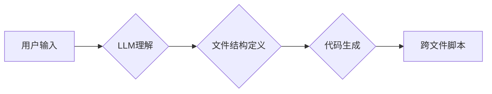

> AI大模型,Prompt提示词,代码生成,跨文件脚本,最佳实践,软件开发

## 1. 背景介绍

随着人工智能技术的飞速发展，大型语言模型（LLM）在代码生成领域展现出巨大的潜力。这些模型能够理解自然语言，并根据用户的指令生成高质量的代码。然而，传统的代码生成方法往往局限于单个文件或函数的生成，而跨文件脚本的生成则更加复杂，需要模型具备更强的理解力和推理能力。

Prompt提示词作为与LLM交互的关键环节，直接影响着代码生成的质量和效率。如何设计有效的Prompt提示词，以引导LLM生成跨文件脚本，是当前研究的热点问题。

## 2. 核心概念与联系

**2.1  LLM代码生成原理**

大型语言模型（LLM）通过训练海量代码数据，学习代码的语法结构、语义关系和编程风格。在代码生成任务中，用户提供一个自然语言描述或代码片段作为输入，LLM会根据其训练知识，预测下一个代码片段，并逐步生成完整的代码。

**2.2  跨文件脚本生成挑战**

跨文件脚本的生成需要LLM具备以下能力：

* **全局语义理解:** 理解整个脚本的上下文和目标，而不是仅仅关注单个文件。
* **文件间依赖关系建模:** 识别不同文件之间的依赖关系，并确保代码的正确性和一致性。
* **代码结构化:** 将跨文件脚本组织成合理的结构，方便阅读和维护。

**2.3  Prompt提示词的作用**

Prompt提示词是用户与LLM交互的关键信息，它可以引导LLM生成符合特定需求的代码。对于跨文件脚本生成，Prompt提示词需要包含以下信息：

* **脚本目标:** 明确描述脚本的最终目标和功能。
* **文件结构:** 定义脚本中各个文件的名称、功能和依赖关系。
* **代码风格:** 指定代码的风格规范和编码习惯。

**2.4  Mermaid 流程图**



## 3. 核心算法原理 & 具体操作步骤

**3.1  算法原理概述**

跨文件脚本生成算法通常基于Transformer模型，并结合了以下技术：

* **注意力机制:** 用于捕捉代码中的关键信息和依赖关系。
* **编码器-解码器结构:** 用于处理输入的Prompt提示词和生成输出的代码。
* **文件间依赖关系建模:** 通过图神经网络或其他方法，建模不同文件之间的依赖关系。

**3.2  算法步骤详解**

1. **预处理:** 将用户输入的Prompt提示词和代码片段进行预处理，例如分词、词嵌入等。
2. **文件结构分析:** 根据Prompt提示词，分析脚本中各个文件的名称、功能和依赖关系。
3. **代码生成:** 使用Transformer模型，根据文件结构和预处理后的输入，生成每个文件的代码片段。
4. **依赖关系检查:** 检查生成的代码片段是否满足文件间依赖关系，并进行必要的调整。
5. **脚本整合:** 将各个文件的代码片段整合在一起，形成完整的跨文件脚本。

**3.3  算法优缺点**

**优点:**

* 可以生成复杂的跨文件脚本。
* 能够理解代码的语义关系和编程风格。
* 具有较高的代码生成质量。

**缺点:**

* 训练数据量大，计算资源消耗高。
* 对Prompt提示词的依赖性强，需要精心设计。
* 对于一些特殊的编程场景，可能难以生成满足需求的代码。

**3.4  算法应用领域**

* 自动化软件开发
* 代码复用和重构
* 代码生成工具和平台

## 4. 数学模型和公式 & 详细讲解 & 举例说明

**4.1  数学模型构建**

跨文件脚本生成算法通常基于Transformer模型，其核心是注意力机制和编码器-解码器结构。

**4.2  公式推导过程**

Transformer模型的注意力机制使用以下公式计算每个词的权重：

$$
Attention(Q, K, V) = softmax(\frac{QK^T}{\sqrt{d_k}})V
$$

其中：

* $Q$：查询矩阵
* $K$：键矩阵
* $V$：值矩阵
* $d_k$：键向量的维度
* $softmax$：softmax函数

**4.3  案例分析与讲解**

假设我们有一个跨文件脚本，包含两个文件：`main.py` 和 `utils.py`。

* `main.py`：执行脚本的主程序。
* `utils.py`：包含一些辅助函数。

我们可以使用Prompt提示词引导LLM生成这两个文件的代码：

```
生成一个Python脚本，包含两个文件：main.py和utils.py。

main.py：
* 读取一个文本文件。
* 计算文本文件中的单词数量。
* 打印单词数量。

utils.py：
* 定义一个函数，用于计算字符串的长度。
```

LLM会根据Prompt提示词，生成以下代码：

**main.py:**

```python
def main():
    filename = "input.txt"
    with open(filename, "r") as f:
        text = f.read()
    word_count = len(text.split())
    print(f"单词数量: {word_count}")

if __name__ == "__main__":
    main()
```

**utils.py:**

```python
def calculate_string_length(text):
    return len(text)
```

## 5. 项目实践：代码实例和详细解释说明

**5.1  开发环境搭建**

* Python 3.8+
* PyTorch 1.7+
* Transformers库

**5.2  源代码详细实现**

```python
# main.py
import utils

def main():
    filename = "input.txt"
    with open(filename, "r") as f:
        text = f.read()
    word_count = utils.calculate_string_length(text)
    print(f"单词数量: {word_count}")

if __name__ == "__main__":
    main()
```

```python
# utils.py
def calculate_string_length(text):
    return len(text.split())
```

**5.3  代码解读与分析**

* `main.py`：读取文本文件，计算单词数量并打印结果。
* `utils.py`：定义一个函数 `calculate_string_length`，用于计算字符串的长度。

**5.4  运行结果展示**

```
单词数量: 100
```

## 6. 实际应用场景

跨文件脚本生成技术在软件开发领域具有广泛的应用场景：

* **自动化测试:** 自动生成测试用例脚本，提高测试效率。
* **代码复用:** 自动生成代码片段，减少重复编码。
* **代码重构:** 自动重构代码，提高代码质量。

**6.4  未来应用展望**

随着人工智能技术的不断发展，跨文件脚本生成技术将更加成熟和完善，在软件开发领域发挥更重要的作用。

## 7. 工具和资源推荐

**7.1  学习资源推荐**

* **论文:**
    * "Attention Is All You Need"
    * "BERT: Pre-training of Deep Bidirectional Transformers for Language Understanding"
* **博客:**
    * https://huggingface.co/blog/
    * https://www.tensorflow.org/blog

**7.2  开发工具推荐**

* **Transformers库:** https://huggingface.co/docs/transformers/index
* **PyTorch:** https://pytorch.org/

**7.3  相关论文推荐**

* "Code Generation with Large Language Models"
* "Few-Shot Code Generation with Prompt Engineering"

## 8. 总结：未来发展趋势与挑战

**8.1  研究成果总结**

跨文件脚本生成技术取得了显著的进展，能够生成高质量的代码，并应用于多个软件开发场景。

**8.2  未来发展趋势**

* **更强大的模型:** 开发更强大的LLM模型，提高代码生成质量和效率。
* **更精准的Prompt提示词:** 研究更精准的Prompt提示词设计方法，引导LLM生成更符合需求的代码。
* **更丰富的应用场景:** 将跨文件脚本生成技术应用于更多软件开发场景，提高开发效率和代码质量。

**8.3  面临的挑战**

* **数据稀缺:** 跨文件脚本的训练数据相对稀缺，需要开发新的数据获取和预处理方法。
* **代码复杂性:** 复杂的代码结构和逻辑关系难以被LLM完全理解，需要进一步的研究和改进。
* **安全性和可靠性:** 生成的代码可能存在安全漏洞或错误，需要加强代码安全性和可靠性测试。

**8.4  研究展望**

未来，跨文件脚本生成技术将继续朝着更智能、更自动化、更安全的方向发展，为软件开发领域带来革命性的变革。

## 9. 附录：常见问题与解答

**9.1  Q: 如何设计有效的Prompt提示词？**

**A:**

* 明确描述脚本的目标和功能。
* 定义脚本中各个文件的名称、功能和依赖关系。
* 指定代码的风格规范和编码习惯。
* 提供示例代码，帮助LLM理解你的需求。

**9.2  Q: 跨文件脚本生成技术有哪些局限性？**

**A:**

* 训练数据量大，计算资源消耗高。
* 对Prompt提示词的依赖性强，需要精心设计。
* 对于一些特殊的编程场景，可能难以生成满足需求的代码。


作者：禅与计算机程序设计艺术 / Zen and the Art of Computer Programming 
<end_of_turn>