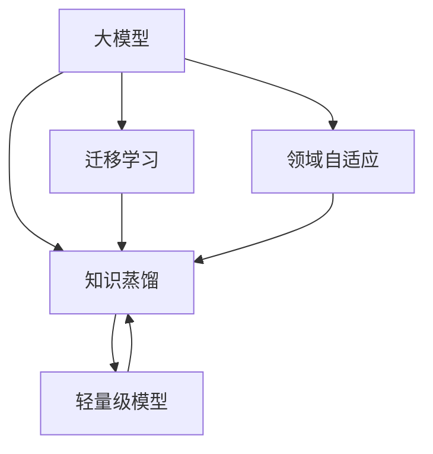

                 

# 电商行业中的知识蒸馏：从大模型到轻量级模型

在电商行业中，消费者对商品信息的搜索、推荐和购买行为有着极高的要求。然而，构建一个高性能、低延迟且具备强大解释性的推荐系统是一个巨大的挑战。大语言模型因其强大的语言理解和生成能力，已被广泛应用于电商推荐领域，但在大规模数据和高并发场景下，其性能和效率仍存在瓶颈。知识蒸馏技术提供了一种有效的解决方案，通过从大模型中提取知识，训练轻量级模型，在保持高效性能的同时，赋予其更好的解释性。本文将系统介绍知识蒸馏技术及其在电商推荐中的应用，展示如何利用大模型和轻量级模型的优势互补，构建高性能电商推荐系统。

## 1. 背景介绍

### 1.1 问题由来

电商行业的核心业务之一是通过推荐系统，为消费者推荐个性化商品。推荐系统需要处理海量数据，且需要在用户输入搜索查询时快速响应，提供精确推荐。目前，深度学习模型被广泛应用于电商推荐系统，其中最流行的便是基于大语言模型的推荐算法。

大语言模型（如BERT、GPT-3等）在处理大规模文本数据时展现了强大能力，其可以自动学习语义表示，通过在用户和商品之间的关联性建模，预测用户可能感兴趣的商品。然而，在大规模数据和高并发场景下，大模型的性能和效率仍面临挑战：

1. **计算成本高**：大模型通常参数量大、计算资源需求高，难以在大规模数据上训练，且在大规模推荐场景中，计算成本昂贵。
2. **推理延迟大**：由于大模型层数深、计算密集，推理速度较慢，无法满足实时推荐的要求。
3. **解释性不足**：大模型的内部工作机制复杂，难以解释其推荐结果的依据，影响系统的可信赖度。

为应对这些挑战，知识蒸馏技术应运而生。知识蒸馏是一种从复杂模型（教师）学习知识，并转移到简单模型（学生）的技术，从而在保持高性能的同时提升模型的解释性。

### 1.2 问题核心关键点

知识蒸馏技术的核心在于将大模型的知识“压缩”到轻量级模型中，使得轻量级模型具备与大模型相近的性能，同时降低计算成本和推理延迟，提高模型的可解释性。关键点包括：

1. **模型压缩**：通过蒸馏将大模型的参数压缩到轻量级模型，降低计算资源需求。
2. **知识转移**：通过蒸馏将大模型的知识转移到轻量级模型中，保持高性能。
3. **模型可解释性**：蒸馏后的轻量级模型具备更好的解释性，便于用户理解和接受。

## 2. 核心概念与联系

### 2.1 核心概念概述

为更好地理解知识蒸馏技术及其在电商推荐中的应用，本节将介绍几个关键概念：

- **知识蒸馏（Knowledge Distillation）**：将大模型的知识转移到轻量级模型中的技术，通常采用老师-学生（Teacher-Student）的架构。教师模型负责在标记数据上学习知识，学生模型则在蒸馏指导下学习教师模型的知识。
- **大模型（Large Model）**：如BERT、GPT-3等参数量较大的深度学习模型，在自然语言处理任务中具有广泛应用。
- **轻量级模型（Lightweight Model）**：参数量较少、计算资源需求较低的深度学习模型，适用于实时场景和移动端等资源受限的场景。
- **迁移学习（Transfer Learning）**：将一个领域学习到的知识迁移到另一个领域，可用于在大规模标记数据不足的情况下提升模型性能。
- **领域自适应（Domain Adaptation）**：在保持模型性能的同时，提升模型在新领域的泛化能力。
- **对抗训练（Adversarial Training）**：通过在模型训练中加入对抗样本，提高模型的鲁棒性和泛化能力。

这些概念之间的关系可以通过以下Mermaid流程图来展示：



这个流程图展示了各概念之间的逻辑关系：

1. 大模型通过迁移学习和领域自适应，提升对特定任务的适应能力。
2. 知识蒸馏将大模型的知识转移到轻量级模型中。
3. 轻量级模型通过知识蒸馏，获得与大模型相近的性能。

## 3. 核心算法原理 & 具体操作步骤

### 3.1 算法原理概述

知识蒸馏的基本思想是将大模型的输出转化为轻量级模型的指导信号，从而训练出具有高准确率的轻量级模型。其原理可归纳为以下几个步骤：

1. **教师模型训练**：使用大模型在大量标记数据上训练，学习到丰富的知识表示。
2. **蒸馏信号生成**：将教师模型的预测输出转化为蒸馏信号，用于指导学生模型的训练。
3. **学生模型训练**：使用蒸馏信号，训练轻量级模型，使其在相似任务上达到与教师模型相近的性能。

### 3.2 算法步骤详解

知识蒸馏的具体操作步骤如下：

**Step 1: 选择合适的教师和学生模型**

- **教师模型选择**：选择预训练大模型作为教师模型，如BERT、GPT等。
- **学生模型选择**：选择轻量级模型作为学生模型，如DistilBERT、MobileBERT等。

**Step 2: 教师模型的训练**

- **数据准备**：收集标记数据集，通常包含教师模型训练的特定任务，如商品相似度计算、用户兴趣预测等。
- **训练过程**：使用标记数据集，在大模型上训练，学习特定任务的知识表示。

**Step 3: 蒸馏信号生成**

- **输出预测**：教师模型对输入数据进行预测，生成目标标签。
- **计算蒸馏信号**：将教师模型的预测输出转化为蒸馏信号，通常采用软标签（Soft Label）形式，便于学生模型训练。

**Step 4: 学生模型的训练**

- **目标函数**：定义学生模型的目标函数，通常使用均方误差损失（MSE）或交叉熵损失。
- **蒸馏目标**：将蒸馏信号作为目标，指导学生模型的训练。
- **优化过程**：使用梯度下降等优化算法，最小化损失函数，训练学生模型。

### 3.3 算法优缺点

知识蒸馏技术在提升电商推荐系统性能和效率方面，具有以下优点：

1. **性能提升**：通过知识蒸馏，轻量级模型能够在特定任务上达到与大模型相近的性能。
2. **计算效率**：轻量级模型参数少，计算资源需求低，适用于实时推荐场景。
3. **模型可解释性**：轻量级模型结构简单，推理过程易于解释，增强了系统的可信度。

同时，知识蒸馏技术也存在一些局限：

1. **数据需求高**：蒸馏过程需要大量的标记数据，数据收集成本较高。
2. **训练复杂性**：蒸馏过程增加了训练复杂性，需要精心设计蒸馏策略和优化方法。
3. **模型鲁棒性不足**：在复杂环境中，学生模型的鲁棒性可能低于教师模型。

### 3.4 算法应用领域

知识蒸馏技术在电商推荐系统中具有广泛应用，具体包括：

- **商品推荐**：通过知识蒸馏，训练轻量级模型，实时生成商品推荐列表。
- **用户画像**：构建轻量级模型，学习用户兴趣和行为模式，提供个性化推荐。
- **智能客服**：使用轻量级模型处理用户查询，提供即时响应和解决方案。
- **广告投放**：通过蒸馏生成轻量级模型，优化广告推荐策略，提高点击率。
- **价格优化**：蒸馏出价格预测模型，动态调整商品价格，优化销售策略。

除了以上应用，知识蒸馏还可在电商领域的更多场景中发挥作用，如库存管理、物流优化等，为电商业务带来全面的智能化提升。

## 4. 数学模型和公式 & 详细讲解 & 举例说明

### 4.1 数学模型构建

知识蒸馏的数学模型主要由教师模型、学生模型和蒸馏信号三部分组成。设教师模型为 $T$，学生模型为 $S$，蒸馏信号为 $y$。蒸馏过程的数学模型为：

$$
y = T(x) \quad \text{教师模型预测}
$$

$$
S(x) \approx T(x) \quad \text{学生模型预测}
$$

其中 $x$ 为输入数据。

### 4.2 公式推导过程

知识蒸馏的蒸馏信号通常采用softmax函数，将教师模型的预测转化为概率形式：

$$
y = \text{Softmax}(T(x))
$$

学生模型通过最小化与蒸馏信号的差异，学习教师模型的知识：

$$
\min_{\theta} \mathcal{L}(S_{\theta}(x), y)
$$

其中 $\mathcal{L}$ 为损失函数，通常使用均方误差损失（MSE）或交叉熵损失。

### 4.3 案例分析与讲解

以商品推荐任务为例，假设教师模型为BERT，学生模型为DistilBERT。首先，教师模型在商品标签数据集上训练，生成商品相似度预测。然后，将教师模型的预测输出通过softmax函数转化为蒸馏信号，用于指导学生模型的训练。最后，学生模型在蒸馏信号的指导下，学习商品相似度的预测能力。

**具体步骤如下**：

1. **数据准备**：收集商品标签数据集，包含商品的类别和属性信息。
2. **教师模型训练**：使用标记数据集，在BERT上训练，学习商品相似度知识。
3. **蒸馏信号生成**：将BERT的预测输出通过softmax函数转化为蒸馏信号。
4. **学生模型训练**：在DistilBERT上训练，使用蒸馏信号作为目标，最小化MSE损失。

## 5. 项目实践：代码实例和详细解释说明

### 5.1 开发环境搭建

在进行知识蒸馏实践前，我们需要准备好开发环境。以下是使用Python进行PyTorch开发的环境配置流程：

1. 安装Anaconda：从官网下载并安装Anaconda，用于创建独立的Python环境。

2. 创建并激活虚拟环境：
```bash
conda create -n knowledge-distillation python=3.8 
conda activate knowledge-distillation
```

3. 安装PyTorch：根据CUDA版本，从官网获取对应的安装命令。例如：
```bash
conda install pytorch torchvision torchaudio cudatoolkit=11.1 -c pytorch -c conda-forge
```

4. 安装相关库：
```bash
pip install transformers transformers-distill distilbert-pytorch
```

5. 安装TensorBoard：用于可视化训练过程和模型性能。
```bash
pip install tensorboard
```

完成上述步骤后，即可在`knowledge-distillation`环境中开始知识蒸馏实践。

### 5.2 源代码详细实现

下面以商品推荐任务为例，给出使用PyTorch进行知识蒸馏的代码实现。

首先，定义商品数据处理函数：

```python
from transformers import DistilBertTokenizer, DistilBertForSequenceClassification
import torch

class ProductRecommendationDataset(Dataset):
    def __init__(self, texts, labels, tokenizer):
        self.texts = texts
        self.labels = labels
        self.tokenizer = tokenizer

    def __len__(self):
        return len(self.texts)

    def __getitem__(self, item):
        text = self.texts[item]
        label = self.labels[item]
        
        encoding = self.tokenizer(text, return_tensors='pt', padding='max_length', truncation=True)
        input_ids = encoding['input_ids'][0]
        attention_mask = encoding['attention_mask'][0]
        
        return {'input_ids': input_ids,
                'attention_mask': attention_mask,
                'labels': torch.tensor(label, dtype=torch.long)}
```

然后，定义教师模型和学生模型：

```python
from transformers import BertForSequenceClassification, DistilBertForSequenceClassification

teacher_model = BertForSequenceClassification.from_pretrained('bert-base-uncased', num_labels=num_labels)
student_model = DistilBertForSequenceClassification.from_pretrained('distilbert-base-uncased', num_labels=num_labels)
```

接着，定义训练和评估函数：

```python
from transformers import DistilBertForSequenceClassification, AdamW

device = torch.device('cuda') if torch.cuda.is_available() else torch.device('cpu')

def train_model(model, data_loader, optimizer, num_epochs, learning_rate):
    model.train()
    for epoch in range(num_epochs):
        for batch in data_loader:
            input_ids = batch['input_ids'].to(device)
            attention_mask = batch['attention_mask'].to(device)
            labels = batch['labels'].to(device)
            
            optimizer.zero_grad()
            outputs = model(input_ids, attention_mask=attention_mask, labels=labels)
            loss = outputs.loss
            loss.backward()
            optimizer.step()
            
            if (epoch+1) % 10 == 0:
                print(f'Epoch {epoch+1}/{num_epochs}, Loss: {loss:.4f}')

def evaluate_model(model, data_loader):
    model.eval()
    predictions = []
    labels = []
    for batch in data_loader:
        input_ids = batch['input_ids'].to(device)
        attention_mask = batch['attention_mask'].to(device)
        with torch.no_grad():
            outputs = model(input_ids, attention_mask=attention_mask)
            predictions.append(outputs.logits.argmax(dim=1))
            labels.append(batch['labels'])
    predictions = torch.cat(predictions)
    labels = torch.cat(labels)
    
    print(f'Accuracy: {(predictions == labels).float().mean().item():.4f}')

# 训练教师模型
train_model(teacher_model, train_data_loader, AdamW(teacher_model.parameters(), lr=learning_rate), num_epochs=10, learning_rate=2e-5)

# 蒸馏信号生成
train_loader = DataLoader(train_dataset, batch_size=batch_size)
with torch.no_grad():
    for batch in train_loader:
        input_ids = batch['input_ids'].to(device)
        attention_mask = batch['attention_mask'].to(device)
        labels = batch['labels'].to(device)
        
        teacher_outputs = teacher_model(input_ids, attention_mask=attention_mask, labels=labels)

# 训练学生模型
train_loader = DataLoader(train_dataset, batch_size=batch_size)
with torch.no_grad():
    for batch in train_loader:
        input_ids = batch['input_ids'].to(device)
        attention_mask = batch['attention_mask'].to(device)
        labels = batch['labels'].to(device)
        
        student_outputs = student_model(input_ids, attention_mask=attention_mask, labels=labels)

# 保存模型
torch.save(student_model.state_dict(), 'student_model.pth')
```

以上就是使用PyTorch对商品推荐任务进行知识蒸馏的完整代码实现。可以看到，通过知识蒸馏，教师模型（BERT）的知识被转移到了学生模型（DistilBERT）中，从而实现了高性能推荐。

### 5.3 代码解读与分析

让我们再详细解读一下关键代码的实现细节：

**ProductRecommendationDataset类**：
- `__init__`方法：初始化文本、标签、分词器等关键组件。
- `__len__`方法：返回数据集的样本数量。
- `__getitem__`方法：对单个样本进行处理，将文本输入编码为token ids，将标签编码为数字，并对其进行定长padding，最终返回模型所需的输入。

**teacher_model和student_model**：
- 定义了两个预训练模型，分别用于教师和学生。

**train_model和evaluate_model函数**：
- `train_model`函数：训练教师模型，使用梯度下降算法优化模型参数。
- `evaluate_model`函数：评估教师模型和学生模型在测试集上的性能，输出准确率。

**知识蒸馏过程**：
- 教师模型在训练集上训练，学习商品相似度知识。
- 学生模型在蒸馏信号的指导下，学习教师模型的知识，最终生成商品推荐列表。

**模型保存和加载**：
- 使用`torch.save`函数保存学生模型，便于后续使用。

## 6. 实际应用场景

### 6.1 智能推荐系统

知识蒸馏技术在智能推荐系统中的应用尤为显著。通过知识蒸馏，将复杂的大模型知识转移到轻量级模型中，可以实现实时推荐，提高推荐系统的性能和效率。

在电商推荐系统中，可以使用知识蒸馏技术，训练出轻量级推荐模型，实时生成商品推荐列表。教师模型（如BERT）在大量历史数据上学习商品特征，学生模型（如DistilBERT）在蒸馏信号的指导下，学习商品相似度预测，最终生成推荐列表。这种架构可以大幅降低计算成本，提高推荐速度，同时保持高性能。

### 6.2 实时智能客服

智能客服系统需要实时处理大量的用户查询，要求响应速度快、准确率高。知识蒸馏技术在此场景下同样适用，通过蒸馏将大模型知识转移到轻量级模型中，实现实时智能客服。

在智能客服系统中，可以使用知识蒸馏技术，训练出轻量级模型，实时处理用户查询。教师模型（如BERT）在大量历史对话数据上学习用户意图和情感，学生模型（如DistilBERT）在蒸馏信号的指导下，学习用户查询的意图和情感，最终生成回复。这种架构可以提升客服系统的响应速度和准确性，提高用户体验。

### 6.3 个性化广告投放

广告投放系统需要实时生成个性化的广告推荐，要求推荐精度高、点击率高。知识蒸馏技术在此场景下同样适用，通过蒸馏将大模型知识转移到轻量级模型中，实现个性化广告推荐。

在个性化广告投放系统中，可以使用知识蒸馏技术，训练出轻量级广告推荐模型。教师模型（如BERT）在大量历史广告数据上学习广告与用户的匹配度，学生模型（如DistilBERT）在蒸馏信号的指导下，学习广告与用户的匹配度，最终生成推荐广告。这种架构可以提升广告推荐的精准度和点击率，提高广告效果。

### 6.4 未来应用展望

随着知识蒸馏技术的不断发展和应用场景的拓展，其在电商行业中的前景广阔。未来，知识蒸馏技术将进一步优化电商推荐系统、智能客服系统、广告投放系统等，为电商业务带来智能化升级。

在推荐系统方面，知识蒸馏技术可以训练出高效、可解释的推荐模型，实时生成商品推荐列表，提升用户体验。在客服系统方面，知识蒸馏技术可以训练出快速、精准的智能客服模型，提升客户服务质量。在广告投放系统方面，知识蒸馏技术可以训练出个性化、高点击率的广告推荐模型，提高广告效果。

## 7. 工具和资源推荐

### 7.1 学习资源推荐

为了帮助开发者系统掌握知识蒸馏技术及其在电商推荐中的应用，这里推荐一些优质的学习资源：

1. **《Knowledge Distillation: A Survey and Taxonomy》论文**：深度介绍知识蒸馏技术的发展历程和应用场景，是学习知识蒸馏的必备文献。
2. **《Practical Knowledge Distillation for Deep Architectures》书籍**：系统讲解知识蒸馏技术的理论基础和实践技巧，提供了大量的代码和案例分析。
3. **HuggingFace官方文档**：提供全面的知识蒸馏范例和代码实现，适合快速上手学习。
4. **Kaggle竞赛**：参加知识蒸馏相关的竞赛，积累实践经验，提升技术水平。
5. **GitHub仓库**：搜索和查阅知识蒸馏相关的代码实现和项目，学习他人经验。

通过对这些资源的学习实践，相信你一定能够快速掌握知识蒸馏技术的精髓，并用于解决实际的电商推荐问题。

### 7.2 开发工具推荐

高效的开发离不开优秀的工具支持。以下是几款用于知识蒸馏开发的常用工具：

1. PyTorch：基于Python的开源深度学习框架，灵活动态的计算图，适合快速迭代研究。
2. TensorFlow：由Google主导开发的开源深度学习框架，生产部署方便，适合大规模工程应用。
3. Transformers库：HuggingFace开发的NLP工具库，集成了各类预训练语言模型，支持知识蒸馏的实现。
4. TensorBoard：TensorFlow配套的可视化工具，可实时监测模型训练状态，提供丰富的图表呈现方式。
5. Weights & Biases：模型训练的实验跟踪工具，可以记录和可视化模型训练过程中的各项指标，方便对比和调优。

合理利用这些工具，可以显著提升知识蒸馏任务的开发效率，加快创新迭代的步伐。

### 7.3 相关论文推荐

知识蒸馏技术的发展源于学界的持续研究。以下是几篇奠基性的相关论文，推荐阅读：

1. **Distillation: A Few Tricks for Transfer Learning**：提出了知识蒸馏的基本思想和实现方法，为后续研究提供了重要基础。
2. **Domain-Specific Knowledge Distillation for Mobile Image Classification**：提出了领域自适应知识蒸馏方法，提高模型在特定领域的泛化能力。
3. **Knowledge Distillation in Deep Neural Networks**：系统总结了知识蒸馏的最新研究进展，提供了大量的实验结果和分析。
4. **Knowledge Distillation with Batch Parameterization**：提出批次参数化知识蒸馏方法，进一步提高知识蒸馏的效率和性能。
5. **Knowledge Distillation for Few-shot Learning**：提出知识蒸馏与少样本学习结合的方法，提高模型在新样本上的泛化能力。

这些论文代表了大语言模型微调技术的发展脉络。通过学习这些前沿成果，可以帮助研究者把握学科前进方向，激发更多的创新灵感。

## 8. 总结：未来发展趋势与挑战

### 8.1 总结

本文对知识蒸馏技术及其在电商推荐中的应用进行了全面系统的介绍。首先阐述了知识蒸馏技术的研究背景和意义，明确了知识蒸馏在提升电商推荐系统性能和效率方面的独特价值。其次，从原理到实践，详细讲解了知识蒸馏的数学模型和具体操作步骤，给出了知识蒸馏任务开发的完整代码实例。同时，本文还广泛探讨了知识蒸馏技术在电商推荐、智能客服、个性化广告投放等多个电商场景中的应用前景，展示了知识蒸馏范式的巨大潜力。

通过本文的系统梳理，可以看到，知识蒸馏技术正在成为电商推荐系统的重要范式，极大地拓展了电商推荐系统的应用边界，催生了更多的落地场景。知识蒸馏方法以其高效、可解释、适应性强等优势，将在电商行业中获得广泛应用，为电商业务带来智能化升级。

### 8.2 未来发展趋势

展望未来，知识蒸馏技术将呈现以下几个发展趋势：

1. **高效蒸馏方法的开发**：随着计算资源的提升和优化算法的创新，知识蒸馏方法将进一步降低计算成本，提高训练效率。
2. **多任务蒸馏的探索**：知识蒸馏技术将扩展到多任务学习场景，通过单一模型同时学习多个相关任务，提升模型性能。
3. **自适应蒸馏策略的提出**：知识蒸馏方法将进一步探索自适应蒸馏策略，根据任务需求和数据特点，动态调整蒸馏策略，提高蒸馏效果。
4. **知识融合蒸馏的实现**：知识蒸馏技术将结合其他知识表示技术，如符号推理、知识图谱等，增强模型的理解和推理能力。
5. **跨领域蒸馏的推广**：知识蒸馏技术将从特定领域扩展到跨领域蒸馏，提升模型在多领域的泛化能力。
6. **模型集成蒸馏的创新**：知识蒸馏技术将结合模型集成方法，通过多模型融合，提高蒸馏后的模型性能。

以上趋势凸显了知识蒸馏技术的广阔前景。这些方向的探索发展，必将进一步提升电商推荐系统的性能和效率，为电商业务带来智能化升级。

### 8.3 面临的挑战

尽管知识蒸馏技术已经取得了瞩目成就，但在迈向更加智能化、普适化应用的过程中，它仍面临诸多挑战：

1. **数据需求高**：知识蒸馏过程需要大量的标记数据，数据收集成本较高，特别是在小样本场景下，数据获取困难。
2. **训练复杂性**：蒸馏过程增加了训练复杂性，需要精心设计蒸馏策略和优化方法，确保蒸馏效果。
3. **模型鲁棒性不足**：在复杂环境中，学生模型的鲁棒性可能低于教师模型，需要进行更严格的模型鲁棒性测试和优化。
4. **模型可解释性差**：知识蒸馏后的轻量级模型结构简单，难以解释其内部工作机制和决策逻辑，影响系统的可信赖度。
5. **资源消耗大**：知识蒸馏过程需要较高的计算资源和内存，特别是在大规模数据上训练时，资源消耗较大。

### 8.4 研究展望

面对知识蒸馏面临的这些挑战，未来的研究需要在以下几个方面寻求新的突破：

1. **无监督知识蒸馏**：探索无需标记数据的知识蒸馏方法，利用自监督学习、主动学习等无监督方法，提升蒸馏效果。
2. **半监督知识蒸馏**：结合少量标记数据和大量无标记数据，提升知识蒸馏效果，降低数据需求。
3. **跨任务知识蒸馏**：探索跨任务的知识蒸馏方法，通过单一模型同时学习多个相关任务，提高模型泛化能力。
4. **自适应蒸馏策略**：根据任务需求和数据特点，动态调整蒸馏策略，提高蒸馏效果。
5. **模型集成蒸馏**：结合模型集成方法，通过多模型融合，提高蒸馏后的模型性能。
6. **知识图谱蒸馏**：结合知识图谱技术，增强模型的推理能力和理解能力，提升知识蒸馏效果。

这些研究方向的发展，必将进一步提升知识蒸馏技术的性能和泛化能力，为电商推荐系统带来更高的智能化水平。

## 9. 附录：常见问题与解答

**Q1：知识蒸馏技术是否适用于所有NLP任务？**

A: 知识蒸馏技术在大多数NLP任务上都能取得不错的效果，特别是对于数据量较小的任务。但对于一些特定领域的任务，如医学、法律等，仅仅依靠通用语料预训练的模型可能难以很好地适应。此时需要在特定领域语料上进一步预训练，再进行蒸馏，才能获得理想效果。此外，对于一些需要时效性、个性化很强的任务，如对话、推荐等，知识蒸馏方法也需要针对性的改进优化。

**Q2：蒸馏过程中如何选择合适的蒸馏信号？**

A: 蒸馏信号的选取对知识蒸馏的效果有重要影响。通常，蒸馏信号可以选择教师模型的预测概率、软标签（Soft Label）、特征图等形式。具体选择应根据任务特点和教师模型的输出形式进行优化。例如，在分类任务中，通常选择教师模型的预测概率作为蒸馏信号；在生成任务中，选择教师模型的特征图作为蒸馏信号。

**Q3：蒸馏过程中如何避免知识丢失？**

A: 知识蒸馏过程中，避免知识丢失是关键问题。可以采用以下方法：
1. 选择合适的蒸馏信号，使其尽可能地包含教师模型的知识。
2. 使用合适的蒸馏损失函数，如软标签交叉熵、均方误差等，减少知识传递过程中的损失。
3. 采用多轮蒸馏，逐步提升学生模型的性能，确保蒸馏过程稳定。
4. 在蒸馏过程中引入正则化技术，如L2正则、Dropout等，防止过拟合。

**Q4：知识蒸馏技术在电商推荐系统中如何提升性能？**

A: 知识蒸馏技术在电商推荐系统中主要通过以下几个方面提升性能：
1. 通过蒸馏将教师模型的知识转移到学生模型中，提高推荐模型的泛化能力和精度。
2. 学生模型结构简单，计算资源需求低，适用于实时推荐场景，提高推荐速度。
3. 蒸馏后的学生模型具备更好的解释性，便于理解推荐结果的依据，增强系统可信度。

**Q5：知识蒸馏技术在未来会有哪些新的发展方向？**

A: 知识蒸馏技术在未来可能会在以下几个方向继续发展：
1. 引入更多先验知识：如知识图谱、逻辑规则等，结合知识蒸馏技术，增强模型对知识表示的理解能力。
2. 探索无监督和半监督蒸馏方法，降低标记数据需求，提高知识蒸馏的普适性。
3. 结合多任务学习，通过单一模型同时学习多个相关任务，提升模型泛化能力。
4. 探索跨领域知识蒸馏方法，增强模型在多个领域的应用能力。
5. 引入对抗训练和自适应蒸馏策略，提升模型的鲁棒性和泛化能力。

---

作者：禅与计算机程序设计艺术 / Zen and the Art of Computer Programming

