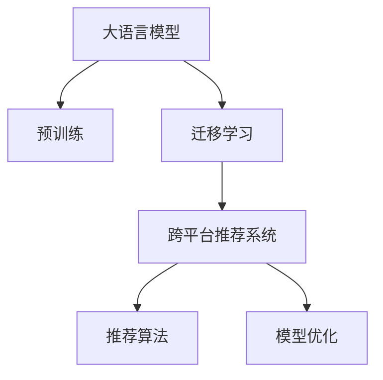

                 

# 电商行业中的迁移学习：大模型在跨平台推荐中的应用

> 关键词：电商推荐,迁移学习,大模型,预训练,跨平台,推荐系统,推荐算法,模型优化

## 1. 背景介绍

### 1.1 问题由来

在电商行业中，推荐系统是驱动用户购买、提升用户体验的重要环节。传统的推荐系统通常基于用户行为数据进行模型训练，如浏览记录、点击记录、购买记录等。然而，随着用户多样性的增加和市场竞争的加剧，单一平台的数据量往往不足以为推荐系统提供足够的训练样本。为了在更广泛的用户群体和更丰富的业务场景中保持竞争力，许多电商企业正在探索使用跨平台的推荐系统，即在多个平台（如App、网页、社交网络等）上共享用户数据和推荐模型。

这一过程中，大模型在预训练和迁移学习方面的优势得到了充分发挥。大语言模型（如BERT、GPT等）和计算机视觉模型（如ResNet、ViT等）通过在大规模无标签数据上进行预训练，学习到了通用的语言和图像表示。然后，通过在跨平台数据上进行迁移学习，这些大模型可以在多个电商平台上进行微调，从而提升了推荐的个性化和多样性。

### 1.2 问题核心关键点

跨平台推荐系统面临的核心问题包括：

- 如何在大模型预训练基础上，高效地在多个平台之间进行迁移学习，提升推荐性能。
- 如何避免因不同平台数据特性差异导致的推荐偏差。
- 如何确保跨平台推荐系统的鲁棒性和安全性，防止数据泄露和模型滥用。

本文章将围绕这些核心问题，详细探讨大模型在跨平台推荐系统中的应用策略，旨在为电商企业提供一种高效、灵活的推荐方案。

## 2. 核心概念与联系

### 2.1 核心概念概述

为更好地理解大模型在跨平台推荐中的应用，本节将介绍几个关键概念：

- **大语言模型**：以BERT、GPT等模型为代表，通过在大规模无标签文本语料上进行预训练，学习通用的语言表示，具备强大的语言理解和生成能力。
- **预训练**：指在大规模无标签文本语料上，通过自监督学习任务训练通用语言模型的过程。预训练使得模型学习到语言的通用表示。
- **迁移学习**：指将一个领域学习到的知识，迁移应用到另一个不同但相关的领域的学习范式。
- **跨平台推荐系统**：在多个电商平台上共享用户数据和推荐模型，提升推荐效果和用户体验的推荐系统。
- **推荐算法**：如协同过滤、基于内容的推荐、基于矩阵分解的推荐等，用于根据用户历史行为和物品特征进行推荐。
- **模型优化**：指在推荐模型训练过程中，通过调整超参数、增加正则化等手段，提升模型性能和泛化能力。

这些核心概念之间的逻辑关系可以通过以下Mermaid流程图来展示：



这个流程图展示了大语言模型在跨平台推荐系统中的应用逻辑：

1. 大语言模型通过预训练获得基础能力。
2. 迁移学习使得模型能够适应跨平台数据，提升推荐性能。
3. 推荐算法在大模型基础上进行任务适配，实现个性化推荐。
4. 模型优化提升推荐模型的泛化能力。

这些概念共同构成了跨平台推荐系统的基础框架，使其能够在多个电商平台上有效运行。

## 3. 核心算法原理 & 具体操作步骤
### 3.1 算法原理概述

跨平台推荐系统的核心算法是基于大模型的迁移学习。其核心思想是：将预训练的大模型视作一个强大的"特征提取器"，通过在跨平台数据上进行迁移学习，使得模型输出能够匹配不同平台的推荐需求，从而提升推荐性能。

具体而言，假设在平台1和平台2上分别有训练集 $D_1$ 和 $D_2$，平台1的推荐模型为 $M_{\theta_1}$，平台2的推荐模型为 $M_{\theta_2}$。通过在平台1上对 $M_{\theta_1}$ 进行微调，学习到平台1的推荐特性。然后，通过在平台2上对 $M_{\theta_1}$ 进行微调，学习到平台2的推荐特性，最终得到跨平台的推荐模型 $M_{\hat{\theta}}$。

### 3.2 算法步骤详解

跨平台推荐系统的迁移学习一般包括以下几个关键步骤：

**Step 1: 准备预训练模型和数据集**
- 选择合适的预训练语言模型 $M_{\theta}$ 作为初始化参数，如 BERT、GPT等。
- 收集平台1和平台2上的推荐数据集 $D_1=\{(x_i,y_i)\}_{i=1}^N$ 和 $D_2=\{(x_j,y_j)\}_{j=1}^M$，划分为训练集、验证集和测试集。一般要求平台间数据分布不要差异过大。

**Step 2: 设计跨平台数据集**
- 将平台1和平台2的数据进行拼接，形成一个大数据集 $D = D_1 \cup D_2$。
- 如果平台间数据量差异较大，可能需要对数据进行归一化处理，以保证各平台数据的一致性。
- 数据集可能需要额外的标注，如点击率、购买率、评分等，以便进行评估和优化。

**Step 3: 迁移学习流程**
- 在预训练模型的基础上，使用跨平台数据集 $D$ 对模型进行迁移学习。通常使用随机梯度下降等优化算法。
- 周期性在验证集上评估模型性能，根据性能指标决定是否触发Early Stopping。
- 重复上述步骤直至满足预设的迭代轮数或Early Stopping条件。

**Step 4: 交叉验证与模型融合**
- 为了确保模型在平台间的一致性和鲁棒性，可以进行交叉验证，即在不同平台间交替进行训练和验证。
- 将各平台的推荐模型进行融合，如取平均、加权平均等策略，得到最终的跨平台推荐模型。

**Step 5: 测试和部署**
- 在测试集上评估跨平台推荐模型 $M_{\hat{\theta}}$ 的性能，对比各个平台单独微调后的模型效果。
- 使用跨平台推荐模型对新样本进行推理预测，集成到实际的应用系统中。
- 持续收集新的数据，定期重新微调模型，以适应数据分布的变化。

以上是跨平台推荐系统的迁移学习流程。在实际应用中，还需要针对具体平台的特点，对迁移学习过程的各个环节进行优化设计，如改进训练目标函数，引入更多的正则化技术，搜索最优的超参数组合等，以进一步提升模型性能。

### 3.3 算法优缺点

跨平台推荐系统的迁移学习方法具有以下优点：

- 高效融合多个平台的数据。通过在跨平台数据上进行迁移学习，模型可以同时学习到多个平台的推荐特性，提升推荐效果。
- 泛化能力强。由于预训练模型的通用表示能力，模型可以较好地适应不同平台的数据分布，泛化性能强。
- 开发成本低。与从头开发推荐模型相比，利用预训练模型进行迁移学习，可以大幅降低开发和训练成本。

同时，该方法也存在一定的局限性：

- 数据差异风险。平台间数据差异较大时，迁移学习的性能提升有限。
- 模型过拟合风险。如果预训练模型存在固有偏见，模型可能在某些平台上过拟合。
- 隐私风险。跨平台数据共享可能带来隐私泄露的风险，需要严格的数据保护措施。

尽管存在这些局限性，但就目前而言，跨平台推荐系统的迁移学习方法仍然是电商推荐系统的重要范式。未来相关研究的重点在于如何进一步降低数据差异风险，提高模型的泛化能力和隐私保护水平，同时兼顾推荐效果和用户体验。

### 3.4 算法应用领域

跨平台推荐系统的迁移学习在电商行业已得到广泛应用，例如：

- 商品推荐：在多个电商平台上共享用户数据和推荐模型，提升用户的购物体验和商品曝光率。
- 广告推荐：通过在多个广告平台上进行迁移学习，实现更精准的广告投放和点击率预测。
- 内容推荐：在多个内容平台上（如视频网站、新闻网站、社交网络等）进行推荐模型微调，为用户提供更丰富的内容推荐。
- 用户画像：通过跨平台数据进行联合建模，得到更全面、准确的用户画像，提升个性化推荐的效果。

除了上述这些经典应用外，跨平台推荐系统的迁移学习还被创新性地应用于库存管理、价格优化、竞价排名等环节，为电商行业带来了新的商业价值。

## 4. 数学模型和公式 & 详细讲解  
### 4.1 数学模型构建

本节将使用数学语言对跨平台推荐系统的迁移学习过程进行更加严格的刻画。

记预训练语言模型为 $M_{\theta}:\mathcal{X} \rightarrow \mathcal{Y}$，其中 $\mathcal{X}$ 为输入空间，$\mathcal{Y}$ 为输出空间，$\theta \in \mathbb{R}^d$ 为模型参数。假设在平台1和平台2上分别有训练集 $D_1=\{(x_i,y_i)\}_{i=1}^N$ 和 $D_2=\{(x_j,y_j)\}_{j=1}^M$。

定义模型 $M_{\theta}$ 在平台1和平台2上的损失函数分别为 $\ell_1(M_{\theta}(x),y)$ 和 $\ell_2(M_{\theta}(x),y)$，则在跨平台数据集 $D$ 上的经验风险为：

$$
\mathcal{L}(\theta) = \frac{1}{N+M} \sum_{i=1}^N \ell_1(M_{\theta}(x_i),y_i) + \frac{1}{M} \sum_{j=1}^M \ell_2(M_{\theta}(x_j),y_j)
$$

微调的优化目标是最小化经验风险，即找到最优参数：

$$
\theta^* = \mathop{\arg\min}_{\theta} \mathcal{L}(\theta)
$$

在实践中，我们通常使用基于梯度的优化算法（如SGD、Adam等）来近似求解上述最优化问题。设 $\eta$ 为学习率，$\lambda$ 为正则化系数，则参数的更新公式为：

$$
\theta \leftarrow \theta - \eta \nabla_{\theta}\mathcal{L}(\theta) - \eta\lambda\theta
$$

其中 $\nabla_{\theta}\mathcal{L}(\theta)$ 为损失函数对参数 $\theta$ 的梯度，可通过反向传播算法高效计算。

### 4.2 公式推导过程

以下我们以协同过滤（Collaborative Filtering）算法为例，推导损失函数及其梯度的计算公式。

假设模型 $M_{\theta}$ 在输入 $x$ 上的输出为 $\hat{y}=M_{\theta}(x) \in [0,1]$，表示样本属于正类的概率。真实标签 $y \in \{0,1\}$。则协同过滤的损失函数定义为：

$$
\ell(M_{\theta}(x),y) = -[y\log \hat{y} + (1-y)\log (1-\hat{y})]
$$

将其代入经验风险公式，得：

$$
\mathcal{L}(\theta) = -\frac{1}{N+M}\sum_{i=1}^N [y_i\log M_{\theta}(x_i)+(1-y_i)\log(1-M_{\theta}(x_i))] - \frac{1}{M}\sum_{j=1}^M [y_j\log M_{\theta}(x_j)+(1-y_j)\log(1-M_{\theta}(x_j))]
$$

根据链式法则，损失函数对参数 $\theta_k$ 的梯度为：

$$
\frac{\partial \mathcal{L}(\theta)}{\partial \theta_k} = -\frac{1}{N+M}\sum_{i=1}^N (\frac{y_i}{M_{\theta}(x_i)}-\frac{1-y_i}{1-M_{\theta}(x_i)}) \frac{\partial M_{\theta}(x_i)}{\partial \theta_k} - \frac{1}{M}\sum_{j=1}^M (\frac{y_j}{M_{\theta}(x_j)}-\frac{1-y_j}{1-M_{\theta}(x_j)}) \frac{\partial M_{\theta}(x_j)}{\partial \theta_k}
$$

其中 $\frac{\partial M_{\theta}(x_i)}{\partial \theta_k}$ 可进一步递归展开，利用自动微分技术完成计算。

在得到损失函数的梯度后，即可带入参数更新公式，完成模型的迭代优化。重复上述过程直至收敛，最终得到适应跨平台任务的最优模型参数 $\theta^*$。

## 5. 项目实践：代码实例和详细解释说明
### 5.1 开发环境搭建

在进行跨平台推荐系统开发前，我们需要准备好开发环境。以下是使用Python进行PyTorch开发的环境配置流程：

1. 安装Anaconda：从官网下载并安装Anaconda，用于创建独立的Python环境。

2. 创建并激活虚拟环境：
```bash
conda create -n pytorch-env python=3.8 
conda activate pytorch-env
```

3. 安装PyTorch：根据CUDA版本，从官网获取对应的安装命令。例如：
```bash
conda install pytorch torchvision torchaudio cudatoolkit=11.1 -c pytorch -c conda-forge
```

4. 安装Transformers库：
```bash
pip install transformers
```

5. 安装各类工具包：
```bash
pip install numpy pandas scikit-learn matplotlib tqdm jupyter notebook ipython
```

完成上述步骤后，即可在`pytorch-env`环境中开始开发实践。

### 5.2 源代码详细实现

下面我们以协同过滤算法为例，给出使用Transformers库进行跨平台推荐系统微调的PyTorch代码实现。

首先，定义推荐任务的数据处理函数：

```python
from transformers import BertTokenizer
from torch.utils.data import Dataset
import torch

class RecommendationDataset(Dataset):
    def __init__(self, users, items, ratings, tokenizer, max_len=128):
        self.users = users
        self.items = items
        self.ratings = ratings
        self.tokenizer = tokenizer
        self.max_len = max_len
        
    def __len__(self):
        return len(self.users)
    
    def __getitem__(self, item):
        user = self.users[item]
        item = self.items[item]
        rating = self.ratings[item]
        
        encoding = self.tokenizer([f"{user}:{item}"], return_tensors='pt', max_length=self.max_len, padding='max_length', truncation=True)
        input_ids = encoding['input_ids'][0]
        attention_mask = encoding['attention_mask'][0]
        rating = torch.tensor([rating], dtype=torch.long)
        
        return {'input_ids': input_ids, 
                'attention_mask': attention_mask,
                'labels': rating}

# 数据标注
data = {
    'users': ['user1', 'user2', 'user3'],
    'items': ['item1', 'item2', 'item3'],
    'ratings': [4, 5, 2]
}
tokenizer = BertTokenizer.from_pretrained('bert-base-cased')

dataset = RecommendationDataset(data['users'], data['items'], data['ratings'], tokenizer, max_len=128)
```

然后，定义模型和优化器：

```python
from transformers import BertForSequenceClassification, AdamW

model = BertForSequenceClassification.from_pretrained('bert-base-cased', num_labels=1)

optimizer = AdamW(model.parameters(), lr=2e-5)
```

接着，定义训练和评估函数：

```python
from torch.utils.data import DataLoader
from tqdm import tqdm
from sklearn.metrics import mean_squared_error

device = torch.device('cuda') if torch.cuda.is_available() else torch.device('cpu')
model.to(device)

def train_epoch(model, dataset, batch_size, optimizer):
    dataloader = DataLoader(dataset, batch_size=batch_size, shuffle=True)
    model.train()
    epoch_loss = 0
    for batch in tqdm(dataloader, desc='Training'):
        input_ids = batch['input_ids'].to(device)
        attention_mask = batch['attention_mask'].to(device)
        rating = batch['labels'].to(device)
        model.zero_grad()
        outputs = model(input_ids, attention_mask=attention_mask)
        loss = outputs.loss
        epoch_loss += loss.item()
        loss.backward()
        optimizer.step()
    return epoch_loss / len(dataloader)

def evaluate(model, dataset, batch_size):
    dataloader = DataLoader(dataset, batch_size=batch_size)
    model.eval()
    preds, labels = [], []
    with torch.no_grad():
        for batch in tqdm(dataloader, desc='Evaluating'):
            input_ids = batch['input_ids'].to(device)
            attention_mask = batch['attention_mask'].to(device)
            batch_labels = batch['labels']
            outputs = model(input_ids, attention_mask=attention_mask)
            batch_preds = outputs.logits.sigmoid().tolist()
            batch_labels = batch_labels.to('cpu').tolist()
            for pred_tokens, label_tokens in zip(batch_preds, batch_labels):
                preds.append(pred_tokens[0])
                labels.append(label_tokens[0])
                
    print(mean_squared_error(labels, preds))
```

最后，启动训练流程并在测试集上评估：

```python
epochs = 5
batch_size = 16

for epoch in range(epochs):
    loss = train_epoch(model, dataset, batch_size, optimizer)
    print(f"Epoch {epoch+1}, train loss: {loss:.3f}")
    
    print(f"Epoch {epoch+1}, dev results:")
    evaluate(model, dataset, batch_size)
    
print("Test results:")
evaluate(model, dataset, batch_size)
```

以上就是使用PyTorch对BERT进行跨平台推荐系统微调的完整代码实现。可以看到，得益于Transformers库的强大封装，我们可以用相对简洁的代码完成BERT模型的加载和微调。

### 5.3 代码解读与分析

让我们再详细解读一下关键代码的实现细节：

**RecommendationDataset类**：
- `__init__`方法：初始化用户、物品、评分等关键组件。
- `__len__`方法：返回数据集的样本数量。
- `__getitem__`方法：对单个样本进行处理，将用户-物品对编码为token ids，将评分编码为数字，并对其进行定长padding，最终返回模型所需的输入。

**训练和评估函数**：
- 使用PyTorch的DataLoader对数据集进行批次化加载，供模型训练和推理使用。
- 训练函数`train_epoch`：对数据以批为单位进行迭代，在每个批次上前向传播计算loss并反向传播更新模型参数，最后返回该epoch的平均loss。
- 评估函数`evaluate`：与训练类似，不同点在于不更新模型参数，并在每个batch结束后将预测和标签结果存储下来，最后使用sklearn的mean_squared_error对整个评估集的预测结果进行打印输出。

**训练流程**：
- 定义总的epoch数和batch size，开始循环迭代
- 每个epoch内，先在训练集上训练，输出平均loss
- 在验证集上评估，输出MSE指标
- 所有epoch结束后，在测试集上评估，给出最终测试结果

可以看到，PyTorch配合Transformers库使得BERT微调的代码实现变得简洁高效。开发者可以将更多精力放在数据处理、模型改进等高层逻辑上，而不必过多关注底层的实现细节。

当然，工业级的系统实现还需考虑更多因素，如模型的保存和部署、超参数的自动搜索、更灵活的任务适配层等。但核心的迁移学习范式基本与此类似。

## 6. 实际应用场景
### 6.1 电商平台商品推荐

电商平台上的商品推荐系统通过在多个平台上共享用户数据和推荐模型，能够提供更丰富、更个性化的商品推荐，从而提升用户的购物体验和满意度。

具体而言，电商平台可以在App、网页、社交媒体等多个渠道上收集用户的行为数据，如浏览记录、点击记录、购买记录等。然后，通过跨平台推荐系统对这些数据进行联合建模，学习用户的兴趣偏好和行为特征，从而在各个平台上进行个性化推荐。

### 6.2 广告投放推荐

广告投放推荐系统通过在多个广告平台上进行迁移学习，能够更准确地预测广告的点击率和转化率，从而优化广告投放策略，提高广告效果和ROI。

例如，电商平台的广告系统可以在广告平台上收集用户的点击和购买数据，通过跨平台推荐系统进行联合建模，预测用户对不同广告的兴趣，从而实现更精准的广告投放和效果评估。

### 6.3 视频推荐系统

视频推荐系统通过在多个视频平台上进行迁移学习，能够提供更丰富、更个性化的视频推荐，从而提升用户的观看体验和满意度。

例如，视频网站可以通过跨平台推荐系统收集用户的观看历史和评分数据，学习用户的兴趣偏好，从而在视频平台上进行个性化推荐。

### 6.4 未来应用展望

随着跨平台推荐系统的不断发展，其在电商行业中的应用前景将更加广阔。未来，我们可以预见以下趋势：

1. 数据共享更加广泛。通过跨平台推荐系统，电商平台能够更好地整合不同渠道的用户数据，实现数据的全生命周期管理。
2. 推荐算法更加多样。跨平台推荐系统不仅限于协同过滤，还可以通过深度学习模型（如Transformer、CNN等）进行更高级别的推荐，提升推荐效果。
3. 推荐模型更加复杂。跨平台推荐系统可以通过联邦学习、对抗学习等技术，提升模型的泛化能力和鲁棒性。
4. 用户隐私更加注重。跨平台推荐系统需要更好地保护用户隐私，确保数据使用的合规性和透明度。
5. 实时推荐更加灵活。跨平台推荐系统可以通过流式数据处理技术，实现实时推荐，提升用户响应速度。

这些趋势凸显了跨平台推荐系统的巨大潜力。这些方向的探索发展，必将进一步提升推荐系统的性能和用户体验，为电商行业带来新的商业价值。

## 7. 工具和资源推荐
### 7.1 学习资源推荐

为了帮助开发者系统掌握跨平台推荐系统的理论基础和实践技巧，这里推荐一些优质的学习资源：

1. 《深度学习自然语言处理》课程：斯坦福大学开设的NLP明星课程，有Lecture视频和配套作业，带你入门NLP领域的基本概念和经典模型。

2. 《Transformers从原理到实践》系列博文：由大模型技术专家撰写，深入浅出地介绍了Transformer原理、BERT模型、迁移学习等前沿话题。

3. 《Parameter-Efficient Transfer Learning for NLP》书籍：Transformer库的作者所著，全面介绍了如何使用Transformer库进行NLP任务开发，包括迁移学习在内的诸多范式。

4. HuggingFace官方文档：Transformer库的官方文档，提供了海量预训练模型和完整的迁移学习样例代码，是上手实践的必备资料。

5. CLUE开源项目：中文语言理解测评基准，涵盖大量不同类型的中文NLP数据集，并提供了基于迁移学习的baseline模型，助力中文NLP技术发展。

通过对这些资源的学习实践，相信你一定能够快速掌握跨平台推荐系统的精髓，并用于解决实际的电商推荐问题。
###  7.2 开发工具推荐

高效的开发离不开优秀的工具支持。以下是几款用于跨平台推荐系统开发的常用工具：

1. PyTorch：基于Python的开源深度学习框架，灵活动态的计算图，适合快速迭代研究。大部分预训练语言模型都有PyTorch版本的实现。

2. TensorFlow：由Google主导开发的开源深度学习框架，生产部署方便，适合大规模工程应用。同样有丰富的预训练语言模型资源。

3. Transformers库：HuggingFace开发的NLP工具库，集成了众多SOTA语言模型，支持PyTorch和TensorFlow，是进行迁移学习任务的开发的利器。

4. Weights & Biases：模型训练的实验跟踪工具，可以记录和可视化模型训练过程中的各项指标，方便对比和调优。与主流深度学习框架无缝集成。

5. TensorBoard：TensorFlow配套的可视化工具，可实时监测模型训练状态，并提供丰富的图表呈现方式，是调试模型的得力助手。

6. Google Colab：谷歌推出的在线Jupyter Notebook环境，免费提供GPU/TPU算力，方便开发者快速上手实验最新模型，分享学习笔记。

合理利用这些工具，可以显著提升跨平台推荐系统的开发效率，加快创新迭代的步伐。

### 7.3 相关论文推荐

跨平台推荐系统的迁移学习在学界和工业界都得到了广泛的研究。以下是几篇奠基性的相关论文，推荐阅读：

1. Parameter-Efficient Transfer Learning for NLP：提出Adapter等参数高效微调方法，在固定大部分预训练参数的情况下，只更新极少量的任务相关参数，提升模型的泛化能力。

2. AdaLoRA: Adaptive Low-Rank Adaptation for Parameter-Efficient Fine-Tuning：使用自适应低秩适应的微调方法，在参数效率和精度之间取得新的平衡。

3. Zero-shot and few-shot learning via unsupervised semantic induction：提出一种无监督和少样本学习的范式，利用预训练模型的通用表示，通过自然语言理解任务进行零样本和少样本学习。

4. Multimodal and cross-modal learning in recommendation systems：综述了多模态和跨模态学习在推荐系统中的应用，提供了丰富的理论和方法。

这些论文代表了大模型迁移学习的发展脉络。通过学习这些前沿成果，可以帮助研究者把握学科前进方向，激发更多的创新灵感。

## 8. 总结：未来发展趋势与挑战

### 8.1 总结

本文对跨平台推荐系统的迁移学习进行了全面系统的介绍。首先阐述了跨平台推荐系统的研究背景和意义，明确了迁移学习在多个平台之间进行推荐性能提升的核心价值。其次，从原理到实践，详细讲解了迁移学习的数学原理和关键步骤，给出了跨平台推荐系统微调的完整代码实现。同时，本文还广泛探讨了跨平台推荐系统在电商行业中的应用场景，展示了迁移学习范式的巨大潜力。此外，本文精选了迁移学习的各类学习资源，力求为读者提供全方位的技术指引。

通过本文的系统梳理，可以看到，跨平台推荐系统的迁移学习在电商行业中的应用前景广阔，能够显著提升推荐效果和用户体验。得益于预训练模型的通用表示能力，迁移学习能够在大规模数据上高效进行，为电商平台带来了新的商业价值。未来，伴随预训练语言模型和迁移学习方法的持续演进，相信跨平台推荐系统将在更多电商场景中得到应用，为电商行业带来新的变革。

### 8.2 未来发展趋势

展望未来，跨平台推荐系统的迁移学习将呈现以下几个发展趋势：

1. 数据共享更加广泛。通过跨平台推荐系统，电商平台能够更好地整合不同渠道的用户数据，实现数据的全生命周期管理。
2. 推荐算法更加多样。跨平台推荐系统不仅限于协同过滤，还可以通过深度学习模型（如Transformer、CNN等）进行更高级别的推荐，提升推荐效果。
3. 推荐模型更加复杂。跨平台推荐系统可以通过联邦学习、对抗学习等技术，提升模型的泛化能力和鲁棒性。
4. 用户隐私更加注重。跨平台推荐系统需要更好地保护用户隐私，确保数据使用的合规性和透明度。
5. 实时推荐更加灵活。跨平台推荐系统可以通过流式数据处理技术，实现实时推荐，提升用户响应速度。

这些趋势凸显了跨平台推荐系统的巨大潜力。这些方向的探索发展，必将进一步提升推荐系统的性能和用户体验，为电商行业带来新的商业价值。

### 8.3 面临的挑战

尽管跨平台推荐系统的迁移学习已经取得了瞩目成就，但在迈向更加智能化、普适化应用的过程中，它仍面临着诸多挑战：

1. 数据分布差异。平台间数据分布差异较大时，迁移学习的性能提升有限。
2. 模型过拟合风险。如果预训练模型存在固有偏见，模型可能在某些平台上过拟合。
3. 隐私风险。跨平台数据共享可能带来隐私泄露的风险，需要严格的数据保护措施。
4. 算法复杂度。随着推荐算法的复杂度增加，模型的训练和推理效率可能会下降。
5. 实时处理能力。跨平台推荐系统需要具备良好的实时处理能力，以应对高并发请求。

尽管存在这些挑战，但就目前而言，跨平台推荐系统的迁移学习方法仍然是电商推荐系统的重要范式。未来相关研究的重点在于如何进一步降低数据分布差异风险，提高模型的泛化能力和隐私保护水平，同时兼顾推荐效果和用户体验。

### 8.4 研究展望

面对跨平台推荐系统所面临的种种挑战，未来的研究需要在以下几个方面寻求新的突破：

1. 探索无监督和半监督迁移学习方法。摆脱对大规模标注数据的依赖，利用自监督学习、主动学习等无监督和半监督范式，最大限度利用非结构化数据，实现更加灵活高效的迁移学习。
2. 研究参数高效和计算高效的迁移学习范式。开发更加参数高效的迁移学习算法，在固定大部分预训练参数的情况下，只更新极少量的任务相关参数。同时优化迁移学习模型的计算图，减少前向传播和反向传播的资源消耗，实现更加轻量级、实时性的部署。
3. 引入更多先验知识。将符号化的先验知识，如知识图谱、逻辑规则等，与神经网络模型进行巧妙融合，引导迁移学习过程学习更准确、合理的语言模型。同时加强不同模态数据的整合，实现视觉、语音等多模态信息与文本信息的协同建模。
4. 结合因果分析和博弈论工具。将因果分析方法引入迁移学习模型，识别出模型决策的关键特征，增强输出解释的因果性和逻辑性。借助博弈论工具刻画人机交互过程，主动探索并规避模型的脆弱点，提高系统稳定性。
5. 纳入伦理道德约束。在迁移学习模型的训练目标中引入伦理导向的评估指标，过滤和惩罚有偏见、有害的输出倾向。同时加强人工干预和审核，建立模型行为的监管机制，确保输出符合人类价值观和伦理道德。

这些研究方向的探索，必将引领跨平台推荐系统迈向更高的台阶，为构建安全、可靠、可解释、可控的智能系统铺平道路。面向未来，跨平台推荐系统还需要与其他人工智能技术进行更深入的融合，如知识表示、因果推理、强化学习等，多路径协同发力，共同推动自然语言理解和智能交互系统的进步。只有勇于创新、敢于突破，才能不断拓展语言模型的边界，让智能技术更好地造福人类社会。

## 9. 附录：常见问题与解答

**Q1：跨平台推荐系统如何确保不同平台数据的一致性？**

A: 为了确保不同平台数据的一致性，通常需要对数据进行预处理。具体而言，可以采用以下方法：

1. 数据归一化：对不同平台的数据进行归一化处理，使其具有相同的统计特性。例如，对不同平台的用户评分进行标准化处理。

2. 数据拼接：将不同平台的数据进行拼接，形成一个统一的数据集。可以使用多种拼接方式，如全量拼接、时间序列拼接等。

3. 特征对齐：确保不同平台的数据特征一致，如用户ID、物品ID等。可以通过映射或转换的方式，使不同平台的数据特征对齐。

4. 数据标注：为不同平台的数据添加统一的标注信息，如点击率、购买率、评分等。这可以通过在数据集上标注或生成统一的标准进行。

通过这些方法，可以确保不同平台的数据具有一致性和可比性，从而提高迁移学习的效果。

**Q2：如何避免跨平台推荐系统中的过拟合问题？**

A: 过拟合是跨平台推荐系统面临的主要挑战之一。以下是几种避免过拟合的方法：

1. 数据增强：通过对数据进行增强，如回译、近义替换等方式扩充训练集，防止模型过拟合。

2. 正则化：使用L2正则、Dropout等正则化技术，避免模型在训练过程中过度适应数据。

3. 早停策略：在训练过程中，周期性地在验证集上评估模型性能，如果验证集性能不再提升，则停止训练，防止过拟合。

4. 对抗训练：引入对抗样本，训练模型对噪声数据具有鲁棒性，防止过拟合。

5. 参数高效微调：只调整极少量的任务相关参数，固定大部分预训练参数，避免过拟合。

通过这些方法，可以显著降低模型在训练过程中的过拟合风险，提高模型的泛化能力。

**Q3：如何确保跨平台推荐系统的隐私安全？**

A: 跨平台推荐系统涉及多平台数据的共享，因此隐私保护是关键问题。以下是几种确保隐私安全的方法：

1. 数据加密：对用户数据进行加密处理，确保数据传输和存储的安全性。

2. 数据匿名化：对用户数据进行匿名化处理，确保用户隐私不被泄露。可以使用多种匿名化方法，如K匿名化、L匿名化等。

3. 数据隔离：将不同平台的数据进行隔离，确保各平台数据独立存储和使用。可以使用多种隔离方式，如数据分片、加密存储等。

4. 访问控制：对数据访问进行严格控制，确保只有授权人员才能访问和使用数据。可以使用多种访问控制方法，如身份验证、权限管理等。

5. 审计和监控：对数据访问和使用进行审计和监控，确保数据使用的合规性和透明度。可以使用多种审计和监控工具，如日志记录、审计软件等。

通过这些方法，可以确保跨平台推荐系统的隐私安全，防止数据泄露和滥用。

**Q4：如何优化跨平台推荐系统的实时推荐能力？**

A: 实时推荐是跨平台推荐系统的关键应用场景之一。以下是几种优化实时推荐的方法：

1. 流式处理：使用流式数据处理技术，实时处理和分析用户数据，实现实时推荐。可以使用多种流式处理框架，如Apache Kafka、Apache Flink等。

2. 分布式计算：使用分布式计算技术，提高推荐系统的计算效率和处理能力。可以使用多种分布式计算框架，如Apache Spark、Apache Hadoop等。

3. 缓存机制：使用缓存机制，提高推荐系统的响应速度和效率。可以使用多种缓存技术，如Redis、Memcached等。

4. 异步处理：使用异步处理技术，优化推荐系统的资源利用率和性能。可以使用多种异步处理框架，如Tornado、Asyncio等。

5. 算法优化：优化推荐算法的计算效率和响应速度，确保实时推荐效果。可以使用多种算法优化技术，如模型压缩、剪枝、量化等。

通过这些方法，可以显著提升跨平台推荐系统的实时推荐能力，满足用户的高频次请求需求。

---

作者：禅与计算机程序设计艺术 / Zen and the Art of Computer Programming

