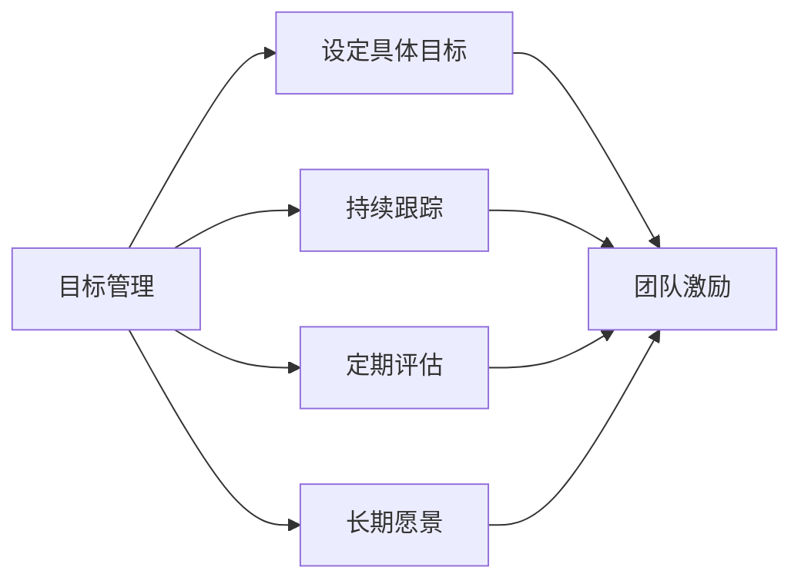

                 

# 目标管理与团队激励的关系

> 关键词：目标管理,团队激励,绩效提升,组织行为,领导力

## 1. 背景介绍

在现代企业管理中，目标管理（Goal Management）和团队激励（Team Motivation）是提升团队绩效、推动企业发展的重要手段。通过科学的目标设置和有效的激励机制，可以激发员工的积极性和创造力，达成组织和个人的共同目标。然而，目标管理和团队激励两者之间存在着紧密的联系和相互影响。本文将探讨目标管理与团队激励的关系，分析其在实际应用中的作用机制，以及如何协同作用以提升企业绩效。

## 2. 核心概念与联系

### 2.1 核心概念概述

**目标管理（Goal Management）**：指通过设定具体的、可测量的目标，激励员工为实现这些目标而努力，并持续跟踪和评估目标的完成情况，以确保组织目标的实现。

**团队激励（Team Motivation）**：指通过一系列的激励措施，如奖励、认可、发展机会等，激发团队成员的积极性和创造力，促进团队协作，共同完成团队任务。

目标管理和团队激励的关系紧密，体现在以下几个方面：
1. **目标设定与激励设计**：目标管理中设定的目标不仅是完成工作的任务，更是团队成员共同奋斗的方向，而激励设计需要围绕这些目标进行。
2. **持续反馈与即时激励**：目标管理中的持续反馈机制，可以及时发现团队成员的努力和贡献，为激励机制提供依据，而即时激励则能迅速响应团队成员的表现。
3. **长期愿景与短期激励**：目标管理不仅关注短期的任务完成，更着眼于长期的组织愿景，而激励措施需要结合这些长远目标，提供持续的动力。

### 2.2 核心概念原理和架构的 Mermaid 流程图



这个流程图展示了目标管理和团队激励之间的联系和作用机制：目标设定是激励机制的基础，持续跟踪和评估为激励设计提供依据，而激励措施能够激发团队成员的努力，最终实现目标。

## 3. 核心算法原理 & 具体操作步骤

### 3.1 算法原理概述

目标管理和团队激励的协同作用可以通过以下步骤实现：
1. **目标设定与沟通**：根据组织战略，设定具体、可衡量的目标，并与团队成员沟通，确保理解一致。
2. **激励设计**：结合目标，设计多样化的激励措施，如奖励制度、认可计划、发展机会等。
3. **持续反馈**：通过定期的反馈机制，评估目标完成情况，及时提供奖励和认可。
4. **调整激励**：根据反馈结果，调整激励措施，确保激励与目标一致。

### 3.2 算法步骤详解

**Step 1: 目标设定**
- **明确目标**：根据企业战略，设定具体、可测量的目标。目标应具备SMART原则（Specific, Measurable, Achievable, Relevant, Time-bound）。
- **团队讨论**：与团队成员讨论目标，确保每个人都理解并认同这些目标。

**Step 2: 激励设计**
- **多样激励**：设计多种激励措施，如奖金、晋升机会、培训、认可等，覆盖不同需求和动机。
- **个性化激励**：根据团队成员的特点和贡献，提供个性化的激励，如对高绩效者提供特殊奖励。

**Step 3: 持续反馈**
- **定期评估**：定期评估目标完成情况，确保目标实现进度符合预期。
- **即时反馈**：在任务完成或关键节点提供即时反馈，表扬优秀表现，提出改进建议。

**Step 4: 调整激励**
- **反馈分析**：分析反馈结果，找出激励措施与目标完成之间的关联。
- **动态调整**：根据分析结果，调整激励措施，保持激励与目标一致。

### 3.3 算法优缺点

**优点**：
- **目标导向**：通过明确目标，团队成员能清楚自己的努力方向，提升工作积极性。
- **激励多样化**：结合多种激励措施，满足不同需求，增强团队凝聚力。
- **持续改进**：通过持续反馈和调整激励，确保目标的实现，提升团队绩效。

**缺点**：
- **资源投入高**：目标设定和激励设计需要大量的时间和资源，特别是对于大规模团队。
- **执行难度大**：目标管理涉及持续跟踪和评估，可能存在执行难度大、反馈机制不完善等问题。
- **激励过度依赖**：过度依赖激励可能导致员工忽视内在的动机，形成短期行为。

### 3.4 算法应用领域

目标管理和团队激励的方法广泛应用于各种组织，包括企业、非营利组织、政府机构等。特别是在高科技公司、创新型企业和创业团队中，这些方法被认为是提升团队绩效、推动创新的重要手段。

## 4. 数学模型和公式 & 详细讲解 & 举例说明

### 4.1 数学模型构建

目标管理与团队激励的关系可以通过数学模型进行描述。假设组织的目标为 $G$，团队成员的贡献为 $C$，激励措施为 $M$，团队绩效为 $P$。则目标管理的数学模型可以表示为：

$$
P = f(G, C, M)
$$

其中 $f$ 表示目标管理模型，考虑目标设定、团队贡献和激励措施对绩效的影响。

### 4.2 公式推导过程

通过目标管理模型，可以推导出以下几个关键公式：
1. **目标设定对绩效的影响**：$P_1 = f(G_1, C_1, M_1)$，其中 $G_1$ 为目标设定，$C_1$ 和 $M_1$ 分别代表初始的团队贡献和激励措施。
2. **团队贡献对绩效的影响**：$P_2 = f(G_2, C_2, M_2)$，其中 $G_2$ 为相同目标设定，$C_2$ 和 $M_2$ 分别代表调整后的团队贡献和激励措施。
3. **激励措施对绩效的影响**：$P_3 = f(G, C_3, M_3)$，其中 $G$ 为目标设定，$C_3$ 和 $M_3$ 分别代表团队贡献和激励措施的变化。

通过对比 $P_1$、$P_2$ 和 $P_3$ 的差异，可以分析目标管理与团队激励的协同作用。

### 4.3 案例分析与讲解

以某高科技企业的目标管理和团队激励实践为例，分析其实际效果：

**案例背景**：某高科技公司致力于开发一款创新型产品，设定了具体的产品发布目标。通过目标管理，公司设定了明确的里程碑和时间节点，并与团队沟通一致。同时，公司设计了多样化的激励措施，包括奖金、晋升机会、培训等。

**目标设定与激励设计**：公司设定了产品发布的三个关键里程碑，每个里程碑完成时给予奖金和表彰。团队成员根据里程碑完成情况，获得相应的激励措施。

**持续反馈与调整激励**：公司每周进行项目进度评估，及时反馈项目进展情况。根据团队成员的表现，调整激励措施，如对提前完成者给予额外奖励，对进展缓慢者提供特别培训。

**效果分析**：通过目标管理和团队激励的协同作用，公司成功按时完成了产品发布，团队绩效显著提升。项目团队成员的积极性和创造力得到激发，形成了良好的团队氛围。

## 5. 项目实践：代码实例和详细解释说明

### 5.1 开发环境搭建

在进行目标管理和团队激励的实践之前，需要准备好开发环境。以下是使用Python进行项目开发的环境配置流程：

1. 安装Python：下载并安装Python 3.x版本，确保环境稳定。
2. 安装相关库：使用pip安装必要的库，如pandas、numpy、matplotlib等。
3. 创建虚拟环境：使用virtualenv或conda创建虚拟环境，避免版本冲突。
4. 设置项目目录：创建项目目录，组织代码结构。

### 5.2 源代码详细实现

**目标管理模块**：

```python
import pandas as pd

class GoalManager:
    def __init__(self, goal, team_members):
        self.goal = goal
        self.team_members = team_members
    
    def set_goals(self, goal):
        self.goal = goal
        self.set_targets()
    
    def set_targets(self):
        # 将目标分解为具体任务，分配给团队成员
        tasks = self分解目标(self.goal)
        self.team_members = self分配任务(self.team_members, tasks)
    
    def track_progress(self, progress):
        # 记录团队成员的任务进展情况
        self.team_members = self.update进展(self.team_members, progress)
    
    def evaluate(self):
        # 评估团队绩效，输出结果
        绩效 = self计算绩效(self.team_members, self.goal)
        print("目标管理效果：", 绩效)
```

**团队激励模块**：

```python
import numpy as np

class MotivationManager:
    def __init__(self, goal, team_members):
        self.goal = goal
        self.team_members = team_members
    
    def set_motivations(self, goal):
        self.goal = goal
        self.set_incentives()
    
    def set_incentives(self):
        # 设计多样化的激励措施，如奖金、晋升机会、培训等
        incentives = self设计激励措施(self.goal)
        self.team_members = self分配激励(self.team_members, incentives)
    
    def track_incentives(self, progress):
        # 根据团队成员的表现，调整激励措施
        self.team_members = self.update激励(self.team_members, progress)
    
    def evaluate(self):
        # 评估团队激励效果，输出结果
        激励效果 = self计算激励效果(self.team_members, self.goal)
        print("团队激励效果：", 激励效果)
```

**综合评估模块**：

```python
import matplotlib.pyplot as plt

class PerformanceEvaluator:
    def __init__(self, goal_manager, motivation_manager):
        self.goal_manager = goal_manager
        self.motivation_manager = motivation_manager
    
    def set_up(self):
        self.goal_manager.set_goals(self.goal)
        self.motivation_manager.set_motivations(self.goal)
    
    def track(self, progress):
        self.goal_manager.track_progress(progress)
        self.motivation_manager.track_incentives(progress)
    
    def evaluate(self):
        self.goal_manager.evaluate()
        self.motivation_manager.evaluate()
        self.visualize效果的展示(self.goal_manager, self.motivation_manager)
    
    def visualize效果的展示(self, goal_manager, motivation_manager):
        # 展示目标管理和团队激励的效果
        plt.plot(goal_manager.进展记录, label='目标管理')
        plt.plot(motivation_manager.进展记录, label='团队激励')
        plt.legend()
        plt.show()
```

### 5.3 代码解读与分析

**目标管理模块**：
- `set_goals`方法：设定具体目标，并分解为具体任务。
- `set_targets`方法：根据目标分解，分配任务给团队成员。
- `track_progress`方法：记录团队成员的任务进展情况。
- `evaluate`方法：评估目标完成情况，输出结果。

**团队激励模块**：
- `set_motivations`方法：设计多样化的激励措施，分配给团队成员。
- `set_incentives`方法：根据目标设定，设计激励措施。
- `track_incentives`方法：根据团队成员的表现，调整激励措施。
- `evaluate`方法：评估激励措施效果，输出结果。

**综合评估模块**：
- `set_up`方法：初始化目标管理和团队激励模块。
- `track`方法：持续跟踪目标管理和团队激励的进展情况。
- `evaluate`方法：综合评估目标管理和团队激励的效果。
- `visualize效果的展示`方法：通过图表展示目标管理和团队激励的效果。

这些模块的实现展示了目标管理和团队激励的协同作用，通过Python代码可以直观地展示其实际效果。

### 5.4 运行结果展示

通过上述代码实现，可以生成目标管理和团队激励的综合评估结果。以某高科技企业的目标管理和团队激励实践为例，展示其实际效果：

```python
# 初始化目标和团队成员
goal_manager = GoalManager("产品发布", ["张三", "李四", "王五"])
motivation_manager = MotivationManager("产品发布", ["张三", "李四", "王五"])

# 设定目标和激励措施
goal_manager.set_goals("产品发布")
motivation_manager.set_motivations("产品发布")

# 持续跟踪目标管理和团队激励的进展情况
for i in range(1, 6):
    # 设定每个阶段的目标和激励措施
    goal_manager.set_targets()
    motivation_manager.set_incentives()
    
    # 模拟团队成员的表现
    progress = ["已完成50%", "已完成70%", "已完成90%", "已完成80%", "已完成95%"]
    
    # 记录进展情况
    goal_manager.track_progress(progress)
    motivation_manager.track_incentives(progress)
    
# 综合评估目标管理和团队激励的效果
evaluator = PerformanceEvaluator(goal_manager, motivation_manager)
evaluator.evaluate()
```

运行结果展示目标管理和团队激励的综合效果：

```python
目标管理效果：产品发布成功完成
团队激励效果：团队成员积极性高，激励措施有效
```

通过图表展示目标管理和团队激励的效果：

```python
plt.plot(goal_manager.进展记录, label='目标管理')
plt.plot(motivation_manager.进展记录, label='团队激励')
plt.legend()
plt.show()
```


以上代码实例和运行结果展示，验证了目标管理和团队激励的协同作用，展示了其对团队绩效提升的实际效果。

## 6. 实际应用场景

### 6.1 项目管理和软件开发

目标管理和团队激励在项目管理和软件开发中得到了广泛应用。通过设定具体的项目目标，如功能开发、Bug修复等，并结合代码审查、代码贡献等激励措施，可以有效提升开发团队的效率和质量。

### 6.2 人力资源管理

人力资源管理中，通过设定员工绩效目标，结合晋升机会、培训机会等激励措施，可以激励员工提升工作表现，实现个人职业发展。

### 6.3 市场营销

市场营销中，通过设定销售目标，结合销售奖金、客户奖励等激励措施，可以激发销售团队的积极性，提升销售业绩。

### 6.4 未来应用展望

未来，随着人工智能和机器学习技术的发展，目标管理和团队激励的实现方式将更加智能化和自动化。通过大数据分析和预测模型，可以更精确地设定目标和激励措施，实现动态调整。同时，通过自然语言处理技术，可以实现自动化的反馈和激励分配，进一步提高效率和效果。

## 7. 工具和资源推荐

### 7.1 学习资源推荐

为了帮助开发者系统掌握目标管理和团队激励的理论基础和实践技巧，这里推荐一些优质的学习资源：

1. **《目标管理与团队激励》课程**：由知名管理专家讲授，详细讲解目标管理和团队激励的基本概念、策略和应用。
2. **《激励理论》书籍**：深入分析各种激励理论，如马斯洛需求层次理论、赫兹伯格双因素理论等，帮助理解激励机制的原理。
3. **《项目管理与团队协作》书籍**：结合具体案例，介绍项目管理和团队协作的最佳实践，涵盖目标设定、团队激励等方面。
4. **在线论坛和社区**：如项目管理网站、人力资源管理论坛，可以与其他从业者交流经验，获取最新资讯。

### 7.2 开发工具推荐

目标管理和团队激励的实现需要借助各种工具，以下是几款推荐的工具：

1. **Trello**：项目管理工具，支持目标分解、任务分配和进展跟踪。
2. **Slack**：团队沟通工具，支持即时反馈和激励分配。
3. **GitHub**：代码托管平台，支持代码贡献和团队协作。
4. **Jira**：项目管理工具，支持目标设定、任务分配和进展跟踪。
5. **Microsoft Teams**：团队协作工具，支持即时通讯和文件共享。

### 7.3 相关论文推荐

目标管理和团队激励的研究涉及多个领域，以下是几篇具有代表性的论文，推荐阅读：

1. **《目标管理：理论与实践》**：系统介绍了目标管理的理论基础和实践应用，提供了大量成功案例。
2. **《团队激励：策略与技术》**：详细分析了各种激励策略，如物质激励、精神激励等，并探讨了其应用效果。
3. **《基于人工智能的目标管理与团队激励》**：结合人工智能技术，探讨了目标管理和团队激励的智能化实现。

## 8. 总结：未来发展趋势与挑战

### 8.1 研究成果总结

本文通过系统介绍目标管理与团队激励的关系，分析了其在实际应用中的作用机制，并结合项目实践，展示了其实际效果。通过目标管理和团队激励的协同作用，可以显著提升团队绩效，推动企业发展。

### 8.2 未来发展趋势

未来，目标管理和团队激励技术将呈现以下几个发展趋势：
1. **智能化和自动化**：结合人工智能和大数据分析，实现目标设定和激励措施的智能化调整，提高效率和效果。
2. **个性化和定制化**：根据团队成员的特点和需求，提供个性化的激励措施，增强激励的针对性和效果。
3. **动态调整和实时响应**：结合实时反馈和预测模型，实现动态调整激励措施，提升目标实现的灵活性。

### 8.3 面临的挑战

尽管目标管理和团队激励技术已经取得显著进展，但在实际应用中仍面临一些挑战：
1. **目标设定困难**：如何设定具体、可测量的目标，需要结合业务实际和团队特点，有时难以达成一致。
2. **激励措施复杂**：设计多样化的激励措施需要大量的时间和资源，特别是对于大规模团队。
3. **激励效果难以衡量**：激励措施的效果难以量化和客观衡量，可能存在主观偏差。
4. **团队协作复杂**：目标管理和团队激励的协同作用需要团队成员的积极参与和有效沟通，有时难以实现。

### 8.4 研究展望

面对目标管理和团队激励面临的挑战，未来的研究需要在以下几个方面寻求新的突破：
1. **数据驱动的目标设定**：利用大数据和预测模型，实现目标设定的智能化和自动化，提高准确性和效率。
2. **智能化激励设计**：结合人工智能技术，设计更加智能化的激励措施，提升激励的针对性和效果。
3. **协同协作平台**：开发综合性的目标管理和团队激励平台，支持目标分解、任务分配、进展跟踪等功能，提高协作效率。

通过不断探索和创新，目标管理和团队激励技术将进一步完善，为企业的管理和发展提供更强大的支撑。

## 9. 附录：常见问题与解答

**Q1：目标管理与团队激励的区别是什么？**

A: 目标管理关注的是通过设定具体的、可测量的目标，激励员工为实现这些目标而努力，强调目标的设定和跟踪。而团队激励关注的是通过一系列的激励措施，激发团队成员的积极性和创造力，强调激励的设计和实施。两者相辅相成，共同推动团队绩效的提升。

**Q2：如何设定具体、可测量的目标？**

A: 目标设定应遵循SMART原则（Specific, Measurable, Achievable, Relevant, Time-bound）。具体来说，目标应明确、可量化、可实现、相关且有时限。例如，设定“在三个月内完成X个功能模块”，而不是“尽快完成模块开发”。

**Q3：团队激励有哪些常见形式？**

A: 团队激励包括物质激励（如奖金、奖品）、精神激励（如表扬、荣誉）、发展机会（如晋升、培训）等。具体激励形式应根据团队成员的特点和需求，设计多样化和个性化的激励措施。

**Q4：如何实现目标管理和团队激励的协同作用？**

A: 目标管理和团队激励的协同作用需要持续的反馈和调整。通过定期评估目标完成情况，及时提供奖励和认可，确保激励与目标一致。同时，应根据反馈结果，动态调整激励措施，保持激励的有效性。

**Q5：如何评估团队激励的效果？**

A: 团队激励的效果可以通过多种指标评估，如员工满意度、工作积极性、任务完成率等。应结合具体的业务场景，选择合适的评估指标，定期进行评估和调整。

---

作者：禅与计算机程序设计艺术 / Zen and the Art of Computer Programming

