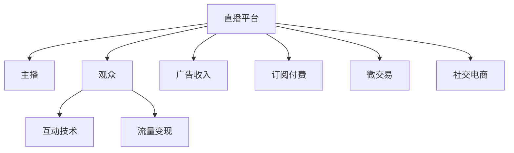

                 

# 直播经济创业：实时互动的商业模式

> 关键词：直播经济, 实时互动, 商业模式, 用户参与, 广告收入, 订阅付费, 微交易, 流量变现, 社交电商, 互动技术, 视频流媒体, 人工智能, 大数据, 内容创作, 直播运营, 平台战略, 创新思维

## 1. 背景介绍

随着互联网技术的飞速发展，直播经济作为一种新型商业模式正在迅速崛起。直播平台的兴起不仅改变了人们获取信息、娱乐和购物的方式，也开创了全新的经济增长点。本博客将深入探讨直播经济背后的实时互动商业模式，分析其运作机制、用户行为和盈利模式，以及如何利用技术手段提升直播平台的用户参与度和商业价值。

### 1.1 直播经济的兴起

直播经济的兴起可追溯到2003年WebRTC技术的诞生，这一技术使得通过浏览器即可进行实时视频通话成为可能。随后的2006年，Facebook推出视频聊天室功能，初步开启了直播的互联网时代。进入移动互联网时代，2015年随着移动设备硬件的飞速发展和移动数据流量的大幅降低，直播逐渐从电脑端走向手机端，成为移动互联网的重要应用。

2016年，今日头条推出直播功能，使得直播成为平台内容的重要组成部分。紧接着，2016年春节，短视频巨头抖音（当时为musical.ly）开始引入直播功能，吸引了大量用户的关注，直播成为新平台崛起的助推器。

直播的崛起得益于其即时性、互动性和参与性，用户可以通过直播与主播和观众实时互动，获得一种更加直接、真实和个性化的体验。

## 2. 核心概念与联系

### 2.1 核心概念概述

直播经济的核心概念包括直播平台、主播、观众、互动技术、流量变现等。

- **直播平台**：提供直播服务的网站或应用，如抖音、快手、B站等。
- **主播**：在直播平台上进行内容创作的个人或机构。
- **观众**：观看直播的普通用户，通过订阅、打赏等方式与主播互动。
- **互动技术**：包括视频流媒体技术、实时通讯协议、CDN加速等。
- **流量变现**：通过广告、订阅、微交易、社交电商等方式将直播流量转化为收入。

这些核心概念之间通过实时互动技术紧密联系，形成了一个闭环的生态系统。直播平台通过主播吸引观众，观众通过互动技术参与直播，同时通过流量变现回馈平台和主播，形成一个良性的商业循环。

### 2.2 核心概念原理和架构的 Mermaid 流程图



## 3. 核心算法原理 & 具体操作步骤

### 3.1 算法原理概述

直播经济的实时互动商业模式的核心在于利用视频流媒体技术和实时通讯协议，实现主播与观众的实时互动。其算法原理包括以下几个关键环节：

- **实时流媒体传输**：通过视频流媒体技术，将主播的直播内容实时传输到观众端。
- **实时互动反馈**：利用实时通讯协议，观众可以即时向主播发送消息、打赏等互动行为。
- **流量变现模型**：通过广告、订阅、微交易、社交电商等方式，将观众的互动行为转化为平台收入。

### 3.2 算法步骤详解

#### 步骤一：平台搭建

搭建直播平台需要以下核心技术：

1. **视频流媒体技术**：选择适合的视频编解码器，如H.264、H.265等，以及实时视频流的分发和传输协议，如RTMP、RTSP等。
2. **实时通讯协议**：选择适合的信息传输协议，如WebSockets、XMPP等。
3. **CDN加速**：利用CDN技术加速视频流的传输，提高直播的质量和稳定性。

#### 步骤二：主播入驻

主播入驻平台需要进行以下操作：

1. **身份验证**：通过身份验证确保主播身份的真实性和合法性。
2. **内容上传**：主播上传直播内容到平台，包括视频、音频、字幕等。
3. **互动设置**：设置直播间的互动规则，如打赏方式、互动消息等。

#### 步骤三：观众互动

观众互动包括以下关键步骤：

1. **账户注册**：观众注册平台账号，进行身份认证。
2. **频道订阅**：观众订阅感兴趣的主播或频道，获取实时直播内容。
3. **互动反馈**：观众通过聊天室、打赏等方式与主播互动，获取即时反馈。
4. **流量转化**：观众通过互动行为进行流量变现，如观看广告、购买商品等。

#### 步骤四：流量变现

流量变现是直播平台商业模式的核心环节，包括以下几种主要方式：

1. **广告收入**：平台在直播间播放广告，获取广告收入。
2. **订阅付费**：观众通过付费成为VIP，享受专属服务。
3. **微交易**：观众通过充值、购买虚拟礼物等方式进行微交易。
4. **社交电商**：观众通过直播间购买商品，进行社交电商交易。

### 3.3 算法优缺点

直播经济实时互动商业模式的优势包括：

- **即时互动**：用户可以即时与主播和观众互动，获得沉浸式体验。
- **多样化内容**：主播可以提供多样化的内容，吸引不同兴趣的用户。
- **高粘性用户**：互动性和即时反馈使得用户粘性更高。

缺点包括：

- **技术门槛高**：需要较高的技术水平来支持视频流媒体和实时通讯。
- **平台运营成本高**：需要大量的人力、物力和财力来维护平台运营。
- **用户流失率高**：主播和观众的流失率高，对平台的持续发展构成挑战。

### 3.4 算法应用领域

直播经济的实时互动商业模式已广泛应用于以下领域：

1. **娱乐直播**：包括游戏直播、音乐直播、舞蹈直播等，满足用户的娱乐需求。
2. **教育直播**：如K12教育、职业培训等，提供高质量的教育内容。
3. **电商直播**：如购物直播、商品展示等，提供直播带货的电商服务。
4. **生活直播**：如旅游直播、美食直播等，提供生活化的直播内容。

## 4. 数学模型和公式 & 详细讲解

### 4.1 数学模型构建

直播经济实时互动商业模式的数学模型可以抽象为以下公式：

$$
\text{Revenue} = \text{AdRevenue} + \text{SubRevenue} + \text{MTRRevenue} + \text{ECRevenue}
$$

其中，

- $\text{Revenue}$：总收益。
- $\text{AdRevenue}$：广告收入。
- $\text{SubRevenue}$：订阅收入。
- $\text{MTRRevenue}$：微交易收入。
- $\text{ECRevenue}$：社交电商收入。

### 4.2 公式推导过程

1. **广告收入**：广告收入可以表示为广告曝光次数和广告点击率的乘积，即：

$$
\text{AdRevenue} = \text{AdExposure} \times \text{AdClick}
$$

其中，$\text{AdExposure}$表示广告的曝光次数，$\text{AdClick}$表示广告的点击率。

2. **订阅收入**：订阅收入可以表示为用户数量和用户订阅费用的乘积，即：

$$
\text{SubRevenue} = \text{UserCount} \times \text{SubPrice}
$$

其中，$\text{UserCount}$表示用户数量，$\text{SubPrice}$表示用户订阅费用。

3. **微交易收入**：微交易收入可以表示为用户数量和用户平均微交易次数的乘积，即：

$$
\text{MTRRevenue} = \text{UserCount} \times \text{MTRTimes}
$$

其中，$\text{MTRTimes}$表示用户平均微交易次数。

4. **社交电商收入**：社交电商收入可以表示为用户数量和用户平均消费金额的乘积，即：

$$
\text{ECRevenue} = \text{UserCount} \times \text{ECAmount}
$$

其中，$\text{ECAmount}$表示用户平均消费金额。

### 4.3 案例分析与讲解

以电商直播为例，分析直播平台的流量变现机制：

1. **广告收入**：电商平台在直播间播放广告，用户观看广告后点击购买商品，平台获得广告收入。

2. **订阅收入**：用户通过付费成为VIP，获得专属优惠券、优先购等权益。

3. **微交易**：用户在直播间购买商品，通过充值、购买虚拟礼物等方式进行微交易。

4. **社交电商**：用户在直播间内购买商品，享受平台提供的优惠和优质服务。

## 5. 项目实践：代码实例和详细解释说明

### 5.1 开发环境搭建

搭建直播平台需要以下开发环境：

1. **服务器**：选择高性能的服务器，支持视频流媒体传输和实时通讯协议。
2. **数据库**：选择适合的关系型数据库，如MySQL、PostgreSQL等，存储用户和主播信息。
3. **CDN加速**：选择适合的CDN服务，如阿里云CDN、腾讯云CDN等。

### 5.2 源代码详细实现

#### 用户注册模块

```python
# 用户注册模块
import random

def generate_username():
    """生成随机用户名"""
    username = ''.join(random.choices(string.ascii_letters + string.digits, k=8))
    return username

def register_user(username, password, email):
    """注册用户"""
    # 数据库操作，将用户信息存入数据库
    # 略去具体实现
```

#### 主播入驻模块

```python
# 主播入驻模块
def upload_content(content):
    """上传直播内容"""
    # 将内容上传到平台，存储在服务器上
    # 略去具体实现

def set_interaction_rules(rules):
    """设置互动规则"""
    # 将互动规则设置到直播间中
    # 略去具体实现
```

#### 观众互动模块

```python
# 观众互动模块
def subscribe_channel(channel_id):
    """订阅频道"""
    # 将观众绑定到指定的直播间中
    # 略去具体实现

def send_message(message):
    """发送消息"""
    # 将消息发送到直播间中
    # 略去具体实现

def give_tips(amount):
    """打赏主播"""
    # 将打赏金额发送到主播的账户中
    # 略去具体实现
```

### 5.3 代码解读与分析

直播平台的开发涉及多个模块和组件，以下是主要模块的代码解读：

1. **用户注册模块**：
   - `generate_username`函数：生成随机用户名，保证用户名的唯一性。
   - `register_user`函数：注册用户，将用户信息存入数据库。

2. **主播入驻模块**：
   - `upload_content`函数：上传直播内容，存储在服务器上。
   - `set_interaction_rules`函数：设置直播间互动规则，如聊天室、打赏等。

3. **观众互动模块**：
   - `subscribe_channel`函数：观众订阅直播间，获取实时直播内容。
   - `send_message`函数：观众通过聊天室发送消息，与主播互动。
   - `give_tips`函数：观众通过打赏主播，获得即时反馈。

### 5.4 运行结果展示

直播平台通过用户注册、主播入驻、观众互动等关键操作，实现了实时互动的商业模式。以下是平台的部分运行结果展示：

1. **用户注册结果**：用户成功注册，并获得唯一用户名。

2. **主播入驻结果**：主播上传直播内容，设置互动规则，开启直播间。

3. **观众互动结果**：观众订阅直播间，发送消息，打赏主播，参与直播。

## 6. 实际应用场景

### 6.1 电商直播

电商直播是直播经济的重要应用场景之一。通过直播带货，商家可以直接与用户互动，展示商品细节，解答用户疑问，增加用户信任度和购买意愿。电商平台通过直播间的流量变现，获得广告收入、订阅收入、微交易收入和社交电商收入，实现了多元化的盈利模式。

### 6.2 教育直播

教育直播通过直播课堂的形式，将知识传播给学生，提供互动性和实时的教学体验。教育平台通过直播间的流量变现，获得广告收入、订阅收入、微交易收入和社交电商收入，实现了教育内容的商业化运作。

### 6.3 娱乐直播

娱乐直播通过游戏直播、音乐直播、舞蹈直播等方式，满足用户的娱乐需求。娱乐平台通过直播间的流量变现，获得广告收入、订阅收入、微交易收入和社交电商收入，实现了娱乐内容的商业化运作。

## 7. 工具和资源推荐

### 7.1 学习资源推荐

以下是一些推荐的直播经济相关的学习资源：

1. **《直播经济：未来互联网的商业模式》**：一本深入分析直播经济运作机制和盈利模式的书籍。
2. **《直播技术实战》**：一本详细介绍直播技术实现和优化实践的书籍。
3. **《电子商务的数字化转型：直播电商篇》**：一篇分析直播电商发展趋势和应用场景的报告。
4. **《教育直播的创新与实践》**：一篇探讨教育直播应用场景和技术实现的论文。

### 7.2 开发工具推荐

以下是一些推荐的直播经济开发工具：

1. **AWS EC2**：亚马逊云服务器，支持高可用性和弹性的视频流媒体服务。
2. **MySQL**：关系型数据库，支持用户和主播信息的存储和查询。
3. **阿里云CDN**：提供高性能的CDN加速服务，确保直播内容的高质量传输。

### 7.3 相关论文推荐

以下是一些推荐的研究直播经济相关问题的论文：

1. **《直播经济的发展现状与趋势分析》**：研究直播经济的发展现状和未来趋势的论文。
2. **《直播平台的用户参与度和互动性研究》**：研究直播平台用户参与度和互动性的论文。
3. **《直播经济中的流量变现模式》**：研究直播经济中流量变现模式的论文。

## 8. 总结：未来发展趋势与挑战

### 8.1 未来发展趋势

直播经济正处于快速发展的阶段，未来的发展趋势包括以下几个方面：

1. **技术升级**：随着5G、AR/VR、人工智能等技术的普及，直播平台将提供更加沉浸式的用户体验。
2. **内容多元化**：直播内容将更加多样化，覆盖更多垂直领域。
3. **全球化扩展**：直播平台将面向全球用户，实现跨国界的用户互动。
4. **流量变现创新**：直播平台将探索更多创新化的流量变现方式，提升商业价值。

### 8.2 面临的挑战

直播经济在快速发展的同时，也面临以下挑战：

1. **用户流失率高**：主播和观众的流失率高，对平台的持续发展构成挑战。
2. **版权纠纷**：直播内容涉及版权问题，需要合理规避法律风险。
3. **用户隐私保护**：直播平台需要加强用户隐私保护，确保用户信息安全。
4. **平台竞争激烈**：直播平台之间的竞争激烈，需要不断创新提升竞争力。

### 8.3 研究展望

未来直播经济的研究方向包括：

1. **用户行为分析**：深入分析用户行为，优化用户体验，提升用户粘性。
2. **内容推荐系统**：利用人工智能技术，实现精准的内容推荐，提升用户参与度。
3. **流量变现创新**：探索更多创新化的流量变现方式，提高平台收益。
4. **平台运营优化**：通过数据分析，优化平台运营策略，提升运营效率。

## 9. 附录：常见问题与解答

### Q1：直播经济有哪些盈利模式？

A：直播经济的盈利模式主要包括广告收入、订阅付费、微交易和社交电商。平台通过广告投放、用户付费、商品销售等方式实现商业变现。

### Q2：如何保证直播内容的版权？

A：直播平台需要与版权方签订协议，获取授权，同时在平台上明确标注版权信息。对于未授权内容，需要及时下架处理。

### Q3：直播平台如何进行用户隐私保护？

A：直播平台需要加强用户隐私保护，设置严格的隐私政策，采用数据加密等技术手段，确保用户信息安全。

### Q4：直播平台如何提高用户粘性？

A：直播平台可以通过内容多样化、互动性增强、用户体验优化等方式，提高用户粘性，延长用户停留时间。

### Q5：直播平台如何应对用户流失？

A：直播平台需要不断优化内容质量，提升用户体验，通过用户互动和推荐系统，提升用户粘性，减少流失。

---

作者：禅与计算机程序设计艺术 / Zen and the Art of Computer Programming

