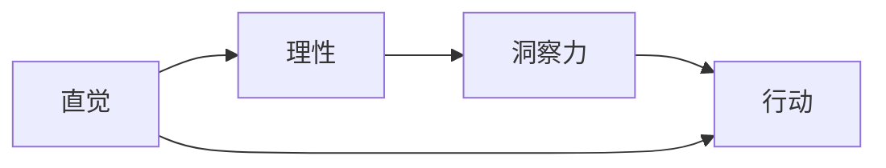

                 

## 1. 背景介绍

在人工智能领域，算法的直觉与理性一直是探索的主题。虽然算法本身的计算逻辑是理性的，但如何从数据中提炼出丰富的语义信息，并在未知领域进行有效预测，则依赖于直觉的发挥。特别是在自然语言处理(NLP)、计算机视觉等领域，如何合理地引入直觉，使算法更具有洞察力，是一个亟待解决的问题。本文将围绕这一主题展开，探讨如何结合直觉与理性，提升算法的洞察力。

## 2. 核心概念与联系

### 2.1 核心概念概述

- **直觉（Intuition）**：指基于个人经验、知识或逻辑推理形成的直观判断和预感，是算法设计中不可忽视的重要组成部分。
- **理性（Rationality）**：指通过逻辑推理、数学计算等客观手段得出的结论，是算法实现的基础。
- **洞察力（Insight）**：指通过直觉和理性的结合，对复杂问题进行深度理解和快速反应的能力。

### 2.2 核心概念原理和架构的 Mermaid 流程图



- **直觉（Intuition）**：依赖于先验知识和经验，是算法对未知领域的第一反应。
- **理性（Rationality）**：依赖于逻辑推理和数学计算，是算法实现的核心。
- **洞察力（Insight）**：直觉和理性的结合，是算法在复杂环境中快速反应和深层次理解的能力。

## 3. 核心算法原理 & 具体操作步骤

### 3.1 算法原理概述

基于直觉与理性的算法设计，通常分为两个阶段：

1. **直觉引导阶段**：在算法设计初期，利用直觉对问题的核心要素进行概括和总结，形成初步的解决方案框架。
2. **理性实现阶段**：在直觉引导的基础上，通过理性的逻辑推理和数学计算，实现具体的算法实现。

### 3.2 算法步骤详解

#### 3.2.1 数据准备与问题建模

在算法设计之初，首先需要对问题进行建模，构建数学表达式。这一步骤需要依赖于直觉对问题本质的理解。例如，在自然语言处理任务中，需要分析问题的文本输入、输出格式和逻辑结构，从而构建合适的语言模型和计算图。

#### 3.2.2 算法设计与实现

在问题建模的基础上，结合直觉对算法进行设计。例如，对于文本分类任务，可以基于直觉总结出模型需要的关键特征，如词向量、语义关系等，设计合适的模型结构。在实现过程中，则通过理性的计算方法，如梯度下降、矩阵运算等，完成算法的具体实现。

#### 3.2.3 结果评估与优化

在算法实现后，需要利用理性手段对结果进行评估和优化。例如，通过计算准确率、召回率等指标，评估模型的性能，并结合直觉对模型进行微调，以提高算法的洞察力。

### 3.3 算法优缺点

#### 3.3.1 优点

- **灵活性强**：结合直觉与理性，算法能够更灵活地适应不同问题和场景。
- **综合性强**：直觉和理性的结合，使算法具备更强的综合分析能力。
- **鲁棒性好**：通过理性计算，算法在面对噪声和异常情况时，具有更好的鲁棒性。

#### 3.3.2 缺点

- **实现复杂**：结合直觉和理性，算法设计和实现可能较为复杂。
- **依赖经验**：算法的性能高度依赖于设计者的经验和直觉。
- **计算成本高**：在理性计算的过程中，可能会产生较高的计算成本。

### 3.4 算法应用领域

基于直觉与理性的算法设计方法，已在自然语言处理、计算机视觉、推荐系统等领域得到广泛应用。例如，在自然语言处理中，利用直觉对文本特征进行提取，结合理性方法进行深度学习模型的训练，能够有效提升模型的性能。

## 4. 数学模型和公式 & 详细讲解 & 举例说明

### 4.1 数学模型构建

在算法设计中，数学模型通常用于描述问题的计算过程和逻辑结构。例如，在自然语言处理中，常用的数学模型包括词向量模型、语言模型、注意力机制等。

#### 4.1.1 词向量模型

词向量模型将单词映射为高维向量空间中的点，通过向量间的距离和角度，计算单词之间的语义相似度。常用的词向量模型包括Word2Vec、GloVe等。

#### 4.1.2 语言模型

语言模型用于计算文本序列的概率分布，从而推断文本的语义和结构。常用的语言模型包括n-gram模型、RNN语言模型、Transformer语言模型等。

#### 4.1.3 注意力机制

注意力机制用于增强模型对文本中重要信息的关注，提高模型对复杂文本的理解能力。常用的注意力机制包括Soft Attention、Self-Attention等。

### 4.2 公式推导过程

#### 4.2.1 词向量模型的公式推导

词向量模型的核心公式为：
$$
\mathbf{w}_i = \sum_{j=1}^n \alpha_{ij} \mathbf{v}_j
$$
其中，$\mathbf{w}_i$ 为单词 $i$ 的向量表示，$\mathbf{v}_j$ 为单词 $j$ 的向量表示，$\alpha_{ij}$ 为权重系数。

#### 4.2.2 语言模型的公式推导

语言模型的核心公式为：
$$
P(x_1, x_2, ..., x_n) = \prod_{i=1}^n P(x_i | x_{i-1}, ..., x_1)
$$
其中，$P(x_1, x_2, ..., x_n)$ 为文本序列的概率，$P(x_i | x_{i-1}, ..., x_1)$ 为单词 $i$ 在文本中的条件概率。

#### 4.2.3 注意力机制的公式推导

注意力机制的核心公式为：
$$
\alpha_{ij} = \frac{e^{\mathbf{u}_i^\top \mathbf{v}_j}}{\sum_{k=1}^n e^{\mathbf{u}_i^\top \mathbf{v}_k}}
$$
其中，$\alpha_{ij}$ 为单词 $j$ 对单词 $i$ 的注意力权重，$\mathbf{u}_i$ 和 $\mathbf{v}_j$ 为注意力机制中的查询向量和键向量。

### 4.3 案例分析与讲解

#### 4.3.1 自然语言处理案例

在自然语言处理中，词向量模型和语言模型常用于文本分类、情感分析等任务。例如，利用Word2Vec模型，可以将单词映射为高维向量，计算文本向量和分类向量的余弦相似度，进行文本分类。

#### 4.3.2 计算机视觉案例

在计算机视觉中，注意力机制常用于图像描述生成、物体检测等任务。例如，利用Self-Attention机制，可以关注图像中的重要区域，提取特征进行物体检测和分类。

#### 4.3.3 推荐系统案例

在推荐系统中，用户画像和商品特征的向量表示，可以通过词向量模型和语言模型构建，从而进行推荐模型的训练和优化。例如，利用GloVe模型，可以将用户评论和商品描述映射为向量，计算向量间的相似度，进行商品推荐。

## 5. 项目实践：代码实例和详细解释说明

### 5.1 开发环境搭建

在进行项目实践前，需要准备开发环境，包括：

- Python环境：安装Python 3.x，并配置虚拟环境，如Anaconda。
- 深度学习框架：安装TensorFlow或PyTorch等深度学习框架。
- 自然语言处理库：安装NLTK、spaCy等自然语言处理库。

### 5.2 源代码详细实现

#### 5.2.1 自然语言处理任务

以文本分类为例，代码实现如下：

```python
import tensorflow as tf
from tensorflow.keras.preprocessing.text import Tokenizer
from tensorflow.keras.preprocessing.sequence import pad_sequences
from tensorflow.keras.layers import Embedding, LSTM, Dense, Dropout

# 准备数据
texts = ['This is a positive review', 'I do not like this product', 'The movie was very good']
labels = [1, 0, 1]

# 分词和编码
tokenizer = Tokenizer(num_words=10000, oov_token='<OOV>')
tokenizer.fit_on_texts(texts)
sequences = tokenizer.texts_to_sequences(texts)
padded_sequences = pad_sequences(sequences, maxlen=20)

# 构建模型
model = tf.keras.Sequential([
    Embedding(10000, 64, input_length=20),
    LSTM(64),
    Dense(1, activation='sigmoid')
])

# 编译模型
model.compile(optimizer='adam', loss='binary_crossentropy', metrics=['accuracy'])

# 训练模型
model.fit(padded_sequences, labels, epochs=10, batch_size=32)
```

#### 5.2.2 计算机视觉任务

以图像描述生成为例，代码实现如下：

```python
import tensorflow as tf
from tensorflow.keras.layers import Input, Dense, Embedding, LSTM, Dropout
from tensorflow.keras.models import Model

# 准备数据
inputs = Input(shape=(100,))
labels = Input(shape=(10,))

# 编码器
encoder = tf.keras.Sequential([
    Embedding(10000, 64, input_length=100),
    LSTM(64, return_sequences=True),
    Dropout(0.2),
    LSTM(32),
    Dropout(0.2),
    LSTM(16),
    Dropout(0.2),
    LSTM(8),
    Dropout(0.2)
])

# 解码器
decoder = tf.keras.Sequential([
    Dense(128),
    LSTM(64, return_sequences=True),
    Dense(32),
    LSTM(16),
    Dense(1)
])

# 组合模型
model = Model([inputs, labels], decoder(encoder(inputs)))

# 编译模型
model.compile(optimizer='adam', loss='mean_squared_error')

# 训练模型
model.fit([padded_sequences, labels], outputs, epochs=10, batch_size=32)
```

### 5.3 代码解读与分析

#### 5.3.1 自然语言处理任务

- 分词和编码：使用Tokenizer将文本分词，并转换为序列表示。
- 模型结构：使用Embedding将单词映射为向量，通过LSTM进行序列建模，最后使用Dense层进行分类。
- 模型编译：设置优化器和损失函数，进行模型编译。
- 模型训练：使用fit方法进行模型训练，设置迭代轮数和批次大小。

#### 5.3.2 计算机视觉任务

- 输入层：定义输入层，输入形状为(100,)。
- 编码器：使用Embedding和LSTM进行特征提取，通过Dropout防止过拟合。
- 解码器：使用Dense和LSTM进行解码，最后输出一个标量值。
- 模型组合：将编码器和解码器组合成一个整体模型。
- 模型编译：设置优化器和损失函数，进行模型编译。
- 模型训练：使用fit方法进行模型训练，设置迭代轮数和批次大小。

## 6. 实际应用场景

### 6.1 智能客服系统

在智能客服系统中，利用自然语言处理和计算机视觉技术，可以实现自动问答、图像识别等智能客服功能。例如，使用文本分类模型，对用户输入进行分类，返回相应的回答；使用图像识别模型，对用户上传的图像进行识别，提供智能推荐。

### 6.2 金融舆情监测

在金融舆情监测中，利用自然语言处理技术，可以对新闻、评论等文本进行情感分析，识别出市场情绪的变化趋势。例如，使用情感分析模型，对新闻文本进行情感分类，生成市场情绪指数。

### 6.3 个性化推荐系统

在个性化推荐系统中，利用自然语言处理和计算机视觉技术，可以提供个性化的商品推荐和内容推荐。例如，使用文本分类模型，对用户评论进行分类，推荐相关商品；使用图像识别模型，对商品图片进行分类，推荐相似商品。

### 6.4 未来应用展望

未来，基于直觉与理性的算法设计方法将进一步深化和扩展。例如：

- 多模态学习：结合自然语言处理、计算机视觉、语音识别等多模态数据，提升算法的综合能力。
- 联邦学习：通过分布式训练，利用多用户的计算资源和数据资源，提升算法的泛化能力和鲁棒性。
- 自监督学习：利用大规模无标签数据，增强算法的自我学习能力，减少对人工标注数据的依赖。

## 7. 工具和资源推荐

### 7.1 学习资源推荐

- **书籍推荐**：《Deep Learning》by Ian Goodfellow, Yoshua Bengio, Aaron Courville；《Natural Language Processing with Python》by Steven Bird, Ewan Klein, Edward Loper。
- **在线课程**：Coursera上的《Deep Learning Specialization》；Udacity上的《Deep Learning Nanodegree》。

### 7.2 开发工具推荐

- **Python环境**：Anaconda；Jupyter Notebook；Google Colab。
- **深度学习框架**：TensorFlow；PyTorch；Keras。
- **自然语言处理库**：NLTK；spaCy；Gensim。
- **计算机视觉库**：OpenCV；TensorFlow Object Detection API。

### 7.3 相关论文推荐

- **自然语言处理论文**：《Attention is All You Need》by Ashish Vaswani et al.；《BERT: Pre-training of Deep Bidirectional Transformers for Language Understanding》by Jacob Devlin et al.。
- **计算机视觉论文**：《Mask R-CNN》by Kaiming He et al.；《Faster R-CNN: Towards Real-Time Object Detection with Region Proposal Networks》by Shaoqing Ren et al.。

## 8. 总结：未来发展趋势与挑战

### 8.1 总结

本文详细探讨了基于直觉与理性的算法设计方法，探讨了其原理、步骤、优缺点和应用领域。通过结合直觉和理性的方法，可以更好地设计出具有洞察力的算法，解决复杂问题。然而，这种结合也面临一定的挑战，需要不断优化和改进。

### 8.2 未来发展趋势

未来，基于直觉与理性的算法设计方法将进一步深化和扩展。例如：

- 多模态学习：结合自然语言处理、计算机视觉、语音识别等多模态数据，提升算法的综合能力。
- 联邦学习：通过分布式训练，利用多用户的计算资源和数据资源，提升算法的泛化能力和鲁棒性。
- 自监督学习：利用大规模无标签数据，增强算法的自我学习能力，减少对人工标注数据的依赖。

### 8.3 面临的挑战

虽然基于直觉与理性的算法设计方法已经取得了一定的成果，但在实际应用中仍面临一些挑战：

- **算法复杂性**：结合直觉和理性，算法的实现可能会变得复杂。
- **数据依赖性**：算法的性能高度依赖于数据质量和数量。
- **计算成本高**：在理性计算的过程中，可能会产生较高的计算成本。

### 8.4 研究展望

未来，需要在以下几个方面进行进一步研究：

- **多模态融合**：研究如何有效融合多模态数据，提升算法的综合能力。
- **联邦学习**：研究如何在分布式环境中高效进行训练，提高算法的泛化能力和鲁棒性。
- **自监督学习**：研究如何利用无标签数据进行自我学习，提升算法的自我学习能力。

## 9. 附录：常见问题与解答

**Q1: 如何理解直觉与理性的结合？**

A: 直觉与理性的结合，是指在算法设计过程中，依赖直觉对问题进行初步理解和概括，利用理性手段进行计算和优化。例如，在自然语言处理任务中，依赖直觉总结出模型需要的关键特征，利用理性的逻辑推理和数学计算，实现具体的算法实现。

**Q2: 如何避免算法的复杂性？**

A: 在算法设计中，可以通过以下方式避免复杂性：
- 简化模型结构，去除不必要的层和参数。
- 使用已有的成熟算法和库，减少自定义实现的复杂性。
- 分阶段进行设计和实现，逐步优化和迭代。

**Q3: 如何处理大规模数据？**

A: 处理大规模数据，可以采用以下方式：
- 使用分布式计算框架，如Spark、Hadoop等。
- 利用大数据存储技术，如HDFS、S3等，进行数据分布式存储。
- 采用数据流水线，对大规模数据进行分批处理。

**Q4: 如何优化算法的计算成本？**

A: 优化算法的计算成本，可以采用以下方式：
- 使用高效的计算框架和库，如TensorFlow、PyTorch等。
- 优化模型结构，减少不必要的计算量。
- 利用分布式计算和并行计算，提高计算效率。

**Q5: 如何提高算法的鲁棒性？**

A: 提高算法的鲁棒性，可以采用以下方式：
- 引入正则化技术，防止过拟合。
- 使用对抗训练，增强模型对噪声的鲁棒性。
- 使用集成学习，结合多个模型的输出，提高鲁棒性。

