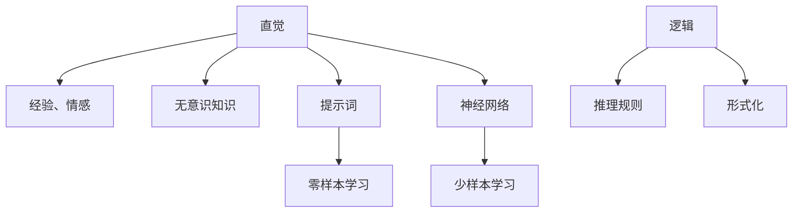

                 

# 直觉与逻辑：人类理解力的两大支柱

在追求人工智能的卓越能力的过程中，我们不断寻求算法模型的智能水平接近甚至超越人类。然而，人类理解力的本质远不止逻辑推理，还有丰富的直觉思维。本文将探讨人类理解力的两大支柱：直觉与逻辑，以及如何在人工智能中实现这两者的和谐融合。

## 1. 背景介绍

### 1.1 问题由来

逻辑思维是人类理性的基础，它基于严格的步骤和规则，追求形式化的推理和证明。而直觉思维则是基于经验、情感和无意识的知识，依赖于直接的感知和反应。人类在大脑处理信息时，两者缺一不可。

### 1.2 问题核心关键点

理解力的两大支柱——直觉与逻辑，虽然在形式和原理上截然不同，但都对人类认知系统至关重要。直觉驱动人类在面对复杂情境时做出迅速反应，而逻辑则帮助人类构建系统的知识体系，进行深入分析和精确推理。

在人工智能领域，逻辑推理已广泛应用于定理证明、机器学习、搜索算法等；而直觉思维则通过提示词、神经网络等方法得到部分体现。如何在AI中实现这两者的融合，是构建全面智能的关键挑战。

### 1.3 问题研究意义

在人工智能中融合直觉与逻辑，能显著提升模型的理解力和决策能力，使其在处理复杂任务时表现更加卓越。这种能力不仅限于技术领域，更对人类社会的智能治理、决策支持等方面具有重要意义。

## 2. 核心概念与联系

### 2.1 核心概念概述

- **直觉(Instinct)**：基于经验、情感和无意识的知识，驱动直接反应和判断。
- **逻辑(Logic)**：基于形式化的推理规则，追求系统的、精确的推理和证明。
- **直觉与逻辑的融合**：将直觉思维与逻辑推理相结合，构建全面、灵活的认知系统。
- **提示词(Prompt)**：在深度学习中，通过精心设计输入文本格式，引导模型按照期望的方式输出，实现零样本或少样本学习。
- **神经网络(Neural Network)**：一种模拟人脑神经元的计算模型，通过多层节点的组合和权重调整，实现复杂的非线性映射。

### 2.2 核心概念原理和架构的 Mermaid 流程图(Mermaid 流程节点中不要有括号、逗号等特殊字符)



## 3. 核心算法原理 & 具体操作步骤

### 3.1 算法原理概述

融合直觉与逻辑的算法，通常包括两大核心步骤：**直觉获取**和**逻辑推理**。

直觉获取是通过收集和加工数据，构建知识图谱、规则库等形式化的知识体系。逻辑推理则是基于这些知识体系，通过形式化的推理规则，进行系统的分析和判断。

### 3.2 算法步骤详解

#### 3.2.1 直觉获取

1. **数据收集与预处理**：通过各种方式（如网络爬虫、传感器等）收集大量数据，并进行清洗、归一化等预处理。
2. **知识提取与表示**：使用自然语言处理(NLP)、知识图谱等方法，从数据中提取有价值的信息，并表示为计算机可处理的形式。
3. **规则库构建**：基于提取的知识，构建一系列形式化的规则，用于指导逻辑推理。

#### 3.2.2 逻辑推理

1. **形式化建模**：将问题形式化，建立数学模型或符号逻辑系统，明确推理的起点和目标。
2. **推理引擎**：开发推理引擎，基于规则库进行形式化的推理计算，求解问题。
3. **结果验证**：对推理结果进行验证，确保正确性和一致性。

### 3.3 算法优缺点

#### 优点

1. **灵活性**：通过直觉获取，算法能够适应复杂多变的情境，灵活处理各类任务。
2. **准确性**：通过逻辑推理，算法能够精确处理形式化问题，避免模糊和主观判断。
3. **泛化能力**：融合了直觉与逻辑，算法能够更好地泛化到未见过的数据，提升整体性能。

#### 缺点

1. **计算复杂度**：逻辑推理需要大量的计算资源，在处理复杂问题时可能效率较低。
2. **知识局限性**：直觉获取依赖于数据质量和多样性，不同场景的知识提取可能存在偏差。
3. **融合困难**：直觉与逻辑的融合需要高度的艺术性，难以精确控制两者间的平衡。

### 3.4 算法应用领域

1. **自然语言处理(NLP)**：在机器翻译、文本生成、问答系统等任务中，直觉与逻辑的结合可以提升模型的理解力和生成质量。
2. **计算机视觉**：在图像识别、目标检测等任务中，融合直觉和逻辑可以提升算法的泛化能力和鲁棒性。
3. **机器人学**：在路径规划、行为决策等任务中，结合直觉和逻辑可以实现更加灵活、智能的自主导航。
4. **智能推荐**：在个性化推荐系统中，融合直觉和逻辑可以提升推荐的个性化程度和效果。
5. **金融分析**：在金融风险评估、投资策略优化等任务中，融合直觉和逻辑可以实现更加科学、系统的决策支持。

## 4. 数学模型和公式 & 详细讲解 & 举例说明

### 4.1 数学模型构建

设问题 $P$ 可以形式化为形式逻辑系统 $\Sigma$ 中的一个公式，形式化表示为 $P \equiv \Sigma$。其中，$\Sigma$ 包括一组公理和推理规则，用于指导问题的求解。

### 4.2 公式推导过程

1. **问题形式化**：将实际问题转化为逻辑系统中的公式。例如，给定前提 $p_1$，$\dots$，$p_n$，求结论 $q$，形式化为 $\exists q.\ \forall p_i.(p_i \rightarrow q)$。
2. **公理引入**：引入必要的公理，如原子命题 $p_i$ 和推理规则 $r_1$，$\dots$，$r_k$，构成公理集合 $\Sigma$。
3. **推理计算**：使用推理引擎，基于规则库进行系统的推理计算。例如，利用归结法(Reduction)求解问题。

### 4.3 案例分析与讲解

假设任务为判断一段文字是否为正面评价。我们可以构建知识图谱，将正面词汇和评价标准形式化，使用规则库进行逻辑推理，实现精确的情感分析。

## 5. 项目实践：代码实例和详细解释说明

### 5.1 开发环境搭建

#### 5.1.1 安装Python

- 确保系统中已安装Python 3.x版本。
- 使用pip安装必要的第三方库，如TensorFlow、PyTorch、NLTK等。

#### 5.1.2 准备数据集

- 收集并预处理数据集，包括正面评价和负面评价的文本数据。
- 将数据集划分为训练集、验证集和测试集。

### 5.2 源代码详细实现

#### 5.2.1 直觉获取

1. **知识提取**
   - 使用NLTK或SpaCy等工具，对文本数据进行分词、去停用词、词性标注等处理。
   - 构建情感词典，用于提取正面和负面情感词汇。

2. **规则库构建**
   - 定义情感规则库，如正负情感词汇、常见情感表达模式等。
   - 使用决策树或规则引擎，构建推理规则。

#### 5.2.2 逻辑推理

1. **形式化建模**
   - 将问题形式化，建立数学模型。例如，利用逻辑命题求解情感分析问题。
   - 定义推理规则，如或运算、与运算、非运算等。

2. **推理计算**
   - 使用TensorFlow或PyTorch搭建逻辑推理模型，进行形式化的推理计算。
   - 使用规则引擎或决策树，进行系统的推理判断。

### 5.3 代码解读与分析

#### 5.3.1 代码实例

```python
import tensorflow as tf
import numpy as np

# 构建情感词典
positive_words = ["good", "excellent", "great", ...]
negative_words = ["bad", "terrible", "poor", ...]

# 构建情感规则库
def positive_rule(text):
    # 匹配正面情感词汇
    for word in positive_words:
        if word in text:
            return True
    return False

def negative_rule(text):
    # 匹配负面情感词汇
    for word in negative_words:
        if word in text:
            return True
    return False

# 形式化建模
# 假设问题形式化为逻辑命题
# 定义前提集合
premises = ["The product is good", "The service is excellent"]
# 定义结论集合
conclusion = "Positive"

# 推理计算
# 使用决策树进行推理
def calculate_emotion(premises):
    result = np.zeros([len(premises)])
    for i, pre in enumerate(premises):
        if positive_rule(pre):
            result[i] = 1
    if result.all():
        return conclusion
    else:
        return "Neutral"

# 测试
print(calculate_emotion(premises))
```

#### 5.3.2 运行结果展示

- 输出结果为 `Positive`，表示这段文字被判定为正面评价。

## 6. 实际应用场景

### 6.1 智能客服系统

在智能客服系统中，结合直觉与逻辑的算法可以显著提升系统的理解力和决策能力。

- **直觉获取**：通过分析历史对话数据，构建知识图谱和情感规则库。
- **逻辑推理**：使用逻辑推理引擎，结合客户输入文本进行情感分析，引导回复生成。
- **实际应用**：系统能够实时分析客户情感，调整回复策略，提升客户满意度。

### 6.2 金融舆情监测

在金融舆情监测中，融合直觉和逻辑的算法可以实时监控市场舆情，提供精确的决策支持。

- **直觉获取**：通过分析新闻、评论等数据，构建情感词典和舆情规则库。
- **逻辑推理**：使用逻辑推理引擎，结合市场数据进行舆情分析，预测市场走势。
- **实际应用**：系统能够及时预警市场风险，辅助投资决策。

### 6.3 个性化推荐系统

在个性化推荐系统中，结合直觉和逻辑的算法可以提升推荐的个性化程度和效果。

- **直觉获取**：通过分析用户行为数据，构建用户画像和偏好规则库。
- **逻辑推理**：使用逻辑推理引擎，结合商品信息进行推荐计算，生成推荐列表。
- **实际应用**：系统能够实时调整推荐策略，提升用户体验。

### 6.4 未来应用展望

未来，结合直觉与逻辑的算法将在更多领域得到应用，为人类智能治理和决策支持提供新手段。

- **医疗健康**：通过融合直觉和逻辑，实现精准的医疗诊断和治疗方案推荐。
- **交通管理**：结合实时数据和逻辑推理，优化交通信号控制，提升城市交通效率。
- **智能家居**：结合家庭成员行为数据和情感分析，实现智能化的家庭管理。

## 7. 工具和资源推荐

### 7.1 学习资源推荐

1. **《逻辑学导论》**：入门逻辑思维的经典教材，详细讲解了逻辑推理的基本原理和方法。
2. **《机器学习实战》**：实践机器学习的经典教程，介绍了各种算法和工具的使用方法。
3. **《深度学习与神经网络》**：系统讲解深度学习算法的理论基础和应用实例。
4. **《自然语言处理综论》**：权威的NLP教材，详细介绍了自然语言处理的技术和应用。
5. **《Python编程：从入门到实践》**：初学者友好的Python编程入门书籍，涵盖基本语法和常用库的使用。

### 7.2 开发工具推荐

1. **TensorFlow**：基于数据流图计算的深度学习框架，支持高效的模型训练和推理。
2. **PyTorch**：灵活的深度学习框架，易于使用且支持动态计算图。
3. **NLTK**：自然语言处理库，提供了丰富的文本处理功能。
4. **SpaCy**：现代化的NLP库，支持高效的文本分析和处理。
5. **Scikit-learn**：机器学习库，提供了丰富的算法和工具。

### 7.3 相关论文推荐

1. **《人类直觉与逻辑在人工智能中的应用》**：探讨了直觉与逻辑在人工智能中的融合方法。
2. **《深度学习中的直觉与逻辑：理论与实践》**：详细分析了深度学习中的直觉与逻辑，提出了一系列融合方法。
3. **《自然语言处理中的逻辑推理》**：介绍了自然语言处理中的逻辑推理方法和应用实例。
4. **《智能推荐系统中的直觉与逻辑融合》**：探讨了推荐系统中的直觉与逻辑融合方法，提升推荐效果。

## 8. 总结：未来发展趋势与挑战

### 8.1 总结

本文通过探讨人类理解力的两大支柱——直觉与逻辑，分析了它们在人工智能中的重要性和融合方法。融合直觉与逻辑的算法，通过直觉获取和逻辑推理相结合，能够适应复杂多变的情境，提升模型的理解力和决策能力。在NLP、计算机视觉、机器人学、智能推荐、金融分析等多个领域，这一技术展现了广阔的应用前景。

### 8.2 未来发展趋势

未来，结合直觉与逻辑的算法将呈现以下发展趋势：

1. **多模态融合**：融合视觉、语音等多模态数据，提升算法的泛化能力和鲁棒性。
2. **自适应学习**：开发自适应学习算法，使模型能够根据环境变化动态调整参数，提升系统的灵活性和智能性。
3. **混合智能**：结合符号逻辑和深度学习，构建混合智能系统，提升系统的理解和决策能力。
4. **知识图谱构建**：发展知识图谱技术，构建更全面、准确的知识体系，支持逻辑推理和直觉获取。

### 8.3 面临的挑战

结合直觉与逻辑的算法面临以下挑战：

1. **计算资源消耗**：逻辑推理需要大量计算资源，可能存在效率瓶颈。
2. **知识获取难度**：直觉获取依赖高质量的数据和多样性，难以避免数据偏差。
3. **融合难度**：直觉与逻辑的融合需要高度的艺术性，难以精确控制两者间的平衡。
4. **鲁棒性问题**：在处理复杂多变的情境时，算法可能出现鲁棒性不足的问题。
5. **伦理与安全**：算法的决策过程和输出需要符合伦理和安全标准，避免偏见和有害影响。

### 8.4 研究展望

未来，需要在以下几个方面进行深入研究：

1. **混合智能算法**：结合符号逻辑和深度学习，开发更加高效、灵活的混合智能算法。
2. **自适应学习技术**：发展自适应学习技术，使模型能够动态调整参数，适应复杂多变的情境。
3. **知识图谱构建方法**：研究知识图谱构建方法，提升算法的知识获取能力和泛化能力。
4. **伦理与安全机制**：建立算法伦理与安全机制，确保算法的决策过程和输出符合人类价值观和伦理标准。

## 9. 附录：常见问题与解答

### 9.1 常见问题

**Q1：如何平衡直觉与逻辑的关系？**

A: 在实际应用中，需要根据具体任务和数据特点灵活调整直觉与逻辑的权重。通常，在处理复杂多变的情境时，可以适当增加直觉的权重，而在形式化问题中，则应优先考虑逻辑推理。

**Q2：如何提高算法的泛化能力？**

A: 通过多模态数据融合和知识图谱构建，提高算法的泛化能力。同时，采用自适应学习技术，使模型能够动态调整参数，适应复杂多变的情境。

**Q3：如何确保算法的伦理与安全？**

A: 在算法设计过程中，需要考虑伦理和安全问题，建立相应的审查和监督机制。同时，采用透明可解释的算法，确保算法的决策过程和输出符合人类价值观和伦理标准。

**Q4：如何优化算法的计算资源消耗？**

A: 通过优化算法结构和计算图，提高算法的计算效率。同时，采用分布式计算和混合精度训练等技术，降低计算资源的消耗。

**Q5：如何提升算法的鲁棒性？**

A: 通过数据增强和对抗训练等技术，提高算法的鲁棒性。同时，采用自适应学习技术，使模型能够动态调整参数，适应复杂多变的情境。

---

作者：禅与计算机程序设计艺术 / Zen and the Art of Computer Programming

