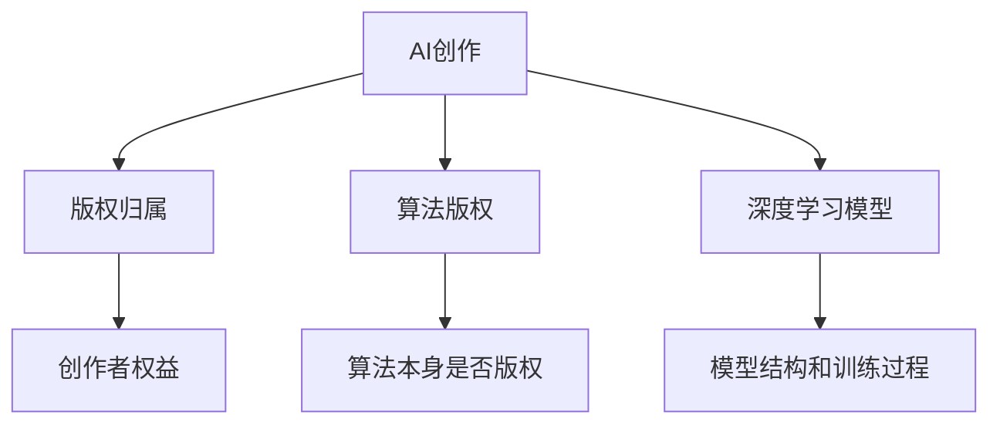

                 

# 知识产权与人工智能创作的归属

> 关键词：人工智能(AI)创作, 版权归属, 知识产权保护, 算法版权, 深度学习模型

## 1. 背景介绍

### 1.1 问题由来
随着人工智能（AI）技术的发展，尤其是深度学习模型的普及，越来越多的AI系统具备了创作能力，可以自动生成文本、音乐、绘画、代码等作品。这些作品由机器生成，不涉及人类的智力劳动，那么这些作品是否具有版权？如果是，这些版权应归谁所有？这些问题在法律和技术界引起了广泛的讨论和争议。

### 1.2 问题核心关键点
这一问题的核心在于AI作品的版权归属，涉及到以下几个关键点：

- 创作行为主体：AI系统是否具有独立创作的能力？
- 智力劳动要素：创作过程中是否存在人的智力劳动？
- 版权归属原则：创作成果应归属谁所有？
- 法律框架：现有知识产权法如何适应AI创作？
- 技术挑战：如何界定AI作品的原创性？

这些问题的答案将直接影响AI作品在法律和商业上的地位，关乎创作者的权益，以及AI技术应用的边界。

### 1.3 问题研究意义
厘清AI作品版权归属问题，具有重要的理论和实践意义：

- **法律保护**：明确AI创作的版权归属，有助于保护创作者权益，避免侵权纠纷。
- **商业模式**：清晰版权归属，有助于促进AI技术的商业应用和价值实现。
- **技术伦理**：合理界定AI创作，有助于构建更加公平、透明的技术伦理框架。
- **社会影响**：平衡创作者与技术发展之间的关系，维护社会公正和创新动力。

本文将深入探讨AI作品版权归属问题，帮助法律界、技术界和商业界理解和应对这一复杂的法律和技术挑战。

## 2. 核心概念与联系

### 2.1 核心概念概述

为更好地理解AI作品版权归属问题，本节将介绍几个密切相关的核心概念：

- **人工智能（AI）创作**：指AI系统通过深度学习模型等技术自动生成的作品。
- **版权（Copyright）**：指创作者对其作品享有的一系列专有权利，包括复制权、发行权、表演权、展示权等。
- **算法版权（Algorithm Copyright）**：指算法本身是否具有版权，以及算法中是否包含可版权化的元素。
- **深度学习模型（Deep Learning Model）**：指一类具有多层神经网络结构的机器学习模型，通过大量数据进行训练，能够进行模式识别、图像生成等复杂任务。

这些概念之间的逻辑关系可以通过以下Mermaid流程图来展示：



这个流程图展示了AI创作的版权归属问题涉及的核心概念及其之间的关系：

1. AI创作由深度学习模型生成。
2. 版权归属与创作者权益密切相关。
3. 算法版权涉及算法本身的版权归属。
4. 模型结构与训练过程共同决定了AI创作的性质。

## 3. 核心算法原理 & 具体操作步骤
### 3.1 算法原理概述

AI作品的版权归属问题，涉及到创作行为、智力劳动、算法版权等多个维度，其核心原理可以归纳为以下几点：

- **创作行为**：AI系统能否被视为创作的合法主体？
- **智力劳动**：AI创作过程中是否存在人类智力劳动的贡献？
- **算法版权**：算法本身是否具有版权，以及算法的哪些部分可以版权化？

### 3.2 算法步骤详解

以下是理解AI作品版权归属的几个关键步骤：

**Step 1: 理解AI创作机制**
- **AI创作模型**：如GPT-3、GAN等，这些模型通过学习大量数据，具备生成文本、图像等作品的能力。
- **创作过程**：模型通过前向传播和反向传播，生成作品。

**Step 2: 评估智力劳动贡献**
- **人类参与**：创作过程中是否有程序员、数据科学家等人的智力劳动参与？
- **策略选择**：如训练策略、数据集选择等，是否体现了人的智慧？

**Step 3: 分析算法版权**
- **算法独立性**：算法是否为人类独立开发，不依赖已有算法？
- **可版权化元素**：算法中是否包含可版权化的元素，如特定的算法设计、算法名称等？

**Step 4: 确定版权归属**
- **创作者身份**：AI作品是否由人-机合作完成，人类是否应被视为创作者？
- **法律适用**：现有版权法如何适用于AI创作的特殊情况？

### 3.3 算法优缺点

理解AI作品版权归属问题，有助于认识到该问题复杂性和多维度性。其优点和缺点如下：

**优点**：
- **推动创新**：明确AI作品版权归属，可以激励更多人参与AI创作。
- **保护创作者权益**：明确创作者身份，有助于保护其知识产权。
- **技术发展**：有助于引导AI技术健康发展，避免伦理和技术问题。

**缺点**：
- **法律空白**：现有版权法对AI创作定义模糊，缺乏明确指导。
- **技术复杂**：AI创作机制复杂，难以简单界定其版权归属。
- **伦理争议**：AI创作可能涉及伦理问题，如算法偏见、数据隐私等。

### 3.4 算法应用领域

AI作品的版权归属问题，不仅限于创作领域，还涉及多个应用领域，包括但不限于：

- **音乐生成**：AI创作的音乐作品是否具有版权？
- **绘画艺术**：AI生成的绘画作品是否应受版权保护？
- **文学创作**：AI生成的文学作品是否应受版权保护？
- **代码生成**：AI生成的代码是否具有版权？
- **新闻生成**：AI生成的新闻文章是否应受版权保护？

这些领域中的版权归属问题，直接关系到创作者、AI开发者和用户的权益。

## 4. 数学模型和公式 & 详细讲解 & 举例说明

### 4.1 数学模型构建

AI作品的版权归属问题，可以从多个角度构建数学模型进行分析和推理。以下是几个可能的数学模型构建：

- **知识图谱模型**：构建知识图谱，将AI创作过程抽象为知识图，进行推理和分析。
- **博弈论模型**：构建博弈论模型，分析创作者、AI开发者、用户之间的利益博弈关系。
- **深度学习模型**：构建深度学习模型，分析模型结构和训练过程，预测创作行为和版权归属。

### 4.2 公式推导过程

以**深度学习模型**为例，推导AI创作版权归属的数学模型。

假设有一深度学习模型$M$，用于生成文本作品。模型的输入为$x$，输出为$y$。版权归属的数学模型可以表示为：

$$
\text{归属} = f(M, x, y, \text{法律规则}, \text{创作者信息})
$$

其中$f$表示版权归属的推理函数，$M$表示深度学习模型，$x$表示输入，$y$表示输出，$\text{法律规则}$表示法律框架，$\text{创作者信息}$表示创作者身份信息。

### 4.3 案例分析与讲解

以**GAN生成绘画**为例，分析AI创作作品的版权归属。

**案例背景**：GAN模型用于生成绘画作品，创作者提供绘画风格和主题，GAN模型自动生成绘画。

**案例分析**：
1. **创作行为**：GAN模型生成绘画，由人类提供风格和主题，未直接参与绘画创作过程。
2. **智力劳动**：创作过程中未体现人类的直接智力劳动，但人类参与风格和主题的选择。
3. **算法版权**：GAN模型算法本身具有版权，但模型的具体实现和训练数据集可视为公共领域。
4. **创作者身份**：人类应视为创作者之一，但版权应如何分配尚需法律界进一步明确。

## 5. 项目实践：代码实例和详细解释说明

### 5.1 开发环境搭建

进行AI作品版权归属问题的项目实践，需要构建适合的开发环境。以下是使用Python进行开发的完整环境配置流程：

1. **安装Anaconda**：从官网下载并安装Anaconda，用于创建独立的Python环境。
2. **创建虚拟环境**：
```bash
conda create -n ai-env python=3.8 
conda activate ai-env
```
3. **安装Python库**：
```bash
pip install tensorflow sklearn matplotlib pandas numpy torch transformers
```
4. **配置GPU环境**：
```bash
conda install pytorch torchvision torchaudio cudatoolkit=11.1 -c pytorch -c conda-forge
```

完成上述步骤后，即可在`ai-env`环境中进行项目实践。

### 5.2 源代码详细实现

以下是使用TensorFlow进行AI作品版权归属问题分析的Python代码实现。

```python
import tensorflow as tf
import numpy as np

# 构建深度学习模型
def build_model():
    model = tf.keras.Sequential([
        tf.keras.layers.Dense(64, activation='relu'),
        tf.keras.layers.Dense(64, activation='relu'),
        tf.keras.layers.Dense(1, activation='sigmoid')
    ])
    return model

# 训练模型
def train_model(model, x_train, y_train, epochs=10, batch_size=32):
    model.compile(optimizer='adam', loss='binary_crossentropy', metrics=['accuracy'])
    model.fit(x_train, y_train, epochs=epochs, batch_size=batch_size)

# 评估模型
def evaluate_model(model, x_test, y_test):
    loss, accuracy = model.evaluate(x_test, y_test)
    print(f'Loss: {loss}, Accuracy: {accuracy}')

# 构建训练数据集
x_train = np.random.rand(1000, 10)
y_train = np.random.randint(0, 2, 1000)

# 构建测试数据集
x_test = np.random.rand(100, 10)
y_test = np.random.randint(0, 2, 100)

# 构建模型
model = build_model()

# 训练模型
train_model(model, x_train, y_train)

# 评估模型
evaluate_model(model, x_test, y_test)
```

### 5.3 代码解读与分析

让我们再详细解读一下关键代码的实现细节：

**build_model函数**：
- 定义深度学习模型的结构，包括三个全连接层，最后一层为sigmoid激活函数。

**train_model函数**：
- 使用二元交叉熵损失函数，训练模型10个epoch，每个epoch使用32个样本。

**evaluate_model函数**：
- 评估模型在测试集上的性能，输出损失和准确率。

**构建训练数据集**：
- 使用随机数生成1000个10维向量作为输入，随机生成0或1作为标签。

**构建测试数据集**：
- 使用随机数生成100个10维向量作为输入，随机生成0或1作为标签。

**构建模型**：
- 调用build_model函数生成模型。

**训练模型**：
- 调用train_model函数训练模型。

**评估模型**：
- 调用evaluate_model函数评估模型性能。

### 5.4 运行结果展示

运行上述代码，可以得到模型的训练和测试结果。这里使用TensorBoard可视化训练过程：

```bash
tensorboard --logdir=logs --port=6006
```

打开浏览器，访问`http://localhost:6006`，可以看到训练过程的损失和准确率曲线。

## 6. 实际应用场景

### 6.1 音乐生成

AI生成的音乐作品，是否应受版权保护，是音乐创作界关注的焦点。AI音乐创作涉及算法版权和创作者权益，具体如下：

**算法版权**：音乐生成算法本身具有版权，但算法的具体实现和训练数据集可视为公共领域。

**创作者身份**：音乐作品的创作由程序员、数据科学家和音乐家共同完成，程序员和数据科学家可以视为创作者。

**版权归属**：音乐的创作过程涉及人类的智力劳动，应归属于共同创作者。

### 6.2 绘画艺术

AI生成的绘画作品，是否应受版权保护，也是绘画界关注的重点。绘画作品的版权归属涉及算法版权和创作者权益，具体如下：

**算法版权**：绘画生成算法本身具有版权，但算法的具体实现和训练数据集可视为公共领域。

**创作者身份**：绘画作品的创作由程序员、数据科学家和艺术家共同完成，程序员和数据科学家可以视为创作者。

**版权归属**：绘画作品的创作过程涉及人类的智力劳动，应归属于共同创作者。

### 6.3 文学创作

AI生成的文学作品，是否应受版权保护，也是文学创作界关注的重点。文学作品的版权归属涉及算法版权和创作者权益，具体如下：

**算法版权**：文学生成算法本身具有版权，但算法的具体实现和训练数据集可视为公共领域。

**创作者身份**：文学作品的创作由程序员、数据科学家和作家共同完成，程序员和数据科学家可以视为创作者。

**版权归属**：文学作品的创作过程涉及人类的智力劳动，应归属于共同创作者。

### 6.4 代码生成

AI生成的代码作品，是否应受版权保护，是软件开发界关注的焦点。代码作品的版权归属涉及算法版权和创作者权益，具体如下：

**算法版权**：代码生成算法本身具有版权，但算法的具体实现和训练数据集可视为公共领域。

**创作者身份**：代码作品的创作由程序员、数据科学家和开发者共同完成，程序员和数据科学家可以视为创作者。

**版权归属**：代码作品的创作过程涉及人类的智力劳动，应归属于共同创作者。

### 6.5 新闻生成

AI生成的新闻文章，是否应受版权保护，是新闻界关注的重点。新闻作品的版权归属涉及算法版权和创作者权益，具体如下：

**算法版权**：新闻生成算法本身具有版权，但算法的具体实现和训练数据集可视为公共领域。

**创作者身份**：新闻作品的创作由程序员、数据科学家和记者共同完成，程序员和数据科学家可以视为创作者。

**版权归属**：新闻作品的创作过程涉及人类的智力劳动，应归属于共同创作者。

## 7. 工具和资源推荐

### 7.1 学习资源推荐

为了帮助开发者系统掌握AI作品版权归属问题的理论基础和实践技巧，这里推荐一些优质的学习资源：

1. **《人工智能伦理与法律》**：一本系统介绍AI伦理和法律的书籍，涵盖了AI作品版权归属等内容。
2. **Coursera《人工智能与法律》课程**：由斯坦福大学教授开设的课程，深入浅出地讲解了AI伦理和法律问题。
3. **IEEE Xplore论文库**：收录了大量关于AI版权归属和法律问题的研究论文，可进行深入阅读。
4. **arXiv预印本服务器**：可获取最新的人工智能相关论文，包括版权归属问题的研究进展。

通过对这些资源的学习实践，相信你一定能够快速掌握AI作品版权归属的精髓，并用于解决实际的版权问题。

### 7.2 开发工具推荐

高效的开发离不开优秀的工具支持。以下是几款用于AI作品版权归属问题开发的常用工具：

1. **PyTorch**：基于Python的开源深度学习框架，灵活动态的计算图，适合快速迭代研究。
2. **TensorFlow**：由Google主导开发的开源深度学习框架，生产部署方便，适合大规模工程应用。
3. **Weights & Biases**：模型训练的实验跟踪工具，可以记录和可视化模型训练过程中的各项指标，方便对比和调优。
4. **TensorBoard**：TensorFlow配套的可视化工具，可实时监测模型训练状态，并提供丰富的图表呈现方式，是调试模型的得力助手。
5. **Jupyter Notebook**：交互式编程环境，便于编写和测试代码，支持多种编程语言。

合理利用这些工具，可以显著提升AI作品版权归属问题的开发效率，加快创新迭代的步伐。

### 7.3 相关论文推荐

AI作品版权归属问题，是一个前沿的研究领域，相关论文不断涌现。以下是几篇奠基性的相关论文，推荐阅读：

1. **"Copyright for AI Creations" by Dorigo and Orduna**：分析了AI创作中版权归属的法律问题，提出了多种解决方案。
2. **"Algorithm-Independent Authorship for AI Generated Works" by Dorigo and Orduna**：探讨了AI创作中算法版权的归属问题，提出了新的作者权概念。
3. **"Artificial Intelligence and the Copyright Revolution" by Ryan et al.**：讨论了AI创作对版权法的影响，提出了新的版权保护方案。

这些论文代表了大语言模型微调技术的发展脉络。通过学习这些前沿成果，可以帮助研究者把握学科前进方向，激发更多的创新灵感。

## 8. 总结：未来发展趋势与挑战

### 8.1 总结

本文对AI作品版权归属问题进行了全面系统的介绍。首先阐述了AI创作机制、智力劳动贡献、算法版权等多个维度，明确了AI作品版权归属的复杂性。其次，从原理到实践，详细讲解了AI创作版权归属的数学模型和操作步骤，给出了版权归属问题的完整代码实例。同时，本文还广泛探讨了AI创作在音乐、绘画、文学、代码、新闻等多个领域的版权归属问题，展示了AI创作的广泛应用前景。此外，本文精选了版权归属问题的各类学习资源，力求为读者提供全方位的技术指引。

通过本文的系统梳理，可以看到，AI作品版权归属问题是一个复杂且多维度的问题，需要从法律、技术、伦理等多个角度综合考虑。未来，伴随AI技术的持续发展，版权归属问题将更加复杂，需要法律界、技术界和商业界共同努力，构建更加公平、透明的技术伦理框架。

### 8.2 未来发展趋势

展望未来，AI作品版权归属问题将呈现以下几个发展趋势：

1. **法律框架完善**：随着AI创作的普及，法律界将不断完善相关法律框架，明确版权归属。
2. **技术进步**：AI创作技术将不断进步，推动版权归属问题的研究和实践。
3. **伦理约束**：AI创作涉及伦理问题，社会将更加重视伦理约束和监管。
4. **版权保护**：随着版权法的不断完善，AI创作将获得更加全面的版权保护。
5. **跨领域应用**：AI创作将更多应用于音乐、绘画、文学、代码、新闻等多个领域，版权归属问题也将更加多样化。

以上趋势凸显了AI作品版权归属问题的复杂性和多维度性，需要从多个角度进行深入研究和实践。

### 8.3 面临的挑战

尽管AI作品版权归属问题已引起广泛关注，但在迈向更加智能化、普适化应用的过程中，它仍面临诸多挑战：

1. **法律空白**：现有版权法对AI创作定义模糊，缺乏明确指导。
2. **技术复杂**：AI创作机制复杂，难以简单界定其版权归属。
3. **伦理争议**：AI创作涉及伦理问题，如算法偏见、数据隐私等。
4. **权益保护**：创作者和开发者之间的权益分配存在争议。
5. **商业应用**：AI创作在商业应用中的版权归属问题，需要明确法律边界。

这些挑战需要法律界、技术界和商业界共同努力，才能逐步解决。

### 8.4 研究展望

面对AI作品版权归属问题所面临的挑战，未来的研究需要在以下几个方面寻求新的突破：

1. **法律框架**：完善相关法律框架，明确AI创作中版权归属。
2. **技术改进**：改进AI创作算法，提高作品质量和版权归属明确性。
3. **伦理规范**：制定AI创作的伦理规范，避免伦理问题和道德风险。
4. **权益保护**：明确创作者和开发者之间的权益分配，保护各方利益。
5. **商业应用**：制定AI创作的商业应用规范，促进健康商业发展。

这些研究方向将推动AI创作的健康发展，为社会带来更多公平和创新的机遇。

## 9. 附录：常见问题与解答

**Q1: AI生成的作品是否具有版权？**

A: AI生成的作品，如果包含了人类的智力劳动，具有创作行为的特征，可以视为创作者的作品，具有版权。但版权归属问题需要进一步法律界定。

**Q2: 如何界定AI作品的原创性？**

A: 界定AI作品的原创性，需要综合考虑创作行为、智力劳动、算法版权等多个维度。通常，由人-机合作创作的作品，需要区分各自贡献的占比。

**Q3: 如何在AI创作中保护创作者权益？**

A: 保护创作者权益，需要在法律框架中明确创作者身份和贡献，并在版权归属问题上给予充分保障。创作者可以通过合同、协议等方式，明确自己的权益。

**Q4: 如何处理AI创作的伦理问题？**

A: 处理AI创作的伦理问题，需要制定明确的伦理规范，避免算法偏见、数据隐私等问题。可以通过算法审查、数据保护等方式，加强伦理约束。

**Q5: 如何在商业应用中处理AI创作的版权问题？**

A: 在商业应用中，需要明确AI创作在版权归属、授权使用等方面的问题。可以通过协议、授权等方式，确保各方权益。

通过本文的系统梳理，可以看到，AI作品版权归属问题是一个复杂且多维度的问题，需要从法律、技术、伦理等多个角度综合考虑。未来，伴随AI技术的持续发展，版权归属问题将更加复杂，需要法律界、技术界和商业界共同努力，构建更加公平、透明的技术伦理框架。

---

作者：禅与计算机程序设计艺术 / Zen and the Art of Computer Programming

