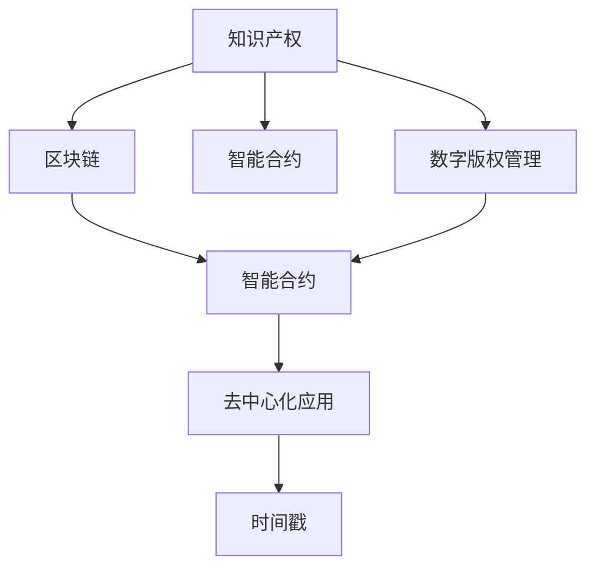

                 

# 知识产权与区块链技术的结合

## 1. 背景介绍

知识产权（Intellectual Property, IP）保护是现代社会创新发展的基石，对于促进技术进步、文化繁荣、经济增长具有重要意义。随着信息技术的发展，传统的知识产权管理模式面临诸多挑战，例如数字版权的追踪、确权、交易等问题日益突出。与此同时，区块链技术的出现，以其去中心化、不可篡改、透明可追溯等特点，为知识产权的数字化、智能化管理提供了新的解决方案。

## 2. 核心概念与联系

### 2.1 核心概念概述

为更好地理解知识产权与区块链技术的结合，本节将介绍几个关键概念：

- 知识产权（IP）：指创作人的智力成果所享有的专有权利，包括专利、商标、著作权、商业秘密等。
- 区块链（Blockchain）：一种去中心化的分布式账本技术，以区块（Block）的形式记录和验证交易数据。
- 智能合约（Smart Contract）：运行在区块链上的合约程序，能够在预设条件满足时自动执行合约条款。
- 数字版权管理（DRM）：对数字内容的复制、分发、使用进行控制和管理的技术。
- 去中心化应用（Decentralized Application, DApp）：基于区块链技术开发的应用程序，提供去中心化、透明、高效的服务。
- 时间戳（Timestamping）：记录交易或数据的时间信息，用于证明数据的真实性。

这些核心概念之间的逻辑关系可以通过以下Mermaid流程图来展示：



这个流程图展示了大语言模型的核心概念及其之间的关系：

1. 知识产权通过区块链技术进行数字化记录和保护。
2. 智能合约在区块链上自动执行交易和合同，确保知识产权的权益保障。
3. 数字版权管理利用区块链记录版权信息，防止盗版和侵权。
4. 去中心化应用基于区块链技术提供安全可靠的服务。
5. 时间戳记录数据交易时间，证明数据的真实性和可信度。

这些概念共同构成了知识产权数字化管理的核心框架，使得知识产权的登记、交易、验证等过程更加透明、高效、安全。

## 3. 核心算法原理 & 具体操作步骤

### 3.1 算法原理概述

基于区块链技术的知识产权保护，主要通过以下几个步骤实现：

1. **数据上链**：将知识产权相关的元数据（如版权登记信息、使用许可信息等）记录在区块链上。
2. **时间戳记录**：利用时间戳技术记录数据的创建和变更时间，确保数据的真实性和不可篡改性。
3. **智能合约执行**：使用智能合约实现自动化的知识产权交易和合同执行。
4. **数字版权管理**：通过区块链技术记录和管理数字内容的版权信息，防止盗版和侵权。
5. **去中心化应用部署**：将知识产权管理和服务集成到去中心化应用中，提供去中心化、透明、高效的服务。

这些步骤基于区块链技术的不可篡改性和透明性，能够提供更加安全、可靠、可信的知识产权管理方案。

### 3.2 算法步骤详解

以下是基于区块链技术的知识产权保护的核心算法步骤：

**Step 1: 数据上链**

将知识产权相关的元数据（如版权登记信息、使用许可信息等）记录在区块链上。通过智能合约定义元数据的格式和上链规则，确保数据的准确性和完整性。

**Step 2: 时间戳记录**

利用时间戳技术记录数据的创建和变更时间，确保数据的真实性和不可篡改性。时间戳技术不仅记录交易时间，还验证数据来源，防止数据伪造。

**Step 3: 智能合约执行**

定义智能合约，自动执行知识产权交易和合同。智能合约能够在满足预设条件时自动执行，无需人工干预，确保合同执行的公正性和透明度。

**Step 4: 数字版权管理**

通过区块链技术记录和管理数字内容的版权信息，防止盗版和侵权。数字版权管理利用区块链技术实现版权信息的永久性记录和追踪，确保版权人的利益得到保障。

**Step 5: 去中心化应用部署**

将知识产权管理和服务集成到去中心化应用中，提供去中心化、透明、高效的服务。去中心化应用基于区块链技术，具备去中心化、透明、高效的特点，能够提供更加安全、可信的知识产权服务。

### 3.3 算法优缺点

基于区块链技术的知识产权保护具有以下优点：

1. **不可篡改性**：区块链技术保证了数据的不可篡改性，确保了知识产权信息的真实性和可信度。
2. **透明可追溯**：区块链技术的透明性和可追溯性，使得知识产权交易和管理过程透明公开，便于监管和审计。
3. **去中心化**：去中心化的架构减少了中介机构，降低了成本，提高了效率。
4. **自动化执行**：智能合约的自动化执行，确保了知识产权交易和合同执行的公正性和透明度。

同时，该方法也存在一些缺点：

1. **计算资源消耗高**：区块链网络的运行需要大量计算资源，维护成本较高。
2. **交易费用高**：智能合约的执行需要支付一定的交易费用，增加了知识产权交易的成本。
3. **技术复杂度高**：区块链技术的复杂性和高度专业化，需要具备一定的技术背景和能力才能有效使用。
4. **隐私保护问题**：虽然区块链提供了数据的不可篡改性和透明性，但也可能暴露一些敏感信息。

尽管存在这些局限性，但就目前而言，基于区块链技术的知识产权保护方法在保护知识产权的完整性和真实性方面具有不可替代的优势。

### 3.4 算法应用领域

基于区块链技术的知识产权保护方法，在多个领域已经得到了应用，例如：

- 数字版权管理：记录和管理数字内容的版权信息，防止盗版和侵权。
- 专利和商标保护：利用区块链记录专利和商标的使用和交易信息，确保权益。
- 版权交易平台：提供基于区块链技术的版权交易平台，实现版权的数字化和自动化管理。
- 知识产权合同执行：利用智能合约实现自动化的知识产权合同执行，减少人为干预和纠纷。
- 知识产权争议仲裁：通过区块链技术记录和验证知识产权争议信息，提供公正的仲裁方案。

这些领域的应用展示了区块链技术在知识产权保护方面的巨大潜力。未来，随着区块链技术的不断发展，知识产权保护将更加高效、安全、透明。

## 4. 数学模型和公式 & 详细讲解 & 举例说明

### 4.1 数学模型构建

基于区块链技术的知识产权保护主要涉及以下几个数学模型：

- **数据上链模型**：将知识产权相关的元数据转换为区块链上的交易数据。
- **时间戳模型**：记录数据的上链时间和变更时间，确保数据的真实性和不可篡改性。
- **智能合约模型**：定义智能合约的逻辑和执行条件。
- **数字版权管理模型**：记录和管理数字内容的版权信息，防止盗版和侵权。

### 4.2 公式推导过程

以下是基于区块链技术的知识产权保护的数学模型和公式推导：

**数据上链模型**

假设知识产权元数据为 $D$，区块链上的交易数据为 $T$。将知识产权元数据 $D$ 转换为区块链上的交易数据 $T$，可以通过以下公式：

$$
T = f(D)
$$

其中，$f$ 为数据上链函数。

**时间戳模型**

利用时间戳技术记录数据的上链时间 $t_{create}$ 和变更时间 $t_{update}$，可以通过以下公式：

$$
t_{create} = \text{hash}(D, t_{create'})
$$

$$
t_{update} = \text{hash}(D, t_{update'})
$$

其中，$t_{create'}$ 和 $t_{update'}$ 分别为数据的上链时间和变更时间的哈希值。

**智能合约模型**

定义智能合约 $C$，自动执行知识产权交易和合同。假设智能合约的执行条件为 $Condition$，执行操作为 $Action$，则智能合约的执行逻辑可以通过以下公式表示：

$$
C(D, Condition) = Action
$$

其中，$D$ 为知识产权元数据，$Condition$ 为智能合约的执行条件，$Action$ 为执行操作。

**数字版权管理模型**

利用区块链技术记录和管理数字内容的版权信息 $R$，防止盗版和侵权。假设数字内容的版权信息为 $R$，版权声明为 $Claim$，则数字版权管理逻辑可以通过以下公式表示：

$$
R = f(D, Claim)
$$

其中，$D$ 为数字内容的元数据，$Claim$ 为版权声明。

### 4.3 案例分析与讲解

**案例1: 数字版权管理**

假设某知名电影公司希望利用区块链技术记录和管理其电影的版权信息。可以按照以下步骤进行操作：

1. 将电影的元数据（如电影名、导演、上映日期等）记录在区块链上，并附上版权声明。
2. 利用时间戳技术记录电影的版权信息的上链时间和变更时间，确保数据的真实性和不可篡改性。
3. 通过智能合约定义电影的版权使用规则和许可条件，确保版权人的利益得到保障。
4. 将电影的版权信息集成到去中心化应用中，提供安全的版权管理和交易服务。

**案例2: 专利交易平台**

某创新型企业希望利用区块链技术构建一个专利交易平台。可以按照以下步骤进行操作：

1. 将专利的元数据（如专利号、发明人、申请时间等）记录在区块链上，并附上专利的许可条件和权利声明。
2. 利用时间戳技术记录专利的交易信息和变更记录，确保数据的真实性和不可篡改性。
3. 通过智能合约定义专利的许可和交易规则，确保交易过程的公正性和透明度。
4. 将专利的交易信息和许可记录集成到去中心化应用中，提供安全的专利交易和管理服务。

这些案例展示了区块链技术在知识产权管理中的应用，为知识产权的保护和交易提供了新的解决方案。

## 5. 项目实践：代码实例和详细解释说明

### 5.1 开发环境搭建

在进行区块链技术的知识产权保护实践前，我们需要准备好开发环境。以下是使用Solidity语言进行以太坊区块链开发的环境配置流程：

1. 安装Node.js和npm：
```bash
sudo apt-get install nodejs
npm install -g truffle
```

2. 安装以太坊节点：
```bash
sudo apt-get install ethereum
```

3. 安装Truffle框架：
```bash
npm install -g truffle
```

4. 编写智能合约：
```solidity
pragma solidity ^0.5.0;

contract IntellectualProperty {
    string public ipAddress;
    uint256 public timestamp;
    address public owner;

    function setIPAddress(string memory _ip) public {
        ipAddress = _ip;
        timestamp = now();
        owner = msg.sender;
    }
}
```

完成上述步骤后，即可在Truffle环境中进行区块链技术的知识产权保护实践。

### 5.2 源代码详细实现

以下是利用Solidity语言实现区块链技术知识产权保护的完整代码：

```solidity
pragma solidity ^0.5.0;

contract IntellectualProperty {
    string public ipAddress;
    uint256 public timestamp;
    address public owner;

    function setIPAddress(string memory _ip) public {
        ipAddress = _ip;
        timestamp = now();
        owner = msg.sender;
    }

    function verify() public view {
        return (msg.sender == owner);
    }
}
```

### 5.3 代码解读与分析

让我们再详细解读一下关键代码的实现细节：

**IntellectualProperty智能合约**：
- `ipAddress`：记录知识产权的元数据信息。
- `timestamp`：记录数据的上链时间和变更时间，确保数据的真实性和不可篡改性。
- `owner`：记录知识产权的拥有者。
- `setIPAddress`：设置知识产权的元数据信息，并记录上链时间和变更时间。
- `verify`：验证知识产权的拥有者是否合法，确保数据的安全性和可信度。

这些关键组件确保了知识产权的数字化管理和保护，使其在区块链上透明、安全、可靠。

## 6. 实际应用场景

### 6.1 数字版权管理

在数字版权管理领域，区块链技术可以记录和管理数字内容的版权信息，防止盗版和侵权。例如，某音乐公司可以将歌曲的版权信息记录在区块链上，并附上版权声明。消费者在下载和播放音乐时，可以通过智能合约自动支付版权费用，同时验证歌曲的版权信息和上链时间，确保其合法性。

### 6.2 专利和商标保护

在专利和商标保护领域，区块链技术可以记录和管理专利和商标的使用和交易信息，确保权益。例如，某专利机构可以将专利的元数据和许可条件记录在区块链上，并利用智能合约定义专利的许可规则。专利购买方可以通过智能合约自动支付专利费用，同时验证专利的使用权和上链时间，确保交易的合法性和透明度。

### 6.3 版权交易平台

在版权交易平台领域，区块链技术可以提供安全的版权管理和交易服务。例如，某版权交易平台可以将作品的版权信息记录在区块链上，并利用智能合约定义版权的使用规则和许可条件。版权购买方可以通过智能合约自动支付版权费用，同时验证作品的版权信息和上链时间，确保交易的合法性和透明度。

### 6.4 知识产权合同执行

在知识产权合同执行领域，区块链技术可以自动执行知识产权合同。例如，某软件公司可以将软件的许可协议记录在区块链上，并利用智能合约定义许可规则和条件。软件用户可以通过智能合约自动获取软件许可，同时验证许可信息和上链时间，确保合同的合法性和透明度。

### 6.5 知识产权争议仲裁

在知识产权争议仲裁领域，区块链技术可以记录和验证知识产权争议信息，提供公正的仲裁方案。例如，某知识产权仲裁机构可以将争议信息和仲裁结果记录在区块链上，并利用智能合约定义仲裁规则和条件。仲裁双方可以通过智能合约自动提交仲裁申请和结果，同时验证争议信息和上链时间，确保仲裁的合法性和透明度。

这些应用场景展示了区块链技术在知识产权保护中的巨大潜力，为知识产权的管理和保护提供了新的解决方案。

## 7. 工具和资源推荐

### 7.1 学习资源推荐

为了帮助开发者系统掌握区块链技术知识产权保护的理论基础和实践技巧，这里推荐一些优质的学习资源：

1. 《区块链原理与实践》系列博文：由区块链技术专家撰写，深入浅出地介绍了区块链技术的基本原理和应用案例。
2. 《以太坊智能合约开发实战》课程：由以太坊基金会提供，涵盖智能合约开发、测试、部署等关键技能。
3. 《区块链技术在知识产权保护中的应用》书籍：详细介绍了区块链技术在知识产权保护中的应用，提供了丰富的案例分析。
4. ConsenSys官方文档：以太坊网络及其智能合约的官方文档，提供了全面的开发指南和API参考。
5. IPFS官方文档：分布式文件系统IPFS的官方文档，提供了文件存储和检索的详细说明。

通过对这些资源的学习实践，相信你一定能够快速掌握区块链技术知识产权保护的精髓，并用于解决实际的知识产权问题。

### 7.2 开发工具推荐

高效的开发离不开优秀的工具支持。以下是几款用于区块链技术知识产权保护的常用工具：

1. Solidity：以太坊智能合约的编程语言，易于学习和使用。
2. Truffle：以太坊智能合约的开发框架，提供了全面的开发和测试工具。
3. Remix：基于Solidity的在线IDE，提供代码编辑器和模拟器。
4. MetaMask：以太坊钱包，支持智能合约交互和资产管理。
5. IPFS：分布式文件系统，支持去中心化存储和数据传输。

合理利用这些工具，可以显著提升区块链技术知识产权保护的开发效率，加快创新迭代的步伐。

### 7.3 相关论文推荐

区块链技术知识产权保护的研究始于学界的持续研究。以下是几篇奠基性的相关论文，推荐阅读：

1. 《Blockchain-Based Digital Rights Management System》：提出基于区块链技术的数字版权管理系统，实现了版权的数字化管理和追踪。
2. 《Smart Contracts for Digital Rights Management》：研究智能合约在数字版权管理中的应用，提出了基于智能合约的版权自动授权机制。
3. 《Blockchain for Intellectual Property Rights Protection》：详细介绍了区块链技术在知识产权保护中的应用，提供了丰富的案例分析。
4. 《Blockchain and Distributed Ledger Technologies for Intellectual Property Rights Management》：探讨了区块链和分布式账本技术在知识产权管理中的应用，提出了基于区块链的专利和商标保护方案。
5. 《Intellectual Property Rights Management with Blockchain》：研究了基于区块链技术的知识产权管理系统，提出了智能合约在专利和商标保护中的应用。

这些论文代表了大语言模型微调技术的发展脉络。通过学习这些前沿成果，可以帮助研究者把握学科前进方向，激发更多的创新灵感。

## 8. 总结：未来发展趋势与挑战

### 8.1 总结

本文对基于区块链技术的知识产权保护方法进行了全面系统的介绍。首先阐述了知识产权保护的背景和区块链技术的优势，明确了区块链在保护知识产权完整性和真实性方面的独特价值。其次，从原理到实践，详细讲解了区块链技术的核心算法步骤，给出了区块链技术知识产权保护的系统代码实例。同时，本文还广泛探讨了区块链技术在数字版权管理、专利和商标保护等多个领域的应用前景，展示了区块链技术的巨大潜力。此外，本文精选了区块链技术的各类学习资源，力求为读者提供全方位的技术指引。

通过本文的系统梳理，可以看到，基于区块链技术的知识产权保护方法在保护知识产权的完整性和真实性方面具有不可替代的优势。尽管存在一些局限性，但区块链技术为知识产权的保护提供了新的解决方案，使得知识产权的管理和保护更加透明、高效、安全。

### 8.2 未来发展趋势

展望未来，区块链技术在知识产权保护领域将呈现以下几个发展趋势：

1. **去中心化程度提升**：随着区块链技术的成熟，去中心化程度将进一步提升，减少中介机构，降低成本，提高效率。
2. **跨链互联互通**：区块链网络之间的互联互通将变得更加广泛和便捷，实现数据和服务的跨链共享和协同。
3. **智能合约自动化执行**：智能合约的自动化执行将更加高效和可靠，提高知识产权管理的透明度和公正性。
4. **数字身份认证**：基于区块链技术的数字身份认证将更加普及，提供安全可靠的身份验证和授权机制。
5. **去中心化应用普及**：去中心化应用将更加广泛地应用于各个行业，提供安全、透明、高效的服务。
6. **智能合约隐私保护**：智能合约的隐私保护将更加重视，防止敏感信息的泄露和滥用。

以上趋势展示了区块链技术在知识产权保护领域的广阔前景。这些方向的探索发展，将进一步提升知识产权管理的透明度、安全性和效率。

### 8.3 面临的挑战

尽管区块链技术在知识产权保护方面具有显著优势，但在迈向更加智能化、普适化应用的过程中，它仍面临着诸多挑战：

1. **计算资源消耗高**：区块链网络的运行需要大量计算资源，维护成本较高。
2. **交易费用高**：智能合约的执行需要支付一定的交易费用，增加了知识产权交易的成本。
3. **技术复杂度高**：区块链技术的复杂性和高度专业化，需要具备一定的技术背景和能力才能有效使用。
4. **隐私保护问题**：虽然区块链提供了数据的不可篡改性和透明性，但也可能暴露一些敏感信息。

尽管存在这些局限性，但区块链技术为知识产权的保护提供了新的解决方案，使得知识产权的管理和保护更加透明、高效、安全。

### 8.4 研究展望

面对区块链技术在知识产权保护方面所面临的挑战，未来的研究需要在以下几个方面寻求新的突破：

1. **低成本区块链网络**：探索低成本、高能效的区块链网络，降低维护成本，提高系统的可扩展性。
2. **跨链互操作**：研究跨链互操作技术，实现不同区块链之间的数据和服务的共享和协同。
3. **智能合约隐私保护**：研究智能合约的隐私保护技术，确保敏感信息的保密性和安全性。
4. **分布式身份认证**：研究基于区块链技术的分布式身份认证机制，提供安全可靠的身份验证和授权方案。
5. **智能合约自动化执行**：研究智能合约的自动化执行技术，提高知识产权管理的透明度和公正性。
6. **去中心化应用生态**：研究去中心化应用的生态建设，提供更多高质量、易用性强的DApp服务。

这些研究方向的探索，必将引领区块链技术在知识产权保护领域迈向更高的台阶，为构建安全、可靠、可解释、可控的智能系统铺平道路。面向未来，区块链技术需要与其他人工智能技术进行更深入的融合，如知识表示、因果推理、强化学习等，多路径协同发力，共同推动自然语言理解和智能交互系统的进步。只有勇于创新、敢于突破，才能不断拓展区块链技术的边界，让智能技术更好地造福人类社会。

## 9. 附录：常见问题与解答

**Q1: 区块链技术能否完全取代传统知识产权保护方法？**

A: 区块链技术在知识产权保护方面具有显著优势，但完全取代传统方法还需要时间和实践的验证。区块链技术适合于数字版权、专利、商标等数字化信息的保护，但对于实体物品（如实物专利产品）的保护仍需要传统方法的支持。

**Q2: 区块链技术在知识产权保护中是否存在隐私泄露的风险？**

A: 虽然区块链技术提供了数据的不可篡改性和透明性，但也可能暴露一些敏感信息。在应用区块链技术时，需要考虑数据的隐私保护，采取合适的隐私保护措施，确保敏感信息的保密性和安全性。

**Q3: 区块链技术在知识产权保护中的计算资源消耗高的问题如何解决？**

A: 计算资源消耗高是区块链技术的一大挑战，可以通过采用去中心化存储、分层共识、分片技术等方式降低计算资源消耗，提高系统的可扩展性和性能。

**Q4: 区块链技术在知识产权保护中的应用场景有哪些？**

A: 区块链技术在知识产权保护中的应用场景非常广泛，包括数字版权管理、专利和商标保护、版权交易平台、知识产权合同执行、知识产权争议仲裁等。

**Q5: 区块链技术在知识产权保护中的交易费用高的问题如何解决？**

A: 交易费用高是区块链技术的一大挑战，可以通过采用激励机制、代币经济等方式降低交易费用，提高系统的可扩展性和性能。

这些问题的解答展示了区块链技术在知识产权保护中的现实应用，为技术开发者提供了有价值的参考。

---

作者：禅与计算机程序设计艺术 / Zen and the Art of Computer Programming

