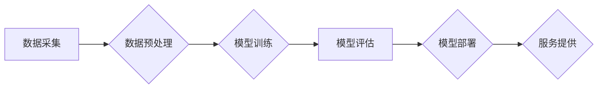

> AI大模型，创业，行业发展趋势，应用场景，技术挑战，未来展望

## 1. 背景介绍

人工智能（AI）技术近年来发展迅速，特别是大模型的涌现，为各行各业带来了前所未有的机遇。AI大模型，是指参数规模庞大、训练数据海量的人工智能模型，具备强大的泛化能力和学习能力，能够在自然语言处理、计算机视觉、语音识别等领域取得突破性进展。

随着AI技术的不断成熟，越来越多的创业者看到了AI大模型的巨大潜力，纷纷涌入这个领域，希望通过开发基于AI大模型的创新产品和服务，创造新的价值。然而，AI大模型创业也面临着诸多挑战，例如高昂的开发成本、数据安全和隐私保护、算法可解释性和伦理问题等。

## 2. 核心概念与联系

**2.1 AI大模型的定义**

AI大模型是指参数规模庞大、训练数据海量的人工智能模型，其核心特征包括：

* **参数规模：** 大模型通常拥有数十亿甚至数千亿个参数，这使得它们能够学习到更复杂的模式和关系。
* **训练数据：** 大模型需要海量的数据进行训练，才能充分发挥其学习能力。
* **泛化能力：** 大模型具有较强的泛化能力，能够应用于不同的任务和领域。

**2.2 AI大模型的架构**

常见的AI大模型架构包括：

* **Transformer：** Transformer是一种基于注意力机制的深度学习架构，在自然语言处理领域取得了显著的成果。
* **BERT：** BERT是一种基于Transformer的预训练语言模型，能够理解上下文信息，在文本分类、问答等任务中表现出色。
* **GPT：** GPT是一种基于Transformer的生成式语言模型，能够生成流畅自然的文本，在文本摘要、机器翻译等任务中应用广泛。

**2.3 AI大模型与创业的联系**

AI大模型为创业者提供了以下机遇：

* **开发创新产品和服务：** 基于AI大模型，可以开发出能够自动生成内容、理解用户需求、提供个性化服务的创新产品和服务。
* **提高效率和降低成本：** AI大模型可以自动化许多重复性任务，提高工作效率，降低运营成本。
* **开拓新的市场和领域：** AI大模型可以应用于各个行业，开拓新的市场和领域。

**2.4 Mermaid 流程图**



## 3. 核心算法原理 & 具体操作步骤

**3.1 算法原理概述**

AI大模型的核心算法原理是深度学习，它通过多层神经网络来模拟人类大脑的学习过程。深度学习算法能够从海量数据中学习到复杂的模式和关系，从而实现对各种任务的智能化处理。

**3.2 算法步骤详解**

1. **数据采集：** 收集与目标任务相关的海量数据。
2. **数据预处理：** 对数据进行清洗、转换、格式化等处理，使其能够被模型所理解。
3. **模型构建：** 根据目标任务选择合适的深度学习模型架构，并设置模型参数。
4. **模型训练：** 使用训练数据对模型进行训练，调整模型参数，使其能够准确地完成目标任务。
5. **模型评估：** 使用测试数据对模型进行评估，衡量模型的性能。
6. **模型部署：** 将训练好的模型部署到实际应用环境中。

**3.3 算法优缺点**

**优点：**

* 强大的学习能力：深度学习算法能够从海量数据中学习到复杂的模式和关系。
* 泛化能力强：训练好的深度学习模型能够应用于不同的任务和领域。
* 自动特征提取：深度学习算法能够自动提取数据的特征，无需人工特征工程。

**缺点：**

* 数据依赖性强：深度学习算法需要海量数据进行训练，否则性能会下降。
* 计算资源消耗大：训练深度学习模型需要大量的计算资源。
* 可解释性差：深度学习模型的决策过程难以理解，缺乏可解释性。

**3.4 算法应用领域**

深度学习算法广泛应用于以下领域：

* 自然语言处理：文本分类、情感分析、机器翻译、问答系统等。
* 计算机视觉：图像识别、物体检测、图像分割、人脸识别等。
* 语音识别：语音转文本、语音助手等。
* 医疗诊断：疾病预测、影像分析等。
* 金融风险控制：欺诈检测、信用评分等。

## 4. 数学模型和公式 & 详细讲解 & 举例说明

**4.1 数学模型构建**

深度学习模型的核心是神经网络，它由多个层组成，每一层包含多个神经元。神经元之间通过连接权重进行信息传递。

**4.2 公式推导过程**

神经网络的学习过程是通过调整连接权重来实现的。常用的优化算法包括梯度下降法和Adam算法。

* **梯度下降法：** 

$$
\theta = \theta - \alpha \nabla L(\theta)
$$

其中：

* $\theta$：连接权重
* $\alpha$：学习率
* $\nabla L(\theta)$：损失函数对连接权重的梯度

* **Adam算法：**

Adam算法结合了梯度下降法和动量法，能够更快地收敛到最优解。

**4.3 案例分析与讲解**

以图像分类为例，假设我们有一个包含10类图像的分类任务。我们可以使用卷积神经网络（CNN）来构建模型。CNN模型包含卷积层、池化层和全连接层。

* **卷积层：** 用于提取图像特征。
* **池化层：** 用于降低图像维度，提高模型的鲁棒性。
* **全连接层：** 用于将提取的特征映射到10个类别。

训练过程中，我们使用图像数据和对应的标签进行训练，通过调整连接权重，使模型能够准确地将图像分类到正确的类别。

## 5. 项目实践：代码实例和详细解释说明

**5.1 开发环境搭建**

* 操作系统：Ubuntu 20.04
* Python版本：3.8
* 深度学习框架：TensorFlow 2.0

**5.2 源代码详细实现**

```python
import tensorflow as tf

# 定义模型架构
model = tf.keras.models.Sequential([
    tf.keras.layers.Conv2D(32, (3, 3), activation='relu', input_shape=(28, 28, 1)),
    tf.keras.layers.MaxPooling2D((2, 2)),
    tf.keras.layers.Conv2D(64, (3, 3), activation='relu'),
    tf.keras.layers.MaxPooling2D((2, 2)),
    tf.keras.layers.Flatten(),
    tf.keras.layers.Dense(10, activation='softmax')
])

# 编译模型
model.compile(optimizer='adam',
              loss='sparse_categorical_crossentropy',
              metrics=['accuracy'])

# 加载数据
(x_train, y_train), (x_test, y_test) = tf.keras.datasets.mnist.load_data()

# 数据预处理
x_train = x_train.astype('float32') / 255.0
x_test = x_test.astype('float32') / 255.0
x_train = x_train.reshape((x_train.shape[0], 28, 28, 1))
x_test = x_test.reshape((x_test.shape[0], 28, 28, 1))

# 训练模型
model.fit(x_train, y_train, epochs=5)

# 评估模型
loss, accuracy = model.evaluate(x_test, y_test)
print('Test loss:', loss)
print('Test accuracy:', accuracy)
```

**5.3 代码解读与分析**

这段代码实现了基于TensorFlow框架的MNIST手写数字识别模型。

* 首先定义了模型架构，包括卷积层、池化层和全连接层。
* 然后编译模型，指定优化器、损失函数和评价指标。
* 加载MNIST数据集，并对数据进行预处理，例如归一化和reshape。
* 训练模型，指定训练轮数。
* 最后评估模型，打印测试损失和准确率。

**5.4 运行结果展示**

训练完成后，模型能够准确地识别MNIST手写数字。

## 6. 实际应用场景

**6.1 自然语言处理**

* **文本分类：** 基于AI大模型的文本分类模型能够自动将文本分类到不同的类别，例如情感分析、主题分类等。
* **机器翻译：** AI大模型能够实现高质量的机器翻译，将文本从一种语言翻译成另一种语言。
* **问答系统：** AI大模型能够理解用户的问题，并从知识库中找到相应的答案。

**6.2 计算机视觉**

* **图像识别：** AI大模型能够识别图像中的物体，例如人脸识别、物体检测等。
* **图像分割：** AI大模型能够将图像分割成不同的区域，例如分割出图像中的前景和背景。
* **视频分析：** AI大模型能够分析视频内容，例如识别视频中的动作、事件等。

**6.3 语音识别**

* **语音转文本：** AI大模型能够将语音转换为文本，例如语音助手、语音输入等。
* **语音合成：** AI大模型能够将文本转换为语音，例如语音播报、语音聊天等。

**6.4 其他领域**

* **医疗诊断：** AI大模型能够辅助医生进行疾病诊断，例如分析医学影像、预测疾病风险等。
* **金融风险控制：** AI大模型能够识别金融欺诈、评估信用风险等。
* **智能制造：** AI大模型能够优化生产流程、预测设备故障等。

**6.5 未来应用展望**

随着AI技术的不断发展，AI大模型将在更多领域得到应用，例如：

* **个性化教育：** AI大模型能够根据学生的学习情况提供个性化的学习方案。
* **智能交通：** AI大模型能够优化交通流量、辅助驾驶等。
* **智慧城市：** AI大模型能够提高城市管理效率、提升居民生活质量等。

## 7. 工具和资源推荐

**7.1 学习资源推荐**

* **书籍：**
    * 《深度学习》
    * 《动手学深度学习》
* **在线课程：**
    * Coursera深度学习课程
    * fast.ai深度学习课程
* **博客和网站：**
    * TensorFlow博客
    * PyTorch博客

**7.2 开发工具推荐**

* **深度学习框架：** TensorFlow、PyTorch、Keras
* **编程语言：** Python
* **云计算平台：** AWS、Google Cloud、Azure

**7.3 相关论文推荐**

* 《Attention Is All You Need》
* 《BERT: Pre-training of Deep Bidirectional Transformers for Language Understanding》
* 《GPT-3: Language Models are Few-Shot Learners》

## 8. 总结：未来发展趋势与挑战

**8.1 研究成果总结**

近年来，AI大模型取得了显著的进展，在自然语言处理、计算机视觉、语音识别等领域取得了突破性成果。

**8.2 未来发展趋势**

* **模型规模的进一步扩大：** 未来，AI大模型的规模将继续扩大，参数数量将达到数万亿甚至数千亿。
* **模型架构的创新：** 研究人员将继续探索新的模型架构，例如Transformer变体、混合模型等。
* **多模态学习：** 未来，AI大模型将能够处理多种模态数据，例如文本、图像、音频等。
* **可解释性增强：** 研究人员将致力于提高AI大