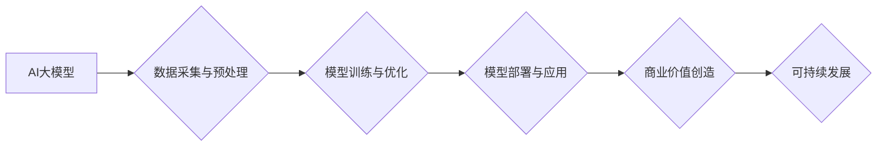

> AI大模型，商业模式，可持续发展，创业，技术应用

## 1. 背景介绍

近年来，人工智能（AI）技术取得了飞速发展，特别是大规模语言模型（LLM）的出现，如GPT-3、LaMDA等，展现出强大的文本生成、理解和翻译能力，为各行各业带来了革命性的变革。这些模型的开源和商业化应用，为创业者提供了前所未有的机遇。

然而，仅仅拥有强大的AI技术并不意味着创业成功。构建一个可持续发展的商业模式，是AI大模型创业的关键。本文将深入探讨如何利用AI大模型构建未来可持续的商业模式，并分析其面临的挑战和未来发展趋势。

## 2. 核心概念与联系

**2.1 AI大模型**

AI大模型是指训练数据量巨大、模型参数规模庞大的深度学习模型。它们通过学习海量文本数据，掌握了语言的复杂规律，能够执行各种自然语言处理任务，例如：

* 文本生成：创作故事、诗歌、文章等。
* 文本理解：分析文本情感、主题、意图等。
* 文本翻译：将文本从一种语言翻译成另一种语言。
* 对话系统：与人类进行自然流畅的对话。

**2.2 商业模式**

商业模式是指企业为创造、传递和捕获价值而采取的策略和方法。它包括企业的价值主张、目标客户、收入来源、成本结构等关键要素。

**2.3 可持续发展**

可持续发展是指企业能够在满足当前需求的同时，不损害未来世代满足其自身需求的能力。

**2.4 核心概念联系**

AI大模型的强大能力为创业者提供了构建创新商业模式的机会。通过将AI大模型与特定行业需求相结合，可以创造出新的价值，并实现可持续发展。

**Mermaid 流程图**



## 3. 核心算法原理 & 具体操作步骤

**3.1 算法原理概述**

AI大模型的核心算法是深度学习，特别是 Transformer 架构。Transformer 模型通过自注意力机制，能够捕捉文本序列中长距离依赖关系，从而实现更准确的文本理解和生成。

**3.2 算法步骤详解**

1. **数据采集与预处理:** 收集大量文本数据，并进行清洗、格式化、分词等预处理操作。
2. **模型训练:** 使用深度学习框架（如 TensorFlow、PyTorch）训练 Transformer 模型，并通过反向传播算法优化模型参数。
3. **模型评估:** 使用测试集评估模型性能，并根据评估结果调整模型参数和训练策略。
4. **模型部署:** 将训练好的模型部署到服务器或云平台，以便进行实际应用。

**3.3 算法优缺点**

**优点:**

* 强大的文本理解和生成能力。
* 可以处理长文本序列。
* 能够捕捉文本中的复杂关系。

**缺点:**

* 训练成本高，需要大量计算资源和数据。
* 模型参数规模庞大，部署和推理成本较高。
* 容易受到训练数据偏差的影响。

**3.4 算法应用领域**

* 自然语言处理：文本分类、情感分析、机器翻译、问答系统等。
* 内容创作：自动生成新闻、广告文案、诗歌等。
* 人机交互：聊天机器人、语音助手等。
* 代码生成：自动生成代码片段。

## 4. 数学模型和公式 & 详细讲解 & 举例说明

**4.1 数学模型构建**

Transformer 模型的核心是自注意力机制，它通过计算词语之间的相关性，来捕捉文本序列中的长距离依赖关系。

**4.2 公式推导过程**

自注意力机制的计算公式如下：

$$
Attention(Q, K, V) = softmax(\frac{QK^T}{\sqrt{d_k}})V
$$

其中：

* $Q$：查询矩阵
* $K$：键矩阵
* $V$：值矩阵
* $d_k$：键向量的维度
* $softmax$：softmax 函数

**4.3 案例分析与讲解**

假设我们有一个句子 "The cat sat on the mat"，我们想要计算 "cat" 和 "mat" 之间的注意力权重。

1. 将句子中的每个词语转换为词向量，形成查询矩阵 $Q$、键矩阵 $K$ 和值矩阵 $V$。
2. 计算 $QK^T$，得到一个矩阵，其中每个元素表示两个词语之间的相关性。
3. 对 $QK^T$ 进行归一化，得到注意力权重矩阵。
4. 将注意力权重矩阵与值矩阵 $V$ 进行加权求和，得到 "cat" 和 "mat" 之间的上下文向量。

## 5. 项目实践：代码实例和详细解释说明

**5.1 开发环境搭建**

* Python 3.7+
* TensorFlow 或 PyTorch
* CUDA 和 cuDNN

**5.2 源代码详细实现**

```python
import tensorflow as tf

# 定义 Transformer 模型
class Transformer(tf.keras.Model):
    def __init__(self, vocab_size, embedding_dim, num_heads, num_layers):
        super(Transformer, self).__init__()
        self.embedding = tf.keras.layers.Embedding(vocab_size, embedding_dim)
        self.transformer_layers = tf.keras.layers.StackedRNNCells([
            tf.keras.layers.Attention(num_heads=num_heads)
            for _ in range(num_layers)
        ])

    def call(self, inputs):
        embeddings = self.embedding(inputs)
        outputs = self.transformer_layers(embeddings)
        return outputs

# 实例化 Transformer 模型
model = Transformer(vocab_size=10000, embedding_dim=128, num_heads=8, num_layers=6)

# 训练模型
model.compile(optimizer='adam', loss='mse')
model.fit(x_train, y_train, epochs=10)

# 预测结果
predictions = model.predict(x_test)
```

**5.3 代码解读与分析**

* 代码定义了一个 Transformer 模型，包含嵌入层、多头注意力层和循环神经网络层。
* 模型使用 Adam 优化器和均方误差损失函数进行训练。
* 训练完成后，可以使用模型预测新的文本序列。

**5.4 运行结果展示**

训练结果可以根据具体的任务和数据集进行评估，例如使用困惑度（perplexity）来衡量模型的文本生成能力。

## 6. 实际应用场景

**6.1 内容创作**

* 自动生成新闻报道、广告文案、产品描述等。
* 创作诗歌、小说、剧本等文学作品。

**6.2 人机交互**

* 开发聊天机器人、语音助手、虚拟客服等。
* 提供个性化用户体验，例如根据用户的喜好推荐内容。

**6.3 教育培训**

* 自动生成学习材料、练习题、评估报告等。
* 提供个性化学习辅导，帮助学生提高学习效率。

**6.4 其他应用场景**

* 代码生成
* 翻译
* 文本摘要
* 问答系统

**6.5 未来应用展望**

随着AI大模型技术的不断发展，其应用场景将更加广泛，例如：

* 更智能的虚拟助手
* 更逼真的虚拟角色
* 更个性化的教育体验
* 更高效的科研工作

## 7. 工具和资源推荐

**7.1 学习资源推荐**

* **书籍:**
    * 《深度学习》
    * 《自然语言处理》
    * 《Transformer模型详解》
* **在线课程:**
    * Coursera: 深度学习
    * edX: 自然语言处理
    * fast.ai: 深度学习课程

**7.2 开发工具推荐**

* **深度学习框架:** TensorFlow, PyTorch
* **文本处理工具:** NLTK, spaCy
* **云平台:** AWS, Google Cloud, Azure

**7.3 相关论文推荐**

* 《Attention Is All You Need》
* 《BERT: Pre-training of Deep Bidirectional Transformers for Language Understanding》
* 《GPT-3: Language Models are Few-Shot Learners》

## 8. 总结：未来发展趋势与挑战

**8.1 研究成果总结**

近年来，AI大模型取得了显著进展，在文本理解、生成、翻译等领域展现出强大的能力。

**8.2 未来发展趋势**

* 模型规模和能力将继续提升。
* 多模态AI大模型将成为主流。
* AI大模型的应用场景将更加广泛。

**8.3 面临的挑战**

* 训练成本高昂。
* 模型参数规模庞大。
* 数据偏差和公平性问题。
* 伦理和安全问题。

**8.4 研究展望**

未来研究将重点关注以下方面：

* 降低训练成本和模型参数规模。
* 提高模型的鲁棒性和泛化能力。
* 解决数据偏差和公平性问题。
* 探索AI大模型的伦理和安全应用。

## 9. 附录：常见问题与解答

**9.1 如何选择合适的AI大模型？**

选择合适的AI大模型需要根据具体的应用场景和需求进行评估，例如：

* 任务类型：文本分类、生成、翻译等。
* 数据规模：训练数据量的大小。
* 计算资源：训练和部署所需的计算资源。

**9.2 如何训练自己的AI大模型？**

训练自己的AI大模型需要具备一定的深度学习和编程基础，并拥有足够的计算资源和数据。

**9.3 如何部署AI大模型？**

AI大模型的部署方式多种多样，可以部署到服务器、云平台或边缘设备。

**9.4 如何评估AI大模型的性能？**

AI大模型的性能可以通过各种指标进行评估，例如困惑度、准确率、F1-score等。

**9.5 AI大模型有哪些伦理和安全问题？**

AI大模型的伦理和安全问题包括数据隐私、算法偏见、恶意攻击等。


作者：禅与计算机程序设计艺术 / Zen and the Art of Computer Programming 
<end_of_turn>