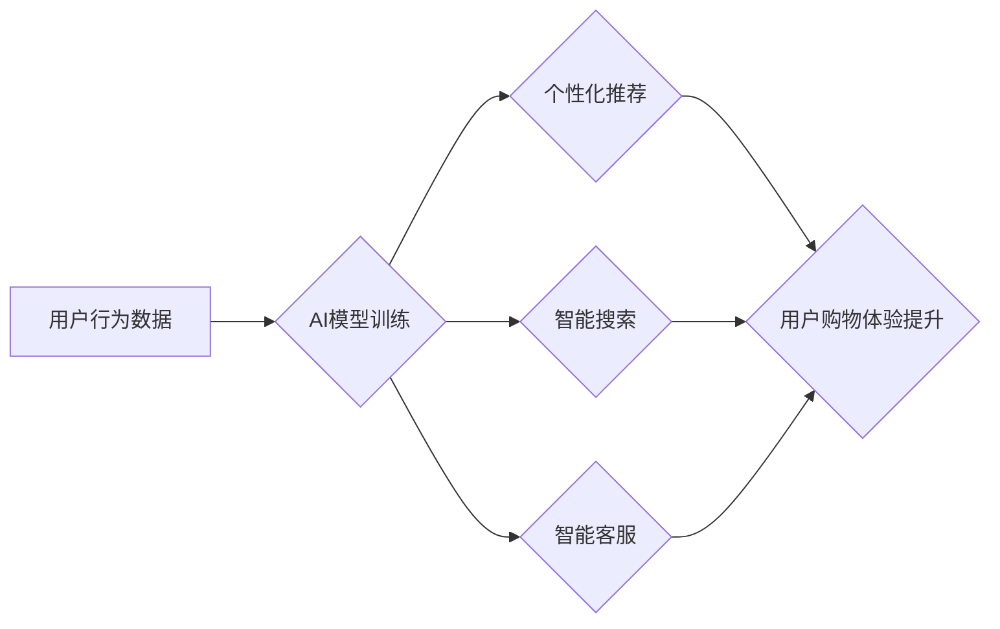

> 人工智能，电商，用户体验，推荐系统，个性化，聊天机器人，自然语言处理，机器学习

## 1. 背景介绍

电子商务行业近年来发展迅速，用户对购物体验的要求也越来越高。传统的电商平台往往依靠商品分类、搜索引擎等方式来帮助用户查找商品，但这些方法往往难以满足用户个性化需求，导致用户体验下降。

人工智能（AI）技术的快速发展为电商行业带来了新的机遇。AI能够通过分析用户行为、偏好和历史数据，提供更精准、更个性化的购物体验，从而提升用户满意度和复购率。

## 2. 核心概念与联系

### 2.1  电商用户体验

电商用户体验是指用户在与电商平台交互过程中所感受到的整体感受，包括用户界面、商品展示、搜索结果、支付流程、售后服务等各个方面。良好的用户体验可以提升用户满意度、促进用户转化，最终提高电商平台的商业价值。

### 2.2  人工智能技术

人工智能技术是指模拟人类智能行为的计算机科学领域。AI技术涵盖了机器学习、深度学习、自然语言处理、计算机视觉等多个分支，能够帮助电商平台实现智能化运营、个性化服务等功能。

### 2.3  AI提升电商用户体验的联系

AI技术能够通过分析用户行为数据、商品信息和市场趋势，为电商平台提供以下方面的支持：

* **个性化推荐:** 根据用户的浏览历史、购买记录、兴趣爱好等信息，推荐个性化的商品，提高用户购物的兴趣和转化率。
* **智能搜索:** 理解用户的搜索意图，提供更精准、更相关的搜索结果，提高用户搜索效率。
* **智能客服:** 利用自然语言处理技术，开发智能客服机器人，为用户提供24小时在线服务，解决用户疑问，提高用户满意度。
* **个性化营销:** 根据用户的行为特征和偏好，进行精准的营销推广，提高营销效果。
* **智能物流:** 利用机器学习算法，优化物流配送路线，提高配送效率和准确率。

**AI提升电商用户体验的流程图:**



## 3. 核心算法原理 & 具体操作步骤

### 3.1  算法原理概述

推荐系统是AI技术在电商领域应用最广泛的场景之一。推荐系统通过分析用户的行为数据和商品信息，预测用户对特定商品的兴趣，并将其推荐给用户。常见的推荐算法包括：

* **基于内容的推荐:** 根据商品的属性和用户过去的浏览记录、购买记录等信息，推荐与用户兴趣相符的商品。
* **基于协同过滤的推荐:** 根据用户的行为相似度，推荐与相似用户购买过的商品。
* **基于深度学习的推荐:** 利用深度神经网络模型，学习用户和商品之间的复杂关系，进行更精准的推荐。

### 3.2  算法步骤详解

以基于协同过滤的推荐算法为例，其具体操作步骤如下：

1. **数据收集:** 收集用户行为数据，例如用户浏览记录、购买记录、评分等信息，以及商品属性信息。
2. **数据预处理:** 对收集到的数据进行清洗、转换和格式化，例如处理缺失值、去除重复数据等。
3. **用户-商品矩阵构建:** 将用户和商品信息表示为一个用户-商品矩阵，其中每个元素表示用户对商品的评分或购买行为。
4. **相似度计算:** 计算用户之间的相似度或商品之间的相似度，常用的方法包括余弦相似度、皮尔逊相关系数等。
5. **推荐生成:** 根据用户与其他用户的相似度，推荐与相似用户购买过的商品给用户。

### 3.3  算法优缺点

**优点:**

* 能够推荐用户可能感兴趣但未曾接触过的商品。
* 不需要商品属性信息，可以推荐基于用户行为的商品。

**缺点:**

* 数据稀疏性问题: 当用户行为数据较少时，难以计算出准确的相似度。
* 冷启动问题: 新用户或新商品难以获得推荐。

### 3.4  算法应用领域

基于协同过滤的推荐算法广泛应用于电商平台、视频网站、音乐平台等领域，例如：

* **商品推荐:** 根据用户的购买历史和浏览记录，推荐与用户兴趣相符的商品。
* **内容推荐:** 根据用户的观看历史和评分，推荐与用户兴趣相符的视频或文章。
* **音乐推荐:** 根据用户的播放历史和评分，推荐与用户口味相符的音乐。

## 4. 数学模型和公式 & 详细讲解 & 举例说明

### 4.1  数学模型构建

基于协同过滤的推荐算法的核心是用户-商品矩阵，我们可以用矩阵A表示用户-商品矩阵，其中A(i,j)表示用户i对商品j的评分或购买行为。

### 4.2  公式推导过程

用户相似度计算公式：

```latex
Sim(u_i, u_j) = \frac{\sum_{k=1}^{n} A(u_i, k) * A(u_j, k)}{\sqrt{\sum_{k=1}^{n} A(u_i, k)^2} * \sqrt{\sum_{k=1}^{n} A(u_j, k)^2}}
```

其中：

* $Sim(u_i, u_j)$ 表示用户 $u_i$ 和 $u_j$ 的相似度。
* $A(u_i, k)$ 表示用户 $u_i$ 对商品 $k$ 的评分或购买行为。
* $n$ 表示商品总数。

### 4.3  案例分析与讲解

假设有两个用户A和B，他们的用户-商品矩阵如下：

| 商品 | A | B |
|---|---|---|
| 商品1 | 5 | 4 |
| 商品2 | 3 | 2 |
| 商品3 | 4 | 5 |
| 商品4 | 2 | 3 |

我们可以使用上述公式计算用户A和用户B的相似度：

```latex
Sim(A, B) = \frac{(5 * 4) + (3 * 2) + (4 * 5) + (2 * 3)}{\sqrt{(5^2 + 3^2 + 4^2 + 2^2)} * \sqrt{(4^2 + 2^2 + 5^2 + 3^2)}}
```

经过计算，得到用户A和用户B的相似度为0.8。

## 5. 项目实践：代码实例和详细解释说明

### 5.1  开发环境搭建

* Python 3.x
* scikit-learn 库
* pandas 库
* numpy 库

### 5.2  源代码详细实现

```python
import pandas as pd
from sklearn.metrics.pairwise import cosine_similarity

# 加载用户-商品矩阵数据
data = pd.read_csv('user_item_matrix.csv')

# 计算用户相似度
user_similarity = cosine_similarity(data)

# 获取用户A的相似用户
user_A_index = 0
similar_users = user_similarity[user_A_index].argsort()[:-6:-1]  # 获取前5个相似用户

# 推荐商品给用户A
recommended_items = []
for user_index in similar_users:
    # 获取相似用户购买过的商品
    similar_user_items = data.iloc[user_index].nonzero()[0]
    # 推荐用户A没有购买过的商品
    for item_index in similar_user_items:
        if data.iloc[user_A_index, item_index] == 0:
            recommended_items.append(item_index)

# 打印推荐结果
print(f"推荐给用户A的商品：{recommended_items}")
```

### 5.3  代码解读与分析

* 代码首先加载用户-商品矩阵数据。
* 然后使用scikit-learn库中的cosine_similarity函数计算用户之间的相似度。
* 获取用户A的相似用户，并遍历相似用户的购买记录，推荐用户A没有购买过的商品。

### 5.4  运行结果展示

运行上述代码后，会输出用户A的推荐商品列表。

## 6. 实际应用场景

### 6.1  个性化推荐

电商平台可以利用AI技术，根据用户的浏览历史、购买记录、兴趣爱好等信息，推荐个性化的商品，提高用户购物的兴趣和转化率。例如，淘宝、京东等电商平台都拥有强大的推荐系统，能够为用户推荐个性化的商品。

### 6.2  智能搜索

AI技术可以帮助电商平台实现智能搜索，理解用户的搜索意图，提供更精准、更相关的搜索结果。例如，亚马逊的搜索引擎能够理解用户的自然语言查询，并提供更精准的搜索结果。

### 6.3  智能客服

AI技术可以开发智能客服机器人，为用户提供24小时在线服务，解决用户疑问，提高用户满意度。例如，阿里巴巴的智能客服机器人能够回答用户的常见问题，并引导用户完成购买流程。

### 6.4  未来应用展望

随着AI技术的不断发展，未来电商平台将更加智能化，用户体验也将得到进一步提升。例如：

* **更精准的个性化推荐:** 利用深度学习算法，学习用户和商品之间的复杂关系，进行更精准的推荐。
* **更智能的搜索引擎:** 利用自然语言处理技术，理解用户的复杂搜索意图，提供更精准的搜索结果。
* **更人性化的智能客服:** 利用语音识别和对话系统技术，开发更人性化的智能客服机器人，能够与用户进行自然流畅的对话。
* **更个性化的购物体验:** 利用AR/VR技术，为用户提供更沉浸式的购物体验。

## 7. 工具和资源推荐

### 7.1  学习资源推荐

* **在线课程:** Coursera、edX、Udacity等平台提供丰富的AI课程。
* **书籍:** 《深度学习》、《机器学习实战》等书籍。
* **博客:** Towards Data Science、Machine Learning Mastery等博客。

### 7.2  开发工具推荐

* **Python:** 广泛应用于AI开发，拥有丰富的AI库和工具。
* **TensorFlow:** Google开发的开源深度学习框架。
* **PyTorch:** Facebook开发的开源深度学习框架。
* **scikit-learn:** Python机器学习库。

### 7.3  相关论文推荐

* **Attention Is All You Need:** https://arxiv.org/abs/1706.03762
* **BERT: Pre-training of Deep Bidirectional Transformers for Language Understanding:** https://arxiv.org/abs/1810.04805

## 8. 总结：未来发展趋势与挑战

### 8.1  研究成果总结

AI技术在电商领域取得了显著的成果，例如个性化推荐、智能搜索、智能客服等功能得到了广泛应用，提升了用户体验，提高了电商平台的商业价值。

### 8.2  未来发展趋势

未来AI技术在电商领域的应用将更加广泛和深入，例如：

* **更精准的个性化推荐:** 利用深度学习算法，学习用户和商品之间的复杂关系，进行更精准的推荐。
* **更智能的搜索引擎:** 利用自然语言处理技术，理解用户的复杂搜索意图，提供更精准的搜索结果。
* **更人性化的智能客服:** 利用语音识别和对话系统技术，开发更人性化的智能客服机器人，能够与用户进行自然流畅的对话。
* **更个性化的购物体验:** 利用AR/VR技术，为用户提供更沉浸式的购物体验。

### 8.3  面临的挑战

AI技术在电商领域的应用也面临着一些挑战，例如：

* **数据隐私问题:** AI算法需要大量用户数据进行训练，如何保护用户数据隐私是一个重要的挑战。
* **算法公平性问题:** AI算法可能会存在偏见，导致推荐结果不公平，需要进行算法调优和公平性评估。
* **解释性问题:** 深度学习算法的决策过程难以解释，需要开发更可解释的AI算法。

### 8.4  研究