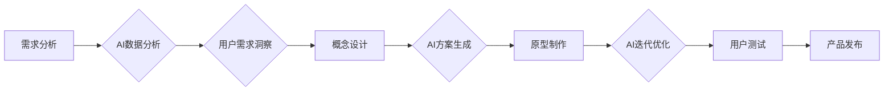

> AI辅助设计，产品设计流程，机器学习，深度学习，自然语言处理，用户体验，设计优化

## 1. 背景介绍

在当今科技飞速发展的时代，人工智能（AI）正在深刻地改变着各个领域，包括产品设计。传统的产品设计流程往往耗时费力，依赖于设计师的经验和直觉，难以满足快速迭代和个性化需求。而AI技术的介入，为产品设计带来了全新的可能性，能够有效地优化设计流程，提升设计效率和质量。

AI辅助产品设计是指利用人工智能技术辅助设计师进行产品设计全流程，从需求分析、概念设计、原型制作到用户测试，各个环节都可以得到AI的智能支持。AI可以帮助设计师快速收集和分析用户数据，洞察用户需求，生成设计方案，并进行迭代优化，最终实现更符合用户需求的产品。

## 2. 核心概念与联系

### 2.1 AI辅助设计核心概念

* **机器学习（Machine Learning）：** 
AI系统通过学习大量数据，发现数据中的模式和规律，从而进行预测和决策。在产品设计中，机器学习可以用于分析用户行为数据，预测用户需求，生成设计方案。

* **深度学习（Deep Learning）：** 
深度学习是机器学习的一种高级形式，利用多层神经网络模拟人类大脑的学习过程。深度学习在图像识别、自然语言处理等领域取得了突破性进展，可以应用于产品设计中的图像生成、文本分析等任务。

* **自然语言处理（Natural Language Processing）：** 
自然语言处理是指让计算机能够理解和处理人类语言。在产品设计中，自然语言处理可以用于分析用户反馈，理解用户需求，并生成相应的设计方案。

* **用户体验（User Experience）：** 
用户体验是指用户使用产品时所感受到的整体感受。AI辅助设计可以帮助设计师更好地理解用户体验，并设计出更符合用户需求的产品。

### 2.2 AI辅助设计流程



## 3. 核心算法原理 & 具体操作步骤

### 3.1 算法原理概述

AI辅助产品设计中常用的算法包括：

* **推荐算法：** 基于用户历史行为和偏好，推荐相关产品或设计方案。
* **生成对抗网络（GAN）：** 利用两个神经网络相互对抗，生成逼真的图像或设计方案。
* **强化学习（Reinforcement Learning）：** 通过奖励机制，训练AI模型优化设计方案。

### 3.2 算法步骤详解

以推荐算法为例，其具体操作步骤如下：

1. **数据收集：** 收集用户行为数据，例如浏览历史、购买记录、评价信息等。
2. **数据预处理：** 对收集到的数据进行清洗、转换和特征提取。
3. **模型训练：** 利用机器学习算法，训练推荐模型，例如协同过滤算法、内容过滤算法等。
4. **模型评估：** 使用测试数据评估模型的性能，例如准确率、召回率等。
5. **模型部署：** 将训练好的模型部署到线上系统，为用户提供个性化的产品推荐。

### 3.3 算法优缺点

**优点：**

* **个性化推荐：** 根据用户需求，提供个性化的产品推荐。
* **提高效率：** 自动化推荐过程，节省设计师的时间和精力。
* **数据驱动：** 基于数据分析，优化设计方案。

**缺点：**

* **数据依赖：** 推荐算法需要大量数据进行训练，数据质量直接影响推荐效果。
* **算法复杂：** 训练和部署推荐模型需要一定的技术难度。
* **黑盒问题：** 一些推荐算法的决策过程难以解释，难以理解推荐结果背后的原因。

### 3.4 算法应用领域

AI辅助设计算法广泛应用于以下领域：

* **电子产品设计：** 推荐手机、电脑、智能家居等产品的设计方案。
* **服装设计：** 根据用户体型和喜好，推荐服装款式和搭配方案。
* **家具设计：** 根据用户需求和家居风格，推荐家具款式和布局方案。
* **游戏设计：** 根据玩家喜好和游戏类型，推荐游戏关卡和角色设计方案。

## 4. 数学模型和公式 & 详细讲解 & 举例说明

### 4.1 数学模型构建

在AI辅助产品设计中，常用的数学模型包括：

* **协同过滤模型：** 用于推荐基于用户相似性和物品相似性的产品。
* **内容过滤模型：** 用于推荐基于用户兴趣和物品特征的产品。
* **深度神经网络模型：** 用于生成逼真的图像或设计方案。

### 4.2 公式推导过程

以协同过滤模型为例，其核心公式为：

$$
r_{ui} = \mu + b_u + b_i + \epsilon_{ui}
$$

其中：

* $r_{ui}$ 表示用户 $u$ 对物品 $i$ 的评分。
* $\mu$ 表示全局平均评分。
* $b_u$ 表示用户 $u$ 的偏差。
* $b_i$ 表示物品 $i$ 的偏差。
* $\epsilon_{ui}$ 表示评分误差。

### 4.3 案例分析与讲解

假设我们有一个电影推荐系统，用户 $u$ 对电影 $i$ 的评分为 4 分。我们可以使用协同过滤模型来预测用户 $u$ 对其他电影的评分。

首先，我们需要收集用户对电影的评分数据，并计算全局平均评分 $\mu$、用户偏差 $b_u$ 和电影偏差 $b_i$。然后，我们可以使用上述公式来预测用户 $u$ 对其他电影的评分。

## 5. 项目实践：代码实例和详细解释说明

### 5.1 开发环境搭建

* **操作系统：** Ubuntu 20.04
* **编程语言：** Python 3.8
* **深度学习框架：** TensorFlow 2.0
* **数据处理库：** Pandas
* **可视化库：** Matplotlib

### 5.2 源代码详细实现

```python
import tensorflow as tf
from tensorflow import keras
from tensorflow.keras import layers

# 定义模型结构
model = keras.Sequential(
    [
        layers.Input(shape=(10,)),  # 输入层，假设每个用户特征为10维
        layers.Dense(64, activation="relu"),  # 全连接层，64个神经元，ReLU激活函数
        layers.Dense(32, activation="relu"),  # 全连接层，32个神经元，ReLU激活函数
        layers.Dense(1),  # 输出层，1个神经元，预测评分
    ]
)

# 编译模型
model.compile(
    optimizer="adam", loss="mse", metrics=["mae"]
)  # 使用Adam优化器，均方误差损失函数，平均绝对误差指标

# 训练模型
model.fit(
    x_train, y_train, epochs=10, batch_size=32
)  # 使用训练数据训练模型，10个epoch，每次训练32个样本

# 预测评分
predictions = model.predict(x_test)  # 使用测试数据预测评分
```

### 5.3 代码解读与分析

* **模型结构：** 该代码定义了一个简单的多层感知机模型，用于预测用户对电影的评分。模型包含三个全连接层和一个输出层。
* **编译模型：** 使用Adam优化器、均方误差损失函数和平均绝对误差指标来编译模型。
* **训练模型：** 使用训练数据训练模型，设置10个epoch和32个样本的batch size。
* **预测评分：** 使用测试数据预测评分。

### 5.4 运行结果展示

训练完成后，我们可以使用测试数据评估模型的性能，例如计算平均绝对误差（MAE）。

## 6. 实际应用场景

### 6.1 产品设计流程优化

AI辅助设计可以优化产品设计流程，例如：

* **快速生成设计方案：** AI可以根据用户需求，快速生成多个设计方案供设计师选择。
* **迭代优化设计方案：** AI可以根据用户反馈，对设计方案进行迭代优化，最终生成更符合用户需求的产品。
* **自动化设计任务：** AI可以自动化一些重复性的设计任务，例如生成草图、绘制图标等，释放设计师的时间和精力。

### 6.2 个性化产品定制

AI辅助设计可以帮助企业提供个性化产品定制服务，例如：

* **根据用户体型和喜好，定制服装款式和尺寸。**
* **根据用户家居风格和需求，定制家具款式和布局。**
* **根据用户游戏喜好和游戏类型，定制游戏关卡和角色设计。**

### 6.3 用户体验提升

AI辅助设计可以帮助设计师更好地理解用户体验，并设计出更符合用户需求的产品，例如：

* **分析用户行为数据，洞察用户使用习惯和痛点。**
* **生成用户界面原型，进行用户测试和迭代优化。**
* **根据用户反馈，改进产品功能和设计细节。**

### 6.4 未来应用展望

AI辅助产品设计技术还在不断发展，未来将有更多新的应用场景和可能性，例如：

* **虚拟现实（VR）和增强现实（AR）辅助设计：** 利用VR和AR技术，为设计师提供沉浸式的设计体验，并帮助用户更好地理解产品设计。
* **跨模态设计：** 将文本、图像、音频等多种模态数据融合在一起，实现更全面的产品设计。
* **自动生成设计代码：** 利用AI技术，自动生成产品设计代码，提高设计效率。

## 7. 工具和资源推荐

### 7.1 学习资源推荐

* **书籍：**
    * 《深度学习》
    * 《机器学习实战》
    * 《自然语言处理入门》
* **在线课程：**
    * Coursera
    * edX
    * Udacity

### 7.2 开发工具推荐

* **TensorFlow：** 开源深度学习框架
* **PyTorch：** 开源深度学习框架
* **Keras：** 高级深度学习API

### 7.3 相关论文推荐

* **Generative Adversarial Networks**
* **Attention Is All You Need**
* **BERT: Pre-training of Deep Bidirectional Transformers for Language Understanding**

## 8. 总结：未来发展趋势与挑战

### 8.1 研究成果总结

AI辅助产品设计技术取得了显著的进展，能够有效地优化设计流程，提升设计效率和质量。

### 8.2 未来发展趋势

未来，AI辅助产品设计技术将朝着以下方向发展：

* **更智能的算法：** 开发更智能、更精准的AI算法，能够更好地理解用户需求和设计意图。
* **更丰富的模态数据：** 将文本、图像、音频等多种模态数据融合在一起，实现更全面的产品设计。
* **更沉浸式的体验：** 利用VR和AR技术，为设计师提供更沉浸式的设计体验。

### 8.3 面临的挑战

AI辅助产品设计技术也面临着一些挑战：

* **数据质量问题：** AI算法需要大量高质量的数据进行训练，而获取高质量的数据仍然是一个难题。
* **算法解释性问题：** 一些AI算法的决策过程难以解释，难以理解推荐结果背后的原因。
* **伦理问题：** AI辅助设计可能会带来一些伦理问题，例如数据隐私、算法偏见等。

### 8.4 研究展望

未来，我们需要继续加强对AI辅助产品设计技术的研发，解决技术难题，并关注其伦理和社会影响，推动其健康发展。

## 9. 附录：常见问题与解答

### 9.1 Q1：AI辅助设计是否会取代设计师？

**A1：** AI辅助设计不会取代设计师，而是会成为设计师的强大工具，帮助设计师更高效地完成设计工作。设计师仍然需要发挥其创造力和审美能力，引导AI技术，最终设计出更优秀的产品。

