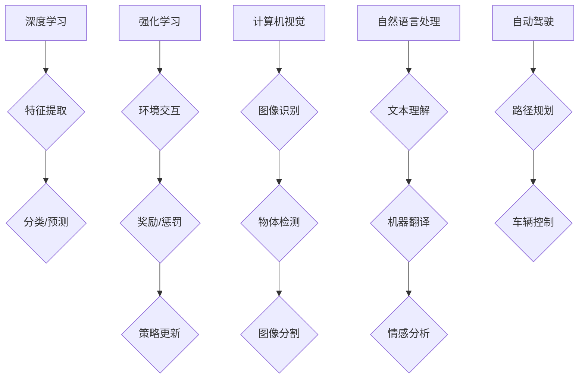

> 人工智能，深度学习，强化学习，计算机视觉，自然语言处理，自动驾驶，伦理

## 1. 背景介绍

人工智能（AI）正以惊人的速度发展，深刻地改变着我们生活的方方面面。从智能手机的语音助手到自动驾驶汽车，AI技术已经渗透到我们的日常生活中。作为AI领域的领军人物之一，Andrej Karpathy 博士的观点和研究成果对未来AI发展趋势具有重要的参考价值。

Andrej Karpathy 博士是特斯拉自动驾驶团队的负责人，也是一位享誉全球的计算机科学家和深度学习专家。他曾在OpenAI、Google Brain等顶尖机构工作，并发表了许多重要的学术论文。他的研究领域涵盖深度学习、计算机视觉、自然语言处理等多个领域，对AI技术的进步做出了巨大贡献。

## 2. 核心概念与联系

**2.1 深度学习**

深度学习是机器学习的一个子领域，它利用多层神经网络来模拟人类大脑的学习过程。通过训练大量的样本数据，深度学习模型能够自动学习特征，并进行复杂的模式识别和预测。

**2.2 强化学习**

强化学习是一种基于奖励机制的机器学习方法。在强化学习中，一个智能体通过与环境交互，不断尝试不同的行动，并根据环境的反馈获得奖励或惩罚。智能体的目标是学习一个策略，使得在与环境交互的过程中获得最大的总奖励。

**2.3 计算机视觉**

计算机视觉是人工智能的一个重要分支，它致力于使计算机能够“看”和理解图像和视频。计算机视觉技术广泛应用于图像识别、物体检测、图像分割等领域。

**2.4 自然语言处理**

自然语言处理（NLP）是人工智能的一个重要领域，它致力于使计算机能够理解和处理人类语言。NLP技术广泛应用于机器翻译、文本摘要、情感分析等领域。

**2.5 自动驾驶**

自动驾驶是人工智能的一个应用领域，它利用计算机视觉、传感器数据和强化学习技术，使车辆能够自动驾驶。

**2.6 伦理问题**

随着人工智能技术的快速发展，其伦理问题也日益受到关注。例如，AI算法的偏见、数据隐私保护、AI技术的滥用等问题都需要得到认真思考和解决。

**Mermaid 流程图**



## 3. 核心算法原理 & 具体操作步骤

### 3.1 算法原理概述

深度学习算法的核心是多层神经网络。神经网络由多个层组成，每一层都包含多个神经元。神经元之间通过连接进行信息传递，每个连接都有一个权重。通过训练数据，神经网络可以调整连接权重，从而学习特征和模式。

### 3.2 算法步骤详解

1. **数据预处理:** 将原始数据转换为深度学习模型可以理解的格式。
2. **网络结构设计:** 根据任务需求设计神经网络的结构，包括层数、神经元数量、激活函数等。
3. **参数初始化:** 为神经网络的参数（权重和偏置）进行随机初始化。
4. **前向传播:** 将输入数据通过神经网络进行传递，计算输出结果。
5. **损失函数计算:** 计算模型输出与真实值的差异，即损失值。
6. **反向传播:** 根据损失值，反向传播误差信号，更新神经网络的参数。
7. **迭代训练:** 重复前向传播、损失函数计算和反向传播的过程，直到模型性能达到预期水平。

### 3.3 算法优缺点

**优点:**

* 能够自动学习特征，无需人工特征工程。
* 能够处理复杂的数据模式。
* 在图像识别、自然语言处理等领域取得了突破性进展。

**缺点:**

* 需要大量的训练数据。
* 训练过程耗时和耗能。
* 模型解释性较差。

### 3.4 算法应用领域

* **计算机视觉:** 图像识别、物体检测、图像分割、人脸识别等。
* **自然语言处理:** 机器翻译、文本摘要、情感分析、对话系统等。
* **语音识别:** 语音转文本、语音助手等。
* **推荐系统:** 商品推荐、内容推荐等。
* **医疗诊断:** 病情诊断、疾病预测等。

## 4. 数学模型和公式 & 详细讲解 & 举例说明

### 4.1 数学模型构建

深度学习模型的核心是神经网络，其数学模型可以表示为一系列的线性变换和非线性激活函数。

**线性变换:**

$$
y = Wx + b
$$

其中，$x$ 是输入向量，$W$ 是权重矩阵，$b$ 是偏置向量，$y$ 是线性变换后的输出向量。

**非线性激活函数:**

$$
f(y)
$$

激活函数的作用是引入非线性，使得神经网络能够学习更复杂的模式。常见的激活函数包括 sigmoid 函数、ReLU 函数、tanh 函数等。

### 4.2 公式推导过程

深度学习模型的训练过程是通过优化损失函数来实现的。损失函数衡量模型预测结果与真实值的差异。常用的损失函数包括均方误差（MSE）、交叉熵损失等。

**均方误差 (MSE):**

$$
L = \frac{1}{n} \sum_{i=1}^{n} (y_i - \hat{y}_i)^2
$$

其中，$y_i$ 是真实值，$\hat{y}_i$ 是模型预测值，$n$ 是样本数量。

**交叉熵损失:**

$$
L = -\sum_{i=1}^{n} y_i \log(\hat{y}_i)
$$

其中，$y_i$ 是真实值，$\hat{y}_i$ 是模型预测值。

通过梯度下降算法，可以更新神经网络的参数，使得损失函数最小化。

### 4.3 案例分析与讲解

**图像分类:**

假设我们有一个图像分类任务，目标是将图像分类为不同的类别（例如猫、狗、鸟）。我们可以使用卷积神经网络（CNN）来解决这个问题。CNN 可以自动学习图像特征，并将其用于分类。

**自然语言处理:**

假设我们有一个机器翻译任务，目标是将英文文本翻译成中文文本。我们可以使用循环神经网络（RNN）来解决这个问题。RNN 可以处理序列数据，并学习语言的语法和语义。

## 5. 项目实践：代码实例和详细解释说明

### 5.1 开发环境搭建

* Python 3.x
* TensorFlow 或 PyTorch
* CUDA 和 cuDNN (可选，用于GPU加速)

### 5.2 源代码详细实现

```python
# 使用 TensorFlow 实现一个简单的线性回归模型

import tensorflow as tf

# 定义模型输入和输出
model_input = tf.keras.Input(shape=(1,))
model_output = tf.keras.layers.Dense(1)(model_input)

# 创建模型
model = tf.keras.Model(inputs=model_input, outputs=model_output)

# 编译模型
model.compile(optimizer='adam', loss='mse')

# 训练模型
model.fit(x_train, y_train, epochs=10)

# 评估模型
loss = model.evaluate(x_test, y_test)
```

### 5.3 代码解读与分析

* `tf.keras.Input` 定义模型的输入层。
* `tf.keras.layers.Dense` 定义一个全连接层。
* `model.compile` 编译模型，指定优化器、损失函数和指标。
* `model.fit` 训练模型，传入训练数据和训练轮数。
* `model.evaluate` 评估模型，传入测试数据。

### 5.4 运行结果展示

训练完成后，我们可以使用模型预测新的数据。

```python
# 使用模型预测新的数据
predictions = model.predict(new_data)
```

## 6. 实际应用场景

### 6.1 自动驾驶

自动驾驶汽车利用计算机视觉、传感器数据和强化学习技术，实现自动驾驶功能。

### 6.2 医疗诊断

AI 算法可以辅助医生进行疾病诊断，例如识别肿瘤、预测患者风险等。

### 6.3 金融风险管理

AI 算法可以分析金融数据，识别潜在的风险，并帮助金融机构进行风险管理。

### 6.4 未来应用展望

AI 技术的应用场景还在不断扩展，未来将应用于更多领域，例如教育、娱乐、制造业等。

## 7. 工具和资源推荐

### 7.1 学习资源推荐

* **书籍:**
    * 深度学习 (Deep Learning) - Ian Goodfellow, Yoshua Bengio, Aaron Courville
    * 人工智能：一种现代方法 (Artificial Intelligence: A Modern Approach) - Stuart Russell, Peter Norvig
* **在线课程:**
    * Coursera: 深度学习 Specialization
    * Udacity: 
    * fast.ai: Practical Deep Learning for Coders

### 7.2 开发工具推荐

* **TensorFlow:** 开源深度学习框架
* **PyTorch:** 开源深度学习框架
* **Keras:** 高级深度学习API

### 7.3 相关论文推荐

* **ImageNet Classification with Deep Convolutional Neural Networks** - Alex Krizhevsky, Ilya Sutskever, Geoffrey E. Hinton
* **Attention Is All You Need** - Ashish Vaswani, Noam Shazeer, Niki Parmar, Jakob Uszkoreit, Llion Jones, Aidan N Gomez, Łukasz Kaiser, Illia Polosukhin

## 8. 总结：未来发展趋势与挑战

### 8.1 研究成果总结

近年来，AI 技术取得了长足的进步，在多个领域取得了突破性进展。例如，计算机视觉、自然语言处理等领域取得了显著的成果。

### 8.2 未来发展趋势

* **更强大的模型:** 研究人员将继续开发更强大的AI模型，例如Transformer模型的升级版。
* **更广泛的应用:** AI 技术将应用于更多领域，例如教育、医疗、制造业等。
* **更强的解释性:** 研究人员将致力于提高AI模型的解释性，使得人类能够更好地理解AI模型的决策过程。

### 8.3 面临的挑战

* **数据隐私保护:** AI 模型的训练需要大量数据，如何保护数据隐私是一个重要的挑战。
* **算法偏见:** AI 算法可能存在偏见，导致不公平的结果。
* **AI 伦理问题:** AI 技术的快速发展引发了伦理问题，例如AI的责任归属、AI的滥用等。

### 8.4 研究展望

未来，AI 研究将继续朝着更安全、更可靠、更可解释的方向发展。

## 9. 附录：常见问题与解答

**Q1: 深度学习和机器学习有什么区别？**

**A1:** 深度学习是机器学习的一个子领域，它利用多层神经网络来模拟人类大脑的学习过程。

**Q2: 如何选择合适的深度学习框架？**

**A2:** TensorFlow 和 PyTorch 是两个流行的深度学习框架，选择哪个框架取决于个人喜好和项目需求。

**Q3: 如何解决AI算法的偏见问题？**

**A3:** 

* 使用更公平的训练数据。
* 开发算法来检测和缓解偏见。
* 提高对AI算法偏见的认识和关注。

作者：禅与计算机程序设计艺术 / Zen and the Art of Computer Programming


<end_of_turn>