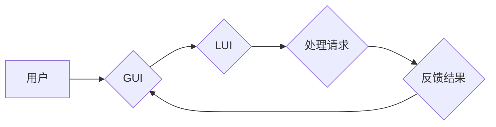

> GUI, LUI, CUI, 交互设计, 人机交互, 协同工作, 混合界面, 用户体验

## 1. 背景介绍

随着计算机技术的发展，用户界面 (User Interface, UI) 的设计和交互方式也经历了从命令行界面 (Command Line Interface, CLI) 到图形用户界面 (Graphical User Interface, GUI) 的演变。GUI 以其直观、易用、用户友好等特点，迅速成为主流的交互方式。然而，随着人工智能 (AI) 和自然语言处理 (NLP) 技术的进步，新的交互方式，例如语言用户界面 (Language User Interface, LUI)，也逐渐崭露头角。

LUI 允许用户使用自然语言与计算机进行交互，无需学习复杂的命令或操作图形元素。它具有更自然的、更人性化的交互体验，尤其适合需要处理大量文本信息或进行复杂操作的用户。

然而，GUI 和 LUI 并非完全替代关系，它们各自拥有独特的优势和局限性。GUI 擅长于直观地展示信息和操作，而 LUI 则更擅长于处理文本信息和理解用户意图。因此，将 GUI 和 LUI 结合起来，构建混合界面，可以充分发挥两者各自的优势，为用户提供更丰富、更智能的交互体验。

## 2. 核心概念与联系

### 2.1 GUI、LUI 和 CUI 的关系

* **CUI (Command Line Interface)**：命令行界面是早期计算机交互方式，用户通过输入文本命令与计算机进行交互。
* **GUI (Graphical User Interface)**：图形用户界面以图形元素和菜单为主要交互方式，用户通过鼠标点击、拖动等操作与计算机进行交互。
* **LUI (Language User Interface)**：语言用户界面允许用户使用自然语言与计算机进行交互，例如用口语或文字指令。

### 2.2 GUI 与 LUI 的协同工作

GUI 和 LUI 的协同工作是指将两种不同的交互方式结合起来，为用户提供更灵活、更智能的交互体验。

**协同工作模式:**

* **GUI 作为主界面，LUI 作为辅助工具:** 用户主要通过 GUI 进行操作，而 LUI 可以用于执行一些复杂的操作、提供文本信息处理功能或理解用户意图。
* **LUI 作为主界面，GUI 作为辅助展示:** 用户主要通过 LUI 进行交互，而 GUI 可以用于展示一些需要直观展示的信息，例如图形、图表等。
* **混合界面:** GUI 和 LUI 混合在一起，用户可以根据需要切换不同的交互方式。

**协同工作优势:**

* **更丰富的交互体验:** 用户可以根据不同的场景和需求选择不同的交互方式。
* **更智能的交互:** LUI 可以理解用户的自然语言指令，提供更智能的交互体验。
* **更便捷的操作:** LUI 可以简化一些复杂的操作，提高用户操作效率。

**Mermaid 流程图:**



## 3. 核心算法原理 & 具体操作步骤

### 3.1 算法原理概述

GUI 与 LUI 的协同工作需要涉及到以下核心算法：

* **自然语言理解 (NLU):** 将用户的自然语言指令转换为计算机可以理解的指令。
* **对话管理 (Dialogue Management):** 管理用户与计算机之间的对话流程，理解用户意图并提供相应的响应。
* **图形界面渲染 (GUI Rendering):** 将计算机处理的结果以图形形式展示给用户。

### 3.2 算法步骤详解

1. **用户输入:** 用户通过 GUI 或 LUI 输入指令。
2. **NLU 处理:** 如果用户输入的是自然语言，则 NLU 算法将其转换为计算机可以理解的指令。
3. **对话管理:** 对话管理算法根据用户的指令理解用户的意图，并决定下一步的操作。
4. **数据处理:** 根据用户的意图，计算机处理相关数据并生成结果。
5. **GUI 渲染:** 如果需要以图形形式展示结果，则 GUI 渲染算法将结果以图形形式展示给用户。
6. **反馈结果:** 计算机将处理结果反馈给用户，用户可以根据结果进行下一步操作。

### 3.3 算法优缺点

**NLU 算法:**

* **优点:** 可以理解用户的自然语言指令，提供更人性化的交互体验。
* **缺点:** 理解复杂指令或具有歧义的语句的能力有限。

**对话管理算法:**

* **优点:** 可以管理用户与计算机之间的对话流程，提供更流畅的交互体验。
* **缺点:** 需要大量的训练数据才能达到较好的效果。

**GUI 渲染算法:**

* **优点:** 可以直观地展示信息和操作，提高用户操作效率。
* **缺点:** 需要考虑用户界面设计和用户体验等因素。

### 3.4 算法应用领域

GUI 与 LUI 的协同工作可以应用于以下领域:

* **智能家居:** 用户可以通过语音或文字指令控制智能家居设备。
* **医疗保健:** 用户可以通过语音或文字指令查询医疗信息、预约医生等。
* **教育:** 用户可以通过语音或文字指令进行学习、提问等。
* **客服:** 用户可以通过语音或文字指令与客服机器人进行交互。

## 4. 数学模型和公式 & 详细讲解 & 举例说明

### 4.1 数学模型构建

**NLU 模型:**

NLU 模型通常基于深度学习架构，例如 Transformer 模型。

**Transformer 模型:**

Transformer 模型是一种基于注意力机制的序列到序列模型，可以有效地处理自然语言文本。

**注意力机制:**

注意力机制可以帮助模型关注输入序列中与当前任务相关的部分，提高模型的理解能力。

**公式:**

注意力权重计算公式:

$$
\text{Attention}(Q, K, V) = \text{softmax}\left(\frac{QK^T}{\sqrt{d_k}}\right)V
$$

其中:

* $Q$：查询向量
* $K$：键向量
* $V$：值向量
* $d_k$：键向量的维度

**对话管理模型:**

对话管理模型通常基于状态机或强化学习算法。

**状态机:**

状态机可以表示对话流程，每个状态对应一个对话阶段。

**强化学习:**

强化学习算法可以训练对话管理模型，使其能够根据用户的输入做出最优的响应。

**公式:**

强化学习的奖励函数:

$$
R(s, a)
$$

其中:

* $s$：当前状态
* $a$：采取的动作

### 4.2 公式推导过程

**注意力机制公式推导:**

1. 计算查询向量 $Q$ 和键向量 $K$ 的点积: $QK^T$
2. 对点积结果进行归一化: $\frac{QK^T}{\sqrt{d_k}}$
3. 应用 softmax 函数计算注意力权重: $\text{softmax}\left(\frac{QK^T}{\sqrt{d_k}}\right)$
4. 将注意力权重与值向量 $V$ 进行加权求和: $\text{softmax}\left(\frac{QK^T}{\sqrt{d_k}}\right)V$

**强化学习奖励函数推导:**

奖励函数的设计需要根据具体的对话管理任务和目标进行定制。

一般来说，奖励函数应该鼓励模型做出能够推进对话进展和满足用户需求的响应。

### 4.3 案例分析与讲解

**NLU 模型案例:**

使用 BERT 模型进行文本分类任务，例如判断用户评论是正面还是负面。

**对话管理模型案例:**

使用状态机模型实现一个简单的问答机器人，能够回答用户关于天气、时间等基本问题的查询。

## 5. 项目实践：代码实例和详细解释说明

### 5.1 开发环境搭建

* 操作系统: Ubuntu 20.04
* Python 版本: 3.8
* 必要的库:

```
pip install transformers
pip install rasa
```

### 5.2 源代码详细实现

**NLU 模型实现:**

```python
from transformers import pipeline

# 加载预训练的 BERT 模型
classifier = pipeline("sentiment-analysis")

# 进行文本分类
result = classifier("这是一个很棒的电影!")

# 打印结果
print(result)
```

**对话管理模型实现:**

```python
from rasa.core.agent import Agent

# 加载对话管理模型
agent = Agent.load("models/dialogue_manager")

# 进行对话
while True:
    user_input = input("用户: ")
    response = agent.handle_text(user_input)
    print("机器人: ", response)
```

### 5.3 代码解读与分析

* **NLU 模型实现:**

该代码使用 Hugging Face 的 Transformers 库加载预训练的 BERT 模型进行文本分类。

* **对话管理模型实现:**

该代码使用 Rasa 库加载预训练的对话管理模型进行对话交互。

### 5.4 运行结果展示

**NLU 模型运行结果:**

```
[{'label': 'POSITIVE', 'score': 0.9998749755859375}]
```

**对话管理模型运行结果:**

```
用户: 你好
机器人: 你好！有什么可以帮你的吗？
用户: 天气怎么样？
机器人: 天气晴朗，温度25度。
```

## 6. 实际应用场景

### 6.1 智能客服

GUI 与 LUI 的协同工作可以构建智能客服系统，用户可以通过语音或文字指令与客服机器人进行交互，查询产品信息、解决问题等。

### 6.2 智能家居

用户可以通过语音或文字指令控制智能家居设备，例如调节灯光、温度、播放音乐等。

### 6.3 教育辅助系统

GUI 与 LUI 可以构建教育辅助系统，帮助学生学习、提问、完成作业等。

### 6.4 医疗诊断辅助系统

GUI 与 LUI 可以构建医疗诊断辅助系统，帮助医生分析患者症状、提供诊断建议等。

### 6.5 未来应用展望

GUI 与 LUI 的协同工作将更加深入，例如:

* **更智能的自然语言理解:** NLU 模型将能够理解更复杂的自然语言指令，提供更精准的响应。
* **更个性化的交互体验:** 系统将能够根据用户的个人喜好和需求定制交互方式。
* **更丰富的交互方式:** 除了语音和文字，还将会有更多新的交互方式，例如手势识别、表情识别等。

## 7. 工具和资源推荐

### 7.1 学习资源推荐

* **Hugging Face Transformers:** https://huggingface.co/docs/transformers/index
* **Rasa:** https://rasa.com/docs/
* **Stanford NLP Group:** https://nlp.stanford.edu/

### 7.2 开发工具推荐

* **Python:** https://www.python.org/
* **Jupyter Notebook:** https://jupyter.org/

### 7.3 相关论文推荐

* **BERT: Pre-training of Deep Bidirectional Transformers for Language Understanding:** https://arxiv.org/abs/1810.04805
* **Rasa: An Open-Source Framework for Building Conversational AI:** https://arxiv.org/abs/1907.06851

## 8. 总结：未来发展趋势与挑战

### 8.1 研究成果总结

GUI 与 LUI 的协同工作已经取得了一些成果，例如智能客服、智能家居等应用。

### 8.2 未来发展趋势

* **更智能的自然语言理解:** NLU 模型将更加强大，能够理解更复杂的自然语言指令。
* **更个性化的交互体验:** 系统将能够根据用户的个人喜好和需求定制交互方式。
* **更丰富的交互方式:** 除了语音和文字，还将会有更多新的交互方式，例如手势识别、表情识别等。

### 8.3 面临的挑战

* **数据标注:** 训练高质量的 NLU 模型需要大量的标注数据，这非常耗时和费力。
* **模型复杂度:** NLU 模型越来越复杂，训练和部署成本也越来越高。
* **用户体验:** 需要不断优化用户体验，使 GUI 与 LUI 的协