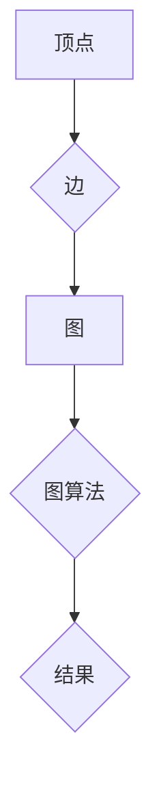

> GraphX, 图计算, Spark, 算法, 数据结构, 代码实例, 应用场景

## 1. 背景介绍

随着大数据时代的到来，海量数据的处理和分析成为越来越重要的课题。传统的关系型数据库难以有效地处理复杂网络结构的数据，而图数据库则更适合于存储和查询这种类型的结构化数据。然而，图数据库的存储和查询效率仍然存在局限性，尤其是在处理海量图数据时。

为了解决这个问题，Apache Spark 引入了 GraphX，一个用于图计算的强大框架。GraphX 基于 Spark 的分布式计算引擎，能够高效地处理海量图数据，并提供丰富的图算法和操作接口。

## 2. 核心概念与联系

GraphX 将图数据表示为顶点（Vertex）和边（Edge）的集合。顶点代表图中的实体，边代表实体之间的关系。GraphX 提供了两种主要的图数据结构：

* **邻接表（Adjacency List）:** 每个顶点存储与其相连的边和顶点的列表。
* **邻接矩阵（Adjacency Matrix）:** 使用一个二维矩阵表示图，其中矩阵元素表示顶点之间的连接关系。

GraphX 的核心概念包括：

* **图类型:** GraphX 支持两种类型的图：有向图和无向图。
* **顶点属性:** 每个顶点可以拥有自定义的属性，用于存储顶点相关的元数据。
* **边属性:** 每个边可以拥有自定义的属性，用于存储边相关的元数据。
* **图算法:** GraphX 提供了丰富的图算法，例如：
    * **最短路径算法:** 寻找图中两个顶点之间的最短路径。
    * **中心性算法:** 计算顶点在图中的重要性。
    * **聚类算法:** 将图中的顶点划分为不同的社区。



## 3. 核心算法原理 & 具体操作步骤

### 3.1  算法原理概述

GraphX 的图算法基于 Spark 的分布式计算模型，将图数据并行处理，并利用 MapReduce 的思想进行计算。

### 3.2  算法步骤详解

1. **数据加载:** 将图数据加载到 Spark 的分布式内存中。
2. **数据转换:** 使用 GraphX 的 API 对图数据进行转换，例如：
    * **过滤顶点:** 根据顶点属性筛选出满足条件的顶点。
    * **添加边:** 添加新的边到图中。
    * **删除边:** 删除图中的边。
3. **算法执行:** 使用 GraphX 提供的图算法对转换后的图数据进行计算。
4. **结果输出:** 将计算结果输出到文件或其他存储系统。

### 3.3  算法优缺点

**优点:**

* **高性能:** 基于 Spark 的分布式计算模型，能够高效处理海量图数据。
* **易用性:** 提供了丰富的 API 和样例代码，方便用户使用。
* **灵活性:** 支持多种图数据结构和图算法。

**缺点:**

* **内存占用:** 处理大型图数据时，内存占用可能会比较高。
* **复杂度:** 对于复杂的图算法，实现过程可能会比较复杂。

### 3.4  算法应用领域

GraphX 的图算法广泛应用于以下领域:

* **社交网络分析:** 分析用户之间的关系，发现社区结构和影响力。
* **推荐系统:** 基于用户行为和商品关系进行商品推荐。
* **欺诈检测:** 识别异常行为和潜在的欺诈活动。
* **知识图谱构建:** 建立知识图谱，用于知识表示和推理。

## 4. 数学模型和公式 & 详细讲解 & 举例说明

### 4.1  数学模型构建

GraphX 中的图数据可以用数学模型来表示。一个图可以表示为一个有序对 $(V, E)$，其中：

* $V$ 是顶点集，表示图中的所有实体。
* $E$ 是边集，表示实体之间的关系。

### 4.2  公式推导过程

GraphX 中的许多算法都基于图论中的基本公式和定理。例如，最短路径算法可以使用 Dijkstra 算法来计算，其核心公式如下：

$$d(u, v) = min_{w \in N(u)} \{d(u, w) + w(u, v)\}$$

其中：

* $d(u, v)$ 表示顶点 $u$ 到顶点 $v$ 的最短路径长度。
* $N(u)$ 表示顶点 $u$ 的邻居顶点集。
* $w(u, v)$ 表示顶点 $u$ 到顶点 $v$ 的边权重。

### 4.3  案例分析与讲解

例如，假设我们有一个图，其中顶点表示城市，边表示城市之间的交通路线。我们可以使用 Dijkstra 算法计算从城市 A 到城市 B 的最短路径长度。

## 5. 项目实践：代码实例和详细解释说明

### 5.1  开发环境搭建

为了使用 GraphX，需要先搭建一个 Spark 开发环境。

### 5.2  源代码详细实现

```python
from pyspark.sql import SparkSession
from graphx import GraphX

# 创建 SparkSession
spark = SparkSession.builder.appName("GraphXExample").getOrCreate()

# 加载图数据
graph = GraphX.from_edgelist(spark, "edges.txt")

# 执行图算法
result = graph.shortest_paths(source=1, target=5)

# 打印结果
result.show()

# 关闭 SparkSession
spark.stop()
```

### 5.3  代码解读与分析

* `from pyspark.sql import SparkSession`: 导入 SparkSession 类，用于创建 Spark 应用。
* `from graphx import GraphX`: 导入 GraphX 类，用于创建图对象。
* `spark = SparkSession.builder.appName("GraphXExample").getOrCreate()`: 创建一个名为 "GraphXExample" 的 Spark 应用。
* `graph = GraphX.from_edgelist(spark, "edges.txt")`: 从 "edges.txt" 文件中加载图数据，并创建 GraphX 图对象。
* `result = graph.shortest_paths(source=1, target=5)`: 使用 shortest_paths 方法计算从顶点 1 到顶点 5 的最短路径。
* `result.show()`: 打印计算结果。
* `spark.stop()`: 关闭 Spark 应用。

### 5.4  运行结果展示

运行代码后，将输出从顶点 1 到顶点 5 的最短路径信息。

## 6. 实际应用场景

GraphX 在实际应用中具有广泛的应用场景，例如：

* **社交网络分析:** 分析用户之间的关系，发现社区结构和影响力。
* **推荐系统:** 基于用户行为和商品关系进行商品推荐。
* **欺诈检测:** 识别异常行为和潜在的欺诈活动。
* **知识图谱构建:** 建立知识图谱，用于知识表示和推理。

### 6.4  未来应用展望

随着大数据和人工智能技术的不断发展，GraphX 的应用场景将会更加广泛。例如：

* **智能推荐:** 基于用户行为和商品关系，提供更精准的个性化推荐。
* **网络安全:** 利用图算法识别网络攻击和恶意行为。
* **生物信息学:** 分析生物网络和蛋白质相互作用关系。

## 7. 工具和资源推荐

### 7.1  学习资源推荐

* **Apache Spark 官方文档:** https://spark.apache.org/docs/latest/
* **GraphX 官方文档:** https://spark.apache.org/docs/latest/graphx-programming-guide.html
* **GraphX 入门教程:** https://spark.apache.org/docs/latest/graphx-programming-guide.html#graphx-tutorial

### 7.2  开发工具推荐

* **Spark IDE:** https://spark.apache.org/docs/latest/spark-shell.html
* **PyCharm:** https://www.jetbrains.com/pycharm/

### 7.3  相关论文推荐

* **GraphX: A Graph Processing Framework on Spark**
* **Scalable Graph Algorithms on Spark**

## 8. 总结：未来发展趋势与挑战

### 8.1  研究成果总结

GraphX 作为 Apache Spark 的图计算框架，为大规模图数据处理提供了高效的解决方案。其基于分布式计算模型，并提供丰富的图算法和操作接口，能够满足各种图计算需求。

### 8.2  未来发展趋势

GraphX 将会继续朝着以下方向发展：

* **性能优化:** 进一步提升 GraphX 的性能，使其能够处理更大的图数据。
* **算法扩展:** 开发更多新的图算法，满足更广泛的应用需求。
* **易用性提升:** 提供更友好的 API 和开发工具，降低用户使用门槛。

### 8.3  面临的挑战

GraphX 还面临一些挑战，例如：

* **内存占用:** 处理大型图数据时，内存占用可能会比较高。
* **复杂度:** 对于复杂的图算法，实现过程可能会比较复杂。
* **生态系统建设:** 需要进一步完善 GraphX 的生态系统，包括工具、库和社区支持。

### 8.4  研究展望

未来，GraphX 将会继续成为图计算领域的重要框架，并推动图计算技术的进一步发展。


## 9. 附录：常见问题与解答

### 9.1  常见问题

* **如何安装 GraphX？**
* **如何使用 GraphX 加载图数据？**
* **如何使用 GraphX 执行图算法？**
* **如何优化 GraphX 的性能？**

### 9.2  解答

...

作者：禅与计算机程序设计艺术 / Zen and the Art of Computer Programming


<end_of_turn>