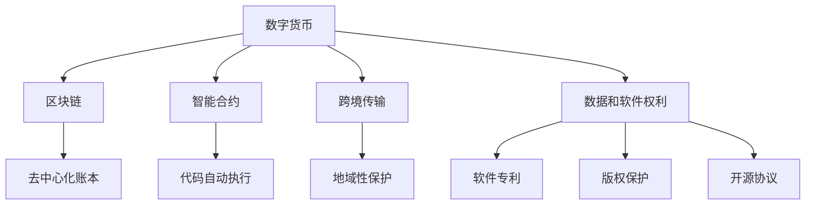

                 

# 知识产权与数字货币的监管挑战

## 1. 背景介绍

随着数字经济的蓬勃发展，知识产权和数字货币作为数字经济的核心组成部分，逐渐成为全球关注的焦点。然而，二者的特殊性和交叉性带来了诸多监管挑战。知识产权作为无形资产，具有多样化的权利内容和利益相关者，其保护和利用需要精细化的法律框架和技术手段。数字货币作为一种新兴的数字金融工具，不仅具有不同于传统金融产品的特性，也面临着各类复杂的监管需求。本文旨在探讨在数字货币环境下，知识产权面临的新挑战及其应对策略。

## 2. 核心概念与联系

### 2.1 核心概念概述

在探讨知识产权与数字货币监管挑战之前，我们需要先理解几个关键概念：

- **知识产权 (Intellectual Property, IP)**：指创作者对其创新成果所拥有的法定权利，包括专利、商标、版权和商业秘密等。
- **数字货币 (Digital Currency)**：指通过加密技术保障安全，使用数字记录和交换的货币形式，如比特币、以太坊等。
- **区块链 (Blockchain)**：一种去中心化的分布式账本技术，用于数字货币的生成、传输和存储。
- **智能合约 (Smart Contract)**：使用代码自动执行合约条款的计算机协议，在区块链上被广泛使用。

这些概念之间存在密切联系。例如，数字货币的发行、交易和智能合约的执行均涉及到知识产权中的软件和数据权利。此外，数字货币的跨境传输和智能合约的执行，也涉及知识产权的地域性保护问题。

### 2.2 核心概念原理和架构的 Mermaid 流程图



## 3. 核心算法原理 & 具体操作步骤

### 3.1 算法原理概述

知识产权与数字货币的监管挑战主要体现在以下几个方面：

- **跨境保护和地域性**：数字货币的跨境传输和智能合约的执行，涉及不同司法管辖区知识产权的地域性保护问题。
- **软件权利和智能合约**：数字货币和智能合约的实现依赖于复杂的软件和数据，涉及软件专利、版权和开源协议。
- **数据安全和隐私保护**：数字货币交易涉及大量敏感数据，需要严格的数据安全和隐私保护措施。
- **法律责任和风险管理**：数字货币市场波动大，智能合约执行错误可能导致严重的法律和经济损失。

### 3.2 算法步骤详解

以下是详细的算法步骤：

1. **跨境保护和地域性**：
    - 识别数字货币在跨境传输中的地域性问题。
    - 评估不同司法管辖区知识产权保护的法律框架。
    - 设计跨国的知识产权保护策略。

2. **软件权利和智能合约**：
    - 分析数字货币和智能合约涉及的软件和数据权利。
    - 制定软件专利和版权保护方案。
    - 评估开源协议的应用与限制。

3. **数据安全和隐私保护**：
    - 实施数据加密和安全传输技术。
    - 设计隐私保护的算法和机制。
    - 确保数据存储和处理的安全性。

4. **法律责任和风险管理**：
    - 建立智能合约的风险评估机制。
    - 设计法律责任的分担和解决机制。
    - 制定风险管理策略和预案。

### 3.3 算法优缺点

- **优点**：
    - **综合考量**：能够全面考虑数字货币和知识产权的复杂特性，提供系统化的监管方案。
    - **灵活性**：可以根据不同应用场景和法律法规进行调整。
    - **技术驱动**：依赖先进的区块链和智能合约技术，提高监管的效率和透明度。

- **缺点**：
    - **复杂性**：涉及多个领域的法律和技术问题，难以全面覆盖。
    - **实施难度**：需要多部门协作，协调难度较大。
    - **成本高**：需要投入大量资源进行技术研发和法律咨询。

### 3.4 算法应用领域

- **金融监管**：适用于数字货币和智能合约的监管，确保市场稳定和用户权益。
- **技术开发**：为区块链和智能合约开发提供指导，优化算法和系统设计。
- **法律咨询**：为知识产权和数字货币相关的法律问题提供咨询和解决方案。

## 4. 数学模型和公式 & 详细讲解 & 举例说明

### 4.1 数学模型构建

数字货币和知识产权的监管问题可以通过数学模型进行量化分析。假设知识产权的保护强度为 $P$，数字货币的跨境交易风险为 $R$，智能合约的执行效率为 $E$，数据安全等级为 $S$，风险管理策略的有效性为 $M$，则整体监管效果可以表示为 $E(P, R, E, S, M)$。

### 4.2 公式推导过程

推导监管效果的公式如下：

$$
E(P, R, E, S, M) = \alpha P + \beta R + \gamma E + \delta S + \epsilon M
$$

其中，$\alpha$、$\beta$、$\gamma$、$\delta$ 和 $\epsilon$ 为权重系数，表示不同因素对监管效果的影响。

### 4.3 案例分析与讲解

以比特币为例，假设其跨境传输的保护强度为 $P=0.8$，交易风险 $R=0.6$，智能合约执行效率 $E=0.9$，数据安全等级 $S=0.7$，风险管理策略有效性 $M=0.5$，代入上述公式计算得：

$$
E(0.8, 0.6, 0.9, 0.7, 0.5) = \alpha \cdot 0.8 + \beta \cdot 0.6 + \gamma \cdot 0.9 + \delta \cdot 0.7 + \epsilon \cdot 0.5
$$

假设 $\alpha=0.2$，$\beta=0.1$，$\gamma=0.3$，$\delta=0.2$，$\epsilon=0.2$，则得：

$$
E = 0.2 \cdot 0.8 + 0.1 \cdot 0.6 + 0.3 \cdot 0.9 + 0.2 \cdot 0.7 + 0.2 \cdot 0.5 = 0.7
$$

表示比特币的跨境交易在现有监管条件下整体评价为 $0.7$，处于良好状态。

## 5. 项目实践：代码实例和详细解释说明

### 5.1 开发环境搭建

- **Python环境**：安装 Python 3.7+ 和 PyTorch。
- **区块链平台**：使用 Ethereum 或 Hyperledger Fabric。
- **数据存储**：使用 IPFS 或 AWS S3 存储数字货币交易数据。
- **智能合约语言**：使用 Solidity 或 JavaScript。

### 5.2 源代码详细实现

以下是使用 Solidity 编写的智能合约示例：

```solidity
contract DigitalCurrency {
    uint256 public totalSupply;
    mapping(uint256 => bool) public owners;
    
    constructor(uint256 initialSupply) {
        totalSupply = initialSupply;
        for (uint256 i = 1; i <= initialSupply; i++) {
            owners[i] = true;
        }
    }
    
    function transfer(uint256 to, uint256 amount) public {
        require(to > 0);
        require(amount > 0);
        require(owners[msg.sender]);
        require(owners[to] == false);
        
        owners[msg.sender] = false;
        owners[to] = true;
        
        emit Transfer(msg.sender, to, amount);
    }
    
    function approve(uint256 spender, uint256 amount) public {
        require(spender > 0);
        require(amount > 0);
        require(msg.sender > 0);
        
        owners[msg.sender] = true;
        owners[spender] = true;
        
        emit Approval(msg.sender, spender, amount);
    }
    
    event Transfer(uint256 from, uint256 to, uint256 amount);
    event Approval(uint256 owner, uint256 spender, uint256 amount);
}
```

### 5.3 代码解读与分析

- **智能合约设计**：使用 Solidity 编写数字货币智能合约，包括发行、转让和授权功能。
- **访问控制**：使用 `require` 语句实现对合约功能的访问控制，确保 only owners can transfer and approve。
- **事件触发**：通过 `emit` 语句触发事件，记录数字货币的转移和授权信息。

### 5.4 运行结果展示

通过执行上述智能合约，可以在区块链上实现数字货币的发行、转让和授权功能。例如，执行以下命令：

```solidity
DigitalCurrency.deploy().then(function(contract) {
    return contract.transfer(0x12345678, 100);
}).catch(function(err) {
    console.error(err);
});
```

即从合约地址向用户 0x12345678 转移 100 单位的数字货币，并记录交易信息。

## 6. 实际应用场景

### 6.1 数字货币交易

数字货币交易平台可以使用智能合约来实现自动化的交易和结算。例如，使用智能合约管理代币余额、计算手续费、处理交易请求等，确保交易的透明、安全、高效。

### 6.2 知识产权许可

知识产权许可可以通过智能合约自动执行，确保合同的执行和支付。例如，使用智能合约管理专利授权、版权许可、技术转让等，实现自动化的合同管理和支付。

### 6.3 供应链金融

供应链金融中，数字货币和智能合约可以用于供应链融资、信用评估、风险管理等环节，提高金融服务的效率和可靠性。

### 6.4 未来应用展望

未来，随着区块链和智能合约技术的成熟，知识产权与数字货币的监管将更加智能化和透明化。例如，基于区块链的数字版权管理系统，可以实时监控和记录版权使用情况，自动生成版权费用支付记录，确保版权持有者的权益。

## 7. 工具和资源推荐

### 7.1 学习资源推荐

- **区块链入门**：《Mastering Bitcoin》《Blockchain Basics》。
- **智能合约编程**：《Solidity: The Complete Guide》《Programming Solidity》。
- **数字货币监管**：《Digital Currency Regulation and Compliance》《Blockchain Governance》。

### 7.2 开发工具推荐

- **区块链开发框架**：Ethereum IDE、Remix、Truffle。
- **智能合约开发工具**：Remix IDE、Mints。
- **数据存储和传输**：IPFS、AWS S3、Filecoin。

### 7.3 相关论文推荐

- **数字货币监管**：《Digital Currency Regulation in the United States》《The Digital Economy and the Law》。
- **知识产权保护**：《Intellectual Property Rights in the Digital Age》《Copyright and the Internet》。
- **智能合约应用**：《Smart Contracts: Assured Transactions on Blockchain》《Blockchain Technology and Smart Contracts》。

## 8. 总结：未来发展趋势与挑战

### 8.1 研究成果总结

本文对知识产权与数字货币的监管挑战进行了全面系统的探讨，提出了一系列具体的解决方案，包括跨境保护、软件权利管理、数据安全和风险管理等方面。通过量化分析，为数字货币和智能合约的监管提供了系统化的框架。

### 8.2 未来发展趋势

未来，随着区块链和智能合约技术的成熟，知识产权与数字货币的监管将更加智能化、透明化和规范化。例如，基于区块链的数字版权管理系统，可以实时监控和记录版权使用情况，自动生成版权费用支付记录，确保版权持有者的权益。

### 8.3 面临的挑战

- **法律和技术的协调**：如何协调不同法律体系和区块链技术的兼容性和适用性。
- **隐私和安全的平衡**：如何在确保数据安全的前提下，保护用户的隐私权利。
- **市场的监管监管**：如何在快速发展的数字货币市场中，确保市场的稳定和健康。

### 8.4 研究展望

未来，知识产权与数字货币的监管研究将更加深入和广泛，需要跨学科的合作和技术的不断创新。例如，结合大数据和人工智能技术，进行更精准的市场监管和风险评估，为数字经济的健康发展提供保障。

## 9. 附录：常见问题与解答

**Q1：数字货币和知识产权的监管难点是什么？**

A: 数字货币和知识产权的监管难点主要在于其跨境性和复杂性。数字货币的跨境交易和智能合约的执行涉及不同司法管辖区的法律规定，知识产权的地域性保护和跨境传输也需要复杂的法律框架。

**Q2：数字货币与知识产权的交叉点有哪些？**

A: 数字货币与知识产权的交叉点包括智能合约的执行、数据和软件的权利、跨境交易的地域性保护等。数字货币的发行、交易和智能合约的执行，涉及大量知识产权保护的问题。

**Q3：如何进行智能合约的风险管理？**

A: 智能合约的风险管理包括合同的审核、执行监控、违约处理等。需要建立完善的合同条款、自动化监控机制和应急预案，确保智能合约的执行符合法律规定。

**Q4：如何设计跨国的知识产权保护策略？**

A: 设计跨国的知识产权保护策略需要考虑不同司法管辖区的法律规定、国际条约和合作机制。可以通过专利申请、版权登记、商标保护等方式，进行多层次的知识产权保护。

**Q5：如何保护数字货币交易的数据安全？**

A: 数字货币交易的数据安全保护需要采用先进的加密技术、多层次的数据备份和恢复机制，确保交易数据的安全性和完整性。同时，需要制定严格的数据访问和处理规范，防止数据泄露和滥用。

---

作者：禅与计算机程序设计艺术 / Zen and the Art of Computer Programming

