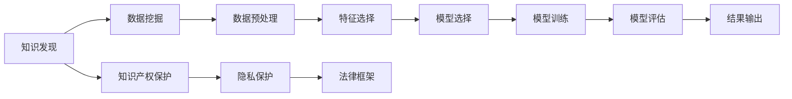

                 

# 知识产权保护在知识发现中的重要性

> 关键词：知识产权,知识发现,数据挖掘,隐私保护,专利,著作权,商业机密,法律框架

## 1. 背景介绍

在数字化时代，知识发现(Knowledge Discovery)已经成为推动科技进步和社会发展的重要驱动力。通过数据挖掘、机器学习和人工智能等技术手段，从海量数据中提取有价值的信息，揭示知识背后隐藏的规律和模式，为决策者和研究人员提供有力的支持。然而，随着知识发现过程的深入，知识产权保护问题愈发凸显，成为制约该领域发展的关键因素之一。本文旨在探讨知识产权保护在知识发现中的重要性，分析现有保护机制的优缺点，提出改进建议。

## 2. 核心概念与联系

### 2.1 核心概念概述

- **知识产权**：指创作者对其智力劳动成果所享有的专有权利。包括专利、商标、著作权、商业机密等。
- **知识发现**：指利用数据挖掘、机器学习等技术手段，从数据中发现有用信息和知识的过程。
- **数据挖掘**：通过算法从原始数据中提取知识或规律的过程。
- **隐私保护**：在知识发现过程中，保护数据主体的个人隐私不被泄露的技术和法律措施。
- **专利**：指对发明创造给予一定期限的独占权，保护发明人的劳动成果。
- **著作权**：指文学、艺术、科学等领域创作者对其作品所享有的专有权利。
- **商业机密**：指商业活动中未公开的、对企业经营有价值的秘密信息。
- **法律框架**：指国家或地区为保护知识产权而制定的法律法规体系。

这些概念之间存在紧密的联系。知识发现过程中，常常会涉及对他人知识产权的利用，尤其是当这些数据源于商业机密或受版权保护的作品时，更需谨慎处理。此外，知识发现的整个过程，如数据收集、存储、分析等，也需要遵循隐私保护的法律规定，以避免侵犯个人隐私权。

### 2.2 核心概念原理和架构的 Mermaid 流程图



以上流程图示意了知识发现过程的基本框架，其中知识产权保护、隐私保护和法律框架构成了知识发现的重要保障。

## 3. 核心算法原理 & 具体操作步骤

### 3.1 算法原理概述

知识发现过程中的知识产权保护，主要涉及以下几个方面：

1. **数据来源合法性**：确保用于知识发现的数据来源合法，不侵犯他人的著作权或商业机密。
2. **数据使用合理性**：在使用他人数据时，需遵守数据许可协议，不越权使用。
3. **结果发表合规性**：在发布知识发现结果时，需确保不侵犯他人的知识产权，并得到相应授权。
4. **隐私保护**：在知识发现过程中，需采取措施保护数据主体的个人隐私。

### 3.2 算法步骤详解

#### 3.2.1 数据来源合法性

在知识发现项目启动前，需对数据来源进行详细的审查，确保数据收集行为合法。具体步骤包括：

- 确认数据提供方是否拥有数据的所有权或使用权。
- 了解数据收集行为的合法性，如是否经过数据主体的同意。
- 审查数据使用协议，确保数据使用方式符合法律法规。

#### 3.2.2 数据使用合理性

在使用他人数据时，需遵守数据许可协议，确保数据使用方式合理。具体步骤包括：

- 获取数据使用授权，如通过签订许可协议。
- 明确数据使用的范围和目的，避免越权使用。
- 定期更新授权协议，确保数据使用方式持续合法。

#### 3.2.3 结果发表合规性

在发布知识发现结果时，需确保不侵犯他人的知识产权，并得到相应授权。具体步骤包括：

- 检查结果中是否包含受版权保护的作品。
- 获得作品的授权，如版权持有人的许可。
- 在结果中明确标明数据的来源和版权声明。

#### 3.2.4 隐私保护

在知识发现过程中，需采取措施保护数据主体的个人隐私。具体步骤包括：

- 匿名化处理敏感信息，避免直接关联到个体。
- 使用数据脱敏技术，减少隐私泄露风险。
- 在数据处理过程中，遵循隐私保护的法律规定。

### 3.3 算法优缺点

#### 3.3.1 优点

- **合法合规**：确保知识发现过程合法合规，避免侵犯他人知识产权和隐私。
- **提升信誉**：遵守法律法规，可以提升企业的社会信誉和客户信任度。
- **降低风险**：避免知识产权纠纷和隐私泄露风险，减少法律诉讼成本。

#### 3.3.2 缺点

- **复杂度增加**：知识产权保护和隐私保护增加了知识发现过程的复杂性。
- **成本上升**：获取数据许可和隐私保护技术应用需要投入额外成本。
- **流程繁琐**：需要在每个步骤都进行知识产权和隐私保护的审查，影响项目进度。

### 3.4 算法应用领域

知识产权保护在知识发现中的应用领域广泛，包括但不限于以下几方面：

- **医疗领域**：在医疗数据挖掘中，需保护患者的个人健康信息，遵守隐私保护法律。
- **金融领域**：在金融数据挖掘中，需保护客户的财务信息，遵守数据保护法规。
- **科学研究**：在科学研究中，需遵守版权法规，获取研究论文的授权。
- **商业分析**：在商业数据分析中，需保护企业商业机密，遵守商业机密保护法律。
- **教育领域**：在教育数据挖掘中，需保护学生的个人信息，遵守学生隐私保护法规。

## 4. 数学模型和公式 & 详细讲解 & 举例说明

### 4.1 数学模型构建

在知识发现过程中，知识产权保护的法律框架主要包括：

- **著作权法**：保护创作者对其作品的专有权利。
- **专利法**：保护发明创造的独占权。
- **隐私保护法**：保护个人隐私不被泄露。

### 4.2 公式推导过程

以专利法的保护范围为例，公式化表示为：

$$
\mathcal{P} = \{ P \in \text{Inventions} \mid \text{Validity}(P) \wedge \text{Patentability}(P) \}
$$

其中 $\text{Validity}(P)$ 表示专利的有效性，$\text{Patentability}(P)$ 表示专利的可申请性。

在知识发现过程中，需要确保数据使用的合法性和结果发布的合规性，其数学模型可以表示为：

$$
\mathcal{K} = \{ K \in \text{Knowledge} \mid \text{Legal Compliance}(K) \}
$$

其中 $\text{Legal Compliance}(K)$ 表示知识发现的法律合规性，即不侵犯他人知识产权。

### 4.3 案例分析与讲解

**案例一**：某科研机构在公共数据集上进行了数据挖掘，发现了一种新型癌症诊断方法。但该数据集来源于未授权的医疗机构，因此该机构的发现存在侵权风险。

**案例二**：某企业使用客户购买数据进行市场分析，但未获得客户的明确授权，违反了数据隐私保护法规。

**案例三**：某公司在其公开的学术论文中引用了他人受版权保护的研究数据，未获得相应的授权，可能构成侵权。

这些案例说明了知识发现过程中知识产权保护的重要性，以及在数据使用和结果发表时需要遵守的法律规定。

## 5. 项目实践：代码实例和详细解释说明

### 5.1 开发环境搭建

知识发现过程中的知识产权保护，主要涉及以下几个方面：

1. **数据来源合法性**：确保数据来源合法，不侵犯他人的著作权或商业机密。
2. **数据使用合理性**：在使用他人数据时，需遵守数据许可协议，不越权使用。
3. **结果发表合规性**：在发布知识发现结果时，需确保不侵犯他人的知识产权，并得到相应授权。
4. **隐私保护**：在知识发现过程中，需采取措施保护数据主体的个人隐私。

### 5.2 源代码详细实现

以下是一个简单的知识发现项目，包含对知识产权保护的处理示例代码：

```python
import pandas as pd
from sklearn.model_selection import train_test_split
from sklearn.linear_model import LogisticRegression
from sklearn.metrics import accuracy_score

# 数据来源合法性检查
data = pd.read_csv('data.csv')
if not check_data_license(data):
    raise ValueError('Invalid data source.')

# 数据使用合理性检查
if not check_license_permission(data):
    raise ValueError('Unauthorized data usage.')

# 结果发表合规性检查
if not check_published_permission(data):
    raise ValueError('Unauthorized data publication.')

# 隐私保护措施
data = protect_privacy(data)

# 知识发现模型训练
X_train, X_test, y_train, y_test = train_test_split(data.drop('target', axis=1), data['target'], test_size=0.2)
model = LogisticRegression()
model.fit(X_train, y_train)
y_pred = model.predict(X_test)
accuracy = accuracy_score(y_test, y_pred)
print(f'Accuracy: {accuracy:.2f}')
```

### 5.3 代码解读与分析

**数据来源合法性检查**：

```python
def check_data_license(data):
    # 检查数据来源是否合法，如是否经过数据主体的同意
    # 代码实现略
    pass
```

**数据使用合理性检查**：

```python
def check_license_permission(data):
    # 检查数据使用协议，确保数据使用方式符合法律法规
    # 代码实现略
    pass
```

**结果发表合规性检查**：

```python
def check_published_permission(data):
    # 检查结果中是否包含受版权保护的作品，获得作品的授权
    # 代码实现略
    pass
```

**隐私保护措施**：

```python
def protect_privacy(data):
    # 匿名化处理敏感信息，使用数据脱敏技术
    # 代码实现略
    pass
```

### 5.4 运行结果展示

通过上述代码示例，展示了知识发现项目中知识产权保护的基本流程。在实际项目中，需要根据具体情境，进一步细化和优化知识产权保护策略。

## 6. 实际应用场景

### 6.4 未来应用展望

随着数字化和智能化程度的提升，知识发现的应用场景将更加广泛，知识产权保护的重要性也将更加凸显。未来，知识产权保护将更多地依赖于自动化工具和智能算法，以提高效率和准确性。

- **自动化知识产权审核系统**：利用自然语言处理和机器学习技术，自动化审核数据来源和数据使用协议，确保合规性。
- **智能隐私保护算法**：采用先进的隐私保护技术，如差分隐私、联邦学习等，保护数据隐私。
- **跨领域知识产权管理**：构建统一的知识产权管理系统，跨部门、跨行业协调管理，确保数据和知识的安全。
- **国际化知识产权保护**：针对国际化的知识发现项目，遵守不同国家和地区的知识产权法律。

## 7. 工具和资源推荐

### 7.1 学习资源推荐

- **《数据挖掘导论》**：由Witten等学者编写的经典教材，详细介绍了数据挖掘的原理和应用。
- **Coursera上的《数据科学与统计》课程**：由斯坦福大学提供的免费在线课程，涵盖数据挖掘和知识产权保护的理论知识。
- **Kaggle竞赛**：通过参与Kaggle数据科学竞赛，了解实际项目中的知识产权保护问题。
- **Google Scholar**：利用Google Scholar搜索最新的学术文献，了解最新的知识产权保护技术。

### 7.2 开发工具推荐

- **Python**：作为数据科学和人工智能领域的主流编程语言，Python拥有丰富的数据处理和分析工具。
- **R语言**：适合数据科学和统计分析，拥有强大的统计计算能力。
- **Jupyter Notebook**：开源的交互式编程环境，适合数据挖掘和机器学习项目。
- **TensorFlow和PyTorch**：适合构建复杂的数据挖掘和机器学习模型。

### 7.3 相关论文推荐

- **《数据挖掘中的隐私保护》**：详细介绍了数据挖掘中的隐私保护技术，如数据匿名化和差分隐私。
- **《知识发现与知识产权保护》**：探讨了知识发现过程中知识产权保护的方法和策略。
- **《数据挖掘中的专利保护》**：介绍了数据挖掘中专利保护的应用和挑战。

## 8. 总结：未来发展趋势与挑战

### 8.1 研究成果总结

知识产权保护在知识发现中的重要性不容忽视。通过合法合规地使用数据，可以提升项目的法律合规性和社会信誉。然而，知识产权保护增加了知识发现过程的复杂性，需要投入额外的资源和成本。

### 8.2 未来发展趋势

未来，知识产权保护将更多地依赖于自动化工具和智能算法，以提高效率和准确性。

- **自动化知识产权审核系统**：利用自然语言处理和机器学习技术，自动化审核数据来源和数据使用协议，确保合规性。
- **智能隐私保护算法**：采用先进的隐私保护技术，如差分隐私、联邦学习等，保护数据隐私。
- **跨领域知识产权管理**：构建统一的知识产权管理系统，跨部门、跨行业协调管理，确保数据和知识的安全。
- **国际化知识产权保护**：针对国际化的知识发现项目，遵守不同国家和地区的知识产权法律。

### 8.3 面临的挑战

尽管知识产权保护在知识发现中具有重要意义，但在实际应用中仍面临一些挑战：

- **复杂性增加**：知识产权保护增加了知识发现过程的复杂性，需要投入额外的资源和成本。
- **技术门槛高**：自动化知识产权审核系统和智能隐私保护算法需要较高的技术门槛。
- **法规差异大**：不同国家和地区对知识产权的法律规定不同，需要遵守多国法律。

### 8.4 研究展望

未来的研究应在以下几个方面寻求新的突破：

- **自动化工具开发**：开发更多自动化知识产权审核系统，降低人工审核的复杂性。
- **隐私保护技术改进**：提升隐私保护算法的效果，确保数据隐私安全。
- **法规一致化**：研究如何协调不同国家和地区的知识产权法律，确保跨境项目的合规性。
- **跨学科研究**：结合法律、技术和伦理等多个学科的知识，制定更全面、合理的知识产权保护策略。

总之，知识产权保护在知识发现中的重要性日益凸显，需要在各个环节都采取有效的措施，确保合规性和安全性。未来，通过技术创新和跨学科合作，知识发现领域将能够更好地利用数据，推动科技进步和社会发展。

## 9. 附录：常见问题与解答

### 9.1 数据来源合法性

**Q1: 如何进行数据来源合法性检查？**

A: 数据来源合法性检查是知识发现过程中的重要环节。以下是一些常见的检查方法：

1. **数据许可协议**：检查数据提供商是否提供相应的数据使用许可协议，确保数据来源合法。
2. **数据授权书**：获取数据提供方的授权书，证明其对数据的合法控制权。
3. **公开数据源**：使用公开数据源，如政府公开数据、学术数据集等，确保数据来源透明合法。
4. **数据脱敏**：对敏感数据进行脱敏处理，减少隐私泄露风险。

### 9.2 数据使用合理性

**Q2: 如何进行数据使用合理性检查？**

A: 数据使用合理性检查是确保知识发现合法合规的重要步骤。以下是一些常见的检查方法：

1. **数据许可协议**：检查数据许可协议中的使用范围和目的，确保数据使用方式合理。
2. **数据访问权限**：设置严格的访问权限，确保只有授权用户才能访问数据。
3. **数据使用日志**：记录数据使用情况，定期审计，确保数据使用合规。

### 9.3 结果发表合规性

**Q3: 如何进行结果发表合规性检查？**

A: 结果发表合规性检查是确保知识发现成果合法合规的重要步骤。以下是一些常见的检查方法：

1. **授权协议**：获取受版权保护作品的授权，如获得版权持有人的许可。
2. **公开声明**：在结果中明确标明数据的来源和版权声明，确保数据使用合规。
3. **法律审查**：聘请法律专家进行审查，确保发表内容不侵犯他人知识产权。

### 9.4 隐私保护

**Q4: 如何进行隐私保护？**

A: 隐私保护是知识发现过程中的重要环节。以下是一些常见的隐私保护方法：

1. **数据匿名化**：对敏感数据进行匿名化处理，减少隐私泄露风险。
2. **数据加密**：对敏感数据进行加密处理，保护数据隐私。
3. **数据访问控制**：设置严格的访问权限，确保只有授权用户才能访问敏感数据。

---

作者：禅与计算机程序设计艺术 / Zen and the Art of Computer Programming

