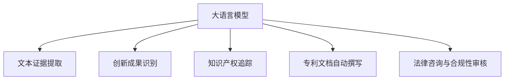

                 

# 知识产权保护者：LLM 捍卫创新成果

> 关键词：大语言模型,知识产权保护,LLM,自然语言处理,NLP,创新成果,专利技术,版权保护,数据安全,人工智能伦理

## 1. 背景介绍

### 1.1 问题由来
在当今数字时代，知识产权保护面临前所未有的挑战。无论是软件算法、生物医药、金融科技，还是艺术创作、文学作品，日益增长的网络盗版和侵权行为对创新成果构成了严重威胁。如何在海量数据和信息中识别和保护知识产权，成为了全社会关注的焦点。

大语言模型（Large Language Models, LLMs）作为新一代人工智能技术，凭借其强大的自然语言处理（NLP）能力，在知识产权保护方面展现了巨大的潜力。通过文本生成、逻辑推理、证据检索等功能，LLM 可以在发现、认证、管理和追踪创新成果方面提供有力支持，有效应对网络侵权和盗版行为，维护创新者的合法权益。

### 1.2 问题核心关键点
大语言模型在知识产权保护中的核心关键点主要包括以下几个方面：
- 文本证据提取与生成：从海量文本数据中高效提取关键信息，生成准确描述创新成果的文本，为知识产权认证和追踪提供数据支撑。
- 创新成果识别与对比：利用自然语言理解能力，识别出创新的关键元素，与现有文献进行对比，确认创新性。
- 知识产权追踪与预警：对创新成果进行实时监测，及时发现侵权行为，提供预警和防护建议。
- 专利文档自动撰写与更新：根据技术描述自动生成专利文档，节省撰写和维护成本，提高专利申请效率。
- 法律咨询与合规性审核：通过分析专利法律条款和判决案例，提供法律咨询和合规性审核服务，确保知识产权保护符合法律规定。

## 2. 核心概念与联系

### 2.1 核心概念概述

为了更好地理解大语言模型在知识产权保护中的应用，首先需要明确几个关键概念：

- 大语言模型（LLM）：以自回归（如GPT）或自编码（如BERT）模型为代表，经过大规模无标签文本数据预训练，具备丰富的语言表示能力，能够处理复杂的自然语言任务。
- 自然语言处理（NLP）：利用计算机技术处理、分析和理解人类语言的能力，包括文本分类、信息抽取、机器翻译、文本生成等任务。
- 知识产权保护：旨在通过法律、技术和经济手段，保护创作者对创新成果的所有权，防止未经授权的复制、使用或传播。
- 专利技术：针对具体技术方案提出的一组权利要求，涵盖发明、实用新型和外观设计等多种形式。
- 版权保护：针对原创作品的著作权保护，包括文学、艺术、音乐、软件等多领域。

这些概念之间存在紧密联系，大语言模型通过NLP技术在文本处理、知识检索、文本生成等方面的能力，为知识产权保护提供了全新的解决方案。

### 2.2 核心概念原理和架构的 Mermaid 流程图



这个流程图展示了大语言模型在知识产权保护中的应用流程：

1. 从文本数据中提取证据，识别出创新的关键元素。
2. 对创新成果进行全面识别和对比，确认其创新性。
3. 实时监测知识产权状态，及时发现侵权行为。
4. 自动撰写和更新专利文档，提高效率。
5. 提供法律咨询和合规性审核，确保保护措施符合法律规定。

## 3. 核心算法原理 & 具体操作步骤

### 3.1 算法原理概述

基于大语言模型的知识产权保护方法主要涉及以下几类算法：

- 文本证据提取算法：利用自然语言处理技术，从大规模文献数据库中提取关键证据，生成简明扼要的摘要。
- 创新成果识别算法：对提取的证据进行文本分析，利用深度学习模型识别出创新的关键点。
- 知识产权追踪算法：对创新成果进行实时监测，通过搜索引擎、新闻报道等渠道，及时发现侵权行为。
- 专利文档自动撰写算法：根据技术描述，自动生成符合专利撰写标准的文档，辅助专利申请。
- 法律咨询与合规性审核算法：利用自然语言理解能力，分析专利法律条款和案例，提供合规性审核服务。

### 3.2 算法步骤详解

下面以创新成果识别算法为例，详细讲解其具体操作步骤：

1. **数据准备**：收集包含创新成果的文本数据，如技术论文、专利申请、产品说明书等。数据需要标注具体的时间、地点、作者等信息。

2. **文本预处理**：对收集到的文本进行清洗、分词、去除停用词等预处理，确保文本格式一致性。

3. **特征提取**：利用自然语言处理技术，提取文本的关键特征，如句子长度、关键词频率、技术术语等。

4. **模型训练**：基于预训练的大语言模型，如GPT、BERT等，进行微调或迁移学习，以适应创新成果识别任务。在训练过程中，模型学习如何从文本中提取和识别创新的关键点。

5. **结果评估**：在验证集上对模型进行评估，计算准确率、召回率、F1分数等指标，确定模型性能。

6. **应用部署**：将训练好的模型部署到实际应用环境中，对新的文本数据进行创新成果识别。

### 3.3 算法优缺点

基于大语言模型的知识产权保护方法具有以下优点：

- 高效自动：利用自然语言处理技术，可以快速处理大量文本数据，节省人力成本。
- 准确识别：通过深度学习模型，可以从文本中准确识别出创新的关键元素。
- 实时监测：利用搜索引擎等技术，可以实时监测知识产权状态，及时发现侵权行为。

同时，该方法也存在以下缺点：

- 依赖数据质量：文本数据的质量直接影响识别结果的准确性。
- 模型泛化性：大语言模型在特定领域或特定类型的文本上可能表现不佳。
- 隐私风险：在处理文本数据时，可能涉及个人隐私和商业机密，需要采取隐私保护措施。

### 3.4 算法应用领域

大语言模型在知识产权保护中的应用领域广泛，包括：

- 专利技术：利用创新成果识别算法，帮助企业快速识别和评估专利申请的质量。
- 版权保护：对原创作品的描述和关键词进行提取，生成摘要，辅助版权声明和版权追踪。
- 商业秘密保护：对商业文档进行文本分析，识别关键技术点和商业机密，确保信息安全。
- 法律咨询：分析专利法律条款和案例，提供合规性审核和法律咨询服务。
- 市场监测：利用自然语言处理技术，监测市场动态，识别潜在的侵权行为和商业机会。

## 4. 数学模型和公式 & 详细讲解 & 举例说明

### 4.1 数学模型构建

大语言模型在知识产权保护中的应用涉及文本分析、特征提取、模型训练等环节。这里以创新成果识别为例，构建数学模型。

假设文本数据集为 $\mathcal{D} = \{(x_i, y_i)\}_{i=1}^N$，其中 $x_i$ 为文本，$y_i$ 为文本中是否包含创新成果的标签。

定义创新成果识别模型的损失函数为：

$$
\mathcal{L}(\theta) = \frac{1}{N} \sum_{i=1}^N \ell(y_i, f_\theta(x_i))
$$

其中，$f_\theta(x_i)$ 为模型在文本 $x_i$ 上的预测结果，$\ell$ 为损失函数，如交叉熵损失。

模型的参数 $\theta$ 需要最小化损失函数 $\mathcal{L}$，通过梯度下降等优化算法进行训练。

### 4.2 公式推导过程

以二分类任务为例，假设模型 $M_{\theta}$ 在输入 $x$ 上的输出为 $\hat{y}=M_{\theta}(x) \in [0,1]$，表示样本属于正类的概率。真实标签 $y \in \{0,1\}$。则二分类交叉熵损失函数定义为：

$$
\ell(M_{\theta}(x),y) = -[y\log \hat{y} + (1-y)\log (1-\hat{y})]
$$

将其代入经验风险公式，得：

$$
\mathcal{L}(\theta) = -\frac{1}{N}\sum_{i=1}^N [y_i\log M_{\theta}(x_i)+(1-y_i)\log(1-M_{\theta}(x_i))]
$$

根据链式法则，损失函数对参数 $\theta_k$ 的梯度为：

$$
\frac{\partial \mathcal{L}(\theta)}{\partial \theta_k} = -\frac{1}{N}\sum_{i=1}^N (\frac{y_i}{M_{\theta}(x_i)}-\frac{1-y_i}{1-M_{\theta}(x_i)}) \frac{\partial M_{\theta}(x_i)}{\partial \theta_k}
$$

其中 $\frac{\partial M_{\theta}(x_i)}{\partial \theta_k}$ 可进一步递归展开，利用自动微分技术完成计算。

### 4.3 案例分析与讲解

以创新成果识别为例，下面详细介绍一个具体案例：

假设一个科技公司提交了一项新的专利申请，专利描述如下：

```
一种新的高性能电池材料，用于延长电动汽车续航里程。该材料由多孔石墨烯和纳米级钛酸锂电池构成，通过特殊的涂层工艺，提高了电池的能量密度和循环寿命。
```

**步骤1：数据准备**
收集与电池材料相关的专利和文献，如专利说明书、学术论文、技术报告等，进行标注。

**步骤2：文本预处理**
对收集到的文本进行清洗、分词、去除停用词等预处理，确保文本格式一致性。

**步骤3：特征提取**
利用自然语言处理技术，提取文本的关键特征，如句子长度、关键词频率、技术术语等。

**步骤4：模型训练**
基于预训练的大语言模型，如GPT、BERT等，进行微调或迁移学习，以适应创新成果识别任务。在训练过程中，模型学习如何从文本中提取和识别创新的关键点。

**步骤5：结果评估**
在验证集上对模型进行评估，计算准确率、召回率、F1分数等指标，确定模型性能。

**步骤6：应用部署**
将训练好的模型部署到实际应用环境中，对新的文本数据进行创新成果识别。

在上述案例中，大语言模型通过文本证据提取和创新成果识别，帮助科技公司确认其专利申请的创新性，确保其合法权益得到有效保护。

## 5. 项目实践：代码实例和详细解释说明

### 5.1 开发环境搭建

在进行项目实践前，我们需要准备好开发环境。以下是使用Python进行PyTorch开发的环境配置流程：

1. 安装Anaconda：从官网下载并安装Anaconda，用于创建独立的Python环境。

2. 创建并激活虚拟环境：
```bash
conda create -n pytorch-env python=3.8 
conda activate pytorch-env
```

3. 安装PyTorch：根据CUDA版本，从官网获取对应的安装命令。例如：
```bash
conda install pytorch torchvision torchaudio cudatoolkit=11.1 -c pytorch -c conda-forge
```

4. 安装Transformers库：
```bash
pip install transformers
```

5. 安装各类工具包：
```bash
pip install numpy pandas scikit-learn matplotlib tqdm jupyter notebook ipython
```

完成上述步骤后，即可在`pytorch-env`环境中开始项目实践。

### 5.2 源代码详细实现

下面我们以专利技术识别为例，给出使用Transformers库对BERT模型进行微调的PyTorch代码实现。

首先，定义专利技术数据处理函数：

```python
from transformers import BertTokenizer
from torch.utils.data import Dataset
import torch

class PatentDataset(Dataset):
    def __init__(self, texts, labels, tokenizer, max_len=128):
        self.texts = texts
        self.labels = labels
        self.tokenizer = tokenizer
        self.max_len = max_len
        
    def __len__(self):
        return len(self.texts)
    
    def __getitem__(self, item):
        text = self.texts[item]
        label = self.labels[item]
        
        encoding = self.tokenizer(text, return_tensors='pt', max_length=self.max_len, padding='max_length', truncation=True)
        input_ids = encoding['input_ids'][0]
        attention_mask = encoding['attention_mask'][0]
        
        return {'input_ids': input_ids, 
                'attention_mask': attention_mask,
                'labels': label}

# 标签与id的映射
label2id = {' Patented': 1, 'Not Patented': 0}
id2label = {v: k for k, v in label2id.items()}

# 创建dataset
tokenizer = BertTokenizer.from_pretrained('bert-base-cased')

train_dataset = PatentDataset(train_texts, train_labels, tokenizer)
dev_dataset = PatentDataset(dev_texts, dev_labels, tokenizer)
test_dataset = PatentDataset(test_texts, test_labels, tokenizer)
```

然后，定义模型和优化器：

```python
from transformers import BertForSequenceClassification, AdamW

model = BertForSequenceClassification.from_pretrained('bert-base-cased', num_labels=len(label2id))

optimizer = AdamW(model.parameters(), lr=2e-5)
```

接着，定义训练和评估函数：

```python
from torch.utils.data import DataLoader
from tqdm import tqdm
from sklearn.metrics import classification_report

device = torch.device('cuda') if torch.cuda.is_available() else torch.device('cpu')
model.to(device)

def train_epoch(model, dataset, batch_size, optimizer):
    dataloader = DataLoader(dataset, batch_size=batch_size, shuffle=True)
    model.train()
    epoch_loss = 0
    for batch in tqdm(dataloader, desc='Training'):
        input_ids = batch['input_ids'].to(device)
        attention_mask = batch['attention_mask'].to(device)
        labels = batch['labels'].to(device)
        model.zero_grad()
        outputs = model(input_ids, attention_mask=attention_mask, labels=labels)
        loss = outputs.loss
        epoch_loss += loss.item()
        loss.backward()
        optimizer.step()
    return epoch_loss / len(dataloader)

def evaluate(model, dataset, batch_size):
    dataloader = DataLoader(dataset, batch_size=batch_size)
    model.eval()
    preds, labels = [], []
    with torch.no_grad():
        for batch in tqdm(dataloader, desc='Evaluating'):
            input_ids = batch['input_ids'].to(device)
            attention_mask = batch['attention_mask'].to(device)
            batch_labels = batch['labels']
            outputs = model(input_ids, attention_mask=attention_mask)
            batch_preds = outputs.logits.argmax(dim=2).to('cpu').tolist()
            batch_labels = batch_labels.to('cpu').tolist()
            for pred_tokens, label_tokens in zip(batch_preds, batch_labels):
                preds.append(pred_tokens[:len(label_tokens)])
                labels.append(label_tokens)
                
    print(classification_report(labels, preds))
```

最后，启动训练流程并在测试集上评估：

```python
epochs = 5
batch_size = 16

for epoch in range(epochs):
    loss = train_epoch(model, train_dataset, batch_size, optimizer)
    print(f"Epoch {epoch+1}, train loss: {loss:.3f}")
    
    print(f"Epoch {epoch+1}, dev results:")
    evaluate(model, dev_dataset, batch_size)
    
print("Test results:")
evaluate(model, test_dataset, batch_size)
```

以上就是使用PyTorch对BERT进行专利技术识别任务的微调代码实现。可以看到，得益于Transformers库的强大封装，我们可以用相对简洁的代码完成BERT模型的加载和微调。

### 5.3 代码解读与分析

让我们再详细解读一下关键代码的实现细节：

**PatentDataset类**：
- `__init__`方法：初始化文本、标签、分词器等关键组件。
- `__len__`方法：返回数据集的样本数量。
- `__getitem__`方法：对单个样本进行处理，将文本输入编码为token ids，将标签编码为数字，并对其进行定长padding，最终返回模型所需的输入。

**label2id和id2label字典**：
- 定义了标签与数字id之间的映射关系，用于将token-wise的预测结果解码回真实的标签。

**训练和评估函数**：
- 使用PyTorch的DataLoader对数据集进行批次化加载，供模型训练和推理使用。
- 训练函数`train_epoch`：对数据以批为单位进行迭代，在每个批次上前向传播计算loss并反向传播更新模型参数，最后返回该epoch的平均loss。
- 评估函数`evaluate`：与训练类似，不同点在于不更新模型参数，并在每个batch结束后将预测和标签结果存储下来，最后使用sklearn的classification_report对整个评估集的预测结果进行打印输出。

**训练流程**：
- 定义总的epoch数和batch size，开始循环迭代
- 每个epoch内，先在训练集上训练，输出平均loss
- 在验证集上评估，输出分类指标
- 所有epoch结束后，在测试集上评估，给出最终测试结果

可以看到，PyTorch配合Transformers库使得BERT微调的代码实现变得简洁高效。开发者可以将更多精力放在数据处理、模型改进等高层逻辑上，而不必过多关注底层的实现细节。

当然，工业级的系统实现还需考虑更多因素，如模型的保存和部署、超参数的自动搜索、更灵活的任务适配层等。但核心的微调范式基本与此类似。

## 6. 实际应用场景

### 6.1 智能专利检索系统

基于大语言模型的知识产权保护方法，可以应用于智能专利检索系统的构建。传统专利检索方式依赖大量人力和时间，且检索结果往往不够精准。而利用大语言模型，可以实现高效准确的专利检索和分类，大幅提高工作效率。

在技术实现上，可以收集全球范围内的专利文献，利用大语言模型的文本证据提取和创新成果识别能力，对专利文献进行全面分析和标注。微调后的模型能够根据用户输入的关键词，快速定位相关专利，并提供专利摘要和分类信息。对于有争议的专利申请，模型还能自动生成对比文献和分析报告，辅助专利审查。

### 6.2 版权保护系统

大语言模型在版权保护中的应用，主要是通过自动提取原创作品的描述和关键词，生成摘要，辅助版权声明和版权追踪。具体步骤如下：

1. 收集版权保护相关的文本数据，如著作权登记信息、版权声明、法律条款等。
2. 对文本进行清洗、分词、去除停用词等预处理。
3. 利用大语言模型提取文本的关键词和摘要。
4. 将关键词和摘要与现有版权数据库进行对比，确认版权归属。
5. 在著作权登记和维权过程中，自动生成版权声明和诉讼材料。

通过大语言模型的版权保护系统，可以显著提升版权保护的效率和准确性，减少版权纠纷和诉讼成本。

### 6.3 法律咨询系统

法律咨询是知识产权保护的重要环节。通过大语言模型，可以快速分析专利法律条款和案例，提供合规性审核和法律咨询服务。具体步骤如下：

1. 收集专利法律条款、判决案例、法律条文等文本数据。
2. 对文本进行清洗、分词、去除停用词等预处理。
3. 利用大语言模型提取关键法律信息，生成法律摘要。
4. 对新的专利申请进行合规性审核，确认是否符合法律规定。
5. 在专利维权和诉讼过程中，提供法律咨询和案例分析。

利用大语言模型的法律咨询系统，可以显著提升法律咨询的效率和准确性，帮助企业规避法律风险，维护合法权益。

### 6.4 未来应用展望

随着大语言模型和微调方法的不断发展，基于微调范式将在更多领域得到应用，为传统行业带来变革性影响。

在智慧医疗领域，利用大语言模型进行专利技术和药物研发的保护，可以加速新药的开发和上市，提升医疗服务的智能化水平。

在智能教育领域，基于大语言模型的版权保护和法律咨询系统，可以为教育工作者提供全面的版权保护和法律支持，促进教育公平。

在智慧城市治理中，利用大语言模型进行专利技术和版权保护，可以构建更安全、可靠、高效的城市管理系统，提升治理效率。

此外，在企业生产、社会治理、文娱传媒等众多领域，基于大语言模型的知识产权保护技术也将不断涌现，为经济社会发展提供新的技术支撑。相信随着技术的日益成熟，大语言模型微调必将在构建安全、可靠、高效的知识产权保护体系中发挥越来越重要的作用。

## 7. 工具和资源推荐

### 7.1 学习资源推荐

为了帮助开发者系统掌握大语言模型在知识产权保护中的应用，这里推荐一些优质的学习资源：

1. 《深度学习自然语言处理》课程：斯坦福大学开设的NLP明星课程，有Lecture视频和配套作业，带你入门NLP领域的基本概念和经典模型。

2. 《Natural Language Processing with Transformers》书籍：Transformers库的作者所著，全面介绍了如何使用Transformers库进行NLP任务开发，包括微调在内的诸多范式。

3. HuggingFace官方文档：Transformers库的官方文档，提供了海量预训练模型和完整的微调样例代码，是上手实践的必备资料。

4. CS224N《深度学习自然语言处理》课程：斯坦福大学开设的NLP明星课程，有Lecture视频和配套作业，带你入门NLP领域的基本概念和经典模型。

5. PyTorch官方文档：PyTorch的官方文档，详细介绍了PyTorch的使用方法和最佳实践，是深入研究NLP任务的必备资料。

通过对这些资源的学习实践，相信你一定能够快速掌握大语言模型在知识产权保护中的作用，并用于解决实际的NLP问题。

### 7.2 开发工具推荐

高效的开发离不开优秀的工具支持。以下是几款用于大语言模型微调开发的常用工具：

1. PyTorch：基于Python的开源深度学习框架，灵活动态的计算图，适合快速迭代研究。大部分预训练语言模型都有PyTorch版本的实现。

2. TensorFlow：由Google主导开发的开源深度学习框架，生产部署方便，适合大规模工程应用。同样有丰富的预训练语言模型资源。

3. Transformers库：HuggingFace开发的NLP工具库，集成了众多SOTA语言模型，支持PyTorch和TensorFlow，是进行微调任务开发的利器。

4. Weights & Biases：模型训练的实验跟踪工具，可以记录和可视化模型训练过程中的各项指标，方便对比和调优。与主流深度学习框架无缝集成。

5. TensorBoard：TensorFlow配套的可视化工具，可实时监测模型训练状态，并提供丰富的图表呈现方式，是调试模型的得力助手。

6. Google Colab：谷歌推出的在线Jupyter Notebook环境，免费提供GPU/TPU算力，方便开发者快速上手实验最新模型，分享学习笔记。

合理利用这些工具，可以显著提升大语言模型微调的开发效率，加快创新迭代的步伐。

### 7.3 相关论文推荐

大语言模型和微调技术的发展源于学界的持续研究。以下是几篇奠基性的相关论文，推荐阅读：

1. Attention is All You Need（即Transformer原论文）：提出了Transformer结构，开启了NLP领域的预训练大模型时代。

2. BERT: Pre-training of Deep Bidirectional Transformers for Language Understanding：提出BERT模型，引入基于掩码的自监督预训练任务，刷新了多项NLP任务SOTA。

3. Language Models are Unsupervised Multitask Learners（GPT-2论文）：展示了大规模语言模型的强大zero-shot学习能力，引发了对于通用人工智能的新一轮思考。

4. Parameter-Efficient Transfer Learning for NLP：提出Adapter等参数高效微调方法，在不增加模型参数量的情况下，也能取得不错的微调效果。

5. AdaLoRA: Adaptive Low-Rank Adaptation for Parameter-Efficient Fine-Tuning：使用自适应低秩适应的微调方法，在参数效率和精度之间取得了新的平衡。

这些论文代表了大语言模型微调技术的发展脉络。通过学习这些前沿成果，可以帮助研究者把握学科前进方向，激发更多的创新灵感。

## 8. 总结：未来发展趋势与挑战

### 8.1 研究成果总结

本文对基于大语言模型的知识产权保护方法进行了全面系统的介绍。首先阐述了大语言模型和微调技术的研究背景和意义，明确了微调在拓展预训练模型应用、提升下游任务性能方面的独特价值。其次，从原理到实践，详细讲解了监督微调的数学原理和关键步骤，给出了微调任务开发的完整代码实例。同时，本文还广泛探讨了微调方法在专利技术、版权保护、法律咨询等多个领域的应用前景，展示了微调范式的巨大潜力。

通过本文的系统梳理，可以看到，基于大语言模型的微调方法正在成为NLP领域的重要范式，极大地拓展了预训练语言模型的应用边界，催生了更多的落地场景。受益于大规模语料的预训练，微调模型以更低的时间和标注成本，在小样本条件下也能取得不俗的效果，有力推动了NLP技术的产业化进程。未来，伴随预训练语言模型和微调方法的持续演进，相信NLP技术将在更广阔的应用领域大放异彩，深刻影响人类的生产生活方式。

### 8.2 未来发展趋势

展望未来，大语言模型微调技术将呈现以下几个发展趋势：

1. 模型规模持续增大。随着算力成本的下降和数据规模的扩张，预训练语言模型的参数量还将持续增长。超大规模语言模型蕴含的丰富语言知识，有望支撑更加复杂多变的下游任务微调。

2. 微调方法日趋多样。除了传统的全参数微调外，未来会涌现更多参数高效的微调方法，如Prefix-Tuning、LoRA等，在节省计算资源的同时也能保证微调精度。

3. 持续学习成为常态。随着数据分布的不断变化，微调模型也需要持续学习新知识以保持性能。如何在不遗忘原有知识的同时，高效吸收新样本信息，将成为重要的研究课题。

4. 标注样本需求降低。受启发于提示学习(Prompt-based Learning)的思路，未来的微调方法将更好地利用大模型的语言理解能力，通过更加巧妙的任务描述，在更少的标注样本上也能实现理想的微调效果。

5. 多模态微调崛起。当前的微调主要聚焦于纯文本数据，未来会进一步拓展到图像、视频、语音等多模态数据微调。多模态信息的融合，将显著提升语言模型对现实世界的理解和建模能力。

6. 模型通用性增强。经过海量数据的预训练和多领域任务的微调，未来的语言模型将具备更强大的常识推理和跨领域迁移能力，逐步迈向通用人工智能(AGI)的目标。

以上趋势凸显了大语言模型微调技术的广阔前景。这些方向的探索发展，必将进一步提升NLP系统的性能和应用范围，为人类认知智能的进化带来深远影响。

### 8.3 面临的挑战

尽管大语言模型微调技术已经取得了瞩目成就，但在迈向更加智能化、普适化应用的过程中，它仍面临着诸多挑战：

1. 标注成本瓶颈。虽然微调大大降低了标注数据的需求，但对于长尾应用场景，难以获得充足的高质量标注数据，成为制约微调性能的瓶颈。如何进一步降低微调对标注样本的依赖，将是一大难题。

2. 模型鲁棒性不足。当前微调模型面对域外数据时，泛化性能往往大打折扣。对于测试样本的微小扰动，微调模型的预测也容易发生波动。如何提高微调模型的鲁棒性，避免灾难性遗忘，还需要更多理论和实践的积累。

3. 推理效率有待提高。大规模语言模型虽然精度高，但在实际部署时往往面临推理速度慢、内存占用大等效率问题。如何在保证性能的同时，简化模型结构，提升推理速度，优化资源占用，将是重要的优化方向。

4. 可解释性亟需加强。当前微调模型更像是"黑盒"系统，难以解释其内部工作机制和决策逻辑。对于医疗、金融等高风险应用，算法的可解释性和可审计性尤为重要。如何赋予微调模型更强的可解释性，将是亟待攻克的难题。

5. 安全性有待保障。预训练语言模型难免会学习到有偏见、有害的信息，通过微调传递到下游任务，产生误导性、歧视性的输出，给实际应用带来安全隐患。如何从数据和算法层面消除模型偏见，避免恶意用途，确保输出的安全性，也将是重要的研究课题。

6. 知识整合能力不足。现有的微调模型往往局限于任务内数据，难以灵活吸收和运用更广泛的先验知识。如何让微调过程更好地与外部知识库、规则库等专家知识结合，形成更加全面、准确的信息整合能力，还有很大的想象空间。

正视微调面临的这些挑战，积极应对并寻求突破，将是大语言模型微调走向成熟的必由之路。相信随着学界和产业界的共同努力，这些挑战终将一一被克服，大语言模型微调必将在构建安全、可靠、可解释、可控的智能系统铺平道路。

### 8.4 研究展望

面对大语言模型微调所面临的种种挑战，未来的研究需要在以下几个方面寻求新的突破：

1. 探索无监督和半监督微调方法。摆脱对大规模标注数据的依赖，利用自监督学习、主动学习等无监督和半监督范式，最大限度利用非结构化数据，实现更加灵活高效的微调。

2. 研究参数高效和计算高效的微调范式。开发更加参数高效的微调方法，在固定大部分预训练参数的同时，只更新极少量的任务相关参数。同时优化微调模型的计算图，减少前向传播和反向传播的资源消耗，实现更加轻量级、实时性的部署。

3. 融合因果和对比学习范式。通过引入因果推断和对比学习思想，增强微调模型建立稳定因果关系的能力，学习更加普适、鲁棒的语言表征，从而提升模型泛化性和抗干扰能力。

4. 引入更多先验知识。将符号化的先验知识，如知识图谱、逻辑规则等，与神经网络模型进行巧妙融合，引导微调过程学习更准确、合理的语言模型。同时加强不同模态数据的整合，实现视觉、语音等多模态信息与文本信息的协同建模。

5. 结合因果分析和博弈论工具。将因果分析方法引入微调模型，识别出模型决策的关键特征，增强输出解释的因果性和逻辑性。借助博弈论工具刻画人机交互过程，主动探索并规避模型的脆弱点，提高系统稳定性。

6. 纳入伦理道德约束。在模型训练目标中引入伦理导向的评估指标，过滤和惩罚有偏见、有害的输出倾向。同时加强人工干预和审核，建立模型行为的监管机制，确保输出符合人类价值观和伦理道德。

这些研究方向的探索，必将引领大语言模型微调技术迈向更高的台阶，为构建安全、可靠、可解释、可控的智能系统铺平道路。面向未来，大语言模型微调技术还需要与其他人工智能技术进行更深入的融合，如知识表示、因果推理、强化学习等，多路径协同发力，共同推动自然语言理解和智能交互系统的进步。只有勇于创新、敢于突破，才能不断拓展语言模型的边界，让智能技术更好地造福人类社会。

## 9. 附录：常见问题与解答

**Q1：大语言模型微调是否适用于所有NLP任务？**

A: 大语言模型微调在大多数NLP任务上都能取得不错的效果，特别是对于数据量较小的任务。但对于一些特定领域的任务，如医学、法律等，仅仅依靠通用语料预训练的模型可能难以很好地适应。此时需要在特定领域语料上进一步预训练，再进行微调，才能获得理想效果。此外，对于一些需要时效性、个性化很强的任务，如对话、推荐等，微调方法也需要针对性的改进优化。

**Q2：微调过程中如何选择合适的学习率？**

A: 微调的学习率一般要比预训练时小1-2个数量级，如果使用过大的学习率，容易破坏预训练权重，导致过拟合。一般建议从1e-5开始调参，逐步减小学习率，直至收敛。也可以使用warmup策略，在开始阶段使用较小的学习率，再逐渐过渡到预设值。需要注意的是，不同的优化器(如AdamW、Adafactor等)以及不同的学习率调度策略，可能需要设置不同的学习率阈值。

**Q3：采用大模型微调时会面临哪些资源瓶颈？**

A: 目前主流的预训练大模型动辄以亿计的参数规模，对算力、内存、存储都提出了很高的要求。GPU/TPU等高性能设备是必不可少的，但即便如此，超大批次的训练和推理也可能遇到显存不足的问题。因此需要采用一些资源优化技术，如梯度积累、混合精度训练、模型并行等，来突破硬件瓶颈。同时，模型的存储和读取也可能占用大量时间和空间，需要采用模型压缩、稀疏化存储等方法进行优化。

**Q4：如何缓解微调过程中的过拟合问题？**

A: 过拟合是微调面临的主要挑战，尤其是在标注数据不足的情况下。常见的缓解策略包括：
1. 数据增强：通过回译、近义替换等方式扩充训练集
2. 正则化：使用L2正则、Dropout、Early Stopping等避免过拟合
3. 对抗训练：引入对抗样本，提高模型鲁棒性
4. 参数高效微调：只调整少量参数(如Adapter、Prefix等)，减小过拟合风险
5. 多模型集成：训练多个微调模型，取平均输出，抑制过拟合

这些策略往往需要根据具体任务和数据特点进行灵活组合。只有在数据、模型、训练、推理等各环节进行全面优化，才能最大限度地发挥大模型微调的威力。

**Q5：微调模型在落地部署时需要注意哪些问题？**

A: 将微调模型转化为实际应用，还需要考虑以下因素：
1. 模型裁剪：去除不必要的层和参数，减小模型尺寸，加快推理速度
2. 量化加速：将浮点模型转为定点模型，压缩存储空间，提高计算效率
3. 服务化封装：将模型封装为标准化服务接口，便于集成调用
4. 弹性伸缩：根据请求流量动态调整资源配置，平衡服务质量和成本
5. 监控告警：实时采集系统指标，设置异常告警阈值，确保服务稳定性
6. 安全防护：采用访问鉴权、数据脱敏等措施，保障数据和模型安全

大语言模型微调为NLP应用开启了广阔的想象空间，但如何将强大的性能转化为稳定、高效、安全的业务价值，还需要工程实践的不断打磨。唯有从数据、算法、工程、业务等多个维度协同发力，才能真正实现人工智能技术在垂直行业的规模化落地。总之，微调需要开发者根据具体任务，不断迭代和优化模型、数据和算法，方能得到理想的效果。

---

作者：禅与计算机程序设计艺术 / Zen and the Art of Computer Programming

