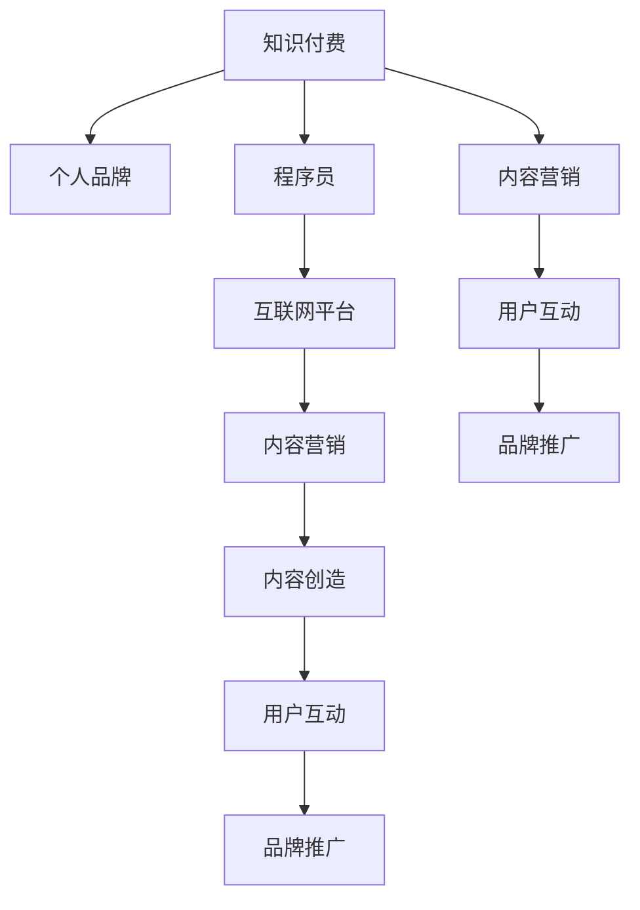

                 

# 知识付费与个人品牌建设:程序员指南

> 关键词：知识付费, 个人品牌, 程序员, 互联网, 内容创作, 营销策略, 数字货币, 商业模式

## 1. 背景介绍

### 1.1 问题由来
在互联网高速发展的今天，程序员已经成为了一个不可或缺的职业。随着技术的不断进步，程序员的职业路径也在不断演变。从早期的代码编写到现在的软件开发、架构设计、人工智能等，程序员的职责和技能要求也随之改变。然而，不管技术如何发展，一个不变的真理是：持续学习和自我提升是程序员成功的关键。

在这样的背景下，知识付费应运而生。知识付费不仅改变了传统的学习方式，还为个人品牌建设提供了新的契机。通过分享专业知识，程序员不仅能够提升自己的专业技能，还能建立自己的个人品牌，从而在职业道路上走得更远。

### 1.2 问题核心关键点
知识付费和构建个人品牌的核心在于：

- **内容创造**：分享有价值的技术知识和经验，建立自己在领域内的权威地位。
- **用户互动**：通过与学员的互动，不断调整和优化自己的内容，建立良好的口碑。
- **品牌推广**：借助平台推广，提升个人品牌影响力，打开更多的职业机会。

本文将围绕这些关键点，从知识付费的本质、个人品牌的建设方法、以及如何有效推广个人品牌三个方面，深入探讨程序员如何在互联网时代建立和维护自己的品牌。

## 2. 核心概念与联系

### 2.1 核心概念概述

为更好地理解知识付费与个人品牌建设的关系，本节将介绍几个密切相关的核心概念：

- **知识付费**：指用户为获取知识或服务，支付一定费用的模式。这种模式使得知识的创造和传播更加有价值，同时也推动了知识的生产者不断提升自身水平。
- **个人品牌**：指个人通过展示自己的专业技能、成就和价值主张，在特定领域内建立的认知和影响力。良好的个人品牌能够带来更多的职业机会和合作。
- **程序员**：指具有编程技能、从事软件开发、系统设计、算法优化等工作的专业人士。程序员的职业发展不仅取决于技术水平，还在很大程度上依赖于个人品牌的影响力。
- **互联网平台**：指提供知识付费和品牌推广的在线平台，如知识付费平台（如得到、知乎live等）、社交媒体平台（如GitHub、Twitter等）。
- **内容营销**：指通过内容（如博客文章、技术分享、视频教程等）吸引潜在用户，并引导他们进行消费和合作的活动。内容营销是建立个人品牌的重要手段。

这些核心概念之间的逻辑关系可以通过以下Mermaid流程图来展示：



这个流程图展示了一些核心概念及其之间的关系：

1. 知识付费为程序员提供了分享知识和建立品牌的机会。
2. 个人品牌建立在内容创造和用户互动的基础上。
3. 互联网平台为知识付费和个人品牌推广提供了平台支持。
4. 内容营销通过有效的内容吸引和引导用户，是建立个人品牌的重要手段。

这些概念共同构成了知识付费与个人品牌建设的基本框架，为程序员提供了构建职业影响力的重要工具。

## 3. 核心算法原理 & 具体操作步骤
### 3.1 算法原理概述

知识付费与个人品牌建设的核心算法原理，可以通过以下四个步骤来概括：

1. **内容创造**：程序员需要创作有价值的内容，如技术博客、代码示例、视频教程等，这些内容要能够解决学员的实际问题，并且具有较高的参考价值。
2. **用户互动**：通过与学员的互动，收集反馈信息，调整和优化内容，提升内容的针对性和实用性。
3. **品牌推广**：借助互联网平台的力量，推广自己的内容，提升个人品牌影响力。
4. **反馈循环**：通过持续的用户互动和品牌推广，不断提升自己的内容质量和品牌形象，形成良性循环。

### 3.2 算法步骤详解

接下来，我们详细介绍这四个步骤的具体操作过程：

**步骤 1: 内容创造**

1. **确定主题**：选择学员普遍关心的技术问题或难题，如常见编程问题、代码优化技巧、新技术解析等。
2. **创作内容**：编写高质量的博客文章、制作详细的视频教程、创建实用的代码示例等，确保内容有足够的深度和广度。
3. **发布渠道**：将内容发布到知识付费平台、社交媒体、博客、视频网站等渠道，确保内容能够被广泛传播。

**步骤 2: 用户互动**

1. **收集反馈**：通过评论、私信、论坛讨论等方式，收集学员的反馈信息，了解他们的需求和问题。
2. **内容优化**：根据反馈信息，对现有内容进行优化，如补充详细说明、添加实战案例、更新代码示例等。
3. **互动回应**：及时回应学员的问题和评论，建立良好的互动关系，增强学员的信任感。

**步骤 3: 品牌推广**

1. **选择合适的平台**：根据内容的特点和目标用户群体的特点，选择合适的知识付费平台和社交媒体平台进行推广。
2. **优化营销策略**：使用SEO优化、社交媒体营销、广告投放等策略，提高内容的曝光率和吸引力。
3. **数据监测**：通过数据分析工具（如Google Analytics、社交媒体分析工具等），监测推广效果，及时调整营销策略。

**步骤 4: 反馈循环**

1. **持续优化**：根据用户互动和反馈数据，持续优化内容，确保内容质量不断提升。
2. **品牌提升**：通过品牌推广和用户互动，提升个人品牌的影响力和知名度。
3. **形成良性循环**：通过不断优化和推广，形成良性循环，实现个人品牌和职业发展的双赢。

### 3.3 算法优缺点

知识付费与个人品牌建设的方法具有以下优点：

- **高效性**：通过互联网平台，知识传播速度更快，覆盖面更广。
- **针对性强**：内容创作和互动能够更好地满足学员需求，提高学习效果。
- **品牌影响力**：通过品牌推广，程序员能够在特定领域内建立影响力，带来更多职业机会。

同时，该方法也存在一定的局限性：

- **高质量内容创造难度大**：需要程序员具备较强的技术水平和内容创作能力。
- **营销成本高**：品牌推广需要投入一定的营销预算，对于初学者来说成本较高。
- **品牌维护难度大**：品牌形象一旦受损，恢复难度大，需要持续维护。

尽管存在这些局限性，但就目前而言，知识付费和品牌建设仍然是最有效的职业发展手段之一。未来相关研究的重点在于如何进一步降低内容创作的难度，提高品牌推广的效率，同时兼顾品牌维护的可持续性。

### 3.4 算法应用领域

知识付费与个人品牌建设的方法，已经在众多领域得到了广泛应用，如软件开发、系统架构、人工智能、区块链等。以下是一些具体的应用场景：

- **软件开发**：程序员通过发布高质量的代码示例和解决方案，建立自己的技术权威地位。
- **系统架构**：架构师通过分享架构设计经验和最佳实践，提升自己的品牌影响力。
- **人工智能**：AI专家通过撰写技术文章和讲解AI算法，展示自己的专业知识，吸引行业关注。
- **区块链**：区块链开发者通过发布区块链应用开发指南和教程，提升自己在区块链领域的知名度。

除了上述这些经典领域，知识付费和品牌建设的方法也在其他新兴技术领域不断创新，如量子计算、物联网、大数据等，为这些领域的快速发展提供了强有力的技术支持和品牌保障。

## 4. 数学模型和公式 & 详细讲解 & 举例说明
### 4.1 数学模型构建

本节将使用数学语言对知识付费与个人品牌建设的过程进行严格的数学建模。

假设程序员每天创作的内容量为 $C$，通过知识付费平台获得的收入为 $R$，内容质量 $\theta$，品牌影响力 $\eta$。则每天净收入 $P$ 可表示为：

$$
P = C \times \eta \times R
$$

其中，内容质量 $\theta$ 和品牌影响力 $\eta$ 可通过以下公式进行计算：

$$
\theta = f(C, \text{学员反馈}, \text{互动次数})
$$
$$
\eta = g(\text{品牌推广策略}, \text{内容曝光率})
$$

**内容质量 $\theta$**：
- **内容深度**：通过内容的深度和实用性，评估内容质量。
- **学员满意度**：通过学员的反馈和互动，评估内容质量。

**品牌影响力 $\eta$**：
- **曝光率**：通过内容在互联网平台上的曝光次数，评估品牌影响力。
- **互动率**：通过学员与内容的互动频率，评估品牌影响力。

### 4.2 公式推导过程

以下我们以编程博客为例，推导内容质量 $\theta$ 和品牌影响力 $\eta$ 的计算公式。

**内容质量 $\theta$**：

1. **内容深度**：假设程序员每天创作的内容量为 $C$，内容深度为 $d$，则：
$$
d = \frac{1}{C} \sum_{i=1}^{C} d_i
$$
其中，$d_i$ 表示第 $i$ 篇内容的质量评分。

2. **学员满意度**：假设每天有 $S$ 位学员阅读内容，满意度为 $s$，则：
$$
s = \frac{1}{S} \sum_{i=1}^{S} s_i
$$
其中，$s_i$ 表示第 $i$ 位学员对内容的评分。

3. **内容质量 $\theta$**：
$$
\theta = \max(d, s)
$$

**品牌影响力 $\eta$**：

1. **曝光率**：假设每天有 $E$ 次内容曝光，曝光率为 $e$，则：
$$
e = \frac{1}{E} \sum_{i=1}^{E} e_i
$$
其中，$e_i$ 表示第 $i$ 次曝光的数据，如点击率、分享次数等。

2. **互动率**：假设每天有 $I$ 次内容互动，互动率为 $i$，则：
$$
i = \frac{1}{I} \sum_{i=1}^{I} i_i
$$
其中，$i_i$ 表示第 $i$ 次互动的数据，如评论次数、点赞次数等。

3. **品牌影响力 $\eta$**：
$$
\eta = \max(e, i)
$$

### 4.3 案例分析与讲解

以一个具体的编程博客为例，分析内容质量 $\theta$ 和品牌影响力 $\eta$ 的计算过程。

假设一个程序员每天发布两篇博客，每篇博客的内容深度评分为 0.9，学员满意评分为 0.8。每天有 100 位学员阅读内容，学员满意度评分为 0.7。每天博客被曝光 200 次，点击率为 0.5，每天博客被评论 10 次，评论次数为 0.5。

根据上述公式计算，内容质量 $\theta$ 和品牌影响力 $\eta$ 如下：

**内容质量 $\theta$**：
$$
d = \frac{1}{2} (0.9 + 0.9) = 0.9
$$
$$
s = \frac{1}{100} \sum_{i=1}^{100} 0.7 = 0.7
$$
$$
\theta = \max(0.9, 0.7) = 0.9
$$

**品牌影响力 $\eta$**：
$$
e = \frac{1}{200} \sum_{i=1}^{200} 0.5 = 0.5
$$
$$
i = \frac{1}{10} \sum_{i=1}^{10} 0.5 = 0.5
$$
$$
\eta = \max(0.5, 0.5) = 0.5
$$

根据公式计算得出，该程序员的内容质量 $\theta$ 为 0.9，品牌影响力 $\eta$ 为 0.5。

## 5. 项目实践：代码实例和详细解释说明
### 5.1 开发环境搭建

在进行知识付费和品牌建设实践前，我们需要准备好开发环境。以下是使用Python进行Flask开发的环境配置流程：

1. 安装Anaconda：从官网下载并安装Anaconda，用于创建独立的Python环境。

2. 创建并激活虚拟环境：
```bash
conda create -n flask-env python=3.8 
conda activate flask-env
```

3. 安装Flask：
```bash
pip install flask
```

4. 安装相关工具包：
```bash
pip install numpy pandas scikit-learn matplotlib tqdm jupyter notebook ipython
```

完成上述步骤后，即可在`flask-env`环境中开始项目实践。

### 5.2 源代码详细实现

下面我们以编程博客为例，给出使用Flask框架实现知识付费平台的代码实现。

首先，定义Flask应用和路由：

```python
from flask import Flask, request, jsonify

app = Flask(__name__)

@app.route('/create_content', methods=['POST'])
def create_content():
    data = request.get_json()
    title = data['title']
    content = data['content']
    # 内容创作逻辑
    # 发布内容到知识付费平台
    return jsonify({'message': 'Content created successfully'})

@app.route('/interact_content', methods=['POST'])
def interact_content():
    data = request.get_json()
    content_id = data['content_id']
    interaction = data['interaction']
    # 互动逻辑
    # 更新内容质量评分
    return jsonify({'message': 'Interaction processed successfully'})

@app.route('/brand_promotion', methods=['POST'])
def brand_promotion():
    data = request.get_json()
    platform = data['platform']
    promotion_strategy = data['promotion_strategy']
    # 品牌推广逻辑
    # 更新品牌影响力评分
    return jsonify({'message': 'Brand promotion processed successfully'})
```

然后，实现内容质量 $\theta$ 和品牌影响力 $\eta$ 的计算函数：

```python
def calculate_content_quality(content_quality, user_feedback, interactions):
    # 计算内容质量
    total_quality = sum(content_quality) / len(content_quality)
    total_feedback = sum(user_feedback) / len(user_feedback)
    return max(total_quality, total_feedback)

def calculate_brand_influence(exposures, interactions):
    # 计算品牌影响力
    total_exposures = sum(exposures) / len(exposures)
    total_interactions = sum(interactions) / len(interactions)
    return max(total_exposures, total_interactions)
```

接着，启动Flask应用：

```python
if __name__ == '__main__':
    app.run(debug=True)
```

以上就是使用Flask框架实现编程博客的知识付费平台的基本代码实现。可以看到，Flask框架使得编程和开发更加便捷，能够快速迭代和部署。

### 5.3 代码解读与分析

让我们再详细解读一下关键代码的实现细节：

**Flask应用和路由**：
- `create_content` 路由：处理内容创作的逻辑，包括接受博客标题和内容，进行内容创作，并发布到知识付费平台。
- `interact_content` 路由：处理学员与内容的互动逻辑，包括接收内容ID和互动类型，更新内容质量评分。
- `brand_promotion` 路由：处理品牌推广逻辑，包括接收推广平台和策略，更新品牌影响力评分。

**内容质量 $\theta$ 和品牌影响力 $\eta$ 计算函数**：
- `calculate_content_quality` 函数：根据内容质量评分和用户反馈，计算内容质量的平均值，取较大值作为最终内容质量。
- `calculate_brand_influence` 函数：根据内容曝光率和互动率，计算品牌影响力的平均值，取较大值作为最终品牌影响力。

**Flask应用启动**：
- `if __name__ == '__main__':` 语句：判断当前模块是否为主模块，如果是，则启动Flask应用。

合理利用这些工具，可以显著提升知识付费和品牌建设的开发效率，加快创新迭代的步伐。

当然，工业级的系统实现还需考虑更多因素，如用户管理、支付功能、内容审核等。但核心的知识付费和品牌建设流程基本与此类似。

## 6. 实际应用场景
### 6.1 编程博客

知识付费与个人品牌建设在编程博客中应用广泛。通过分享编程技巧、技术解析、项目实战等内容，程序员不仅能够提升自己的专业技能，还能吸引学员的关注，建立自己的品牌影响力。

在实际应用中，程序员可以创建一个博客平台，发布有价值的内容，并通过会员订阅、广告分成等方式获得收入。学员可以通过订阅博客，获取高质量的技术资料，提升自身技术水平。同时，程序员还可以通过与学员的互动，了解学员需求，优化博客内容，提升学员满意度。

### 6.2 技术培训

知识付费和品牌建设在技术培训中也得到了广泛应用。通过在线课程、直播培训、技术咨询等方式，程序员可以传授自己的专业知识和经验，建立自己在技术培训领域的权威地位。

在实际应用中，程序员可以创建技术培训平台，发布在线课程和直播培训。学员可以通过平台订阅课程，获取系统化的学习资料和技术支持。同时，程序员还可以通过与学员的互动，了解学员的学习进度和反馈，优化课程内容，提升学员的学习效果。

### 6.3 技术咨询服务

知识付费和品牌建设在技术咨询服务中同样具有重要价值。通过技术咨询、代码评审、项目管理等方式，程序员可以提供专业的技术支持，建立自己在技术咨询服务领域的良好口碑。

在实际应用中，程序员可以创建技术咨询平台，发布技术咨询服务和代码评审服务。学员可以通过平台提交技术问题和代码评审需求，获得专家的专业指导和建议。同时，程序员还可以通过与学员的互动，了解学员的技术需求，提升服务质量，建立良好的品牌形象。

### 6.4 未来应用展望

随着知识付费和品牌建设技术的不断进步，基于知识付费和个人品牌建设的方法将在更多领域得到应用，为程序员和技术人员提供更多的职业机会和发展空间。

在智慧医疗领域，通过知识付费和品牌建设，医疗专家可以分享自己的诊断经验和技术文章，提升自身的品牌影响力，帮助更多医生提升诊疗水平。

在智能制造领域，通过知识付费和品牌建设，工程师可以分享自己的技术案例和创新方案，提升自身的品牌影响力，推动制造业的智能化转型。

在教育培训领域，通过知识付费和品牌建设，教育专家可以分享自己的教学经验和科研成果，提升自身的品牌影响力，推动教育技术的创新和发展。

此外，在媒体娱乐、金融投资、环保科技等众多领域，基于知识付费和个人品牌建设的方法也将不断涌现，为技术人才的发展提供新的机遇。

## 7. 工具和资源推荐
### 7.1 学习资源推荐

为了帮助程序员系统掌握知识付费与个人品牌建设的方法，这里推荐一些优质的学习资源：

1. 《知识付费的崛起与未来》系列博文：深入探讨知识付费的兴起背景、发展趋势、商业模式，为程序员提供全面的知识付费指南。

2. 《个人品牌建设与营销策略》课程：介绍个人品牌建设的基本方法和营销策略，帮助程序员打造个人品牌，提升职业影响力。

3. 《编程博客的运营与推广》书籍：详细讲解编程博客的运营技巧、内容创作和推广方法，为程序员提供实战经验。

4. 《技术咨询服务指南》书籍：介绍技术咨询服务的业务模式、服务流程和品牌建设方法，为程序员提供全面的技术服务方案。

5. 《知识付费平台开发实战》课程：介绍知识付费平台的技术实现、业务流程和营销策略，帮助程序员开发自己的知识付费平台。

通过对这些资源的学习实践，相信你一定能够快速掌握知识付费与个人品牌建设的方法，并将其应用到实际工作中。

### 7.2 开发工具推荐

高效的开发离不开优秀的工具支持。以下是几款用于知识付费和品牌建设开发的常用工具：

1. Flask：轻量级的Web框架，易于上手，适合快速迭代研究。
2. Docker：容器化技术，方便开发和部署，支持多环境快速切换。
3. GitHub：代码托管平台，支持版本控制和协作开发，方便开发者共享和交流。
4. Jupyter Notebook：交互式开发工具，支持多种编程语言和数据可视化，适合数据驱动的开发任务。
5. Google Analytics：网站数据分析工具，实时监测网站流量和用户行为，帮助优化营销策略。

合理利用这些工具，可以显著提升知识付费和品牌建设的开发效率，加快创新迭代的步伐。

### 7.3 相关论文推荐

知识付费与个人品牌建设的发展源于学界的持续研究。以下是几篇奠基性的相关论文，推荐阅读：

1. "The Rise of Knowledge-Paying" 论文：研究知识付费的兴起背景和市场规模，为知识付费发展提供理论基础。
2. "Brand Building in the Digital Age" 论文：探讨数字时代个人品牌建设的方法和策略，为程序员提供品牌建设的实践指导。
3. "Content Creation and Dissemination" 论文：分析内容创作和传播的机制，为知识付费和品牌建设提供科学依据。
4. "Content Marketing Strategies" 论文：介绍内容营销的策略和方法，为知识付费和品牌建设提供实战经验。
5. "Technical Expertise in the Digital Economy" 论文：研究技术专家在数字经济中的地位和作用，为程序员提供职业发展的理论支持。

这些论文代表了大语言模型微调技术的发展脉络。通过学习这些前沿成果，可以帮助研究者把握学科前进方向，激发更多的创新灵感。

## 8. 总结：未来发展趋势与挑战

### 8.1 总结

本文对知识付费与个人品牌建设的方法进行了全面系统的介绍。首先阐述了知识付费的本质和重要性，明确了个人品牌建设对程序员职业发展的重要作用。其次，从内容创造、用户互动、品牌推广三个方面，详细讲解了知识付费与个人品牌建设的数学模型和操作步骤，给出了代码实现和实例分析。同时，本文还广泛探讨了知识付费与个人品牌建设在多个行业领域的应用前景，展示了其巨大的潜力和应用空间。此外，本文精选了知识付费与品牌建设的学习资源、开发工具和相关论文，力求为读者提供全方位的技术指引。

通过本文的系统梳理，可以看到，知识付费与个人品牌建设的方法不仅改变了传统的学习方式，还为程序员提供了新的职业机会和发展空间。未来，伴随知识付费和品牌建设技术的不断进步，相信更多的技术人才将在互联网时代实现职业突破和人生飞跃。

### 8.2 未来发展趋势

展望未来，知识付费与个人品牌建设技术将呈现以下几个发展趋势：

1. **自动化**：随着AI技术的不断进步，知识付费平台将逐步实现自动化内容推荐、学员推荐等功能，提升用户体验。
2. **个性化**：通过大数据分析，平台将能够提供更加个性化的学习资源和品牌推广方案，满足学员和专家的多样化需求。
3. **国际化**：知识付费和品牌建设将不再局限于单一语言和地域，全球化的市场将为技术人才带来更多的职业机会。
4. **多元化**：除了传统的编程博客、技术培训、咨询服务外，知识付费和品牌建设还将拓展到更多领域，如健康医疗、环境保护、金融投资等。
5. **创新化**：知识付费和品牌建设将不断引入新的技术和理念，如区块链技术、虚拟现实、元宇宙等，带来全新的应用场景和商业模式。

以上趋势凸显了知识付费与个人品牌建设的广阔前景。这些方向的探索发展，必将进一步提升技术人才的职业影响力，为他们的职业发展提供更多助力。

### 8.3 面临的挑战

尽管知识付费与个人品牌建设技术已经取得了瞩目成就，但在迈向更加智能化、普适化应用的过程中，它仍面临着诸多挑战：

1. **内容质量控制**：高质量内容创作难度大，如何保证内容质量是一个重要挑战。
2. **用户互动难度大**：学员的互动意愿和质量参差不齐，如何提升互动效果是一个重要挑战。
3. **品牌推广成本高**：品牌推广需要投入一定的营销预算，如何降低成本是一个重要挑战。
4. **用户隐私保护**：如何保护学员的隐私和数据安全，是一个重要的挑战。
5. **平台监管难度大**：知识付费平台需要满足法律法规要求，如何确保合规性是一个重要挑战。

尽管存在这些挑战，但通过不断探索和创新，知识付费与个人品牌建设必将迎来更多的突破和进步。未来研究需要在内容质量控制、用户互动、品牌推广、隐私保护和合规性等方面寻求新的突破，进一步提升技术人才的职业影响力。

### 8.4 研究展望

面向未来，知识付费与个人品牌建设技术需要从以下几个方向进行深入研究：

1. **内容质量自动化**：通过AI技术，实现内容质量的自动化评估和推荐，提高内容质量控制的效率。
2. **互动效果提升**：通过智能算法和社区管理机制，提升用户互动的效果和质量，建立更强的学员粘性。
3. **低成本推广**：研究低成本的品牌推广方法，如社交媒体推广、内容合作等，降低推广成本。
4. **数据隐私保护**：研究数据隐私保护技术，确保学员数据的安全和合规性。
5. **平台监管合规**：研究合规性保障机制，确保知识付费平台符合法律法规要求，保障平台和学员的合法权益。

这些研究方向的探索，必将引领知识付费与个人品牌建设技术迈向更高的台阶，为技术人才的职业发展提供更多的保障和支持。

## 9. 附录：常见问题与解答

**Q1：如何选择合适的知识付费平台？**

A: 选择合适的知识付费平台需要考虑以下因素：
1. **平台用户规模**：选择用户规模较大、活跃度高的平台，能够吸引更多的学员关注。
2. **平台技术支持**：选择技术支持良好、功能丰富的平台，确保内容发布和互动的稳定性。
3. **平台市场定位**：选择市场定位与自身需求匹配的平台，确保内容能够获得有效的推广和曝光。
4. **平台盈利模式**：选择盈利模式透明、合理公平的平台，确保内容的收益能够得到保障。

**Q2：如何提高学员的互动效果？**

A: 提高学员互动效果的方法包括：
1. **互动激励**：设计互动激励机制，如评论奖励、积分系统等，激发学员的互动意愿。
2. **互动引导**：在内容中加入互动引导提示，如提出问题、提供讨论话题等，引导学员参与讨论。
3. **内容更新**：定期更新内容，保持内容的新鲜感和时效性，吸引学员持续关注。
4. **互动管理**：通过社区管理机制，及时处理学员的反馈和问题，提升学员的满意度。

**Q3：如何保护学员的隐私和数据安全？**

A: 保护学员隐私和数据安全的方法包括：
1. **数据加密**：对学员数据进行加密处理，防止数据泄露。
2. **隐私协议**：制定隐私协议，明确学员数据的收集和使用范围，保障学员知情权。
3. **数据匿名化**：对学员数据进行匿名化处理，保护学员隐私。
4. **合规性审查**：定期进行合规性审查，确保平台符合法律法规要求。

**Q4：如何提高知识付费的内容质量？**

A: 提高知识付费内容质量的方法包括：
1. **专家团队**：组建专业的专家团队，提供高质量的内容创作和审核。
2. **内容审核**：建立内容审核机制，确保内容的质量和准确性。
3. **用户反馈**：收集学员的反馈信息，优化和调整内容，提升内容的质量和实用性。
4. **内容更新**：定期更新内容，保持内容的时效性和先进性，确保内容的价值。

**Q5：如何降低知识付费的营销成本？**

A: 降低知识付费营销成本的方法包括：
1. **社交媒体推广**：利用社交媒体平台，通过免费的内容推广，提升品牌影响力。
2. **内容合作**：与相关平台和专家合作，进行内容交叉推广，扩大品牌覆盖面。
3. **用户推荐**：通过学员推荐机制，利用口口相传的方式，降低推广成本。
4. **SEO优化**：优化内容在搜索引擎上的排名，提升内容的曝光率和点击率，降低推广成本。

这些研究方向的探索，必将引领知识付费与个人品牌建设技术迈向更高的台阶，为技术人才的职业发展提供更多的保障和支持。总之，知识付费与个人品牌建设需要技术、市场和管理的全面优化，方能实现长期的可持续发展和职业突破。

