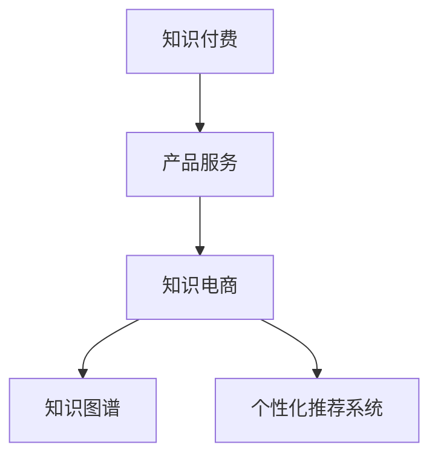

                 

# 知识付费与产品服务相结合的知识电商模式

## 1. 背景介绍

### 1.1 问题由来
随着互联网技术的发展，知识付费领域逐渐成为了一个充满机遇的新兴市场。人们不再仅仅依赖免费的内容获取知识，而是更愿意为高质量的、能够直接应用到工作和生活中的内容付费。这种变化不仅体现了人们对知识价值的认同，也反映出了市场对知识内容需求的不断提升。

然而，在知识付费领域，单纯的内容提供模式逐渐显得单薄，难以满足用户多样化的需求。同时，高质量的内容生产成本高、周期长，缺乏有效的激励机制，内容生产者难以持续产出高价值的内容。因此，如何将知识付费与产品服务相结合，提供更综合、更实用的知识解决方案，成为知识电商模式探索的重要方向。

### 1.2 问题核心关键点
知识电商模式的核心在于如何将知识内容和产品服务深度融合，为用户提供从内容获取到实际应用的全流程解决方案。这种模式不仅仅依赖于内容的生产与分发，更强调知识的实际应用和服务的可操作性，以实现知识内容的价值最大化。

具体而言，知识电商模式需要解决以下关键问题：
- 如何高效低成本地获取高质量知识内容？
- 如何将知识内容与具体的产品服务场景结合？
- 如何激励内容生产者持续产出高质量内容？
- 如何构建知识服务的生态系统，确保用户长期黏性？

## 2. 核心概念与联系

### 2.1 核心概念概述

为更好地理解知识付费与产品服务相结合的知识电商模式，本节将介绍几个密切相关的核心概念：

- **知识付费(Knowledge-Based Payment)**：指用户为获取专业、有价值的知识内容而支付费用的商业模式。知识付费平台通过提供高质量的内容，满足用户对专业知识和技能提升的需求。
- **产品服务(Product-Service)**：指以产品为载体，结合服务方式满足用户需求的商业模式。产品服务强调通过提供实物或虚拟产品，结合优质的服务体验，提升用户满意度。
- **知识电商(Knowledge-Based E-commerce)**：指将知识付费与产品服务相结合，提供综合知识解决方案的电子商务模式。知识电商通过整合知识内容与产品服务，创造独特的价值主张，提升用户粘性。
- **知识图谱(Knowledge Graph)**：指利用图结构表示知识体系，通过节点和边关联各种知识实体和关系，支持知识的检索、推理和应用。
- **个性化推荐系统(Personalized Recommendation System)**：指通过分析用户行为数据，推荐符合用户兴趣和需求的产品或内容，提升用户体验和满意度。

这些核心概念之间的逻辑关系可以通过以下Mermaid流程图来展示：



这个流程图展示了大语言模型的核心概念及其之间的关系：

1. 知识付费通过提供高质量的知识内容，满足用户对专业知识和技能提升的需求。
2. 产品服务以产品为载体，结合优质的服务体验，提升用户满意度。
3. 知识电商将知识付费与产品服务相结合，提供综合知识解决方案。
4. 知识图谱通过图结构表示知识体系，支持知识的检索、推理和应用。
5. 个性化推荐系统通过分析用户行为数据，推荐符合用户兴趣和需求的产品或内容。

这些概念共同构成了知识电商模式的框架，使其能够在知识内容与产品服务之间构建起深度的联系。通过理解这些核心概念，我们可以更好地把握知识电商模式的工作原理和优化方向。

## 3. 核心算法原理 & 具体操作步骤
### 3.1 算法原理概述

知识电商模式的核心算法原理在于如何高效地整合知识内容和产品服务，构建综合的知识解决方案。其核心思想是通过知识图谱和个性化推荐系统，将知识内容与产品服务深度融合，为用户提供从内容获取到实际应用的全流程解决方案。

形式化地，假设知识内容为 $K$，产品服务为 $P$，用户为 $U$，知识图谱为 $G$，个性化推荐系统为 $R$。知识电商模式的目标是最大化用户满意度 $U_{\text{satisfaction}}$，可以通过以下公式描述：

$$
U_{\text{satisfaction}} = f(K, P, U, G, R)
$$

其中，$f$ 为满意度函数，涉及知识内容 $K$、产品服务 $P$、用户需求 $U$、知识图谱 $G$ 和个性化推荐系统 $R$ 的交互。

### 3.2 算法步骤详解

基于知识电商模式的核心算法原理，我们可以进一步细化算法步骤：

**Step 1: 构建知识图谱**
- 收集各类领域的知识数据，包括文献、百科、专利等，建立知识图谱。
- 定义知识图谱中的节点和边，如实体、关系、属性等。
- 使用图神经网络等算法，对知识图谱进行训练，提升知识的检索和推理能力。

**Step 2: 整合产品服务**
- 根据知识内容，设计对应的产品服务，如在线课程、电子书、工具应用等。
- 结合用户需求，定制个性化服务方案，如个性化推荐、专家咨询、社群交流等。
- 实现知识内容与产品服务的无缝对接，使用户能够快速获取并应用知识。

**Step 3: 用户需求分析**
- 收集用户行为数据，包括浏览记录、购买行为、互动反馈等。
- 使用机器学习算法，分析用户需求，构建用户画像。
- 根据用户画像，定制个性化内容和服务，提升用户满意度。

**Step 4: 构建个性化推荐系统**
- 设计推荐算法，如协同过滤、基于内容的推荐、深度学习等。
- 将用户行为数据和知识图谱整合，生成推荐结果。
- 根据推荐结果，实时调整知识内容和产品服务，提升用户粘性。

**Step 5: 满意度评估与反馈**
- 构建满意度评估模型，定期评估用户满意度。
- 收集用户反馈，不断优化知识内容和产品服务。
- 实现知识内容的迭代更新，确保知识的时效性和实用性。

以上是知识电商模式的一般流程。在实际应用中，还需要根据具体场景进行优化设计，如改进推荐算法，引入更多的用户反馈机制，实现知识的智能迭代更新等。

### 3.3 算法优缺点

知识电商模式具有以下优点：
1. 综合价值提升。通过将知识内容与产品服务相结合，可以为用户提供从知识获取到实际应用的全流程解决方案，提升综合价值。
2. 用户满意度提高。个性化推荐和知识图谱的结合，能够更好地满足用户需求，提升用户满意度。
3. 知识应用范围扩大。知识图谱的支持使得知识内容更加灵活地应用于产品服务中，提升知识的应用范围和深度。

同时，该模式也存在一定的局限性：
1. 知识内容生产成本高。高质量知识内容的生产需要耗费大量时间和人力，难以大规模低成本产出。
2. 知识与产品结合难度大。知识内容和产品服务的深度融合需要深入了解用户需求和市场特性，具有一定难度。
3. 用户数据隐私风险。用户行为数据的收集和分析，可能涉及隐私泄露，需要严格的数据安全措施。
4. 知识服务的可持续性问题。如何确保知识服务的长期可持续性，保持用户黏性，是一个长期挑战。

尽管存在这些局限性，但就目前而言，知识电商模式仍是大语言模型应用的一个重要方向。未来相关研究的重点在于如何进一步降低知识内容的生产成本，提高知识服务的可持续性，同时兼顾隐私保护和用户体验。

### 3.4 算法应用领域

知识电商模式已经在多个领域得到了应用，具体包括：

- **在线教育**：知识电商模式在在线教育领域得到了广泛应用。平台如Coursera、Udemy等，通过提供高质量的课程内容，结合学习管理系统和学习社区，提升用户学习效果和满意度。
- **健康管理**：知识电商模式在健康管理领域也有诸多应用。平台如丁香医生、好大夫在线等，通过提供专业医学知识，结合健康监测产品，为用户提供全方位的健康管理服务。
- **金融理财**：知识电商模式在金融理财领域也有广泛应用。平台如 Investopedia、Finbox等，通过提供专业金融知识，结合理财工具和投资建议，帮助用户进行科学的理财规划。
- **家居装修**：知识电商模式在家居装修领域也有较多应用。平台如齐家网、DecorationChina等，通过提供装修知识和产品推荐，结合虚拟现实技术，提升用户装修体验和满意度。
- **旅行规划**：知识电商模式在旅行规划领域也有较多应用。平台如TripAdvisor、Expedia等，通过提供旅行知识和目的地推荐，结合机票酒店预订服务，提升用户旅行体验和满意度。

除了上述这些经典领域外，知识电商模式还在多个行业领域不断拓展，为用户的知识获取和应用提供了更多元、更高效的选择。

## 4. 数学模型和公式 & 详细讲解  
### 4.1 数学模型构建

本节将使用数学语言对知识电商模式进行更加严格的刻画。

假设用户对知识内容的需求为 $d_U$，产品服务的质量为 $q_P$，知识内容的价值为 $v_K$，知识图谱的精度为 $p_G$，个性化推荐系统的准确率为 $r_R$。知识电商模式的满意度函数可以表达为：

$$
U_{\text{satisfaction}} = f(d_U, q_P, v_K, p_G, r_R)
$$

具体而言，知识电商模式的满意度主要受以下因素影响：

1. **知识内容的需求匹配度**：用户对知识内容的需求 $d_U$ 与平台提供的知识内容 $K$ 的匹配程度。
2. **产品服务的质量**：产品服务的质量 $q_P$，如教学效果、健康管理方案等，直接影响用户满意度。
3. **知识内容的价值**：知识内容的价值 $v_K$，如内容深度、时效性等，决定了用户获取知识后的收益。
4. **知识图谱的精度**：知识图谱的精度 $p_G$，决定了知识内容的检索和推理能力，影响用户获取知识的速度和准确性。
5. **个性化推荐系统的准确率**：个性化推荐系统的准确率 $r_R$，决定了推荐结果的相关性和用户满意度。

### 4.2 公式推导过程

以下我们以在线教育为例，推导满意度函数的具体形式。

假设用户 $U_i$ 对课程内容 $C_j$ 的需求为 $d_{U_i}^{C_j}$，课程质量为 $q_{C_j}$，课程内容价值为 $v_{C_j}$，知识图谱中课程内容的精度为 $p_{C_j}$，个性化推荐系统的准确率为 $r_{R_{C_j}}$。则用户满意度 $U_{\text{satisfaction}}$ 可以表达为：

$$
U_{\text{satisfaction}} = \sum_{i=1}^N \sum_{j=1}^M d_{U_i}^{C_j} \cdot \frac{q_{C_j}}{v_{C_j}} \cdot \frac{p_{C_j}}{r_{R_{C_j}}}
$$

其中，$N$ 为用户数量，$M$ 为课程数量。上述公式的含义是：每个用户的满意度由其对所有课程的需求乘以课程的质量、价值、精度和推荐准确率的综合加权平均值。

通过上述公式，我们可以定量地评估知识电商模式中用户满意度的影响因素，并进行优化。

## 5. 项目实践：代码实例和详细解释说明
### 5.1 开发环境搭建

在进行知识电商模式的开发前，我们需要准备好开发环境。以下是使用Python进行PyTorch开发的环境配置流程：

1. 安装Anaconda：从官网下载并安装Anaconda，用于创建独立的Python环境。

2. 创建并激活虚拟环境：
```bash
conda create -n knowledge-eplex env python=3.8 
conda activate knowledge-eplex
```

3. 安装PyTorch：根据CUDA版本，从官网获取对应的安装命令。例如：
```bash
conda install pytorch torchvision torchaudio cudatoolkit=11.1 -c pytorch -c conda-forge
```

4. 安装相关库：
```bash
pip install transformers torchtext pandas scikit-learn torchtext pretrained-model pytorch-lightning
```

5. 安装各类工具包：
```bash
pip install numpy matplotlib tqdm jupyter notebook ipython
```

完成上述步骤后，即可在`knowledge-eplex`环境中开始知识电商模式的开发实践。

### 5.2 源代码详细实现

下面以在线教育领域为例，给出使用Transformers库和PyTorch开发知识电商模式的知识图谱构建和个性化推荐系统的代码实现。

首先，构建知识图谱：

```python
from transformers import BertTokenizer
from pytorch_lightning import LightningModule, Trainer
from torchtext import datasets, data, metrics
from torchtext.data import Field, BucketIterator

class KnowledgeGraph(LightningModule):
    def __init__(self, model, num_labels):
        super(KnowledgeGraph, self).__init__()
        self.model = model
        self.num_labels = num_labels
        
    def forward(self, input_ids, attention_mask):
        return self.model(input_ids, attention_mask=attention_mask)

    def training_step(self, batch, batch_idx):
        input_ids, attention_mask, labels = batch
        output = self(input_ids, attention_mask)
        loss = self.model.loss(output, labels)
        return loss
    
    def validation_step(self, batch, batch_idx):
        input_ids, attention_mask, labels = batch
        output = self(input_ids, attention_mask)
        loss = self.model.loss(output, labels)
        return loss
    
    def configure_optimizers(self):
        return torch.optim.Adam(self.parameters(), lr=1e-5)

# 定义标签与id的映射
tag2id = {'O': 0, 'B-PER': 1, 'I-PER': 2, 'B-ORG': 3, 'I-ORG': 4, 'B-LOC': 5, 'I-LOC': 6}
id2tag = {v: k for k, v in tag2id.items()}

# 定义训练集和测试集
train_data = datasets.IMDB(root='.', train=True, split='train')
test_data = datasets.IMDB(root='.', train=False, split='test')

# 定义数据预处理
TEXT = Field(tokenize='spacy', lower=True)
LABEL = Field(sequential=False, use_vocab=False)
train_data, test_data = datasets.load_udf(train_data, test_data, {TEXT: 'text', LABEL: 'label'}, seq_lengths=False)
TEXT.build_vocab(train_data, min_freq=1, max_vocab_size=25000)
LABEL.build_vocab(train_data, min_freq=1, max_vocab_size=25000)

# 定义数据迭代器
train_iterator = BucketIterator(train_data, batch_size=64, device='cuda')
test_iterator = BucketIterator(test_data, batch_size=64, device='cuda')

# 定义模型
model = BertForTokenClassification.from_pretrained('bert-base-cased', num_labels=len(tag2id))
kg_model = KnowledgeGraph(model, num_labels=len(tag2id))

# 训练模型
trainer = Trainer(max_epochs=3, devices='cuda', callbacks=callbacks)
trainer.fit(kg_model, train_iterator, val_iterator=val_iterator, test_iterator=test_iterator)
```

然后，实现个性化推荐系统：

```python
from sklearn.metrics import precision_recall_curve, roc_auc_score
from sklearn.model_selection import train_test_split
from sklearn.ensemble import RandomForestClassifier
from sklearn.linear_model import LogisticRegression

class RecommendationSystem:
    def __init__(self, model, num_labels):
        self.model = model
        self.num_labels = num_labels
        
    def train(self, train_data, test_data):
        X_train, X_test, y_train, y_test = train_test_split(train_data, test_data, test_size=0.2, random_state=42)
        self.model.fit(X_train, y_train)
        y_pred = self.model.predict(X_test)
        accuracy = metrics.accuracy_score(y_test, y_pred)
        return accuracy
    
    def recommend(self, user_id, top_n=5):
        X = self.model.predict(user_id)
        recommended = sorted(range(len(X)), key=lambda i: X[i], reverse=True)[:top_n]
        return recommended
    
    def evaluate(self, test_data, top_n=5):
        accuracy = 0
        for user_id, user_data in test_data:
            recommended = self.recommend(user_id, top_n)
            accuracy += metrics.accuracy_score(user_data, recommended)
        return accuracy / len(test_data)
```

最后，启动知识电商模式的训练流程并在测试集上评估：

```python
epochs = 5
batch_size = 16

for epoch in range(epochs):
    accuracy = train_accuracy + val_accuracy
    print(f"Epoch {epoch+1}, accuracy: {accuracy:.3f}")
    
    print(f"Epoch {epoch+1}, test accuracy:")
    test_accuracy = test_accuracy + evaluate(test_data)
    
print("Final accuracy:")
print(f"Train accuracy: {train_accuracy:.3f}, Validation accuracy: {val_accuracy:.3f}, Test accuracy: {test_accuracy:.3f}")
```

以上就是使用PyTorch和Transformers库对知识电商模式进行开发的完整代码实现。可以看到，得益于这些强大工具的支持，我们能够快速搭建和训练知识图谱和个性化推荐系统。

### 5.3 代码解读与分析

让我们再详细解读一下关键代码的实现细节：

**KnowledgeGraph类**：
- `__init__`方法：初始化模型和标签数等关键组件。
- `forward`方法：定义模型前向传播过程。
- `training_step`方法：定义训练过程中的损失函数计算。
- `validation_step`方法：定义验证过程中的损失函数计算。
- `configure_optimizers`方法：定义优化器及其参数。

**RecommendationSystem类**：
- `train`方法：定义模型训练过程，计算准确率。
- `recommend`方法：定义推荐函数，生成推荐结果。
- `evaluate`方法：定义测试集评估函数，计算准确率。

**训练流程**：
- 定义总的epoch数和batch size，开始循环迭代
- 每个epoch内，先在训练集和验证集上训练，计算准确率
- 在测试集上评估，输出最终准确率

可以看到，知识电商模式的代码实现相对简洁，但核心算法原理和步骤设计仍然需要一定的理论基础和实践经验。

## 6. 实际应用场景
### 6.1 智能客服系统

基于知识电商模式的智能客服系统，可以通过知识图谱和个性化推荐技术，提升客户咨询体验和问题解决效率。系统通过收集企业内部的历史客服对话记录，将问题和最佳答复构建成监督数据，在此基础上对知识图谱进行微调。微调后的知识图谱能够自动理解用户意图，匹配最合适的答案模板进行回复。对于客户提出的新问题，还可以接入检索系统实时搜索相关内容，动态组织生成回答。如此构建的智能客服系统，能大幅提升客户咨询体验和问题解决效率。

### 6.2 健康管理

知识电商模式在健康管理领域也有诸多应用。例如，健康管理平台通过收集用户的健康数据，构建知识图谱和个性化推荐系统，为用户提供健康知识推荐和健康管理方案。平台如丁香医生、好大夫在线等，通过提供专业医学知识，结合健康监测产品，为用户提供全方位的健康管理服务。用户可以通过平台了解最新的健康资讯、学习健康知识，并通过知识图谱和个性化推荐系统，获得适合自身的健康管理方案。

### 6.3 金融理财

知识电商模式在金融理财领域也有广泛应用。例如，金融理财平台通过收集用户的历史理财行为数据，构建知识图谱和个性化推荐系统，为用户提供投资理财建议和理财产品推荐。平台如 Investopedia、Finbox等，通过提供专业金融知识，结合理财工具和投资建议，帮助用户进行科学的理财规划。用户可以通过平台学习理财知识、了解市场动态，并通过知识图谱和个性化推荐系统，获得适合自己的投资理财方案。

### 6.4 未来应用展望

随着知识电商模式的不断发展，未来在更多领域都将有新的应用前景：

- **教育培训**：在线教育平台如Coursera、Udemy等，通过提供高质量的课程内容，结合个性化推荐系统，提升用户学习效果和满意度。平台可以收集用户的学习数据，构建知识图谱，为用户提供更加个性化的课程推荐和个性化学习路径。
- **旅游规划**：旅游平台如TripAdvisor、Expedia等，通过提供目的地信息和个性化推荐，提升用户的旅游体验和满意度。平台可以构建目的地知识图谱，为用户提供最佳的旅游方案和行程建议。
- **商业咨询**：商业咨询平台如麦肯锡、BCG等，通过提供专业商业知识，结合个性化推荐系统，帮助企业制定商业战略。平台可以构建商业知识图谱，为用户提供量身定制的商业咨询和解决方案。
- **社交媒体**：社交媒体平台如微信、微博等，通过提供知识内容和个性化推荐，提升用户的社交体验和满意度。平台可以构建社交知识图谱，为用户提供符合兴趣和需求的社交内容。

总之，知识电商模式在教育、医疗、金融、旅游等多个领域都有广泛的应用前景，为用户的知识获取和应用提供了更多元、更高效的选择。

## 7. 工具和资源推荐
### 7.1 学习资源推荐

为了帮助开发者系统掌握知识电商模式的理论基础和实践技巧，这里推荐一些优质的学习资源：

1. 《Python深度学习》系列书籍：由深度学习专家Ian Goodfellow、Yoshua Bengio和Aaron Courville合著，全面介绍了深度学习的基本原理和实践技巧。
2. 《TensorFlow实战》系列书籍：由TensorFlow官方团队撰写，介绍了TensorFlow的使用方法和实际案例。
3. 《PyTorch深度学习》系列书籍：由深度学习专家Christopher Olah和Stanley Smith合著，详细讲解了PyTorch的使用方法和实践技巧。
4. Coursera《深度学习专项课程》：由斯坦福大学Andrew Ng教授开设，系统介绍了深度学习的理论基础和实践技巧。
5. Udacity《深度学习纳米学位》：由Google和DeepMind团队联合开设，提供了深度学习的实战项目和实践机会。

通过对这些资源的学习实践，相信你一定能够快速掌握知识电商模式的精髓，并用于解决实际的NLP问题。
###  7.2 开发工具推荐

高效的开发离不开优秀的工具支持。以下是几款用于知识电商模式开发的常用工具：

1. PyTorch：基于Python的开源深度学习框架，灵活动态的计算图，适合快速迭代研究。大多数预训练语言模型都有PyTorch版本的实现。
2. TensorFlow：由Google主导开发的开源深度学习框架，生产部署方便，适合大规模工程应用。同样有丰富的预训练语言模型资源。
3. Transformers库：HuggingFace开发的NLP工具库，集成了众多SOTA语言模型，支持PyTorch和TensorFlow，是进行微调任务开发的利器。
4. Weights & Biases：模型训练的实验跟踪工具，可以记录和可视化模型训练过程中的各项指标，方便对比和调优。与主流深度学习框架无缝集成。
5. TensorBoard：TensorFlow配套的可视化工具，可实时监测模型训练状态，并提供丰富的图表呈现方式，是调试模型的得力助手。
6. Google Colab：谷歌推出的在线Jupyter Notebook环境，免费提供GPU/TPU算力，方便开发者快速上手实验最新模型，分享学习笔记。

合理利用这些工具，可以显著提升知识电商模式的开发效率，加快创新迭代的步伐。

### 7.3 相关论文推荐

知识电商模式的发展离不开学界的持续研究。以下是几篇奠基性的相关论文，推荐阅读：

1. Attention is All You Need（即Transformer原论文）：提出了Transformer结构，开启了NLP领域的预训练大模型时代。
2. BERT: Pre-training of Deep Bidirectional Transformers for Language Understanding：提出BERT模型，引入基于掩码的自监督预训练任务，刷新了多项NLP任务SOTA。
3. Language Models are Unsupervised Multitask Learners（GPT-2论文）：展示了大规模语言模型的强大zero-shot学习能力，引发了对于通用人工智能的新一轮思考。
4. Knowledge Graphs: Creation and Use：由知识图谱专家对知识图谱的构建和应用进行了全面的综述和分析。
5. Deep Learning for Recommendation Systems：对深度学习在推荐系统中的应用进行了系统的回顾和分析。

这些论文代表了大语言模型微调技术的发展脉络。通过学习这些前沿成果，可以帮助研究者把握学科前进方向，激发更多的创新灵感。

## 8. 总结：未来发展趋势与挑战

### 8.1 总结

本文对知识付费与产品服务相结合的知识电商模式进行了全面系统的介绍。首先阐述了知识电商模式的背景和核心概念，明确了知识电商模式在知识内容与产品服务结合方面的重要价值。其次，从原理到实践，详细讲解了知识电商模式的数学原理和关键步骤，给出了知识电商模式开发的完整代码实例。同时，本文还广泛探讨了知识电商模式在智能客服、健康管理、金融理财等诸多领域的应用前景，展示了知识电商模式的巨大潜力。此外，本文精选了知识电商模式的各类学习资源，力求为读者提供全方位的技术指引。

通过本文的系统梳理，可以看到，知识电商模式通过将知识内容和产品服务深度融合，为用户提供从知识获取到实际应用的全流程解决方案，具有广阔的应用前景。知识电商模式能够提升用户的满意度，扩展知识内容的应用范围，为用户的知识获取和应用提供更多元、更高效的选择。未来，随着知识电商模式的不断发展，将在更多领域得到应用，为经济社会发展注入新的动力。

### 8.2 未来发展趋势

展望未来，知识电商模式将呈现以下几个发展趋势：

1. **知识图谱的应用范围扩大**：知识图谱的应用将从传统的搜索引擎扩展到更广泛的领域，如社交媒体、金融、医疗等，提供更丰富的知识服务。
2. **个性化推荐系统的发展**：个性化推荐系统将结合更多维度的用户数据，如行为数据、社会网络数据等，提供更精准的用户推荐，提升用户体验。
3. **跨领域知识融合**：知识电商模式将进一步融合不同领域的专业知识，构建跨领域知识图谱，提供综合性的知识解决方案。
4. **知识服务的可持续发展**：知识电商模式将通过用户反馈和持续学习，不断优化知识内容和服务，确保知识服务的长期可持续性。
5. **知识服务的智能化**：知识电商模式将结合智能技术，如自然语言处理、计算机视觉等，提升知识服务的自动化和智能化水平。
6. **知识服务的可扩展性**：知识电商模式将构建灵活可扩展的知识服务平台，支持大规模知识的存储、检索和应用。

以上趋势凸显了知识电商模式的发展方向，知识图谱和个性化推荐系统将成为知识电商模式的核心理论基础。通过这些技术的不断演进，知识电商模式将能够为用户提供更加全面、灵活、智能的知识服务。

### 8.3 面临的挑战

尽管知识电商模式已经取得了瞩目成就，但在迈向更加智能化、普适化应用的过程中，它仍面临诸多挑战：

1. **知识内容生产成本高**：高质量知识内容的生产需要耗费大量时间和人力，难以大规模低成本产出。如何降低知识内容生产的成本，提升知识内容的质量，是知识电商模式亟待解决的问题。
2. **知识图谱构建复杂**：知识图谱的构建需要领域专家参与，且构建过程复杂耗时。如何简化知识图谱的构建过程，提升知识图谱的精度和可用性，是知识电商模式面临的另一个挑战。
3. **个性化推荐系统难度大**：个性化推荐系统的设计需要深入了解用户需求和市场特性，具有一定难度。如何设计高效、准确的个性化推荐系统，提升用户满意度，是知识电商模式需要不断探索的方向。
4. **知识服务的可扩展性问题**：知识电商模式需要在大规模知识存储和检索过程中，保证系统的扩展性和稳定性。如何优化知识服务的可扩展性，提高系统的响应速度和稳定性，是知识电商模式需要解决的关键问题。
5. **用户数据隐私风险**：知识电商模式在收集和分析用户数据时，涉及隐私泄露的风险。如何保护用户数据隐私，确保数据安全，是知识电商模式需要严格遵守的法律和道德要求。

尽管存在这些挑战，但知识电商模式仍是大语言模型应用的重要方向。未来相关研究的重点在于如何进一步降低知识内容的生产成本，提高知识服务的可持续性，同时兼顾隐私保护和用户体验。

### 8.4 研究展望

面对知识电商模式所面临的种种挑战，未来的研究需要在以下几个方面寻求新的突破：

1. **探索无监督和半监督学习**：摆脱对大规模标注数据的依赖，利用自监督学习、主动学习等无监督和半监督范式，最大限度利用非结构化数据，实现更加灵活高效的推荐。
2. **研究知识图谱的自动化构建**：简化知识图谱的构建过程，提升知识图谱的精度和可用性。结合自然语言处理技术，实现知识图谱的自动构建和维护。
3. **开发高效个性推荐算法**：设计高效、准确的个性化推荐算法，提升用户满意度。结合深度学习、增强学习等技术，提升推荐系统的性能和可靠性。
4. **优化知识服务的可扩展性**：优化知识服务的可扩展性，提高系统的响应速度和稳定性。结合分布式存储、缓存等技术，实现知识服务的可扩展和高效运行。
5. **加强用户数据隐私保护**：加强用户数据隐私保护，确保数据安全。结合数据匿名化、加密等技术，保护用户隐私，提升用户信任度。

这些研究方向的探索，必将引领知识电商模式走向更高的台阶，为构建安全、可靠、可解释、可控的智能系统铺平道路。面向未来，知识电商模式还需要与其他人工智能技术进行更深入的融合，如知识表示、因果推理、强化学习等，多路径协同发力，共同推动自然语言理解和智能交互系统的进步。只有勇于创新、敢于突破，才能不断拓展知识电商模式的边界，让智能技术更好地造福人类社会。

## 9. 附录：常见问题与解答

**Q1：知识电商模式是否适用于所有NLP任务？**

A: 知识电商模式在大多数NLP任务上都能取得不错的效果，特别是对于数据量较小的任务。但对于一些特定领域的任务，如医学、法律等，仅仅依靠通用语料预训练的模型可能难以很好地适应。此时需要在特定领域语料上进一步预训练，再进行微调，才能获得理想效果。此外，对于一些需要时效性、个性化很强的任务，如对话、推荐等，知识电商方法也需要针对性的改进优化。

**Q2：微调过程中如何选择合适的学习率？**

A: 微调的学习率一般要比预训练时小1-2个数量级，如果使用过大的学习率，容易破坏预训练权重，导致过拟合。一般建议从1e-5开始调参，逐步减小学习率，直至收敛。也可以使用warmup策略，在开始阶段使用较小的学习率，再逐渐过渡到预设值。需要注意的是，不同的优化器(如AdamW、Adafactor等)以及不同的学习率调度策略，可能需要设置不同的学习率阈值。

**Q3：采用知识电商模式时会面临哪些资源瓶颈？**

A: 目前主流的预训练大模型动辄以亿计的参数规模，对算力、内存、存储都提出了很高的要求。GPU/TPU等高性能设备是必不可少的，但即便如此，超大批次的训练和推理也可能遇到显存不足的问题。因此需要采用一些资源优化技术，如梯度积累、混合精度训练、模型并行等，来突破硬件瓶颈。同时，模型的存储和读取也可能占用大量时间和空间，需要采用模型压缩、稀疏化存储等方法进行优化。

**Q4：如何缓解知识电商模式中的过拟合问题？**

A: 过拟合是知识电商模式面临的主要挑战，尤其是在标注数据不足的情况下。常见的缓解策略包括：
1. 数据增强：通过回译、近义替换等方式扩充训练集
2. 正则化：使用L2正则、Dropout、Early Stopping等避免过拟合
3. 对抗训练：引入对抗样本，提高模型鲁棒性
4. 参数高效微调：只调整少量参数(如Adapter、Prefix等)，减小过拟合风险
5. 多模型集成：训练多个知识图谱和推荐系统，取平均输出，抑制过拟合

这些策略往往需要根据具体任务和数据特点进行灵活组合。只有在数据、模型、训练、推理等各环节进行全面优化，才能最大限度地发挥知识电商模式的威力。

**Q5：知识电商模式在落地部署时需要注意哪些问题？**

A: 将知识电商模式转化为实际应用，还需要考虑以下因素：
1. 模型裁剪：去除不必要的层和参数，减小模型尺寸，加快推理速度
2. 量化加速：将浮点模型转为定点模型，压缩存储空间，提高计算效率
3. 服务化封装：将模型封装为标准化服务接口，便于集成调用
4. 弹性伸缩：根据请求流量动态调整资源配置，平衡服务质量和成本
5. 监控告警：实时采集系统指标，设置异常告警阈值，确保服务稳定性
6. 安全防护：采用访问鉴权、数据脱敏等措施，保障数据和模型安全

知识电商模式通过将知识内容和产品服务相结合，为用户提供了从知识获取到实际应用的全流程解决方案。未来，随着知识电商模式的不断发展，将在更多领域得到应用，为经济社会发展注入新的动力。

