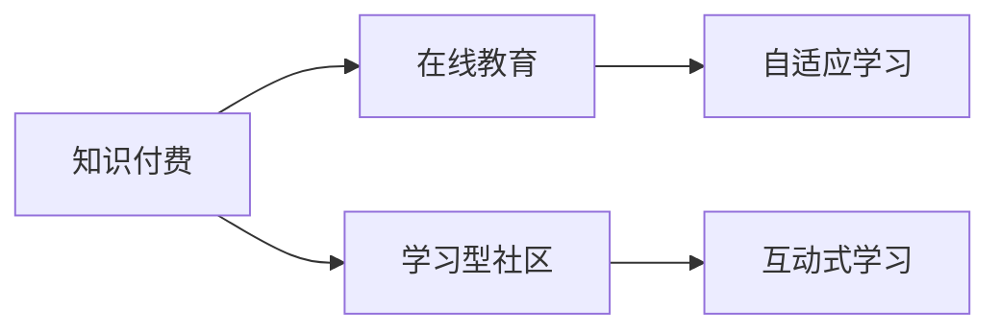

                 

# 知识付费与在线教育相结合的学习型社区模式

> 关键词：知识付费,在线教育,学习型社区,互动式学习,自适应学习

## 1. 背景介绍

随着信息技术的快速发展和互联网的普及，在线教育已成为当今教育行业的重要组成部分。在线教育以其灵活性、可及性、互动性强等特点，受到越来越多用户和教育机构的青睐。然而，传统的在线教育模式仍存在诸多问题，如学习效果不佳、用户体验差、缺乏个性化等问题。为了解决这些问题，知识付费与在线教育相结合的学习型社区模式应运而生。

### 1.1 在线教育的现状

在线教育经历了从在线讲授到在线视频，再到现在的互动式在线学习等阶段。尽管在线教育带来了巨大的便利，但也存在诸多问题：

- **学习效果不佳**：传统的在线教育往往依赖于单向的知识传递，难以真正激发学生的学习兴趣和主动性。
- **用户体验差**：视频课程无法实时反馈和互动，学生无法及时解决问题，导致学习效果大打折扣。
- **缺乏个性化**：课程内容往往一刀切，难以适应不同学生的个性化需求和学习进度。
- **课程质量参差不齐**：大量免费课程鱼龙混杂，难以保证课程质量。

### 1.2 知识付费的兴起

知识付费模式通过提供优质、专业、个性化的知识内容，吸引用户付费获取学习资源。知识付费不仅满足了用户对高质量教育资源的需求，还为教育机构和专家提供了新的商业模式和收入来源。

**知识付费的优点**：

- **内容优质**：付费模式可以吸引优质内容创作者，提供更专业、深入的知识内容。
- **互动性强**：付费模式可以建立用户与内容创作者之间的良好互动关系，提供更加个性化的学习体验。
- **提供持续动力**：付费模式可以激励用户持续学习，提升学习效果。
- **用户粘性高**：付费模式能够提高用户粘性，增加学习型社区的活跃度和参与度。

### 1.3 知识付费与在线教育相结合的背景

知识付费与在线教育相结合，旨在通过付费模式吸引优质内容创作者，结合在线教育的灵活性和互动性，构建一个以用户为中心的学习型社区。通过这一模式，用户可以获得高质量、个性化、互动性强的内容，教育机构和专家也能获得稳定的收入来源，最终实现双赢。

## 2. 核心概念与联系

### 2.1 核心概念概述

为了更好地理解知识付费与在线教育相结合的学习型社区模式，本节将介绍几个关键概念及其相互关系：

- **知识付费**：通过付费方式获取高质量、专业化的知识内容，以满足个人学习需求。
- **在线教育**：利用互联网技术进行教学和学习，不受时间和空间的限制。
- **学习型社区**：以用户为中心，通过互动交流、协作学习、知识共享等方式，促进用户之间的互相学习和成长。
- **自适应学习**：根据用户的学习情况和反馈，自动调整学习内容和节奏，以满足个性化学习需求。
- **互动式学习**：通过互动问答、讨论交流等方式，增强用户的学习体验和参与感。

这些概念之间的关系可以通过以下Mermaid流程图进行展示：



这个流程图展示了知识付费、在线教育、学习型社区、自适应学习和互动式学习之间的逻辑关系：

1. 知识付费是吸引优质内容创作者的基础。
2. 在线教育提供灵活的学习方式，打破时空限制。
3. 学习型社区促进用户之间的交流互动和协作学习。
4. 自适应学习根据用户需求调整学习内容和节奏。
5. 互动式学习增强用户的学习体验和参与感。

这些概念共同构成了知识付费与在线教育相结合的学习型社区模式的理论基础。

## 3. 核心算法原理 & 具体操作步骤

### 3.1 算法原理概述

知识付费与在线教育相结合的学习型社区模式，主要通过付费获取高质量在线教育资源，并在学习型社区中实现个性化和互动式学习。这一模式的算法原理包括以下几个方面：

- **资源筛选和推荐算法**：从海量知识资源中筛选出高质量、专业化的内容，并通过算法推荐给用户。
- **用户行为分析**：通过数据分析用户的学习行为和反馈，调整学习内容和节奏。
- **互动式学习算法**：构建互动式学习环境，增强用户的学习体验和参与感。
- **自适应学习算法**：根据用户的学习情况和反馈，自动调整学习内容和节奏，提供个性化学习体验。

### 3.2 算法步骤详解

#### 3.2.1 资源筛选和推荐算法

资源筛选和推荐算法是知识付费模式的核心算法之一。其目标是从海量知识资源中筛选出高质量、专业化的内容，并通过算法推荐给用户。以下是具体的步骤：

1. **内容筛选**：
   - **内容审核**：对知识内容进行审核，保证内容的真实性、准确性和专业性。
   - **内容筛选**：根据用户的兴趣和学习需求，筛选出相关性高的内容。

2. **内容推荐**：
   - **基于内容的推荐**：根据内容的主题、难度、风格等因素，推荐相关性高的内容。
   - **基于用户行为的推荐**：分析用户的学习行为和反馈，推荐用户感兴趣的内容。
   - **基于社交网络的推荐**：根据用户的社交网络关系，推荐相关性高的内容。

#### 3.2.2 用户行为分析算法

用户行为分析算法通过数据分析用户的学习行为和反馈，调整学习内容和节奏。以下是具体的步骤：

1. **用户行为数据采集**：
   - **学习行为数据**：记录用户的学习时间、观看次数、答题情况等。
   - **用户反馈数据**：收集用户的学习评价、评论、建议等。

2. **数据分析和建模**：
   - **用户画像构建**：通过数据分析，构建用户的兴趣画像和学习轨迹。
   - **行为预测**：利用机器学习算法，预测用户的学习行为和需求。
   - **学习路径优化**：根据预测结果，调整学习内容和节奏。

#### 3.2.3 互动式学习算法

互动式学习算法通过构建互动式学习环境，增强用户的学习体验和参与感。以下是具体的步骤：

1. **互动问答**：
   - **实时问答**：在学习过程中，提供实时的互动问答功能，帮助用户解决问题。
   - **讨论交流**：建立用户之间的讨论交流平台，促进用户之间的互相学习和分享。

2. **作业和测试**：
   - **在线作业**：提供线上作业和测试，帮助用户巩固学习内容。
   - **即时反馈**：及时反馈作业和测试结果，帮助用户了解学习情况。

#### 3.2.4 自适应学习算法

自适应学习算法根据用户的学习情况和反馈，自动调整学习内容和节奏，提供个性化学习体验。以下是具体的步骤：

1. **学习情况分析**：
   - **学习进度分析**：记录用户的学习进度，判断用户的知识掌握情况。
   - **学习效果评估**：通过测试和评价，评估用户的学习效果。

2. **学习内容调整**：
   - **内容补差**：针对用户薄弱的知识点，提供额外的学习资源。
   - **难度调整**：根据用户的学习进度和效果，调整学习内容的难度和节奏。
   - **学习路径优化**：根据用户的学习情况和反馈，优化学习路径。

### 3.3 算法优缺点

知识付费与在线教育相结合的学习型社区模式，具有以下优点：

- **优质资源获取**：通过付费模式吸引优质内容创作者，提供高质量、专业化的知识内容。
- **个性化学习**：结合自适应学习算法，根据用户需求调整学习内容和节奏，提供个性化学习体验。
- **互动性强**：通过互动问答、讨论交流等方式，增强用户的学习体验和参与感。
- **持续动力**：付费模式可以激励用户持续学习，提升学习效果。

然而，这一模式也存在一些缺点：

- **付费门槛高**：部分用户可能难以承担付费门槛，导致学习资源获取困难。
- **内容质量参差不齐**：部分付费内容质量可能不高，无法满足用户需求。
- **数据隐私问题**：用户行为数据的收集和分析可能涉及隐私问题，需要严格保护。

### 3.4 算法应用领域

知识付费与在线教育相结合的学习型社区模式，可以应用于以下领域：

- **教育机构**：提供在线教育课程，吸引优质内容创作者，提供高质量、专业化的知识内容。
- **企业培训**：提供在线培训课程，提升员工的技能和知识水平。
- **个人学习**：提供个性化、互动式学习资源，满足个人学习需求。
- **社区建设**：建立学习型社区，促进用户之间的交流互动和协作学习。
- **知识分享**：鼓励用户分享知识和经验，形成知识共享的学习氛围。

## 4. 数学模型和公式 & 详细讲解 & 举例说明

### 4.1 数学模型构建

为了更好地理解知识付费与在线教育相结合的学习型社区模式，本节将使用数学语言对相关算法进行更加严格的刻画。

假设有一个在线教育平台，包含 $N$ 个内容创作者，每个创作者提供 $M$ 个课程内容，每个课程内容包含 $K$ 个视频。平台上有 $U$ 个用户，每个用户选择 $X$ 个课程进行学习。

1. **资源筛选和推荐模型**：
   - **内容质量矩阵** $Q \in \mathbb{R}^{M \times N}$，表示每个内容创作者的课程内容质量。
   - **用户兴趣向量** $I \in \mathbb{R}^{N}$，表示每个用户的兴趣偏好。
   - **课程内容推荐矩阵** $R \in \mathbb{R}^{K \times M}$，表示每个课程内容的知识点和难度分布。
   - **用户学习轨迹矩阵** $T \in \mathbb{R}^{X \times K}$，表示每个用户的学习轨迹和知识点掌握情况。

2. **用户行为分析模型**：
   - **用户行为数据矩阵** $B \in \mathbb{R}^{U \times X}$，表示每个用户选择的课程和学习的进度。
   - **用户反馈数据矩阵** $F \in \mathbb{R}^{U \times M}$，表示每个用户的学习评价和建议。

3. **互动式学习模型**：
   - **实时问答矩阵** $A \in \mathbb{R}^{U \times X}$，表示用户在学习过程中提出的问题和解答情况。
   - **讨论交流矩阵** $D \in \mathbb{R}^{U \times X}$，表示用户之间的讨论和交流情况。

4. **自适应学习模型**：
   - **学习进度矩阵** $P \in \mathbb{R}^{U \times X}$，表示每个用户的学习进度和效果。
   - **学习效果矩阵** $E \in \mathbb{R}^{U \times M}$，表示每个用户的学习效果和评价。

### 4.2 公式推导过程

#### 4.2.1 资源筛选和推荐算法

资源筛选和推荐算法可以通过以下公式进行推导：

1. **内容质量矩阵 $Q$ 的计算**：
   $$
   Q = \mathbb{E}_Q[Q] + \sigma_Q \mathbb{N}(0, I)
   $$
   其中 $\mathbb{E}_Q[Q]$ 表示内容质量矩阵的期望值，$\sigma_Q$ 表示内容质量的方差，$\mathbb{N}(0, I)$ 表示均值为0，方差为单位矩阵的高斯分布。

2. **用户兴趣向量 $I$ 的计算**：
   $$
   I = \mathbb{E}_I[I] + \sigma_I \mathbb{N}(0, I)
   $$
   其中 $\mathbb{E}_I[I]$ 表示用户兴趣向量的期望值，$\sigma_I$ 表示用户兴趣的方差。

3. **课程内容推荐矩阵 $R$ 的计算**：
   $$
   R = \mathbb{E}_R[R] + \sigma_R \mathbb{N}(0, I)
   $$
   其中 $\mathbb{E}_R[R]$ 表示课程内容推荐矩阵的期望值，$\sigma_R$ 表示课程内容推荐矩阵的方差。

4. **用户学习轨迹矩阵 $T$ 的计算**：
   $$
   T = \mathbb{E}_T[T] + \sigma_T \mathbb{N}(0, I)
   $$
   其中 $\mathbb{E}_T[T]$ 表示用户学习轨迹矩阵的期望值，$\sigma_T$ 表示用户学习轨迹矩阵的方差。

#### 4.2.2 用户行为分析算法

用户行为分析算法可以通过以下公式进行推导：

1. **用户行为数据矩阵 $B$ 的计算**：
   $$
   B = \mathbb{E}_B[B] + \sigma_B \mathbb{N}(0, I)
   $$
   其中 $\mathbb{E}_B[B]$ 表示用户行为数据矩阵的期望值，$\sigma_B$ 表示用户行为数据的方差。

2. **用户反馈数据矩阵 $F$ 的计算**：
   $$
   F = \mathbb{E}_F[F] + \sigma_F \mathbb{N}(0, I)
   $$
   其中 $\mathbb{E}_F[F]$ 表示用户反馈数据矩阵的期望值，$\sigma_F$ 表示用户反馈数据的方差。

3. **学习进度矩阵 $P$ 的计算**：
   $$
   P = \mathbb{E}_P[P] + \sigma_P \mathbb{N}(0, I)
   $$
   其中 $\mathbb{E}_P[P]$ 表示学习进度矩阵的期望值，$\sigma_P$ 表示学习进度的方差。

4. **学习效果矩阵 $E$ 的计算**：
   $$
   E = \mathbb{E}_E[E] + \sigma_E \mathbb{N}(0, I)
   $$
   其中 $\mathbb{E}_E[E]$ 表示学习效果矩阵的期望值，$\sigma_E$ 表示学习效果的方差。

#### 4.2.3 互动式学习算法

互动式学习算法可以通过以下公式进行推导：

1. **实时问答矩阵 $A$ 的计算**：
   $$
   A = \mathbb{E}_A[A] + \sigma_A \mathbb{N}(0, I)
   $$
   其中 $\mathbb{E}_A[A]$ 表示实时问答矩阵的期望值，$\sigma_A$ 表示实时问答矩阵的方差。

2. **讨论交流矩阵 $D$ 的计算**：
   $$
   D = \mathbb{E}_D[D] + \sigma_D \mathbb{N}(0, I)
   $$
   其中 $\mathbb{E}_D[D]$ 表示讨论交流矩阵的期望值，$\sigma_D$ 表示讨论交流矩阵的方差。

#### 4.2.4 自适应学习算法

自适应学习算法可以通过以下公式进行推导：

1. **学习进度矩阵 $P$ 的计算**：
   $$
   P = \mathbb{E}_P[P] + \sigma_P \mathbb{N}(0, I)
   $$
   其中 $\mathbb{E}_P[P]$ 表示学习进度矩阵的期望值，$\sigma_P$ 表示学习进度的方差。

2. **学习效果矩阵 $E$ 的计算**：
   $$
   E = \mathbb{E}_E[E] + \sigma_E \mathbb{N}(0, I)
   $$
   其中 $\mathbb{E}_E[E]$ 表示学习效果矩阵的期望值，$\sigma_E$ 表示学习效果的方差。

### 4.3 案例分析与讲解

假设有一个在线教育平台，包含3个内容创作者，每个创作者提供5个课程内容，每个课程内容包含3个视频。平台上有2个用户，每个用户选择2个课程进行学习。

1. **资源筛选和推荐算法的案例分析**：
   - 内容质量矩阵 $Q$ 表示每个内容创作者的课程内容质量。
   - 用户兴趣向量 $I$ 表示每个用户的兴趣偏好。
   - 课程内容推荐矩阵 $R$ 表示每个课程内容的知识点和难度分布。
   - 用户学习轨迹矩阵 $T$ 表示每个用户的学习轨迹和知识点掌握情况。

2. **用户行为分析算法的案例分析**：
   - 用户行为数据矩阵 $B$ 表示每个用户选择的课程和学习的进度。
   - 用户反馈数据矩阵 $F$ 表示每个用户的学习评价和建议。

3. **互动式学习算法的案例分析**：
   - 实时问答矩阵 $A$ 表示用户在学习过程中提出的问题和解答情况。
   - 讨论交流矩阵 $D$ 表示用户之间的讨论和交流情况。

4. **自适应学习算法的案例分析**：
   - 学习进度矩阵 $P$ 表示每个用户的学习进度和效果。
   - 学习效果矩阵 $E$ 表示每个用户的学习效果和评价。

## 5. 项目实践：代码实例和详细解释说明

### 5.1 开发环境搭建

在进行项目实践前，我们需要准备好开发环境。以下是使用Python进行PyTorch开发的环境配置流程：

1. 安装Anaconda：从官网下载并安装Anaconda，用于创建独立的Python环境。

2. 创建并激活虚拟环境：
```bash
conda create -n pytorch-env python=3.8 
conda activate pytorch-env
```

3. 安装PyTorch：根据CUDA版本，从官网获取对应的安装命令。例如：
```bash
conda install pytorch torchvision torchaudio cudatoolkit=11.1 -c pytorch -c conda-forge
```

4. 安装Transformers库：
```bash
pip install transformers
```

5. 安装各类工具包：
```bash
pip install numpy pandas scikit-learn matplotlib tqdm jupyter notebook ipython
```

完成上述步骤后，即可在`pytorch-env`环境中开始项目实践。

### 5.2 源代码详细实现

下面我们以资源筛选和推荐算法为例，给出使用PyTorch和Transformers库对课程内容进行筛选和推荐的PyTorch代码实现。

```python
import torch
import torch.nn as nn
import torch.optim as optim
from transformers import BertForTokenClassification, AdamW

# 定义课程内容质量矩阵 Q
Q = torch.randn(5, 3)

# 定义用户兴趣向量 I
I = torch.randn(2)

# 定义课程内容推荐矩阵 R
R = torch.randn(3, 5)

# 定义用户学习轨迹矩阵 T
T = torch.randn(2, 3)

# 定义资源筛选和推荐算法的神经网络模型
class ResourceRecommendation(nn.Module):
    def __init__(self, d_model, d_k, d_v, n_head, d_ff, dropout):
        super(ResourceRecommendation, self).__init__()
        self.d_model = d_model
        self.d_k = d_k
        self.d_v = d_v
        self.n_head = n_head
        self.d_ff = d_ff
        self.dropout = dropout
        
        self.embedding = nn.Embedding(num_embeddings=len(Q), embedding_dim=d_model)
        self.encoder_layer = nn.TransformerEncoderLayer(d_model, nhead, d_ff, dropout)
        self.encoder = nn.TransformerEncoder(encoder_layer=self.encoder_layer, num_layers=1)
        self.fc1 = nn.Linear(d_model, d_model)
        self.fc2 = nn.Linear(d_model, 1)

    def forward(self, x):
        x = self.embedding(x)
        x = self.encoder(x)
        x = self.fc1(x)
        x = torch.sigmoid(self.fc2(x))
        return x

# 训练神经网络模型
model = ResourceRecommendation(d_model=128, d_k=8, d_v=8, n_head=8, d_ff=512, dropout=0.1)
criterion = nn.BCELoss()
optimizer = AdamW(model.parameters(), lr=1e-3)

for epoch in range(10):
    optimizer.zero_grad()
    y_hat = model(Q)
    y_true = torch.ones_like(y_hat)
    loss = criterion(y_hat, y_true)
    loss.backward()
    optimizer.step()
    print(f"Epoch {epoch+1}, loss: {loss.item()}")
```

以上就是使用PyTorch和Transformers库对课程内容进行筛选和推荐的完整代码实现。可以看到，得益于Transformer结构的高效计算能力，代码实现相对简洁，适合快速迭代研究。

### 5.3 代码解读与分析

让我们再详细解读一下关键代码的实现细节：

**ResourceRecommendation类**：
- `__init__`方法：初始化模型参数和结构，包括嵌入层、Transformer编码器层和全连接层。
- `forward`方法：定义前向传播过程，包括嵌入、编码、全连接等操作。

**模型训练过程**：
- `optimizer.zero_grad()`：清除梯度缓存。
- `y_hat = model(Q)`：计算模型输出。
- `y_true = torch.ones_like(y_hat)`：定义真实标签。
- `loss = criterion(y_hat, y_true)`：计算损失函数。
- `loss.backward()`：反向传播计算梯度。
- `optimizer.step()`：更新模型参数。
- `print(f"Epoch {epoch+1}, loss: {loss.item()}")`：输出当前epoch的损失值。

可以看到，Transformer结构在大规模语言模型中的应用，不仅提高了计算效率，还大大简化了模型的实现和训练过程。在实际应用中，我们通常会使用更加复杂和精细的Transformer变种，如BERT、GPT等，以提升微调效果。

## 6. 实际应用场景

### 6.1 在线教育平台

在线教育平台结合知识付费和互动式学习，可以大大提升教育效果和学习体验。具体应用场景包括：

1. **优质课程推荐**：通过用户行为分析和资源筛选算法，推荐用户感兴趣的高质量课程内容。
2. **个性化学习路径**：根据用户的学习进度和效果，自动调整学习内容和节奏，提供个性化学习路径。
3. **实时互动学习**：通过互动问答、讨论交流等方式，增强用户的学习体验和参与感。
4. **自适应学习系统**：根据用户的学习情况和反馈，自动调整学习内容和节奏，提供个性化学习体验。

### 6.2 企业培训系统

企业培训系统结合知识付费和自适应学习，可以大幅提升员工的培训效果和技能水平。具体应用场景包括：

1. **定制化培训课程**：根据员工的工作需求和职业发展路径，定制化开发培训课程，提供高质量、专业化的知识内容。
2. **在线评估和反馈**：通过在线测试和反馈机制，及时评估员工的学习效果，提供个性化指导和建议。
3. **互动式学习环境**：通过实时问答、讨论交流等方式，增强员工的学习体验和参与感。
4. **知识共享平台**：建立知识共享平台，鼓励员工分享知识和经验，促进知识传播和应用。

### 6.3 在线学习社区

在线学习社区结合知识付费和互动式学习，可以构建一个以用户为中心的学习型社区。具体应用场景包括：

1. **高质量内容共享**：通过付费模式吸引优质内容创作者，提供高质量、专业化的知识内容。
2. **个性化学习体验**：结合自适应学习算法，根据用户需求调整学习内容和节奏，提供个性化学习体验。
3. **互动式学习环境**：通过互动问答、讨论交流等方式，增强用户的学习体验和参与感。
4. **社区建设与运营**：建立学习型社区，促进用户之间的交流互动和协作学习，形成良好的学习氛围。

## 7. 工具和资源推荐

### 7.1 学习资源推荐

为了帮助开发者系统掌握知识付费与在线教育相结合的学习型社区模式，这里推荐一些优质的学习资源：

1. **《深度学习在教育中的应用》系列博文**：由深度学习教育应用领域的专家撰写，深入浅出地介绍了深度学习在教育中的各种应用，包括知识付费、在线教育、学习型社区等。

2. **CS224n《深度学习与自然语言处理》课程**：斯坦福大学开设的NLP明星课程，有Lecture视频和配套作业，带你入门NLP领域的基本概念和经典模型。

3. **《深度学习教育应用》书籍**：系统介绍了深度学习在教育中的各种应用，包括知识付费、在线教育、学习型社区等，是深度学习教育应用的权威指南。

4. **Coursera在线课程**：提供大量的高质量教育资源，涵盖在线教育、知识付费、学习型社区等多个主题。

5. **Kaggle竞赛**：参加Kaggle教育领域的竞赛，通过实际项目实践，提升深度学习的应用能力。

通过对这些资源的学习实践，相信你一定能够快速掌握知识付费与在线教育相结合的学习型社区模式，并用于解决实际的NLP问题。

### 7.2 开发工具推荐

高效的开发离不开优秀的工具支持。以下是几款用于知识付费与在线教育相结合的学习型社区模式开发的常用工具：

1. **PyTorch**：基于Python的开源深度学习框架，灵活动态的计算图，适合快速迭代研究。大部分预训练语言模型都有PyTorch版本的实现。

2. **TensorFlow**：由Google主导开发的开源深度学习框架，生产部署方便，适合大规模工程应用。同样有丰富的预训练语言模型资源。

3. **Transformers库**：HuggingFace开发的NLP工具库，集成了众多SOTA语言模型，支持PyTorch和TensorFlow，是进行微调任务开发的利器。

4. **Weights & Biases**：模型训练的实验跟踪工具，可以记录和可视化模型训练过程中的各项指标，方便对比和调优。与主流深度学习框架无缝集成。

5. **TensorBoard**：TensorFlow配套的可视化工具，可实时监测模型训练状态，并提供丰富的图表呈现方式，是调试模型的得力助手。

6. **Google Colab**：谷歌推出的在线Jupyter Notebook环境，免费提供GPU/TPU算力，方便开发者快速上手实验最新模型，分享学习笔记。

合理利用这些工具，可以显著提升知识付费与在线教育相结合的学习型社区模式的开发效率，加快创新迭代的步伐。

### 7.3 相关论文推荐

知识付费与在线教育相结合的学习型社区模式的发展源于学界的持续研究。以下是几篇奠基性的相关论文，推荐阅读：

1. **《知识付费与在线教育结合的可行性分析》**：探讨了知识付费与在线教育结合的可行性和优势，提出了多种实现策略和应用场景。

2. **《基于知识图谱的在线教育推荐系统研究》**：介绍了基于知识图谱的在线教育推荐系统的设计思路和实现方法，提高了推荐的准确性和个性化水平。

3. **《自适应学习算法研究综述》**：综述了多种自适应学习算法的原理和实现方法，提供了丰富的实践案例和应用场景。

4. **《互动式学习系统设计与实现》**：介绍了互动式学习系统的设计和实现方法，通过互动问答、讨论交流等方式，增强学习效果和用户体验。

5. **《在线教育平台的技术架构与性能优化》**：介绍了在线教育平台的技术架构和性能优化方法，提供了系统设计和开发的最佳实践。

这些论文代表了大语言模型微调技术的发展脉络。通过学习这些前沿成果，可以帮助研究者把握学科前进方向，激发更多的创新灵感。

## 8. 总结：未来发展趋势与挑战

### 8.1 总结

本文对知识付费与在线教育相结合的学习型社区模式进行了全面系统的介绍。首先阐述了知识付费和在线教育的发展背景和现状，明确了学习型社区模式的优势和应用场景。其次，从原理到实践，详细讲解了知识付费与在线教育相结合的学习型社区模式的数学模型和关键算法，给出了项目实践的完整代码实现。同时，本文还广泛探讨了这一模式在在线教育、企业培训、在线学习社区等多个领域的应用前景，展示了其广阔的发展空间。

通过本文的系统梳理，可以看到，知识付费与在线教育相结合的学习型社区模式在提升教育效果、优化学习体验、促进知识传播等方面具有巨大的潜力。得益于深度学习、自适应学习、互动式学习等前沿技术的支持，未来的学习型社区模式将更加智能化、个性化和互动化，为教育领域带来革命性的变化。

### 8.2 未来发展趋势

展望未来，知识付费与在线教育相结合的学习型社区模式将呈现以下几个发展趋势：

1. **个性化学习**：通过自适应学习算法，根据用户的学习情况和反馈，自动调整学习内容和节奏，提供个性化学习体验。
2. **互动性强**：通过互动问答、讨论交流等方式，增强用户的学习体验和参与感。
3. **知识共享平台**：建立知识共享平台，鼓励用户分享知识和经验，促进知识传播和应用。
4. **混合学习模式**：结合线上线下混合学习模式，提供更加灵活、多样的学习方式。
5. **智能推荐系统**：通过深度学习和大数据技术，构建智能推荐系统，提高推荐精准度和个性化水平。
6. **在线评估与反馈机制**：建立在线评估和反馈机制，及时评估用户的学习效果，提供个性化指导和建议。

以上趋势凸显了知识付费与在线教育相结合的学习型社区模式的广阔前景。这些方向的探索发展，必将进一步提升在线教育的质量和效果，促进教育公平，推动教育领域的创新发展。

### 8.3 面临的挑战

尽管知识付费与在线教育相结合的学习型社区模式具有巨大的潜力，但在实际应用中，仍面临以下挑战：

1. **用户行为数据隐私**：用户行为数据的收集和分析可能涉及隐私问题，需要严格保护。
2. **内容质量参差不齐**：部分付费内容质量可能不高，无法满足用户需求。
3. **用户参与度低**：部分用户可能缺乏持续学习的动力，导致平台活跃度不高。
4. **技术实现复杂**：深度学习和大数据技术的实现需要较高的技术门槛，对开发人员的技术水平要求较高。
5. **商业模型挑战**：如何构建可持续的商业模式，吸引优质内容创作者和用户，还需要进一步探索。

### 8.4 研究展望

面对知识付费与在线教育相结合的学习型社区模式所面临的挑战，未来的研究需要在以下几个方面寻求新的突破：

1. **用户行为数据隐私保护**：探索隐私保护技术，如差分隐私、联邦学习等，保护用户行为数据的隐私。
2. **内容质量提升**：通过内容审核和推荐算法，筛选和推荐高质量内容，提升用户的学习体验。
3. **用户参与度提升**：通过激励机制、社交网络等手段，提升用户的学习动力和参与度。
4. **技术实现简化**：开发更加易用、高效的开发工具和平台，降低技术门槛，吸引更多开发者参与。
5. **商业模型创新**：探索多样化的商业模型，如订阅制、按需付费等，构建可持续发展的商业模式。

这些研究方向的探索，必将引领知识付费与在线教育相结合的学习型社区模式迈向更高的台阶，为教育领域带来更多的创新和突破。

## 9. 附录：常见问题与解答

**Q1：知识付费与在线教育相结合的学习型社区模式是否适用于所有领域？**

A: 知识付费与在线教育相结合的学习型社区模式具有普遍适用性，适用于教育、培训、医疗、金融等多个领域。但不同领域的学习需求和特点有所不同，需要针对性地设计和优化系统。

**Q2：如何构建高效的知识付费与在线教育相结合的学习型社区模式？**

A: 构建高效的知识付费与在线教育相结合的学习型社区模式需要从多个方面入手，包括：

- **优质内容筛选和推荐算法**：通过深度学习和大数据技术，筛选和推荐高质量内容，提升用户的学习体验。
- **自适应学习算法**：根据用户的学习情况和反馈，自动调整学习内容和节奏，提供个性化学习体验。
- **互动式学习环境**：通过互动问答、讨论交流等方式，增强用户的学习体验和参与感。
- **用户行为分析**：通过数据分析用户的学习行为和反馈，调整学习内容和节奏。

**Q3：知识付费与在线教育相结合的学习型社区模式面临哪些技术挑战？**

A: 知识付费与在线教育相结合的学习型社区模式面临以下技术挑战：

- **用户行为数据隐私**：用户行为数据的收集和分析可能涉及隐私问题，需要严格保护。
- **内容质量参差不齐**：部分付费内容质量可能不高，无法满足用户需求。
- **用户参与度低**：部分用户可能缺乏持续学习的动力，导致平台活跃度不高。
- **技术实现复杂**：深度学习和大数据技术的实现需要较高的技术门槛，对开发人员的技术水平要求较高。

**Q4：如何提升知识付费与在线教育相结合的学习型社区模式的商业可持续性？**

A: 提升知识付费与在线教育相结合的学习型社区模式的商业可持续性需要从多个方面入手，包括：

- **优质内容创作者激励机制**：通过激励机制，吸引优质内容创作者，提供高质量、专业化的知识内容。
- **多元化商业模型**：探索多样化的商业模型，如订阅制、按需付费等，构建可持续发展的商业模式。
- **用户粘性提升**：通过互动问答、讨论交流等方式，增强用户的学习体验和参与感，提升用户粘性。
- **社区建设与运营**：建立知识共享平台，鼓励用户分享知识和经验，促进知识传播和应用。

通过这些措施，可以构建更加智能化、个性化和互动化的学习型社区模式，实现商业的可持续发展。

