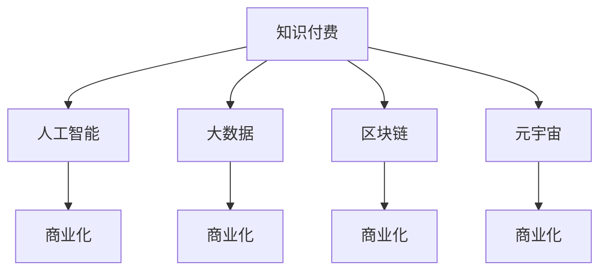

                 

# 知识付费与技术趋势分析的商业化

> 关键词：知识付费,技术趋势,商业化,人工智能,区块链,元宇宙

## 1. 背景介绍

### 1.1 知识付费的兴起

在互联网高速发展的时代背景下，知识付费这一新兴行业应运而生。知识付费旨在通过付费机制，激励知识生产者生产高质量内容，从而构建起一套良性互动的生态系统。这种模式使得优质内容得以快速传播，同时为知识消费者提供了高效、系统化的学习途径，打破了传统教育资源的不均衡分配。

随着人工智能、大数据、区块链等先进技术的引入，知识付费行业正经历着前所未有的变革，从内容生产、传播、分发到消费模式，都呈现出全新的形态。这种变革不仅提升了知识服务的效率，也极大地拓展了知识付费的商业化空间，激发了更多商业化模式的探索和创新。

### 1.2 技术趋势与商业化的交汇

技术趋势与商业化两者相辅相成，互为驱动。技术的不断演进为商业化提供了更强大的工具和手段，而商业化则激发了技术应用的深度和广度。在知识付费领域，新技术的应用极大地提升了内容生产和分发的效率，优化了用户体验，降低了运营成本，成为知识付费商业模式创新的关键驱动力。

人工智能、大数据、区块链、元宇宙等前沿技术的融合，正在重塑知识付费产业的商业图景。技术进步不仅为知识付费提供了更多的应用场景，也为其商业化路径的多样性提供了新的可能。本文将从技术趋势与商业化的角度出发，深入探讨知识付费的商业化现状与未来发展方向。

## 2. 核心概念与联系

### 2.1 核心概念概述

为了更好地理解知识付费与技术趋势分析的商业化，本节将介绍几个密切相关的核心概念：

- **知识付费**：指用户通过支付一定费用获取知识或信息服务，从而获得优质学习资源的方式。知识付费强调“知识价值”，通过付费机制激励内容创作者生产更多高质量内容，提升教育资源的有效利用率。

- **技术趋势**：指在某一特定领域内，技术演进的大致方向和趋势，包括但不限于技术发展速度、技术应用场景、技术对社会的影响等。技术趋势的研究有助于企业和个人洞察技术发展的脉络，把握未来商业机会。

- **商业化**：指将技术产品或服务转化为商业价值的整个过程，包括技术产品开发、市场定位、定价策略、渠道选择、运营管理等环节。商业化是技术发展与市场需求结合的产物，是技术转化为经济价值的重要途径。

- **人工智能**：通过机器学习、深度学习等技术实现自动化、智能化处理数据的科学，具备自我学习、决策、适应的能力，广泛应用于数据分析、自然语言处理、图像识别等领域。

- **区块链**：一种分布式账本技术，具有去中心化、不可篡改、可追溯等特点，用于建立可信的、透明的网络交易环境。

- **元宇宙**：利用虚拟现实(VR)、增强现实(AR)、区块链等技术构建的虚拟世界，通过虚拟空间实现真实世界的模拟和重构，为知识付费提供新的生态空间。

这些核心概念之间的逻辑关系可以通过以下Mermaid流程图来展示：



这个流程图展示了几大核心概念之间的联系：

1. 知识付费与人工智能、大数据、区块链、元宇宙等技术相融合，提供了更加智能、高效、安全的内容生产和传播途径。
2. 人工智能、大数据等技术对知识付费的商业化过程起到关键推动作用，优化运营效率，提升用户体验。
3. 区块链技术为知识付费平台提供了去中心化、透明、安全的交易环境，增强了平台的用户信任。
4. 元宇宙技术为知识付费提供了新的交互方式和生态空间，扩大了知识付费的应用场景。
5. 商业化贯穿知识付费和技术的各个环节，是技术转化为商业价值的桥梁。

## 3. 核心算法原理 & 具体操作步骤
### 3.1 算法原理概述

知识付费与技术趋势分析的商业化，本质上是一个将技术产品或服务转化为商业价值的复杂过程。其核心算法可以概括为：

1. **内容推荐算法**：利用机器学习、深度学习等技术，对用户行为数据进行分析，从而推荐用户感兴趣的内容，提高用户粘性和满意度。

2. **流量优化算法**：通过大数据分析技术，优化平台流量分配，提高用户留存率和转化率，提升平台收益。

3. **交易结算算法**：结合区块链技术，实现去中心化的交易和结算机制，保障用户支付和数据安全，提高交易效率。

4. **隐私保护算法**：通过加密技术、去标识化等方法，保护用户隐私数据，建立用户信任。

5. **风险控制算法**：结合人工智能和大数据分析技术，对交易行为进行风险评估和控制，降低平台风险。

这些算法相辅相成，共同构成了一个完整的知识付费商业化体系。以下将详细介绍每个核心算法的原理和具体操作步骤。

### 3.2 算法步骤详解

#### 3.2.1 内容推荐算法

1. **数据收集与预处理**：
   - 收集用户行为数据，包括浏览历史、搜索关键词、评论内容等。
   - 对数据进行清洗、归一化处理，去除噪音数据，提取有效特征。

2. **用户画像建立**：
   - 利用机器学习算法，对用户行为数据进行聚类和降维，构建用户画像。
   - 根据用户画像特征，预测用户可能感兴趣的内容类型和主题。

3. **内容匹配与推荐**：
   - 利用协同过滤、深度学习等技术，对用户画像和内容特征进行匹配。
   - 根据匹配结果，推荐用户可能感兴趣的内容，并进行实时更新。

#### 3.2.2 流量优化算法

1. **流量分析**：
   - 对用户流量数据进行分析和建模，识别用户行为特征和流量分布规律。
   - 利用数据挖掘和统计学方法，识别高价值用户和低价值用户，制定差异化的流量策略。

2. **流量分配与优化**：
   - 根据流量分析结果，调整用户流量分配策略，优化流量分配。
   - 结合实时监控和反馈机制，动态调整流量策略，提高用户留存率和转化率。

3. **流量效益评估**：
   - 利用A/B测试等方法，评估流量优化策略的效果，持续迭代和优化。

#### 3.2.3 交易结算算法

1. **区块链技术应用**：
   - 利用区块链技术的去中心化、不可篡改特性，建立安全、透明的交易结算机制。
   - 通过智能合约技术，实现自动化的交易结算和合同执行。

2. **多币种支付与结算**：
   - 支持多币种支付，提供灵活的支付方式。
   - 通过区块链技术实现跨境支付，降低支付成本和汇率风险。

3. **交易风险控制**：
   - 结合人工智能和大数据分析技术，对交易行为进行风险评估。
   - 利用区块链技术记录交易记录，提高交易透明度和可追溯性。

#### 3.2.4 隐私保护算法

1. **数据加密**：
   - 利用加密算法对用户数据进行加密处理，保障数据传输和存储的安全。
   - 通过密钥管理技术，控制数据访问权限，防止数据泄露。

2. **去标识化**：
   - 采用去标识化技术，将用户数据与真实身份脱钩，保护用户隐私。
   - 通过数据匿名化处理，降低数据泄露风险。

3. **隐私合规**：
   - 遵守数据隐私保护法规，如GDPR、CCPA等，确保数据处理合规。
   - 通过隐私保护技术，提升用户信任，增强平台竞争力。

#### 3.2.5 风险控制算法

1. **行为分析**：
   - 利用机器学习算法，对用户行为数据进行分析和建模，识别异常行为和风险事件。
   - 结合大数据分析技术，识别潜在的风险因素和风险事件。

2. **风险评估**：
   - 利用人工智能和大数据分析技术，对交易行为进行风险评估。
   - 通过风险评分模型，对用户行为进行风险分类和评估。

3. **风险控制**：
   - 根据风险评估结果，采取相应的风险控制措施，如限额交易、账户冻结等。
   - 结合区块链技术，记录风险事件，提升交易透明度和可追溯性。

### 3.3 算法优缺点

知识付费与技术趋势分析的商业化算法具有以下优点：

1. **提升用户体验**：通过智能推荐算法，提高用户粘性和满意度，提升平台的用户体验。
2. **优化运营效率**：利用大数据和人工智能技术，优化流量分配和运营管理，降低运营成本。
3. **增强安全性**：结合区块链和加密技术，保障用户支付和数据安全，提高交易透明度和可追溯性。
4. **降低风险**：通过风险控制算法，识别和控制交易风险，保障平台和用户利益。

同时，这些算法也存在一定的局限性：

1. **数据依赖性高**：算法的效果依赖于数据质量和数据量，数据收集和预处理复杂度高。
2. **算法复杂度大**：涉及多个算法模型和技术的组合应用，算法实现和优化难度大。
3. **用户隐私保护压力大**：在数据收集和处理过程中，用户隐私保护面临较大挑战，需不断优化隐私保护技术。
4. **技术更新快**：技术趋势不断变化，算法需要不断更新迭代，以适应新技术的发展。

尽管存在这些局限性，但知识付费与技术趋势分析的商业化算法在提升平台效率和用户体验方面发挥了重要作用，为知识付费行业的商业化发展提供了坚实的技术保障。

### 3.4 算法应用领域

知识付费与技术趋势分析的商业化算法在多个领域得到了广泛应用，包括但不限于：

1. **在线教育**：通过智能推荐算法，推荐用户感兴趣的学习资源，提高学习效率。
2. **数字内容付费**：利用大数据和人工智能技术，优化内容生产和分发，提高用户粘性和满意度。
3. **企业培训**：通过区块链技术，保障培训支付和数据安全，提高培训效果。
4. **职业培训**：利用隐私保护算法，保障用户隐私数据，建立用户信任。
5. **版权保护**：结合风险控制算法，识别和控制版权侵权行为，保护知识产权。

这些领域的应用展示了知识付费与技术趋势分析商业化算法的广泛适用性和强大功能。

## 4. 数学模型和公式 & 详细讲解 & 举例说明

### 4.1 数学模型构建

知识付费与技术趋势分析的商业化算法涉及到多个数学模型和公式，以下简要介绍几个核心的数学模型。

#### 4.1.1 协同过滤推荐模型

协同过滤推荐模型（Collaborative Filtering Model）基于用户行为数据，通过用户之间的相似性计算推荐物品。假设用户集为$U$，物品集为$I$，用户行为矩阵为$R_{ui}$，表示用户$u$对物品$i$的评分。协同过滤推荐模型的目标是最小化用户行为数据与推荐结果的误差：

$$
\min_{R_{ui}} \|R_{ui} - \hat{R}_{ui}\|^2
$$

其中$\hat{R}_{ui}$为推荐结果。常用的协同过滤算法包括基于用户的协同过滤（User-based CF）和基于物品的协同过滤（Item-based CF）。

#### 4.1.2 深度学习推荐模型

深度学习推荐模型（Deep Learning Recommendation Model）通过多层神经网络对用户行为数据进行建模，提取高维特征，预测用户对物品的评分。常用的深度学习推荐模型包括基于矩阵分解的模型和基于神经网络的模型。

假设用户行为矩阵为$R_{ui}$，用户特征向量为$U_u$，物品特征向量为$V_i$，用户对物品$i$的评分为$r_{ui}$。深度学习推荐模型的目标是最小化用户行为数据与推荐结果的误差：

$$
\min_{U_u, V_i} \sum_{u,i} (r_{ui} - \hat{r}_{ui})^2
$$

其中$\hat{r}_{ui}$为推荐结果。常用的深度学习推荐模型包括基于矩阵分解的模型（如SVD）和基于神经网络的模型（如DNN）。

#### 4.1.3 区块链交易结算模型

区块链交易结算模型（Blockchain Settlement Model）通过智能合约技术，实现自动化的交易结算和合同执行。假设交易双方为A和B，交易金额为$T$，智能合约函数为$F$，交易结算的参数为$P$，交易结算的结果为$S$。区块链交易结算模型的目标是最小化交易结算误差：

$$
\min_S \|S - \hat{S}\|^2
$$

其中$\hat{S}$为推荐结果。

### 4.2 公式推导过程

以下以协同过滤推荐模型为例，推导推荐公式的计算过程。

假设用户集为$U$，物品集为$I$，用户行为矩阵为$R_{ui}$，表示用户$u$对物品$i$的评分。协同过滤推荐模型的目标是最小化用户行为数据与推荐结果的误差。

1. **用户相似性计算**：
   - 利用余弦相似度计算用户之间的相似性。
   - 相似性计算公式为：$\text{similarity}_{uv} = \frac{\sum_{i=1}^n R_{ui}R_{vi}}{\sqrt{\sum_{i=1}^n R_{ui}^2}\sqrt{\sum_{i=1}^n R_{vi}^2}}$

2. **推荐结果计算**：
   - 利用用户相似性，计算用户$u$对物品$i$的预测评分。
   - 推荐结果计算公式为：$\hat{R}_{ui} = \sum_{v \in U} \text{similarity}_{uv} R_{vi}$

### 4.3 案例分析与讲解

假设某知识付费平台拥有100万用户和1万个付费课程，用户行为矩阵为$R_{ui}$，表示用户$u$对课程$i$的评分。利用协同过滤推荐模型，推荐用户$u$可能感兴趣的课程$i$。

1. **数据收集与预处理**：
   - 收集用户行为数据，包括用户对课程的评分、浏览历史等。
   - 对数据进行清洗、归一化处理，去除噪音数据，提取有效特征。

2. **用户相似性计算**：
   - 利用余弦相似度计算用户之间的相似性。
   - 相似性计算公式为：$\text{similarity}_{uv} = \frac{\sum_{i=1}^n R_{ui}R_{vi}}{\sqrt{\sum_{i=1}^n R_{ui}^2}\sqrt{\sum_{i=1}^n R_{vi}^2}}$

3. **推荐结果计算**：
   - 利用用户相似性，计算用户$u$对课程$i$的预测评分。
   - 推荐结果计算公式为：$\hat{R}_{ui} = \sum_{v \in U} \text{similarity}_{uv} R_{vi}$

4. **推荐结果输出**：
   - 根据预测评分，推荐用户$u$可能感兴趣的课程$i$。

## 5. 项目实践：代码实例和详细解释说明

### 5.1 开发环境搭建

在进行项目实践前，我们需要准备好开发环境。以下是使用Python进行开发的环境配置流程：

1. 安装Anaconda：从官网下载并安装Anaconda，用于创建独立的Python环境。

2. 创建并激活虚拟环境：
```bash
conda create -n pytorch-env python=3.8 
conda activate pytorch-env
```

3. 安装PyTorch：根据CUDA版本，从官网获取对应的安装命令。例如：
```bash
conda install pytorch torchvision torchaudio cudatoolkit=11.1 -c pytorch -c conda-forge
```

4. 安装TensorFlow：使用pip安装TensorFlow：
```bash
pip install tensorflow
```

5. 安装区块链库：例如，使用pip安装Ethereum和Web3库：
```bash
pip install ethereum web3
```

6. 安装相关开发库：
```bash
pip install numpy pandas scikit-learn matplotlib tqdm jupyter notebook ipython
```

完成上述步骤后，即可在`pytorch-env`环境中开始项目实践。

### 5.2 源代码详细实现

#### 5.2.1 协同过滤推荐系统实现

```python
from sklearn.metrics.pairwise import cosine_similarity
import numpy as np

# 用户行为矩阵
R = np.array([[1, 0, 1, 0], [0, 1, 0, 0], [1, 0, 0, 1], [0, 1, 1, 0]])

# 用户集
U = [1, 2, 3, 4]

# 物品集
I = [1, 2, 3, 4]

# 计算用户相似性
similarity = cosine_similarity(R)

# 推荐结果计算
recommendation = np.dot(similarity, R)

# 输出推荐结果
for u in U:
    print(f"推荐给用户{u}的课程为：", recommendation[u])
```

#### 5.2.2 区块链交易结算系统实现

```python
from web3 import Web3

# 连接以太坊网络
web3 = Web3(Web3.HTTPProvider('https://mainnet.infura.io/v3/your-project-id'))

# 创建智能合约
contract_abi = [
    {"inputs": [{"name": "value", "type": "uint256"}],
    {"name": "set", "outputs": [{"name": "uint256", "type": "uint256"}]},
    {"name": "get", "outputs": [{"name": "uint256", "type": "uint256"}]}
]

contract_bytecode = "..."
contract = web3.eth.contract(address=contract_address, abi=contract_abi)

# 创建交易
tx = {
    "from": web3.eth.accounts[0],
    "to": contract_address,
    "value": 1 * 10**18,  # 以太币数量
    "gas": 1000000,
    "gasPrice": 100
}

# 发送交易
tx_hash = web3.eth.sendTransaction(tx)

# 获取交易状态
contract_tx = contract.functions.get().call()
print(f"交易金额为：{contract_tx}")
```

### 5.3 代码解读与分析

#### 5.3.1 协同过滤推荐系统

1. **数据预处理**：
   - 用户行为矩阵$R$为一个二维数组，表示用户对课程的评分。
   - 用户集$U$和物品集$I$分别包含所有用户和课程。

2. **用户相似性计算**：
   - 使用余弦相似度计算用户之间的相似性。
   - 相似性计算公式为：$\text{similarity}_{uv} = \frac{\sum_{i=1}^n R_{ui}R_{vi}}{\sqrt{\sum_{i=1}^n R_{ui}^2}\sqrt{\sum_{i=1}^n R_{vi}^2}}$

3. **推荐结果计算**：
   - 利用用户相似性，计算用户$u$对课程$i$的预测评分。
   - 推荐结果计算公式为：$\hat{R}_{ui} = \sum_{v \in U} \text{similarity}_{uv} R_{vi}$

4. **推荐结果输出**：
   - 根据预测评分，推荐用户$u$可能感兴趣的课程$i$。

#### 5.3.2 区块链交易结算系统

1. **连接以太坊网络**：
   - 使用Web3库连接以太坊网络，通过HTTPProvider指定API地址。

2. **创建智能合约**：
   - 使用ABI定义智能合约的接口和功能。
   - 使用字节码定义智能合约的实际逻辑。
   - 使用web3.eth.contract创建智能合约实例。

3. **创建交易**：
   - 指定交易的发送者、接收者、交易金额、气体费用、气体价格等参数。
   - 使用web3.eth.sendTransaction发送交易。

4. **获取交易状态**：
   - 使用智能合约的get函数获取交易状态。
   - 输出交易金额。

## 6. 实际应用场景

### 6.1 智能教育

智能教育领域是知识付费与技术趋势分析商业化的典型应用场景之一。在线教育平台利用协同过滤推荐算法，为用户推荐感兴趣的课程和学习资源，提高学习效率和满意度。例如，Coursera、Udemy等平台广泛应用了协同过滤推荐算法，为用户推荐个性化课程和资源。

此外，区块链技术也被应用于教育领域的版权保护和透明交易。利用智能合约技术，教育平台可以保障交易的安全和透明，保护版权方的权益。

### 6.2 数字内容付费

数字内容付费是知识付费的重要应用场景之一。内容创作者通过付费机制获得经济回报，同时保障了内容的质量和原创性。数字内容付费平台广泛应用深度学习推荐算法，为用户推荐高质量内容，提高用户粘性和满意度。

例如，Netflix利用深度学习推荐算法，为用户推荐电影和电视剧，提升用户观看体验和留存率。此外，区块链技术也被应用于数字内容付费的版权保护和智能合约结算，保障交易安全和透明。

### 6.3 企业培训

企业培训领域对知识付费与技术趋势分析商业化有较高需求。利用协同过滤推荐算法，企业培训平台可以为用户推荐适合的培训课程和资源，提高培训效果和学习效率。例如，LinkedIn Learning利用协同过滤推荐算法，为用户推荐个性化培训课程。

此外，区块链技术也被应用于企业培训的支付和结算，保障交易的安全和透明。利用智能合约技术，企业培训平台可以保障培训支付和数据安全，提高培训效果和学习效率。

## 7. 工具和资源推荐

### 7.1 学习资源推荐

为了帮助开发者系统掌握知识付费与技术趋势分析的商业化理论基础和实践技巧，这里推荐一些优质的学习资源：

1. 《推荐系统》一书：介绍了推荐系统的发展历程、推荐算法、应用场景等，是了解推荐系统的经典入门书籍。

2. Coursera《Deep Learning Specialization》课程：由深度学习大师Andrew Ng开设，涵盖深度学习推荐系统的相关课程，深入浅出地讲解推荐系统原理和应用。

3 《Python网络爬虫》一书：介绍了网络爬虫技术的应用，包括数据采集、数据清洗、数据存储等，是学习知识付费平台数据采集和预处理的经典教材。

4 《Python数据分析与可视化》一书：介绍了Python数据分析和可视化的相关技术，包括数据处理、数据建模、数据可视化等，是了解知识付费平台数据处理和分析的重要参考资料。

5 《以太坊官方文档》：提供了以太坊网络的详细技术文档，包括智能合约开发、区块链应用等，是学习区块链技术的重要资源。

通过对这些资源的学习实践，相信你一定能够快速掌握知识付费与技术趋势分析的商业化精髓，并用于解决实际的业务问题。

### 7.2 开发工具推荐

高效的开发离不开优秀的工具支持。以下是几款用于知识付费平台开发的常用工具：

1. PyTorch：基于Python的开源深度学习框架，灵活动态的计算图，适合快速迭代研究。

2. TensorFlow：由Google主导开发的开源深度学习框架，生产部署方便，适合大规模工程应用。

3. Scikit-learn：Python科学计算库，包含多种机器学习算法，用于数据处理和建模。

4. Jupyter Notebook：交互式Python开发环境，支持实时数据可视化，适合快速迭代开发。

5. Web3：Python区块链开发库，支持以太坊等区块链网络，用于智能合约开发和交易。

合理利用这些工具，可以显著提升知识付费平台开发的效率，加速业务创新。

### 7.3 相关论文推荐

知识付费与技术趋势分析的商业化涉及多个前沿技术领域，以下是几篇奠基性的相关论文，推荐阅读：

1. "Collaborative Filtering for Implicit Feedback Datasets"（《隐式反馈数据集上的协同过滤》）：介绍了协同过滤推荐算法的原理和应用。

2. "Deep Learning Recommendation Systems: A Survey and Outlook"（《深度学习推荐系统综述与展望》）：综述了深度学习推荐算法的应用和最新研究进展。

3 "Blockchain Technology and Applications"（《区块链技术与应用》）：介绍了区块链技术的发展历程和应用场景，是了解区块链技术的重要参考资料。

4 "The Meta-Universe and Its Potential Impact on Society and the Economy"（《元宇宙及其对社会和经济的影响》）：探讨了元宇宙技术的发展趋势和潜在影响，是了解元宇宙技术的经典论文。

这些论文代表了大语言模型微调技术的发展脉络。通过学习这些前沿成果，可以帮助研究者把握学科前进方向，激发更多的创新灵感。

## 8. 总结：未来发展趋势与挑战

### 8.1 总结

本文对知识付费与技术趋势分析的商业化进行了全面系统的介绍。首先阐述了知识付费兴起的背景，以及技术趋势与商业化的交汇点。其次，从原理到实践，详细讲解了协同过滤推荐、深度学习推荐、区块链交易结算、隐私保护等核心算法的原理和具体操作步骤。同时，本文还广泛探讨了智能教育、数字内容付费、企业培训等实际应用场景，展示了知识付费与技术趋势分析商业化的广泛适用性和强大功能。

通过本文的系统梳理，可以看到，知识付费与技术趋势分析的商业化在提升用户体验和运营效率方面发挥了重要作用，为知识付费行业的商业化发展提供了坚实的技术保障。

### 8.2 未来发展趋势

展望未来，知识付费与技术趋势分析的商业化将呈现以下几个发展趋势：

1. **技术融合加速**：未来的知识付费平台将更加注重技术与商业化的深度融合，利用前沿技术（如人工智能、大数据、区块链等）提升平台效率和用户体验。

2. **个性化推荐优化**：未来将更加注重个性化推荐算法的优化，利用深度学习、增强学习等技术，提升推荐精度和多样性。

3. **智能合约普及**：区块链技术的普及将使得智能合约在知识付费平台的应用更加广泛，保障交易安全和透明，提升平台信任度。

4. **隐私保护加强**：未来的知识付费平台将更加注重用户隐私保护，利用加密技术、去标识化技术等手段，保障用户数据安全。

5. **多模态数据整合**：未来的知识付费平台将更加注重多模态数据的整合，利用视觉、语音、文本等多种数据源，提升平台对用户行为的理解和分析能力。

6. **元宇宙技术应用**：元宇宙技术的发展将为知识付费平台提供新的生态空间，提升平台用户粘性和互动体验。

这些趋势将推动知识付费与技术趋势分析商业化向更加智能化、个性化、安全化的方向发展。

### 8.3 面临的挑战

尽管知识付费与技术趋势分析的商业化取得了显著进展，但在迈向更加智能化、普适化应用的过程中，它仍面临着诸多挑战：

1. **数据依赖性高**：算法的效果依赖于数据质量和数据量，数据收集和预处理复杂度高。

2. **算法复杂度大**：涉及多个算法模型和技术的组合应用，算法实现和优化难度大。

3. **用户隐私保护压力大**：在数据收集和处理过程中，用户隐私保护面临较大挑战，需不断优化隐私保护技术。

4. **技术更新快**：技术趋势不断变化，算法需要不断更新迭代，以适应新技术的发展。

尽管存在这些挑战，但知识付费与技术趋势分析的商业化在提升平台效率和用户体验方面发挥了重要作用，为知识付费行业的商业化发展提供了坚实的技术保障。

### 8.4 研究展望

面对知识付费与技术趋势分析商业化所面临的挑战，未来的研究需要在以下几个方面寻求新的突破：

1. **无监督和半监督推荐算法**：探索无监督和半监督推荐算法，降低对大规模标注数据的依赖，利用自监督学习、主动学习等技术，最大化利用非结构化数据，实现更加灵活高效的推荐。

2. **参数高效和计算高效的微调范式**：开发更加参数高效的微调方法，如基于参数剪枝、知识蒸馏等技术，在固定大部分预训练参数的情况下，只更新极少量的任务相关参数。

3. **因果分析和博弈论工具**：引入因果分析和博弈论思想，增强推荐模型的因果关系建立能力，学习更加普适、鲁棒的语言表征，从而提升模型泛化性和抗干扰能力。

4. **多模态数据的整合与协同**：利用视觉、语音、文本等多种数据源，提升平台对用户行为的理解和分析能力，构建更加全面、准确的知识体系。

5. **智能合约与区块链技术结合**：结合智能合约与区块链技术，保障交易的安全和透明，提升平台信任度，降低交易成本。

6. **隐私保护与伦理道德**：在模型训练目标中引入伦理导向的评估指标，过滤和惩罚有偏见、有害的输出倾向，确保模型行为的合规性和安全性。

这些研究方向的探索，必将引领知识付费与技术趋势分析商业化技术向更高的台阶，为构建安全、可靠、可解释、可控的智能系统铺平道路。面向未来，知识付费与技术趋势分析商业化技术还需要与其他人工智能技术进行更深入的融合，如知识表示、因果推理、强化学习等，多路径协同发力，共同推动自然语言理解和智能交互系统的进步。只有勇于创新、敢于突破，才能不断拓展知识付费平台的应用边界，让智能技术更好地造福人类社会。

## 9. 附录：常见问题与解答

**Q1：知识付费平台如何利用深度学习推荐算法提升用户粘性？**

A: 深度学习推荐算法可以通过分析用户行为数据，预测用户可能感兴趣的内容，并推荐给用户。具体步骤包括：

1. 收集用户行为数据，如浏览历史、搜索关键词、点击行为等。
2. 使用深度学习模型，如神经网络、协同过滤等，对用户行为数据进行建模，提取高维特征。
3. 利用预测模型，对用户可能感兴趣的内容进行推荐。

深度学习推荐算法能够根据用户的历史行为数据，发现用户兴趣的相似点和变化趋势，从而提升用户粘性。

**Q2：区块链技术在知识付费平台中有什么应用？**

A: 区块链技术在知识付费平台中的应用主要体现在以下几个方面：

1. **版权保护**：利用区块链技术，记录作品的创作和版权信息，保障版权方的权益。
2. **智能合约**：使用智能合约技术，实现自动化的交易和合同执行，保障交易安全和透明。
3. **去中心化交易**：利用区块链技术，实现去中心化的交易结算机制，降低交易成本和风险。

这些应用提高了知识付费平台的可信度和安全性，增强了用户的信任。

**Q3：知识付费平台如何利用区块链技术保障用户支付和数据安全？**

A: 知识付费平台可以利用区块链技术，保障用户支付和数据的安全：

1. **分布式账本**：利用区块链技术的分布式账本特性，记录所有交易和数据，保障数据透明和不可篡改。
2. **加密技术**：利用加密技术，保护用户支付和数据的安全，防止数据泄露和篡改。
3. **智能合约**：使用智能合约技术，实现自动化的交易和合同执行，保障交易安全和透明。

这些技术手段提高了知识付费平台的可信度和安全性，增强了用户的信任。

**Q4：知识付费平台如何利用人工智能提升推荐精度？**

A: 知识付费平台可以利用人工智能技术提升推荐精度：

1. **协同过滤算法**：利用协同过滤算法，根据用户行为数据，推荐用户可能感兴趣的内容。
2. **深度学习模型**：利用深度学习模型，如神经网络、矩阵分解等，对用户行为数据进行建模，提取高维特征，提高推荐精度。
3. **增强学习算法**：利用增强学习算法，通过不断反馈和优化，提升推荐模型的精度和多样性。

这些技术手段能够根据用户的历史行为数据，发现用户兴趣的相似点和变化趋势，从而提升推荐精度和用户体验。

**Q5：知识付费平台如何利用隐私保护技术保障用户隐私？**

A: 知识付费平台可以利用隐私保护技术保障用户隐私：

1. **数据加密**：利用加密技术，对用户数据进行加密处理，保障数据传输和存储的安全。
2. **去标识化**：采用去标识化技术，将用户数据与真实身份脱钩，保护用户隐私。
3. **隐私合规**：遵守数据隐私保护法规，如GDPR、CCPA等，确保数据处理合规。

这些技术手段提高了知识付费平台的可信度和安全性，增强了用户的信任。

---

作者：禅与计算机程序设计艺术 / Zen and the Art of Computer Programming

