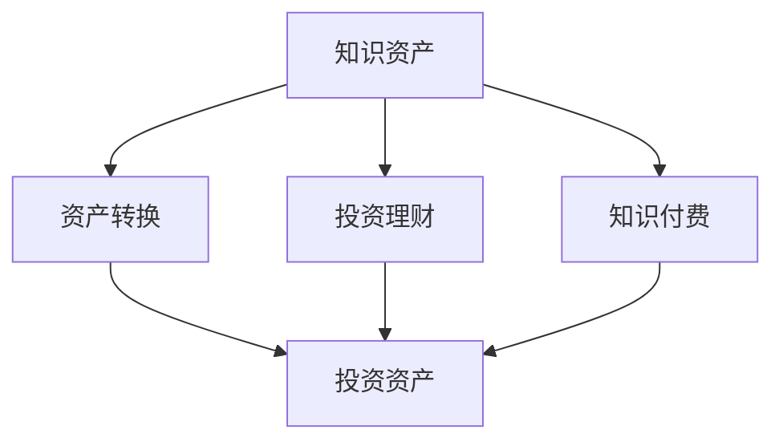

                 

## 1. 背景介绍

在知识经济时代，知识正逐渐成为一种重要资产。知识付费和投资理财作为两大热门领域，各自拥有庞大的用户基础和不断发展的市场需求。然而，将两者相结合，打造一种新的知识资产模式，却鲜有尝试。本文将深入探讨这一创新的知识资产模式，从理论到实践，为读者呈现一套全面的分析框架和方法。

### 1.1 问题由来

随着互联网和移动互联网的迅猛发展，知识的获取方式发生了翻天覆地的变化。传统通过书籍、报纸、电视等传播知识的方式逐渐被在线课程、知识分享社区、音频视频平台等新媒体替代。知识付费应运而生，成为人们获取知识和信息的重要途径。

与此同时，随着经济的快速发展，人们对于财富增值的需求也越来越强烈。投资理财成为许多人实现财富增值的首选途径。然而，投资理财的门槛高、风险大、需要具备深厚的金融和财务知识，使得许多普通人难以涉足。

知识付费和投资理财的结合，既能够满足人们对知识的需求，又能够为投资者提供更广阔的投资视野和知识储备，形成一种良性互动的闭环。这种结合不仅能提升人们的知识水平，还能为投资者提供决策支持，增强投资的安全性和收益性。

### 1.2 问题核心关键点

知识付费与投资理财结合的核心在于如何有效地将知识转化为投资资产，形成一种可以传承和持续增值的知识资产模式。这涉及到以下几个关键点：

- **知识资产的识别和评估**：如何识别有价值的知识资产，并对其价值进行准确评估。
- **投资理财策略的构建**：如何构建适合知识资产的理财策略，以实现资产增值。
- **知识资产与投资资产的转换**：如何将知识资产有效地转换为投资资产，并实现知识与投资的协同效应。
- **风险管理与防范**：如何在知识资产转换过程中管理风险，确保投资的安全性和稳健性。

## 2. 核心概念与联系

### 2.1 核心概念概述

- **知识资产(Knowledge Assets)**：指那些能够带来经济价值或竞争优势的智力资源，如专利、品牌、商标、技术、产品设计等。
- **知识付费(Knowledge Subscription)**：指用户为获取特定的知识和信息而支付费用，以支持创作者或机构持续提供高质量的内容。
- **投资理财(Investment Planning)**：指通过科学的投资策略和管理方法，实现资产的增值和风险控制。
- **资产转换(Asset Conversion)**：将一种资产形式转换为另一种资产形式的过程，如将知识资产转换为金融资产。
- **风险管理(Risk Management)**：识别、评估和控制风险的策略和措施，确保投资资产的安全和稳定。

这些核心概念之间的逻辑关系可以通过以下Mermaid流程图来展示：



### 2.2 核心概念原理和架构

知识资产与投资理财相结合的原理主要基于知识的价值转换和投资的复利效应。

- **知识价值转换**：知识资产通过付费订阅、付费课程、知识分享等形式，转化为用户的知识储备和认知升级。
- **投资复利效应**：知识资产通过理财投资，实现资产的增值和收益，形成复利效应。

知识资产模式的核心架构如下：

1. **知识创造与分享**：创作者通过平台发布高质量的知识内容，用户通过订阅或购买获取知识。
2. **知识吸收与应用**：用户将获取的知识应用到日常生活和工作中，提升效率和竞争力。
3. **知识变现与投资**：用户将知识变现，通过投资理财实现资产增值，形成持续的财富增长。

## 3. 核心算法原理 & 具体操作步骤

### 3.1 算法原理概述

知识资产模式的核心算法原理主要基于知识定价模型和投资组合理论。

- **知识定价模型**：通过评估知识的获取难度、稀缺性、创新性等指标，确定知识资产的价格。
- **投资组合理论**：通过构建多元化的投资组合，分散风险，实现资产的稳健增值。

### 3.2 算法步骤详解

1. **知识资产评估**：
   - 识别有价值的知识资产，如技术专利、专有技术、品牌价值等。
   - 对知识资产进行价值评估，考虑其获取难度、稀缺性、创新性等因素。

2. **知识资产定价**：
   - 根据知识资产的价值评估，确定其定价策略，如订阅价格、课程费用等。
   - 定价时应考虑市场需求、用户支付能力、竞争对手定价等因素。

3. **投资组合构建**：
   - 根据知识资产的定价和用户需求，设计合理的投资组合，包括股票、债券、基金等。
   - 考虑投资组合的风险偏好、投资期限、收益目标等因素。

4. **资产转换与投资**：
   - 将知识资产转化为金融资产，如通过创业公司上市、技术转让、品牌授权等方式。
   - 将转化后的金融资产投资于股票、债券、基金等，实现资产增值。

5. **风险管理与防范**：
   - 对投资组合进行风险评估，识别潜在风险。
   - 采取分散投资、定期平衡、应急预案等措施，防范投资风险。

### 3.3 算法优缺点

知识资产模式的优势在于：
- **知识与投资协同**：知识资产通过付费获取，提升用户认知和决策能力，同时投资资产通过复利增值，形成良性循环。
- **风险分散**：通过多元化投资组合，分散风险，降低投资损失。
- **持续增值**：知识资产和投资资产的结合，实现持续的财富增长。

然而，该模式也存在一些局限性：
- **知识获取门槛**：部分知识资产的定价较高，可能超出部分用户的支付能力。
- **知识与投资不匹配**：某些知识资产可能与投资策略不匹配，影响投资效果。
- **风险管理难度大**：知识资产和投资资产的多样性增加了风险管理的复杂性。

### 3.4 算法应用领域

知识资产模式可以应用于多个领域，如：

- **教育行业**：通过在线教育平台，发布高质量的课程和知识内容，同时用户可以将知识投资到相关的教育基金中。
- **科技行业**：技术创业者可以通过技术转让、创业公司上市等方式，将知识资产转换为金融资产，同时进行多元化投资理财。
- **文化创意行业**：品牌和知识产权可以通过授权、合作等方式，将知识资产转化为金融资产，同时进行风险管理。
- **健康行业**：医疗机构和医生可以通过知识付费、医疗咨询等方式，提升自身的知名度和影响力，同时进行合理的投资理财。

## 4. 数学模型和公式 & 详细讲解 & 举例说明

### 4.1 数学模型构建

知识资产模式涉及的知识定价模型和投资组合理论可以分别用数学模型表示：

- **知识定价模型**：设知识资产的价值为 $V$，获取难度为 $D$，稀缺性为 $S$，创新性为 $I$，定价为 $P$，则定价模型可以表示为：

  $$
  P = f(V, D, S, I)
  $$

- **投资组合理论**：设投资组合中各类资产的比例为 $\omega_i$，风险收益率为 $R_i$，风险为 $\Sigma_i$，则投资组合的风险收益率为：

  $$
  R_{port} = \sum_{i=1}^n \omega_i R_i
  $$

  风险为：

  $$
  \Sigma_{port} = \sqrt{\sum_{i=1}^n \omega_i \Sigma_i^2}
  $$

### 4.2 公式推导过程

以知识定价模型为例，假设知识资产的价值 $V$ 与获取难度 $D$、稀缺性 $S$、创新性 $I$ 之间存在线性关系，则定价模型可以表示为：

$$
P = kV + mD + nS + pI
$$

其中 $k, m, n, p$ 为模型参数，需要通过历史数据进行拟合。

对于投资组合理论，假设各类资产的风险收益率为 $R_i$，风险为 $\Sigma_i$，则投资组合的风险收益率为：

$$
R_{port} = \sum_{i=1}^n \omega_i R_i
$$

其中 $\omega_i$ 为资产 $i$ 在投资组合中的比例，满足 $\sum_{i=1}^n \omega_i = 1$。

### 4.3 案例分析与讲解

假设某科技公司拥有一项创新的算法专利，其价值 $V=1000$ 万元，获取难度 $D=0.5$，稀缺性 $S=0.8$，创新性 $I=0.9$。

根据定价模型，设 $k=0.1, m=0.2, n=0.3, p=0.4$，则该算法专利的定价 $P$ 为：

$$
P = 0.1 \times 1000 + 0.2 \times 0.5 + 0.3 \times 0.8 + 0.4 \times 0.9 = 100 + 0.1 + 0.24 + 0.36 = 101.6 \text{ 万元}
$$

因此，该公司可以将该算法专利以 101.6 万元的价格进行定价和交易。

## 5. 项目实践：代码实例和详细解释说明

### 5.1 开发环境搭建

为了实现知识资产模式的开发，我们需要搭建一个综合性的平台，支持知识付费、投资理财、资产管理等功能。以下是搭建开发环境的流程：

1. **服务器配置**：选择一个云服务提供商，如AWS、阿里云等，配置服务器，安装操作系统和必要软件。
2. **开发环境配置**：使用Docker容器化技术，配置Python、Flask、SQLAlchemy等开发环境。
3. **数据库配置**：选择MySQL或PostgreSQL等关系型数据库，用于存储用户信息、知识内容、投资记录等数据。
4. **前端界面设计**：使用React或Vue等前端技术，设计用户界面，支持知识付费、知识浏览、知识购买、投资理财等功能。

### 5.2 源代码详细实现

以下是一个简单的知识付费与投资理财平台的Python代码实现：

```python
# 知识资产定价模型
class KnowledgeAssetPricing:
    def __init__(self, value, difficulty, scarcity, innovation):
        self.value = value
        self.difficulty = difficulty
        self.scarcity = scarcity
        self.innovation = innovation
        self.k = 0.1
        self.m = 0.2
        self.n = 0.3
        self.p = 0.4
    
    def calculate_price(self):
        price = self.k * self.value + self.m * self.difficulty + self.n * self.scarcity + self.p * self.innovation
        return price

# 投资组合理论
class InvestmentPortfolio:
    def __init__(self, assets, risk_rewards, risks):
        self.assets = assets
        self.risk_rewards = risk_rewards
        self.risks = risks
        self.weights = None
    
    def optimize_weights(self):
        # 使用优化算法求解最优权重
        # ...
        pass
    
    def calculate_risk_rewards(self):
        risk_rewards = []
        for i in range(len(self.assets)):
            risk_reward = self.weights[i] * self.risk_rewards[i]
            risk_rewards.append(risk_reward)
        return sum(risk_rewards)
    
    def calculate_risk(self):
        risk = 0
        for i in range(len(self.assets)):
            risk += self.weights[i] * self.risks[i]**2
        return risk**0.5

# 用户行为管理
class UserBehavior:
    def __init__(self, knowledge_assets, investments):
        self.knowledge_assets = knowledge_assets
        self.investments = investments
        self.knowledge_price = None
        self.investment_portfolio = None
    
    def buy_knowledge(self, knowledge_asset):
        price = knowledge_asset.calculate_price()
        # 进行知识购买
        # ...
        pass
    
    def invest(self, portfolio):
        self.investment_portfolio = portfolio
        self.calculate_risk_rewards()
        self.calculate_risk()

# 平台功能实现
class KnowledgeInvestmentPlatform:
    def __init__(self):
        self.knowledge_assets = []
        self.users = []
        self.investment_ports = []
    
    def add_knowledge_asset(self, asset):
        self.knowledge_assets.append(asset)
    
    def add_user(self, user):
        self.users.append(user)
    
    def add_investment_portfolio(self, portfolio):
        self.investment_ports.append(portfolio)
    
    def user_buy_knowledge(self, user, knowledge_asset):
        user.buy_knowledge(knowledge_asset)
    
    def user_invest(self, user, portfolio):
        user.invest(portfolio)

# 初始化平台
platform = KnowledgeInvestmentPlatform()
# 添加知识资产
asset = KnowledgeAssetPricing(1000, 0.5, 0.8, 0.9)
platform.add_knowledge_asset(asset)
# 添加用户
user = UserBehavior([], [])
platform.add_user(user)
# 用户购买知识
platform.user_buy_knowledge(user, asset)
# 添加投资组合
portfolio = InvestmentPortfolio(['A', 'B', 'C'], [0.1, 0.2, 0.3], [0.1, 0.2, 0.3])
platform.add_investment_portfolio(portfolio)
# 用户投资
platform.user_invest(user, portfolio)
```

### 5.3 代码解读与分析

在上述代码中，我们定义了知识资产定价模型、投资组合理论、用户行为管理以及平台功能实现等关键模块。

- **知识资产定价模型**：通过构造`KnowledgeAssetPricing`类，实现了知识资产定价模型的计算。
- **投资组合理论**：通过构造`InvestmentPortfolio`类，实现了投资组合的优化和风险收益率的计算。
- **用户行为管理**：通过构造`UserBehavior`类，实现了用户购买知识和投资理财的行为管理。
- **平台功能实现**：通过构造`KnowledgeInvestmentPlatform`类，实现了平台功能的集成和调用。

## 6. 实际应用场景

### 6.1 教育行业

在教育行业中，知识资产模式可以应用于在线教育平台。平台发布高质量的在线课程和知识内容，用户通过付费订阅获取知识，同时可以将知识转化为教育基金进行投资理财。

具体应用场景包括：
- 教育内容平台：如Coursera、edX、Udacity等，提供丰富的课程和知识内容，用户通过付费订阅获取知识。
- 教育基金：用户将积累的知识投资到教育基金中，享受复利增值。

### 6.2 科技行业

在科技行业中，知识资产模式可以应用于科技创业公司。科技创业者通过技术转让、创业公司上市等方式，将知识资产转换为金融资产，同时进行多元化投资理财。

具体应用场景包括：
- 技术转让：科技创业者将其创新技术通过技术转让、许可等方式变现。
- 创业公司上市：科技创业公司通过上市融资，实现知识资产的资本化。
- 投资理财：创业者将技术变现的资金投资到股票、债券、基金等多元化资产中，享受复利增值。

### 6.3 文化创意行业

在文化创意行业中，知识资产模式可以应用于品牌和知识产权的管理和运营。品牌和知识产权可以通过授权、合作等方式，将知识资产转化为金融资产，同时进行风险管理。

具体应用场景包括：
- 品牌授权：品牌通过授权他人使用，获取授权费。
- 知识产权转让：知识产权所有者通过转让知识产权，获取转让费。
- 投资理财：品牌和知识产权的变现资金投资到多元化资产中，享受复利增值。

### 6.4 健康行业

在健康行业中，知识资产模式可以应用于医疗机构和医生的知识变现和投资理财。医疗机构和医生通过知识付费、医疗咨询等方式，提升知名度和影响力，同时进行合理的投资理财。

具体应用场景包括：
- 医疗咨询：医生通过提供专业咨询，获取咨询费。
- 知识付费：医疗机构通过发布高质量的健康科普知识，获取订阅费。
- 投资理财：医生和医疗机构将变现的资金投资到多元化资产中，享受复利增值。

## 7. 工具和资源推荐

### 7.1 学习资源推荐

为了掌握知识资产模式，我们推荐以下学习资源：

1. **《金融学基础》**：一本全面介绍金融基础知识的教材，帮助读者理解金融市场和投资理财的基本概念和原理。
2. **《知识付费的市场研究报告》**：分析知识付费市场的发展现状、趋势及前景，为投资者提供参考。
3. **《深度学习与人工智能》**：介绍深度学习、人工智能等前沿技术，帮助理解知识资产模式的实现。
4. **《投资理财实战指南》**：提供实用的投资理财技巧和策略，帮助投资者进行科学决策。

### 7.2 开发工具推荐

为了实现知识资产模式，我们推荐以下开发工具：

1. **Python**：一种广泛使用的编程语言，支持科学计算、数据分析、机器学习等多种应用场景。
2. **Flask**：一个轻量级的Web框架，方便构建Web应用程序。
3. **SQLAlchemy**：一个ORM框架，支持关系型数据库的操作。
4. **Docker**：一个容器化平台，方便应用程序的部署和运维。

### 7.3 相关论文推荐

为了深入了解知识资产模式，我们推荐以下相关论文：

1. **《知识付费模式的市场应用研究》**：探讨知识付费模式在各行业中的应用，分析其市场前景和潜力。
2. **《基于知识付费的投资理财策略研究》**：提出基于知识付费的投资理财策略，帮助投资者进行科学决策。
3. **《知识资产定价模型研究》**：介绍知识资产定价模型的理论基础和实际应用，为知识资产的定价提供参考。
4. **《投资组合理论的最新进展》**：介绍投资组合理论的最新研究成果，为投资理财提供理论支持。

## 8. 总结：未来发展趋势与挑战

### 8.1 总结

本文深入探讨了知识资产模式，从理论到实践，为读者呈现了一套全面的分析框架和方法。知识资产模式结合了知识付费和投资理财的优点，具有巨大的应用潜力。

通过本文的系统梳理，可以看到，知识资产模式正在成为知识经济和金融投资的新范式，其应用前景广阔，有望引领未来经济发展的新趋势。

### 8.2 未来发展趋势

展望未来，知识资产模式将呈现以下几个发展趋势：

1. **市场规模扩大**：随着知识付费和投资理财的普及，知识资产模式的市场规模将不断扩大，成为知识经济和金融投资的重要组成部分。
2. **技术创新加速**：AI、大数据、区块链等技术的进步将推动知识资产模式的进一步发展，提升其智能化、安全性和可靠性。
3. **跨行业融合**：知识资产模式将与更多行业进行深度融合，如教育、科技、文化、医疗等，形成跨行业的知识创新和财富增值生态系统。
4. **政策支持加强**：政府和相关机构将加大对知识资产模式的政策支持和监管力度，促进其健康有序发展。

### 8.3 面临的挑战

尽管知识资产模式具有广阔的市场前景，但在实际应用中，仍面临一些挑战：

1. **知识付费门槛高**：部分高质量的知识资产定价较高，可能超出部分用户的支付能力，影响用户参与度。
2. **知识与投资不匹配**：某些知识资产可能与投资策略不匹配，影响投资效果。
3. **风险管理难度大**：知识资产和投资资产的多样性增加了风险管理的复杂性，需要更先进的风险控制技术。
4. **平台运营成本高**：知识资产平台需要投入大量资源进行知识内容生产和用户管理，运营成本较高。

### 8.4 研究展望

未来，知识资产模式的研究应着重解决以下几个问题：

1. **知识定价模型优化**：研究更科学的知识资产定价模型，降低用户获取知识的成本。
2. **投资组合理论创新**：研究新的投资组合理论，提高投资策略的多样性和稳健性。
3. **风险管理技术提升**：研究更先进的风险管理技术，保障投资资产的安全和稳定。
4. **平台技术优化**：研究高效的平台技术，降低运营成本，提升用户体验。

通过不断突破和创新，知识资产模式必将在未来的知识经济和金融投资领域发挥更大的作用，为社会发展带来新的动力和机遇。

## 9. 附录：常见问题与解答

**Q1: 知识资产模式如何确保知识与投资的协同效应？**

A: 知识资产模式通过将知识变现和投资理财相结合，形成闭环，确保知识与投资的协同效应。具体而言，用户通过购买知识，提升自身认知和决策能力，同时将知识变现投资于多元化资产，实现财富增值，形成良性循环。

**Q2: 知识资产模式在实际应用中需要注意哪些问题？**

A: 在实际应用中，需要注意以下几个问题：
1. 知识资产的定价需要科学合理，确保用户能够承受。
2. 投资组合需要根据用户风险偏好和投资期限进行优化。
3. 风险管理需要多维度考虑，避免过度集中。
4. 平台运营需要投入大量资源，确保知识内容和用户服务的质量。

**Q3: 知识资产模式与传统投资理财有何不同？**

A: 知识资产模式与传统投资理财的不同之处在于，其核心在于知识的变现和投资理财的结合。知识资产模式不仅通过投资理财实现资产增值，还通过知识变现提升用户的认知和决策能力，形成闭环效应。

通过本文的系统梳理，可以看到，知识资产模式正在成为知识经济和金融投资的新范式，其应用前景广阔，有望引领未来经济发展的新趋势。

