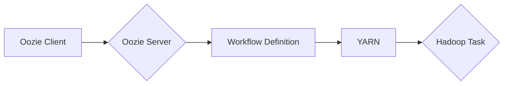

> Oozie,Workflow,Hadoop,YARN,调度,流程引擎,代码实例

## 1. 背景介绍

在海量数据处理时代，Hadoop生态系统作为分布式存储和计算的基石，为大数据处理提供了强大的支持。然而，Hadoop本身并不具备任务调度和流程管理的能力。为了解决这一问题，Apache Oozie应运而生。Oozie是一个开源的Workflow调度系统，专门为Hadoop生态系统设计，它可以管理和调度Hadoop应用程序的执行流程，并提供丰富的监控和管理功能。

Oozie的出现，极大地简化了Hadoop应用程序的开发和部署，提高了大数据处理的效率和可靠性。它允许用户将多个Hadoop任务组合成一个完整的Workflow，并通过Oozie的调度引擎自动执行这些任务，从而实现复杂数据处理流程的自动化管理。

## 2. 核心概念与联系

Oozie的核心概念包括Workflow、Action、Coordinator和Bundle。

* **Workflow:**  一个Workflow是一个由多个Action组成的执行流程，它定义了任务之间的依赖关系和执行顺序。
* **Action:**  一个Action是一个单个的Hadoop任务，例如MapReduce作业、Pig脚本、Hive查询等。
* **Coordinator:**  Coordinator是一个用于管理多个Workflow的调度器，它可以根据预定义的规则和时间表自动启动和停止Workflow。
* **Bundle:**  Bundle是一个包含多个Workflow的集合，它可以用于管理多个相关的Workflow。

Oozie的架构可以概括为以下几个部分：

* **Oozie Server:**  Oozie Server是Oozie的核心组件，它负责管理Workflow、Action、Coordinator和Bundle等资源，并提供Web界面和API接口。
* **Oozie Client:**  Oozie Client是用户与Oozie Server交互的工具，它可以用来提交、监控和管理Workflow。
* **YARN:**  Oozie依赖于YARN（Yet Another Resource Negotiator）来调度和执行Hadoop任务。

**Oozie 架构流程图**



## 3. 核心算法原理 & 具体操作步骤

### 3.1  算法原理概述

Oozie的核心算法原理是基于状态机和事件驱动的。每个Workflow都对应一个状态机，状态机包含不同的状态，例如准备状态、运行状态、成功状态和失败状态。当Workflow执行时，状态机会根据事件的变化而进行状态转换。

Oozie的调度引擎会根据Workflow的定义和当前状态，选择合适的Action并提交到YARN进行执行。当Action执行完成后，Oozie会根据Action的结果更新Workflow的状态。

### 3.2  算法步骤详解

1. **Workflow定义:** 用户使用XML格式定义Workflow，包括Action的类型、参数、依赖关系和执行顺序等。
2. **Workflow提交:** 用户将定义好的Workflow提交到Oozie Server。
3. **Workflow调度:** Oozie Server会根据Workflow的定义和当前状态，选择合适的Action并提交到YARN进行执行。
4. **Action执行:** YARN会根据Action的类型和参数，启动相应的Hadoop任务。
5. **状态更新:** 当Action执行完成后，Oozie Server会根据Action的结果更新Workflow的状态。
6. **Workflow完成:** 当所有Action都执行完成，并且Workflow的状态为成功状态时，Workflow执行完成。

### 3.3  算法优缺点

**优点:**

* **自动化管理:** Oozie可以自动调度和管理Hadoop任务，简化了大数据处理流程。
* **可靠性:** Oozie提供了丰富的监控和管理功能，可以确保Hadoop任务的可靠执行。
* **可扩展性:** Oozie可以处理多个Workflow和大量的Hadoop任务。
* **开源免费:** Oozie是一个开源的项目，可以免费使用。

**缺点:**

* **学习曲线:** Oozie的配置和使用需要一定的学习成本。
* **依赖YARN:** Oozie依赖于YARN来调度和执行Hadoop任务，因此需要确保YARN的稳定运行。
* **功能有限:** Oozie的功能相对有限，无法满足所有大数据处理场景的需求。

### 3.4  算法应用领域

Oozie广泛应用于各种大数据处理场景，例如：

* **数据清洗和转换:** 使用Oozie可以将多个数据清洗和转换任务组合成一个Workflow，自动执行数据处理流程。
* **数据分析和挖掘:** 使用Oozie可以调度和管理数据分析和挖掘任务，例如MapReduce作业、Pig脚本和Hive查询等。
* **机器学习:** 使用Oozie可以调度和管理机器学习训练和预测任务。
* **实时数据处理:** 使用Oozie可以结合流式处理框架，实现实时数据处理。

## 4. 数学模型和公式 & 详细讲解 & 举例说明

### 4.1  数学模型构建

Oozie的调度算法可以抽象为一个状态机模型，其中每个状态代表Workflow的执行阶段，每个状态转换代表Workflow执行过程中的事件发生。

**状态机模型:**

```
状态：准备状态 -> 运行状态 -> 成功状态 -> 失败状态
事件：任务提交 -> 任务执行完成 -> 任务失败 -> Workflow完成
```

### 4.2  公式推导过程

Oozie的调度算法没有明确的数学公式，而是基于状态机模型和事件驱动的逻辑。

### 4.3  案例分析与讲解

假设一个Workflow包含三个Action，Action A依赖于Action B，Action B依赖于Action C。

1. **Workflow处于准备状态:** 等待用户提交。
2. **用户提交Workflow:** Workflow状态变为运行状态。
3. **Oozie调度Action C:** Action C开始执行。
4. **Action C执行完成:** Oozie调度Action B。
5. **Action B执行完成:** Oozie调度Action A。
6. **Action A执行完成:** Workflow状态变为成功状态。

## 5. 项目实践：代码实例和详细解释说明

### 5.1  开发环境搭建

* **Hadoop环境:** 确保本地或云端部署了Hadoop集群。
* **Oozie环境:** 下载并安装Oozie，配置Oozie Server和Oozie Client。
* **开发工具:** 使用Eclipse或IntelliJ IDEA等IDE进行代码开发。

### 5.2  源代码详细实现

以下是一个简单的Oozie Workflow代码示例，用于执行一个MapReduce作业：

```xml
<?xml version="1.0" encoding="UTF-8"?>
<workflow-app xmlns="uri:oozie:workflow:0.4">
  <description>A simple Oozie workflow to execute a MapReduce job</description>
  <start to="map">
    <action name="map">
      <map-reduce>
        <job-tracker>localhost:9000</job-tracker>
        <name-node>localhost:9000</name-node>
        <input>${input_dir}</input>
        <output>${output_dir}</output>
        <script>
          // MapReduce代码
        </script>
      </map-reduce>
    </action>
  </start>
  <kill>
    <error-handler>
      <action name="error">
        <echo>Error occurred during MapReduce execution</echo>
      </action>
    </error-handler>
  </kill>
  <end>
</workflow-app>
```

### 5.3  代码解读与分析

* **`<workflow-app>`:** 定义一个Oozie Workflow应用程序。
* **`<description>`:** 描述Workflow的用途。
* **`<start>`:** 定义Workflow的开始节点。
* **`<action>`:** 定义一个Action，例如MapReduce作业。
* **`<map-reduce>`:** 定义MapReduce作业的配置信息，包括JobTracker、NameNode、输入路径、输出路径和MapReduce代码。
* **`<kill>`:** 定义Workflow的结束节点，用于处理错误情况。
* **`<error-handler>`:** 定义错误处理逻辑。
* **`<end>`:** 定义Workflow的结束节点。

### 5.4  运行结果展示

提交Workflow后，Oozie Server会调度MapReduce作业执行，并将执行结果显示在Oozie Web界面上。

## 6. 实际应用场景

### 6.1  数据清洗和转换

Oozie可以用于构建数据清洗和转换流程，例如：

* 从多个数据源提取数据。
* 对数据进行格式转换和清洗。
* 将数据加载到目标数据仓库。

### 6.2  数据分析和挖掘

Oozie可以用于调度和管理数据分析和挖掘任务，例如：

* 使用MapReduce作业对数据进行统计分析。
* 使用Pig脚本对数据进行数据挖掘。
* 使用Hive查询对数据进行分析。

### 6.3  机器学习

Oozie可以用于调度和管理机器学习训练和预测任务，例如：

* 使用Spark MLlib训练机器学习模型。
* 使用TensorFlow训练深度学习模型。
* 使用机器学习模型进行预测。

### 6.4  未来应用展望

随着大数据处理技术的不断发展，Oozie的应用场景将会更加广泛，例如：

* **实时数据处理:** Oozie可以结合流式处理框架，实现实时数据处理。
* **云计算:** Oozie可以部署在云计算平台上，实现大数据处理的弹性伸缩。
* **物联网:** Oozie可以用于处理物联网数据，实现智能分析和决策。

## 7. 工具和资源推荐

### 7.1  学习资源推荐

* **Oozie官方文档:** https://oozie.apache.org/docs/
* **Oozie教程:** https://www.tutorialspoint.com/oozie/index.htm
* **Hadoop官方文档:** https://hadoop.apache.org/docs/

### 7.2  开发工具推荐

* **Eclipse:** https://www.eclipse.org/
* **IntelliJ IDEA:** https://www.jetbrains.com/idea/

### 7.3  相关论文推荐

* **Oozie: A Workflow Scheduler for Hadoop:** https://www.usenix.org/system/files/conference/osdi10/osdi10-paper-jain.pdf

## 8. 总结：未来发展趋势与挑战

### 8.1  研究成果总结

Oozie作为Hadoop生态系统中重要的Workflow调度系统，已经取得了显著的成果，为大数据处理提供了自动化管理和可靠执行的解决方案。

### 8.2  未来发展趋势

Oozie的未来发展趋势包括：

* **支持更丰富的任务类型:** Oozie将支持更多类型的Hadoop任务，例如Spark作业、Flink作业等。
* **增强实时数据处理能力:** Oozie将结合流式处理框架，实现实时数据处理。
* **提高云计算支持:** Oozie将更好地支持云计算平台，实现大数据处理的弹性伸缩。

### 8.3  面临的挑战

Oozie也面临一些挑战，例如：

* **复杂性:** Oozie的配置和使用相对复杂，需要一定的学习成本。
* **性能优化:** Oozie的调度算法需要不断优化，以提高调度效率和性能。
* **安全性和可靠性:** Oozie需要加强安全性和可靠性，以应对大数据处理的挑战。

### 8.4  研究展望

未来，Oozie的研究方向将集中在以下几个方面：

* **开发更易于使用的调度工具:** 简化Oozie的配置和使用，降低用户学习成本。
* **提高调度算法的效率和性能:** 通过优化调度算法，提高Oozie的调度效率和性能。
* **增强Oozie的安全性和可靠性:** 加强Oozie的安全性和可靠性，以应对大数据处理的挑战。

## 9. 附录：常见问题与解答

### 9.1  Oozie Workflow执行失败怎么办？

如果Oozie Workflow执行失败，可以查看Oozie Web界面上的错误日志，分析错误原因并进行相应的处理。

### 9.2  如何监控Oozie Workflow的执行状态？

Oozie Web界面提供了Workflow执行状态的监控功能，可以实时查看Workflow的执行进度和状态。

### 9.3  如何配置Oozie的调度规则？

Oozie的调度规则可以通过配置文件进行配置，例如指定Workflow的执行