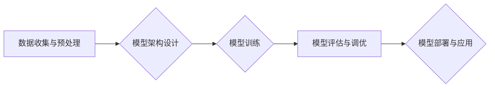

> OpenAI, 大模型, 训练, 应用, Transformer, GPT-3, DALL-E, 

## 1. 背景介绍

近年来，人工智能（AI）领域取得了令人瞩目的进展，其中大模型的出现尤为引人注目。大模型是指参数规模庞大、训练数据海量的人工智能模型，其强大的学习能力和泛化能力使其在自然语言处理、计算机视觉、语音识别等多个领域展现出巨大的潜力。

OpenAI 作为一家致力于推动通用人工智能发展的非营利人工智能研究公司，在推动大模型发展方面发挥了重要作用。其开发的 GPT-3 和 DALL-E 等大模型，不仅在学术界引发了广泛关注，也为各行各业带来了新的应用场景。

本篇文章将深入探讨 OpenAI 大模型的开发与应用实践，涵盖核心概念、算法原理、项目实践、实际应用场景等方面，旨在为读者提供一个全面的了解。

## 2. 核心概念与联系

### 2.1  大模型

大模型是指参数规模庞大、训练数据海量的人工智能模型。其核心特点包括：

* **参数规模庞大:** 大模型通常拥有数十亿甚至数千亿个参数，这使得它们能够学习到更复杂的模式和关系。
* **训练数据海量:** 大模型的训练需要大量的文本、图像、音频等数据，这些数据可以帮助模型更好地理解和生成人类语言和内容。
* **泛化能力强:** 由于其强大的学习能力，大模型能够在不同的任务和领域中表现出良好的泛化能力，即能够应用于未见过的数据和场景。

### 2.2  Transformer

Transformer 是一种新型的神经网络架构，其核心是“注意力机制”，能够有效地捕捉文本序列中的长距离依赖关系。

Transformer 架构的优势在于：

* **并行计算能力强:** Transformer 可以并行处理整个文本序列，大大提高了训练速度。
* **长距离依赖关系处理能力强:** 注意力机制能够有效地捕捉文本序列中的长距离依赖关系，这对于理解复杂的句子结构和语义关系至关重要。

### 2.3  OpenAI

OpenAI 是一家致力于推动通用人工智能发展的非营利人工智能研究公司。其目标是确保人工智能技术造福全人类，并避免其潜在的风险。

OpenAI 开发了许多重要的 AI 模型，包括 GPT-3、DALL-E 等，这些模型在自然语言处理、计算机视觉等领域取得了突破性的进展。

**OpenAI 大模型开发与应用实践流程图**



## 3. 核心算法原理 & 具体操作步骤

### 3.1  算法原理概述

OpenAI 大模型的训练主要基于深度学习算法，其中 Transformer 架构是其核心。Transformer 利用注意力机制，能够有效地捕捉文本序列中的长距离依赖关系，从而实现更准确的语言理解和生成。

### 3.2  算法步骤详解

1. **数据收集与预处理:** 收集大量文本数据，并进行清洗、分词、标记等预处理操作，以便于模型训练。
2. **模型架构设计:** 根据任务需求，设计 Transformer 模型的架构，包括编码器、解码器、注意力机制等模块。
3. **模型训练:** 使用训练数据训练模型，通过反向传播算法不断调整模型参数，使其能够更好地预测目标输出。
4. **模型评估与调优:** 使用验证集评估模型性能，并根据评估结果调整模型超参数，例如学习率、批处理大小等，以提高模型性能。
5. **模型部署与应用:** 将训练好的模型部署到生产环境中，用于实际应用，例如文本生成、机器翻译、问答系统等。

### 3.3  算法优缺点

**优点:**

* 强大的学习能力和泛化能力
* 能够处理长距离依赖关系
* 并行计算能力强

**缺点:**

* 训练成本高
* 需要大量的数据
* 容易出现过拟合问题

### 3.4  算法应用领域

* 自然语言处理：文本生成、机器翻译、问答系统、情感分析等
* 计算机视觉：图像识别、物体检测、图像生成等
* 语音识别：语音转文本、语音合成等
* 其他领域：药物研发、金融预测、代码生成等

## 4. 数学模型和公式 & 详细讲解 & 举例说明

### 4.1  数学模型构建

OpenAI 大模型的数学模型主要基于 Transformer 架构，其核心是注意力机制。注意力机制可以理解为一种“关注”机制，模型在处理文本序列时，会根据每个词的重要性程度分配不同的注意力权重，从而更好地捕捉文本中的关键信息。

### 4.2  公式推导过程

注意力机制的计算公式如下：

$$
Attention(Q, K, V) = softmax(\frac{QK^T}{\sqrt{d_k}})V
$$

其中：

* $Q$：查询矩阵
* $K$：键矩阵
* $V$：值矩阵
* $d_k$：键向量的维度
* $softmax$：softmax 函数

### 4.3  案例分析与讲解

假设我们有一个句子“我爱学习编程”，我们需要计算每个词对“学习”的注意力权重。

1. 将句子转换为词嵌入向量，得到 $Q$、$K$ 和 $V$ 矩阵。
2. 计算 $QK^T$，得到一个注意力分数矩阵。
3. 对注意力分数矩阵进行 softmax 操作，得到每个词对“学习”的注意力权重。
4. 将注意力权重与值矩阵 $V$ 进行加权求和，得到最终的输出向量。

## 5. 项目实践：代码实例和详细解释说明

### 5.1  开发环境搭建

OpenAI 提供了 API 接口，可以方便地调用其大模型进行文本生成、图像生成等任务。

开发环境搭建步骤如下：

1. 安装 Python 3.6 或更高版本。
2. 安装 OpenAI 库：`pip install openai`
3. 获取 OpenAI API 密钥：https://platform.openai.com/account/api-keys

### 5.2  源代码详细实现

```python
import openai

# 设置 OpenAI API 密钥
openai.api_key = "YOUR_API_KEY"

# 使用 GPT-3 模型生成文本
response = openai.Completion.create(
    engine="text-davinci-003",
    prompt="写一首关于春天的诗",
    max_tokens=100,
    temperature=0.7
)

# 打印生成文本
print(response.choices[0].text)
```

### 5.3  代码解读与分析

* `openai.Completion.create()` 函数用于调用 OpenAI 的文本生成 API。
* `engine` 参数指定使用的模型，这里使用的是 GPT-3 的 davinci-003 版本。
* `prompt` 参数指定输入的文本提示，这里是一个关于春天的诗歌要求。
* `max_tokens` 参数指定生成的文本长度，这里设置为 100 个 token。
* `temperature` 参数控制文本生成的随机性，这里设置为 0.7，表示生成的文本会有一定的随机性。

### 5.4  运行结果展示

```
春风拂面暖如春，
花开满园香飘远。
小鸟歌唱枝头俏，
万物复苏生机新。
```

## 6. 实际应用场景

### 6.1  自然语言处理

* **文本生成:** 生成小说、诗歌、剧本、新闻报道等各种文本内容。
* **机器翻译:** 将文本从一种语言翻译成另一种语言。
* **问答系统:** 回答用户提出的问题，例如搜索引擎、聊天机器人等。
* **情感分析:** 分析文本中的情感倾向，例如判断用户对产品的评价。

### 6.2  计算机视觉

* **图像识别:** 将图像识别为特定的物体或场景。
* **物体检测:** 在图像中检测到特定物体的位置和大小。
* **图像生成:** 根据文本描述生成图像。

### 6.3  语音识别

* **语音转文本:** 将语音转换为文本。
* **语音合成:** 将文本转换为语音。

### 6.4  未来应用展望

OpenAI 大模型的应用前景广阔，未来可能在以下领域发挥更大的作用：

* **个性化教育:** 根据学生的学习情况提供个性化的学习内容和辅导。
* **医疗诊断:** 辅助医生进行疾病诊断和治疗方案制定。
* **科学研究:** 加速科学研究的进程，例如药物研发、材料科学等。
* **艺术创作:** 帮助艺术家创作新的艺术作品。

## 7. 工具和资源推荐

### 7.1  学习资源推荐

* **OpenAI 官方文档:** https://platform.openai.com/docs/
* **Hugging Face:** https://huggingface.co/
* **DeepLearning.AI:** https://www.deeplearning.ai/

### 7.2  开发工具推荐

* **Python:** https://www.python.org/
* **Jupyter Notebook:** https://jupyter.org/

### 7.3  相关论文推荐

* **Attention Is All You Need:** https://arxiv.org/abs/1706.03762
* **Language Models are Few-Shot Learners:** https://arxiv.org/abs/2005.14165

## 8. 总结：未来发展趋势与挑战

### 8.1  研究成果总结

OpenAI 大模型的开发取得了显著的成果，其强大的学习能力和泛化能力为人工智能的发展带来了新的机遇。

### 8.2  未来发展趋势

* **模型规模进一步扩大:** 未来大模型的规模将继续扩大，参数数量将达到数万亿甚至数千亿。
* **多模态学习:** 大模型将能够处理多种模态数据，例如文本、图像、音频等，实现跨模态的理解和生成。
* **可解释性增强:** 研究人员将致力于提高大模型的可解释性，使其决策过程更加透明和可理解。

### 8.3  面临的挑战

* **训练成本高:** 大模型的训练需要大量的计算资源和时间，成本非常高。
* **数据安全和隐私:** 大模型的训练需要大量数据，如何保证数据安全和隐私是一个重要的挑战。
* **伦理问题:** 大模型的应用可能带来一些伦理问题，例如算法偏见、信息操纵等，需要引起足够的重视。

### 8.4  研究展望

未来，OpenAI 大模型的研究将继续深入，探索更强大的模型架构、更有效的训练方法、更广泛的应用场景，为人工智能的未来发展做出更大的贡献。

## 9. 附录：常见问题与解答

### 9.1  Q: OpenAI 大模型的训练需要多少数据？

A: OpenAI 大模型的训练需要海量的文本数据，通常需要数十亿甚至数千亿个单词。

### 9.2  Q: OpenAI 大模型的训练成本是多少？

A: OpenAI 大模型的训练成本非常高，可能需要数百万甚至数千万美元。

### 9.3  Q: 如何使用 OpenAI 大模型？

A: OpenAI 提供了 API 接口，可以方便地调用其大模型进行文本生成、图像生成等任务。

### 9.4  Q: OpenAI 大模型有哪些应用场景？

A: OpenAI 大模型的应用场景非常广泛，包括自然语言处理、计算机视觉、语音识别等领域。

### 9.5  Q: OpenAI 大模型的未来发展趋势是什么？

A: OpenAI 大模型的未来发展趋势包括模型规模扩大、多模态学习、可解释性增强等。


作者：禅与计算机程序设计艺术 / Zen and the Art of Computer Programming 
<end_of_turn>