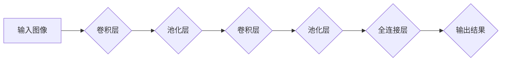

> 卷积神经网络(CNN)，图像处理，Python，机器学习，深度学习，图像分类，物体检测

## 1. 背景介绍

图像处理是计算机视觉领域的核心应用之一，它涉及识别、分类、分割、检测等各种任务。随着深度学习技术的兴起，卷积神经网络(CNN)在图像处理领域取得了显著的成就，成为图像处理领域的主流算法之一。

CNN 是一种专门设计用于处理图像数据的深度神经网络，其结构灵感来源于生物视觉系统。CNN 利用卷积操作和池化操作来提取图像特征，并通过多层网络结构进行特征学习和分类。

本文将深入探讨 CNN 在图像处理中的应用，包括其核心概念、算法原理、数学模型、代码实现以及实际应用场景。

## 2. 核心概念与联系

### 2.1 卷积神经网络(CNN)

CNN 是一种特殊的深度神经网络，其结构由多个卷积层、池化层和全连接层组成。

* **卷积层:** 卷积层是 CNN 的核心，它利用卷积核对图像进行卷积操作，提取图像局部特征。卷积核是一个小的矩阵，它在图像上滑动，并与图像局部区域进行卷积运算，生成特征图。

* **池化层:** 池化层用于对特征图进行降维，减少计算量并提高网络的鲁棒性。常见的池化操作包括最大池化和平均池化。

* **全连接层:** 全连接层将提取的特征进行分类或回归。全连接层将所有特征图上的特征连接起来，并通过激活函数进行非线性变换。

### 2.2 图像处理任务

CNN 在图像处理领域应用广泛，包括：

* **图像分类:** 将图像分类到预定义的类别中，例如识别猫、狗、车等。

* **物体检测:** 在图像中检测到特定物体的位置和类别，例如检测图像中的汽车、人、自行车等。

* **图像分割:** 将图像分割成不同的区域，例如分割图像中的前景和背景。

* **图像生成:** 生成新的图像，例如生成人脸、风景等。

### 2.3 Mermaid 流程图



## 3. 核心算法原理 & 具体操作步骤

### 3.1 算法原理概述

CNN 的核心原理是利用卷积操作和池化操作来提取图像特征。卷积操作通过卷积核对图像进行滑动运算，提取图像局部特征。池化操作通过对特征图进行降维，减少计算量并提高网络的鲁棒性。

CNN 通过多层网络结构进行特征学习和分类。每一层网络都学习到图像特征的更高层次表示。

### 3.2 算法步骤详解

1. **输入图像预处理:** 将输入图像转换为适合 CNN 处理的格式，例如调整图像大小、归一化像素值等。

2. **卷积操作:** 利用卷积核对图像进行卷积运算，生成特征图。

3. **池化操作:** 对特征图进行池化操作，例如最大池化或平均池化，减少特征图的大小。

4. **激活函数:** 将卷积和池化操作的结果输入激活函数，例如ReLU函数，引入非线性变换。

5. **全连接层:** 将提取的特征连接起来，并通过全连接层进行分类或回归。

6. **输出结果:** 将全连接层的输出结果进行softmax操作，得到图像分类的概率分布。

### 3.3 算法优缺点

**优点:**

* **提取图像特征能力强:** CNN 可以自动学习图像特征，无需人工特征工程。

* **鲁棒性强:** CNN 对图像的旋转、缩放、平移等变换具有鲁棒性。

* **应用广泛:** CNN 在图像分类、物体检测、图像分割等各种图像处理任务中都有着优异的性能。

**缺点:**

* **计算量大:** CNN 的训练过程需要大量的计算资源。

* **参数量大:** CNN 的参数量很大，需要大量的训练数据才能有效训练。

* **可解释性差:** CNN 的决策过程比较复杂，难以解释其决策依据。

### 3.4 算法应用领域

CNN 在图像处理领域应用广泛，包括：

* **计算机视觉:** 图像分类、物体检测、图像分割、人脸识别、场景理解等。

* **医疗影像分析:** 病灶检测、疾病诊断、图像分割等。

* **自动驾驶:** 车辆识别、道路场景理解、行人检测等。

* **机器人视觉:** 物体识别、导航、抓取等。

## 4. 数学模型和公式 & 详细讲解 & 举例说明

### 4.1 数学模型构建

CNN 的数学模型主要包括卷积操作、池化操作和激活函数。

* **卷积操作:** 卷积操作的数学公式如下：

$$
y(i,j) = \sum_{m=0}^{M-1} \sum_{n=0}^{N-1} x(i+m,j+n) * w(m,n)
$$

其中：

* $y(i,j)$ 是卷积核输出的特征图上的像素值。

* $x(i+m,j+n)$ 是输入图像上的像素值。

* $w(m,n)$ 是卷积核的权值。

* $M$ 和 $N$ 是卷积核的大小。

* **池化操作:** 池化操作的数学公式如下：

$$
y(i,j) = \max_{m=0}^{k-1} \max_{n=0}^{l-1} x(i*s+m,j*s+n)
$$

其中：

* $y(i,j)$ 是池化后的特征图上的像素值。

* $x(i*s+m,j*s+n)$ 是输入特征图上的像素值。

* $s$ 是池化窗口的大小。

* $k$ 和 $l$ 是池化窗口的大小。

* **激活函数:** 常见的激活函数包括ReLU函数、Sigmoid函数、Tanh函数等。

### 4.2 公式推导过程

卷积操作的数学公式推导过程如下：

1. 将卷积核 $w(m,n)$ 作为模板，在输入图像 $x(i,j)$ 上滑动。

2. 在每个位置，将卷积核与图像局部区域进行点乘运算。

3. 将所有点乘结果相加，得到卷积核输出的特征图上的像素值 $y(i,j)$。

池化操作的数学公式推导过程如下：

1. 将池化窗口 $s$ 作为模板，在输入特征图 $x(i,j)$ 上滑动。

2. 在每个位置，对池化窗口内的像素值进行最大值或平均值运算。

3. 将运算结果作为池化后的特征图上的像素值 $y(i,j)$。

### 4.3 案例分析与讲解

**案例:**

假设输入图像大小为 $32 \times 32$，卷积核大小为 $3 \times 3$，步长为 $1$。

**卷积操作:**

卷积核在图像上滑动，每个位置进行卷积运算，生成特征图。特征图的大小取决于卷积核大小、步长和输入图像大小。

**池化操作:**

池化窗口大小为 $2 \times 2$，步长为 $2$。池化操作对特征图进行降维，生成新的特征图。

## 5. 项目实践：代码实例和详细解释说明

### 5.1 开发环境搭建

* **Python:** 使用 Python 3.6 或更高版本。

* **深度学习框架:** 使用 TensorFlow 或 PyTorch 等深度学习框架。

* **其他库:** 使用 NumPy、Matplotlib 等其他库。

### 5.2 源代码详细实现

```python
import tensorflow as tf

# 定义 CNN 模型
model = tf.keras.models.Sequential([
    tf.keras.layers.Conv2D(32, (3, 3), activation='relu', input_shape=(32, 32, 3)),
    tf.keras.layers.MaxPooling2D((2, 2)),
    tf.keras.layers.Conv2D(64, (3, 3), activation='relu'),
    tf.keras.layers.MaxPooling2D((2, 2)),
    tf.keras.layers.Flatten(),
    tf.keras.layers.Dense(10, activation='softmax')
])

# 编译模型
model.compile(optimizer='adam',
              loss='sparse_categorical_crossentropy',
              metrics=['accuracy'])

# 训练模型
model.fit(x_train, y_train, epochs=10)

# 评估模型
loss, accuracy = model.evaluate(x_test, y_test)
print('Test loss:', loss)
print('Test accuracy:', accuracy)
```

### 5.3 代码解读与分析

* **定义 CNN 模型:** 使用 TensorFlow 的 `keras` API 定义 CNN 模型。模型包含卷积层、池化层和全连接层。

* **编译模型:** 使用 `adam` 优化器、`sparse_categorical_crossentropy` 损失函数和 `accuracy` 评价指标编译模型。

* **训练模型:** 使用 `fit` 方法训练模型，输入训练数据 `x_train` 和标签 `y_train`，训练 10 个 epochs。

* **评估模型:** 使用 `evaluate` 方法评估模型，输入测试数据 `x_test` 和标签 `y_test`，输出测试损失和准确率。

### 5.4 运行结果展示

训练完成后，可以将模型应用于新的图像数据进行预测。

## 6. 实际应用场景

### 6.1 图像分类

CNN 可以用于识别图像中的物体类别，例如识别猫、狗、车等。

### 6.2 物体检测

CNN 可以用于检测图像中物体的位置和类别，例如检测图像中的汽车、人、自行车等。

### 6.3 图像分割

CNN 可以用于将图像分割成不同的区域，例如分割图像中的前景和背景。

### 6.4 未来应用展望

CNN 在图像处理领域有着广阔的应用前景，未来将应用于更多领域，例如：

* **医疗影像分析:** 更精准的疾病诊断、更有效的治疗方案。

* **自动驾驶:** 更安全的驾驶体验、更智能的交通系统。

* **机器人视觉:** 更强大的机器人感知能力、更灵活的机器人操作。

## 7. 工具和资源推荐

### 7.1 学习资源推荐

* **书籍:**

    * 《深度学习》
    * 《Python机器学习实战》

* **在线课程:**

    * Coursera: 深度学习
    * Udacity: 计算机视觉

### 7.2 开发工具推荐

* **深度学习框架:** TensorFlow, PyTorch

* **图像处理库:** OpenCV

### 7.3 相关论文推荐

* **AlexNet:** ImageNet Classification with Deep Convolutional Neural Networks

* **VGGNet:** Very Deep Convolutional Networks for Large-Scale Image Recognition

* **ResNet:** Deep Residual Learning for Image Recognition

## 8. 总结：未来发展趋势与挑战

### 8.1 研究成果总结

CNN 在图像处理领域取得了显著的成果，例如在图像分类、物体检测、图像分割等任务上取得了人类水平的性能。

### 8.2 未来发展趋势

* **模型更深更广:** 探索更深更广的 CNN 模型结构，提高模型的表达能力和泛化能力。

* **数据更丰富更多样:** 收集更丰富、更多样化的图像数据，提高模型的鲁棒性和泛化能力。

* **计算资源更强大:** 利用更强大的计算资源，训练更复杂的 CNN 模型。

* **解释性更强:** 研究 CNN