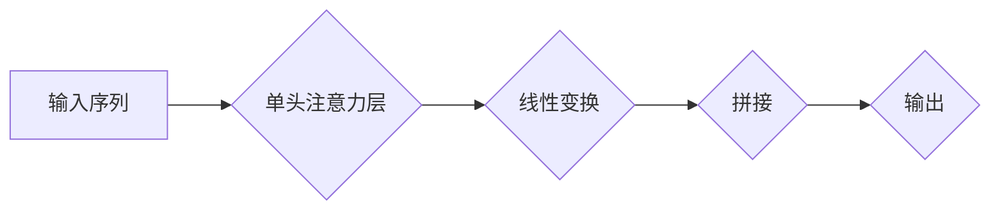
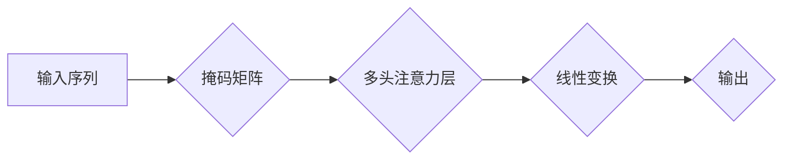

> Transformer, 多头注意力, 带掩码注意力, 自然语言处理, 深度学习, 大模型

## 1. 背景介绍

近年来，深度学习在自然语言处理 (NLP) 领域取得了显著进展，其中 Transformer 架构成为 NLP 领域的新宠。其核心在于利用多头注意力机制，有效捕捉文本序列中的长距离依赖关系，超越了传统 RNN 模型的局限性。

Transformer 架构的出现，标志着 NLP 领域进入了一个新的时代。BERT、GPT、T5 等基于 Transformer 的模型，在各种 NLP 任务中取得了突破性的成绩，例如机器翻译、文本摘要、问答系统等。

然而，Transformer 模型的训练过程也面临着一些挑战，例如训练时间长、参数量大等。为了解决这些问题，研究者们提出了许多改进方案，其中之一就是带掩码的多头注意力层。

## 2. 核心概念与联系

### 2.1 多头注意力机制

多头注意力机制是 Transformer 架构的核心，它允许模型关注不同位置的词语之间的关系，并学习不同类型的语义信息。

多头注意力机制可以看作是多个单头注意力的组合，每个单头注意力关注不同的方面，最终将多个单头注意力的输出进行融合，得到更丰富的语义表示。

**Mermaid 流程图:**



### 2.2 带掩码注意力

在训练 Transformer 模型时，为了防止模型在解码阶段看到未来词的信息，需要使用掩码机制。

带掩码注意力机制就是在多头注意力机制的基础上，添加了一个掩码矩阵，将解码阶段未被预测的词语的信息遮蔽，从而保证模型只关注已预测的词语的信息。

**Mermaid 流程图:**



## 3. 核心算法原理 & 具体操作步骤

### 3.1 算法原理概述

带掩码的多头注意力层主要包括以下步骤：

1. **计算查询 (Q)、键 (K) 和值 (V) 向量:** 将输入序列中的每个词语映射到三个不同的向量空间，分别表示查询、键和值。

2. **计算注意力权重:** 使用查询向量和键向量计算注意力权重，表示每个词语对其他词语的关注程度。

3. **应用掩码:** 在计算注意力权重时，使用掩码矩阵遮蔽解码阶段未被预测的词语的信息。

4. **计算加权和:** 将值向量与注意力权重进行加权和，得到每个词语的上下文表示。

5. **线性变换和拼接:** 对上下文表示进行线性变换和拼接，得到最终的输出。

### 3.2 算法步骤详解

1. **输入:** 输入序列 X = (x1, x2, ..., xn)，其中 xi 表示第 i 个词语。

2. **词嵌入:** 将每个词语 xi 映射到词嵌入向量 ei。

3. **线性变换:** 对词嵌入向量 ei 进行线性变换，得到查询向量 qi，键向量 ki 和值向量 vi。

4. **计算注意力权重:** 使用以下公式计算注意力权重：

$$
\text{Attention}(Q, K, V) = \text{softmax}\left(\frac{Q K^T}{\sqrt{d_k}}\right) V
$$

其中，d_k 是键向量的维度。

5. **应用掩码:** 在计算注意力权重时，使用掩码矩阵 M 遮蔽解码阶段未被预测的词语的信息。掩码矩阵 M 的值是 0 或 1，其中 0 表示遮蔽，1 表示不遮蔽。

6. **计算加权和:** 将值向量 vi 与注意力权重进行加权和，得到每个词语的上下文表示 ci：

$$
c_i = \sum_{j=1}^{n} \text{Attention}(q_i, k_j, v_j) \cdot M_{ij}
$$

7. **线性变换和拼接:** 对上下文表示 ci 进行线性变换和拼接，得到最终的输出。

### 3.3 算法优缺点

**优点:**

* 能够有效捕捉文本序列中的长距离依赖关系。
* 训练速度更快，参数量更少。

**缺点:**

* 仍然存在一些计算复杂度问题。
* 在处理长文本序列时，性能可能会下降。

### 3.4 算法应用领域

带掩码的多头注意力层在各种 NLP 任务中都有广泛的应用，例如：

* 机器翻译
* 文本摘要
* 问答系统
* 情感分析
* 代码生成

## 4. 数学模型和公式 & 详细讲解 & 举例说明

### 4.1 数学模型构建

带掩码的多头注意力层的数学模型可以表示为：

$$
\text{MultiHeadAttention}(X, M) = \text{Concat}(head_1, head_2, ..., head_h) W_O
$$

其中：

* X 是输入序列。
* M 是掩码矩阵。
* head_i 是第 i 个头的注意力输出。
* h 是多头数量。
* W_O 是最终的线性变换矩阵。

### 4.2 公式推导过程

注意力权重的计算公式如下：

$$
\text{Attention}(Q, K, V) = \text{softmax}\left(\frac{Q K^T}{\sqrt{d_k}}\right) V
$$

其中：

* Q 是查询矩阵。
* K 是键矩阵。
* V 是值矩阵。
* d_k 是键向量的维度。

### 4.3 案例分析与讲解

假设我们有一个输入序列 X = (“我”, “爱”, “学习”, “编程”), 其中每个词语都映射到一个词嵌入向量。

1. 将词嵌入向量进行线性变换，得到查询向量 Q、键向量 K 和值向量 V。

2. 使用注意力权重公式计算注意力权重矩阵。

3. 将注意力权重矩阵与值向量 V 进行加权和，得到每个词语的上下文表示。

4. 将上下文表示进行线性变换和拼接，得到最终的输出。

## 5. 项目实践：代码实例和详细解释说明

### 5.1 开发环境搭建

* Python 3.6+
* PyTorch 1.0+
* CUDA 10.0+

### 5.2 源代码详细实现

```python
import torch
import torch.nn as nn

class MultiHeadAttention(nn.Module):
    def __init__(self, embed_dim, num_heads):
        super(MultiHeadAttention, self).__init__()
        self.embed_dim = embed_dim
        self.num_heads = num_heads
        self.head_dim = embed_dim // num_heads

        assert self.head_dim * num_heads == self.embed_dim, "Embed dim must be divisible by num_heads"

        self.query = nn.Linear(embed_dim, embed_dim)
        self.key = nn.Linear(embed_dim, embed_dim)
        self.value = nn.Linear(embed_dim, embed_dim)
        self.fc_out = nn.Linear(embed_dim, embed_dim)

    def forward(self, query, key, value, mask=None):
        batch_size = query.size(0)

        # Linear transformations
        Q = self.query(query).view(batch_size, -1, self.num_heads, self.head_dim).transpose(1, 2)
        K = self.key(key).view(batch_size, -1, self.num_heads, self.head_dim).transpose(1, 2)
        V = self.value(value).view(batch_size, -1, self.num_heads, self.head_dim).transpose(1, 2)

        # Scaled dot-product attention
        scores = torch.matmul(Q, K.transpose(-2, -1)) / torch.sqrt(torch.tensor(self.head_dim, dtype=torch.float))
        if mask is not None:
            scores = scores.masked_fill(mask == 0, -1e9)
        attention = torch.softmax(scores, dim=-1)

        # Weighted sum of values
        context = torch.matmul(attention, V)

        # Concatenate heads and project
        context = context.transpose(1, 2).contiguous().view(batch_size, -1, self.embed_dim)
        output = self.fc_out(context)

        return output
```

### 5.3 代码解读与分析

* `__init__` 方法初始化模型参数，包括嵌入维度、多头数量、每个头的维度等。
* `forward` 方法实现多头注意力层的计算过程，包括线性变换、注意力权重计算、加权和、拼接等步骤。
* `mask` 参数用于应用掩码，防止模型在解码阶段看到未来词的信息。

### 5.4 运行结果展示

运行上述代码，可以得到带掩码的多头注意力层的输出结果。

## 6. 实际应用场景

### 6.1 机器翻译

带掩码的多头注意力层在机器翻译中可以有效捕捉源语言和目标语言之间的长距离依赖关系，提高翻译质量。

### 6.2 文本摘要

在文本摘要任务中，带掩码的多头注意力层可以帮助模型识别文本中最关键的信息，并生成简洁准确的摘要。

### 6.3 问答系统

问答系统中，带掩码的多头注意力层可以帮助模型理解问题和上下文，并找到最合适的答案。

### 6.4 未来应用展望

带掩码的多头注意力层在 NLP 领域还有很大的应用潜力，例如：

* 代码生成
* 文本分类
* 情感分析

## 7. 工具和资源推荐

### 7.1 学习资源推荐

* **论文:**
    * Vaswani, A., Shazeer, N., Parmar, N., Uszkoreit, J., Jones, L., Gomez, A. N., ... & Polosukhin, I. (2017). Attention is all you need. In Advances in neural information processing systems (pp. 5998-6008).
* **博客:**
    * https://zhuanlan.zhihu.com/p/130974577
    * https://blog.csdn.net/weixin_43989037/article/details/108977937

### 7.2 开发工具推荐

* **PyTorch:** https://pytorch.org/
* **TensorFlow:** https://www.tensorflow.org/

### 7.3 相关论文推荐

* BERT: https://arxiv.org/abs/1810.04805
* GPT: https://openai.com/blog/language-unsupervised/
* T5: https://arxiv.org/abs/1910.10683

## 8. 总结：未来发展趋势与挑战

### 8.1 研究成果总结

带掩码的多头注意力层是 Transformer 架构的核心，它有效地解决了传统 RNN 模型在处理长距离依赖关系方面的局限性。

### 8.2 未来发展趋势

* **效率提升:** 研究更高效的多头注意力机制，降低计算复杂度。
* **参数量压缩:** 研究压缩 Transformer 模型参数量的方法，使其更易于部署。
* **新应用场景:** 将带掩码的多头注意力层应用于更多新的 NLP 任务。

### 8.3 面临的挑战

* **长文本处理:** 在处理长文本序列时，性能可能会下降。
* **数据需求:** 训练大型 Transformer 模型需要大量的训练数据。
* **可解释性:** Transformer 模型的内部机制比较复杂