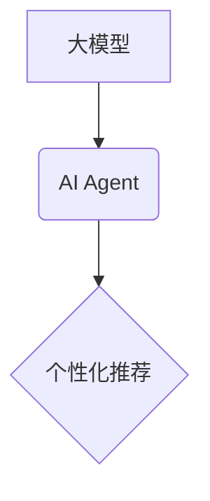

> 大模型、AI Agent、个性化推荐、算法原理、项目实践、应用场景

## 1. 背景介绍

近年来，深度学习技术取得了飞速发展，大模型的出现为人工智能领域带来了革命性的变革。大模型，是指参数规模庞大、训练数据海量的人工智能模型，其强大的学习能力和泛化能力使其能够在各种任务中表现出色，例如自然语言处理、计算机视觉、语音识别等。

个性化推荐作为一种重要的应用场景，旨在根据用户的兴趣、偏好、行为等信息，为用户提供精准、个性化的商品、服务或内容推荐。传统的个性化推荐系统主要依赖于用户的显性反馈，例如评分、点赞等，但这种方式往往难以捕捉用户的隐性需求。

大模型的出现为个性化推荐带来了新的机遇。大模型能够通过学习海量用户数据，挖掘用户的隐性需求，并生成更精准、更个性化的推荐结果。

## 2. 核心概念与联系

### 2.1  大模型

大模型是指参数规模庞大、训练数据海量的人工智能模型。其强大的学习能力和泛化能力使其能够在各种任务中表现出色，例如自然语言处理、计算机视觉、语音识别等。

### 2.2  AI Agent

AI Agent是指能够感知环境、做出决策并与环境交互的智能体。AI Agent可以是软件程序、机器人或其他智能系统。

### 2.3  个性化推荐

个性化推荐是指根据用户的兴趣、偏好、行为等信息，为用户提供精准、个性化的商品、服务或内容推荐。

**核心概念联系：**

大模型可以作为AI Agent的底层技术，为AI Agent提供强大的学习和推理能力。AI Agent可以利用大模型的知识和能力，实现个性化推荐的功能。



## 3. 核心算法原理 & 具体操作步骤

### 3.1  算法原理概述

个性化推荐算法的核心是学习用户和物品之间的关系，并预测用户对特定物品的兴趣。常用的算法包括：

* **协同过滤:** 基于用户的历史行为或物品的相似性进行推荐。
* **内容过滤:** 基于物品的特征或描述进行推荐。
* **混合推荐:** 结合协同过滤和内容过滤的优点进行推荐。

### 3.2  算法步骤详解

以协同过滤算法为例，其具体步骤如下：

1. **数据收集:** 收集用户对物品的评分、购买记录、浏览历史等数据。
2. **用户-物品矩阵构建:** 将用户和物品作为矩阵的行和列，用户对物品的评分作为矩阵的元素。
3. **相似性计算:** 计算用户之间的相似度或物品之间的相似度。常用的相似度度量方法包括余弦相似度、皮尔逊相关系数等。
4. **推荐生成:** 根据用户的相似用户或物品的相似物品，生成推荐列表。

### 3.3  算法优缺点

**协同过滤算法:**

* **优点:** 能够发现隐性关系，推荐个性化结果。
* **缺点:** 数据稀疏性问题、冷启动问题、数据偏差问题。

**内容过滤算法:**

* **优点:** 不需要用户历史数据，能够推荐新物品。
* **缺点:** 难以捕捉用户隐性需求，推荐结果可能过于单一。

### 3.4  算法应用领域

个性化推荐算法广泛应用于电商、视频网站、音乐平台、社交媒体等领域，例如：

* **商品推荐:** 为用户推荐相关的商品。
* **内容推荐:** 为用户推荐相关的文章、视频、音乐等内容。
* **广告推荐:** 为用户推荐相关的广告。

## 4. 数学模型和公式 & 详细讲解 & 举例说明

### 4.1  数学模型构建

协同过滤算法的核心是用户-物品交互矩阵，其元素表示用户对物品的评分或行为。假设用户集合为U，物品集合为I，则用户-物品交互矩阵为R，其维度为|U| x |I|。

### 4.2  公式推导过程

**余弦相似度:**

用户u和用户v的余弦相似度定义为：

$$
\text{sim}(u, v) = \frac{\sum_{i \in I} r_{ui} \cdot r_{vi}}{\sqrt{\sum_{i \in I} r_{ui}^2} \cdot \sqrt{\sum_{i \in I} r_{vi}^2}}
$$

其中，$r_{ui}$表示用户u对物品i的评分。

**举例说明:**

假设有两个用户u和v，他们的评分矩阵如下：

| 物品 | u | v |
|---|---|---|
| A | 5 | 4 |
| B | 3 | 2 |
| C | 4 | 5 |

则用户u和用户v的余弦相似度为：

$$
\text{sim}(u, v) = \frac{(5 \cdot 4) + (3 \cdot 2) + (4 \cdot 5)}{\sqrt{(5^2 + 3^2 + 4^2)} \cdot \sqrt{(4^2 + 2^2 + 5^2)}} = \frac{46}{\sqrt{50} \cdot \sqrt{45}} \approx 0.89
$$

### 4.3  案例分析与讲解

通过余弦相似度计算，我们可以发现用户u和用户v的评分模式相似，因此可以将用户v推荐给用户u。

## 5. 项目实践：代码实例和详细解释说明

### 5.1  开发环境搭建

* Python 3.7+
* TensorFlow 2.0+
* Pandas
* Scikit-learn

### 5.2  源代码详细实现

```python
import pandas as pd
from sklearn.metrics.pairwise import cosine_similarity

# 加载用户-物品交互数据
data = pd.read_csv('ratings.csv')

# 构建用户-物品矩阵
user_item_matrix = data.pivot_table(index='userId', columns='itemId', values='rating')

# 计算用户之间的余弦相似度
user_similarity = cosine_similarity(user_item_matrix)

# 获取用户u的相似用户
user_u = 1
similar_users = user_similarity[user_u - 1].argsort()[:-6:-1]  # 排序并获取前5个相似用户

# 获取相似用户喜欢的物品
recommended_items = []
for user_id in similar_users:
    user_rated_items = data[data['userId'] == user_id + 1]['itemId'].tolist()
    for item_id in user_rated_items:
        if item_id not in recommended_items:
            recommended_items.append(item_id)

# 输出推荐结果
print(f'推荐给用户{user_u}的物品：{recommended_items}')
```

### 5.3  代码解读与分析

* 代码首先加载用户-物品交互数据，并构建用户-物品矩阵。
* 然后使用Scikit-learn库中的cosine_similarity函数计算用户之间的余弦相似度。
* 通过获取用户u的相似用户，并遍历相似用户喜欢的物品，最终生成推荐列表。

### 5.4  运行结果展示

运行代码后，将输出推荐给用户u的物品列表。

## 6. 实际应用场景

### 6.1  电商平台

电商平台可以利用个性化推荐算法，为用户推荐相关的商品，提高用户购买率和转化率。例如，淘宝、京东等电商平台都采用了个性化推荐技术。

### 6.2  视频网站

视频网站可以利用个性化推荐算法，为用户推荐相关的视频，提高用户观看时长和用户粘性。例如，YouTube、Bilibili等视频网站都采用了个性化推荐技术。

### 6.3  音乐平台

音乐平台可以利用个性化推荐算法，为用户推荐相关的音乐，提高用户听歌时长和用户活跃度。例如，Spotify、网易云音乐等音乐平台都采用了个性化推荐技术。

### 6.4  未来应用展望

随着大模型技术的不断发展，个性化推荐的应用场景将更加广泛，例如：

* **医疗保健:** 为患者推荐相关的医疗服务和药物。
* **教育:** 为学生推荐相关的学习资源和课程。
* **金融:** 为用户推荐相关的理财产品和投资建议。

## 7. 工具和资源推荐

### 7.1  学习资源推荐

* **书籍:**
    * 《推荐系统实践》
    * 《深度学习》
* **在线课程:**
    * Coursera: Recommender Systems
    * Udacity: Deep Learning Nanodegree

### 7.2  开发工具推荐

* **TensorFlow:** 开源深度学习框架
* **PyTorch:** 开源深度学习框架
* **Scikit-learn:** 机器学习库

### 7.3  相关论文推荐

* **Collaborative Filtering for Implicit Feedback Datasets**
* **Deep Learning for Recommender Systems**

## 8. 总结：未来发展趋势与挑战

### 8.1  研究成果总结

大模型技术为个性化推荐带来了新的机遇，使得推荐系统能够更加精准、个性化。

### 8.2  未来发展趋势

* **模型规模和能力的提升:** 大模型的规模和能力将不断提升，能够学习更复杂的用户行为和物品特征。
* **多模态融合:** 将文本、图像、音频等多模态数据融合到推荐系统中，提升推荐的准确性和个性化程度。
* **解释性推荐:** 使推荐结果更加透明可解释，帮助用户理解推荐背后的逻辑。

### 8.3  面临的挑战

* **数据隐私和安全:** 个性化推荐需要大量用户数据，如何保护用户隐私和数据安全是一个重要的挑战。
* **算法公平性:** 个性化推荐算法可能存在偏差，导致推荐结果不公平，需要研究如何保证算法的公平性。
* **可解释性:** 大模型的决策过程往往难以解释，如何提高推荐系统的可解释性是一个重要的研究方向。

### 8.4  研究展望

未来，个性化推荐将朝着更加智能、精准、可解释的方向发展，为用户提供更加个性化、定制化的服务体验。

## 9. 附录：常见问题与解答

### 9.1  Q: 如何解决数据稀疏性问题？

**A:** 数据稀疏性问题是协同过滤算法面临的常见挑战。一些常用的解决方案包括：

* **使用矩阵分解技术:** 将用户-物品交互矩阵分解成低维矩阵，降低数据稀疏性。
* **使用混合推荐算法:** 结合协同过滤和内容过滤，利用物品的特征信息弥补数据稀疏性。

### 9.2  Q: 如何解决冷启动问题？

**A:** 冷启动问题是指新用户或新物品难以获得推荐结果的问题。一些常用的解决方案包括：

* **使用内容过滤:** 基于物品的特征信息进行推荐，即使没有用户历史数据也能进行推荐。
* **使用基于规则的推荐:** 基于专家知识或用户偏好设置规则进行推荐。

### 9.3  Q: 如何保证推荐系统的公平性？

**A:** 个性化推荐算法可能存在偏差，导致推荐结果不公平。一些常用的解决方案包括：

* **使用公平性度量指标:** 评估推荐系统的公平性，例如公平性损失函数。
* **使用公平性约束:** 在算法训练过程中加入公平性约束，例如限制推荐结果的差异性。


作者：禅与计算机程序设计艺术 / Zen and the Art of Computer Programming 
<end_of_turn>