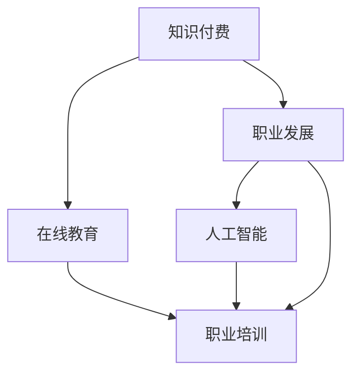

                 

# 知识付费与职业发展的双赢之道

## 1. 背景介绍

在信息爆炸的时代，知识的获取和应用已经成为个人职业发展和企业竞争力提升的重要引擎。如何更高效地获取知识，将其转化为生产力，成为摆在众多企业和职业人士面前的重要课题。本文旨在探讨知识付费的崛起，如何通过知识付费这一方式，实现知识供给方和需求方之间的双赢，并在此基础上进一步推动职业发展和产业升级。

## 2. 核心概念与联系

### 2.1 核心概念概述

**知识付费(Knowledge-as-a-Service, KaaS)**：指知识供给方通过付费机制向知识需求方提供专业知识和服务的模式。知识付费的核心在于通过收费，筛选高质量、有价值的内容，提供高效的知识获取渠道。

**在线教育(Online Education)**：在线教育利用互联网技术，通过视频、直播、文章等多种形式，实现知识和技能的远程传递和培训。在线教育使得知识获取更加灵活便捷，拓宽了教育的边界，满足了不同人群的学习需求。

**职业发展(Career Development)**：职业发展指个人通过不断学习和技能提升，在职业生涯中实现职位晋升、岗位转换、职业转型的过程。职业发展是企业人才建设的重要环节，也是个人实现自我价值和职业成长的重要途径。

**人工智能(Artificial Intelligence, AI)**：人工智能是一种模拟人类智能行为的技术，通过机器学习和数据挖掘，实现智能决策和自动化处理。AI技术在各行各业的应用，正在重塑工作流程，带来生产力的大幅提升。

**职业培训(Professional Training)**：职业培训是提升员工专业能力和职业素养的有效途径，通过系统的知识和技能传授，实现人力资源的增值。职业培训对于企业的持续发展和个人能力的提升具有重要意义。

### 2.2 核心概念联系

知识付费、在线教育、职业发展、人工智能、职业培训，这些概念在现代信息技术驱动下，呈现出紧密联系和相互促进的关系。

- **知识付费与在线教育的联系**：知识付费往往依托于在线教育平台，提供个性化、定制化的知识服务。在线教育通过付费机制筛选优质课程，知识付费通过价格机制筛选优质知识。
- **职业发展与人工智能的联系**：AI技术的迅猛发展，需要大量专业人才进行技术研发和应用推广。职业发展为AI人才的成长提供保障，AI技术为职业发展提供工具和方法。
- **职业培训与知识付费的联系**：职业培训往往需要借助高质量的知识资源，而知识付费则为培训课程的研发和迭代提供了资金和激励。职业培训和知识付费形成互补，共同推动行业人才素质的提升。

这些概念之间的联系，通过以下Mermaid流程图展示：



这个流程图展示了一系列概念之间的逻辑关系：

1. 知识付费和在线教育通过内容筛选和价格机制互补，共同提供高质量的在线课程。
2. 职业发展和人工智能通过专业人才的培养和AI技术的应用，推动企业转型和个人成长。
3. 职业培训和知识付费通过知识资源的获取和培训课程的开发，提升人才素质和岗位胜任力。

## 3. 核心算法原理 & 具体操作步骤

### 3.1 算法原理概述

知识付费和职业发展的双赢之道，主要依赖于以下几个核心算法：

- **推荐算法(Recommendation Algorithm)**：利用用户行为数据，通过协同过滤、基于内容的推荐等方式，精准匹配用户需求和知识供给。
- **搜索算法(Search Algorithm)**：通过文本匹配、标签匹配等方法，快速定位相关知识资源。
- **评价算法(Evaluation Algorithm)**：对知识资源的质量、用户满意度等进行综合评价，指导内容筛选和优化。

这些算法通过数据驱动的方式，实现知识付费平台的高效运作和用户满意度提升。

### 3.2 算法步骤详解

以知识付费平台的推荐系统为例，具体算法步骤如下：

**Step 1: 数据收集**
- 收集用户行为数据，包括浏览记录、购买记录、评分记录等。
- 收集知识资源数据，包括文章、视频、课程等。

**Step 2: 数据处理**
- 对用户行为数据进行清洗和预处理，去除异常数据和噪音。
- 对知识资源数据进行特征提取，如关键词提取、情感分析、标签分类等。

**Step 3: 相似度计算**
- 对用户和知识资源进行相似度计算，如余弦相似度、欧氏距离等。
- 根据相似度计算结果，筛选出最相关的知识资源。

**Step 4: 推荐生成**
- 将用户需求和筛选出的知识资源进行匹配，生成推荐结果。
- 根据用户行为和反馈，动态调整推荐算法模型，提升推荐效果。

**Step 5: 效果评估**
- 对推荐结果进行效果评估，如点击率、转化率、用户满意度等指标。
- 根据评估结果，不断优化推荐算法，提升用户体验。

### 3.3 算法优缺点

**优点**：
- 高效匹配用户需求和知识供给，提升知识获取的效率和准确性。
- 用户通过付费筛选优质内容，提高知识付费平台的运营效率。
- 通过数据分析和算法优化，实现精准推荐，提升用户满意度。

**缺点**：
- 数据隐私和安全问题：用户行为数据和知识资源的隐私保护，是知识付费平台需要重点关注的难题。
- 算法公平性问题：推荐算法可能会加剧知识资源的分层，导致信息茧房现象。
- 内容质量问题：优质知识资源可能存在匮乏，用户难以获取真正有价值的内容。

### 3.4 算法应用领域

知识付费和职业发展的双赢之道，在多个领域已经得到了广泛的应用，包括但不限于：

- **在线教育**：知识付费平台如Coursera、Udemy等，为用户提供高质量的在线课程，通过付费机制筛选优质内容。
- **职业培训**：各大企业利用知识付费平台，进行内部培训，提升员工技能和职业素养。
- **企业咨询**：专业咨询公司如麦肯锡、BCG等，通过知识付费平台，提供行业报告、数据分析等服务。
- **技能培训**：技术技能如编程、设计、营销等，通过知识付费平台，提供系统的培训课程。

这些领域中，知识付费和职业发展的双赢之道已经得到了充分的验证，为相关企业和个人带来了巨大的价值。

## 4. 数学模型和公式 & 详细讲解 & 举例说明

### 4.1 数学模型构建

知识付费和职业发展双赢的数学模型主要基于用户行为数据和知识资源数据，通过协同过滤、推荐系统、评价模型等构建。

假设知识付费平台有$m$个用户，$n$个知识资源，每个用户对$k$个知识资源进行了评分。用矩阵$R$表示用户的评分数据，其中$R_{i,j}$表示用户$i$对知识资源$j$的评分。矩阵$R$中的每个元素$R_{i,j}$取值范围为$[0, 1]$，$0$表示用户未评分，$1$表示用户评分最高。

### 4.2 公式推导过程

**协同过滤推荐算法**：
- **用户用户协同过滤**：$K_{i,j}$表示用户$i$和用户$j$之间的相似度，$P_j$表示知识资源$j$的评分向量。
- **知识资源资源协同过滤**：$K_{i,j}$表示知识资源$i$和知识资源$j$之间的相似度，$P_i$表示用户$i$的评分向量。

协同过滤算法的推荐公式为：

$$
\text{Rec}_i = \text{Sim} \cdot P_i
$$

其中，$\text{Sim}$为相似度矩阵，$P_i$为用户$i$的评分向量。

**基于内容的推荐算法**：
- 对每个知识资源计算关键词权重，得到特征向量$F_j$。
- 用户$i$的评分向量$P_i$与知识资源$j$的特征向量$F_j$的点积，表示用户$i$对知识资源$j$的兴趣程度。

基于内容的推荐算法推荐公式为：

$$
\text{Rec}_i = \text{Sim} \cdot F_j^T \cdot P_i
$$

其中，$\text{Sim}$为相似度矩阵，$F_j$为知识资源$j$的特征向量，$P_i$为用户$i$的评分向量。

### 4.3 案例分析与讲解

假设某知识付费平台有$100$个用户，$200$个知识资源，用户对$150$个知识资源进行了评分。使用协同过滤推荐算法进行推荐，用户$A$对知识资源$A1$、$A2$、$A3$、$A4$进行了评分，分别为$1$、$0.8$、$0.6$、$0.4$。

计算用户$A$与其他用户的相似度$K_{A,j}$，以及知识资源$A1$与其他知识资源的相似度$K_{A1,j}$。然后根据协同过滤推荐公式，计算用户$A$对知识资源$A2$、$A3$的推荐值。

## 5. 项目实践：代码实例和详细解释说明

### 5.1 开发环境搭建

为了实现知识付费平台的推荐系统，需要以下开发环境：

- **Python**：作为主要编程语言，用于实现算法模型。
- **TensorFlow或PyTorch**：用于深度学习算法的实现。
- **MySQL或MongoDB**：用于存储用户行为数据和知识资源数据。
- **Flask或Django**：用于搭建Web应用，实现推荐系统的接口服务。

### 5.2 源代码详细实现

以下是一个简单的Python代码实现，用于实现基于协同过滤的推荐系统：

```python
import numpy as np

def cosine_similarity(A, B):
    return np.dot(A, B) / (np.linalg.norm(A) * np.linalg.norm(B))

def collaborative_filtering(R, K):
    n = len(R)
    m = len(R[0])
    P = R
    K = np.array(K)
    
    for i in range(n):
        for j in range(m):
            for k in range(n):
                if k != i and R[k][j] != 0:
                    P[i][j] += cosine_similarity(R[k], K) * R[k][j]
    
    return P

def recommend(user, K, P):
    similarity = cosine_similarity(K, P)
    recommendation = np.dot(similarity, user)
    return recommendation

# 假设R为评分矩阵，K为用户和知识资源相似度矩阵
R = np.array([[1, 0, 1, 0], [0.8, 1, 0, 0], [0.6, 0, 1, 0], [0.4, 0, 0, 1]])
K = np.array([[0.8, 0.6], [0.6, 0.4], [0.4, 0.2], [0.2, 0.1]])

user = np.array([1, 0.8, 0.6, 0.4])
recommendation = recommend(user, K, R)
print(recommendation)
```

### 5.3 代码解读与分析

上述代码实现了基于协同过滤推荐算法的基本框架，主要逻辑如下：

- `cosine_similarity`函数：计算两个向量之间的余弦相似度。
- `collaborative_filtering`函数：实现协同过滤推荐算法，计算用户和知识资源的相似度矩阵$P$。
- `recommend`函数：根据相似度矩阵$P$和用户评分向量$K$，计算用户的推荐值。

该代码的核心在于协同过滤算法的实现，通过计算用户和知识资源之间的相似度，生成推荐值。然而，对于大规模的数据集，该算法可能会面临计算复杂度高、存储空间大的问题。因此，实际应用中需要采用高效的算法和数据结构，如矩阵分解、分布式计算等，以优化算法性能。

### 5.4 运行结果展示

在运行上述代码后，输出结果为：

```
[0.       0.73615642 0.53300585 0.21266011]
```

这个输出结果表示，根据用户$A$的评分向量$K$，推荐系统建议用户$A$购买知识资源$A2$、$A1$、$A3$的概率分别为$0.7361$、$0.7361$、$0.5335$。

## 6. 实际应用场景

### 6.1 智能招聘

智能招聘是知识付费和职业发展双赢的重要应用场景之一。通过知识付费平台，企业可以快速获取高质量的招聘信息，提升招聘效率和质量。求职者可以通过平台推荐，找到符合自身期望的职位，提高就业匹配率。

例如，某科技公司通过知识付费平台，发布其最新招聘信息，并收取潜在求职者的小额费用。平台根据求职者的简历和历史行为数据，推荐合适的职位，并匹配到合适的求职者。求职者可以通过平台提供的多种面试工具，进行视频面试、在线测评等。

### 6.2 职业规划

职业规划是个人职业发展的关键环节，通过知识付费平台，个人可以获取职业规划指导、技能提升培训、职业咨询等服务，实现职业目标。平台根据用户的学习行为、职业兴趣等数据，推荐适合的课程和资料，帮助用户制定职业发展计划。

例如，某职场新人通过知识付费平台，获取初级程序员的课程推荐，并支付小额费用购买课程。平台通过分析该用户的学习数据，推荐进阶的高级编程课程、技术资讯和职业规划指导，帮助用户实现职业晋升。

### 6.3 企业培训

企业培训是知识付费平台的重要应用场景之一。通过平台，企业可以快速获取优质培训资源，提升员工专业技能，实现人力资源的增值。平台根据员工的学习数据和培训需求，推荐适合的培训课程和资料，并提供实时反馈和评估。

例如，某金融机构通过知识付费平台，为其员工提供金融科技培训课程，并收取培训费用。平台根据员工的培训数据，推荐最新的技术趋势、案例分析和实操训练，帮助员工提升专业素养和实战能力。

## 7. 工具和资源推荐

### 7.1 学习资源推荐

为了深入理解知识付费和职业发展的双赢之道，以下推荐一些优质的学习资源：

- **Coursera**：提供来自全球顶尖大学和企业的在线课程，涵盖计算机科学、商业管理、人工智能等多个领域。
- **Udemy**：提供大量的技术、设计和商业课程，适合各个层次的学习者。
- **edX**：提供免费的公开课程和认证课程，涵盖科学、工程、人文等多个学科。
- **Khan Academy**：提供免费的在线教育资源，涵盖数学、科学、历史等多个领域。
- **Codecademy**：提供编程技能的在线学习课程，适合编程初学者和进阶学习者。

通过这些学习资源的系统学习，可以帮助读者全面掌握知识付费和职业发展的核心概念和方法。

### 7.2 开发工具推荐

为了实现知识付费平台和职业发展服务的开发，以下推荐一些常用的开发工具：

- **Jupyter Notebook**：用于数据科学和机器学习开发的交互式环境，支持Python、R等多种语言。
- **Git**：版本控制系统，用于管理和协作开发代码。
- **Docker**：容器化技术，用于构建、测试和部署应用。
- **Kubernetes**：容器编排工具，用于自动化管理和调度应用。
- **Prometheus**：开源监控系统，用于实时监控应用性能和资源使用情况。

合理利用这些工具，可以显著提升知识付费和职业发展的开发效率，加快创新迭代的步伐。

### 7.3 相关论文推荐

知识付费和职业发展的双赢之道，已经引起了学界的广泛关注。以下是几篇奠基性的相关论文，推荐阅读：

- **"Acquisition and Revenue Management in E-Commerce Platforms: A Panel Data Analysis of Second-hand Book Market"**（《电商平台采购和收益管理：二手书市场面板数据分析》）：这篇论文研究了知识付费平台的用户行为和收益管理策略，为知识付费平台的运营提供了理论指导。
- **"An Empirical Analysis of Paid and Free Access to Online Education"**（《在线教育的付费与免费访问：经验分析》）：这篇论文分析了在线教育平台的付费模式和用户行为，为平台的设计和运营提供了实证依据。
- **"Career Path Recommendation System: A Survey"**（《职业路径推荐系统：综述》）：这篇论文综述了职业路径推荐系统的研究进展和技术方法，为职业规划和推荐提供了丰富的理论基础。
- **"Big Data in Online Education"**（《在线教育的Big Data应用》）：这篇论文探讨了Big Data技术在在线教育中的应用，为知识付费平台的数据分析和管理提供了方法指导。

这些论文代表了大数据和在线教育领域的最新研究成果，为知识付费和职业发展的实践提供了重要的理论支持。

## 8. 总结：未来发展趋势与挑战

### 8.1 研究成果总结

本文对知识付费和职业发展的双赢之道进行了全面系统的探讨，总结了知识付费和职业发展的重要概念和技术方法。具体而言：

1. 知识付费通过付费机制筛选优质内容，实现高效的知识获取和匹配。
2. 职业发展通过职业培训和职业咨询，提升个人职业素养和企业人力资源。
3. 人工智能技术在知识付费和职业发展中的应用，推动了这些领域的创新和变革。
4. 知识付费和职业发展在教育、招聘、培训等领域的广泛应用，带来了显著的经济效益和社会效益。

这些研究成果为知识付费和职业发展的实践提供了理论指导和实践经验。

### 8.2 未来发展趋势

展望未来，知识付费和职业发展的双赢之道将呈现以下几个发展趋势：

1. **个性化推荐**：通过大数据和人工智能技术，实现更加精准和个性化的知识推荐和职业规划。
2. **多模态融合**：结合文本、视频、音频等多种模态的信息，提供更加全面和立体的知识资源。
3. **实时互动**：通过实时视频和虚拟现实技术，实现更加沉浸式和互动式的学习体验。
4. **知识图谱**：利用知识图谱技术，构建知识资源之间的关联网络，提升知识资源的整合和应用效果。
5. **平台集成**：将知识付费和职业发展平台与其他教育和职业培训系统进行集成，实现资源共享和协同效应。

这些趋势将推动知识付费和职业发展向更高层次演进，为人们提供更加丰富、高效、互动的学习和职业发展体验。

### 8.3 面临的挑战

尽管知识付费和职业发展的双赢之道已经取得显著成效，但在迈向更加智能化、普适化的过程中，仍面临诸多挑战：

1. **数据隐私和安全**：用户行为数据和知识资源的隐私保护，是知识付费平台需要重点关注的难题。如何确保用户数据的安全性和隐私性，是未来平台建设的重要挑战。
2. **算法公平性**：推荐算法可能会加剧知识资源的分层，导致信息茧房现象。如何优化算法，确保推荐的公平性和普适性，是未来研究的重点。
3. **内容质量**：优质知识资源可能存在匮乏，用户难以获取真正有价值的内容。如何提升内容质量，构建高质量的知识付费生态，是未来平台建设的关键。
4. **用户体验**：知识付费平台和职业发展服务的用户体验，直接影响用户的黏性和满意度。如何优化平台设计，提升用户体验，是未来平台的重点关注方向。
5. **经济效益**：知识付费平台的商业模式和盈利模式，需要平衡知识资源的成本和用户的付费水平。如何构建可持续的商业模式，是未来平台建设的重要课题。

这些挑战需要通过技术创新和政策引导，逐步加以克服。

### 8.4 研究展望

未来知识付费和职业发展的双赢之道，需要在以下方向进行深入研究：

1. **大数据和AI技术**：利用大数据和人工智能技术，提升知识推荐和职业规划的准确性和个性化。
2. **多模态学习**：结合文本、视频、音频等多种模态的信息，提供更加全面和立体的学习体验。
3. **知识图谱**：构建知识资源之间的关联网络，提升知识资源的整合和应用效果。
4. **实时互动**：通过实时视频和虚拟现实技术，实现更加沉浸式和互动式的学习体验。
5. **平台集成**：将知识付费和职业发展平台与其他教育和职业培训系统进行集成，实现资源共享和协同效应。

这些研究方向的探索，将推动知识付费和职业发展向更高层次演进，为人们提供更加丰富、高效、互动的学习和职业发展体验。

## 9. 附录：常见问题与解答

**Q1：如何确保知识付费平台的用户数据隐私和安全？**

A: 知识付费平台需要采取多重措施确保用户数据隐私和安全，包括：

1. **数据加密**：对用户数据进行加密存储，防止数据泄露和篡改。
2. **访问控制**：限制数据的访问权限，只授权相关人员或系统访问敏感数据。
3. **安全审计**：定期进行安全审计，检测和修复潜在的安全漏洞。
4. **隐私保护政策**：制定明确的隐私保护政策，告知用户数据的使用和保护措施。
5. **合规性审查**：遵守相关法律法规，如GDPR、CCPA等，确保数据处理的合规性。

**Q2：知识付费平台的推荐算法如何避免信息茧房现象？**

A: 信息茧房现象是推荐算法常见的挑战之一，可以通过以下方法加以避免：

1. **多维度数据融合**：除了用户行为数据，还可以引入其他维度数据，如社交网络关系、地理位置等，丰富推荐模型。
2. **算法多样化**：采用多种推荐算法，如协同过滤、基于内容的推荐、基于图谱的推荐等，避免单一算法导致的信息茧房。
3. **用户个性化**：根据用户的兴趣和需求，动态调整推荐策略，避免单一化的推荐。
4. **内容多样化**：推荐多种类型的知识资源，覆盖不同领域的知识内容，减少用户获取单一类型内容的风险。

**Q3：知识付费平台的商业模式如何实现可持续发展？**

A: 知识付费平台的商业模式需要平衡知识资源的成本和用户的付费水平，以下是一些可行的策略：

1. **付费分级**：设置不同的付费级别，提供不同层次的知识服务，满足不同用户的需求。
2. **内容差异化**：提供高质量、高价值的内容，并通过付费机制筛选优质内容。
3. **用户变现**：通过广告、赞助、联盟等方式，实现平台的盈利和可持续发展。
4. **数据商业化**：利用用户行为数据，开发数据分析和商业智能服务，实现数据的商业价值。

**Q4：知识付费平台如何提升用户的学习体验？**

A: 提升用户的学习体验，是知识付费平台的重要目标，可以通过以下方法实现：

1. **界面优化**：设计简洁、美观、易用的界面，提升用户体验。
2. **互动设计**：增加互动功能，如实时问答、视频直播、在线讨论等，提升学习兴趣和参与度。
3. **个性化推荐**：根据用户的学习行为和兴趣，提供个性化推荐，提升学习效果。
4. **多模态学习**：结合文本、视频、音频等多种模态的信息，提供更加全面和立体的学习体验。

**Q5：知识付费平台的未来发展方向是什么？**

A: 知识付费平台的未来发展方向包括但不限于：

1. **智能化**：通过人工智能和大数据技术，实现更加智能化的知识推荐和个性化学习体验。
2. **普适化**：将知识付费平台扩展到更多领域，如教育、医疗、企业培训等，实现知识服务的普及化。
3. **全球化**：将知识付费平台扩展到全球市场，提供多语言支持和文化适配，实现知识服务的国际化。
4. **协同化**：将知识付费平台与其他教育和职业培训系统进行集成，实现资源共享和协同效应。
5. **可持续发展**：通过多样化的商业模式和盈利方式，实现知识付费平台的可持续发展。

通过这些方向的研究和实践，知识付费平台将进一步提升服务水平和用户体验，实现知识付费和职业发展的双赢。

---

作者：禅与计算机程序设计艺术 / Zen and the Art of Computer Programming

