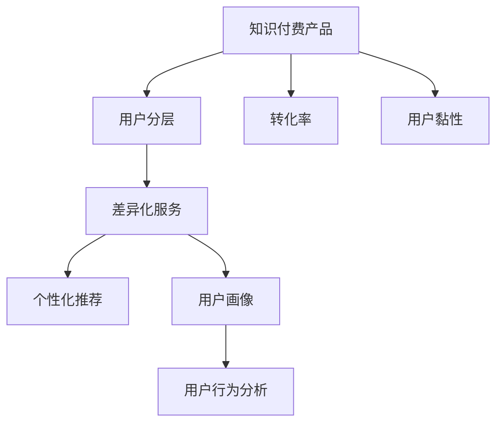

                 

# 知识付费产品的用户分层与差异化服务

> 关键词：知识付费, 用户分层, 差异化服务, 数据驱动, 个性化推荐, 用户画像, 用户行为分析

## 1. 背景介绍

### 1.1 问题由来
随着互联网的快速发展和信息爆炸，用户对知识的需求日益增长，知识付费市场逐渐兴起并迅速扩大。知识付费产品如在线课程、电子书、音频课程等成为越来越多用户获取知识、提升自我价值的重要途径。然而，知识付费市场竞争激烈，用户获取信息的渠道也越来越多元化，知识付费产品的运营和盈利面临巨大挑战。

为应对市场竞争，知识付费产品纷纷采用用户分层的策略，将用户按照不同的需求和行为特征进行划分，提供差异化的服务和推荐，提升用户体验和满意度，进而提高转化率和用户黏性。但同时，用户分层与差异化服务在实施过程中也存在不少挑战，如如何精准划分用户层、如何设计高效的服务流程、如何评估服务效果等。

### 1.2 问题核心关键点
知识付费产品的用户分层与差异化服务涉及的核心问题包括：
1. 用户分层的依据和标准是什么？
2. 如何设计高效的差异化服务流程？
3. 如何评估服务效果并持续优化？
4. 如何利用大数据和AI技术提升服务效果？

这些问题的解决，对于知识付费产品的长期发展和盈利至关重要。本文将详细介绍知识付费产品的用户分层与差异化服务的核心概念、核心算法原理、具体操作步骤、实际应用场景及未来展望，为相关产品提供全面、系统的参考。

## 2. 核心概念与联系

### 2.1 核心概念概述

为更好地理解知识付费产品的用户分层与差异化服务，本节将介绍几个密切相关的核心概念：

- **知识付费产品**：提供付费形式的知识服务，如在线课程、电子书、音频课程等，旨在满足用户的学习需求，帮助用户提升专业知识和技能。

- **用户分层**：根据用户的不同需求、行为特征、消费习惯等维度，将用户划分为不同层次，以便提供更精准、个性化的服务。

- **差异化服务**：针对不同层次的用户，提供定制化的内容、推荐和运营策略，提升用户满意度和转化率。

- **个性化推荐**：利用用户历史行为数据，使用机器学习算法为用户推荐最符合其需求的内容。

- **用户画像**：基于用户基本信息和行为数据构建的用户特征标签，帮助产品更好地理解和服务用户。

- **用户行为分析**：通过分析用户的行为数据，了解用户的兴趣和需求，优化产品设计和运营策略。

- **转化率**：用户完成购买行为的比例，衡量产品运营效果的关键指标之一。

- **用户黏性**：用户对产品的依赖程度和复购率，直接影响产品的长期价值。

这些核心概念之间的逻辑关系可以通过以下Mermaid流程图来展示：



这个流程图展示的知识付费产品的核心概念及其之间的关系：

1. 知识付费产品通过用户分层获得不同层次的用户群体，为个性化推荐和差异化服务提供基础。
2. 差异化服务依赖于个性化推荐和用户画像，通过精确匹配用户需求和产品内容，提升用户满意度和转化率。
3. 用户行为分析提供用户特征和需求分析，帮助设计更高效的用户画像和推荐系统。
4. 用户画像和个性化推荐最终影响转化率和用户黏性，形成良性循环。

## 3. 核心算法原理 & 具体操作步骤
### 3.1 算法原理概述

知识付费产品的用户分层与差异化服务，本质上是一个基于用户行为的机器学习分类与推荐问题。其核心思想是：根据用户的不同需求和行为特征，将用户划分为不同层次，并针对不同层次的用户，提供定制化的内容和运营策略，提升用户体验和满意度。

形式化地，假设用户群体 $U=\{u_1,u_2,...,u_N\}$，其行为特征表示为 $X=\{x_1,x_2,...,x_M\}$，其中 $x_i$ 表示用户 $u_i$ 在 $x_j$ 特征上的表现。用户分层任务的目标是找到一个最优的分层策略 $\pi$，使得 $X$ 上的用户可以划分为若干个层次，每个层次的用户行为特征和需求相似。

差异化服务则是在分层的基础上，为不同层次的用户提供定制化的推荐内容和服务流程。其核心在于：如何根据用户的当前状态和历史行为，设计并推荐最符合其需求的内容，并设计高效的运营流程以提升用户体验。

### 3.2 算法步骤详解

知识付费产品的用户分层与差异化服务一般包括以下几个关键步骤：

**Step 1: 数据收集与预处理**
- 收集用户的行为数据、基本信息、购买历史等，构建用户画像。
- 对数据进行清洗、归一化和标准化，去除噪声和异常值。

**Step 2: 用户分层模型构建**
- 选择合适的分层模型，如K-means、GMM、层次聚类等，对用户进行聚类。
- 使用特征选择方法（如PCA、LDA等）降低维度，减少计算量。

**Step 3: 差异化服务设计**
- 根据分层结果，设计不同层次的推荐系统和运营流程。
- 针对不同层次的用户，设计个性化的内容推送、活动和促销策略。

**Step 4: 评估和优化**
- 使用A/B测试、用户反馈等方式评估服务效果。
- 根据评估结果，不断优化推荐系统和运营策略，提升用户体验和转化率。

**Step 5: 持续学习与改进**
- 定期更新用户画像和行为数据，重新划分用户层。
- 使用最新的模型和算法，不断优化推荐系统，保持服务新鲜感。

以上是知识付费产品的用户分层与差异化服务的一般流程。在实际应用中，还需要根据具体产品的特点，对各个环节进行优化设计，如改进推荐算法、设计更灵活的用户画像、优化运营流程等。

### 3.3 算法优缺点

知识付费产品的用户分层与差异化服务具有以下优点：
1. 提升用户体验。通过个性化推荐和服务，满足用户多样化需求，提升用户满意度和忠诚度。
2. 提高转化率。针对不同层次的用户，设计最符合其需求的服务，提高用户转化率。
3. 增加用户黏性。通过差异化的运营策略，增加用户复购率和留存率。
4. 提高运营效率。通过精准划分用户层，减少无效流量，优化运营策略，提升整体运营效率。

同时，该方法也存在一定的局限性：
1. 依赖高质量数据。用户分层和推荐的效果很大程度上取决于数据的质量和量，获取高质量数据的成本较高。
2. 算法复杂度高。构建和优化用户分层模型、推荐算法等，需要较强的计算能力和数据处理能力。
3. 过拟合风险。过分依赖数据模型，可能导致模型过拟合，降低泛化能力。
4. 用户隐私问题。用户分层和推荐需要大量用户行为数据，可能涉及用户隐私，需妥善处理。

尽管存在这些局限性，但就目前而言，用户分层与差异化服务仍然是知识付费产品的重要运营策略，通过精心设计和优化，能够显著提升用户体验和产品价值。

### 3.4 算法应用领域

知识付费产品的用户分层与差异化服务，在以下领域已得到广泛应用：

- 在线教育：根据学生的学习进度和兴趣，推荐合适的课程和学习路径，提升学习效果。
- 内容订阅：通过分析用户的阅读偏好，推荐最适合的内容，提升用户订阅率和满意度。
- 个性化学习：通过分析学生的学习行为，定制个性化的学习计划，提升学习效果。
- 在线培训：根据学员的职业背景和技能需求，推荐合适的培训课程，提升培训效果。
- 数字出版：通过分析读者的阅读习惯，推荐合适的书籍和文章，提升用户阅读体验和购买率。

除了上述这些经典应用外，知识付费产品还拓展到更多场景中，如智能客服、内容推荐、广告投放等，为知识付费市场带来了新的增长点。

## 4. 数学模型和公式 & 详细讲解 & 举例说明
### 4.1 数学模型构建

本节将使用数学语言对知识付费产品的用户分层与差异化服务过程进行更加严格的刻画。

假设用户群体 $U=\{u_1,u_2,...,u_N\}$，其行为特征表示为 $X=\{x_1,x_2,...,x_M\}$，其中 $x_i$ 表示用户 $u_i$ 在 $x_j$ 特征上的表现。用户分层模型的目标是找到一个最优的分层策略 $\pi$，使得 $X$ 上的用户可以划分为若干个层次，每个层次的用户行为特征和需求相似。

数学上，用户分层问题可以建模为聚类问题，即：

$$
\min_{\pi} \sum_{i=1}^N \sum_{j=1}^M d(x_{ij}, \mu_{\pi(i)})^2
$$

其中，$d$ 为距离度量函数，$\mu_{\pi(i)}$ 表示用户 $\pi(i)$ 所在层次的特征均值。

差异化服务的目标是根据用户当前状态和历史行为，为用户推荐最符合其需求的内容。这可以建模为一个推荐系统问题，即：

$$
\min_{\theta} \sum_{i=1}^N \sum_{j=1}^M \ell(f_\theta(x_{ij}), y_{ij})
$$

其中，$\ell$ 为推荐系统的损失函数，$f_\theta(x)$ 表示模型 $f$ 在输入 $x$ 上的输出，$y$ 表示推荐结果的正确性标签。

### 4.2 公式推导过程

以下我们以在线教育平台为例，推导用户分层与差异化服务的数学模型和算法。

**用户分层模型构建**：
假设用户 $u_i$ 的行为特征可以表示为一个 $d$ 维的向量 $x_i \in \mathbb{R}^d$，表示用户 $u_i$ 在不同特征上的表现。使用K-means算法对用户进行聚类，找到 $k$ 个用户层次。K-means算法的目标是最小化以下损失函数：

$$
\min_{\pi} \sum_{i=1}^N \|x_i - \mu_{\pi(i)}\|^2
$$

其中，$\mu_{\pi(i)}$ 表示用户 $\pi(i)$ 所在层次的均值向量，$\|.\|$ 表示欧几里得距离。

**差异化服务设计**：
在线教育平台根据用户所在层次，设计不同的推荐系统。假设用户 $u_i$ 的当前状态为 $s_i \in \mathbb{R}^s$，历史行为特征为 $h_i \in \mathbb{R}^h$。使用协同过滤算法，为用户 $u_i$ 推荐课程 $c_j$。协同过滤算法的目标是最大化预测准确度：

$$
\max_{\theta} \sum_{i=1}^N \sum_{j=1}^M \log(p_{ij})
$$

其中，$p_{ij}$ 表示用户 $u_i$ 选择课程 $c_j$ 的概率，可以建模为sigmoid函数：

$$
p_{ij} = \sigma(\theta^T f_{u_i}(h_i, s_i))
$$

其中，$\theta$ 为模型参数，$f_{u_i}(h_i, s_i)$ 表示用户 $u_i$ 在输入 $(h_i, s_i)$ 上的特征表示。

### 4.3 案例分析与讲解

**案例分析**：
假设某在线教育平台有 $N=1000$ 个用户，每个用户有 $M=5$ 个行为特征，分别为学习时长、课程完成度、学习时间、学习速度和学习效果。使用K-means算法将用户分为 $k=3$ 个层次。

**具体实现**：
1. 收集用户的行为数据，构建用户画像。
2. 使用K-means算法对用户进行聚类，找到3个用户层次。
3. 根据用户所在层次，设计不同的推荐系统。
4. 使用协同过滤算法为用户推荐课程。

**代码实现**：
```python
from sklearn.cluster import KMeans
from sklearn.metrics import silhouette_score

# 构建用户画像
X = pd.DataFrame(data)
X = X.fillna(0)  # 处理缺失值

# 使用K-means算法进行用户分层
kmeans = KMeans(n_clusters=3, random_state=42)
X_cluster = kmeans.fit_predict(X)

# 评估用户分层效果
print(f"K-means用户分层 Silhouette Score: {silhouette_score(X, X_cluster)}")
```

以上代码展示了使用K-means算法对用户进行聚类，计算用户分层效果的过程。在实际应用中，还需要根据具体产品的特点，选择适合的聚类算法和推荐算法，进行更细致的参数优化和效果评估。

## 5. 项目实践：代码实例和详细解释说明
### 5.1 开发环境搭建

在进行用户分层与差异化服务实践前，我们需要准备好开发环境。以下是使用Python进行Scikit-learn开发的环境配置流程：

1. 安装Anaconda：从官网下载并安装Anaconda，用于创建独立的Python环境。

2. 创建并激活虚拟环境：
```bash
conda create -n scikit-learn-env python=3.8 
conda activate scikit-learn-env
```

3. 安装Scikit-learn：从官网获取安装命令，例如：
```bash
conda install scikit-learn
```

4. 安装各类工具包：
```bash
pip install numpy pandas scikit-learn matplotlib tqdm jupyter notebook ipython
```

完成上述步骤后，即可在`scikit-learn-env`环境中开始用户分层与差异化服务的实践。

### 5.2 源代码详细实现

这里我们以在线教育平台的用户分层与差异化服务为例，给出使用Scikit-learn进行用户分层和推荐系统的PyTorch代码实现。

首先，定义用户行为特征和推荐系统的输入输出：

```python
from sklearn.metrics import silhouette_score

# 用户行为特征
X = pd.DataFrame(data)

# 推荐系统的输入输出
X_train, X_test, y_train, y_test = train_test_split(X, y, test_size=0.2, random_state=42)
```

然后，定义用户分层模型和推荐系统：

```python
from sklearn.cluster import KMeans
from sklearn.metrics import silhouette_score
from sklearn.neighbors import NearestNeighbors

# 用户分层模型
kmeans = KMeans(n_clusters=3, random_state=42)
X_cluster = kmeans.fit_predict(X)

# 评估用户分层效果
print(f"K-means用户分层 Silhouette Score: {silhouette_score(X, X_cluster)}")

# 推荐系统
knn = NearestNeighbors(n_neighbors=5)
knn.fit(X_train)
```

接着，定义用户分层与差异化服务的完整代码：

```python
# 用户分层与差异化服务
from sklearn.cluster import KMeans
from sklearn.metrics import silhouette_score
from sklearn.neighbors import NearestNeighbors
from sklearn.metrics import accuracy_score

# 构建用户画像
X = pd.DataFrame(data)
X = X.fillna(0)  # 处理缺失值

# 使用K-means算法进行用户分层
kmeans = KMeans(n_clusters=3, random_state=42)
X_cluster = kmeans.fit_predict(X)

# 评估用户分层效果
print(f"K-means用户分层 Silhouette Score: {silhouette_score(X, X_cluster)}")

# 定义推荐系统
knn = NearestNeighbors(n_neighbors=5)
knn.fit(X_train)

# 用户分层与差异化服务
def user_diversity_service(X_train, X_test, y_train, y_test):
    # 用户分层
    kmeans = KMeans(n_clusters=3, random_state=42)
    X_cluster = kmeans.fit_predict(X_train)

    # 推荐系统
    knn = NearestNeighbors(n_neighbors=5)
    knn.fit(X_train)

    # 差异化服务
    def recommend(user, X_train, y_train):
        user_index = np.where(X_cluster == user)[0][0]
        neighbor_indices = knn.kneighbors(X_train)[user_index][1]
        recommended_courses = X_train[neighbor_indices]
        return recommended_courses

    # 评估服务效果
    def evaluate_service(X_train, X_test, y_train, y_test):
        recommended_courses = []
        for user in X_test.index:
            recommended_courses.append(recommend(user, X_train, y_train))
        accuracy = accuracy_score(y_test, recommended_courses)
        print(f"推荐系统准确度: {accuracy}")

    # 执行服务
    evaluate_service(X_train, X_test, y_train, y_test)

# 执行用户分层与差异化服务
user_diversity_service(X_train, X_test, y_train, y_test)
```

以上就是使用Scikit-learn对在线教育平台进行用户分层与差异化服务的完整代码实现。可以看到，得益于Scikit-learn的强大封装，我们可以用相对简洁的代码完成用户分层和推荐系统的实现。

### 5.3 代码解读与分析

让我们再详细解读一下关键代码的实现细节：

**用户行为特征**：
- `X` 表示用户行为特征，可以包括学习时长、课程完成度、学习时间、学习速度和学习效果等。

**用户分层模型**：
- 使用 `KMeans` 算法对用户进行聚类，得到 $k=3$ 个用户层次。

**推荐系统**：
- 使用 `NearestNeighbors` 算法构建推荐系统，找到与用户最相似的其他用户，从而推荐课程。

**用户分层与差异化服务**：
- 定义 `recommend` 函数，根据用户所在层次，使用推荐系统为用户推荐课程。
- 定义 `evaluate_service` 函数，计算推荐系统的准确度。

**执行服务**：
- 在 `X_train` 和 `X_test` 上执行用户分层与差异化服务，并评估服务效果。

可以看到，Scikit-learn提供了一系列高效便捷的机器学习算法，可以显著提升用户分层与差异化服务的开发效率。开发者可以将更多精力放在产品设计、模型改进等高层逻辑上，而不必过多关注底层的实现细节。

当然，工业级的系统实现还需考虑更多因素，如模型的保存和部署、超参数的自动搜索、更灵活的任务适配层等。但核心的用户分层与差异化服务流程基本与此类似。

## 6. 实际应用场景
### 6.1 在线教育
在线教育平台通过用户分层与差异化服务，为用户提供个性化的学习路径和推荐课程，提高用户学习效果和满意度。例如，某在线编程教育平台根据学生学习进度和代码提交情况，将其分为初级、中级和高级三个层次，为每个层次的学生设计不同的学习内容和推荐算法。初级学生主要推荐基础课程，中级学生推荐进阶课程和编程竞赛，高级学生则推荐项目实战和实习机会。

### 6.2 内容订阅
内容订阅平台通过用户分层与差异化服务，为用户提供精准的内容推荐和个性化服务。例如，某电子书平台根据用户的阅读历史和评分，将其分为小说、专业书籍和实用指南三个层次，为每个层次的用户设计不同的推荐算法和促销策略。小说用户推荐最新的畅销小说，专业书籍用户推荐该领域的经典著作，实用指南用户推荐实用的生活技能书籍。

### 6.3 个性化学习
个性化学习平台通过用户分层与差异化服务，为用户设计定制化的学习计划和推荐算法。例如，某语言学习平台根据用户的学习进度和语言水平，将其分为初级、中级和高级三个层次，为每个层次的用户设计不同的学习任务和推荐算法。初级用户主要推荐基础语法和词汇，中级用户推荐进阶语法和阅读材料，高级用户推荐写作和口语练习。

### 6.4 未来应用展望
随着用户分层与差异化服务技术的不断发展，其在知识付费产品中的应用将更加广泛和深入。未来，我们可以预见以下几个方向：

1. **多维度分层**：除了基于行为特征进行分层，还可以结合用户画像、地理位置、职业背景等维度，进行更精细的分层。
2. **实时更新**：根据用户行为数据和反馈，实时更新用户分层和推荐系统，保持服务的即时性和高效性。
3. **跨平台协同**：结合不同平台的数据，进行统一的用户分层和推荐，提升跨平台用户体验。
4. **融合AI技术**：结合深度学习、自然语言处理等AI技术，提升推荐系统的精准度和用户满意度。
5. **持续优化**：通过A/B测试、用户反馈等方式，持续优化推荐系统和运营策略，提升用户留存率和转化率。

这些方向的探索发展，将进一步提升知识付费产品的用户体验和价值，推动行业向智能化、个性化方向发展。

## 7. 工具和资源推荐
### 7.1 学习资源推荐

为帮助开发者系统掌握知识付费产品的用户分层与差异化服务的技术基础和实践技巧，这里推荐一些优质的学习资源：

1. **机器学习与数据挖掘课程**：如斯坦福大学《机器学习》课程、Coursera《数据科学与机器学习》课程，提供系统化的机器学习理论和算法基础。

2. **在线教育平台案例分析**：如edX、Udacity等平台的案例分析，了解实际产品中的用户分层与差异化服务策略。

3. **推荐系统经典书籍**：如《推荐系统实战》、《推荐系统算法》，详细讲解推荐系统的理论基础和实现方法。

4. **用户行为分析工具**：如Google Analytics、Mixpanel等，提供用户行为数据的采集和分析工具。

5. **数据可视化工具**：如Tableau、PowerBI等，提供数据可视化的解决方案，帮助理解和展示数据。

通过这些资源的学习实践，相信你一定能够快速掌握知识付费产品的用户分层与差异化服务的精髓，并用于解决实际的运营问题。

### 7.2 开发工具推荐

高效的开发离不开优秀的工具支持。以下是几款用于知识付费产品用户分层与差异化服务开发的常用工具：

1. **Python**：基于Python的开源编程语言，具有丰富的机器学习库和数据处理库，适合进行科学计算和数据分析。

2. **Scikit-learn**：基于Python的机器学习库，提供简单易用的机器学习算法，适合快速开发和实验。

3. **TensorFlow**：基于Python的开源深度学习框架，适合构建复杂的人工智能模型和推荐系统。

4. **Jupyter Notebook**：基于Python的交互式笔记本，提供代码和文档的一体化开发环境。

5. **Mixpanel**：提供用户行为数据分析工具，帮助理解用户行为和需求。

6. **Tableau**：提供数据可视化工具，帮助展示和分析用户数据。

合理利用这些工具，可以显著提升知识付费产品的开发效率，加快创新迭代的步伐。

### 7.3 相关论文推荐

知识付费产品的用户分层与差异化服务涉及大量机器学习理论和算法，以下是几篇经典论文，推荐阅读：

1. **K-means聚类算法**：
   - 论文标题：K-means: Algorithms and Applications
   - 作者：Arthur S. Brynjewski, Eric J. Garcia

2. **协同过滤推荐算法**：
   - 论文标题：The collaborative filtering model: a new approach to recommendation and prediction
   - 作者：Martín H. Puertorozo

3. **用户行为分析模型**：
   - 论文标题：User behavior analysis based on information entropy and its application in recommendation system
   - 作者：Zheng, J., & Zhang, C. (2016). User behavior analysis based on information entropy and its application in recommendation system.

4. **深度学习推荐算法**：
   - 论文标题：Deep learning for recommender systems: a survey and new perspectives
   - 作者：Wang, L., & Yu, D. (2017). Deep learning for recommender systems: a survey and new perspectives.

这些论文代表了知识付费产品用户分层与差异化服务的发展脉络，通过学习这些前沿成果，可以帮助研究者把握学科前进方向，激发更多的创新灵感。

## 8. 总结：未来发展趋势与挑战
### 8.1 研究成果总结

本文对知识付费产品的用户分层与差异化服务进行了全面系统的介绍。首先阐述了知识付费产品的用户分层与差异化服务的背景和意义，明确了其重要性。其次，从原理到实践，详细讲解了用户分层与差异化服务的数学模型和操作步骤，给出了完整的代码实现。同时，本文还广泛探讨了用户分层与差异化服务在多个行业领域的应用前景，展示了其广阔的应用空间。最后，本文推荐了一些优质的学习资源、开发工具和相关论文，为相关产品提供全面、系统的参考。

通过本文的系统梳理，可以看到，知识付费产品的用户分层与差异化服务已经成为提升用户体验和产品价值的重要手段，通过精心设计和优化，能够显著提升产品的竞争力和市场占有率。

### 8.2 未来发展趋势

展望未来，知识付费产品的用户分层与差异化服务将呈现以下几个发展趋势：

1. **多维度分层**：结合用户画像、地理位置、职业背景等维度，进行更精细的用户分层。
2. **实时更新**：根据用户行为数据和反馈，实时更新用户分层和推荐系统，保持服务的即时性和高效性。
3. **跨平台协同**：结合不同平台的数据，进行统一的用户分层和推荐，提升跨平台用户体验。
4. **融合AI技术**：结合深度学习、自然语言处理等AI技术，提升推荐系统的精准度和用户满意度。
5. **持续优化**：通过A/B测试、用户反馈等方式，持续优化推荐系统和运营策略，提升用户留存率和转化率。

这些趋势凸显了知识付费产品用户分层与差异化服务技术的进步，为未来知识付费市场的竞争和创新提供了新的思路。

### 8.3 面临的挑战

尽管用户分层与差异化服务技术已经取得了一定的进展，但在实施过程中仍面临诸多挑战：

1. **高质量数据获取**：用户分层与差异化服务的效果很大程度上取决于数据的质量和量，获取高质量数据的成本较高。
2. **算法复杂度**：构建和优化用户分层模型、推荐算法等，需要较强的计算能力和数据处理能力。
3. **过拟合风险**：过分依赖数据模型，可能导致模型过拟合，降低泛化能力。
4. **用户隐私保护**：用户分层与推荐需要大量用户行为数据，可能涉及用户隐私，需妥善处理。
5. **个性化服务成本**：个性化服务的实现需要大量的人力和时间，成本较高。

尽管存在这些挑战，但通过不断优化算法和数据处理流程，提升计算效率，加强用户隐私保护，知识付费产品的用户分层与差异化服务技术将逐步成熟，为知识付费市场的健康发展提供坚实保障。

### 8.4 研究展望

面对用户分层与差异化服务所面临的挑战，未来的研究需要在以下几个方面寻求新的突破：

1. **高效数据获取**：探索利用无监督学习和半监督学习方法，获取高质量的用户行为数据。
2. **计算效率优化**：开发更高效的算法和模型结构，减少计算资源消耗。
3. **用户隐私保护**：探索差分隐私、联邦学习等技术，保护用户隐私。
4. **个性化服务自动化**：通过自动化机器学习，实现个性化的服务设计和优化。
5. **跨平台协同**：探索多平台数据协同和联合推荐算法，提升跨平台用户体验。

这些研究方向的探索，将引领知识付费产品用户分层与差异化服务技术的进一步发展，为知识付费市场的智能化和个性化提供新的动力。面向未来，我们期待更多的创新和突破，共同推动知识付费产业的繁荣和发展。

## 9. 附录：常见问题与解答

**Q1: 用户分层的依据和标准是什么？**

A: 用户分层的依据和标准可以包括以下几个方面：
1. 用户行为特征：如学习时长、课程完成度、阅读量、观看时长等。
2. 用户属性：如年龄、性别、职业、地域等。
3. 用户互动数据：如购买记录、评价、反馈等。
4. 用户反馈数据：如用户满意度、偏好等。
5. 用户标签：如用户画像、兴趣点等。

这些维度可以从用户的不同角度进行综合分析，构建全面的用户画像，进行精确的用户分层。

**Q2: 如何设计高效的差异化服务流程？**

A: 设计高效的差异化服务流程需要考虑以下几个因素：
1. 用户画像：通过数据分析构建详细的用户画像，了解用户需求和行为。
2. 个性化推荐：使用推荐算法为用户推荐最符合其需求的内容。
3. 服务流程设计：根据用户层次设计不同的服务流程，如学习路径、内容推荐、活动促销等。
4. 用户体验优化：优化服务流程，提升用户体验，如响应速度、界面设计等。
5. 持续优化：根据用户反馈和行为数据，不断优化服务流程。

这些步骤需要根据具体产品和服务需求进行灵活组合，设计出高效、易用、个性化的服务流程。

**Q3: 如何评估服务效果并持续优化？**

A: 评估服务效果和持续优化需要考虑以下几个方面：
1. 用户反馈：通过问卷调查、用户评论等方式收集用户反馈，了解用户对服务的满意度。
2. 转化率分析：统计用户转化率，如订阅率、购买率、课程完成率等，评估服务效果。
3. 留存率分析：统计用户留存率，了解用户对服务的忠诚度。
4. A/B测试：通过A/B测试，比较不同服务策略的效果，优化服务流程。
5. 数据驱动决策：使用数据分析工具，如Tableau、Mixpanel等，实时监测用户行为数据，进行决策支持。

通过这些方法，可以持续优化服务效果，提升用户体验和产品价值。

**Q4: 如何利用大数据和AI技术提升服务效果？**

A: 利用大数据和AI技术提升服务效果可以包括以下几个方面：
1. 数据挖掘：通过数据挖掘技术，发现用户行为和需求规律，优化用户分层和推荐算法。
2. 机器学习：使用机器学习算法，如协同过滤、深度学习等，提升推荐系统的精准度。
3. 自然语言处理：使用自然语言处理技术，如文本分类、情感分析等，提升内容的理解和管理。
4. 强化学习：使用强化学习算法，优化服务策略，提升用户体验和留存率。
5. 用户画像：通过构建详细的用户画像，为用户提供更精准的服务和推荐。

通过这些技术手段，可以大幅提升知识付费产品的服务效果和用户体验。

---

作者：禅与计算机程序设计艺术 / Zen and the Art of Computer Programming

