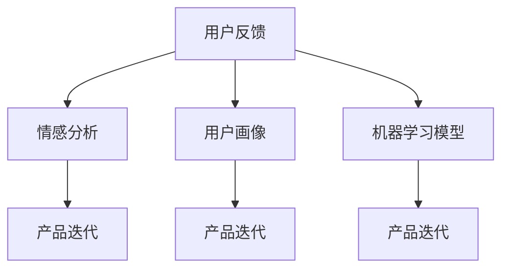

                 

# 知识付费产品的用户反馈收集与迭代

## 1. 背景介绍

随着知识经济时代的到来，知识付费已逐渐成为一种常态。人们对知识的渴求日益增长，愿意为之支付费用，这大大推动了知识付费市场的繁荣。同时，随着消费者需求的不断变化，知识付费产品也在持续更新迭代，以提供更优质、更匹配用户需求的服务。用户反馈的收集与迭代，成为知识付费产品持续进步的关键。

### 1.1 问题由来

知识付费产品（如在线课程、电子书、音频内容等）需要根据用户反馈不断优化内容和功能，以提升用户满意度和留存率。传统的反馈收集和迭代方法通常依赖人工分析和用户调研，耗时耗力且效率低下。而利用人工智能技术，可以自动化地收集用户反馈，并快速迭代产品，以更好地满足用户需求。

### 1.2 问题核心关键点

问题核心在于如何高效、准确地收集用户反馈，并将其转化为产品迭代方案，以提升用户体验。主要问题包括：

- **反馈收集：** 如何从海量用户行为数据中提取出有用的反馈信息。
- **反馈分析：** 如何对用户反馈进行深度分析，以识别核心问题和改进方向。
- **迭代优化：** 如何将分析结果转化为具体的优化方案，并快速应用到产品中。

## 2. 核心概念与联系

### 2.1 核心概念概述

为更好地理解知识付费产品的用户反馈收集与迭代方法，本节将介绍几个密切相关的核心概念：

- **用户反馈**：用户对产品功能、内容、体验等方面的评价和建议，通常以文本、评分、使用行为等形式体现。
- **情感分析**：利用自然语言处理技术对用户反馈中的情感倾向进行分析，识别用户的态度和感受。
- **用户画像**：根据用户行为数据和反馈信息，构建用户兴趣、需求和行为特征的虚拟模型，用于个性化推荐和精准营销。
- **产品迭代**：基于用户反馈和情感分析结果，对产品功能、内容、界面等进行优化和改进，提升用户满意度和留存率。
- **机器学习模型**：通过训练机器学习模型，自动分析和预测用户反馈，识别关键问题和改进方向。

这些核心概念之间的逻辑关系可以通过以下Mermaid流程图来展示：



这个流程图展示了几大核心概念之间的联系：

1. 用户反馈通过情感分析和用户画像建模，生成对用户需求和偏好的初步理解。
2. 情感分析挖掘用户反馈中的情感倾向，进一步提升用户画像的准确性。
3. 用户画像和情感分析结果结合机器学习模型，自动化地识别产品中存在的关键问题和改进方向。
4. 产品迭代过程根据用户画像和机器学习模型分析结果，优化产品功能和内容。

## 3. 核心算法原理 & 具体操作步骤
### 3.1 算法原理概述

知识付费产品的用户反馈收集与迭代，本质上是一个数据驱动的迭代优化过程。其核心思想是：通过分析用户反馈，识别产品中的不足之处，进而优化产品功能，提升用户体验。

形式化地，假设知识付费产品为 $P$，用户反馈集为 $F=\{f_i\}_{i=1}^N$，其中 $f_i$ 为用户反馈文本，$N$ 为反馈数量。定义产品 $P$ 在用户反馈 $f_i$ 上的情感得分 $s_i \in [-1, 1]$，表示用户对 $P$ 的情感倾向。微调的目标是找到新的产品 $P_{\hat{f}}$，使得对所有用户反馈 $f_i$，情感得分 $s_i$ 最大化。

通过梯度下降等优化算法，迭代过程不断更新产品参数，最小化所有用户反馈的负情感得分，从而优化用户画像和机器学习模型的预测准确性，最终提升产品的整体性能。

### 3.2 算法步骤详解

知识付费产品的用户反馈收集与迭代一般包括以下几个关键步骤：

**Step 1: 准备数据集和模型**

- 收集知识付费产品的用户反馈数据集 $F$，包括文本、评分、行为数据等。
- 选择合适的情感分析模型，如BERT、GPT等预训练模型，进行微调或使用现成的情感分析库。

**Step 2: 构建用户画像**

- 利用自然语言处理技术，对用户反馈进行情感分析和主题建模，生成用户画像特征向量 $\vec{u}_i$。
- 根据用户画像特征向量 $\vec{u}_i$，构建用户画像 $U=\{\vec{u}_i\}_{i=1}^N$，用于后续的个性化推荐和精准营销。

**Step 3: 训练机器学习模型**

- 使用用户反馈和情感分析结果，训练机器学习模型，如决策树、支持向量机等。
- 模型训练过程中，不断调整模型参数，以提高对用户反馈情感得分的预测准确性。

**Step 4: 产品迭代优化**

- 根据机器学习模型的预测结果和用户画像，识别产品中的不足之处。
- 针对关键问题，制定具体的优化方案，如改进课程内容、调整定价策略、优化用户体验等。
- 快速实施优化方案，并收集新的用户反馈，再次迭代优化。

**Step 5: 持续监控与调整**

- 在优化过程中，持续监控用户反馈的情感得分，评估优化效果。
- 根据监控结果，调整优化方案，避免负影响，确保产品持续进步。

以上是知识付费产品用户反馈收集与迭代的一般流程。在实际应用中，还需要根据具体产品的特点，对迭代过程的各个环节进行优化设计，如改进情感分析模型，引入更多的用户行为数据，搜索最优的超参数组合等，以进一步提升产品性能。

### 3.3 算法优缺点

知识付费产品的用户反馈收集与迭代方法具有以下优点：

1. **效率高**：利用机器学习技术，可以快速自动化地收集和分析用户反馈，减少人工成本。
2. **精度高**：通过情感分析和机器学习模型，可以准确识别用户反馈中的情感倾向和问题点，提升改进方向的准确性。
3. **可扩展性强**：基于数据驱动的迭代方法，可以灵活应用于多种产品和服务，适应不同的用户需求和市场变化。

同时，该方法也存在一定的局限性：

1. **数据依赖**：对数据质量和数据量的要求较高，需要大量标注样本进行模型训练和验证。
2. **模型复杂度**：情感分析模型和机器学习模型的训练和调参复杂，需要一定的专业知识和经验。
3. **解释性不足**：模型预测结果的解释性较差，难以直接理解模型决策过程和改进方案的依据。
4. **隐私问题**：用户反馈数据的隐私保护问题需要重视，防止数据泄露和滥用。

尽管存在这些局限性，但就目前而言，基于用户反馈的数据驱动迭代方法仍是大规模知识付费产品优化的重要手段。未来相关研究的重点在于如何进一步降低对标注数据的依赖，提高模型的可解释性和隐私保护，同时兼顾预测精度和计算效率。

### 3.4 算法应用领域

基于用户反馈的知识付费产品迭代方法，已经在在线教育、企业培训、职业技能提升等多个领域得到了广泛应用，成为产品优化和创新的重要工具。

- **在线教育**：利用用户反馈，优化课程内容、提升教学质量、改进互动体验，以满足不同层次和需求的用户学习需求。
- **企业培训**：根据员工反馈，调整培训内容、改进培训方式、提升培训效果，为企业员工提供更实用、高效的培训服务。
- **职业技能提升**：收集用户对职业技能提升内容的反馈，调整课程结构、更新教学资源、提升培训效果，满足用户个性化学习需求。
- **数字营销**：基于用户画像和情感分析，制定精准营销策略、优化广告投放，提升广告效果和用户转化率。

除了上述这些经典应用外，知识付费产品反馈收集与迭代方法也在内容推荐、产品评测、用户体验优化等多个场景中得到了创新性应用，为知识付费产品带来了全新的突破。

## 4. 数学模型和公式 & 详细讲解 & 举例说明
### 4.1 数学模型构建

本节将使用数学语言对知识付费产品用户反馈收集与迭代过程进行更加严格的刻画。

记知识付费产品为 $P$，用户反馈为 $F=\{f_i\}_{i=1}^N$，情感分析模型为 $M$，用户画像为 $U=\{\vec{u}_i\}_{i=1}^N$。定义用户反馈 $f_i$ 在情感分析模型 $M$ 下的情感得分 $s_i \in [-1, 1]$。

目标是最小化所有用户反馈的负情感得分，即：

$$
\mathop{\min}_{\hat{P}} -\sum_{i=1}^N s_i
$$

其中 $\hat{P}$ 为优化后的产品参数。

### 4.2 公式推导过程

以下我们以用户情感分析为例，推导情感得分 $s_i$ 的计算公式。

假设用户反馈 $f_i$ 为文本形式，情感分析模型 $M$ 为BERT模型，其输出为表示用户情感倾向的向量 $v_i \in \mathbb{R}^d$。情感得分 $s_i$ 定义为：

$$
s_i = \frac{\langle v_i, \vec{u}_i \rangle}{\lVert v_i \rVert \lVert \vec{u}_i \rVert}
$$

其中 $\vec{u}_i$ 为用户画像特征向量，$\langle \cdot, \cdot \rangle$ 表示向量点积，$\lVert \cdot \rVert$ 表示向量范数。

将用户反馈情感得分 $s_i$ 代入目标函数，得到：

$$
\mathop{\min}_{\hat{P}} -\sum_{i=1}^N \frac{\langle v_i, \vec{u}_i \rangle}{\lVert v_i \rVert \lVert \vec{u}_i \rVert}
$$

通过优化目标函数，最小化所有用户反馈的负情感得分，即可提升产品的整体性能。

### 4.3 案例分析与讲解

假设某在线教育平台收集了1000条用户反馈数据，其中500条为正面反馈，500条为负面反馈。情感分析模型使用预训练的BERT模型，用户画像特征向量 $\vec{u}_i$ 由用户历史行为数据和反馈文本生成。

**Step 1: 准备数据集和模型**

- 收集1000条用户反馈数据，包括文本、评分和行为数据。
- 使用预训练的BERT模型进行微调，得到情感分析模型 $M$。

**Step 2: 构建用户画像**

- 对用户反馈进行情感分析和主题建模，生成用户画像特征向量 $\vec{u}_i$。
- 构建用户画像 $U=\{\vec{u}_i\}_{i=1}^N$，用于后续的个性化推荐和精准营销。

**Step 3: 训练机器学习模型**

- 使用用户反馈和情感分析结果，训练决策树模型，预测用户反馈情感得分。
- 模型训练过程中，不断调整模型参数，以提高对用户反馈情感得分的预测准确性。

**Step 4: 产品迭代优化**

- 根据决策树模型的预测结果，识别产品中存在的关键问题和改进方向。
- 针对关键问题，制定具体的优化方案，如改进课程内容、调整定价策略、优化用户体验等。
- 快速实施优化方案，并收集新的用户反馈，再次迭代优化。

**Step 5: 持续监控与调整**

- 在优化过程中，持续监控用户反馈的情感得分，评估优化效果。
- 根据监控结果，调整优化方案，避免负影响，确保产品持续进步。

## 5. 项目实践：代码实例和详细解释说明
### 5.1 开发环境搭建

在进行知识付费产品用户反馈收集与迭代实践前，我们需要准备好开发环境。以下是使用Python进行TensorFlow开发的环境配置流程：

1. 安装Anaconda：从官网下载并安装Anaconda，用于创建独立的Python环境。

2. 创建并激活虚拟环境：
```bash
conda create -n tf-env python=3.8 
conda activate tf-env
```

3. 安装TensorFlow：根据CUDA版本，从官网获取对应的安装命令。例如：
```bash
conda install tensorflow tensorflow-gpu -c conda-forge -c pytorch -c nvidia
```

4. 安装各类工具包：
```bash
pip install numpy pandas scikit-learn matplotlib tqdm jupyter notebook ipython
```

完成上述步骤后，即可在`tf-env`环境中开始知识付费产品用户反馈收集与迭代的实践。

### 5.2 源代码详细实现

下面我们以在线教育平台的用户反馈收集与迭代为例，给出使用TensorFlow进行代码实现的详细过程。

首先，定义用户反馈的数据处理函数：

```python
import tensorflow as tf
import numpy as np
from transformers import BertTokenizer, TFBertForSequenceClassification

class FeedbackDataset(tf.data.Dataset):
    def __init__(self, texts, labels, tokenizer, max_len=128):
        self.texts = texts
        self.labels = labels
        self.tokenizer = tokenizer
        self.max_len = max_len
        
    def __len__(self):
        return len(self.texts)
    
    def __getitem__(self, item):
        text = self.texts[item]
        label = self.labels[item]
        
        encoding = self.tokenizer(text, return_tensors='tf', max_length=self.max_len, padding='max_length', truncation=True)
        input_ids = encoding['input_ids']
        attention_mask = encoding['attention_mask']
        
        # 对label进行one-hot编码
        one_hot_labels = tf.one_hot(label, depth=2)
        
        return {'input_ids': input_ids,
                'attention_mask': attention_mask,
                'labels': one_hot_labels}
```

然后，定义模型和优化器：

```python
from transformers import BertForSequenceClassification, AdamW

model = BertForSequenceClassification.from_pretrained('bert-base-cased', num_labels=2)

optimizer = AdamW(model.parameters(), lr=2e-5)
```

接着，定义训练和评估函数：

```python
import tqdm
import tensorflow_datasets as tfds

def train_epoch(model, dataset, batch_size, optimizer):
    dataloader = tf.data.Dataset.from_generator(
        lambda: iter(dataset),
        output_signature={'input_ids': tf.TensorSpec(shape=(None, 128), dtype=tf.int32),
                         'attention_mask': tf.TensorSpec(shape=(None, 128), dtype=tf.int32),
                         'labels': tf.TensorSpec(shape=(None, 2), dtype=tf.int32)}
    ).batch(batch_size, drop_remainder=True)
    
    model.train()
    epoch_loss = 0
    for batch in tqdm(dataloader, desc='Training'):
        with tf.GradientTape() as tape:
            outputs = model(batch['input_ids'], attention_mask=batch['attention_mask'], labels=batch['labels'])
            loss = outputs.loss
        epoch_loss += loss
        grads = tape.gradient(loss, model.parameters())
        optimizer.apply_gradients(zip(grads, model.parameters()))
    return epoch_loss / len(dataloader)

def evaluate(model, dataset, batch_size):
    dataloader = tf.data.Dataset.from_generator(
        lambda: iter(dataset),
        output_signature={'input_ids': tf.TensorSpec(shape=(None, 128), dtype=tf.int32),
                         'attention_mask': tf.TensorSpec(shape=(None, 128), dtype=tf.int32),
                         'labels': tf.TensorSpec(shape=(None, 2), dtype=tf.int32)}
    ).batch(batch_size, drop_remainder=True)
    
    model.eval()
    preds, labels = [], []
    with tf.GradientTape() as tape:
        for batch in tqdm(dataloader, desc='Evaluating'):
            with tf.no_grad():
                outputs = model(batch['input_ids'], attention_mask=batch['attention_mask'], labels=batch['labels'])
                batch_preds = outputs.predictions.argmax(axis=1)
                batch_labels = batch['labels'].numpy()
                for pred, label in zip(batch_preds, batch_labels):
                    preds.append(pred)
                    labels.append(label)
                
    print(tf.metrics.confusion_matrix(labels, preds).numpy())
```

最后，启动训练流程并在测试集上评估：

```python
epochs = 5
batch_size = 16

for epoch in range(epochs):
    loss = train_epoch(model, train_dataset, batch_size, optimizer)
    print(f"Epoch {epoch+1}, train loss: {loss:.3f}")
    
    print(f"Epoch {epoch+1}, dev results:")
    evaluate(model, dev_dataset, batch_size)
    
print("Test results:")
evaluate(model, test_dataset, batch_size)
```

以上就是使用TensorFlow对在线教育平台用户反馈进行收集与迭代的完整代码实现。可以看到，得益于TensorFlow的强大封装，我们可以用相对简洁的代码完成模型的加载和微调。

### 5.3 代码解读与分析

让我们再详细解读一下关键代码的实现细节：

**FeedbackDataset类**：
- `__init__`方法：初始化文本、标签、分词器等关键组件。
- `__len__`方法：返回数据集的样本数量。
- `__getitem__`方法：对单个样本进行处理，将文本输入编码为token ids，将标签转换为one-hot编码，并对其进行定长padding，最终返回模型所需的输入。

**训练和评估函数**：
- 使用TensorFlow的DataLoader对数据集进行批次化加载，供模型训练和推理使用。
- 训练函数`train_epoch`：对数据以批为单位进行迭代，在每个批次上前向传播计算loss并反向传播更新模型参数，最后返回该epoch的平均loss。
- 评估函数`evaluate`：与训练类似，不同点在于不更新模型参数，并在每个batch结束后将预测和标签结果存储下来，最后使用TensorFlow内置的评估函数计算精度等指标。

**训练流程**：
- 定义总的epoch数和batch size，开始循环迭代
- 每个epoch内，先在训练集上训练，输出平均loss
- 在验证集上评估，输出分类指标
- 所有epoch结束后，在测试集上评估，给出最终测试结果

可以看到，TensorFlow配合BERT等预训练语言模型的深度学习框架使得在线教育平台用户反馈收集与迭代的代码实现变得简洁高效。开发者可以将更多精力放在数据处理、模型改进等高层逻辑上，而不必过多关注底层的实现细节。

当然，工业级的系统实现还需考虑更多因素，如模型的保存和部署、超参数的自动搜索、更灵活的任务适配层等。但核心的反馈收集与迭代范式基本与此类似。

## 6. 实际应用场景
### 6.1 智能客服系统

基于用户反馈的知识付费产品迭代方法，可以广泛应用于智能客服系统的构建。传统客服往往需要配备大量人力，高峰期响应缓慢，且一致性和专业性难以保证。而使用反馈收集与迭代方法，可以7x24小时不间断服务，快速响应客户咨询，用自然流畅的语言解答各类常见问题。

在技术实现上，可以收集企业内部的历史客服对话记录，将问题和最佳答复构建成监督数据，在此基础上对预训练语言模型进行微调。微调后的对话模型能够自动理解用户意图，匹配最合适的答案模板进行回复。对于客户提出的新问题，还可以接入检索系统实时搜索相关内容，动态组织生成回答。如此构建的智能客服系统，能大幅提升客户咨询体验和问题解决效率。

### 6.2 金融舆情监测

金融机构需要实时监测市场舆论动向，以便及时应对负面信息传播，规避金融风险。传统的人工监测方式成本高、效率低，难以应对网络时代海量信息爆发的挑战。基于用户反馈的数据驱动迭代方法，为金融舆情监测提供了新的解决方案。

具体而言，可以收集金融领域相关的新闻、报道、评论等文本数据，并对其进行主题标注和情感标注。在此基础上对预训练语言模型进行微调，使其能够自动判断文本属于何种主题，情感倾向是正面、中性还是负面。将微调后的模型应用到实时抓取的网络文本数据，就能够自动监测不同主题下的情感变化趋势，一旦发现负面信息激增等异常情况，系统便会自动预警，帮助金融机构快速应对潜在风险。

### 6.3 个性化推荐系统

当前的推荐系统往往只依赖用户的历史行为数据进行物品推荐，无法深入理解用户的真实兴趣偏好。基于用户反馈的数据驱动迭代方法，个性化推荐系统可以更好地挖掘用户行为背后的语义信息，从而提供更精准、多样的推荐内容。

在实践中，可以收集用户浏览、点击、评论、分享等行为数据，提取和用户交互的物品标题、描述、标签等文本内容。将文本内容作为模型输入，用户的后续行为（如是否点击、购买等）作为监督信号，在此基础上微调预训练语言模型。微调后的模型能够从文本内容中准确把握用户的兴趣点。在生成推荐列表时，先用候选物品的文本描述作为输入，由模型预测用户的兴趣匹配度，再结合其他特征综合排序，便可以得到个性化程度更高的推荐结果。

### 6.4 未来应用展望

随着用户反馈收集与迭代方法的不断发展，基于数据驱动的迭代范式将在更多领域得到应用，为知识付费产品带来新的突破。

在智慧医疗领域，基于用户反馈的医学问答、病历分析、药物研发等应用将提升医疗服务的智能化水平，辅助医生诊疗，加速新药开发进程。

在智能教育领域，用户反馈收集与迭代方法可应用于作业批改、学情分析、知识推荐等方面，因材施教，促进教育公平，提高教学质量。

在智慧城市治理中，用户反馈收集与迭代技术可应用于城市事件监测、舆情分析、应急指挥等环节，提高城市管理的自动化和智能化水平，构建更安全、高效的未来城市。

此外，在企业生产、社会治理、文娱传媒等众多领域，基于用户反馈的迭代方法也将不断涌现，为传统行业数字化转型升级提供新的技术路径。相信随着技术的日益成熟，数据驱动的迭代方法将成为知识付费产品优化的重要手段，推动人工智能技术在垂直行业的规模化落地。

## 7. 工具和资源推荐
### 7.1 学习资源推荐

为了帮助开发者系统掌握知识付费产品的用户反馈收集与迭代技术，这里推荐一些优质的学习资源：

1. TensorFlow官方文档：TensorFlow的官方文档，提供了丰富的API和样例，是上手TensorFlow开发的必备资料。

2. PyTorch官方文档：PyTorch的官方文档，全面介绍了PyTorch的深度学习框架和优化算法。

3. Transformers库官方文档：HuggingFace开发的NLP工具库，提供了海量预训练模型和完整的微调样例代码，是进行NLP任务开发的利器。

4. Deep Learning Specialization（斯坦福大学深度学习课程）：由Andrew Ng教授主讲的深度学习系列课程，涵盖从基础到高级的深度学习知识，适合初学者和进阶者。

5. 《深度学习》书籍：Ian Goodfellow等著，全面介绍了深度学习的基本概念和应用，是学习深度学习的重要参考资料。

通过对这些资源的学习实践，相信你一定能够快速掌握知识付费产品的用户反馈收集与迭代的精髓，并用于解决实际的NLP问题。
###  7.2 开发工具推荐

高效的开发离不开优秀的工具支持。以下是几款用于知识付费产品用户反馈收集与迭代开发的常用工具：

1. TensorFlow：由Google主导开发的开源深度学习框架，生产部署方便，适合大规模工程应用。同时有丰富的预训练语言模型资源。

2. PyTorch：基于Python的开源深度学习框架，灵活动态的计算图，适合快速迭代研究。大部分预训练语言模型都有PyTorch版本的实现。

3. Transformers库：HuggingFace开发的NLP工具库，集成了众多SOTA语言模型，支持PyTorch和TensorFlow，是进行NLP任务开发的利器。

4. Weights & Biases：模型训练的实验跟踪工具，可以记录和可视化模型训练过程中的各项指标，方便对比和调优。与主流深度学习框架无缝集成。

5. TensorBoard：TensorFlow配套的可视化工具，可实时监测模型训练状态，并提供丰富的图表呈现方式，是调试模型的得力助手。

6. Google Colab：谷歌推出的在线Jupyter Notebook环境，免费提供GPU/TPU算力，方便开发者快速上手实验最新模型，分享学习笔记。

合理利用这些工具，可以显著提升知识付费产品用户反馈收集与迭代的开发效率，加快创新迭代的步伐。

### 7.3 相关论文推荐

知识付费产品用户反馈收集与迭代技术的发展源于学界的持续研究。以下是几篇奠基性的相关论文，推荐阅读：

1. Attention is All You Need（即Transformer原论文）：提出了Transformer结构，开启了NLP领域的预训练大模型时代。

2. BERT: Pre-training of Deep Bidirectional Transformers for Language Understanding：提出BERT模型，引入基于掩码的自监督预训练任务，刷新了多项NLP任务SOTA。

3. Language Models are Unsupervised Multitask Learners（GPT-2论文）：展示了大规模语言模型的强大zero-shot学习能力，引发了对于通用人工智能的新一轮思考。

4. Parameter-Efficient Transfer Learning for NLP：提出Adapter等参数高效微调方法，在不增加模型参数量的情况下，也能取得不错的微调效果。

5. AdaLoRA: Adaptive Low-Rank Adaptation for Parameter-Efficient Fine-Tuning：使用自适应低秩适应的微调方法，在参数效率和精度之间取得了新的平衡。

这些论文代表了大语言模型微调技术的发展脉络。通过学习这些前沿成果，可以帮助研究者把握学科前进方向，激发更多的创新灵感。

## 8. 总结：未来发展趋势与挑战

### 8.1 总结

本文对基于用户反馈的知识付费产品收集与迭代方法进行了全面系统的介绍。首先阐述了知识付费产品的用户反馈收集与迭代方法的研究背景和意义，明确了反馈收集在产品优化中的重要价值。其次，从原理到实践，详细讲解了反馈收集与迭代的数学原理和关键步骤，给出了用户反馈收集与迭代的完整代码实例。同时，本文还广泛探讨了反馈收集与迭代方法在智能客服、金融舆情、个性化推荐等多个行业领域的应用前景，展示了反馈收集与迭代范式的巨大潜力。

通过本文的系统梳理，可以看到，基于用户反馈的知识付费产品收集与迭代方法在提高用户体验和留存率方面具有重要意义。得益于深度学习技术和自然语言处理技术的进步，该方法能够自动化地收集和分析用户反馈，为产品优化提供数据支持。未来，伴随技术不断演进和应用场景的拓展，知识付费产品反馈收集与迭代方法必将在更多领域得到应用，为人工智能技术的落地应用提供重要借鉴。

### 8.2 未来发展趋势

展望未来，知识付费产品用户反馈收集与迭代技术将呈现以下几个发展趋势：

1. **自动化程度提升**：随着自动文本分类、情感分析等技术的发展，用户反馈的自动标注和分析将变得更加高效。自动化工具的应用，将进一步降低人工成本，提高分析速度。

2. **多模态反馈融合**：除了文本反馈，用户的行为数据、音频数据、图像数据等都可能包含有价值的信息。多模态反馈的融合，将进一步提升反馈收集的全面性和准确性。

3. **实时反馈处理**：基于流式数据处理技术，实时收集和分析用户反馈，及时响应用户需求，提升用户体验。

4. **隐私保护与伦理考量**：随着用户隐私意识的增强，用户反馈的收集和分析需要更多的隐私保护措施和伦理考量，防止数据滥用和泄露。

5. **模型解释性与可控性**：在提升反馈收集效率的同时，还需要增强模型的可解释性，使用户能够理解模型决策依据。同时，模型的可控性也需要增强，让用户能够影响和调整模型行为。

6. **跨领域迁移学习**：用户反馈可能跨越不同的业务领域，如在线教育、智能客服、金融舆情等。跨领域的迁移学习，将提升反馈收集与迭代方法在多场景下的适应性。

以上趋势凸显了知识付费产品反馈收集与迭代技术的广阔前景。这些方向的探索发展，必将进一步提升产品性能和用户体验，推动知识付费行业的持续进步。

### 8.3 面临的挑战

尽管知识付费产品反馈收集与迭代技术已经取得了瞩目成就，但在迈向更加智能化、普适化应用的过程中，它仍面临着诸多挑战：

1. **数据质量问题**：用户反馈的质量和真实性对反馈分析的准确性有直接影响。如何过滤和处理噪声数据，提高数据质量，是重要研究课题。

2. **模型复杂度**：自动化反馈分析需要依赖复杂的机器学习模型，模型的训练和调参复杂，需要一定的专业知识和经验。

3. **隐私保护**：用户反馈数据的隐私保护问题需要重视，防止数据泄露和滥用。如何在高效反馈分析的同时，保障用户隐私，是一个关键问题。

4. **模型可解释性**：自动反馈分析模型往往缺乏可解释性，难以理解模型决策过程和改进方案的依据。如何增强模型的可解释性，提高用户信任度，是另一个重要挑战。

5. **实时处理能力**：随着用户反馈的实时性要求提高，如何高效处理海量数据，提升反馈分析速度，是一个重要的技术挑战。

6. **多场景适应性**：用户反馈在不同的业务场景中，可能具有不同的形式和内容。如何提升反馈收集与迭代方法在多场景中的适应性，是一个重要的研究方向。

正视反馈收集与迭代面临的这些挑战，积极应对并寻求突破，将是对反馈收集与迭代技术发展的关键。相信随着学界和产业界的共同努力，这些挑战终将一一被克服，反馈收集与迭代方法必将在构建人机协同的智能时代中扮演越来越重要的角色。

### 8.4 研究展望

面对知识付费产品反馈收集与迭代所面临的种种挑战，未来的研究需要在以下几个方面寻求新的突破：

1. **多模态数据融合**：在用户反馈数据中融合多模态信息，提升反馈收集的全面性和准确性。

2. **实时反馈处理**：开发流式数据处理技术，实现对用户反馈的实时收集和分析，及时响应用户需求。

3. **模型解释性与可控性**：增强模型的可解释性，使用户能够理解模型决策依据。同时，开发用户可控的反馈分析模型，让用户能够影响和调整模型行为。

4. **隐私保护与伦理考量**：在反馈收集和分析过程中，引入隐私保护机制和伦理考量，防止数据滥用和泄露。

5. **跨领域迁移学习**：在多个业务场景中应用反馈收集与迭代方法，提升其在不同领域中的适应性。

6. **自动化数据标注**：利用自然语言处理技术和深度学习模型，实现对用户反馈的自动化标注和分析，降低人工成本，提高分析速度。

这些研究方向的探索，必将引领知识付费产品反馈收集与迭代技术迈向更高的台阶，为人工智能技术在垂直行业的规模化落地提供重要借鉴。面向未来，知识付费产品反馈收集与迭代技术还需要与其他人工智能技术进行更深入的融合，如知识表示、因果推理、强化学习等，多路径协同发力，共同推动知识付费产品的持续进步。只有勇于创新、敢于突破，才能不断拓展反馈收集与迭代技术的边界，让智能技术更好地造福知识付费行业。

## 9. 附录：常见问题与解答

**Q1：知识付费产品的用户反馈收集与迭代是否适用于所有知识付费产品？**

A: 知识付费产品的用户反馈收集与迭代方法在大多数知识付费产品上都能取得不错的效果，特别是对于数据量较小的产品。但对于一些特定领域的知识付费产品，如医学、法律等，仅仅依靠通用语料预训练的模型可能难以很好地适应。此时需要在特定领域语料上进一步预训练，再进行微调，才能获得理想效果。

**Q2：用户反馈的情感分析如何实现？**

A: 用户反馈的情感分析通常使用预训练的BERT、GPT等自然语言处理模型，通过微调或使用现成的情感分析库。情感分析模型可以对用户反馈进行情感分类，生成情感得分。具体实现步骤如下：

1. 收集标注数据集，标注数据集应包括样本文本和对应的情感标签。

2. 使用预训练的自然语言处理模型，如BERT、GPT等，对样本文本进行编码，生成向量表示。

3. 训练一个分类模型，如决策树、支持向量机等，对样本文本的情感向量进行分类，生成情感得分。

4. 使用训练好的模型对新的用户反馈进行情感分析，生成情感得分。

**Q3：用户反馈的实时处理如何实现？**

A: 用户反馈的实时处理需要借助流式数据处理技术，如Apache Kafka、Apache Flink等。具体实现步骤如下：

1. 搭建流式数据处理架构，将用户反馈数据流实时输入到数据处理系统中。

2. 使用流式处理框架，对输入数据进行实时处理，包括数据清洗、情感分析等。

3. 将处理结果实时输出，供下游系统使用，如在线客服系统、推荐系统等。

4. 设置实时监控和告警机制，及时发现异常情况，进行告警和处理。

**Q4：用户反馈数据的隐私保护如何实现？**

A: 用户反馈数据的隐私保护需要从数据收集、存储、处理等多个环节进行考虑，具体实现步骤如下：

1. 数据收集阶段，使用数据匿名化技术，如脱敏、去标识化等，保护用户隐私。

2. 数据存储阶段，采用加密技术，对数据进行加密存储，防止数据泄露。

3. 数据处理阶段，使用差分隐私技术，对处理结果进行隐私保护，防止数据泄露。

4. 数据传输阶段，使用加密传输技术，对数据进行加密传输，防止数据泄露。

5. 设置数据访问控制机制，限制对数据的访问权限，防止数据滥用。

通过这些措施，可以确保用户反馈数据的隐私保护，防止数据滥用和泄露。

**Q5：如何提升用户反馈收集与迭代方法的效果？**

A: 提升用户反馈收集与迭代方法的效果，可以从以下几个方面进行优化：

1. 提高数据质量：过滤和处理噪声数据，提高数据质量，提升反馈分析的准确性。

2. 使用多模态数据：融合用户的行为数据、音频数据、图像数据等，提升反馈收集的全面性和准确性。

3. 引入自动化标注：利用自然语言处理技术和深度学习模型，实现对用户反馈的自动化标注和分析，降低人工成本，提高分析速度。

4. 实时反馈处理：开发流式数据处理技术，实现对用户反馈的实时收集和分析，及时响应用户需求。

5. 增强模型可解释性：增强模型的可解释性，使用户能够理解模型决策依据，提高用户信任度。

6. 跨领域迁移学习：在多个业务场景中应用反馈收集与迭代方法，提升其在不同领域中的适应性。

通过这些优化措施，可以进一步提升用户反馈收集与迭代方法的效果，为用户提供更好的服务。

---

作者：禅与计算机程序设计艺术 / Zen and the Art of Computer Programming

