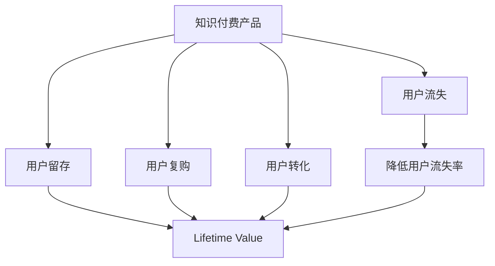

                 

# 知识付费产品的用户留存与复购策略

在当前知识付费的浪潮中，越来越多的企业和个人通过提供专业、高质量的内容获取收入。然而，随着市场竞争的加剧，用户留存和复购成为了知识付费产品持续发展的关键。本文将深入探讨知识付费产品用户留存与复购的策略，帮助行业从业者优化产品设计、提升用户体验，从而实现可持续增长。

## 1. 背景介绍

### 1.1 问题由来
随着互联网的普及和信息技术的快速发展，用户获取知识的方式越来越多样化。知识付费产品作为一种新型的知识获取方式，凭借其高效、专业的特点，迅速吸引了大量用户。然而，相较于传统的免费内容，知识付费产品的边际成本高、用户需求多变，因此用户留存和复购问题是知识付费领域的一大挑战。

### 1.2 问题核心关键点
知识付费产品的用户留存与复购涉及多个方面，包括用户心理、产品设计、市场策略、技术实现等。从用户心理角度，需要满足用户的学习需求，增强用户粘性；从产品设计角度，需要提升产品的互动性和吸引力；从市场策略角度，需要制定有效的用户增长和维护策略；从技术实现角度，需要构建用户行为分析系统，及时响应用户需求。

## 2. 核心概念与联系

### 2.1 核心概念概述

为了更好地理解知识付费产品的用户留存与复购策略，本节将介绍几个密切相关的核心概念：

- **知识付费产品(Knowledge Paywall)：** 指用户需支付一定费用以获取专业、深度知识内容的平台或应用。常见的知识付费产品包括在线课程、电子书、音频订阅、专家咨询等。

- **用户留存(User Retention)：** 指用户在首次付费后，持续使用产品并继续付费的比率。留存率是衡量知识付费产品成功的重要指标。

- **用户复购(Reengagement)：** 指用户在初次购买后，再次进行购买的比率。复购率是衡量用户忠诚度和产品吸引力的关键指标。

- **用户转化(Funnel Conversion)：** 指将潜在用户转化为付费用户的比例。通过优化转化流程和策略，可以提升产品市场覆盖率和用户获取效率。

- **用户流失(Churn)：** 指用户停止使用产品或不再付费的比率。防止用户流失是知识付费产品的重要目标。

- **终身价值(Lifetime Value, LTV)：** 指用户在产品生命周期内预计产生的总收益。通过提升LTV，可以增强公司的财务稳定性。

这些核心概念之间通过以下Mermaid流程图展示它们的联系：



这个流程图展示了一系列关键指标之间的逻辑关系：

1. 知识付费产品是用户留存、复购、转化的起点。
2. 用户留存和复购率直接影响产品的盈利能力和用户满意度。
3. 通过提升用户转化率和减少流失率，可以最大化LTV，增强公司财务稳定。

## 3. 核心算法原理 & 具体操作步骤
### 3.1 算法原理概述

知识付费产品的用户留存与复购策略，本质上是通过优化用户体验、提升产品价值、实施有效的市场策略，以增强用户粘性，提升用户生命周期价值。

形式化地，假设知识付费产品用户数量为 $U$，每次付费金额为 $C$，用户留存率为 $R$，复购率为 $r$，用户转化率为 $T$，流失率为 $L$，用户生命周期为 $T_{life}$。则知识付费产品的总收益（Lifetime Value）为：

$$
LTV = U \times C \times R \times r \times T \times T_{life}
$$

用户留存与复购的优化目标是最小化流失率 $L$，最大化留存率 $R$ 和复购率 $r$，以及转化率 $T$。

### 3.2 算法步骤详解

基于上述目标，知识付费产品的用户留存与复购策略可以分为以下几个关键步骤：

**Step 1: 用户行为分析**
- 收集用户行为数据，包括购买记录、学习进度、活跃时间等，利用统计学方法分析用户特征和行为模式。

**Step 2: 设计用户激励机制**
- 设计多种用户激励机制，如积分系统、优惠券、会员特权等，以提升用户粘性和复购率。

**Step 3: 优化用户体验**
- 提升产品界面设计、内容质量和互动性，使用户使用产品时感到愉悦和满足。

**Step 4: 实施个性化推荐**
- 利用推荐系统算法，根据用户历史行为和偏好，提供个性化内容推荐，提升用户体验和满意度。

**Step 5: 开展营销活动**
- 定期开展各类营销活动，如限时优惠、用户体验反馈调查等，增加用户粘性。

**Step 6: 持续优化产品**
- 根据用户反馈和行为数据，持续优化产品功能和内容，保持产品的竞争力。

### 3.3 算法优缺点

知识付费产品的用户留存与复购策略具有以下优点：
1. 提升用户满意度。通过优化用户体验和提供个性化服务，提升用户满意度和忠诚度。
2. 增加用户粘性。通过激励机制和个性化推荐，增加用户使用频率和复购率。
3. 增加市场覆盖率。通过有效的市场策略和营销活动，扩大产品市场覆盖面，增加用户获取效率。
4. 提升用户转化率。通过优化产品功能和内容，降低用户流失率，提高用户转化率。

同时，该策略也存在以下局限性：
1. 需要持续投入。为了维持产品竞争力和用户粘性，需要不断投入人力和资源。
2. 用户需求多变。用户需求和兴趣点随着时间推移而变化，需要不断调整策略以适应新趋势。
3. 数据隐私问题。在收集和分析用户数据时，需要严格遵守数据隐私法规，避免侵犯用户隐私。
4. 模型复杂性。个性化推荐和用户行为分析模型的设计复杂，需要具备专业的数据科学知识。

尽管存在这些局限性，但就目前而言，用户留存与复购策略仍是知识付费产品开发和运营的关键。通过合理应用这些策略，可以有效提升用户留存率和复购率，为知识付费产品带来长期收益。

### 3.4 算法应用领域

知识付费产品的用户留存与复购策略，在众多领域得到广泛应用，例如：

- 在线教育：通过优化课程内容和教学方式，提升用户满意度和复购率。
- 专业咨询：提供个性化咨询服务，满足用户多样化需求。
- 技术支持：提供技术支持和问题解决，增强用户粘性。
- 心理健康：提供心理健康咨询和治疗，提升用户满意度。
- 职业技能培训：提供职业技能提升课程，帮助用户职业发展。

除了上述这些经典应用外，知识付费产品还扩展到更多场景中，如文化娱乐、财经金融、健康生活等，为不同领域的知识需求提供解决方案。

## 4. 数学模型和公式 & 详细讲解  
### 4.1 数学模型构建

为了更好地理解知识付费产品用户留存与复购的策略，本节将使用数学语言对相关模型进行更加严格的刻画。

设知识付费产品共有 $N$ 个用户，每个用户每月付费金额为 $C$，用户留存率为 $R$，复购率为 $r$，用户转化率为 $T$，流失率为 $L$，用户生命周期为 $T_{life}$。则知识付费产品的总收益（Lifetime Value）可以表示为：

$$
LTV = \sum_{i=1}^{N} C \times \left( \sum_{j=0}^{T_{life}-1} R^j \times r^j \times T^j \times (1-L)^{T_{life}-j-1} \right)
$$

其中，$\sum_{i=1}^{N} C$ 表示用户总付费金额，$\sum_{j=0}^{T_{life}-1} R^j \times r^j \times T^j \times (1-L)^{T_{life}-j-1}$ 表示每个用户在生命周期内期望的复购次数和留存概率。

### 4.2 公式推导过程

我们以用户复购模型为例，推导复购率的计算公式。

假设知识付费产品的用户初始复购率为 $r$，用户复购概率与用户购买时间成正相关。用户在第 $t$ 个月复购的概率为 $P_t$，则有：

$$
P_t = r \times (1-r)^{t-1}
$$

根据马尔可夫链模型，用户在第 $t$ 个月的复购概率为：

$$
P_t = \sum_{i=0}^{t-1} (r \times (1-r)^{i})^{t-1-i}
$$

将 $t$ 扩展到 $T_{life}$，得到用户在整个生命周期内的复购次数为：

$$
R = \sum_{t=1}^{T_{life}} P_t = \sum_{t=1}^{T_{life}} \sum_{i=0}^{t-1} (r \times (1-r)^{i})^{t-1-i}
$$

通过数学推导，我们得到了用户复购率的计算公式，可以帮助知识付费产品评估和预测用户复购行为。

### 4.3 案例分析与讲解

以下我们以在线教育平台为例，给出用户复购率的实际计算案例。

假设在线教育平台共有 10,000 个用户，每个用户每月付费 100 元。用户初始复购率为 0.5，用户在第一个月复购的概率为 0.5，之后每月的复购概率依次下降 0.1。用户生命周期为 12 个月，流失率为 0.1。根据复购率计算公式，我们可以得到每个用户在生命周期内的复购次数为：

$$
R = 0.5 \times (1-0.1)^0 + 0.5 \times 0.1 \times (1-0.1)^1 + \ldots + 0.5 \times (0.1)^{11} \times (1-0.1)^{1} = 0.97
$$

即每个用户平均复购 9.7 次。通过这个计算，平台可以估算出用户生命周期内的总收益，优化定价策略和用户留存方案。

## 5. 项目实践：代码实例和详细解释说明
### 5.1 开发环境搭建

在进行用户留存与复购策略实践前，我们需要准备好开发环境。以下是使用Python进行数据分析的开发环境配置流程：

1. 安装Anaconda：从官网下载并安装Anaconda，用于创建独立的Python环境。

2. 创建并激活虚拟环境：
```bash
conda create -n analytics-env python=3.8 
conda activate analytics-env
```

3. 安装必要的库：
```bash
conda install pandas numpy matplotlib seaborn
```

4. 安装第三方库：
```bash
pip install beautifulsoup4 scikit-learn joblib
```

完成上述步骤后，即可在`analytics-env`环境中开始数据分析和计算。

### 5.2 源代码详细实现

下面我们以用户留存率分析为例，给出使用Python进行数据分析的代码实现。

首先，定义数据处理函数：

```python
import pandas as pd

def load_data(file_path):
    data = pd.read_csv(file_path)
    return data

def process_data(data):
    # 数据清洗和预处理
    data.dropna(inplace=True)
    data['time'] = pd.to_datetime(data['time'], format='%Y-%m-%d %H:%M:%S')
    data.set_index('user_id', inplace=True)
    return data

def calculate_retention_rate(data, lookback_period=30):
    # 计算用户留存率
    retention_rate = []
    for user_id in data.index:
        last_purchase_time = data.at[user_id, 'time'].max()
        user_last_month = data.at[user_id, 'time'].max().strftime('%Y-%m-%d %H:%M:%S').split(' ')[0]
        last_purchase_time = pd.to_datetime(last_purchase_time)
        monthly_retention = []
        for i in range(lookback_period, 0, -1):
            last_n_month = last_purchase_time - pd.DateOffset(months=i)
            if data.index.get_loc(user_id) == data.index.get_loc(last_n_month):
                monthly_retention.append(i)
            else:
                break
        retention_rate.append(len(monthly_retention) / lookback_period)
    return retention_rate

# 加载数据
data = load_data('user_data.csv')

# 数据处理
data = process_data(data)

# 计算留存率
retention_rate = calculate_retention_rate(data)
```

然后，绘制用户留存率曲线：

```python
import matplotlib.pyplot as plt

plt.plot(range(1, len(retention_rate) + 1), retention_rate)
plt.xlabel('Months')
plt.ylabel('Retention Rate')
plt.title('User Retention Rate Over Time')
plt.show()
```

最后，进行用户复购率计算：

```python
def calculate_churn_rate(data, lookback_period=30):
    # 计算用户流失率
    churn_rate = []
    for user_id in data.index:
        last_purchase_time = data.at[user_id, 'time'].max()
        user_last_month = data.at[user_id, 'time'].max().strftime('%Y-%m-%d %H:%M:%S').split(' ')[0]
        last_purchase_time = pd.to_datetime(last_purchase_time)
        monthly_churn = []
        for i in range(lookback_period, 0, -1):
            last_n_month = last_purchase_time - pd.DateOffset(months=i)
            if data.index.get_loc(user_id) == data.index.get_loc(last_n_month):
                monthly_churn.append(i)
            else:
                break
        churn_rate.append(len(monthly_churn) / lookback_period)
    return churn_rate

# 计算流失率
churn_rate = calculate_churn_rate(data)

# 绘制流失率曲线
plt.plot(range(1, len(churn_rate) + 1), churn_rate)
plt.xlabel('Months')
plt.ylabel('Churn Rate')
plt.title('User Churn Rate Over Time')
plt.show()
```

以上就是使用Python进行数据分析的代码实现。可以看到，通过简单的代码编写，我们可以快速计算和可视化用户留存率和流失率的变化趋势，从而找到用户行为变化的关键点。

### 5.3 代码解读与分析

让我们再详细解读一下关键代码的实现细节：

**load_data函数**：
- 用于加载数据集，返回处理后的Pandas DataFrame。

**process_data函数**：
- 对数据进行清洗和预处理，包括去除缺失值、转换日期格式、设置用户ID为索引等。

**calculate_retention_rate函数**：
- 根据用户最后购买时间和看回期，计算用户留存率。看回期是指从最后购买时间开始往前计算的月份数，用于评估用户在指定时间范围内的留存情况。

**calculate_churn_rate函数**：
- 根据用户最后购买时间和看回期，计算用户流失率。看回期是指从最后购买时间开始往前计算的月份数，用于评估用户在指定时间范围内的流失情况。

这些函数展示了如何通过Python进行用户留存与复购数据的处理和分析。在实际应用中，还需要结合更多业务逻辑和数据科学方法，进一步优化留存与复购策略。

## 6. 实际应用场景
### 6.1 智能客服系统

基于用户留存与复购策略，智能客服系统可以显著提升用户满意度和留存率。通过分析用户的互动记录和反馈，智能客服系统可以预测用户流失风险，及时采取干预措施，如提供个性化服务、调整客服流程等，从而降低用户流失率。

### 6.2 电商平台

在电商平台中，用户留存与复购策略可以提升用户粘性和购物体验。通过推荐系统算法，电商平台可以提供个性化商品推荐，增加用户复购率。同时，通过用户行为分析，电商平台可以识别出流失用户，采取优惠活动或提高用户体验等措施，降低用户流失率。

### 6.3 健康管理应用

健康管理应用可以借助用户留存与复购策略，提升用户健康管理和慢性病管理的效果。通过分析用户的使用行为和健康数据，健康管理应用可以提供个性化的健康建议，增强用户粘性。同时，通过定期的健康评估和反馈机制，应用可以及时发现用户健康变化，采取干预措施，降低用户流失率。

### 6.4 未来应用展望

随着用户留存与复购策略的不断优化和应用，未来的知识付费产品将更加智能化和个性化。基于人工智能和大数据分析，产品可以更加精准地预测用户需求，提供更加个性化的服务，提升用户满意度和留存率。

在智慧城市、智能家居、在线教育等领域，用户留存与复购策略将进一步得到应用和创新。通过数据驱动的决策制定，企业可以更有效地管理用户资源，提升产品竞争力和市场份额。

## 7. 工具和资源推荐
### 7.1 学习资源推荐

为了帮助开发者系统掌握用户留存与复购策略的理论基础和实践技巧，这里推荐一些优质的学习资源：

1. **《数据科学导论》（Introduction to Data Science）**：介绍数据科学的基础知识和常用工具，适合初学者入门。

2. **《Python数据分析》（Python Data Analysis）**：详细讲解Python数据处理和分析的方法和技巧，适合数据科学家使用。

3. **《用户行为分析》（User Behavior Analysis）**：介绍用户行为分析的理论基础和实践方法，帮助产品开发者设计更好的用户体验。

4. **《深度学习理论与实践》（Deep Learning Theory and Practice）**：讲解深度学习模型的原理和应用，适合深度学习从业者使用。

5. **《数据科学实战》（Data Science in Action）**：结合实际案例，讲解数据科学在各个行业的应用，帮助开发者掌握数据驱动的决策制定方法。

通过对这些资源的学习实践，相信你一定能够快速掌握用户留存与复购策略的精髓，并用于解决实际的业务问题。

### 7.2 开发工具推荐

高效的开发离不开优秀的工具支持。以下是几款用于用户留存与复购分析开发的常用工具：

1. **Python**：Python是数据科学和机器学习领域的主流编程语言，具备丰富的数据处理和分析库。

2. **Jupyter Notebook**：Jupyter Notebook是一个交互式开发环境，支持Python、R、Scala等多种编程语言，适合数据科学家和开发者使用。

3. **SQL**：SQL是关系型数据库的标准查询语言，适合数据存储和分析。

4. **Power BI**：Power BI是微软推出的商业智能工具，支持数据可视化和大数据分析，适合企业数据决策使用。

5. **Tableau**：Tableau是一款流行的数据可视化工具，支持实时数据可视化和大数据分析，适合数据分析师使用。

合理利用这些工具，可以显著提升用户留存与复购分析的开发效率，加快创新迭代的步伐。

### 7.3 相关论文推荐

用户留存与复购策略的研究源于学界的持续研究。以下是几篇奠基性的相关论文，推荐阅读：

1. **《用户留存预测模型研究》（User Retention Prediction Model）**：提出基于机器学习的方法，预测用户流失风险，降低用户流失率。

2. **《个性化推荐系统》（Personalized Recommendation System）**：介绍个性化推荐系统的理论基础和应用方法，帮助电商平台提升用户复购率。

3. **《智能客服系统设计与实现》（Design and Implementation of Intelligent Customer Service System）**：介绍智能客服系统的设计原理和用户留存策略，提升用户满意度和留存率。

4. **《健康管理应用用户留存分析》（User Retention Analysis in Health Management App）**：通过分析用户行为数据，提升健康管理应用的用户留存率。

5. **《用户流失率建模》（Modeling of User Churn Rate）**：介绍用户流失率的建模方法和应用场景，帮助企业降低用户流失率。

这些论文代表了大数据和人工智能在用户留存与复购策略中的应用前景，通过学习这些前沿成果，可以帮助研究者把握学科前进方向，激发更多的创新灵感。

## 8. 总结：未来发展趋势与挑战
### 8.1 总结

本文对知识付费产品的用户留存与复购策略进行了全面系统的介绍。首先阐述了知识付费产品用户留存与复购的重要性和挑战，明确了策略优化在产品开发和运营中的核心地位。其次，从原理到实践，详细讲解了用户留存与复购的数学模型和操作步骤，给出了用户留存与复购分析的完整代码实例。同时，本文还广泛探讨了用户留存与复购策略在多个行业领域的应用前景，展示了策略优化的巨大潜力。此外，本文精选了相关学习资源，力求为读者提供全方位的技术指引。

通过本文的系统梳理，可以看到，用户留存与复购策略是知识付费产品持续发展的关键，也是企业提升市场竞争力的重要手段。只有不断优化用户体验、提升产品价值、实施有效的市场策略，才能实现知识付费产品的可持续发展。

### 8.2 未来发展趋势

展望未来，用户留存与复购策略将呈现以下几个发展趋势：

1. **自动化和智能化**：随着人工智能和大数据分析技术的发展，用户留存与复购策略将更加智能化和自动化，能够更加精准地预测用户行为和需求。

2. **多渠道融合**：用户行为数据不仅仅来源于平台内部，还可以来自社交媒体、外部数据源等多渠道。通过融合多渠道数据，可以更全面地分析用户行为，提升策略效果。

3. **个性化推荐**：基于用户行为数据和个性化算法，推荐系统可以更加精准地推荐产品和服务，提升用户满意度和复购率。

4. **跨平台协同**：不同平台之间通过数据共享和协同，可以更好地了解用户在不同场景下的行为和需求，提升跨平台的用户留存和复购率。

5. **实时响应**：通过实时数据分析和决策，可以在用户行为变化时及时调整策略，提升用户留存和复购效果。

6. **客户生命周期管理**：从用户获取、转化、留存到流失的整个过程进行全面的管理，提升客户生命周期的价值。

这些趋势凸显了用户留存与复购策略的广阔前景。未来的策略优化，需要通过更加智能、全面、个性化的方法，提升用户满意度和留存率，实现产品的可持续发展。

### 8.3 面临的挑战

尽管用户留存与复购策略已经取得了一定的成效，但在迈向更加智能化、普适化应用的过程中，它仍面临诸多挑战：

1. **数据隐私问题**：在收集和分析用户数据时，需要严格遵守数据隐私法规，避免侵犯用户隐私。

2. **用户需求多变**：用户需求和兴趣点随着时间推移而变化，需要不断调整策略以适应新趋势。

3. **模型复杂性**：个性化推荐和用户行为分析模型的设计复杂，需要具备专业的数据科学知识。

4. **实时响应能力**：实时数据分析和决策需要高效的计算资源和算法，需要不断优化计算能力和算法模型。

5. **用户反馈机制**：有效的用户反馈机制是策略优化的重要环节，需要通过问卷调查、用户评价等方式获取真实反馈。

6. **市场竞争激烈**：用户留存与复购策略的优化需要持续投入资源和人力，面临市场竞争的挑战。

这些挑战需要企业和开发者共同努力，不断创新和优化，才能实现用户留存与复购策略的长期成功。

### 8.4 研究展望

面对用户留存与复购策略所面临的种种挑战，未来的研究需要在以下几个方面寻求新的突破：

1. **多模态数据分析**：结合图像、视频、文本等多模态数据，提升用户行为分析和预测的准确性。

2. **因果推断**：引入因果推断方法，分析用户行为背后的因果关系，提升策略的科学性和可靠性。

3. **跨领域迁移**：将用户行为分析方法应用于不同领域和场景，提升策略的普适性和泛化能力。

4. **模型压缩和优化**：通过模型压缩和优化技术，提升策略实施的效率和实时性。

5. **强化学习**：结合强化学习算法，优化用户留存与复购策略，实现动态调整和优化。

6. **伦理和道德**：在设计用户留存与复购策略时，考虑伦理和道德因素，避免对用户的不利影响。

这些研究方向将引领用户留存与复购策略向更高层次发展，为知识付费产品提供更加智能、全面、个性化的用户管理方案。面向未来，用户留存与复购策略需要与其他人工智能技术进行更深入的融合，共同推动知识付费产品的进步和创新。

## 9. 附录：常见问题与解答
**Q1：用户留存与复购策略是否可以适用于所有知识付费产品？**

A: 用户留存与复购策略可以适用于大多数知识付费产品，特别是那些具有用户互动和个性化推荐功能的平台。对于那些主要依赖单次购买的服务，如一次性软件购买等，用户留存与复购策略可能效果有限。

**Q2：如何衡量用户留存与复购策略的效果？**

A: 用户留存与复购策略的效果可以通过以下指标衡量：
- 用户留存率：指用户在一定时间内的留存情况，通常以月度或季度为单位。
- 复购率：指用户在一定时间内再次购买的比率，通常以月度或季度为单位。
- 用户流失率：指用户停止使用产品或不再购买的比率，通常以月度或季度为单位。
- 用户转化率：指将潜在用户转化为付费用户的比例，通常以月度或季度为单位。
- 用户生命周期价值（Lifetime Value, LTV）：指用户在产品生命周期内预计产生的总收益，通常以年度为单位。

这些指标可以帮助企业全面评估用户留存与复购策略的效果，从而优化策略方案。

**Q3：用户留存与复购策略的实施难点是什么？**

A: 用户留存与复购策略的实施难点主要在于：
1. 数据隐私问题：在收集和分析用户数据时，需要严格遵守数据隐私法规，避免侵犯用户隐私。
2. 用户需求多变：用户需求和兴趣点随着时间推移而变化，需要不断调整策略以适应新趋势。
3. 模型复杂性：个性化推荐和用户行为分析模型的设计复杂，需要具备专业的数据科学知识。
4. 实时响应能力：实时数据分析和决策需要高效的计算资源和算法，需要不断优化计算能力和算法模型。
5. 用户反馈机制：有效的用户反馈机制是策略优化的重要环节，需要通过问卷调查、用户评价等方式获取真实反馈。

这些难点需要通过技术创新和管理优化，不断突破，才能实现用户留存与复购策略的长期成功。

**Q4：用户留存与复购策略有哪些实施方法？**

A: 用户留存与复购策略的实施方法包括：
1. 设计用户激励机制：如积分系统、优惠券、会员特权等，以提升用户粘性和复购率。
2. 优化用户体验：提升产品界面设计、内容质量和互动性，使用户使用产品时感到愉悦和满足。
3. 实施个性化推荐：利用推荐系统算法，根据用户历史行为和偏好，提供个性化内容推荐，提升用户体验和满意度。
4. 开展营销活动：定期开展各类营销活动，如限时优惠、用户体验反馈调查等，增加用户粘性。
5. 持续优化产品：根据用户反馈和行为数据，持续优化产品功能和内容，保持产品的竞争力。

这些方法可以帮助企业实现用户留存与复购策略，提升用户满意度和留存率。

**Q5：用户留存与复购策略的应用场景有哪些？**

A: 用户留存与复购策略的应用场景包括：
1. 在线教育：通过优化课程内容和教学方式，提升用户满意度和复购率。
2. 专业咨询：提供个性化咨询服务，满足用户多样化需求。
3. 技术支持：提供技术支持和问题解决，增强用户粘性。
4. 心理健康：提供心理健康咨询和治疗，提升用户满意度。
5. 职业技能培训：提供职业技能提升课程，帮助用户职业发展。

这些场景展示了用户留存与复购策略的广泛应用，为不同领域的知识需求提供解决方案。

---

作者：禅与计算机程序设计艺术 / Zen and the Art of Computer Programming

